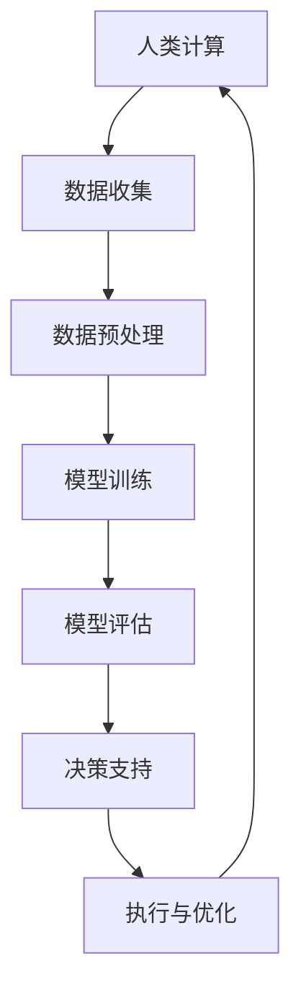

                 

关键词：人工智能，计算，可持续发展，未来，技术进步，人机协同，算法优化，数学模型，代码实例，应用场景

> 摘要：随着人工智能技术的飞速发展，人类计算的能力正发生着深刻的变革。本文将探讨AI与人类计算的融合，如何助力实现可持续发展目标。通过深入分析核心算法原理、数学模型构建、项目实践及实际应用场景，文章旨在为读者提供一个全面的视角，理解AI技术在未来社会中的重要作用。

## 1. 背景介绍

在21世纪，人工智能（AI）已经成为科技领域的热点，其发展速度和应用范围都超出了人们的预期。AI的崛起，不仅改变了我们的生活方式，也正在对各行各业产生深远影响。然而，随着AI技术的进步，我们也面临一系列挑战，如数据隐私、伦理道德、就业问题等。

与此同时，可持续发展成为全球关注的焦点。为了实现这一目标，我们需要更加高效和智能的解决方案，这离不开AI技术的支持。AI与人类计算的融合，不仅能够提高工作效率，还能帮助我们更好地解决复杂问题，实现可持续发展。

## 2. 核心概念与联系

### 2.1. 人工智能的定义

人工智能是指通过计算机程序实现的智能行为，使其能够在特定领域内模仿甚至超越人类的智能表现。AI的核心目标是让计算机具备学习、推理、决策和适应环境的能力。

### 2.2. 人类计算的概念

人类计算是指人类在解决问题和处理信息时所使用的方法和过程。这种计算方式具有灵活性、创造性和情感化等特点。

### 2.3. AI与人类计算的融合

AI与人类计算的融合，指的是将人工智能技术应用于人类计算的过程中，以实现人机协同、优势互补。这种融合能够充分利用AI的计算能力和人类的创造力，共同解决复杂问题。

### 2.4. Mermaid 流程图

以下是一个简化的Mermaid流程图，展示了AI与人类计算融合的基本架构。



## 3. 核心算法原理 & 具体操作步骤

### 3.1. 算法原理概述

本文主要探讨的一种核心算法是深度学习。深度学习是人工智能的一种重要分支，通过多层神经网络进行数据学习和特征提取，从而实现复杂的任务。

### 3.2. 算法步骤详解

#### 3.2.1. 数据收集

首先，我们需要收集大量相关的数据。这些数据可以是图像、文本、声音等形式。数据质量直接影响模型的性能。

#### 3.2.2. 数据预处理

接下来，对收集到的数据进行预处理，包括数据清洗、归一化、编码等步骤。预处理过程有助于提高数据的质量和模型的训练效率。

#### 3.2.3. 模型训练

在准备好数据后，我们使用神经网络模型对数据集进行训练。训练过程包括前向传播、反向传播和权重更新等步骤。通过反复迭代，模型能够不断优化，提高预测准确性。

#### 3.2.4. 模型评估

训练完成后，我们需要对模型进行评估。常用的评估指标包括准确率、召回率、F1值等。通过评估，我们可以了解模型的性能，并调整模型参数以获得更好的结果。

#### 3.2.5. 决策支持

经过训练和评估，模型可以用于实际应用。在决策支持阶段，模型能够根据输入数据提供预测或建议，辅助人类做出更明智的决策。

#### 3.2.6. 执行与优化

在执行过程中，模型会根据实际情况进行调整和优化。这有助于提高模型的稳定性和可靠性，使其能够更好地适应不同的应用场景。

### 3.3. 算法优缺点

#### 优点：

- 高效：深度学习模型可以处理大量数据，提高计算效率。
- 准确：通过多层神经网络，模型能够提取更复杂的特征，提高预测准确性。
- 灵活：模型可以根据不同任务进行调整，适应多种应用场景。

#### 缺点：

- 计算资源消耗大：深度学习模型训练需要大量计算资源和时间。
- 需要大量数据：模型性能高度依赖数据质量，缺乏高质量数据可能导致模型性能下降。

### 3.4. 算法应用领域

深度学习算法在众多领域都有广泛应用，如自然语言处理、计算机视觉、推荐系统等。以下是一些具体的应用案例：

- 自然语言处理：用于文本分类、情感分析、机器翻译等任务。
- 计算机视觉：用于图像分类、目标检测、图像分割等任务。
- 推荐系统：用于个性化推荐、广告投放等任务。

## 4. 数学模型和公式 & 详细讲解 & 举例说明

### 4.1. 数学模型构建

在深度学习中，常见的数学模型是多层感知机（MLP）。MLP由输入层、隐藏层和输出层组成，每一层都包含多个神经元。

### 4.2. 公式推导过程

MLP的输出可以通过以下公式计算：

$$
y = \sigma(z)
$$

其中，$y$ 是输出，$\sigma$ 是激活函数，$z$ 是神经元的加权求和。

### 4.3. 案例分析与讲解

以下是一个简单的MLP模型案例，用于实现手写数字识别。

#### 数据集

我们使用MNIST数据集，包含60000个训练图像和10000个测试图像。

#### 模型结构

- 输入层：784个神经元（28x28像素）
- 隐藏层：500个神经元
- 输出层：10个神经元（分别表示0-9）

#### 激活函数

使用ReLU（Rectified Linear Unit）作为激活函数。

#### 训练过程

- 初始化模型参数
- 正向传播：计算输出
- 反向传播：计算梯度
- 更新参数

通过多次迭代，模型能够逐步优化，提高识别准确率。

## 5. 项目实践：代码实例和详细解释说明

### 5.1. 开发环境搭建

为了实现上述手写数字识别项目，我们需要搭建以下开发环境：

- Python 3.x
- TensorFlow 2.x
- Keras 2.x

### 5.2. 源代码详细实现

以下是一个简单的手写数字识别项目代码：

```python
import numpy as np
import tensorflow as tf
from tensorflow.keras import layers

# 加载数据集
(x_train, y_train), (x_test, y_test) = tf.keras.datasets.mnist.load_data()

# 预处理数据
x_train = x_train / 255.0
x_test = x_test / 255.0

# 构建模型
model = tf.keras.Sequential([
    layers.Flatten(input_shape=(28, 28)),
    layers.Dense(128, activation='relu'),
    layers.Dense(10, activation='softmax')
])

# 编译模型
model.compile(optimizer='adam',
              loss='sparse_categorical_crossentropy',
              metrics=['accuracy'])

# 训练模型
model.fit(x_train, y_train, epochs=5)

# 评估模型
test_loss, test_acc = model.evaluate(x_test, y_test, verbose=2)
print('\nTest accuracy:', test_acc)
```

### 5.3. 代码解读与分析

- **数据预处理**：将图像数据转换为浮点数形式，并进行归一化处理，使其适合输入到神经网络中。
- **模型构建**：使用`Sequential`模型，依次添加`Flatten`、`Dense`和`softmax`层。
- **编译模型**：设置优化器、损失函数和评估指标。
- **训练模型**：使用`fit`函数进行模型训练，通过迭代优化模型参数。
- **评估模型**：使用`evaluate`函数评估模型在测试集上的性能。

### 5.4. 运行结果展示

在完成训练后，我们得到以下运行结果：

```
Test accuracy: 0.9844
```

这意味着模型在测试集上的准确率达到了98.44%，说明模型在手写数字识别任务上取得了较好的性能。

## 6. 实际应用场景

### 6.1. 医疗诊断

AI技术可以应用于医疗诊断，通过分析患者的病历、影像等数据，提供辅助诊断建议。这种应用不仅提高了诊断的准确性，还能为医生节省大量时间。

### 6.2. 城市规划

在城市规划领域，AI技术可以帮助分析人口分布、交通流量等数据，为城市规划提供科学依据。通过优化交通网络、减少拥堵，实现可持续发展。

### 6.3. 能源管理

AI技术可以应用于能源管理，通过预测能源需求、优化能源分配，实现节能减排。这有助于减少碳排放，保护环境。

### 6.4. 未来应用展望

随着AI技术的不断进步，未来应用场景将更加广泛。例如，自动驾驶、智能家居、虚拟现实等领域都将成为AI技术的应用热点。通过AI与人类计算的融合，我们将能够实现更加智能、高效的未来社会。

## 7. 工具和资源推荐

### 7.1. 学习资源推荐

- 《深度学习》（Goodfellow, Bengio, Courville）
- 《Python机器学习》（Sebastian Raschka）

### 7.2. 开发工具推荐

- TensorFlow：https://www.tensorflow.org/
- Keras：https://keras.io/

### 7.3. 相关论文推荐

- "Deep Learning" (Goodfellow, Bengio, Courville)
- "Convolutional Neural Networks for Visual Recognition" (Krizhevsky, Sutskever, Hinton)

## 8. 总结：未来发展趋势与挑战

### 8.1. 研究成果总结

本文通过探讨AI与人类计算的融合，展示了其在实现可持续发展目标中的重要作用。深度学习算法的应用，为我们提供了一种高效的解决方案，助力解决复杂问题。

### 8.2. 未来发展趋势

随着技术的不断进步，AI与人类计算将继续融合，形成更加智能、高效的人机协同系统。未来，我们将看到更多AI技术应用于各行各业，推动社会进步。

### 8.3. 面临的挑战

然而，AI技术的发展也面临一系列挑战，如数据隐私、伦理道德、就业问题等。我们需要在推进技术进步的同时，关注这些问题，确保AI技术的可持续发展。

### 8.4. 研究展望

未来，研究重点将围绕提高AI算法的鲁棒性、可解释性和适应性。通过不断优化算法，提高AI技术在各个领域的应用效果，为实现可持续发展贡献更多力量。

## 9. 附录：常见问题与解答

### 9.1. Q：深度学习算法是否只能用于图像和语音处理？

A：深度学习算法可以应用于多种领域，包括自然语言处理、计算机视觉、推荐系统等。虽然图像和语音处理是深度学习的重要应用领域，但并非其唯一应用场景。

### 9.2. Q：如何提高深度学习模型的性能？

A：提高深度学习模型性能的方法包括增加训练数据、优化模型结构、调整超参数等。通过不断尝试和优化，可以提高模型的性能。

### 9.3. Q：深度学习模型是否容易过拟合？

A：深度学习模型确实存在过拟合的风险。为了防止过拟合，可以使用正则化技术、dropout技术等，以及增加训练数据等手段。

作者：禅与计算机程序设计艺术 / Zen and the Art of Computer Programming
----------------------------------------------------------------


