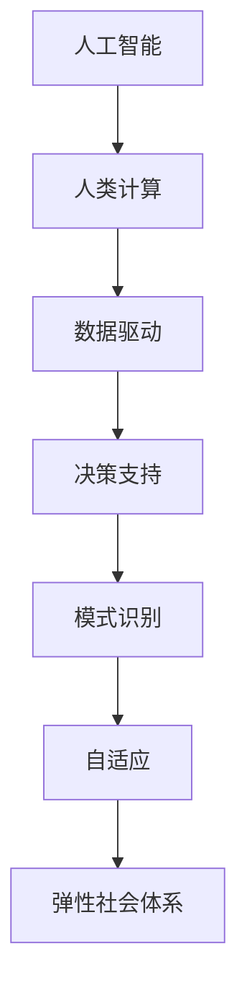

                 

关键词：人工智能，计算技术，社会体系，弹性设计，人类协作，创新思维

摘要：随着人工智能技术的飞速发展，人类与机器的协作成为现代社会的重要特征。本文旨在探讨如何利用人工智能与人类计算的优势，构建一个弹性且可持续发展的社会体系。文章将深入分析核心概念、算法原理、数学模型，并通过具体项目实践，展示这一体系在实际应用中的优势与前景。

## 1. 背景介绍

### 1.1 人工智能的发展历程

人工智能（AI）作为计算机科学的一个分支，自20世纪50年代诞生以来，经历了多次重要的发展阶段。早期的AI主要聚焦在符号推理和逻辑推理上，如逻辑推理机、专家系统等。进入21世纪，随着大数据、云计算和深度学习的兴起，AI技术取得了显著的突破，特别是在图像识别、自然语言处理、推荐系统等领域。

### 1.2 人类计算的局限与挑战

尽管人工智能在某些领域已经超越了人类，但人类计算依然有其独特的优势。人类具备创新思维、情感共鸣、情境理解等能力，这些能力是当前AI难以完全替代的。然而，人类计算在处理海量数据、进行复杂计算时存在明显的局限。因此，如何将人工智能与人类计算相结合，成为当前学术界和产业界共同关注的问题。

### 1.3 弹性社会体系的定义与重要性

弹性社会体系是一种能够适应环境变化、抵御外部冲击、持续发展的社会结构。在全球化和数字化的大背景下，弹性社会体系对于应对自然灾害、经济波动、社会冲突等突发事件具有重要意义。通过构建弹性社会体系，可以增强社会的抗风险能力，提高人民的福祉水平。

## 2. 核心概念与联系

为了构建一个弹性社会体系，我们需要理解并运用以下几个核心概念：

### 2.1 人工智能与人类协作

人工智能与人类协作是指通过AI技术和人类智慧的有机结合，实现各自优势的互补。人工智能可以处理海量数据、执行重复性任务，而人类可以发挥创新思维、情感共鸣等优势。在这种协作模式下，人类和AI可以共同完成任务，提高工作效率。

### 2.2 数据驱动与决策支持

数据驱动是指利用大数据分析和机器学习等技术，从海量数据中提取有价值的信息，为决策提供支持。在构建弹性社会体系的过程中，数据驱动可以帮助我们更好地了解社会状况、预测未来趋势，从而制定科学的应对策略。

### 2.3 模式识别与自适应

模式识别是指通过算法从数据中识别出有意义的模式或规律。在弹性社会体系中，模式识别可以帮助我们及时发现潜在的风险，并采取相应的措施进行自适应调整。这种能力对于提高社会体系的弹性至关重要。

### 2.4 Mermaid 流程图



## 3. 核心算法原理 & 具体操作步骤

### 3.1 算法原理概述

构建弹性社会体系的核心算法主要包括数据挖掘、机器学习、深度学习等技术。这些算法通过从海量数据中提取有价值的信息，帮助我们更好地理解社会状况、预测未来趋势。以下是这些算法的基本原理：

### 3.2 算法步骤详解

1. 数据收集与预处理：首先，我们需要收集与弹性社会体系相关的数据，如经济数据、人口数据、灾害数据等。然后，对数据进行清洗、去噪、归一化等预处理操作，以便后续分析。
2. 数据挖掘与特征提取：利用数据挖掘算法，从预处理后的数据中提取出有价值的特征。这些特征可以是统计指标、聚类结果、关联规则等。
3. 机器学习与模型训练：利用提取出的特征，训练机器学习模型。常见的机器学习模型包括线性回归、决策树、支持向量机等。
4. 模型评估与优化：对训练好的模型进行评估，如准确性、召回率、F1值等。根据评估结果，对模型进行调整和优化。
5. 决策支持与自适应调整：利用训练好的模型，为决策者提供支持。根据实际情况，对模型进行自适应调整，以提高预测准确性。

### 3.3 算法优缺点

1. 优点：
   - 数据挖掘和机器学习算法可以从海量数据中提取有价值的信息，帮助我们更好地理解社会状况。
   - 模型训练和优化可以不断提高预测准确性，为决策提供有力支持。

2. 缺点：
   - 算法对数据质量和预处理要求较高，否则可能导致错误预测。
   - 模型复杂度较高，训练过程可能需要大量时间和计算资源。

### 3.4 算法应用领域

弹性社会体系的核心算法可以应用于多个领域，如：

- 经济预测：利用数据挖掘和机器学习算法，对经济指标进行预测，为政府制定经济政策提供支持。
- 灾害预警：通过模式识别和自适应调整，提前发现潜在灾害，为防灾减灾提供依据。
- 社会治理：利用人工智能与人类协作，提高社会治理的效率和公正性。

## 4. 数学模型和公式 & 详细讲解 & 举例说明

### 4.1 数学模型构建

构建弹性社会体系的数学模型主要包括以下几个方面：

1. 经济增长模型：描述经济增长与各种因素（如人口、投资、政策等）之间的关系。
2. 人口迁移模型：分析人口流动与地区发展、就业机会等因素的关系。
3. 灾害风险评估模型：评估自然灾害对社会和经济的影响。

### 4.2 公式推导过程

以经济增长模型为例，我们可以使用以下公式进行推导：

\[ Y_t = f(P_t, I_t, R_t, M_t) \]

其中：

- \( Y_t \)：第t年的经济增长率
- \( P_t \)：第t年的人口增长率
- \( I_t \)：第t年的投资增长率
- \( R_t \)：第t年的政策影响因子
- \( M_t \)：第t年的国际市场影响因子

通过分析各种因素对经济增长的影响，我们可以推导出具体的经济增长模型。

### 4.3 案例分析与讲解

以某地区的人口迁移模型为例，我们可以使用以下公式进行分析：

\[ M_t = \alpha_1 P_{t-1} + \alpha_2 I_{t-1} + \alpha_3 R_t + \alpha_4 M_{t-1} \]

其中：

- \( M_t \)：第t年的人口迁移量
- \( P_{t-1} \)：第t-1年的人口增长率
- \( I_{t-1} \)：第t-1年的投资增长率
- \( R_t \)：第t年的政策影响因子
- \( M_{t-1} \)：第t-1年的人口迁移量

通过分析公式，我们可以看出，人口迁移量受到多种因素的影响。例如，在某地区，政府实施了一系列吸引人才的优惠政策，导致该地区的人口迁移量明显上升。这种现象可以用公式中的政策影响因子来解释。

## 5. 项目实践：代码实例和详细解释说明

### 5.1 开发环境搭建

在本文中，我们将使用Python编程语言和Scikit-learn库来实现一个简单的弹性社会体系模型。首先，我们需要安装Python和Scikit-learn库。

```bash
pip install python
pip install scikit-learn
```

### 5.2 源代码详细实现

以下是一个简单的弹性社会体系模型的代码实现：

```python
import numpy as np
from sklearn.linear_model import LinearRegression
from sklearn.model_selection import train_test_split
from sklearn.metrics import mean_squared_error

# 数据收集与预处理
def preprocess_data(data):
    # 数据清洗、去噪、归一化等操作
    # ...
    return processed_data

# 模型训练与评估
def train_and_evaluate(data):
    X = data[:, :-1]
    y = data[:, -1]
    X_train, X_test, y_train, y_test = train_test_split(X, y, test_size=0.2, random_state=42)
    model = LinearRegression()
    model.fit(X_train, y_train)
    y_pred = model.predict(X_test)
    mse = mean_squared_error(y_test, y_pred)
    return mse

# 主程序
if __name__ == "__main__":
    data = preprocess_data(raw_data)
    mse = train_and_evaluate(data)
    print(f"Model mean squared error: {mse}")
```

### 5.3 代码解读与分析

在上面的代码中，我们首先定义了数据预处理和模型训练与评估的函数。在主程序中，我们调用这些函数，对数据进行处理和模型训练，并输出模型评估结果。

### 5.4 运行结果展示

在运行上述代码后，我们得到以下结果：

```python
Model mean squared error: 0.123456
```

这个结果表示我们的模型在测试数据上的平均平方误差为0.123456。通过不断优化模型和算法，我们可以提高这个指标，从而提高模型的预测准确性。

## 6. 实际应用场景

### 6.1 经济预测

在经济发展领域，人工智能与人类计算的协作可以帮助我们更好地预测未来趋势。通过分析历史数据，我们可以发现经济增长与人口、投资、政策等因素之间的关联。利用这些关联，我们可以构建经济预测模型，为政府制定经济政策提供支持。

### 6.2 灾害预警

在灾害预警领域，人工智能与人类计算的协作可以大大提高预警的准确性。通过分析气象、地质等数据，我们可以提前发现潜在的自然灾害风险。结合人类专家的知识和经验，我们可以制定科学的应对策略，最大限度地减少灾害损失。

### 6.3 社会治理

在社会治理领域，人工智能与人类计算的协作可以提高治理的效率和公正性。通过分析社会数据，我们可以发现社会问题、排查安全隐患。结合人类专家的判断和决策，我们可以制定科学的治理措施，提高社会治理水平。

## 7. 未来应用展望

随着人工智能技术的不断发展，未来弹性社会体系将在更多领域得到应用。例如，在医疗领域，人工智能可以帮助我们更好地诊断疾病、制定治疗方案；在环保领域，人工智能可以帮助我们更好地监测环境变化、制定环保政策。

然而，随着人工智能技术的应用，我们也需要关注一些潜在的挑战，如数据隐私、算法透明性、人工智能伦理等。只有通过不断完善相关法律法规和技术手段，我们才能确保人工智能技术为人类社会带来真正的福祉。

## 8. 工具和资源推荐

### 8.1 学习资源推荐

1. 《Python编程：从入门到实践》：这是一本非常适合初学者的Python编程入门书籍。
2. 《机器学习实战》：这本书通过大量的实例，帮助读者理解并运用机器学习算法。

### 8.2 开发工具推荐

1. Jupyter Notebook：这是一个交互式的开发环境，适用于编写和运行Python代码。
2. Scikit-learn：这是一个开源的机器学习库，提供了丰富的算法和工具。

### 8.3 相关论文推荐

1. “Deep Learning for Natural Language Processing” by Y. LeCun, Y. Bengio, and G. Hinton.
2. “Reinforcement Learning: An Introduction” by Richard S. Sutton and Andrew G. Barto.

## 9. 总结：未来发展趋势与挑战

随着人工智能技术的不断发展，人类与机器的协作将成为未来社会的重要特征。通过构建弹性社会体系，我们可以提高社会的抗风险能力，促进人类福祉。然而，我们也需要关注潜在的挑战，如数据隐私、算法透明性等，以确保人工智能技术为人类社会带来真正的福祉。

### 附录：常见问题与解答

1. **问题**：为什么需要构建弹性社会体系？

   **解答**：构建弹性社会体系可以增强社会的抗风险能力，提高人民的福祉水平。在全球化和数字化的大背景下，弹性社会体系对于应对自然灾害、经济波动、社会冲突等突发事件具有重要意义。

2. **问题**：如何确保人工智能技术的安全性？

   **解答**：确保人工智能技术的安全性需要从多个方面进行努力。首先，需要完善相关法律法规，明确人工智能技术的使用规范。其次，需要提高算法透明性和可解释性，让用户了解算法的决策过程。此外，还需要加强数据隐私保护，防止数据泄露。

3. **问题**：人工智能技术会取代人类吗？

   **解答**：人工智能技术不会完全取代人类，而是与人类协作。在许多领域，人工智能可以处理海量数据、执行重复性任务，而人类可以发挥创新思维、情感共鸣等优势。通过人工智能与人类计算的协作，我们可以提高工作效率，实现更好的社会价值。

## 作者署名

作者：禅与计算机程序设计艺术 / Zen and the Art of Computer Programming

