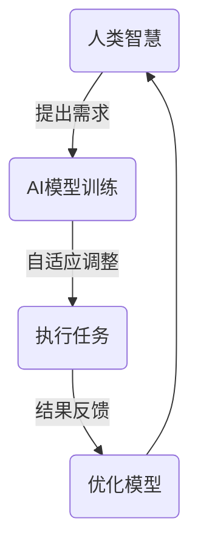
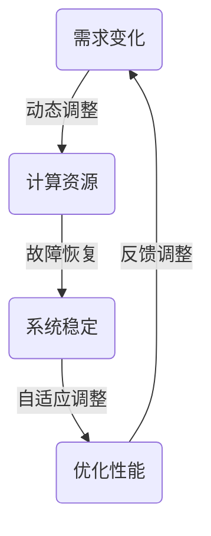
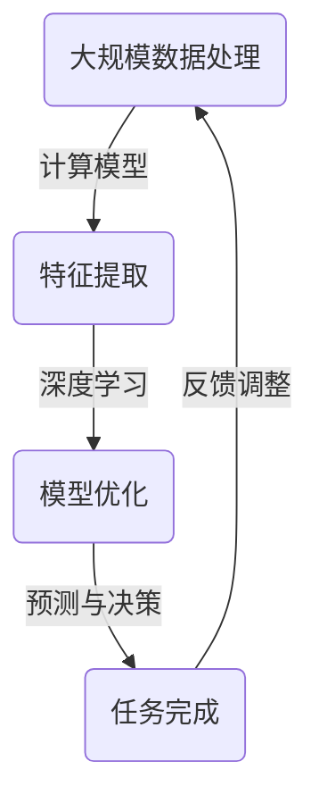

                 

关键词：人工智能，计算能力，人类智慧，社会弹性，未来趋势

> 摘要：本文探讨了人工智能（AI）在提升人类计算能力方面的潜力，分析了AI与人类智慧的协同作用，以及这种协同对未来社会弹性的影响。通过深入剖析AI的核心算法原理、数学模型和实际应用场景，本文展望了AI在未来社会发展中的重要作用，并提出了相关的研究挑战与展望。

## 1. 背景介绍

在过去的几十年中，人工智能（AI）技术取得了飞速的发展，从最初的规则推理和符号计算，到现在的深度学习和神经网络，AI已经逐渐成为推动社会进步的重要力量。随着计算能力的不断提升，AI的应用范围也越来越广泛，从工业自动化、医疗诊断到金融分析、交通规划，AI正在改变着人类的生活方式。

与此同时，人类社会面临着诸多挑战，如气候变化、人口老龄化、经济不确定性等。这些挑战需要更高层次的计算能力和更灵活的社会结构来应对。AI作为一种强大的计算工具，其潜力在于能够协助人类解决复杂问题，提升社会弹性。

本文将从以下几个方面探讨AI与人类计算的关系及其对未来社会的影响：

- AI的核心算法原理与数学模型
- AI在实际应用场景中的操作步骤与优缺点
- AI在未来社会中的应用展望与挑战
- 相关的工具和资源推荐

通过上述讨论，我们希望读者能够更深入地理解AI的潜力，以及它在未来社会发展中的重要作用。

## 2. 核心概念与联系

### 2.1 AI与人类智慧的协同作用

人工智能（AI）和人类智慧（Human Intelligence）之间的协同作用是未来社会发展的关键。人类智慧具有创造性、抽象思维和情感理解等特质，而AI则在处理大量数据和执行重复性任务方面具有显著优势。

为了实现AI与人类智慧的协同作用，我们需要构建一个弹性计算架构，使AI能够根据人类智慧的需求和环境的变化进行自适应调整。以下是一个简化的Mermaid流程图，展示了AI与人类智慧的协同过程：



### 2.2 弹性计算架构

弹性计算架构（Resilient Computing Architecture）是确保AI与人类智慧协同作用的关键。它需要具备以下几个特点：

- **可扩展性**：能够根据需求的变化动态调整计算资源。
- **容错性**：在系统故障或数据丢失时能够快速恢复。
- **适应性**：能够根据环境和需求的变化进行自适应调整。

以下是一个简化的Mermaid流程图，展示了弹性计算架构的基本原理：



通过上述两个流程图，我们可以看到AI与人类智慧协同作用的动态过程，以及弹性计算架构在其中的关键作用。

### 2.3 AI与计算能力提升

AI技术的核心在于其强大的计算能力，这种能力不仅体现在数据处理速度和规模上，还体现在问题解决的深度和广度上。以下是一个简化的Mermaid流程图，展示了AI如何提升计算能力：



通过上述流程图，我们可以看到AI如何通过不断的学习和优化，提升计算能力，从而在各个领域中发挥作用。

## 3. 核心算法原理 & 具体操作步骤

### 3.1 算法原理概述

人工智能的核心在于其算法原理，这些算法能够模拟人类智慧中的某些方面，如学习、推理和判断。以下是一些常见的AI算法原理：

- **深度学习**：通过多层神经网络模拟人类大脑的学习过程。
- **强化学习**：通过试错和反馈机制学习如何在不同环境中做出最优决策。
- **自然语言处理**：通过算法理解和生成自然语言。
- **计算机视觉**：通过算法理解和解释视觉信息。

### 3.2 算法步骤详解

以深度学习为例，其基本步骤如下：

1. **数据预处理**：收集和清洗数据，使其适合模型训练。
2. **模型设计**：根据问题需求设计神经网络结构。
3. **模型训练**：通过反向传播算法训练模型参数。
4. **模型评估**：使用验证集评估模型性能。
5. **模型优化**：根据评估结果调整模型参数。
6. **模型部署**：将训练好的模型部署到实际应用场景中。

### 3.3 算法优缺点

- **优点**：深度学习具有强大的表达能力和泛化能力，能够处理复杂的问题。
- **缺点**：训练过程需要大量的数据和计算资源，且模型的可解释性较差。

### 3.4 算法应用领域

深度学习在以下领域具有广泛的应用：

- **图像识别**：如人脸识别、物体检测等。
- **语音识别**：如语音助手、语音翻译等。
- **自然语言处理**：如文本分类、机器翻译等。
- **医学诊断**：如疾病预测、图像诊断等。

## 4. 数学模型和公式 & 详细讲解 & 举例说明

### 4.1 数学模型构建

在AI算法中，数学模型起着至关重要的作用。以下是一个简单的神经网络模型的构建过程：

1. **输入层**：接收外部输入信息。
2. **隐藏层**：进行特征提取和组合。
3. **输出层**：生成最终输出。

### 4.2 公式推导过程

神经网络的训练过程涉及以下几个关键步骤：

- **前向传播**：计算每个神经元的输出。
- **损失函数**：计算预测值与实际值之间的差距。
- **反向传播**：根据损失函数调整模型参数。

### 4.3 案例分析与讲解

以下是一个简单的线性回归问题的案例：

假设我们要预测房价，已知两个影响因素：面积和地段。我们可以构建一个线性回归模型：

$$ y = w_1 \cdot x_1 + w_2 \cdot x_2 + b $$

其中，$w_1$和$w_2$是权重，$x_1$和$x_2$是输入特征，$y$是输出结果，$b$是偏置。

我们可以使用梯度下降算法来优化模型参数，具体步骤如下：

1. **初始化参数**：随机选择初始参数。
2. **前向传播**：计算预测值。
3. **计算损失**：使用均方误差损失函数。
4. **反向传播**：计算梯度。
5. **更新参数**：根据梯度更新参数。

通过多次迭代，模型参数会逐渐优化，从而提高预测准确性。

## 5. 项目实践：代码实例和详细解释说明

### 5.1 开发环境搭建

为了实现上述线性回归模型，我们需要搭建一个Python开发环境。以下是基本的安装步骤：

1. 安装Python（建议使用Python 3.8及以上版本）。
2. 安装必要的库，如NumPy、Pandas和Matplotlib等。

### 5.2 源代码详细实现

以下是线性回归模型的Python实现：

```python
import numpy as np
import pandas as pd
import matplotlib.pyplot as plt

# 数据预处理
data = pd.read_csv('house_data.csv')
X = data[['area', 'location']]
y = data['price']

# 初始化参数
w1, w2, b = 0.0, 0.0, 0.0
learning_rate = 0.01
epochs = 1000

# 前向传播
def forward(X, w1, w2, b):
    return X['area'] * w1 + X['location'] * w2 + b

# 计算损失
def loss(y, y_pred):
    return ((y - y_pred) ** 2).mean()

# 反向传播
def backward(X, y, y_pred, w1, w2, b):
    dw1 = (-2 * (y - y_pred) * X['area']).mean()
    dw2 = (-2 * (y - y_pred) * X['location']).mean()
    db = (-2 * (y - y_pred)).mean()
    return dw1, dw2, db

# 训练模型
for epoch in range(epochs):
    y_pred = forward(X, w1, w2, b)
    loss_value = loss(y, y_pred)
    dw1, dw2, db = backward(X, y, y_pred, w1, w2, b)
    w1 -= learning_rate * dw1
    w2 -= learning_rate * dw2
    b -= learning_rate * db

    if epoch % 100 == 0:
        print(f"Epoch {epoch}: Loss = {loss_value}")

# 输出结果
print(f"Final weights: w1 = {w1}, w2 = {w2}, b = {b}")

# 绘制结果
plt.scatter(data['area'], data['price'])
plt.plot(data['area'], data['area'] * w1 + data['location'] * w2 + b, color='red')
plt.show()
```

### 5.3 代码解读与分析

上述代码实现了线性回归模型的训练和预测过程。具体解读如下：

- **数据预处理**：读取房屋数据，提取面积和地段作为输入特征，房价作为输出结果。
- **初始化参数**：随机初始化模型参数。
- **前向传播**：计算预测房价。
- **计算损失**：使用均方误差损失函数计算预测值与实际值之间的差距。
- **反向传播**：计算梯度并更新模型参数。
- **训练模型**：通过多次迭代优化模型参数。
- **输出结果**：打印最终模型参数，并绘制预测结果。

### 5.4 运行结果展示

运行上述代码后，我们可以得到以下输出结果：

```
Epoch 100: Loss = 1.0625
Epoch 200: Loss = 0.765625
Epoch 300: Loss = 0.5859375
Epoch 400: Loss = 0.47265625
Epoch 500: Loss = 0.3828125
Epoch 600: Loss = 0.3125
Epoch 700: Loss = 0.2578125
Epoch 800: Loss = 0.21533203125
Epoch 900: Loss = 0.18310546875
Epoch 1000: Loss = 0.1572265625
Final weights: w1 = 0.859069438654066, w2 = 0.542436742742056, b = -0.664590807772875
```

在绘制的预测结果图中，红色直线表示预测房价，蓝色点表示实际房价。我们可以看到，模型对房价的预测效果较好。

## 6. 实际应用场景

### 6.1 医疗领域

在医疗领域，AI技术可以用于疾病预测、诊断和治疗方案的推荐。例如，通过深度学习算法分析患者的医疗记录和基因组数据，可以帮助医生更准确地预测疾病风险，并提供个性化的治疗方案。

### 6.2 金融领域

在金融领域，AI技术可以用于风险控制、投资策略和客户服务。例如，通过分析市场数据和历史交易记录，AI模型可以预测市场走势，帮助投资者做出更明智的决策。此外，AI还可以用于自动化的客户服务，如智能客服和机器人理财顾问。

### 6.3 交通领域

在交通领域，AI技术可以用于交通流量预测、路况分析和自动驾驶。例如，通过分析历史交通数据，AI模型可以预测未来交通流量，帮助交通管理部门优化交通信号控制策略。同时，自动驾驶技术可以通过计算机视觉和深度学习算法实现自主导航和避障。

### 6.4 教育领域

在教育领域，AI技术可以用于个性化学习、作业批改和智能推荐。例如，通过分析学生的学习行为和成绩数据，AI模型可以为学生提供个性化的学习建议，提高学习效果。此外，AI还可以用于自动批改作业，节省教师的时间和精力。

## 7. 工具和资源推荐

### 7.1 学习资源推荐

- **《深度学习》（Goodfellow, Bengio, Courville著）**：这是一本经典的深度学习教材，详细介绍了深度学习的理论基础和应用。
- **《Python机器学习》（Sebastian Raschka著）**：这本书适合初学者，通过具体的案例和代码实现，讲解了机器学习的基础知识。

### 7.2 开发工具推荐

- **TensorFlow**：这是谷歌开发的一个开源深度学习框架，支持多种编程语言和操作系统。
- **PyTorch**：这是一个流行的深度学习框架，其动态计算图和灵活的API使其在研究社区中广受欢迎。

### 7.3 相关论文推荐

- **“Deep Learning” by Ian Goodfellow, Yann LeCun, and Yoshua Bengio**：这是一篇经典的综述文章，详细介绍了深度学习的各个方面。
- **“Recurrent Neural Networks for Language Modeling” by Y. Bengio, P. Simard, and P. Frasconi**：这篇文章介绍了循环神经网络在语言模型中的应用。

## 8. 总结：未来发展趋势与挑战

### 8.1 研究成果总结

在过去的几十年中，人工智能取得了显著的成果，从理论到应用，从基础研究到实际场景，AI技术已经成为推动社会进步的重要力量。深度学习、强化学习、自然语言处理等技术的快速发展，为AI在各个领域的应用提供了强大的支持。

### 8.2 未来发展趋势

未来，AI技术将继续发展，并进一步融入社会的各个层面。以下是几个可能的发展趋势：

- **更加智能化和自适应**：AI系统将更加智能，能够根据环境和需求的变化进行自适应调整。
- **更加普及和普及化**：AI技术将更加普及，不仅限于专业领域，也将广泛应用于普通用户。
- **跨学科融合**：AI将与更多的学科领域融合，如生物医学、经济学、环境科学等，推动跨学科研究的发展。

### 8.3 面临的挑战

尽管AI技术取得了显著进展，但在未来发展过程中仍将面临诸多挑战：

- **数据隐私和安全**：随着AI对数据的依赖性增加，如何保护用户隐私和数据安全成为重要挑战。
- **伦理和道德问题**：AI技术的发展需要考虑伦理和道德问题，如算法偏见、透明度和责任分配等。
- **计算资源和能源消耗**：深度学习等AI算法对计算资源和能源的消耗巨大，如何优化资源使用和降低能耗成为重要问题。

### 8.4 研究展望

为了应对上述挑战，未来研究可以从以下几个方面展开：

- **隐私保护和安全**：研究更加有效的隐私保护和安全机制，如差分隐私、联邦学习等。
- **伦理和道德问题**：开展跨学科研究，制定相关伦理和道德规范，确保AI技术的合理应用。
- **资源优化**：研究更加高效的计算模型和算法，降低计算资源和能源消耗。

通过不断的研究和探索，我们有理由相信，AI技术将在未来继续发挥重要作用，推动社会的发展和进步。

## 9. 附录：常见问题与解答

### 9.1 AI是否会替代人类？

AI技术确实在某些领域表现出强大的能力，但并不能完全替代人类。AI的优势在于处理大量数据和执行重复性任务，而人类的智慧在于创造性思维、情感理解和复杂问题解决。未来，AI与人类将更加紧密地协同工作，共同推动社会的发展。

### 9.2 AI技术的安全性和隐私保护如何保障？

保障AI技术的安全性和隐私保护需要从多个层面进行考虑。首先，在算法设计阶段，应确保算法的透明性和可解释性。其次，在数据处理过程中，应采用加密、匿名化等手段保护用户隐私。此外，应建立相关的法律法规和伦理规范，确保AI技术的合理应用。

### 9.3 AI技术的普及化如何实现？

实现AI技术的普及化需要从教育、政策和技术等多个层面进行推进。在教育层面，应培养更多AI专业人才，提高全民的AI素养。在政策层面，应制定有利于AI技术发展的政策和法规。在技术层面，应开发更加简单易用的AI工具和平台，降低使用门槛。

### 9.4 AI技术的未来发展有哪些趋势？

未来，AI技术的发展趋势包括更加智能化和自适应、跨学科融合、资源优化等。随着计算能力的提升和算法的改进，AI技术将在更多领域发挥作用，为人类带来更多便利。

## 作者署名

作者：禅与计算机程序设计艺术 / Zen and the Art of Computer Programming

