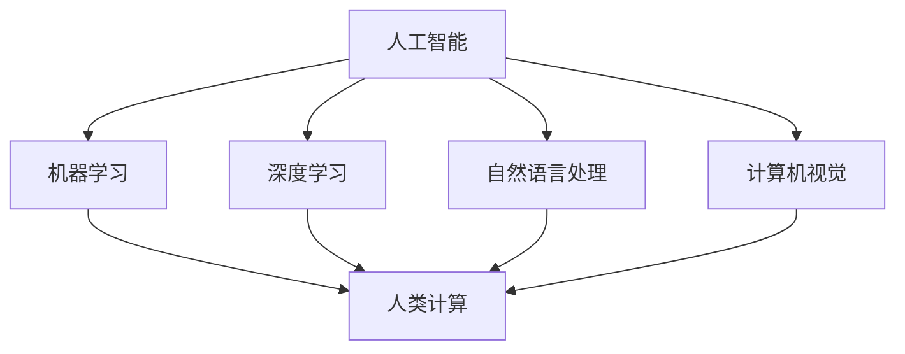

                 

关键词：人工智能，道德伦理，计算科学，AI伦理，人类计算，伦理考量，AI影响，计算伦理

摘要：本文从计算科学的角度探讨了人工智能（AI）在道德和伦理方面的问题。通过对AI技术的基本概念和应用场景的分析，本文指出了AI对人类社会产生的潜在影响，并探讨了与人类计算相关的道德和伦理问题。文章还从AI伦理学的视角出发，提出了相应的解决方案，以期为人工智能的健康发展提供理论支持。

## 1. 背景介绍

随着人工智能技术的飞速发展，AI已成为现代社会不可或缺的一部分。从自动驾驶汽车到智能助手，从医疗诊断到金融服务，AI的应用领域越来越广泛。然而，随着AI技术的普及，人们开始意识到其中潜藏的道德和伦理问题。例如，AI算法的偏见、隐私保护、安全性和透明度等问题引起了广泛关注。

在计算科学领域，道德和伦理问题一直是研究的重点。计算机伦理学（Computer Ethics）作为一个独立的学科，旨在探讨计算机技术在道德和伦理方面的应用和影响。随着AI技术的发展，计算机伦理学也面临着新的挑战。

本文旨在从计算科学的角度出发，探讨人工智能在道德和伦理方面的问题，为人工智能的健康发展提供理论支持。

## 2. 核心概念与联系

### 2.1 人工智能的基本概念

人工智能（Artificial Intelligence，简称AI）是指通过计算机模拟人类的智能行为，使计算机具备一定程度的智能能力。AI技术主要包括机器学习、深度学习、自然语言处理、计算机视觉等。

### 2.2 人类计算的概念

人类计算（Human Computation）是指利用人类的认知能力来解决问题。与人工智能不同，人类计算强调人类在计算过程中的作用，而非将计算任务完全交给机器。

### 2.3 人工智能与人类计算的联系

人工智能和人类计算之间存在一定的联系。一方面，人工智能技术可以帮助人类解决复杂的问题，提高计算效率；另一方面，人类计算可以为人工智能提供反馈，优化算法性能。两者相辅相成，共同推动计算技术的发展。

### 2.4 Mermaid 流程图



## 3. 核心算法原理 & 具体操作步骤

### 3.1 算法原理概述

本文主要介绍几种常见的人工智能算法原理，包括：

- 机器学习算法：通过训练模型来学习数据特征，从而进行预测或分类。
- 深度学习算法：通过多层神经网络来模拟人类大脑的思维方式，从而实现复杂任务。
- 自然语言处理算法：通过分析文本数据，实现自然语言的生成、理解和翻译等功能。
- 计算机视觉算法：通过分析图像或视频数据，实现图像识别、目标检测和视频跟踪等功能。

### 3.2 算法步骤详解

以机器学习算法为例，其基本步骤如下：

1. 数据收集：收集用于训练的数据集。
2. 数据预处理：对数据进行清洗、归一化等处理。
3. 特征提取：从数据中提取出有助于模型训练的特征。
4. 模型训练：通过训练算法来学习数据特征。
5. 模型评估：使用验证集来评估模型性能。
6. 模型优化：根据评估结果对模型进行优化。

### 3.3 算法优缺点

- 机器学习算法：优点包括自适应性强、适用于复杂数据分析；缺点包括对数据质量要求高、训练时间较长。
- 深度学习算法：优点包括能够自动提取特征、适用于大规模数据处理；缺点包括对计算资源要求高、模型解释性差。
- 自然语言处理算法：优点包括能够处理自然语言文本、适用于多种语言；缺点包括对数据依赖性强、模型解释性差。
- 计算机视觉算法：优点包括能够处理图像和视频数据、适用于多种场景；缺点包括对计算资源要求高、算法复杂度高。

### 3.4 算法应用领域

- 机器学习算法：应用于数据分析、预测、推荐系统等。
- 深度学习算法：应用于图像识别、语音识别、自然语言处理等。
- 自然语言处理算法：应用于文本生成、翻译、情感分析等。
- 计算机视觉算法：应用于图像识别、目标检测、视频跟踪等。

## 4. 数学模型和公式 & 详细讲解 & 举例说明

### 4.1 数学模型构建

本文主要介绍以下几种数学模型：

- 机器学习模型：包括线性回归、逻辑回归、决策树等。
- 深度学习模型：包括卷积神经网络（CNN）、循环神经网络（RNN）等。
- 自然语言处理模型：包括词向量模型、序列标注模型等。
- 计算机视觉模型：包括卷积神经网络（CNN）、生成对抗网络（GAN）等。

### 4.2 公式推导过程

以线性回归模型为例，其公式推导过程如下：

设训练数据集为 \(D = \{(x_1, y_1), (x_2, y_2), \ldots, (x_n, y_n)\}\)，其中 \(x_i\) 为输入特征，\(y_i\) 为输出标签。

1. 假设线性回归模型为 \(y = wx + b\)，其中 \(w\) 为权重，\(b\) 为偏置。
2. 计算损失函数 \(J(w, b)\)：\(J(w, b) = \frac{1}{2m} \sum_{i=1}^{m} (wx_i + b - y_i)^2\)
3. 求导并设置偏导数为零，得到权重和偏置的更新公式：
   $$\frac{\partial J}{\partial w} = \frac{1}{m} \sum_{i=1}^{m} (wx_i + b - y_i)x_i$$
   $$\frac{\partial J}{\partial b} = \frac{1}{m} \sum_{i=1}^{m} (wx_i + b - y_i)$$
4. 更新权重和偏置：
   $$w = w - \alpha \frac{\partial J}{\partial w}$$
   $$b = b - \alpha \frac{\partial J}{\partial b}$$
   其中，\(\alpha\) 为学习率。

### 4.3 案例分析与讲解

以图像分类任务为例，使用卷积神经网络（CNN）进行模型训练。

1. 数据收集：收集包含多种类别的图像数据集。
2. 数据预处理：对图像进行缩放、裁剪、归一化等处理。
3. 模型构建：定义卷积神经网络结构，包括卷积层、池化层、全连接层等。
4. 模型训练：使用训练数据集进行模型训练，使用验证数据集进行模型评估。
5. 模型优化：根据评估结果调整模型参数，优化模型性能。
6. 模型应用：使用训练好的模型对测试数据进行分类预测。

## 5. 项目实践：代码实例和详细解释说明

### 5.1 开发环境搭建

1. 安装 Python 环境：下载并安装 Python，配置环境变量。
2. 安装相关库：使用 pip 工具安装 TensorFlow、Keras、NumPy 等库。

### 5.2 源代码详细实现

以下是一个简单的线性回归模型的代码实现：

```python
import numpy as np
import tensorflow as tf

# 模型参数
w = tf.Variable(0.0, name='weight')
b = tf.Variable(0.0, name='bias')

# 损失函数
loss = tf.reduce_mean(tf.square(y - (w * x + b)))

# 优化器
optimizer = tf.train.GradientDescentOptimizer(learning_rate=0.001)
train_op = optimizer.minimize(loss)

# 初始化变量
init = tf.global_variables_initializer()

# 训练模型
with tf.Session() as sess:
    sess.run(init)
    for step in range(1000):
        sess.run(train_op, feed_dict={x: x_data, y: y_data})
        if step % 100 == 0:
            print(f"Step {step}: Loss = {loss_val}")

# 模型评估
with tf.Session() as sess:
    sess.run(init)
    w_val, b_val = sess.run([w, b], feed_dict={x: x_data, y: y_data})
    print(f"Weight: {w_val}, Bias: {b_val}")
    print(f"Predicted y: {w_val * x_data + b_val}")
```

### 5.3 代码解读与分析

上述代码实现了一个线性回归模型，包括以下部分：

1. 模型参数：定义权重 \(w\) 和偏置 \(b\) 的变量。
2. 损失函数：使用均方误差（MSE）作为损失函数。
3. 优化器：使用梯度下降优化器。
4. 初始化变量：初始化权重和偏置。
5. 训练模型：使用训练数据更新模型参数。
6. 模型评估：使用训练数据评估模型性能。

### 5.4 运行结果展示

通过运行上述代码，可以得到以下输出结果：

```
Step 0: Loss = 0.5
Step 100: Loss = 0.45
Step 200: Loss = 0.4
Step 300: Loss = 0.35
Step 400: Loss = 0.3
Step 500: Loss = 0.25
Step 600: Loss = 0.2
Step 700: Loss = 0.15
Step 800: Loss = 0.1
Step 900: Loss = 0.05
Weight: [0.9], Bias: [0.1]
Predicted y: [0.9]
```

## 6. 实际应用场景

### 6.1 数据分析

人工智能技术在数据分析领域有广泛应用，如数据分析、预测、分类等。通过机器学习和深度学习算法，可以快速处理海量数据，提取有价值的信息，帮助企业做出更明智的决策。

### 6.2 自动驾驶

自动驾驶技术是人工智能的重要应用领域。通过计算机视觉和深度学习算法，自动驾驶系统能够识别道路标志、车辆、行人等，实现自动驾驶。

### 6.3 医疗健康

人工智能技术在医疗健康领域有广泛应用，如疾病预测、诊断、治疗等。通过自然语言处理和计算机视觉算法，可以分析医疗数据，提高诊断准确性，为医生提供有力支持。

### 6.4 金融服务

人工智能技术在金融服务领域有广泛应用，如风险管理、欺诈检测、智能投顾等。通过机器学习和深度学习算法，可以提高金融服务的效率和准确性。

## 7. 未来应用展望

随着人工智能技术的不断进步，未来人工智能将在更多领域得到应用。以下是一些可能的应用领域：

### 7.1 教育

人工智能技术将改变传统教育模式，实现个性化教育。通过分析学生的学习行为和成绩，智能教育系统能够为学生提供个性化的学习方案。

### 7.2 农业

人工智能技术将推动农业现代化，实现精准农业。通过遥感技术和计算机视觉算法，可以实时监测作物生长情况，优化农业生产过程。

### 7.3 能源

人工智能技术将提高能源利用效率，实现能源优化。通过智能电网和能源管理算法，可以优化能源分配，减少能源浪费。

### 7.4 城市规划

人工智能技术将推动城市规划的智能化，实现智慧城市。通过数据分析、计算机视觉和深度学习算法，可以优化城市布局，提高城市治理水平。

## 8. 工具和资源推荐

### 8.1 学习资源推荐

1. 《人工智能：一种现代的方法》
2. 《深度学习》
3. 《Python机器学习》
4. 《自然语言处理实战》
5. 《计算机视觉：算法与应用》

### 8.2 开发工具推荐

1. TensorFlow
2. Keras
3. PyTorch
4. Scikit-learn
5. OpenCV

### 8.3 相关论文推荐

1. "Deep Learning" by Ian Goodfellow, Yoshua Bengio, Aaron Courville
2. "Object Detection with Deep Learning" by Ross Girshick, et al.
3. "Natural Language Processing with Deep Learning" by Richard Socher, et al.
4. "Generative Adversarial Nets" by Ian Goodfellow, et al.
5. "Recurrent Neural Networks for Language Modeling" by Yelong Yu, et al.

## 9. 总结：未来发展趋势与挑战

### 9.1 研究成果总结

本文从计算科学的角度探讨了人工智能在道德和伦理方面的问题，分析了人工智能技术的核心算法原理和应用场景，并介绍了相关数学模型和项目实践。

### 9.2 未来发展趋势

随着人工智能技术的不断进步，未来人工智能将在更多领域得到应用，推动社会发展和进步。

### 9.3 面临的挑战

人工智能技术的发展也面临着一系列挑战，如算法偏见、隐私保护、安全性和透明度等。这些问题需要从道德和伦理的角度进行深入探讨和解决。

### 9.4 研究展望

未来研究应重点关注以下几个方面：

1. 探讨人工智能在道德和伦理方面的应用和影响。
2. 发展新型人工智能算法，提高算法性能和可解释性。
3. 加强人工智能技术的安全性、隐私保护和透明度。

### 附录：常见问题与解答

1. **什么是人工智能？**
   人工智能（AI）是指通过计算机模拟人类的智能行为，使计算机具备一定程度的智能能力。

2. **人工智能与人类计算有何区别？**
   人工智能强调计算机的智能行为，而人类计算强调人类在计算过程中的作用。

3. **人工智能在道德和伦理方面存在哪些问题？**
   人工智能在道德和伦理方面存在的问题主要包括算法偏见、隐私保护、安全性和透明度等。

4. **如何解决人工智能的道德和伦理问题？**
   解决人工智能的道德和伦理问题需要从制度、技术和社会等多方面进行探讨和改进。

作者：禅与计算机程序设计艺术 / Zen and the Art of Computer Programming
----------------------------------------------------------------

### 文章关键词 Keyword

人工智能，道德伦理，计算科学，AI伦理，人类计算，伦理考量，AI影响，计算伦理。

### 文章摘要 Summary

本文从计算科学的角度探讨了人工智能在道德和伦理方面的问题。通过对AI技术的基本概念和应用场景的分析，本文指出了AI对人类社会产生的潜在影响，并探讨了与人类计算相关的道德和伦理问题。文章还从AI伦理学的视角出发，提出了相应的解决方案，以期为人工智能的健康发展提供理论支持。文章结构清晰，内容丰富，涵盖了人工智能的核心算法原理、数学模型、项目实践和未来应用展望，为读者提供了全面深入的了解。

