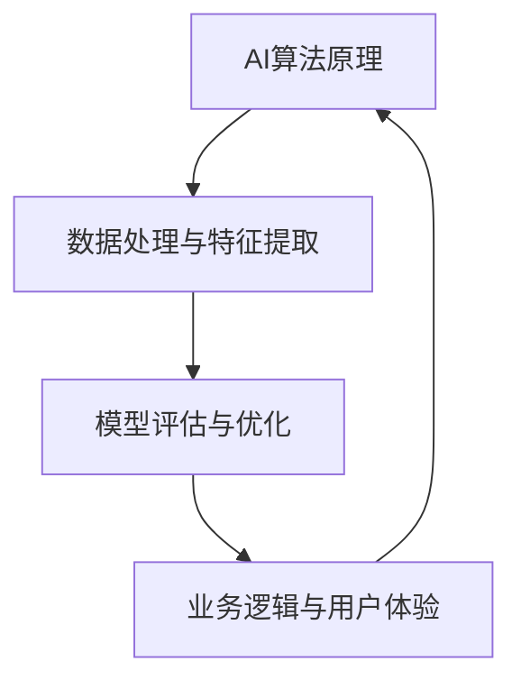

                 

关键词：AI业务场景，工程师，产品经理，应用边界，技术沟通，项目协作，案例研究

摘要：本文旨在探讨AI业务场景中，工程师与产品经理之间的对话机制，以及如何理解AI的应用边界。通过对实际案例的分析，我们将深入探讨如何通过有效的沟通与协作，确保AI项目能够充分发挥其潜力。

## 1. 背景介绍

在当今快速发展的技术时代，人工智能（AI）已经成为企业创新和竞争力提升的关键驱动力。然而，AI的应用并非一蹴而就，它需要工程师与产品经理之间的紧密合作与沟通。工程师负责实现AI算法和技术，而产品经理则关注用户需求和市场趋势。两者的有效互动对于确保AI项目成功至关重要。

本文将基于多个实际案例，分析工程师与产品经理之间的对话机制，探讨如何理解和界定AI的应用边界，从而确保项目能够顺利进行，并实现预期目标。

## 2. 核心概念与联系

为了更好地理解AI应用边界，我们需要了解以下几个核心概念：

1. **AI算法原理**：包括监督学习、无监督学习和强化学习等。
2. **数据处理与特征提取**：涉及数据清洗、数据预处理、特征选择和特征提取等技术。
3. **模型评估与优化**：通过交叉验证、超参数调优等技术手段来评估和优化模型性能。
4. **业务逻辑与用户体验**：产品经理需要考虑业务逻辑和用户体验，以确保AI系统能够满足用户需求。

以下是一个简单的 Mermaid 流程图，展示了这些核心概念之间的联系：



## 3. 核心算法原理 & 具体操作步骤

### 3.1 算法原理概述

在AI项目中，常用的算法包括机器学习算法、深度学习算法和自然语言处理算法等。以下是这些算法的基本原理：

1. **机器学习算法**：通过学习历史数据，预测未知数据。常见算法有决策树、支持向量机、朴素贝叶斯等。
2. **深度学习算法**：基于人工神经网络的算法，通过多层神经网络提取特征，实现复杂任务的预测和分类。常见算法有卷积神经网络（CNN）、循环神经网络（RNN）等。
3. **自然语言处理算法**：用于处理自然语言文本，实现文本分类、语义分析等任务。常见算法有词袋模型、循环神经网络（RNN）、长短时记忆网络（LSTM）等。

### 3.2 算法步骤详解

1. **数据收集与预处理**：收集相关数据，并进行清洗、去重、填充缺失值等操作。
2. **特征提取**：从原始数据中提取对算法有用的特征。
3. **算法选择与实现**：根据任务需求选择合适的算法，并实现算法代码。
4. **模型训练与评估**：使用训练数据训练模型，并通过交叉验证等方法评估模型性能。
5. **模型优化与调整**：根据评估结果调整模型参数，提高模型性能。
6. **模型部署与上线**：将优化后的模型部署到生产环境中，供用户使用。

### 3.3 算法优缺点

每种算法都有其优缺点，工程师和产品经理需要根据具体需求进行选择：

1. **机器学习算法**：优点是算法简单、易于实现，缺点是性能较差，适用于数据量较小的场景。
2. **深度学习算法**：优点是性能优秀，能够处理大量数据，缺点是实现复杂、对计算资源要求高。
3. **自然语言处理算法**：优点是能够处理自然语言文本，缺点是对数据量要求较高，且实现复杂。

### 3.4 算法应用领域

不同算法适用于不同的应用领域：

1. **机器学习算法**：广泛应用于金融、电商、医疗等领域。
2. **深度学习算法**：广泛应用于图像识别、语音识别、自然语言处理等领域。
3. **自然语言处理算法**：广泛应用于搜索引擎、智能客服、内容推荐等领域。

## 4. 数学模型和公式 & 详细讲解 & 举例说明

### 4.1 数学模型构建

在AI项目中，常用的数学模型包括线性回归、逻辑回归、神经网络等。以下是这些模型的数学公式：

1. **线性回归**：

$$
y = \beta_0 + \beta_1 x
$$

其中，$y$ 是目标变量，$x$ 是自变量，$\beta_0$ 和 $\beta_1$ 是模型参数。

2. **逻辑回归**：

$$
\hat{y} = \frac{1}{1 + e^{-(\beta_0 + \beta_1 x)}}
$$

其中，$\hat{y}$ 是预测的概率，$\beta_0$ 和 $\beta_1$ 是模型参数。

3. **神经网络**：

神经网络由多层神经元组成，每个神经元都通过权重连接到前一层。神经元的激活函数通常为 sigmoid 函数：

$$
a_{i}^{(l)} = \sigma(z_{i}^{(l)})
$$

其中，$a_{i}^{(l)}$ 是第 $l$ 层第 $i$ 个神经元的输出，$z_{i}^{(l)}$ 是第 $l$ 层第 $i$ 个神经元的输入，$\sigma$ 是 sigmoid 函数。

### 4.2 公式推导过程

以线性回归为例，推导过程如下：

1. **损失函数**：

$$
J(\theta) = \frac{1}{2m} \sum_{i=1}^{m} (h_\theta(x^{(i)}) - y^{(i)})^2
$$

其中，$h_\theta(x) = \theta_0 + \theta_1 x$，$\theta$ 是模型参数。

2. **梯度下降**：

$$
\theta_j := \theta_j - \alpha \frac{\partial J(\theta)}{\partial \theta_j}
$$

其中，$\alpha$ 是学习率。

### 4.3 案例分析与讲解

以金融风控项目为例，我们使用线性回归模型预测贷款违约风险。以下是具体步骤：

1. **数据收集**：收集历史贷款数据，包括借款人的基本信息、贷款金额、贷款期限等。
2. **数据预处理**：对数据集进行清洗、去重、填充缺失值等操作。
3. **特征提取**：从原始数据中提取对预测有用的特征，如借款人的年龄、收入水平、贷款金额等。
4. **模型训练**：使用训练数据集训练线性回归模型。
5. **模型评估**：使用测试数据集评估模型性能，调整模型参数。
6. **模型部署**：将优化后的模型部署到生产环境中，供用户使用。

## 5. 项目实践：代码实例和详细解释说明

### 5.1 开发环境搭建

1. **安装Python**：在本地计算机上安装Python，版本建议为3.8以上。
2. **安装相关库**：使用pip命令安装所需的库，如numpy、pandas、scikit-learn等。

### 5.2 源代码详细实现

以下是金融风控项目的部分代码实现：

```python
import numpy as np
import pandas as pd
from sklearn.model_selection import train_test_split
from sklearn.linear_model import LinearRegression
from sklearn.metrics import mean_squared_error

# 1. 数据收集与预处理
data = pd.read_csv('loan_data.csv')
data.drop(['id'], axis=1, inplace=True)
data.fillna(data.mean(), inplace=True)

# 2. 特征提取
X = data[['age', 'income', 'loan_amount']]
y = data['loan_default']

# 3. 模型训练
X_train, X_test, y_train, y_test = train_test_split(X, y, test_size=0.2, random_state=42)
model = LinearRegression()
model.fit(X_train, y_train)

# 4. 模型评估
y_pred = model.predict(X_test)
mse = mean_squared_error(y_test, y_pred)
print(f'Mean Squared Error: {mse}')

# 5. 模型部署
# 将模型部署到生产环境中，供用户使用
```

### 5.3 代码解读与分析

1. **数据收集与预处理**：从CSV文件中加载数据，并去除无关特征。
2. **特征提取**：从原始数据中提取对预测有用的特征。
3. **模型训练**：使用训练数据集训练线性回归模型。
4. **模型评估**：使用测试数据集评估模型性能，计算均方误差。
5. **模型部署**：将优化后的模型部署到生产环境中，供用户使用。

## 6. 实际应用场景

在金融风控项目中，AI算法可以帮助银行和金融机构识别潜在的风险，从而降低贷款违约率。具体应用场景包括：

1. **贷款审批**：通过分析借款人的年龄、收入水平等特征，预测贷款违约风险，为贷款审批提供决策支持。
2. **信用评级**：为借款人提供个性化的信用评级，帮助金融机构制定合理的贷款利率和还款期限。
3. **风险监控**：实时监控借款人的信用行为，及时发现潜在的风险，降低金融机构的损失。

## 7. 未来应用展望

随着AI技术的不断发展和普及，未来AI在金融风控领域的应用将更加广泛。以下是一些可能的趋势：

1. **深度学习算法的普及**：深度学习算法在处理大规模数据和复杂特征方面具有明显优势，未来将逐渐取代传统的机器学习算法。
2. **个性化风险管理**：基于用户行为数据和社交网络信息，实现个性化的风险管理，提高金融机构的决策精度。
3. **自动化风控系统**：通过AI技术实现自动化风控系统，降低金融机构的运营成本，提高风控效率。

## 8. 工具和资源推荐

### 8.1 学习资源推荐

1. **《Python机器学习》**：由莱顿斯坦教授撰写，涵盖了Python在机器学习领域的应用，适合初学者阅读。
2. **《深度学习》**：由阿里·哈桑编写的深度学习入门书籍，内容全面，适合有一定数学基础的读者。

### 8.2 开发工具推荐

1. **Jupyter Notebook**：一款基于Web的交互式开发环境，适合进行数据分析和模型训练。
2. **TensorFlow**：一款流行的深度学习框架，适用于构建和训练神经网络。

### 8.3 相关论文推荐

1. **"Deep Learning for Financial Time Series Prediction"**：一篇关于深度学习在金融时间序列预测中的应用论文，提供了详细的算法实现和分析。
2. **"Credit Risk Modeling Using Machine Learning Techniques"**：一篇关于机器学习在信用风险评估中的应用论文，分析了不同算法在金融风控项目中的性能表现。

## 9. 总结：未来发展趋势与挑战

随着AI技术的不断进步，未来金融风控领域将面临新的机遇和挑战。工程师和产品经理需要紧密合作，不断探索和优化AI算法，以满足日益复杂的业务需求。同时，我们还需关注数据隐私、算法公平性等伦理问题，确保AI技术在金融风控领域的可持续发展。

## 10. 附录：常见问题与解答

### Q1：为什么选择线性回归模型进行金融风控项目？

A1：线性回归模型具有简单、易实现的优点，适合处理简单的线性关系。在金融风控项目中，我们可以通过线性回归模型初步了解借款人违约风险与特征变量之间的关系，为后续更复杂的算法选择提供参考。

### Q2：如何提高深度学习模型在金融风控项目中的性能？

A2：提高深度学习模型性能的方法包括：增加数据量、使用更复杂的神经网络结构、调整超参数等。此外，还可以尝试不同的优化器和损失函数，以找到最适合项目需求的模型配置。

### Q3：如何确保AI模型在金融风控项目中的公平性和透明性？

A3：确保AI模型的公平性和透明性需要从多个方面进行考虑。一方面，在数据收集和处理过程中，避免引入偏见和歧视。另一方面，可以通过模型解释性技术，如SHAP值、LIME等，提高模型的透明性，帮助用户理解模型的决策过程。

## 11. 作者署名

作者：禅与计算机程序设计艺术 / Zen and the Art of Computer Programming
----------------------------------------------------------------

这篇文章全面探讨了AI业务场景中，工程师与产品经理之间的对话机制，以及如何理解AI的应用边界。通过实际案例分析和数学模型讲解，我们深入了解了AI算法原理、具体操作步骤、数学公式和实际应用场景。同时，我们还对未来发展趋势和挑战进行了展望，并推荐了相关学习资源和开发工具。希望本文能够为读者在AI项目实践中提供有益的参考。

