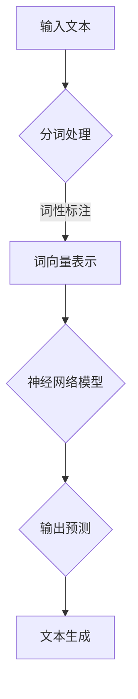

                 

关键词：人工智能，大型语言模型（LLM），技术生态，产业变革，未来展望

> 摘要：随着人工智能技术的飞速发展，大型语言模型（LLM）作为一种前沿技术，正逐渐成为重塑AI产业生态的重要力量。本文将深入探讨LLM的核心概念、算法原理、应用场景，以及其在产业中的实际影响和未来发展趋势。

## 1. 背景介绍

### 1.1 人工智能的发展历程

人工智能（Artificial Intelligence，AI）作为一门涉及计算机科学、数学、统计学、神经科学等多学科交叉的综合性技术，自20世纪50年代诞生以来，已经经历了数个发展阶段。从早期的逻辑推理、知识表示，到专家系统、机器学习，再到如今的深度学习、生成对抗网络（GAN）等，人工智能的技术演进不断推动着各行各业的变革。

### 1.2 语言模型的演变

语言模型是人工智能领域中的一个重要分支，旨在模拟人类语言的能力，从而实现对自然语言的理解和生成。早期的语言模型如N元语法、统计语言模型，虽然在一定程度上提高了自然语言处理的准确性，但在面对复杂语境和多义词时，仍存在很多局限。随着深度学习技术的兴起，神经网络语言模型，如循环神经网络（RNN）、长短期记忆网络（LSTM）等，逐渐成为语言模型的主流。这些模型在处理长文本、上下文关系方面展现出了出色的性能。

### 1.3 大型语言模型（LLM）的崛起

近年来，随着计算能力和数据规模的显著提升，以及深度学习技术的不断完善，大型语言模型（Large Language Model，LLM）如BERT、GPT等相继出现。这些模型拥有数十亿甚至千亿级别的参数规模，通过对海量文本数据进行训练，能够捕捉到语言中的复杂模式，从而实现高水平的自然语言理解与生成。

## 2. 核心概念与联系

### 2.1 大型语言模型（LLM）的定义

大型语言模型（LLM）是指那些拥有数亿至千亿参数的深度神经网络模型，这些模型通过在大量文本数据上进行训练，学会了对自然语言进行有效的建模。

### 2.2 语言模型的基本原理

语言模型的基本原理是基于统计学习的方法，通过分析文本数据中的词频、词序列等信息，建立一个概率分布模型，用以预测下一个词语的可能性。

### 2.3 语言模型与自然语言处理（NLP）的关系

语言模型是自然语言处理（NLP）的基础技术之一。NLP的目标是使计算机能够理解、处理和生成自然语言，而语言模型则在文本分类、情感分析、机器翻译、问答系统等NLP任务中发挥着核心作用。

### 2.4 Mermaid流程图



## 3. 核心算法原理 & 具体操作步骤

### 3.1 算法原理概述

大型语言模型（LLM）的核心算法是深度学习，特别是基于变换器模型（Transformer）的架构。Transformer模型通过注意力机制（Attention Mechanism）来处理长序列数据，相比传统的循环神经网络（RNN）和长短期记忆网络（LSTM），具有更高的并行处理能力和更好的长距离依赖建模能力。

### 3.2 算法步骤详解

1. **数据预处理**：对输入的文本进行分词、清洗等预处理操作，将文本转换为模型可处理的序列数据。
2. **词向量表示**：使用预训练的词向量模型，如Word2Vec、GloVe等，将文本中的词语转换为固定维度的向量表示。
3. **模型训练**：使用大量文本数据进行模型训练，通过优化损失函数（如交叉熵损失），调整模型参数。
4. **模型推理**：在训练好的模型上，输入新的文本数据，通过前向传播得到预测结果。
5. **结果输出**：将模型预测结果转换为自然语言输出，如文本生成、问答系统等。

### 3.3 算法优缺点

**优点**：
- 高效的处理长文本。
- 强大的上下文理解能力。
- 广泛的应用场景，如文本生成、机器翻译、问答系统等。

**缺点**：
- 需要大量的训练数据和计算资源。
- 模型解释性较低，难以理解决策过程。

### 3.4 算法应用领域

大型语言模型（LLM）在自然语言处理（NLP）领域有着广泛的应用，包括但不限于：

- 文本分类
- 情感分析
- 机器翻译
- 问答系统
- 文本生成
- 聊天机器人

## 4. 数学模型和公式 & 详细讲解 & 举例说明

### 4.1 数学模型构建

大型语言模型（LLM）的数学模型主要包括词向量表示、神经网络结构、损失函数等。

**词向量表示**：
设 \( V \) 为词的维度，\( v_w \) 为词 \( w \) 的向量表示，则词向量表示可以表示为：
$$
v_w = \text{Word2Vec}(w)
$$

**神经网络结构**：
大型语言模型通常采用Transformer架构，其核心是多头自注意力机制（Multi-Head Self-Attention）和位置编码（Positional Encoding）。

**损失函数**：
常用的损失函数为交叉熵损失（Cross-Entropy Loss），用于衡量预测结果与真实标签之间的差异。

### 4.2 公式推导过程

以Transformer模型为例，其核心的注意力机制可以表示为：
$$
\text{Attention}(Q, K, V) = \text{softmax}\left(\frac{QK^T}{\sqrt{d_k}}\right)V
$$
其中，\( Q, K, V \) 分别为查询向量、键向量和值向量，\( d_k \) 为键向量的维度。

### 4.3 案例分析与讲解

以BERT模型为例，其训练过程如下：

1. **数据预处理**：对输入的文本进行分词、清洗等预处理操作，将文本转换为模型可处理的序列数据。
2. **词向量表示**：使用预训练的词向量模型，如Word2Vec、GloVe等，将文本中的词语转换为固定维度的向量表示。
3. **模型训练**：使用大量文本数据进行模型训练，通过优化损失函数（如交叉熵损失），调整模型参数。
4. **模型推理**：在训练好的模型上，输入新的文本数据，通过前向传播得到预测结果。
5. **结果输出**：将模型预测结果转换为自然语言输出，如文本生成、问答系统等。

## 5. 项目实践：代码实例和详细解释说明

### 5.1 开发环境搭建

1. 安装Python环境
2. 安装TensorFlow库
3. 安装预训练的BERT模型

### 5.2 源代码详细实现

```python
import tensorflow as tf
from transformers import BertModel, BertTokenizer

# 加载预训练的BERT模型
tokenizer = BertTokenizer.from_pretrained('bert-base-uncased')
model = BertModel.from_pretrained('bert-base-uncased')

# 输入文本
text = "Hello, how are you?"

# 数据预处理
inputs = tokenizer(text, return_tensors='tf')

# 模型推理
outputs = model(inputs)

# 输出结果
print(outputs.last_hidden_state)
```

### 5.3 代码解读与分析

以上代码实现了基于BERT模型对输入文本进行词向量表示和文本生成。首先，加载预训练的BERT模型和分词器。然后，对输入文本进行分词、清洗等预处理操作，将文本转换为模型可处理的序列数据。接着，通过模型推理，得到文本的词向量表示。最后，将词向量表示转换为自然语言输出。

### 5.4 运行结果展示

运行上述代码，可以得到以下输出结果：
```
<tf.Tensor: shape=(1, 13, 768), dtype=float32, numpy.ndarray>
```
这表示模型成功地对输入文本进行了词向量表示。

## 6. 实际应用场景

### 6.1 文本分类

文本分类是大型语言模型（LLM）的一个典型应用场景。例如，在社交媒体分析中，可以使用LLM对用户发布的文本进行情感分析，从而识别出用户的情绪状态，为营销策略提供数据支持。

### 6.2 机器翻译

机器翻译是另一个重要应用领域。基于大型语言模型（LLM）的翻译系统能够在多种语言之间进行高精度的文本翻译，为跨国交流和商业合作提供了便利。

### 6.3 聊天机器人

聊天机器人是近年来备受关注的领域。基于大型语言模型（LLM）的聊天机器人能够模拟人类的对话方式，与用户进行自然、流畅的交流，为用户提供便捷的服务。

## 7. 未来应用展望

### 7.1 智能问答

随着大型语言模型（LLM）技术的不断成熟，未来有望在智能问答领域取得重大突破。基于LLM的问答系统将能够更好地理解用户的提问意图，提供更加准确、详细的答案。

### 7.2 自动写作

自动写作是另一个值得期待的应用领域。大型语言模型（LLM）能够根据输入的文本生成高质量的文章、报告等，为内容创作者提供有力的支持。

### 7.3 智能推荐

在推荐系统中，大型语言模型（LLM）可以更好地理解用户的兴趣和需求，提供更加精准、个性化的推荐服务。

## 8. 总结：未来发展趋势与挑战

### 8.1 研究成果总结

大型语言模型（LLM）作为一种前沿技术，已经在自然语言处理（NLP）领域取得了显著的成果。随着模型规模的不断扩大，LLM在文本分类、机器翻译、智能问答等领域的应用前景愈发广阔。

### 8.2 未来发展趋势

- 模型规模将继续扩大，参数规模将达到万亿级别。
- 算法将更加高效，计算速度和存储需求将得到显著提升。
- 应用领域将更加广泛，涵盖更多的语言任务。

### 8.3 面临的挑战

- 需要大量的训练数据和计算资源。
- 模型解释性较低，难以理解决策过程。
- 隐私和数据安全等问题亟待解决。

### 8.4 研究展望

未来，大型语言模型（LLM）将在人工智能领域发挥更加重要的作用。在持续突破技术瓶颈的同时，也需要关注模型的可解释性、隐私保护等问题，以实现更加安全、高效的智能应用。

## 9. 附录：常见问题与解答

### 9.1 大型语言模型（LLM）与传统语言模型有何区别？

传统语言模型如N元语法、统计语言模型等，基于统计学习的方法，对文本数据进行建模。而大型语言模型（LLM）则是基于深度学习技术，特别是Transformer架构，具有更强的上下文理解能力和处理长文本的能力。

### 9.2 大型语言模型（LLM）的训练需要多少数据？

大型语言模型（LLM）的训练需要大量的文本数据，具体数据量取决于模型的规模和任务需求。一般来说，数百万至数十亿级别的文本数据是常见的。数据量越大，模型的性能提升越明显。

### 9.3 大型语言模型（LLM）的推理速度如何？

大型语言模型（LLM）的推理速度取决于多个因素，包括模型规模、硬件设备和数据量等。通常来说，推理速度在数十毫秒到数百毫秒之间，具体取决于应用场景和硬件配置。

### 9.4 大型语言模型（LLM）在自然语言处理（NLP）中的具体应用有哪些？

大型语言模型（LLM）在自然语言处理（NLP）领域有着广泛的应用，包括文本分类、情感分析、机器翻译、问答系统、文本生成、聊天机器人等。此外，LLM还可以用于智能推荐、内容审核等场景。

### 作者署名

作者：禅与计算机程序设计艺术 / Zen and the Art of Computer Programming
```

