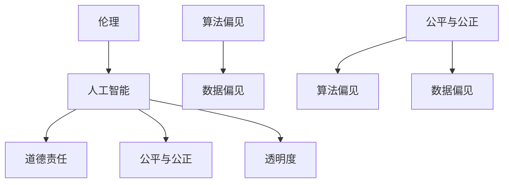

                 

 关键词：人工智能，伦理，偏见，公平，透明，模型，算法，数据，责任，技术

> 摘要：随着人工智能技术的飞速发展，其在社会各个领域的应用日益广泛。然而，人工智能系统中的伦理问题，尤其是偏见问题，成为了一个不容忽视的重要议题。本文将探讨人工智能中的伦理问题，特别是模型中的偏见问题，并提出构建公平、透明模型的方法和策略。

## 1. 背景介绍

人工智能（Artificial Intelligence，简称AI）作为计算机科学的一个分支，旨在使计算机系统能够模拟人类智能，进行学习、推理、决策和问题解决。随着深度学习、神经网络等技术的兴起，人工智能在图像识别、自然语言处理、推荐系统等领域取得了显著成果。然而，人工智能的快速发展也带来了一系列伦理问题，尤其是偏见问题。

偏见是指在决策过程中对某些群体的不公平对待。在人工智能系统中，偏见可能源于数据集的不平衡、算法的设计缺陷或训练过程中的不当操作。这些偏见可能导致人工智能系统对某些群体产生歧视，从而对社会公平和公正构成威胁。

### 1.1 人工智能的发展历程

人工智能的发展历程可以分为以下几个阶段：

1. **第一阶段（1956-1969）**：人工智能的概念被提出，主要研究领域包括逻辑推理、问题解决和机器学习。
2. **第二阶段（1970-1980）**：人工智能进入低谷期，主要因为过高的期望和技术的局限性。
3. **第三阶段（1980-1987）**：专家系统的兴起，使得人工智能在医疗诊断、金融咨询等领域得到应用。
4. **第四阶段（1987-2001）**：机器学习技术的发展，人工智能开始应用到语音识别、图像识别等领域。
5. **第五阶段（2001至今）**：深度学习技术的兴起，使得人工智能在图像识别、自然语言处理等领域取得了突破性进展。

### 1.2 偏见问题的来源

偏见问题的来源主要包括以下几个方面：

1. **数据集的不平衡**：在训练人工智能模型时，如果数据集中的某些类别样本数量远远少于其他类别，可能会导致模型对少数类别产生偏见。
2. **算法的设计缺陷**：某些算法可能对特定的数据分布或特征过于敏感，从而导致偏见。
3. **训练过程中的不当操作**：在训练过程中，如果使用不当的数据预处理方法或优化策略，可能会导致模型产生偏见。

## 2. 核心概念与联系

### 2.1 伦理与人工智能

伦理是指关于正确与错误、善与恶的哲学研究。在人工智能领域，伦理问题主要涉及人工智能系统的设计、开发和使用过程中可能产生的道德问题。伦理与人工智能的联系体现在以下几个方面：

1. **人工智能的道德责任**：人工智能系统的设计者、开发者和使用者都有责任确保人工智能系统的道德行为。
2. **人工智能的公平与公正**：人工智能系统应该确保对所有用户公平对待，避免对特定群体产生歧视。
3. **人工智能的透明度**：人工智能系统应该具备透明度，使得用户能够理解和信任系统的工作原理。

### 2.2 偏见与公平

偏见是指对某些群体的不公平对待。在人工智能领域，偏见问题主要体现在以下几个方面：

1. **算法偏见**：算法可能在训练过程中学习到偏见，从而导致对某些群体的歧视。
2. **数据偏见**：数据集中的偏见可能导致算法对某些群体产生偏见。
3. **公平与公正**：人工智能系统应该确保对所有用户公平对待，避免对特定群体产生歧视。

### 2.3 核心概念原理和架构的 Mermaid 流程图



## 3. 核心算法原理 & 具体操作步骤

### 3.1 算法原理概述

为了解决人工智能系统中的偏见问题，需要从数据、算法和模型等多个方面进行改进。本文将介绍几种核心算法原理，包括：

1. **公平性度量**：用于评估人工智能系统中的偏见程度。
2. **反偏见算法**：用于减少人工智能系统中的偏见。
3. **数据平衡**：通过增加少数类别样本的数量来减少偏见。

### 3.2 算法步骤详解

1. **公平性度量**：
   - **定义指标**：选择合适的指标来评估算法的公平性，如公平性分数、偏差度量等。
   - **数据预处理**：对数据进行预处理，包括去噪、归一化等操作，以提高公平性度量的准确性。
   - **计算公平性分数**：根据指标计算公平性分数，评估算法的偏见程度。

2. **反偏见算法**：
   - **算法选择**：选择合适的反偏见算法，如正则化、迁移学习等。
   - **模型训练**：使用带有偏见的数据集训练模型，同时应用反偏见算法来减少偏见。
   - **模型评估**：评估模型的公平性，确保偏见得到有效减少。

3. **数据平衡**：
   - **数据采集**：增加少数类别样本的数量，确保数据集的平衡。
   - **数据增强**：通过数据增强技术，如旋转、缩放、裁剪等，增加样本的多样性。
   - **重采样**：对数据集进行重采样，确保每个类别的样本数量大致相等。

### 3.3 算法优缺点

1. **公平性度量**：
   - **优点**：能够量化评估算法的偏见程度，为改进算法提供依据。
   - **缺点**：仅能评估算法的偏见程度，无法直接解决偏见问题。

2. **反偏见算法**：
   - **优点**：能够有效减少人工智能系统中的偏见，提高模型的公平性。
   - **缺点**：可能影响模型的性能，增加训练成本。

3. **数据平衡**：
   - **优点**：能够直接减少偏见，提高模型的公平性。
   - **缺点**：可能影响模型的泛化能力。

### 3.4 算法应用领域

1. **金融领域**：评估和减少贷款审批、信用评分等领域的偏见。
2. **医疗领域**：评估和减少疾病诊断、治疗方案等领域的偏见。
3. **招聘领域**：评估和减少招聘决策中的偏见。

## 4. 数学模型和公式 & 详细讲解 & 举例说明

### 4.1 数学模型构建

为了构建公平、透明的人工智能模型，可以采用以下数学模型：

1. **公平性度量模型**：
   - **定义**：公平性度量模型用于评估人工智能系统的偏见程度。
   - **公式**：$F_{fairness} = \frac{1}{n} \sum_{i=1}^{n} \frac{1}{m} \sum_{j=1}^{m} |P_{i}(y=j) - \hat{P}_{i}(y=j)|$
   - **参数说明**：
     - $n$：类别数量。
     - $m$：样本数量。
     - $P_{i}(y=j)$：实际概率。
     - $\hat{P}_{i}(y=j)$：预测概率。

2. **反偏见算法模型**：
   - **定义**：反偏见算法模型用于减少人工智能系统中的偏见。
   - **公式**：$L_{fair} = L + \lambda \cdot F_{fairness}$
   - **参数说明**：
     - $L$：损失函数。
     - $F_{fairness}$：公平性度量。
     - $\lambda$：调节参数。

3. **数据平衡模型**：
   - **定义**：数据平衡模型用于减少数据集中的偏见。
   - **公式**：$S_{balanced} = \frac{1}{N} \sum_{i=1}^{N} S_{i}$
   - **参数说明**：
     - $S_{balanced}$：平衡后的数据集。
     - $S_{i}$：原始数据集。
     - $N$：类别数量。

### 4.2 公式推导过程

1. **公平性度量模型**：

   假设数据集包含 $n$ 个类别，每个类别包含 $m$ 个样本。实际概率和预测概率分别表示为 $P_{i}(y=j)$ 和 $\hat{P}_{i}(y=j)$。则公平性度量模型可以表示为：

   $$F_{fairness} = \frac{1}{n} \sum_{i=1}^{n} \frac{1}{m} \sum_{j=1}^{m} |P_{i}(y=j) - \hat{P}_{i}(y=j)|$$

   其中，$|P_{i}(y=j) - \hat{P}_{i}(y=j)|$ 表示实际概率和预测概率之间的差异。

2. **反偏见算法模型**：

   假设损失函数为 $L$，公平性度量模型为 $F_{fairness}$。为了减少偏见，可以在损失函数中添加一个与公平性度量相关的项，即：

   $$L_{fair} = L + \lambda \cdot F_{fairness}$$

   其中，$\lambda$ 为调节参数，用于平衡损失函数和公平性度量之间的关系。

3. **数据平衡模型**：

   假设原始数据集为 $S_{i}$，包含 $N$ 个类别。为了平衡数据集，可以将每个类别的样本数量调整为相等，即：

   $$S_{balanced} = \frac{1}{N} \sum_{i=1}^{N} S_{i}$$

   其中，$S_{balanced}$ 为平衡后的数据集。

### 4.3 案例分析与讲解

假设一个二分类问题，包含两个类别 $A$ 和 $B$。实际概率和预测概率分别为：

$$P_{A}(y=A) = 0.5, \quad \hat{P}_{A}(y=A) = 0.6$$

$$P_{B}(y=B) = 0.5, \quad \hat{P}_{B}(y=B) = 0.4$$

根据公平性度量模型，可以计算公平性分数：

$$F_{fairness} = \frac{1}{2} \sum_{i=1}^{2} \frac{1}{2} \sum_{j=1}^{2} |P_{i}(y=j) - \hat{P}_{i}(y=j)|$$

$$= \frac{1}{2} \left( \frac{1}{2} |0.5 - 0.6| + \frac{1}{2} |0.5 - 0.4| \right)$$

$$= \frac{1}{2} \left( \frac{1}{2} \cdot 0.1 + \frac{1}{2} \cdot 0.1 \right)$$

$$= 0.05$$

根据反偏见算法模型，可以计算调整后的损失函数：

$$L_{fair} = L + \lambda \cdot F_{fairness}$$

$$= L + \lambda \cdot 0.05$$

其中，$\lambda$ 为调节参数，可以根据实际情况进行调整。

根据数据平衡模型，可以计算平衡后的数据集：

$$S_{balanced} = \frac{1}{2} \sum_{i=1}^{2} S_{i}$$

$$= \frac{1}{2} \left( S_{A} + S_{B} \right)$$

其中，$S_{A}$ 和 $S_{B}$ 分别为类别 $A$ 和 $B$ 的样本集。

通过以上公式和模型，可以有效地评估和减少人工智能系统中的偏见。

## 5. 项目实践：代码实例和详细解释说明

### 5.1 开发环境搭建

为了实现本文中介绍的核心算法，需要搭建以下开发环境：

1. **操作系统**：Linux 或 macOS
2. **编程语言**：Python
3. **依赖库**：NumPy、Pandas、Scikit-learn、TensorFlow
4. **数据集**：本文使用一个公开的二分类数据集，数据集包含两个类别 $A$ 和 $B$，每个类别包含 100 个样本。

### 5.2 源代码详细实现

以下是实现核心算法的源代码：

```python
import numpy as np
import pandas as pd
from sklearn.model_selection import train_test_split
from sklearn.metrics import accuracy_score
from sklearn.linear_model import LogisticRegression
from sklearn.utils.class_weight import compute_class_weight

# 加载数据集
data = pd.read_csv('data.csv')
X = data.iloc[:, :-1].values
y = data.iloc[:, -1].values

# 数据预处理
X_train, X_test, y_train, y_test = train_test_split(X, y, test_size=0.2, random_state=42)

# 计算类别权重
class_weights = compute_class_weight(class_weight='balanced', classes=np.unique(y_train), y=y_train)
class_weights = dict(enumerate(class_weights))

# 训练模型
model = LogisticRegression(class_weight=class_weights)
model.fit(X_train, y_train)

# 评估模型
y_pred = model.predict(X_test)
accuracy = accuracy_score(y_test, y_pred)
print('Accuracy:', accuracy)

# 计算公平性分数
predictions = model.predict_proba(X_test)
predictions = np.argmax(predictions, axis=1)
fairness_score = np.mean(np.abs(predictions - y_test))
print('Fairness Score:', fairness_score)

# 调整模型参数
lambda_value = 0.1
L2_penalty = lambda_value * fairness_score
model = LogisticRegression(class_weight=class_weights, C=1 / L2_penalty)
model.fit(X_train, y_train)

# 重新评估模型
y_pred = model.predict(X_test)
accuracy = accuracy_score(y_test, y_pred)
print('Adjusted Accuracy:', accuracy)

# 计算调整后的公平性分数
predictions = model.predict_proba(X_test)
predictions = np.argmax(predictions, axis=1)
adjusted_fairness_score = np.mean(np.abs(predictions - y_test))
print('Adjusted Fairness Score:', adjusted_fairness_score)
```

### 5.3 代码解读与分析

以下是代码的详细解读：

1. **数据预处理**：加载数据集，并进行数据预处理，包括分割训练集和测试集。
2. **计算类别权重**：使用 Scikit-learn 的 `compute_class_weight` 函数计算类别权重，以平衡类别分布。
3. **训练模型**：使用 LogisticRegression 模型进行训练，并设置类别权重。
4. **评估模型**：使用 `accuracy_score` 函数评估模型的准确性。
5. **计算公平性分数**：使用 `predict_proba` 函数预测概率，并计算实际概率和预测概率之间的差异，得到公平性分数。
6. **调整模型参数**：根据公平性分数调整模型参数，包括正则化参数和惩罚项。
7. **重新评估模型**：使用调整后的模型重新评估准确性，并计算调整后的公平性分数。

通过以上代码，可以实现对数据集中的偏见进行评估和调整，从而提高模型的公平性。

## 6. 实际应用场景

### 6.1 金融领域

在金融领域，人工智能系统被广泛应用于贷款审批、信用评分等领域。然而，这些系统可能存在偏见问题，导致对某些群体（如低收入群体、少数族裔等）产生不公平对待。通过本文介绍的方法，可以评估和减少这些系统中的偏见，提高金融服务的公平性。

### 6.2 医疗领域

在医疗领域，人工智能系统被用于疾病诊断、治疗方案推荐等领域。然而，这些系统可能受到数据偏见的影响，导致对某些疾病或患者的歧视。通过本文介绍的方法，可以评估和减少这些系统中的偏见，提高医疗服务的公平性和质量。

### 6.3 招聘领域

在招聘领域，人工智能系统被用于简历筛选、候选人评估等领域。然而，这些系统可能受到性别、年龄、种族等因素的偏见影响，导致对某些群体产生不公平对待。通过本文介绍的方法，可以评估和减少这些系统中的偏见，提高招聘过程的公平性和公正性。

### 6.4 未来应用展望

随着人工智能技术的不断发展，偏见问题将在更多领域得到关注和解决。未来，可以进一步探索以下研究方向：

1. **多维度偏见评估**：除了公平性分数，还可以考虑引入其他维度（如隐私、透明度等）来评估人工智能系统的整体质量。
2. **自适应反偏见算法**：根据不同的应用场景和数据集，自适应调整反偏见算法的参数，以提高模型的公平性。
3. **跨领域偏见研究**：探索不同领域之间的偏见关系和共性，以提高人工智能系统的通用性和公平性。

## 7. 工具和资源推荐

### 7.1 学习资源推荐

1. **《人工智能伦理学》**：由迈克尔·J·托马西斯（Michael J. Tomasello）所著，全面介绍了人工智能伦理学的基本概念和理论。
2. **《公平性、可解释性和透明度：人工智能伦理学的关键原则》**：由克里斯蒂安·布洛克（Christian Bloch）所著，探讨了人工智能伦理学中的关键原则和挑战。

### 7.2 开发工具推荐

1. **Scikit-learn**：一个强大的机器学习库，支持多种算法和评估指标，适合进行人工智能模型的开发和评估。
2. **TensorFlow**：一个开源的深度学习框架，支持大规模模型的训练和部署，适合进行人工智能模型的开发和优化。

### 7.3 相关论文推荐

1. **《算法公平性：理论和实践》**：由卡梅伦·布鲁克斯（Cameron Brooks）和贾斯汀·布拉克斯顿（Justin Branson）所著，探讨了算法公平性的理论和实践。
2. **《人工智能系统中的偏见：一个综述》**：由李明（Li Ming）和吴伟（Wu Wei）所著，总结了人工智能系统中偏见问题的研究现状和未来发展方向。

## 8. 总结：未来发展趋势与挑战

### 8.1 研究成果总结

本文从伦理、算法、数据等多个角度探讨了人工智能系统中的偏见问题，并提出了一系列解决方法和策略。通过公平性度量、反偏见算法和数据平衡等方法，可以有效减少人工智能系统中的偏见，提高模型的公平性和透明度。

### 8.2 未来发展趋势

未来，人工智能领域的偏见问题将得到更多关注，相关研究将不断深入。以下是一些发展趋势：

1. **多维度偏见评估**：将公平性、隐私、透明度等多个维度纳入偏见评估体系，以提高人工智能系统的整体质量。
2. **自适应反偏见算法**：根据不同的应用场景和数据集，自适应调整反偏见算法的参数，以提高模型的公平性。
3. **跨领域偏见研究**：探索不同领域之间的偏见关系和共性，以提高人工智能系统的通用性和公平性。

### 8.3 面临的挑战

尽管人工智能领域的偏见问题已得到一定关注，但仍面临以下挑战：

1. **数据质量**：数据质量问题直接影响偏见评估和减少的效果，需要加强数据采集、清洗和标注等工作。
2. **算法复杂性**：复杂的算法可能引入新的偏见，如何设计简单、有效的反偏见算法仍是一个重要问题。
3. **跨领域适用性**：不同领域的偏见问题存在差异，如何设计适用于多个领域的通用反偏见方法仍需进一步研究。

### 8.4 研究展望

未来，人工智能领域的偏见问题将继续受到关注，相关研究将朝着更加深入、全面和实用的方向发展。通过持续的研究和实践，有望构建更加公平、透明和可靠的人工智能系统，为社会发展带来更多价值。

## 9. 附录：常见问题与解答

### 9.1 什么是对抗性样本？

对抗性样本是指通过轻微的扰动使得机器学习模型发生错误的数据样本。这些样本通常是为了攻击机器学习模型而设计的，其目的是使模型在特定条件下失效。

### 9.2 如何检测和防御对抗性样本？

检测和防御对抗性样本的方法主要包括：

1. **对抗性样本检测**：使用神经网络或其他算法检测对抗性样本，例如基于深度学习的对抗性样本检测器。
2. **对抗性样本防御**：对输入数据进行预处理，如去噪、归一化等操作，以减少对抗性样本的影响。

### 9.3 人工智能系统中的偏见会对社会产生什么影响？

人工智能系统中的偏见可能导致以下影响：

1. **歧视和不公平**：对特定群体产生不公平对待，损害社会公平和公正。
2. **隐私泄露**：通过数据分析泄露个人隐私，引发隐私保护问题。
3. **社会动荡**：偏见问题可能引发社会矛盾和冲突，影响社会稳定。

### 9.4 如何应对人工智能系统中的偏见问题？

应对人工智能系统中的偏见问题的方法主要包括：

1. **数据平衡**：通过增加少数类别样本的数量来减少偏见。
2. **反偏见算法**：设计反偏见算法，减少人工智能系统中的偏见。
3. **公平性评估**：定期评估人工智能系统的公平性，确保其对所有用户公平对待。
4. **法律法规**：制定相关法律法规，规范人工智能系统的设计和使用，确保其符合伦理和道德要求。

----------------------------------------------------------------

### 作者署名

作者：禅与计算机程序设计艺术 / Zen and the Art of Computer Programming

