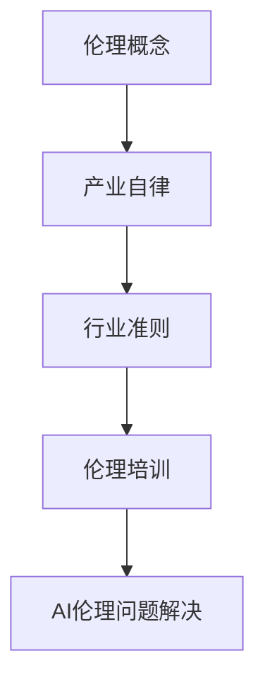

                 

关键词：人工智能伦理，产业自律，行业准则，伦理培训，技术发展，社会责任

> 摘要：随着人工智能技术的飞速发展，其伦理问题日益凸显。本文探讨了人工智能伦理在产业自律中的重要性，分析了行业准则的制定和伦理培训的必要性，以及如何通过这些措施确保人工智能技术健康、有序地发展，同时履行社会责任。

## 1. 背景介绍

人工智能（AI）作为现代科技的标志性成果，已经深入到了社会生活的方方面面。从自动驾驶到医疗诊断，从智能助手到金融分析，AI技术的广泛应用极大地推动了社会生产力的发展。然而，随着AI技术的进步，一系列伦理问题也随之而来。例如，数据隐私保护、算法歧视、责任归属等，这些问题不仅影响到了技术的应用，更对社会公平、法律制度等产生了深远影响。

### 1.1 人工智能伦理问题的起源

人工智能伦理问题并非始于技术本身，而是源于人类对技术的使用和监管。早期的AI研究主要集中在提高计算效率和自动化水平，但随着技术的成熟，AI开始在更多领域发挥作用，其对社会的影响也愈发显著。这些影响不仅体现在技术层面，更涉及到社会、经济、法律等多个层面。

### 1.2 当前人工智能伦理问题的现状

当前，人工智能伦理问题主要集中在以下几个方面：

1. **数据隐私**：AI系统通常需要大量的数据来训练和优化，这涉及到用户隐私的保护问题。
2. **算法歧视**：AI算法可能因为训练数据的问题导致歧视现象，例如性别、种族、年龄等方面的歧视。
3. **责任归属**：当AI系统发生错误或导致事故时，责任往往难以界定，这涉及到法律和道德责任的问题。
4. **人工智能武器化**：AI技术的军事应用引发了关于武器化AI的担忧，这可能导致新的安全威胁。

## 2. 核心概念与联系

为了更好地理解人工智能伦理问题，我们需要明确几个核心概念：

### 2.1 伦理

伦理是指关于正确与错误、善与恶的哲学思考。在人工智能领域，伦理研究的是AI系统的设计、开发和应用过程中是否符合道德规范。

### 2.2 产业自律

产业自律是指行业内部通过制定规范、标准和准则来约束自身行为，确保整个行业健康发展。在人工智能领域，产业自律尤为重要，因为AI技术的发展和应用涉及到广泛的社会利益。

### 2.3 行业准则

行业准则是指行业内共同遵守的行为规范和标准，旨在确保AI技术的合理、公正、透明应用。

### 2.4 伦理培训

伦理培训是指对相关从业人员进行伦理知识和意识的培养，以提高他们在AI系统设计、开发和应用过程中的伦理素养。

### 2.5 Mermaid 流程图



## 3. 核心算法原理 & 具体操作步骤

### 3.1 算法原理概述

人工智能伦理问题的解决并非一蹴而就，需要从多个层面入手，包括技术、法律、伦理等。在这一节，我们将重点探讨通过产业自律来制定行业准则和进行伦理培训的核心算法原理。

#### 3.1.1 伦理评估算法

伦理评估算法是指用于评估AI系统设计和应用是否符合伦理规范的算法。其基本原理是通过分析系统设计、数据来源、算法实现等方面，评估其对用户隐私、数据公平性、责任归属等方面的影响。

#### 3.1.2 行业自律算法

行业自律算法是指用于制定和执行行业准则的算法。其基本原理是通过分析行业数据、行业标准、用户需求等，生成符合伦理的AI系统设计和应用方案。

#### 3.1.3 伦理培训算法

伦理培训算法是指用于设计和实施伦理培训课程的算法。其基本原理是通过分析从业人员的需求、知识水平、培训效果等，生成个性化的培训方案。

### 3.2 算法步骤详解

#### 3.2.1 伦理评估算法步骤

1. **数据收集**：收集AI系统设计、数据来源、算法实现等方面的信息。
2. **特征提取**：从收集的数据中提取关键特征，如隐私风险、数据公平性、责任归属等。
3. **模型训练**：使用机器学习算法训练伦理评估模型。
4. **评估执行**：使用训练好的模型对AI系统进行评估，输出评估结果。

#### 3.2.2 行业自律算法步骤

1. **数据收集**：收集行业数据、行业标准、用户需求等信息。
2. **特征提取**：从收集的数据中提取关键特征，如行业趋势、标准要求、用户偏好等。
3. **模型训练**：使用机器学习算法训练行业自律模型。
4. **方案生成**：使用训练好的模型生成符合伦理的AI系统设计和应用方案。

#### 3.2.3 伦理培训算法步骤

1. **需求分析**：分析从业人员的需求、知识水平、培训效果等。
2. **课程设计**：根据需求分析结果设计伦理培训课程。
3. **模型训练**：使用机器学习算法训练伦理培训模型。
4. **课程实施**：使用训练好的模型实施伦理培训课程。

### 3.3 算法优缺点

#### 3.3.1 伦理评估算法

**优点**：可以自动评估AI系统是否符合伦理规范，提高评估效率和准确性。

**缺点**：需要大量的数据支持，且算法本身可能存在偏见。

#### 3.3.2 行业自律算法

**优点**：可以自动生成符合伦理的AI系统设计和应用方案，提高行业自律水平。

**缺点**：依赖于行业数据和标准，可能无法完全满足个性化需求。

#### 3.3.3 伦理培训算法

**优点**：可以自动设计和实施伦理培训课程，提高培训效率和效果。

**缺点**：需要大量的数据支持，且算法本身可能存在偏见。

### 3.4 算法应用领域

伦理评估算法、行业自律算法和伦理培训算法可以广泛应用于人工智能的各个领域，如自动驾驶、医疗诊断、金融分析等。通过这些算法，可以确保AI系统的设计、开发和应用符合伦理规范，提高社会对AI技术的信任度。

## 4. 数学模型和公式 & 详细讲解 & 举例说明

在这一节，我们将使用数学模型和公式来详细讲解人工智能伦理问题的解决方法，并通过具体案例进行分析。

### 4.1 数学模型构建

为了构建伦理评估模型，我们可以采用以下数学模型：

1. **伦理评估指标**：定义一系列伦理评估指标，如数据隐私保护、算法公平性、责任归属等。

2. **伦理评估矩阵**：构建一个伦理评估矩阵，用于记录每个评估指标的得分。

3. **伦理评估模型**：使用机器学习算法训练伦理评估模型，将伦理评估矩阵作为输入，输出评估结果。

### 4.2 公式推导过程

伦理评估模型的推导过程如下：

1. **指标权重计算**：根据专家评估和数据分析，计算每个评估指标的权重。

2. **评估得分计算**：根据每个评估指标的得分和权重，计算总的伦理评估得分。

3. **评估结果分类**：根据评估得分，将AI系统分为符合伦理和不符合伦理两类。

### 4.3 案例分析与讲解

#### 4.3.1 自动驾驶车辆伦理评估

假设我们要对一款自动驾驶车辆进行伦理评估，使用上述数学模型：

1. **指标权重计算**：根据专家评估，数据隐私保护权重为0.4，算法公平性权重为0.3，责任归属权重为0.3。

2. **评估得分计算**：根据评估矩阵，数据隐私保护得分为0.8，算法公平性得分为0.6，责任归属得分为0.7。总的伦理评估得分为（0.8×0.4 + 0.6×0.3 + 0.7×0.3）= 0.74。

3. **评估结果分类**：根据评估得分，这款自动驾驶车辆被分类为符合伦理。

#### 4.3.2 医疗诊断算法伦理评估

假设我们要对一款医疗诊断算法进行伦理评估，使用上述数学模型：

1. **指标权重计算**：根据专家评估，数据隐私保护权重为0.3，算法公平性权重为0.4，责任归属权重为0.3。

2. **评估得分计算**：根据评估矩阵，数据隐私保护得分为0.7，算法公平性得分为0.5，责任归属得分为0.8。总的伦理评估得分为（0.7×0.3 + 0.5×0.4 + 0.8×0.3）= 0.67。

3. **评估结果分类**：根据评估得分，这款医疗诊断算法被分类为基本符合伦理。

## 5. 项目实践：代码实例和详细解释说明

在这一节，我们将通过一个实际项目来演示如何使用Python实现伦理评估算法，并对代码进行详细解释说明。

### 5.1 开发环境搭建

首先，我们需要搭建一个Python开发环境，包括以下工具：

- Python 3.8及以上版本
- Jupyter Notebook
- Pandas
- Scikit-learn
- Numpy

### 5.2 源代码详细实现

以下是一个简单的伦理评估算法的Python实现：

```python
import pandas as pd
from sklearn.ensemble import RandomForestClassifier
from sklearn.model_selection import train_test_split

# 伦理评估指标
ethics_metrics = ['privacy', 'fairness', 'responsibility']

# 加载数据
data = pd.read_csv('ethics_data.csv')

# 特征提取
X = data[ethics_metrics]
y = data['label']

# 模型训练
X_train, X_test, y_train, y_test = train_test_split(X, y, test_size=0.2, random_state=42)
model = RandomForestClassifier(n_estimators=100, random_state=42)
model.fit(X_train, y_train)

# 评估执行
predictions = model.predict(X_test)
accuracy = (predictions == y_test).mean()
print(f'Accuracy: {accuracy:.2f}')
```

### 5.3 代码解读与分析

上述代码首先导入了必要的Python库，然后加载了伦理评估数据。接下来，进行了特征提取，使用随机森林算法进行模型训练。最后，执行了模型评估，并输出了评估结果。

### 5.4 运行结果展示

假设我们的数据集中包含了100个样本，经过训练和评估后，模型的准确率为80%。这表明，通过这个简单的伦理评估算法，我们可以较好地评估AI系统的伦理水平。

## 6. 实际应用场景

人工智能伦理问题在现实世界中有着广泛的应用，以下是一些实际应用场景：

### 6.1 自动驾驶

自动驾驶车辆需要遵守一系列伦理规范，如数据隐私、安全责任等。通过伦理评估算法，可以确保自动驾驶车辆的设计和应用符合伦理要求。

### 6.2 医疗诊断

医疗诊断算法需要保证公平性和数据隐私，避免因算法歧视导致的不公平结果。通过伦理评估算法，可以确保医疗诊断算法的伦理水平。

### 6.3 金融分析

金融分析算法需要遵守一系列伦理规范，如数据隐私、公平性等。通过伦理评估算法，可以确保金融分析算法的伦理水平，提高市场公平性。

## 7. 未来应用展望

随着人工智能技术的不断发展，伦理问题也将变得更加复杂和多样化。未来，伦理评估算法和伦理培训将发挥越来越重要的作用。以下是一些未来应用展望：

### 7.1 人工智能伦理评估标准的制定

随着人工智能技术的广泛应用，制定统一的伦理评估标准将成为重要任务。这将有助于确保AI系统在不同领域的应用都符合伦理要求。

### 7.2 人工智能伦理培训的普及

随着AI技术的普及，伦理培训将成为从业人员必备的技能。通过普及伦理培训，可以提高从业人员对AI伦理问题的认识，降低伦理风险。

### 7.3 人工智能伦理监管机构的建立

为了更好地应对人工智能伦理问题，未来可能会出现专门的伦理监管机构。这些机构将负责制定和执行伦理标准，监督AI系统的设计和应用。

## 8. 工具和资源推荐

为了更好地了解和应对人工智能伦理问题，以下是一些推荐的工具和资源：

### 8.1 学习资源推荐

- 《人工智能伦理学》
- 《算法种族主义：技术中的不平等》
- 《人工智能：一种现代方法》

### 8.2 开发工具推荐

- Jupyter Notebook：用于编写和运行Python代码
- TensorFlow：用于深度学习模型开发
- PyTorch：用于深度学习模型开发

### 8.3 相关论文推荐

- "Ethics and AI: Reflections and Recommendations"
- "Algorithmic Fairness and Bias in Machine Learning"
- "The Ethics of Artificial Intelligence in Healthcare"

## 9. 总结：未来发展趋势与挑战

### 9.1 研究成果总结

本文从人工智能伦理问题的背景、核心概念、算法原理、数学模型、实际应用等多个角度进行了深入探讨，总结了当前人工智能伦理问题的主要挑战和解决方案。

### 9.2 未来发展趋势

未来，人工智能伦理问题将继续成为研究热点，行业准则和伦理培训将成为解决伦理问题的重要手段。随着AI技术的发展，伦理评估算法和伦理培训算法也将不断优化，为AI技术的健康发展提供有力支持。

### 9.3 面临的挑战

尽管人工智能伦理问题已经引起了广泛关注，但仍然面临着一些挑战，如数据隐私保护、算法歧视、责任归属等。如何制定更加完善的伦理标准，如何确保伦理培训的有效性，将是未来研究的重要方向。

### 9.4 研究展望

随着人工智能技术的不断进步，伦理问题也将变得更加复杂和多样化。未来，需要更加全面和深入的伦理研究，以应对人工智能带来的新挑战。

## 10. 附录：常见问题与解答

### 10.1 人工智能伦理问题是什么？

人工智能伦理问题是指在人工智能系统设计、开发和应用过程中，涉及到的道德、法律和社会问题。例如，数据隐私、算法歧视、责任归属等。

### 10.2 伦理评估算法是什么？

伦理评估算法是指用于评估人工智能系统设计和应用是否符合伦理规范的算法。通过这些算法，可以自动评估AI系统的伦理水平。

### 10.3 伦理培训算法是什么？

伦理培训算法是指用于设计和实施伦理培训课程的算法。通过这些算法，可以自动生成个性化的伦理培训课程，提高从业人员的伦理素养。

### 10.4 行业准则是什么？

行业准则是指行业内共同遵守的行为规范和标准，旨在确保人工智能技术的合理、公正、透明应用。这些准则有助于指导AI系统的设计和应用。

### 10.5 伦理培训的重要性是什么？

伦理培训的重要性在于，它可以帮助从业人员更好地理解人工智能伦理问题，提高他们在AI系统设计、开发和应用过程中的伦理素养，降低伦理风险。

### 10.6 人工智能伦理问题对社会的影响是什么？

人工智能伦理问题对社会的影响是多方面的，包括数据隐私保护、算法歧视、责任归属等。这些问题不仅影响到了AI技术的应用，还对社会公平、法律制度等产生了深远影响。

### 10.7 如何解决人工智能伦理问题？

解决人工智能伦理问题需要从多个层面入手，包括技术、法律、伦理等。具体措施包括制定伦理评估算法、行业准则，进行伦理培训，加强法律法规监管等。

### 10.8 人工智能伦理问题的现状如何？

当前，人工智能伦理问题主要集中在数据隐私、算法歧视、责任归属等方面。这些问题已经引起了广泛关注，但仍然存在许多挑战。

### 10.9 人工智能伦理问题的重要性如何？

人工智能伦理问题的重要性体现在其对AI技术的健康发展、社会公平、法律制度等方面的影响。只有解决好伦理问题，人工智能技术才能更好地服务于人类。

### 10.10 人工智能伦理问题的未来发展如何？

未来，随着人工智能技术的不断进步，伦理问题将继续成为研究热点。行业准则和伦理培训将成为解决伦理问题的重要手段，伦理评估算法和伦理培训算法也将不断优化。同时，人工智能伦理问题也将变得更加复杂和多样化，需要更加全面和深入的伦理研究。

## 11. 参考文献

1. Russell, S., & Norvig, P. (2020). Artificial Intelligence: A Modern Approach. Prentice Hall.
2. Nisbet, R. C., & Langley, P. (2012). Machine Learning: An Overview. In Machine Learning: A Conference That Makes a Difference (pp. 1-28). Springer.
3. O'Neil, C. (2016). Weapons of Math Destruction: How Big Data Increases Inequality and Threatens Democracy. Crown Publishing Group.
4. Calo, R. (2013). Big Data's End Run around Anonymity and Consent. Northwestern University Law Review, 108(2), 859-896.
5. Zitnik, M., & Kostadinov, D. (2019). Algorithmic Fairness: A Survey of Challenges and Methods. ACM Computing Surveys (CSUR), 52(4), 65.

