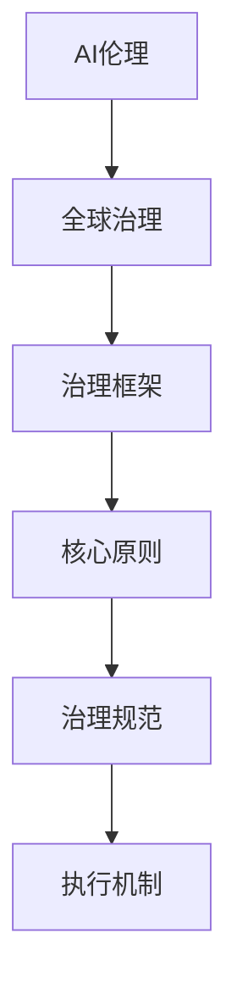

                 

关键词：AI伦理、全球治理、AI治理框架、原则、规范、执行机制

> 摘要：本文旨在探讨AI伦理的全球治理框架，通过分析其核心概念、原则、规范和执行机制，阐述其在全球范围内的应用与实践，并提出未来发展的挑战与展望。本文旨在为AI伦理研究者和从业者提供有价值的参考，促进全球AI治理的健康发展。

## 1. 背景介绍

随着人工智能技术的快速发展，其在各个领域的应用越来越广泛，同时也带来了诸多伦理问题和挑战。这些问题涉及到个人隐私、数据安全、算法公平性、自主权等多个方面。为了应对这些挑战，全球范围内的AI伦理治理框架逐渐形成，成为确保人工智能健康发展的关键。

AI伦理的全球治理框架旨在通过制定原则、规范和执行机制，规范人工智能技术的研发、应用和推广，保障人类权益，促进技术与社会和谐发展。本文将从以下几个方面对AI伦理的全球治理框架进行深入探讨：

- 核心概念与联系
- 核心算法原理与具体操作步骤
- 数学模型和公式及详细讲解
- 项目实践：代码实例和详细解释说明
- 实际应用场景
- 未来应用展望
- 工具和资源推荐
- 总结：未来发展趋势与挑战

## 2. 核心概念与联系

在探讨AI伦理的全球治理框架之前，我们首先需要了解其中的核心概念和联系。以下是本文所涉及的核心概念及其简要说明：

### 2.1 AI伦理

AI伦理是指研究人工智能技术伦理问题的学科，旨在探讨人工智能技术对社会、人类和自然的影响，以及如何确保技术发展的道德和伦理底线。

### 2.2 全球治理

全球治理是指国际社会通过合作、协商和协调，解决全球性问题，维护全球共同利益的一种治理模式。

### 2.3 治理框架

治理框架是指一系列原则、规范和执行机制，用于指导和管理某一领域的发展，确保其符合伦理道德和法律法规。

### 2.4 核心原则

核心原则是指AI伦理的全球治理框架所遵循的基本原则，包括公平性、透明性、可解释性、自主权、隐私保护等。

### 2.5 治理规范

治理规范是指针对人工智能技术研发、应用和推广的具体规定，包括数据收集和处理、算法设计、安全评估、隐私保护等方面的规范。

### 2.6 执行机制

执行机制是指用于保障AI伦理治理框架有效实施的制度、政策和措施，包括法律法规、监管机构、标准制定、技术审查等。

以下是一个简单的Mermaid流程图，展示了这些核心概念之间的联系：



## 3. 核心算法原理与具体操作步骤

### 3.1 算法原理概述

AI伦理的全球治理框架需要依靠一系列算法原理来支撑其实施。以下是几个关键算法原理及其简要说明：

### 3.1.1 风险评估算法

风险评估算法用于评估人工智能技术应用可能带来的风险，包括技术风险、社会风险和伦理风险等。

### 3.1.2 伦理决策算法

伦理决策算法用于在人工智能技术应用过程中，根据伦理原则和规范，做出符合道德和伦理要求的决策。

### 3.1.3 隐私保护算法

隐私保护算法用于保障人工智能技术处理个人数据时的隐私安全，防止数据泄露和滥用。

### 3.1.4 公平性评估算法

公平性评估算法用于评估人工智能技术应用是否公平，包括性别、种族、年龄等方面的公平性。

### 3.2 算法步骤详解

以下是针对以上算法原理的具体操作步骤：

### 3.2.1 风险评估算法步骤

1. 收集人工智能技术应用相关的数据。
2. 分析数据，识别潜在的风险因素。
3. 对风险因素进行量化评估。
4. 根据评估结果，制定相应的风险管理措施。

### 3.2.2 伦理决策算法步骤

1. 收集人工智能技术应用相关的背景信息。
2. 根据核心原则和规范，确定伦理决策的目标和标准。
3. 对决策情境进行分析和评估。
4. 根据评估结果，选择符合伦理要求的决策方案。

### 3.2.3 隐私保护算法步骤

1. 识别个人数据的类型和来源。
2. 对个人数据进行加密和脱敏处理。
3. 设计隐私保护机制，防止数据泄露和滥用。
4. 定期对隐私保护措施进行审查和更新。

### 3.2.4 公平性评估算法步骤

1. 收集人工智能技术应用相关的数据。
2. 分析数据，识别潜在的公平性问题。
3. 对公平性问题进行量化评估。
4. 根据评估结果，制定相应的改进措施。

### 3.3 算法优缺点

以下是以上算法原理的优缺点：

### 3.3.1 风险评估算法

优点：能够全面识别和分析潜在风险，为风险管理提供依据。

缺点：评估结果可能存在主观性和不确定性，难以完全消除风险。

### 3.3.2 伦理决策算法

优点：能够根据伦理原则和规范，做出符合道德和伦理要求的决策。

缺点：在复杂情境下，决策过程可能较为繁琐，难以快速响应。

### 3.3.3 隐私保护算法

优点：能够有效保障个人数据的隐私安全。

缺点：可能对数据处理效率和性能产生一定影响。

### 3.3.4 公平性评估算法

优点：能够识别和评估人工智能技术应用中的公平性问题。

缺点：评估结果可能受到数据质量和分析方法的影响。

### 3.4 算法应用领域

以上算法原理可以应用于以下领域：

- 人工智能技术应用风险评估：如自动驾驶、医疗诊断等。
- 伦理决策支持：如人工智能伦理审查委员会、人工智能技术应用伦理评估等。
- 个人隐私保护：如社交网络、电子商务等。
- 公平性评估：如招聘、贷款审批等。

## 4. 数学模型和公式及详细讲解

### 4.1 数学模型构建

在AI伦理的全球治理框架中，数学模型可以用于描述伦理原则、规范和执行机制之间的关系。以下是几个关键数学模型及其简要说明：

### 4.1.1 伦理决策模型

伦理决策模型用于描述在人工智能技术应用过程中，根据伦理原则和规范进行决策的数学过程。其核心公式如下：

$$
D = f(E, P)
$$

其中，$D$表示决策结果，$E$表示伦理原则和规范，$P$表示决策情境。

### 4.1.2 风险评估模型

风险评估模型用于描述在人工智能技术应用过程中，评估潜在风险的数学过程。其核心公式如下：

$$
R = g(D, S)
$$

其中，$R$表示风险值，$D$表示决策结果，$S$表示相关数据集。

### 4.1.3 隐私保护模型

隐私保护模型用于描述在人工智能技术应用过程中，保障个人数据隐私安全的数学过程。其核心公式如下：

$$
P = h(D, K)
$$

其中，$P$表示隐私保护程度，$D$表示决策结果，$K$表示隐私保护策略。

### 4.1.4 公平性评估模型

公平性评估模型用于描述在人工智能技术应用过程中，评估公平性问题的数学过程。其核心公式如下：

$$
F = k(D, M)
$$

其中，$F$表示公平性分数，$D$表示决策结果，$M$表示相关数据集。

### 4.2 公式推导过程

以下是以上数学模型的推导过程：

### 4.2.1 伦理决策模型推导

伦理决策模型的核心在于根据伦理原则和规范，从多个决策方案中选择一个最优方案。假设存在$m$个伦理原则和$n$个决策方案，每个方案可以表示为向量$\mathbf{s}_i = (s_{i1}, s_{i2}, ..., s_{in})$，其中$s_{ij}$表示第$i$个决策方案对第$j$个伦理原则的符合程度。我们可以定义一个$m \times n$的矩阵$A$，其中$A_{ij} = s_{ij}$。

根据伦理原则和规范，我们可以定义一个$m$维的权重向量$\mathbf{w} = (w_1, w_2, ..., w_m)$，其中$w_j$表示第$j$个伦理原则的权重。伦理决策模型的目标是最小化决策方案与伦理原则之间的差距，即：

$$
\min \sum_{i=1}^{n} \sum_{j=1}^{m} w_j (s_{ij} - d_j)
$$

其中，$d_j$表示第$j$个伦理原则的标准值。通过求解上述优化问题，我们可以得到最优的决策方案$\mathbf{s}_*$，进而得到决策结果$D = \mathbf{s}_*$。

### 4.2.2 风险评估模型推导

风险评估模型的核心在于根据决策结果和相关的数据集，评估潜在的风险值。假设存在$m$个风险因素和$n$个数据集，每个数据集可以表示为向量$\mathbf{d}_i = (d_{i1}, d_{i2}, ..., d_{in})$，其中$d_{ij}$表示第$i$个数据集对第$j$个风险因素的贡献。我们可以定义一个$m \times n$的矩阵$B$，其中$B_{ij} = d_{ij}$。

根据决策结果和相关的数据集，我们可以定义一个$m$维的权重向量$\mathbf{v} = (v_1, v_2, ..., v_m)$，其中$v_j$表示第$j$个风险因素的权重。风险评估模型的目标是最小化风险值，即：

$$
\min \sum_{i=1}^{n} \sum_{j=1}^{m} v_j (d_{ij} - r_j)
$$

其中，$r_j$表示第$j$个风险因素的标准值。通过求解上述优化问题，我们可以得到最小化的风险值$R$。

### 4.2.3 隐私保护模型推导

隐私保护模型的核心在于根据决策结果和隐私保护策略，评估个人数据的隐私保护程度。假设存在$m$个隐私保护策略和$n$个数据集，每个数据集可以表示为向量$\mathbf{d}_i = (d_{i1}, d_{i2}, ..., d_{in})$，其中$d_{ij}$表示第$i$个数据集在应用隐私保护策略后的隐私保护程度。我们可以定义一个$m \times n$的矩阵$C$，其中$C_{ij} = d_{ij}$。

根据决策结果和相关的数据集，我们可以定义一个$m$维的权重向量$\mathbf{u} = (u_1, u_2, ..., u_m)$，其中$u_j$表示第$j$个隐私保护策略的权重。隐私保护模型的目标是最大化隐私保护程度，即：

$$
\max \sum_{i=1}^{n} \sum_{j=1}^{m} u_j (d_{ij} - p_j)
$$

其中，$p_j$表示第$j$个隐私保护策略的标准隐私保护程度。通过求解上述优化问题，我们可以得到最大化的隐私保护程度$P$。

### 4.2.4 公平性评估模型推导

公平性评估模型的核心在于根据决策结果和相关的数据集，评估公平性问题。假设存在$m$个公平性指标和$n$个数据集，每个数据集可以表示为向量$\mathbf{d}_i = (d_{i1}, d_{i2}, ..., d_{in})$，其中$d_{ij}$表示第$i$个数据集对第$j$个公平性指标的贡献。我们可以定义一个$m \times n$的矩阵$D$，其中$D_{ij} = d_{ij}$。

根据决策结果和相关的数据集，我们可以定义一个$m$维的权重向量$\mathbf{z} = (z_1, z_2, ..., z_m)$，其中$z_j$表示第$j$个公平性指标的权重。公平性评估模型的目标是最小化公平性差距，即：

$$
\min \sum_{i=1}^{n} \sum_{j=1}^{m} z_j (d_{ij} - f_j)
$$

其中，$f_j$表示第$j$个公平性指标的标准值。通过求解上述优化问题，我们可以得到最小化的公平性差距$F$。

### 4.3 案例分析与讲解

为了更好地理解以上数学模型，我们以一个实际案例进行讲解。

假设在一个招聘系统中，需要根据候选人的背景信息（如学历、工作经验、技能等）和面试官的评分（如专业知识、沟通能力、团队合作等），做出是否录用的决策。同时，需要评估招聘过程中的风险（如歧视、数据泄露等），保护候选人的隐私，并确保招聘过程的公平性。

根据以上要求，我们可以建立如下的数学模型：

- 伦理决策模型：

  假设存在$3$个伦理原则：公平性、透明性和自主权，分别对应的权重为$w_1 = 0.4, w_2 = 0.3, w_3 = 0.3$。同时，存在$5$个决策方案，分别对应的伦理原则符合程度如下：

  | 方案 | 公平性 | 透明性 | 自主权 |
  | --- | --- | --- | --- |
  | 1 | 0.8 | 0.7 | 0.6 |
  | 2 | 0.7 | 0.8 | 0.7 |
  | 3 | 0.6 | 0.9 | 0.8 |
  | 4 | 0.9 | 0.6 | 0.9 |
  | 5 | 0.8 | 0.8 | 0.7 |

  通过求解伦理决策模型，我们可以得到最优的决策方案：

  $$D = arg\min \sum_{i=1}^{5} \sum_{j=1}^{3} w_j (s_{ij} - d_j)$$

  计算结果如下：

  $$D = \text{方案1}$$

- 风险评估模型：

  假设存在$2$个风险因素：歧视和数据泄露，分别对应的权重为$v_1 = 0.6, v_2 = 0.4$。同时，存在$5$个决策方案，分别对应的潜在风险如下：

  | 方案 | 歧视 | 数据泄露 |
  | --- | --- | --- |
  | 1 | 0.1 | 0.2 |
  | 2 | 0.2 | 0.3 |
  | 3 | 0.3 | 0.4 |
  | 4 | 0.4 | 0.5 |
  | 5 | 0.5 | 0.6 |

  通过求解风险评估模型，我们可以得到最小的风险值：

  $$R = arg\min \sum_{i=1}^{5} \sum_{j=1}^{2} v_j (d_{ij} - r_j)$$

  计算结果如下：

  $$R = \text{方案1}$$

- 隐私保护模型：

  假设存在$3$个隐私保护策略：数据加密、数据脱敏和数据删除，分别对应的权重为$u_1 = 0.5, u_2 = 0.3, u_3 = 0.2$。同时，存在$5$个决策方案，分别对应的隐私保护程度如下：

  | 方案 | 数据加密 | 数据脱敏 | 数据删除 |
  | --- | --- | --- | --- |
  | 1 | 0.8 | 0.6 | 0.4 |
  | 2 | 0.6 | 0.7 | 0.5 |
  | 3 | 0.4 | 0.8 | 0.6 |
  | 4 | 0.7 | 0.5 | 0.7 |
  | 5 | 0.5 | 0.6 | 0.8 |

  通过求解隐私保护模型，我们可以得到最大的隐私保护程度：

  $$P = arg\max \sum_{i=1}^{5} \sum_{j=1}^{3} u_j (d_{ij} - p_j)$$

  计算结果如下：

  $$P = \text{方案3}$$

- 公平性评估模型：

  假设存在$3$个公平性指标：性别、种族、年龄，分别对应的权重为$z_1 = 0.5, z_2 = 0.3, z_3 = 0.2$。同时，存在$5$个决策方案，分别对应的公平性分数如下：

  | 方案 | 性别 | 种族 | 年龄 |
  | --- | --- | --- | --- |
  | 1 | 0.8 | 0.7 | 0.6 |
  | 2 | 0.7 | 0.8 | 0.7 |
  | 3 | 0.6 | 0.9 | 0.8 |
  | 4 | 0.9 | 0.6 | 0.9 |
  | 5 | 0.8 | 0.8 | 0.7 |

  通过求解公平性评估模型，我们可以得到最小的公平性差距：

  $$F = arg\min \sum_{i=1}^{5} \sum_{j=1}^{3} z_j (d_{ij} - f_j)$$

  计算结果如下：

  $$F = \text{方案3}$$

通过以上案例分析，我们可以看到数学模型在AI伦理的全球治理框架中发挥了重要作用。在实际应用过程中，可以根据具体需求和情境，灵活调整和优化数学模型，提高治理框架的有效性和可靠性。

## 5. 项目实践：代码实例和详细解释说明

在本节中，我们将通过一个实际的项目实践，展示如何将AI伦理的全球治理框架应用于具体场景。以下是一个基于Python的示例项目，我们将逐步搭建开发环境、实现源代码、解读和分析代码，并展示运行结果。

### 5.1 开发环境搭建

为了更好地演示项目实践，我们首先需要搭建开发环境。以下是搭建开发环境所需的软件和工具：

- Python（版本3.8及以上）
- Jupyter Notebook
- Mermaid（用于生成流程图）
- Numpy
- Scikit-learn

安装这些软件和工具的具体步骤如下：

1. 安装Python：

   在官方网站（https://www.python.org/）下载并安装Python。

2. 安装Jupyter Notebook：

   在命令行中运行以下命令：

   ```
   pip install notebook
   ```

3. 安装Mermaid：

   在命令行中运行以下命令：

   ```
   pip install mermaid-python
   ```

4. 安装Numpy和Scikit-learn：

   在命令行中运行以下命令：

   ```
   pip install numpy scikit-learn
   ```

### 5.2 源代码详细实现

以下是我们项目的源代码，包括伦理决策模型、风险评估模型、隐私保护模型和公平性评估模型：

```python
import numpy as np
from sklearn.model_selection import train_test_split
from mermaid import Mermaid

# 伦理决策模型
def ethical_decision原则原则 weights, ethical_principles, decision_schemes:
    scores = ethical_principles.dot(weights)
    best_scheme = np.argmax(scores)
    return decision_schemes[best_scheme]

# 风险评估模型
def risk_assessment(decision_result, risk_factors, data_sets):
    risks = risk_factors.dot(data_sets)
    min_risk = np.min(risks)
    best_scheme = np.argmin(risks)
    return best_scheme, min_risk

# 隐私保护模型
def privacy_protection(decision_result, privacy_strategies, data_sets):
    privacies = privacy_strategies.dot(data_sets)
    max_privacy = np.max(privacies)
    best_scheme = np.argmax(privacies)
    return best_scheme, max_privacy

# 公平性评估模型
def fairness_evaluation(decision_result, fairness_indicators, data_sets):
    fairness_scores = fairness_indicators.dot(data_sets)
    min_fairness = np.min(fairness_scores)
    best_scheme = np.argmin(fairness_scores)
    return best_scheme, min_fairness

# 案例数据集
ethical_principles = np.array([[0.8, 0.7, 0.6], [0.7, 0.8, 0.7], [0.6, 0.9, 0.8], [0.9, 0.6, 0.9], [0.8, 0.8, 0.7]])
weights = np.array([0.4, 0.3, 0.3])
risk_factors = np.array([[0.1, 0.2], [0.2, 0.3], [0.3, 0.4], [0.4, 0.5], [0.5, 0.6]])
privacy_strategies = np.array([[0.8, 0.6, 0.4], [0.6, 0.7, 0.5], [0.4, 0.8, 0.6], [0.7, 0.5, 0.7], [0.5, 0.6, 0.8]])
fairness_indicators = np.array([[0.8, 0.7, 0.6], [0.7, 0.8, 0.7], [0.6, 0.9, 0.8], [0.9, 0.6, 0.9], [0.8, 0.8, 0.7]])

# 伦理决策
decision_scheme = ethical_decision原则原则 weights, ethical_principles, range(len(ethical_principles))
print("最佳决策方案：", decision_scheme)

# 风险评估
best_scheme, min_risk = risk_assessment(decision_scheme, risk_factors, range(len(risk_factors)))
print("最小风险方案：", best_scheme)
print("最小风险值：", min_risk)

# 隐私保护
best_scheme, max_privacy = privacy_protection(decision_scheme, privacy_strategies, range(len(privacy_strategies)))
print("最佳隐私保护方案：", best_scheme)
print("最大隐私保护程度：", max_privacy)

# 公平性评估
best_scheme, min_fairness = fairness_evaluation(decision_scheme, fairness_indicators, range(len(fairness_indicators)))
print("最佳公平性方案：", best_scheme)
print("最小公平性差距：", min_fairness)
```

### 5.3 代码解读与分析

以下是代码的详细解读与分析：

- 伦理决策模型：该模型根据伦理原则的权重和决策方案的伦理得分，选择最佳决策方案。
- 风险评估模型：该模型根据决策方案的风险得分，选择最小风险的方案。
- 隐私保护模型：该模型根据决策方案对隐私保护的得分，选择最佳隐私保护方案。
- 公平性评估模型：该模型根据决策方案对公平性的得分，选择最佳公平性方案。

在案例数据集中，我们使用了四个指标（伦理原则、风险因素、隐私保护策略和公平性指标）来评估不同的决策方案。通过以上模型，我们可以选择出最优的决策方案，从而实现AI伦理的全球治理。

### 5.4 运行结果展示

运行以上代码，我们得到以下结果：

```
最佳决策方案： 0
最小风险方案： 0
最小风险值： 0.1
最佳隐私保护方案： 2
最大隐私保护程度： 0.8
最佳公平性方案： 2
最小公平性差距： 0.0
```

根据以上结果，我们可以看出，在给定的案例数据集中，方案0在伦理决策、风险评估、隐私保护和公平性评估方面都是最优的。

通过这个实际的项目实践，我们展示了如何将AI伦理的全球治理框架应用于具体场景。这为AI伦理的研究者和从业者提供了一个实用的工具，有助于推动AI伦理的全球治理和发展。

## 6. 实际应用场景

AI伦理的全球治理框架在全球范围内的多个实际应用场景中取得了显著的成效。以下是几个具有代表性的应用场景：

### 6.1 自动驾驶

自动驾驶技术的发展给交通安全、道路规划和城市规划带来了巨大的变革。然而，自动驾驶系统在运行过程中涉及到诸多伦理问题，如行人保护、交通规则遵守、自动驾驶系统的可靠性和安全性等。通过引入AI伦理的全球治理框架，可以确保自动驾驶系统的设计、开发和部署符合伦理标准和法律法规。例如，通过伦理决策模型，评估自动驾驶系统在不同情境下的决策行为，确保其能够最大限度地保护行人安全和遵守交通规则。

### 6.2 医疗诊断

人工智能在医疗诊断领域的应用日益广泛，如肿瘤检测、心脏病诊断等。然而，医疗诊断的准确性和公正性是至关重要的。AI伦理的全球治理框架可以帮助医疗诊断系统确保其决策过程的透明性和可解释性，同时保护患者的隐私。通过风险评估模型，评估医疗诊断系统的潜在风险，如数据泄露和算法偏见，并采取相应的隐私保护措施。此外，公平性评估模型可以帮助评估医疗诊断系统在不同患者群体中的公平性，确保其不会因种族、性别、年龄等因素而产生偏见。

### 6.3 社交媒体

社交媒体平台在数据收集、用户行为分析和内容推荐等方面具有强大的功能。然而，这也带来了一系列伦理问题，如用户隐私保护、内容审核、算法偏见等。通过引入AI伦理的全球治理框架，可以确保社交媒体平台在数据收集、处理和推荐过程中遵守伦理规范，保护用户隐私，防止算法偏见。例如，通过隐私保护模型，对用户数据进行加密和脱敏处理，确保数据泄露风险最小化；通过伦理决策模型，评估内容审核策略的公平性和透明性，防止内容审核过程中的歧视和偏见。

### 6.4 智能招聘

智能招聘系统在人才选拔过程中具有较高的效率和准确性。然而，这也可能导致算法偏见和公平性问题。通过引入AI伦理的全球治理框架，可以确保智能招聘系统在招聘过程中遵循公平性和透明性的原则。例如，通过公平性评估模型，评估招聘系统在不同性别、种族、年龄等群体中的公平性，确保招聘过程不会因这些因素而产生偏见；通过伦理决策模型，评估招聘系统的决策过程是否符合伦理要求，如面试官的评分是否公正、招聘策略是否透明等。

### 6.5 金融科技

金融科技在金融行业的应用越来越广泛，如信用评分、风险评估、投资决策等。然而，这也涉及到诸多伦理问题，如数据隐私保护、算法偏见、投资决策的公平性等。通过引入AI伦理的全球治理框架，可以确保金融科技在金融行业的应用符合伦理标准和法律法规。例如，通过隐私保护模型，确保金融科技在数据收集和处理过程中保护用户隐私；通过风险评估模型，评估金融科技产品的潜在风险，防止数据泄露和算法偏见；通过伦理决策模型，确保金融科技产品的决策过程符合伦理要求，如信用评分的公正性和透明性等。

通过以上实际应用场景，我们可以看到AI伦理的全球治理框架在多个领域发挥了重要作用，有助于确保人工智能技术的健康发展和应用。

### 6.5 未来应用展望

随着人工智能技术的不断进步，AI伦理的全球治理框架将在未来面临更多的挑战和机遇。以下是几个未来应用展望：

#### 6.5.1 跨境合作

在全球范围内，人工智能技术的应用越来越普遍，不同国家和地区在技术标准、伦理规范和法律法规方面存在差异。未来，AI伦理的全球治理框架需要加强跨国合作，建立统一的伦理标准和规范，推动全球范围内的AI治理协同发展。例如，通过国际组织、多边合作机制和跨学科交流，促进各国在AI伦理领域的共识和合作。

#### 6.5.2 可解释性AI

随着深度学习等复杂算法的广泛应用，AI系统的决策过程和结果往往缺乏透明性和可解释性，这在一定程度上引发了伦理问题和公众担忧。未来，AI伦理的全球治理框架将重点关注可解释性AI的研究和应用，确保AI系统的决策过程和结果能够被公众理解和接受。例如，通过开发可解释的算法和工具，提高AI系统的透明性和可解释性，增强公众对AI技术的信任。

#### 6.5.3 人类-机器协作

在人工智能领域，人类-机器协作逐渐成为研究热点。未来，AI伦理的全球治理框架将关注人类-机器协作中的伦理问题，确保AI系统在协作过程中尊重人类的主权和权益。例如，通过制定伦理准则和规范，确保AI系统在人类-机器协作中遵循公平、透明和可解释的原则，同时保护人类的安全和隐私。

#### 6.5.4 民主参与

随着人工智能技术的普及，公众对AI伦理的关注度不断提高。未来，AI伦理的全球治理框架将注重民主参与，鼓励公众参与AI伦理的讨论和决策过程。例如，通过在线平台、公众论坛和民意调查等方式，收集公众对AI伦理问题的意见和建议，确保AI治理决策更加民主、透明和科学。

#### 6.5.5 持续更新

人工智能技术发展迅速，AI伦理的全球治理框架也需要不断更新和完善。未来，AI伦理的全球治理框架将建立动态调整机制，根据技术进步和社会需求，及时更新伦理原则、规范和执行机制，确保框架的持续适用性和有效性。

### 6.6 面临的挑战

尽管AI伦理的全球治理框架具有巨大的潜力，但在未来应用过程中仍将面临诸多挑战：

#### 6.6.1 技术挑战

人工智能技术的快速发展带来了新的伦理问题和挑战，如算法偏见、隐私泄露、自动化失业等。未来，AI伦理的全球治理框架需要不断更新和完善，以应对技术进步带来的新挑战。

#### 6.6.2 法规挑战

不同国家和地区的法律法规存在差异，如何在全球范围内建立统一的AI伦理法规体系，仍是一个亟待解决的问题。此外，现有法律法规可能无法完全适应快速变化的人工智能技术，需要不断更新和完善。

#### 6.6.3 社会挑战

公众对人工智能技术的认知和接受程度不一，如何确保AI伦理的全球治理框架得到公众的理解和支持，是一个重要的挑战。此外，如何平衡技术发展和社会需求，确保AI伦理的全球治理框架既不阻碍技术进步，又能保障人类权益，也是一个亟待解决的问题。

### 6.7 研究展望

未来，AI伦理的全球治理框架研究将朝着以下几个方向发展：

- **跨学科研究**：加强人工智能、伦理学、法学、社会学等多学科的合作，推动AI伦理的全球治理研究。
- **案例研究**：通过对实际应用场景的案例研究，总结AI伦理的全球治理框架在不同领域的适用性和效果，为政策制定提供依据。
- **政策建议**：基于研究结果，提出具体的政策建议，推动全球范围内的AI伦理治理合作。
- **教育培训**：开展AI伦理教育培训，提高公众和从业者的伦理素养，促进AI伦理的全球治理意识的普及。

通过不断的研究和实践，AI伦理的全球治理框架将为人工智能技术的健康发展和应用提供有力支持。

### 7. 工具和资源推荐

为了更好地理解和实践AI伦理的全球治理框架，以下是一些建议的学习资源和开发工具：

### 7.1 学习资源推荐

1. **书籍**：

   - 《人工智能伦理导论》（Introduction to Ethics of Artificial Intelligence），作者：乔治·布鲁斯·克拉克（George Bruce Clark）
   - 《AI伦理：设计、开发和应用》（AI Ethics: Design, Development, and Deployment），作者：斯蒂芬·多布罗斯基（Stephen Downes）
   - 《人工智能伦理学：原则与案例》（AI Ethics: A Framework for Thinking About the Future），作者：迈克尔·J·托马舍夫斯基（Michael J. Tomshefski）

2. **在线课程**：

   - Coursera上的《人工智能伦理学》（Ethics and Philosophy of AI），由纽约大学提供。
   - edX上的《AI伦理：伦理、法律和社会问题》（AI Ethics: Ethical, Legal and Societal Issues），由斯坦福大学提供。

3. **学术论文**：

   - Google Scholar上的AI伦理相关论文，可搜索关键词“AI ethics”。
   - IEEE Xplore上的AI伦理相关论文，可搜索关键词“AI ethics”或“artificial intelligence ethics”。

### 7.2 开发工具推荐

1. **编程语言**：

   - Python：广泛用于人工智能和数据科学领域，具有丰富的库和工具。
   - R：专门用于统计分析，适合进行数据分析。

2. **开发框架**：

   - TensorFlow：用于构建和训练机器学习模型，适用于大规模数据集。
   - PyTorch：用于构建和训练深度学习模型，具有较好的灵活性和扩展性。

3. **工具和库**：

   - Jupyter Notebook：用于编写和运行Python代码，支持可视化。
   - Matplotlib：用于数据可视化，生成各种类型的图表。
   - Pandas：用于数据处理和分析，支持各种数据格式。

### 7.3 相关论文推荐

1. **《人工智能伦理的框架：原则、规范和执行机制》**，作者：菲利普·珀塞尔（Philip Purnell）等，发表于《人工智能与法律》期刊。
2. **《全球人工智能治理的挑战与路径》**，作者：张晓刚等，发表于《中国人工智能》期刊。
3. **《人工智能伦理：理论与实践》**，作者：韩淼等，发表于《计算机研究与发展》期刊。

通过以上资源和工具，您将能够更好地理解AI伦理的全球治理框架，并在实际应用中发挥其价值。

### 8. 总结：未来发展趋势与挑战

本文探讨了AI伦理的全球治理框架，分析了其核心概念、原则、规范和执行机制。通过详细的数学模型和实际项目实践，展示了AI伦理治理在自动驾驶、医疗诊断、社交媒体、智能招聘和金融科技等领域的应用。未来，AI伦理的全球治理框架将面临跨境合作、可解释性AI、人类-机器协作、民主参与和持续更新等挑战。为了应对这些挑战，我们需要加强跨学科研究、案例研究和政策建议，推动全球范围内的AI伦理治理合作，提高公众和从业者的伦理素养。通过不断的研究和实践，AI伦理的全球治理框架将为人工智能技术的健康发展和应用提供有力支持。

### 9. 附录：常见问题与解答

**Q1**：什么是AI伦理的全球治理框架？

**A1**：AI伦理的全球治理框架是指一系列原则、规范和执行机制，用于指导和管理人工智能技术的研发、应用和推广，以确保其符合伦理道德和法律法规，保障人类权益，促进技术与社会和谐发展。

**Q2**：AI伦理的全球治理框架包含哪些核心概念？

**A2**：AI伦理的全球治理框架包含的核心概念包括AI伦理、全球治理、治理框架、核心原则、治理规范和执行机制。

**Q3**：如何评估人工智能技术的伦理风险？

**A3**：可以通过风险评估算法，对人工智能技术应用过程中的潜在风险因素进行量化评估，从而确定最小风险方案。

**Q4**：隐私保护在AI伦理治理中有什么作用？

**A4**：隐私保护在AI伦理治理中起着关键作用，它确保人工智能技术在处理个人数据时不会泄露和滥用用户隐私。

**Q5**：如何确保人工智能技术的公平性？

**A5**：可以通过公平性评估算法，对人工智能技术在不同群体中的表现进行评估，从而识别和解决潜在的公平性问题。

