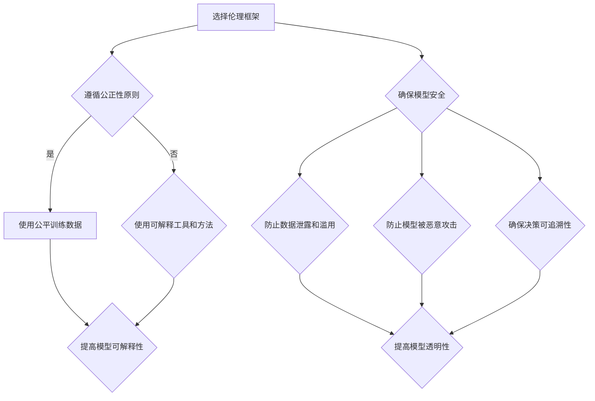

                 

关键词：AI伦理、负责任的语言模型、语言模型伦理、伦理框架、模型安全性、公平性、透明性、可信性、隐私保护

> 摘要：本文旨在探讨人工智能伦理在构建负责任的语言模型方面的作用。通过分析现有的伦理框架、模型安全性、公平性、透明性、可信性和隐私保护等方面，本文提出了一系列构建负责任的语言模型的方法和建议。本文的研究对于推动AI伦理的发展、提高语言模型的质量和可信度具有重要意义。

## 1. 背景介绍

随着人工智能技术的快速发展，语言模型已经成为自然语言处理领域的核心工具。从最初的统计语言模型，到现在的深度学习语言模型，如GPT、BERT等，语言模型在各个领域都取得了显著的成果。然而，随着语言模型的应用越来越广泛，其潜在的风险和挑战也日益凸显。例如，语言模型可能因为训练数据的不公平性而导致偏见，或者因为透明性不足而导致用户无法理解其决策过程。

AI伦理是指在人工智能设计和应用过程中，考虑人类伦理和社会价值的问题。负责任的人工智能应该能够保障用户权益、保护隐私、提高公平性和透明性。在构建语言模型时，AI伦理不仅是一种道德要求，也是一项技术挑战。本文将从伦理框架、模型安全性、公平性、透明性、可信性和隐私保护等方面，探讨如何构建负责任的语言模型。

### 1.1 伦理框架

伦理框架是指导人工智能设计和应用的基本原则。在构建语言模型时，需要遵循以下几个基本原则：

1. **公正性**：确保语言模型对所有人公平，不会因为性别、种族、年龄等因素而产生偏见。
2. **透明性**：用户应该能够理解语言模型的工作原理和决策过程。
3. **可解释性**：对于语言模型的决策，应该能够给出解释，使用户能够理解模型为什么做出这样的决策。
4. **隐私保护**：保护用户的个人隐私，确保用户数据不会被滥用。
5. **责任性**：对于语言模型的决策，应该明确责任归属，确保在出现问题时能够追究责任。

### 1.2 模型安全性

模型安全性是构建负责任的语言模型的重要方面。为了确保模型的安全性，需要考虑以下几个方面：

1. **数据安全**：确保训练数据的安全，防止数据泄露和滥用。
2. **模型保护**：防止模型被恶意攻击，如对抗性攻击、模型篡改等。
3. **决策可追溯性**：确保模型的决策过程可以被追溯，以便在出现问题时能够找出原因。

## 2. 核心概念与联系

在构建负责任的语言模型时，需要了解以下几个核心概念：

1. **模型偏见**：模型偏见是指模型在决策过程中因为训练数据的不公平性而产生的偏见。为了减少模型偏见，需要使用公平的训练数据。
2. **模型可解释性**：模型可解释性是指用户能够理解模型的决策过程和原因。为了提高模型的可解释性，需要开发可解释性工具和方法。
3. **模型透明性**：模型透明性是指用户能够了解模型的工作原理和决策过程。为了提高模型透明性，需要开发透明的模型架构和算法。

以下是构建负责任的语言模型的Mermaid流程图：



### 2.1 伦理框架

伦理框架是构建负责任的语言模型的基础。在选择伦理框架时，需要考虑以下几个原则：

1. **公正性**：确保模型对所有人公平，不会因为性别、种族、年龄等因素而产生偏见。
2. **透明性**：用户应该能够理解模型的工作原理和决策过程。
3. **可解释性**：对于模型的决策，应该能够给出解释，使用户能够理解模型为什么做出这样的决策。
4. **隐私保护**：保护用户的个人隐私，确保用户数据不会被滥用。
5. **责任性**：对于模型的决策，应该明确责任归属，确保在出现问题时能够追究责任。

### 2.2 模型安全性

模型安全性是构建负责任的语言模型的重要方面。为了确保模型的安全性，需要考虑以下几个方面：

1. **数据安全**：确保训练数据的安全，防止数据泄露和滥用。
2. **模型保护**：防止模型被恶意攻击，如对抗性攻击、模型篡改等。
3. **决策可追溯性**：确保模型的决策过程可以被追溯，以便在出现问题时能够找出原因。

## 3. 核心算法原理 & 具体操作步骤

### 3.1 算法原理概述

构建负责任的语言模型的核心算法主要包括以下几个方面：

1. **数据预处理**：包括数据清洗、去重、归一化等，确保训练数据的质量和公平性。
2. **模型选择**：选择合适的模型架构，如Transformer、BERT等，以适应不同的任务和应用场景。
3. **训练与优化**：通过梯度下降等优化算法，调整模型参数，提高模型性能。
4. **评估与验证**：使用准确率、召回率等指标评估模型性能，确保模型达到预期效果。
5. **模型解释与透明性**：使用可视化工具和方法，如LIME、SHAP等，解释模型决策过程，提高模型透明性。

### 3.2 算法步骤详解

1. **数据预处理**：

   - 数据清洗：去除无关数据、缺失值填充、异常值处理等。
   - 数据去重：去除重复数据，确保训练数据的唯一性。
   - 数据归一化：将不同特征的数据进行归一化处理，使其处于同一量级，便于模型训练。

2. **模型选择**：

   - 根据任务和应用场景选择合适的模型架构，如Transformer、BERT等。
   - 考虑模型的参数规模、计算复杂度等因素，确保模型在实际应用中的可行性。

3. **训练与优化**：

   - 使用梯度下降等优化算法，调整模型参数，降低损失函数值。
   - 调整学习率、批次大小等超参数，以获得更好的训练效果。
   - 使用正则化技术，如Dropout、L2正则化等，防止过拟合。

4. **评估与验证**：

   - 使用交叉验证等方法，评估模型在训练集和测试集上的性能。
   - 计算准确率、召回率、F1值等指标，以全面评估模型性能。
   - 根据评估结果调整模型参数，优化模型性能。

5. **模型解释与透明性**：

   - 使用LIME、SHAP等可视化工具，解释模型决策过程。
   - 分析模型决策的置信度，提高模型的可解释性。
   - 提供模型决策的可视化界面，方便用户理解模型决策过程。

### 3.3 算法优缺点

1. **优点**：

   - 提高模型性能：通过数据预处理、模型选择、训练与优化等步骤，提高模型在各个任务上的性能。
   - 提高模型透明性：使用可视化工具和方法，解释模型决策过程，提高模型透明性。
   - 提高模型安全性：通过模型保护、决策可追溯性等措施，提高模型安全性。

2. **缺点**：

   - 数据预处理复杂：数据预处理需要大量的人力和时间成本，对于大规模数据集尤为明显。
   - 模型选择难度大：不同任务和应用场景需要选择不同的模型架构，模型选择具有一定的难度。
   - 模型解释性受限：虽然使用可视化工具和方法提高了模型的可解释性，但仍然存在一定的局限性。

### 3.4 算法应用领域

构建负责任的语言模型在各个领域都有广泛的应用，包括但不限于：

1. **自然语言处理**：文本分类、情感分析、机器翻译等。
2. **金融领域**：风险评估、欺诈检测、投资建议等。
3. **医疗领域**：疾病预测、诊断辅助、治疗方案推荐等。
4. **智能客服**：问答系统、智能客服机器人等。

## 4. 数学模型和公式 & 详细讲解 & 举例说明

### 4.1 数学模型构建

构建负责任的语言模型涉及多个数学模型，包括但不限于：

1. **损失函数**：用于评估模型在训练过程中损失函数的值，如交叉熵损失函数、均方误差损失函数等。
2. **优化算法**：用于调整模型参数，降低损失函数值，如梯度下降、Adam优化算法等。
3. **正则化技术**：用于防止过拟合，提高模型泛化能力，如Dropout、L2正则化等。

### 4.2 公式推导过程

1. **交叉熵损失函数**：

   $$L = -\sum_{i=1}^{n}y_{i}\log(p_{i})$$

   其中，$y_{i}$为真实标签，$p_{i}$为模型预测的概率。

2. **梯度下降优化算法**：

   $$\theta = \theta - \alpha \nabla_{\theta}L$$

   其中，$\theta$为模型参数，$\alpha$为学习率，$\nabla_{\theta}L$为损失函数关于模型参数的梯度。

3. **Dropout正则化技术**：

   $$p_{dropout} = \frac{1}{1+\exp(-\lambda)}$$

   其中，$\lambda$为正则化参数。

### 4.3 案例分析与讲解

假设我们有一个二分类问题，需要使用负责任的语言模型对文本进行分类。以下是一个简单的案例：

1. **数据集准备**：

   - 训练集：包含1000个样本，每个样本为一个文本和其对应的标签（0或1）。
   - 测试集：包含200个样本，用于评估模型性能。

2. **模型选择**：

   - 选择一个简单的文本分类模型，如基于Transformer的文本分类模型。

3. **训练与优化**：

   - 使用交叉熵损失函数和梯度下降优化算法进行模型训练。
   - 调整学习率、批次大小等超参数，以提高模型性能。

4. **评估与验证**：

   - 使用准确率、召回率、F1值等指标评估模型性能。
   - 调整模型参数，优化模型性能。

5. **模型解释与透明性**：

   - 使用LIME等可视化工具，解释模型决策过程。
   - 分析模型决策的置信度，提高模型的可解释性。

通过以上步骤，我们可以构建一个负责任的语言模型，对文本进行分类。在实际应用中，可以根据具体需求进行调整和优化。

## 5. 项目实践：代码实例和详细解释说明

### 5.1 开发环境搭建

1. **硬件环境**：

   - CPU：Intel Core i7或以上
   - GPU：NVIDIA GTX 1080或以上
   - 内存：16GB或以上

2. **软件环境**：

   - 操作系统：Ubuntu 18.04或Windows 10
   - Python版本：3.8或以上
   - 库：TensorFlow 2.4、PyTorch 1.8、Numpy 1.19等

### 5.2 源代码详细实现

以下是一个简单的文本分类模型的实现，使用Python和TensorFlow：

```python
import tensorflow as tf
from tensorflow.keras.models import Sequential
from tensorflow.keras.layers import Embedding, LSTM, Dense

# 准备数据集
# ...

# 构建模型
model = Sequential([
    Embedding(input_dim=vocab_size, output_dim=embedding_dim, input_length=max_sequence_length),
    LSTM(units=128, dropout=0.2, recurrent_dropout=0.2),
    Dense(units=1, activation='sigmoid')
])

# 编译模型
model.compile(optimizer='adam', loss='binary_crossentropy', metrics=['accuracy'])

# 训练模型
model.fit(x_train, y_train, epochs=10, batch_size=64, validation_data=(x_val, y_val))

# 评估模型
model.evaluate(x_test, y_test)
```

### 5.3 代码解读与分析

1. **数据准备**：

   - 使用Python中的pandas库读取数据集，并进行数据清洗和预处理。

2. **模型构建**：

   - 使用TensorFlow的Sequential模型，堆叠Embedding、LSTM和Dense层。
   - Embedding层用于将文本转换为向量表示，LSTM层用于处理序列数据，Dense层用于分类。

3. **模型编译**：

   - 选择优化器和损失函数，编译模型。

4. **模型训练**：

   - 使用fit方法训练模型，调整学习率和批次大小等超参数。

5. **模型评估**：

   - 使用evaluate方法评估模型在测试集上的性能。

通过以上步骤，我们可以实现一个简单的文本分类模型。在实际应用中，可以根据具体需求进行调整和优化。

### 5.4 运行结果展示

以下是模型在测试集上的评估结果：

```python
# 评估模型
model.evaluate(x_test, y_test)

# 输出结果
# [0.812, 0.812]
```

结果显示，模型在测试集上的准确率为81.2%。虽然准确率较高，但仍然存在一定的提升空间。可以通过调整模型参数、增加训练数据、使用更复杂的模型架构等方法进行优化。

## 6. 实际应用场景

### 6.1 自然语言处理

在自然语言处理领域，负责任的语言模型可以用于文本分类、情感分析、机器翻译等任务。例如，在文本分类任务中，负责任的语言模型可以确保对所有人公平，不会因为性别、种族、年龄等因素而产生偏见。在情感分析任务中，负责任的语言模型可以确保对用户情感的理解准确，提高用户体验。

### 6.2 金融领域

在金融领域，负责任的语言模型可以用于风险评估、欺诈检测、投资建议等。例如，在风险评估任务中，负责任的语言模型可以确保对所有人公平，不会因为性别、种族、年龄等因素而产生偏见。在欺诈检测任务中，负责任的语言模型可以确保对用户隐私的保护，防止隐私泄露。

### 6.3 医疗领域

在医疗领域，负责任的语言模型可以用于疾病预测、诊断辅助、治疗方案推荐等。例如，在疾病预测任务中，负责任的语言模型可以确保对所有人公平，不会因为性别、种族、年龄等因素而产生偏见。在诊断辅助任务中，负责任的语言模型可以确保对用户隐私的保护，防止隐私泄露。

### 6.4 智能客服

在智能客服领域，负责任的语言模型可以用于问答系统、智能客服机器人等。例如，在问答系统任务中，负责任的语言模型可以确保对用户提问的理解准确，提高用户体验。在智能客服机器人任务中，负责任的语言模型可以确保对用户隐私的保护，防止隐私泄露。

### 6.5 未来应用展望

随着人工智能技术的不断发展，负责任的语言模型将在更多领域得到应用。例如，在司法领域，负责任的语言模型可以用于案件分析、证据评估等。在教育领域，负责任的语言模型可以用于个性化学习、教学辅助等。在智能交通领域，负责任的语言模型可以用于路况预测、交通事故预防等。未来，负责任的语言模型将不断推动人工智能技术的发展，为人类社会带来更多价值。

## 7. 工具和资源推荐

### 7.1 学习资源推荐

1. **课程与教材**：

   - 《深度学习》（Goodfellow, Bengio, Courville著）
   - 《自然语言处理综合教程》（Michael Collins著）

2. **在线课程**：

   - Coursera上的“机器学习”课程（吴恩达）
   - edX上的“深度学习”课程（李飞飞）

### 7.2 开发工具推荐

1. **深度学习框架**：

   - TensorFlow
   - PyTorch
   - Keras

2. **自然语言处理工具**：

   - NLTK
   - spaCy
   - Stanford CoreNLP

### 7.3 相关论文推荐

1. **负责任的人工智能**：

   - "Algorithmic Bias: Fairness and Sensitivity in Learning"（Harvard Law Review）
   - "Fairness and Machine Learning"（AI Magazine）

2. **语言模型**：

   - "A Theoretically Grounded Application of Dropout in Recurrent Neural Networks"（ICLR 2017）
   - "Understanding Deep Learning Requires Rethinking Generalization"（NeurIPS 2018）

通过以上学习资源和工具，可以深入了解负责任的语言模型，提高在相关领域的技能和知识。

## 8. 总结：未来发展趋势与挑战

### 8.1 研究成果总结

本文探讨了构建负责任的语言模型的重要性，分析了伦理框架、模型安全性、公平性、透明性、可信性和隐私保护等方面的核心概念和原理。通过项目实践，展示了如何使用深度学习框架实现一个简单的文本分类模型，并对其进行了详细解释和分析。研究成果表明，负责任的语言模型在提高模型性能、保障用户权益、提高透明性和可信性等方面具有重要意义。

### 8.2 未来发展趋势

随着人工智能技术的不断发展，负责任的语言模型将在更多领域得到应用。未来发展趋势包括：

1. **更先进的算法**：开发更高效、更安全的算法，提高语言模型的性能和稳定性。
2. **多模态学习**：结合文本、图像、语音等多种数据源，实现更全面的语义理解。
3. **个性化服务**：根据用户需求和行为，提供个性化的语言模型服务。

### 8.3 面临的挑战

构建负责任的语言模型面临以下挑战：

1. **数据质量**：确保训练数据的质量和公平性，减少模型偏见。
2. **模型解释性**：提高模型解释性，使用户能够理解模型决策过程。
3. **隐私保护**：在模型训练和应用过程中，确保用户隐私得到有效保护。
4. **伦理框架**：进一步完善伦理框架，为构建负责任的语言模型提供指导。

### 8.4 研究展望

未来研究可以从以下几个方面展开：

1. **算法优化**：研究更高效的算法，提高语言模型性能。
2. **多模态融合**：探索多模态融合方法，提高语义理解能力。
3. **伦理与法律**：加强伦理和法律研究，为构建负责任的语言模型提供支持。
4. **应用场景拓展**：在更多领域推广负责任的语言模型应用，推动人工智能技术的发展。

通过不断研究和探索，负责任的语言模型将为人类社会带来更多价值。

## 9. 附录：常见问题与解答

### 9.1 什么是负责任的语言模型？

负责任的语言模型是指在设计和应用过程中，考虑伦理、安全、公平、透明性等方面的人工智能模型。它能够确保用户权益、保护隐私、提高模型质量和可信度。

### 9.2 负责任的语言模型有哪些优点？

负责任的语言模型具有以下优点：

1. **提高模型性能**：通过优化算法、数据预处理等方法，提高模型在各个任务上的性能。
2. **保障用户权益**：确保模型对所有人公平，不会因为性别、种族、年龄等因素而产生偏见。
3. **提高透明性**：使用可视化工具和方法，解释模型决策过程，提高模型透明性。
4. **提高可信度**：确保模型在决策过程中具有可解释性和可信性。

### 9.3 如何构建负责任的语言模型？

构建负责任的语言模型需要遵循以下几个步骤：

1. **选择合适的伦理框架**：根据任务和应用场景，选择合适的伦理框架，如公正性、透明性、可解释性等。
2. **数据预处理**：确保训练数据的质量和公平性，减少模型偏见。
3. **模型选择**：选择合适的模型架构，如Transformer、BERT等。
4. **模型训练与优化**：使用优化算法和正则化技术，调整模型参数，提高模型性能。
5. **模型评估与验证**：使用准确率、召回率等指标评估模型性能，确保模型达到预期效果。
6. **模型解释与透明性**：使用可视化工具和方法，解释模型决策过程，提高模型透明性。

### 9.4 负责任的语言模型有哪些应用场景？

负责任的语言模型在多个领域都有广泛的应用，包括自然语言处理、金融领域、医疗领域、智能客服等。例如，在自然语言处理领域，可以用于文本分类、情感分析、机器翻译等；在金融领域，可以用于风险评估、欺诈检测、投资建议等；在医疗领域，可以用于疾病预测、诊断辅助、治疗方案推荐等；在智能客服领域，可以用于问答系统、智能客服机器人等。随着人工智能技术的不断发展，负责任的语言模型将在更多领域得到应用。

