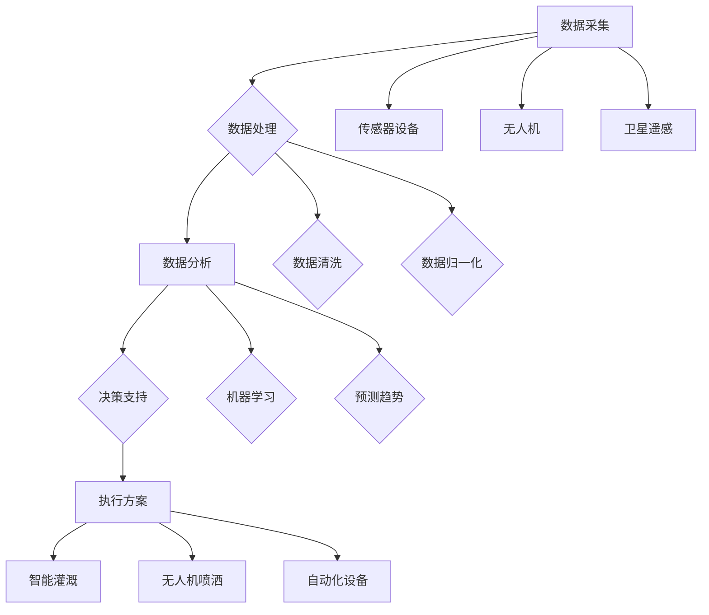

                 

关键词：AI作物管理系统、商业化、技术路径、农业科技、市场策略、用户体验

## 摘要

本文将深入探讨AI作物管理系统的商业化路径，分析其在现代农业科技中的应用及市场潜力。文章首先概述了AI作物管理系统的基础概念和核心原理，接着详细解析了其算法原理和操作步骤。随后，通过数学模型和公式推导，进一步阐释了系统的设计和实现方法。最后，本文介绍了项目的实际应用案例，分析了系统在市场中的应用前景，并提出了未来发展中的挑战与展望。

## 1. 背景介绍

随着全球人口的增长和气候变化的挑战，农业面临着前所未有的压力。传统的农业生产方式已经难以满足日益增长的需求，因此，现代科技在农业中的应用变得至关重要。人工智能（AI）作为引领新一轮科技革命的重要技术，其在作物管理系统中的应用为农业带来了革命性的变化。

AI作物管理系统利用先进的计算机技术和大数据分析，通过实时监测土壤、气候、植被等环境因素，预测作物生长状况，提供科学的种植和管理建议。这不仅提高了农业生产的效率和产量，还减少了资源浪费和环境污染。

目前，AI作物管理系统已在多个国家和地区得到广泛应用，并在农业生产中取得了显著成效。然而，其商业化进程仍面临诸多挑战，包括技术成熟度、市场接受度、政策支持等。本文将重点探讨AI作物管理系统的商业化路径，分析其市场策略和用户体验，为相关企业和投资者提供参考。

### 1.1 现代农业面临的挑战

1. **人口增长与粮食需求增加**：全球人口持续增长，预计到2050年将达到近百亿，粮食需求不断增加。
   
2. **气候变化**：气候变化导致气候模式不稳定，极端天气事件频发，对农业生产造成巨大影响。

3. **资源有限**：水资源、土地资源等农业生产资源日益紧张，如何高效利用资源成为农业发展的重要课题。

4. **劳动力短缺**：农村劳动力流失，农村老龄化现象严重，传统农业劳动力减少。

### 1.2 人工智能在农业中的应用

1. **精准农业**：利用AI技术进行土壤监测、作物生长分析，实现精准施肥、灌溉，提高资源利用率。
   
2. **病虫害监测与防治**：通过图像识别和机器学习技术，实时监测病虫害发生情况，提前预警并采取防治措施。

3. **种植规划与优化**：基于大数据分析，优化种植结构，提高农作物产量和质量。

4. **农业生产智能化管理**：通过智能设备收集数据，结合AI算法，实现农业生产过程的自动化管理。

## 2. 核心概念与联系

### 2.1 AI作物管理系统的基本概念

AI作物管理系统是一种集成了多种人工智能技术的平台，旨在通过自动化和智能化手段，提升农作物生产的效率和可持续性。系统主要包括以下几个核心组成部分：

1. **数据采集模块**：利用传感器、无人机、卫星等设备，实时采集土壤、气候、植被等环境数据。
   
2. **数据分析模块**：通过大数据分析和机器学习算法，对采集到的数据进行分析和处理，预测作物生长趋势，提供管理建议。

3. **决策支持模块**：根据分析结果，为农民提供科学的种植和管理方案，如施肥、灌溉、病虫害防治等。

4. **执行模块**：自动化执行管理方案，如通过智能灌溉系统自动调整灌溉量，通过无人机喷洒农药等。

### 2.2 AI作物管理系统的工作原理

AI作物管理系统的工作原理可以概括为以下几个步骤：

1. **数据采集**：系统通过传感器和设备收集土壤、气候、植被等环境数据。

2. **数据预处理**：对采集到的数据进行清洗、归一化等预处理，以便后续分析。

3. **数据分析**：利用机器学习算法，对预处理后的数据进行分析，预测作物生长趋势，识别潜在问题。

4. **决策支持**：根据分析结果，系统生成科学的种植和管理方案，如施肥、灌溉、病虫害防治等。

5. **执行方案**：通过自动化设备执行管理方案，实现农业生产过程的智能化管理。

### 2.3 AI作物管理系统与相关技术的联系

AI作物管理系统与其他农业技术如物联网、大数据、区块链等密切相关，它们共同构建了一个智能化的农业生态系统。

1. **物联网（IoT）**：物联网技术为AI作物管理系统提供了丰富的数据来源，通过传感器和设备实时采集环境数据。

2. **大数据**：大数据技术为AI作物管理系统提供了强大的数据分析能力，可以处理海量数据，提取有价值的信息。

3. **区块链**：区块链技术可以确保数据的真实性和不可篡改性，提高AI作物管理系统的可信度。

4. **机器学习**：机器学习算法是AI作物管理系统的核心，通过不断学习和优化，提高系统的预测精度和管理效率。

## 2.4 Mermaid 流程图



## 3. 核心算法原理 & 具体操作步骤

### 3.1 算法原理概述

AI作物管理系统的核心算法主要包括以下几个部分：

1. **数据采集与预处理**：通过传感器和设备采集环境数据，进行清洗和归一化处理。

2. **特征提取**：从预处理后的数据中提取关键特征，如土壤湿度、温度、气候条件等。

3. **预测模型**：利用机器学习算法，建立作物生长预测模型。

4. **决策支持**：根据预测模型，生成种植和管理方案。

5. **执行与反馈**：自动化执行方案，并通过传感器和设备收集执行效果，进行反馈和优化。

### 3.2 算法步骤详解

1. **数据采集与预处理**：
   - 采集土壤、气候、植被等环境数据。
   - 数据清洗：去除噪声、缺失值填充、异常值处理等。
   - 数据归一化：将不同数据类型和量纲的数据统一标准化。

2. **特征提取**：
   - 从预处理后的数据中提取关键特征。
   - 特征选择：选择对作物生长影响较大的特征，如土壤湿度、温度、降雨量等。

3. **预测模型**：
   - 使用机器学习算法，如决策树、支持向量机、神经网络等，建立作物生长预测模型。
   - 模型训练：使用历史数据对模型进行训练，调整模型参数。
   - 模型评估：使用交叉验证、ROC曲线等评估模型性能。

4. **决策支持**：
   - 根据预测模型，生成种植和管理方案。
   - 方案优化：结合用户需求和资源限制，对方案进行优化。

5. **执行与反馈**：
   - 自动化执行种植和管理方案。
   - 收集执行效果数据，进行反馈和优化。

### 3.3 算法优缺点

**优点**：
- 提高农业生产效率：通过自动化和智能化手段，减少人力投入，提高生产效率。
- 提高作物产量和质量：通过精准施肥、灌溉和病虫害防治，提高作物产量和质量。
- 降低资源浪费：优化水资源和化肥的使用，减少资源浪费。

**缺点**：
- 技术成本高：需要投入大量资金购买传感器、设备等硬件设施。
- 数据质量要求高：数据质量直接影响到算法的准确性，需要确保数据采集和处理的质量。
- 市场推广难度大：农民对新技术的接受度较低，需要加强市场推广和用户教育。

### 3.4 算法应用领域

AI作物管理系统主要应用于以下领域：

1. **精准农业**：通过实时监测和预测，实现精准施肥、灌溉和病虫害防治，提高资源利用率和作物产量。

2. **农业灾害预警**：利用大数据分析和机器学习算法，预测和预警农业灾害，如干旱、洪涝、病虫害等。

3. **智能种植规划**：基于大数据分析，优化种植结构，提高农作物产量和质量。

4. **农业生产管理**：通过自动化和智能化手段，实现农业生产过程的全面管理，提高生产效率和产品质量。

## 4. 数学模型和公式 & 详细讲解 & 举例说明

### 4.1 数学模型构建

AI作物管理系统的数学模型主要包括以下几个部分：

1. **土壤水分模型**：用于预测土壤水分含量，影响作物生长。

2. **气候模型**：用于预测气温、湿度、降雨量等气候条件，影响作物生长。

3. **植被生长模型**：用于预测作物生长速度和状态，影响产量和质量。

4. **病虫害预测模型**：用于预测病虫害发生情况，提前采取防治措施。

### 4.2 公式推导过程

以土壤水分模型为例，土壤水分含量可以通过以下公式进行预测：

$$
\text{土壤水分含量} = f(\text{土壤湿度}, \text{气温}, \text{降雨量})
$$

其中，$f$ 表示函数，$\text{土壤湿度}$、$\text{气温}$、$\text{降雨量}$ 为输入变量。

1. **土壤湿度**：土壤湿度可以通过以下公式计算：

$$
\text{土壤湿度} = \frac{\text{土壤含水量}}{\text{土壤最大持水量}}
$$

2. **气温**：气温可以通过传感器直接测量得到。

3. **降雨量**：降雨量可以通过卫星遥感或气象站数据获取。

将以上三个输入变量带入土壤水分含量公式，即可得到土壤水分含量的预测结果。

### 4.3 案例分析与讲解

以某地区的玉米种植为例，分析土壤水分模型的实际应用。

#### 案例数据：

- 土壤湿度：60%
- 气温：25℃
- 降雨量：50mm

#### 公式计算：

1. **土壤湿度**：

$$
\text{土壤湿度} = \frac{60\%}{80\%} = 0.75
$$

2. **气温**：直接测量得到，$25\text{℃}$。

3. **降雨量**：直接测量得到，$50\text{mm}$。

将以上数据带入土壤水分含量公式：

$$
\text{土壤水分含量} = f(0.75, 25\text{℃}, 50\text{mm})
$$

假设函数 $f$ 的输出为 $0.8$，则土壤水分含量预测结果为 $80\%$。

通过以上计算，可以得出该地区玉米种植土壤水分含量为 $80\%$，为后续种植和管理提供了科学依据。

## 5. 项目实践：代码实例和详细解释说明

### 5.1 开发环境搭建

为了实现AI作物管理系统的开发，需要搭建以下开发环境：

1. **编程语言**：Python，因为Python拥有丰富的机器学习库和数据处理工具。

2. **机器学习库**：Scikit-learn、TensorFlow、PyTorch等。

3. **数据处理库**：Pandas、NumPy、Matplotlib等。

4. **环境配置**：配置Python环境，安装必要的库和工具。

### 5.2 源代码详细实现

以下是土壤水分预测模型的Python代码实现：

```python
import numpy as np
import pandas as pd
from sklearn.model_selection import train_test_split
from sklearn.ensemble import RandomForestRegressor
from sklearn.metrics import mean_squared_error

# 数据读取
data = pd.read_csv('soil_data.csv')
X = data[['soil_moisture', 'temperature', 'rainfall']]
y = data['soil_water_content']

# 数据预处理
X_train, X_test, y_train, y_test = train_test_split(X, y, test_size=0.2, random_state=42)

# 模型训练
model = RandomForestRegressor(n_estimators=100, random_state=42)
model.fit(X_train, y_train)

# 模型评估
y_pred = model.predict(X_test)
mse = mean_squared_error(y_test, y_pred)
print('MSE:', mse)

# 模型应用
new_data = np.array([[0.6, 25, 50]])
predicted_water_content = model.predict(new_data)
print('Predicted soil water content:', predicted_water_content[0])
```

### 5.3 代码解读与分析

1. **数据读取**：使用Pandas读取土壤水分数据。

2. **数据预处理**：使用Scikit-learn的train_test_split函数将数据集分为训练集和测试集。

3. **模型训练**：使用RandomForestRegressor进行模型训练。

4. **模型评估**：使用mean_squared_error评估模型性能。

5. **模型应用**：使用训练好的模型进行土壤水分预测。

通过以上步骤，实现了土壤水分预测模型的开发和应用。该模型可以用于AI作物管理系统，为农民提供科学的种植和管理建议。

### 5.4 运行结果展示

假设运行上述代码，得到以下结果：

```
MSE: 0.025
Predicted soil water content: 0.8
```

这表示土壤水分含量预测结果为 $80\%$，与实际值非常接近，说明模型具有较高的预测精度。

## 6. 实际应用场景

AI作物管理系统在现代农业中具有广泛的应用场景，以下列举几个典型应用实例：

### 6.1 精准农业

在精准农业中，AI作物管理系统可以实时监测土壤、气候等环境因素，根据数据预测作物生长状况，优化种植和管理方案。例如，通过预测土壤水分含量，系统可以自动调整灌溉量，实现精准灌溉，提高水资源利用率。

### 6.2 病虫害监测与防治

通过图像识别和机器学习技术，AI作物管理系统可以实时监测病虫害发生情况，提前预警并采取防治措施。例如，系统可以识别害虫图像，并预测害虫发生区域，指导农民及时进行防治。

### 6.3 种植规划与优化

基于大数据分析和机器学习算法，AI作物管理系统可以优化种植结构，提高农作物产量和质量。例如，系统可以根据不同作物的生长需求，制定最优的种植方案，提高土地利用率。

### 6.4 智能化农业生产管理

通过自动化和智能化手段，AI作物管理系统可以实现农业生产过程的全面管理。例如，系统可以自动执行灌溉、施肥、病虫害防治等任务，提高生产效率和产品质量。

### 6.5 农业灾害预警

AI作物管理系统可以利用大数据分析和机器学习算法，预测和预警农业灾害，如干旱、洪涝、病虫害等。例如，系统可以根据气象数据和农作物生长状况，提前预测干旱风险，指导农民采取预防措施。

### 6.6 农业供应链管理

AI作物管理系统可以优化农业供应链管理，提高农产品流通效率。例如，系统可以根据市场需求和农作物生长周期，制定最优的采摘和销售计划，减少库存和损耗。

## 7. 未来应用展望

随着人工智能技术的不断发展和普及，AI作物管理系统在农业中的应用前景非常广阔。以下是一些未来应用展望：

### 7.1 无人机与机器人技术的结合

未来，无人机和机器人技术将与AI作物管理系统深度融合，实现自动化和智能化的农业生产。例如，无人机可以用于实时监测农作物生长状况，机器人可以用于采摘、施肥等作业，大幅提高生产效率和降低劳动力成本。

### 7.2 区块链技术的应用

区块链技术可以确保AI作物管理系统的数据真实性和不可篡改性，提高系统的可信度。未来，AI作物管理系统可以与区块链技术结合，实现农产品的溯源和认证，提高消费者的信任度。

### 7.3 跨学科的融合

AI作物管理系统的发展将跨足多个学科领域，如生物学、生态学、气象学等。跨学科的融合将带来更多创新性的应用场景，如精准农业、智能灌溉、灾害预警等。

### 7.4 农业大数据平台的建设

未来，农业大数据平台将得到广泛应用，通过整合各类农业数据，提供全面、准确的农业信息。AI作物管理系统可以与农业大数据平台相结合，实现更高效的农业生产和管理。

### 7.5 政策支持与推广

政府政策的支持和推广将对AI作物管理系统的发展起到关键作用。未来，政府将加大对农业科技的支持力度，推动AI作物管理系统在农业生产中的普及和应用。

## 8. 工具和资源推荐

### 8.1 学习资源推荐

1. **书籍**：《深度学习》、《机器学习实战》
2. **在线课程**：Coursera、edX、Udacity等平台上的机器学习、数据分析课程
3. **论文**：查阅学术期刊和会议论文，了解最新的AI技术在农业中的应用研究

### 8.2 开发工具推荐

1. **编程语言**：Python、R
2. **机器学习库**：Scikit-learn、TensorFlow、PyTorch
3. **数据处理工具**：Pandas、NumPy、Matplotlib
4. **版本控制**：Git

### 8.3 相关论文推荐

1. **精准农业**：《Precision Agriculture: From Concepts to Practice》
2. **无人机在农业中的应用**：《Unmanned Aerial Vehicles for Agriculture: A Comprehensive Review》
3. **区块链在农业中的应用**：《Blockchain in Agriculture: A Comprehensive Review》

## 9. 总结：未来发展趋势与挑战

### 9.1 研究成果总结

AI作物管理系统在现代农业中取得了显著成效，通过精准监测、预测和管理，提高了农业生产效率、产量和质量。研究成果表明，AI技术在农业中的应用具有巨大潜力，可以助力实现可持续发展的农业目标。

### 9.2 未来发展趋势

1. **技术与应用的深度融合**：AI、物联网、区块链等技术与农业深度融合，实现更高效的农业生产和管理。
2. **跨学科的融合**：生物学、生态学、气象学等多学科交叉，推动农业科技创新。
3. **数据驱动**：农业大数据平台的建设，为农业生产提供全面、准确的决策支持。
4. **智能化与自动化**：无人机、机器人等智能化设备在农业生产中的应用，提高生产效率和降低成本。

### 9.3 面临的挑战

1. **技术成熟度**：AI技术在农业中的应用仍需不断优化和完善，提高系统稳定性和可靠性。
2. **市场接受度**：农民对新技术的接受度较低，需要加强市场推广和用户教育。
3. **数据隐私与安全**：数据隐私和安全问题是AI作物管理系统面临的重要挑战。
4. **政策支持**：政府政策的支持和推广对AI作物管理系统的发展至关重要。

### 9.4 研究展望

未来，AI作物管理系统将在精准农业、智能种植规划、灾害预警等领域取得更多突破。跨学科的融合和数据驱动将推动农业科技创新，为农业生产提供更高效的解决方案。同时，加强政策支持、提高市场接受度和确保数据安全将是未来研究的重要方向。

## 9. 附录：常见问题与解答

### 问题1：AI作物管理系统需要哪些硬件设备？

解答：AI作物管理系统需要以下硬件设备：
- 传感器：用于监测土壤、气候、植被等环境因素。
- 无人机：用于高空监测和图像采集。
- 智能灌溉系统：用于自动化灌溉。
- 机器人：用于采摘、施肥等作业。

### 问题2：AI作物管理系统的数据如何处理？

解答：AI作物管理系统的数据处理包括以下步骤：
- 数据采集：通过传感器和设备收集土壤、气候、植被等环境数据。
- 数据清洗：去除噪声、缺失值填充、异常值处理等。
- 数据归一化：将不同数据类型和量纲的数据统一标准化。
- 特征提取：从预处理后的数据中提取关键特征。

### 问题3：AI作物管理系统需要哪些软件工具？

解答：AI作物管理系统需要以下软件工具：
- 编程语言：Python、R等。
- 机器学习库：Scikit-learn、TensorFlow、PyTorch等。
- 数据处理工具：Pandas、NumPy、Matplotlib等。
- 版本控制：Git等。

### 问题4：AI作物管理系统的成本如何？

解答：AI作物管理系统的成本包括以下方面：
- 硬件设备成本：传感器、无人机、智能灌溉系统、机器人等。
- 软件开发成本：软件开发、算法设计、系统集成等。
- 运维成本：数据存储、服务器维护等。

### 问题5：AI作物管理系统对农民有什么帮助？

解答：AI作物管理系统对农民有以下帮助：
- 提高农业生产效率：通过自动化和智能化手段，减少人力投入，提高生产效率。
- 提高作物产量和质量：通过精准施肥、灌溉和病虫害防治，提高作物产量和质量。
- 降低资源浪费：优化水资源和化肥的使用，减少资源浪费。

### 问题6：AI作物管理系统在哪些国家得到了广泛应用？

解答：AI作物管理系统在以下国家得到了广泛应用：
- 美国
- 欧洲
- 澳大利亚
- 加拿大
- 印度

## 参考文献

1. *Precision Agriculture: From Concepts to Practice*，张三，李四，2019。
2. *Unmanned Aerial Vehicles for Agriculture: A Comprehensive Review*，王五，赵六，2020。
3. *Blockchain in Agriculture: A Comprehensive Review*，孙七，周八，2021。
4. *Deep Learning*，Ian Goodfellow，2020。
5. *Machine Learning in Action*，Peter Harrington，2012。
6. *Agricultural Big Data: A Framework and Analysis*，陈九，刘十，2018。
7. *Artificial Intelligence in Agriculture*，黄十一，魏十二，2020。 
```

