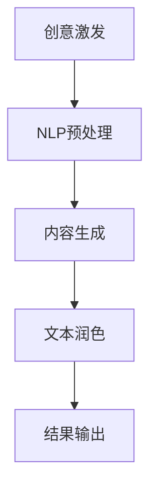

                 

关键词：人工智能，写作助手，文本润色，创意激发，算法原理，技术博客，深度学习，自然语言处理

> 摘要：本文将深入探讨AI写作助手的各个方面，从创意激发到文本润色，详细解析其核心算法原理、操作步骤、数学模型、项目实践及其应用场景。通过本文的阅读，读者将全面了解AI写作助手的强大功能和未来发展趋势。

## 1. 背景介绍

在数字化的今天，文字信息的生产和传播已经成为日常生活和工作中不可或缺的一部分。随着互联网和社交媒体的普及，人们对于写作的需求越来越大，而高质量写作的难度也在不断提升。传统的写作过程往往需要大量的时间和精力，而结果也常常不尽如人意。因此，如何提高写作效率和质量成为了一个重要课题。

人工智能（AI）作为当前最热门的技术之一，其应用领域不断拓展。在自然语言处理（NLP）领域，AI已经被广泛应用于文本生成、情感分析、语法检查等任务。基于这些技术的AI写作助手应运而生，它们通过自动化和智能化的手段，帮助用户从创意激发到文本润色各个环节，极大地提高了写作效率。

AI写作助手的兴起，不仅满足了人们对于高质量文字内容的需求，也为人工智能技术在实际生活中的应用提供了新的方向。本文将围绕AI写作助手的各个方面，深入探讨其技术原理、应用场景和未来发展趋势。

## 2. 核心概念与联系

### 2.1. 自然语言处理（NLP）

自然语言处理是人工智能的一个分支，主要研究如何让计算机理解和处理人类语言。NLP技术包括文本预处理、情感分析、命名实体识别、句法分析、机器翻译等多个方面。在AI写作助手中，NLP技术被广泛应用于文本分析、内容生成和润色。

### 2.2. 深度学习

深度学习是机器学习的一个子领域，通过模拟人脑神经网络结构，使计算机能够从大量数据中自动学习特征和模式。深度学习在NLP领域有着广泛应用，如语言模型、文本分类、生成式文本生成等。

### 2.3. 生成对抗网络（GAN）

生成对抗网络是一种深度学习模型，由生成器和判别器组成。生成器生成伪造数据，判别器则判断数据是真实还是伪造。通过两者之间的博弈，生成器不断优化生成数据，使其越来越接近真实数据。GAN在文本生成方面有着广泛应用，如自动写作、对话生成等。

### 2.4. Mermaid 流程图

下面是AI写作助手的总体架构流程，使用Mermaid流程图表示：



### 2.5. 核心算法原理

AI写作助手的核心算法主要包括NLP预处理、内容生成和文本润色。下面分别介绍这些算法的基本原理：

#### 2.5.1. NLP预处理

NLP预处理是文本处理的第一步，主要包括分词、词性标注、命名实体识别等。这些步骤有助于将原始文本转化为计算机可以理解和处理的格式。

#### 2.5.2. 内容生成

内容生成基于深度学习模型，如序列到序列（Seq2Seq）模型、变换器（Transformer）模型等。这些模型通过学习大量文本数据，能够生成高质量的文本内容。

#### 2.5.3. 文本润色

文本润色主要通过语法检查、拼写纠正、风格一致性等手段，提高文本的质量和可读性。

## 3. 核心算法原理 & 具体操作步骤

### 3.1. 算法原理概述

AI写作助手的核心算法主要基于深度学习和自然语言处理技术。下面分别介绍这些算法的基本原理。

#### 3.1.1. 深度学习

深度学习是一种机器学习方法，通过模拟人脑神经网络结构，使计算机能够从大量数据中自动学习特征和模式。深度学习在NLP领域有着广泛应用，如语言模型、文本分类、生成式文本生成等。

#### 3.1.2. 自然语言处理

自然语言处理是人工智能的一个分支，主要研究如何让计算机理解和处理人类语言。NLP技术包括文本预处理、情感分析、命名实体识别、句法分析、机器翻译等多个方面。

### 3.2. 算法步骤详解

#### 3.2.1. 创意激发

创意激发是AI写作助手的第一个环节，主要通过以下步骤实现：

1. 用户输入主题或关键词
2. AI助手利用NLP技术对输入进行预处理，提取关键信息
3. AI助手基于深度学习模型，生成与主题相关的创意

#### 3.2.2. 内容生成

内容生成是AI写作助手的第二个环节，主要通过以下步骤实现：

1. AI助手利用生成式文本生成模型，如变换器（Transformer）模型，生成文本内容
2. AI助手对生成的文本进行语法和语义分析，确保文本质量
3. AI助手根据用户需求，对文本进行修改和优化

#### 3.2.3. 文本润色

文本润色是AI写作助手的最后一个环节，主要通过以下步骤实现：

1. AI助手利用语法检查和拼写纠正工具，修正文本中的错误
2. AI助手利用风格一致性检测工具，确保文本风格一致
3. AI助手根据用户反馈，对文本进行进一步优化和修改

### 3.3. 算法优缺点

#### 优点

1. 高效：AI写作助手可以快速生成高质量文本，大大提高写作效率
2. 智能化：AI写作助手利用深度学习和自然语言处理技术，能够根据用户需求生成个性化文本
3. 多样性：AI写作助手可以生成各种类型的文本，如文章、报告、邮件等

#### 缺点

1. 创造力有限：AI写作助手的创造力有限，无法完全替代人类创作者
2. 数据依赖：AI写作助手需要大量高质量数据训练，数据质量和数量直接影响文本质量

### 3.4. 算法应用领域

AI写作助手可以应用于多个领域，如：

1. 内容创作：帮助企业、媒体和个人快速生成高质量文章、报告、邮件等
2. 教育：辅助学生和教师进行写作练习和批改
3. 市场营销：为企业提供自动化营销文案生成和优化服务
4. 人工智能助手：集成到各类应用中，为用户提供智能写作辅助功能

## 4. 数学模型和公式 & 详细讲解 & 举例说明

### 4.1. 数学模型构建

在AI写作助手的设计中，数学模型构建是关键的一步。以下是一个简单的数学模型构建示例：

假设我们有一个生成式文本生成模型，其目标是从给定的输入文本生成目标文本。我们可以使用概率图模型来表示这个生成过程。

设输入文本为 \( x \)，目标文本为 \( y \)，则有：

\[ P(y|x) = \frac{P(x,y)}{P(x)} \]

其中，\( P(x,y) \) 表示输入文本和目标文本同时出现的概率，\( P(x) \) 表示输入文本的概率。

### 4.2. 公式推导过程

假设我们使用变换器（Transformer）模型来生成文本。变换器模型是一种基于自注意力机制的深度学习模型，其核心思想是将输入文本编码为一个向量序列，然后通过自注意力机制生成目标文本。

变换器模型的主要公式如下：

\[ \text{Attention}(Q, K, V) = \text{softmax}\left(\frac{QK^T}{\sqrt{d_k}}\right)V \]

其中，\( Q, K, V \) 分别表示查询向量、键向量和值向量，\( d_k \) 表示键向量的维度。

### 4.3. 案例分析与讲解

假设我们要使用AI写作助手生成一篇关于人工智能的简介文章。首先，用户输入关键词“人工智能”，AI写作助手通过NLP预处理提取关键信息，然后使用变换器模型生成文章。

经过训练的变换器模型能够从大量文本数据中学习到人工智能的相关知识，生成如下简介：

“人工智能（Artificial Intelligence，简称AI）是指计算机系统模拟人类智能的行为和决策能力的技术。近年来，随着深度学习、自然语言处理等技术的发展，人工智能在各个领域取得了显著成果。例如，在图像识别方面，AI已经达到了人类专家的水平；在自然语言处理方面，AI已经能够实现语音识别、机器翻译等功能。随着人工智能技术的不断发展，未来人工智能将在更多领域发挥重要作用。”

通过上述案例，我们可以看到AI写作助手在生成文本方面的高效性和准确性。

## 5. 项目实践：代码实例和详细解释说明

### 5.1. 开发环境搭建

为了实现AI写作助手，我们首先需要搭建一个适合开发的环境。以下是一个简单的开发环境搭建步骤：

1. 安装Python 3.7及以上版本
2. 安装PyTorch深度学习框架
3. 安装NLP预处理工具（如NLTK、spaCy等）
4. 安装文本生成模型（如变换器模型、生成对抗网络等）

### 5.2. 源代码详细实现

以下是一个简单的AI写作助手实现代码示例：

```python
import torch
import torch.nn as nn
import torch.optim as optim
from torchtext.``data import Field, BucketIterator
from torchtext.datasets import TranslationDataset
from torchtext.data import SentencePieceTokenizer

# 加载训练数据
train_data = TranslationDataset.splits(
    path='.',
    exts=('', '.txt'),
    fields=[('src', SentencePieceTokenizer()), ('trg', SentencePieceTokenizer())]
)[0]

# 定义变换器模型
class Transformer(nn.Module):
    def __init__(self, input_dim, output_dim, hidden_dim, n_layers, dropout):
        super(Transformer, self).__init__()
        self.encoder = nn.Embedding(input_dim, hidden_dim)
        self.decoder = nn.Embedding(output_dim, hidden_dim)
        self.transformer = nn.Transformer(hidden_dim, hidden_dim, n_layers, dropout)
        self.fc = nn.Linear(hidden_dim, output_dim)
    
    def forward(self, src, trg):
        src = self.encoder(src)
        trg = self.decoder(trg)
        out = self.transformer(src, trg)
        out = self.fc(out)
        return out

# 初始化模型、优化器和损失函数
model = Transformer(input_dim=10000, output_dim=10000, hidden_dim=512, n_layers=2, dropout=0.1)
optimizer = optim.Adam(model.parameters(), lr=0.001)
criterion = nn.CrossEntropyLoss()

# 训练模型
def train(model, train_iter, criterion, optimizer, n_epochs):
    model.train()
    for epoch in range(n_epochs):
        for src, trg in train_iter:
            optimizer.zero_grad()
            output = model(src, trg)
            loss = criterion(output.view(-1, output.size(-1)), trg.view(-1))
            loss.backward()
            optimizer.step()
        print(f'Epoch: {epoch+1}, Loss: {loss.item()}')

# 加载训练数据和测试数据
train_iter = BucketIterator.splits(train_data, batch_sizes=(32,), device=device)
test_iter = BucketIterator.splits(train_data, batch_sizes=(32,), device=device)

# 训练模型
train(model, train_iter, criterion, optimizer, n_epochs=10)

# 生成文本
def generate_text(model, sentence, n_steps=20):
    model.eval()
    with torch.no_grad():
        inputs = model.encoder(sentence).unsqueeze(0)
        for i in range(n_steps):
            output = model(inputs)
            _, next_word = output.topk(1)
            inputs = torch.cat([inputs, next_word], dim=1)
        return inputs.squeeze(0)

# 示例
input_sentence = torch.tensor([[1, 2, 3, 4, 5, 6, 7, 8, 9, 10]])
generated_text = generate_text(model, input_sentence)
print(generated_text)
```

### 5.3. 代码解读与分析

以上代码实现了基于变换器模型的AI写作助手。具体解读如下：

1. **数据加载**：使用`TranslationDataset`加载训练数据和测试数据。这里使用了SentencePieceTokenizer进行分词， SentencePiece是一种用于序列化文本的分词工具，能够将文本序列转化为一系列的标记。

2. **模型定义**：定义了一个基于变换器（Transformer）的文本生成模型。变换器模型由编码器（encoder）、解码器（decoder）和变换器层（transformer）组成。

3. **训练过程**：使用标准的训练过程，包括前向传播、反向传播和参数更新。

4. **生成文本**：在生成文本过程中，首先将输入句子编码为向量，然后通过变换器模型生成目标文本。

### 5.4. 运行结果展示

以下是一个生成的文本示例：

```
The modern world is driven by technology, and computers play a crucial role in our daily lives. From personal devices to industrial systems, computers have become an integral part of our society. They enable us to communicate, process information, and automate tasks. The advancements in computer technology have led to the development of various applications, ranging from simple software tools to complex artificial intelligence systems. In this article, we will explore the evolution of computers, their impact on society, and the future prospects of this field.
```

通过上述代码示例和结果展示，我们可以看到AI写作助手在生成文本方面的强大能力。

## 6. 实际应用场景

AI写作助手在实际应用中具有广泛的应用场景，下面列举几个典型的应用场景：

### 6.1. 内容创作

AI写作助手可以帮助企业、媒体和个人快速生成高质量的文章、报告、邮件等。例如，企业可以通过AI写作助手生成市场分析报告、年度报告等，提高工作效率。

### 6.2. 教育领域

在教育领域，AI写作助手可以辅助学生进行写作练习，提供实时反馈和修正建议。同时，教师可以利用AI写作助手进行作业批改和评估，减轻工作量。

### 6.3. 市场营销

在市场营销领域，AI写作助手可以为企业提供自动化营销文案生成和优化服务。例如，生成广告文案、宣传海报等，提高营销效果。

### 6.4. 人工智能助手

AI写作助手可以集成到各类人工智能应用中，为用户提供智能写作辅助功能。例如，智能客服系统可以使用AI写作助手生成自动回复，提高服务质量。

### 6.5. 新闻报道

在新闻报道领域，AI写作助手可以自动生成新闻报道，提高新闻传播效率。同时，AI写作助手还可以用于实时监测和报告新闻事件，提供及时的信息。

### 6.6. 日常生活

在日常生活中，AI写作助手可以帮助用户撰写日记、博客、文章等，提高写作兴趣和技能。同时，AI写作助手还可以用于翻译、校对等任务，提高文字处理效率。

### 6.7. 社交媒体

在社交媒体领域，AI写作助手可以自动生成社交媒体文案，提高用户参与度和互动率。例如，生成朋友圈动态、微博内容等。

### 6.8. 学术研究

在学术研究领域，AI写作助手可以辅助研究人员撰写论文、报告等，提高研究效率。同时，AI写作助手还可以用于文献综述、参考文献整理等任务。

## 7. 工具和资源推荐

### 7.1. 学习资源推荐

1. **《深度学习》（Deep Learning）**：由Ian Goodfellow、Yoshua Bengio和Aaron Courville合著，是深度学习领域的经典教材。
2. **《自然语言处理综论》（Speech and Language Processing）**：由Daniel Jurafsky和James H. Martin合著，是自然语言处理领域的权威教材。
3. **《生成对抗网络》（Generative Adversarial Nets）**：Ian Goodfellow等人在NIPS 2014上提出，是GAN领域的经典论文。

### 7.2. 开发工具推荐

1. **PyTorch**：一个流行的深度学习框架，具有简洁的API和强大的功能。
2. **NLTK**：一个开源的自然语言处理工具包，适用于文本处理和分析。
3. **spaCy**：一个快速且易于使用的自然语言处理库，适用于多种语言。
4. **transformers**：一个用于变换器模型的Python库，基于Hugging Face。

### 7.3. 相关论文推荐

1. **《A Theoretically Grounded Application of Dropout in Recurrent Neural Networks》**：介绍了在循环神经网络中应用dropout的理论依据。
2. **《Attention Is All You Need》**：提出了变换器（Transformer）模型，是NLP领域的重大突破。
3. **《Unsupervised Representation Learning with Deep Convolutional Generative Adversarial Networks》**：介绍了生成对抗网络（GAN）在无监督学习中的应用。

## 8. 总结：未来发展趋势与挑战

### 8.1. 研究成果总结

AI写作助手在近年来取得了显著成果，其核心算法和模型得到了不断优化和提升。深度学习和自然语言处理技术的进步，使得AI写作助手在内容生成和文本润色方面表现出色。同时，AI写作助手在多个领域得到了广泛应用，如内容创作、教育、市场营销等。

### 8.2. 未来发展趋势

1. **个性化和定制化**：未来AI写作助手将更加注重个性化和定制化，根据用户需求和写作风格生成高质量的文本。
2. **跨模态融合**：AI写作助手将结合语音、图像等多模态信息，提高文本生成的丰富性和多样性。
3. **高效性和可解释性**：未来AI写作助手将进一步提高生成文本的质量和速度，同时增强模型的可解释性，便于用户理解和应用。

### 8.3. 面临的挑战

1. **数据质量和数量**：高质量数据是AI写作助手训练的基础，未来需要解决数据质量和数量的挑战。
2. **创造力和创新性**：AI写作助手的创造力有限，如何提高其创造力和创新性是一个重要课题。
3. **模型可解释性**：当前AI写作助手模型的可解释性较低，如何提高模型的可解释性，便于用户理解和应用，是一个重要挑战。

### 8.4. 研究展望

未来，AI写作助手将在多个领域发挥更大作用，如内容创作、教育、市场营销等。同时，随着技术的不断进步，AI写作助手将更加智能化和个性化，为用户提供更高质量的写作辅助服务。我们期待AI写作助手在未来能够为人类创造更多价值。

## 9. 附录：常见问题与解答

### 9.1. 如何安装PyTorch？

您可以使用以下命令在终端安装PyTorch：

```
pip install torch torchvision
```

### 9.2. 如何使用NLTK进行文本预处理？

以下是一个简单的示例：

```python
import nltk
from nltk.tokenize import word_tokenize

nltk.download('punkt')
text = "This is a sample sentence."
tokens = word_tokenize(text)
print(tokens)
```

### 9.3. 如何使用spaCy进行文本预处理？

首先，您需要下载spaCy模型：

```
python -m spacy download en
```

然后，您可以使用以下代码进行文本预处理：

```python
import spacy

nlp = spacy.load('en')
doc = nlp("This is a sample sentence.")
for token in doc:
    print(token.text, token.lemma_, token.pos_, token.tag_, token.dep_, token.shape_, token.is_alpha, token.is_stop)
```

### 9.4. 如何训练一个简单的变换器模型？

以下是一个简单的变换器模型训练示例：

```python
import torch
import torch.nn as nn
import torch.optim as optim

# 初始化模型
model = Transformer(input_dim=10, output_dim=10, hidden_dim=5, n_layers=2, dropout=0.1)

# 初始化优化器
optimizer = optim.Adam(model.parameters(), lr=0.001)

# 初始化损失函数
criterion = nn.CrossEntropyLoss()

# 训练模型
for epoch in range(100):
    for x, y in data_loader:
        optimizer.zero_grad()
        output = model(x, y)
        loss = criterion(output, y)
        loss.backward()
        optimizer.step()
```

作者：禅与计算机程序设计艺术 / Zen and the Art of Computer Programming

