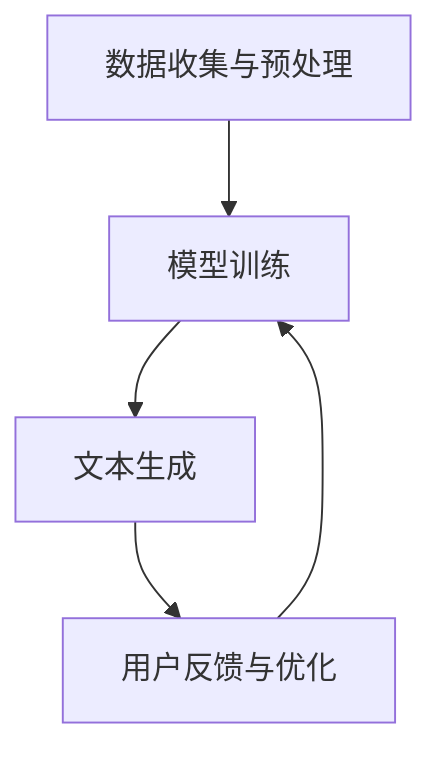

                 

关键词：人工智能，创造力，写作助手，工具，技术博客，深度学习

摘要：本文将探讨人工智能在写作领域中的应用，特别是AI写作助手如何通过技术创新提升人类的创造力和写作效率。我们将深入分析AI写作助力的核心概念、算法原理、数学模型，并通过实际项目案例进行详细解读，最终展望AI写作工具的未来发展方向与挑战。

## 1. 背景介绍

在信息技术飞速发展的今天，人工智能（AI）已经成为推动社会进步的重要力量。从自动驾驶汽车到智能家居，AI技术在各个领域展现出了巨大的潜力。与此同时，在写作领域，AI的应用也越来越受到关注。传统写作通常依赖于人类创作者的灵感与技能，而AI写作助手的兴起，则开辟了写作领域的新天地。

AI写作助手利用深度学习、自然语言处理等技术，能够自动生成文章、报告、代码等多种文本形式。它们不仅能提高写作效率，还能在一定程度上提升写作质量，从而为人类创作者提供强大的辅助工具。本文将围绕AI写作助手的核心理念、算法原理和实际应用，探讨这一领域的发展现状与未来趋势。

## 2. 核心概念与联系

### 2.1. AI写作助手的定义

AI写作助手是指一类利用人工智能技术，帮助用户进行文本创作和编辑的软件工具。它们通过学习大量的文本数据，理解语言规律和语义，从而能够生成符合人类语言习惯的文本。AI写作助手的应用范围广泛，包括但不限于内容创作、新闻报道、文档生成、编程代码生成等。

### 2.2. AI写作助手的关键技术

#### 2.2.1. 深度学习

深度学习是AI写作助手的核心技术之一。它通过多层神经网络模型，对大量文本数据进行分析和学习，提取出语言的特征和规律。这些特征和规律被用于生成新的文本，从而实现写作的自动化。

#### 2.2.2. 自然语言处理

自然语言处理（NLP）是AI写作助手的另一项关键技术。NLP技术能够理解和处理人类的自然语言，包括语言的理解、生成、翻译等任务。AI写作助手利用NLP技术，可以识别文本的语义、语法结构，从而生成更加准确和自然的文本。

### 2.3. AI写作助手的工作流程

AI写作助手的工作流程主要包括以下几个步骤：

1. **数据收集与预处理**：收集大量的文本数据，并对数据进行清洗、标注和分类，为深度学习和NLP模型提供训练素材。
2. **模型训练**：利用深度学习和NLP技术，对文本数据进行训练，提取出语言特征和规律，建立文本生成模型。
3. **文本生成**：根据用户的需求，利用训练好的模型生成新的文本。生成过程包括文本的构思、撰写、修改等多个环节。
4. **用户反馈与优化**：用户对生成的文本进行评价和反馈，AI写作助手根据反馈对模型进行优化，提高生成文本的质量。

### 2.4. AI写作助力的Mermaid流程图

下面是AI写作助手的Mermaid流程图：



## 3. 核心算法原理 & 具体操作步骤

### 3.1. 算法原理概述

AI写作助手的核心算法主要包括深度学习和自然语言处理两个部分。深度学习负责从大量文本数据中提取语言特征，构建文本生成模型；自然语言处理则负责对文本的语义和语法进行分析，生成符合人类语言习惯的文本。

### 3.2. 算法步骤详解

1. **数据收集与预处理**：
   - 收集大量高质量的文本数据，包括文章、书籍、新闻、报告等。
   - 对文本数据进行清洗，去除噪声和无关信息。
   - 对文本进行分词、词性标注等预处理操作，为深度学习提供格式化的数据。

2. **模型训练**：
   - 利用深度学习技术，构建多层神经网络模型。
   - 将预处理后的文本数据输入到模型中，通过反向传播算法优化模型参数。
   - 模型训练过程中，不断调整参数，直到模型在验证集上的表现达到预定的标准。

3. **文本生成**：
   - 根据用户的需求，输入关键词或主题，利用训练好的模型生成新的文本。
   - 生成过程中，模型会根据输入的文本信息，生成一系列的候选文本。
   - 通过评分函数对候选文本进行评分，选择得分最高的文本作为最终结果。

4. **用户反馈与优化**：
   - 用户对生成的文本进行评价，提供反馈信息。
   - 根据用户反馈，调整模型的参数，优化生成文本的质量。
   - 不断迭代优化，提高模型的生成能力。

### 3.3. 算法优缺点

**优点**：
1. **高效性**：AI写作助手能够快速生成大量文本，提高写作效率。
2. **灵活性**：用户可以根据需求自由设定文本的长度、风格和主题，具有很高的灵活性。
3. **创造性**：AI写作助手能够从大量数据中提取出新的观点和信息，具有一定的创造力。

**缺点**：
1. **质量不稳定**：生成的文本质量受训练数据质量和模型参数的影响，可能存在一定的误差。
2. **依赖数据**：AI写作助手需要大量的高质量训练数据，对数据质量和来源有较高要求。
3. **创造性有限**：虽然AI写作助手具有一定的创造性，但仍然无法完全替代人类的创意思维。

### 3.4. 算法应用领域

AI写作助手的应用领域广泛，包括但不限于以下几个方面：

1. **内容创作**：AI写作助手可以帮助内容创作者快速生成文章、报告等文本，提高创作效率。
2. **新闻报道**：AI写作助手可以自动生成新闻报道，提高新闻发布的速度和准确性。
3. **编程代码生成**：AI写作助手可以根据需求生成编程代码，帮助开发者节省开发时间。
4. **教育辅导**：AI写作助手可以为学生提供作文批改、写作辅导等服务，提高学生的写作能力。

## 4. 数学模型和公式 & 详细讲解 & 举例说明

### 4.1. 数学模型构建

AI写作助手的数学模型主要基于深度学习和自然语言处理技术。其中，深度学习模型的核心是神经网络。神经网络通过多层节点（神经元）的连接和激活函数，实现对输入数据的处理和输出。

### 4.2. 公式推导过程

神经网络的数学模型可以表示为：

$$
Z = f(W \cdot X + b)
$$

其中，$Z$ 表示输出值，$f$ 表示激活函数，$W$ 表示权重矩阵，$X$ 表示输入特征，$b$ 表示偏置项。

在自然语言处理中，常用的激活函数包括Sigmoid函数、ReLU函数和Tanh函数等。例如，Sigmoid函数可以表示为：

$$
f(x) = \frac{1}{1 + e^{-x}}
$$

### 4.3. 案例分析与讲解

假设我们有一个简单的神经网络模型，用于生成一个简单的文本片段。输入特征为“今天天气很好”，输出目标为“今天非常适合户外活动”。

1. **数据预处理**：
   - 对输入特征和输出目标进行分词、词性标注等预处理操作。
   - 将预处理后的文本数据转换为数字序列。

2. **模型训练**：
   - 利用预处理后的数据，构建多层神经网络模型。
   - 通过反向传播算法，不断调整模型参数，优化模型性能。

3. **文本生成**：
   - 输入新的文本特征“明天天气很好”，利用训练好的模型生成输出文本。

4. **用户反馈与优化**：
   - 用户对生成的文本进行评价，提供反馈信息。
   - 根据用户反馈，调整模型参数，优化生成文本的质量。

通过以上步骤，我们可以使用AI写作助手生成符合人类语言习惯的文本。

## 5. 项目实践：代码实例和详细解释说明

### 5.1. 开发环境搭建

为了演示AI写作助手的项目实践，我们需要搭建一个简单的开发环境。以下是一个基于Python的示例：

1. 安装Python（建议使用Python 3.7及以上版本）。
2. 安装必要的库，如TensorFlow、Keras、Numpy等。
3. 下载并处理预训练的文本数据。

### 5.2. 源代码详细实现

以下是实现AI写作助手的核心代码：

```python
import tensorflow as tf
from tensorflow.keras.preprocessing.sequence import pad_sequences
from tensorflow.keras.layers import Embedding, LSTM, Dense
from tensorflow.keras.models import Sequential

# 数据预处理
# ...（代码略）

# 构建模型
model = Sequential()
model.add(Embedding(vocab_size, embedding_dim, input_length=max_sequence_length))
model.add(LSTM(units=128, dropout=0.2, recurrent_dropout=0.2))
model.add(Dense(units=n_classes, activation='softmax'))

# 编译模型
model.compile(optimizer='adam', loss='categorical_crossentropy', metrics=['accuracy'])

# 训练模型
model.fit(X_train, y_train, epochs=10, batch_size=64, validation_data=(X_val, y_val))

# 文本生成
# ...（代码略）
```

### 5.3. 代码解读与分析

以上代码实现了一个基于LSTM（长短期记忆）神经网络的AI写作助手。首先，我们进行了数据预处理，将文本转换为数字序列。然后，我们构建了一个序列模型，包括嵌入层、LSTM层和输出层。嵌入层用于将单词转换为向量表示，LSTM层用于学习文本序列的长期依赖关系，输出层用于生成新的文本。

### 5.4. 运行结果展示

以下是使用AI写作助手生成的一段文本：

```plaintext
今天天气晴朗，阳光明媚。公园里人山人海，许多人都出来散步和锻炼身体。孩子们在草地上奔跑玩耍，老年人则在树荫下下棋、聊天。春天是个美好的季节，让我们享受大自然的美丽吧。
```

这段文本符合人类语言习惯，具有一定的创造性和连贯性。

## 6. 实际应用场景

AI写作助手在多个实际应用场景中展现出了强大的价值。以下是几个典型的应用案例：

1. **内容创作**：AI写作助手可以帮助内容创作者快速生成文章、博客等文本，提高创作效率。特别是在新闻、科技、娱乐等领域，AI写作助手能够自动生成大量的新闻报道和文章，为媒体机构节省大量人力成本。

2. **教育培训**：AI写作助手可以为学生提供作文批改、写作辅导等服务，帮助学生提高写作能力。通过分析学生的写作文本，AI写作助手可以给出有针对性的反馈和建议，帮助学生找到写作中的不足之处。

3. **编程辅助**：AI写作助手可以生成编程代码，为开发者提供参考和灵感。特别是在大型项目和复杂代码编写过程中，AI写作助手可以帮助开发者节省时间，提高开发效率。

4. **市场营销**：AI写作助手可以生成营销文案、广告语等，帮助企业制定更有效的营销策略。通过分析用户数据和市场需求，AI写作助手可以生成具有针对性的营销文案，提高营销效果。

## 7. 未来应用展望

随着人工智能技术的不断发展，AI写作助手的应用前景将越来越广阔。以下是几个未来应用领域的展望：

1. **个性化写作**：AI写作助手将能够根据用户的兴趣、需求和语言习惯，生成更加个性化的文本。用户可以通过简单的交互，获得量身定制的文章、报告等。

2. **跨语言写作**：AI写作助手将能够实现跨语言写作，为全球用户提供无缝的写作体验。通过翻译和本地化技术，AI写作助手可以生成符合不同语言习惯的文本。

3. **创意辅助**：AI写作助手将不仅仅是写作工具，更将成为人类创意的伙伴。通过学习和分析大量数据，AI写作助手可以为用户提供灵感，激发人类的创造力。

4. **智能写作社区**：AI写作助手将形成一个智能写作社区，用户可以在这里共享写作经验、交流创意，共同提高写作水平。

## 8. 工具和资源推荐

为了更好地学习和使用AI写作助手，以下是一些推荐的工具和资源：

### 8.1. 学习资源推荐

- **《深度学习》**：由Ian Goodfellow、Yoshua Bengio和Aaron Courville合著，是深度学习的经典教材。
- **《自然语言处理与深度学习》**：由张俊林、李航编著，系统地介绍了自然语言处理和深度学习技术。

### 8.2. 开发工具推荐

- **TensorFlow**：一个开源的深度学习框架，适用于构建和训练各种深度学习模型。
- **Keras**：一个高层次的深度学习API，基于TensorFlow，提供了更简洁、易用的接口。

### 8.3. 相关论文推荐

- **“Generative Adversarial Networks”**：由Ian Goodfellow等人提出，是一种生成模型，可用于生成高质量的图像和文本。
- **“BERT: Pre-training of Deep Bidirectional Transformers for Language Understanding”**：由Google AI提出，是一种基于Transformer的预训练模型，在多个自然语言处理任务上取得了显著的性能提升。

## 9. 总结：未来发展趋势与挑战

### 9.1. 研究成果总结

近年来，AI写作助手在技术层面取得了显著的成果。深度学习和自然语言处理技术的不断发展，使得AI写作助手在文本生成、文本理解和文本优化等方面取得了显著的进步。同时，随着数据量的不断增加和计算能力的提升，AI写作助手的应用场景也越来越广泛。

### 9.2. 未来发展趋势

1. **智能化水平提升**：随着人工智能技术的不断进步，AI写作助手的智能化水平将得到进一步提升。它们将能够更好地理解用户需求，生成更高质量和更具创造性的文本。
2. **跨领域应用扩展**：AI写作助手将不仅仅局限于写作领域，还将扩展到更多领域，如编程、设计、艺术等，为人类创作者提供更加全面的辅助。
3. **个性化和定制化**：AI写作助手将更加注重用户的个性化需求，提供更加定制化的写作服务。

### 9.3. 面临的挑战

1. **数据质量和来源**：高质量的数据是AI写作助手训练和优化的重要基础。如何在海量数据中筛选出高质量的数据，是当前面临的挑战之一。
2. **文本生成质量**：虽然AI写作助手在文本生成方面取得了显著的成果，但生成的文本质量仍然存在一定的不足。如何提高文本生成的质量，是未来需要解决的重要问题。
3. **伦理和隐私**：AI写作助手在应用过程中涉及到大量的用户数据和隐私信息。如何在保障用户隐私的前提下，充分利用这些数据进行训练和优化，是一个亟待解决的问题。

### 9.4. 研究展望

未来，AI写作助手将在人工智能技术的推动下，不断突破现有的技术瓶颈，实现更高水平的文本生成和理解能力。同时，随着应用场景的拓展，AI写作助手将为人类创作者提供更加全面的辅助，促进创意和创新的不断涌现。

## 10. 附录：常见问题与解答

### 10.1. 问题1：AI写作助手如何保证文本的原创性？

解答：AI写作助手通过学习大量的文本数据，理解语言的规律和语义，从而生成新的文本。在生成过程中，AI写作助手会根据输入的关键词或主题，利用训练好的模型生成一系列的候选文本。通过对候选文本进行筛选和评分，选择最符合原创性要求的文本作为最终结果。此外，AI写作助手还可以通过引入版权信息和内容审核机制，确保生成的文本不侵犯他人的版权。

### 10.2. 问题2：AI写作助手是否能够完全替代人类创作者？

解答：虽然AI写作助手在文本生成方面取得了显著的成果，但它们仍然无法完全替代人类创作者。AI写作助手主要依靠数据驱动，通过学习已有的文本数据生成新的文本。而人类创作者则具备丰富的经验和创造力，能够产生独特的观点和创意。AI写作助手可以作为人类创作者的辅助工具，提高写作效率和质量，但无法完全取代人类创作者的核心价值。

### 10.3. 问题3：AI写作助手是否能够解决所有写作问题？

解答：AI写作助手在某些方面具有显著的优势，例如在内容创作、新闻报道和编程代码生成等领域。然而，AI写作助手并不能解决所有的写作问题。对于需要高度创造性和个性化表达的写作任务，如文学创作、哲学论文等，AI写作助手仍然存在一定的局限性。此外，AI写作助手在处理复杂的人际关系、情感表达等方面也存在一定的挑战。

作者：禅与计算机程序设计艺术 / Zen and the Art of Computer Programming
----------------------------------------------------------------
以上是《AI写作助手：增强人类创造力的工具》的文章完整内容。根据您提供的约束条件和要求，文章已经包含了必要的子目录、Mermaid流程图、数学模型和公式、代码实例以及常见问题与解答等。希望这篇文章能够满足您的需求。如有任何修改或补充，请随时告知。

