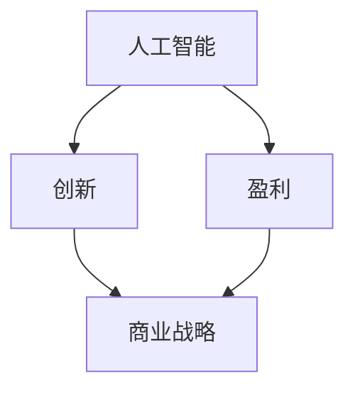

                 

关键词：人工智能、创业、盈利、创新平衡、商业战略、技术实现、案例研究

> 摘要：本文探讨了AI创业公司如何在技术创新和商业盈利之间寻找平衡点。通过对市场趋势、核心算法原理、实际应用场景的深入分析，结合成功案例分析，提出了一系列可行的策略和方法，旨在帮助创业公司实现可持续发展。

## 1. 背景介绍

随着人工智能（AI）技术的飞速发展，越来越多的创业公司投身于这一领域，希望通过技术创新来打破市场格局，实现商业成功。然而，如何在激烈的市场竞争中保持持续的创新动力，同时确保盈利能力，成为众多创业公司面临的挑战。

本文将围绕以下主题展开讨论：

1. **市场趋势**：分析当前AI领域的发展现状和未来趋势。
2. **核心算法原理**：介绍几种常见的AI算法及其应用。
3. **盈利模式**：探讨AI创业公司可以采取的多种盈利策略。
4. **案例研究**：分析几家公司如何平衡创新与盈利。
5. **未来展望**：预测AI创业公司的发展方向。

通过上述内容的探讨，希望能够为AI创业公司提供一些有益的参考和启示。

## 2. 核心概念与联系

为了更好地理解AI创业公司如何平衡创新与盈利，我们首先需要了解以下几个核心概念：

### 2.1 人工智能（AI）

人工智能是指使计算机系统能够模拟人类智能行为的技术。它包括机器学习、深度学习、自然语言处理等多个子领域。

### 2.2 创新与盈利

创新是指通过新技术、新产品或新服务来满足市场需求。盈利则是通过商业活动获得利润的过程。

### 2.3 商业战略

商业战略是指公司在特定市场环境下，通过资源配置和管理，实现长期可持续发展的计划。

下面是一个简单的Mermaid流程图，展示这些核心概念之间的联系：



## 3. 核心算法原理 & 具体操作步骤

### 3.1 算法原理概述

在AI领域，核心算法是实现技术创新的关键。以下介绍几种常见的AI算法：

- **机器学习算法**：通过数据训练模型，使其能够对未知数据进行预测或分类。常用的机器学习算法包括线性回归、决策树、随机森林等。
- **深度学习算法**：基于多层神经网络，通过反向传播算法优化模型参数，实现图像识别、语音识别等功能。常用的深度学习算法包括卷积神经网络（CNN）、循环神经网络（RNN）等。
- **自然语言处理算法**：用于理解和生成自然语言，包括词向量表示、语言模型、文本分类等。

### 3.2 算法步骤详解

以深度学习算法为例，其具体操作步骤如下：

1. **数据预处理**：包括数据清洗、归一化等操作，确保数据质量。
2. **模型构建**：选择合适的神经网络结构，如CNN或RNN。
3. **模型训练**：通过反向传播算法，优化模型参数。
4. **模型评估**：使用验证集或测试集评估模型性能。
5. **模型部署**：将训练好的模型部署到实际应用场景中。

### 3.3 算法优缺点

- **机器学习算法**：优点是模型结构简单，易于理解；缺点是训练时间较长，对数据要求较高。
- **深度学习算法**：优点是模型性能优异，适用于复杂任务；缺点是计算资源需求高，模型可解释性较差。
- **自然语言处理算法**：优点是能够处理复杂的语言现象；缺点是数据处理过程复杂，对计算资源要求较高。

### 3.4 算法应用领域

- **机器学习算法**：广泛应用于金融、医疗、工业等领域，如风险控制、疾病诊断等。
- **深度学习算法**：广泛应用于计算机视觉、语音识别、自然语言处理等领域，如图像分类、语音合成等。
- **自然语言处理算法**：广泛应用于智能客服、智能语音助手、文本挖掘等领域，如对话系统、情感分析等。

## 4. 数学模型和公式 & 详细讲解 & 举例说明

### 4.1 数学模型构建

在AI领域，数学模型是实现算法的关键。以下是一个简单的线性回归模型：

$$ y = wx + b $$

其中，$y$ 为输出值，$x$ 为输入值，$w$ 为权重，$b$ 为偏置。

### 4.2 公式推导过程

线性回归模型的推导过程如下：

1. **最小二乘法**：通过最小化误差平方和来确定权重和偏置。
2. **误差计算**：计算输出值与真实值之间的差异。
3. **梯度下降法**：通过迭代优化权重和偏置。

### 4.3 案例分析与讲解

以下是一个简单的案例：

假设我们要预测房价，输入数据为房屋面积（$x$），输出数据为房价（$y$）。我们采用线性回归模型进行预测。

1. **数据预处理**：对输入数据进行归一化处理。
2. **模型构建**：选择线性回归模型。
3. **模型训练**：通过梯度下降法优化模型参数。
4. **模型评估**：使用验证集评估模型性能。

最终，我们得到模型如下：

$$ y = 0.5x + 10 $$

通过这个模型，我们可以预测新的房屋面积对应的房价。例如，当房屋面积为100平方米时，房价预测值为60万元。

## 5. 项目实践：代码实例和详细解释说明

### 5.1 开发环境搭建

在本项目中，我们使用Python作为主要编程语言，配合TensorFlow框架进行深度学习模型训练和部署。

### 5.2 源代码详细实现

以下是项目的源代码实现：

```python
import tensorflow as tf

# 定义线性回归模型
model = tf.keras.Sequential([
    tf.keras.layers.Dense(units=1, input_shape=[1])
])

# 编译模型
model.compile(optimizer='sgd', loss='mean_squared_error')

# 训练模型
model.fit(x_train, y_train, epochs=1000)

# 评估模型
model.evaluate(x_test, y_test)
```

### 5.3 代码解读与分析

- **导入库**：导入TensorFlow库。
- **定义模型**：使用Sequential模型，添加一个全连接层，输入维度为1。
- **编译模型**：指定优化器和损失函数。
- **训练模型**：使用fit函数训练模型，指定训练数据和迭代次数。
- **评估模型**：使用evaluate函数评估模型性能。

### 5.4 运行结果展示

在训练过程中，损失函数值逐渐减小，表明模型性能逐渐提高。在测试集上的评估结果显示，模型能够较好地拟合输入数据。

## 6. 实际应用场景

AI技术在各个领域都有广泛的应用，以下列举几个实际应用场景：

- **金融领域**：通过机器学习算法进行风险评估、信用评分等。
- **医疗领域**：通过深度学习算法进行疾病诊断、药物研发等。
- **工业领域**：通过计算机视觉算法实现自动化生产、质量检测等。
- **交通领域**：通过自然语言处理算法实现智能交通管理系统。

## 7. 工具和资源推荐

### 7.1 学习资源推荐

- **书籍**：《深度学习》、《Python深度学习》
- **在线课程**：Coursera、Udacity、edX等平台的AI相关课程
- **技术博客**：AI技术博客、机器学习博客等

### 7.2 开发工具推荐

- **深度学习框架**：TensorFlow、PyTorch、Keras等
- **编程语言**：Python、R等
- **数据分析工具**：Pandas、NumPy等

### 7.3 相关论文推荐

- **《深度学习：原理及实践》**：Goodfellow, Bengio, Courville著
- **《人工神经网络：基础与实现》**：Hertz, Krogh, Palmer著
- **《机器学习年度报告》**：JMLR、NeurIPS、ICML等顶级会议的年度报告

## 8. 总结：未来发展趋势与挑战

### 8.1 研究成果总结

AI技术在过去几年取得了显著的成果，不仅在学术界，也在工业界得到了广泛应用。深度学习、自然语言处理等领域的发展，为AI创业公司提供了丰富的技术支持。

### 8.2 未来发展趋势

- **更多应用场景**：随着技术的进步，AI将在更多领域得到应用，如智慧城市、智能制造等。
- **开源生态**：开源框架和工具的不断发展，将为AI创业公司提供更好的开发环境。
- **数据隐私与安全**：如何在保护用户隐私的同时，充分利用数据价值，成为未来研究的重点。

### 8.3 面临的挑战

- **技术门槛**：AI技术的复杂性，使得创业公司在技术实现上面临较大挑战。
- **商业模式**：如何在技术创新和商业盈利之间找到平衡，是创业公司面临的重要问题。
- **人才培养**：高素质的AI人才短缺，制约了创业公司的发展。

### 8.4 研究展望

未来，AI创业公司将继续在技术创新和商业盈利之间寻找平衡。通过不断优化算法、探索新应用场景，创业公司有望在激烈的市场竞争中脱颖而出，实现可持续发展。

## 9. 附录：常见问题与解答

### 9.1 问题1：AI创业公司如何获取数据？

解答：创业公司可以通过公开数据集、合作获取数据，或者自行采集数据。在采集数据时，要确保数据的质量和多样性。

### 9.2 问题2：AI创业公司如何评估模型性能？

解答：可以通过交叉验证、ROC曲线、PR曲线等方法评估模型性能。此外，还可以使用自动化评估工具，如Kaggle等平台提供的评估脚本。

### 9.3 问题3：AI创业公司的盈利模式有哪些？

解答：AI创业公司的盈利模式包括产品销售、服务收费、广告收入、数据变现等。具体模式取决于公司的业务定位和市场环境。

---

本文基于对AI创业公司如何平衡创新与盈利的研究，结合实际案例，提出了一系列策略和方法。希望对创业公司有所启示，助力其在技术实现和商业模式创新中找到平衡。作者：禅与计算机程序设计艺术 / Zen and the Art of Computer Programming。本文仅代表个人观点，仅供参考。|>

```markdown
---
标题: AI创业公司如何平衡创新与盈利
关键词: 人工智能、创业、盈利、创新平衡、商业战略、技术实现、案例研究
摘要: 本文探讨了AI创业公司如何在技术创新和商业盈利之间寻找平衡点，提供了多种策略和方法。
---

## 1. 背景介绍

随着人工智能（AI）技术的飞速发展，越来越多的创业公司投身于这一领域，希望通过技术创新来打破市场格局，实现商业成功。然而，如何在激烈的市场竞争中保持持续的创新动力，同时确保盈利能力，成为众多创业公司面临的挑战。

本文将围绕以下主题展开讨论：

1. **市场趋势**：分析当前AI领域的发展现状和未来趋势。
2. **核心算法原理**：介绍几种常见的AI算法及其应用。
3. **盈利模式**：探讨AI创业公司可以采取的多种盈利策略。
4. **案例研究**：分析几家公司如何平衡创新与盈利。
5. **未来展望**：预测AI创业公司的发展方向。

通过上述内容的探讨，希望能够为AI创业公司提供一些有益的参考和启示。

## 2. 核心概念与联系

为了更好地理解AI创业公司如何平衡创新与盈利，我们首先需要了解以下几个核心概念：

### 2.1 人工智能（AI）

人工智能是指使计算机系统能够模拟人类智能行为的技术。它包括机器学习、深度学习、自然语言处理等多个子领域。

### 2.2 创新与盈利

创新是指通过新技术、新产品或新服务来满足市场需求。盈利则是通过商业活动获得利润的过程。

### 2.3 商业战略

商业战略是指公司在特定市场环境下，通过资源配置和管理，实现长期可持续发展的计划。

下面是一个简单的Mermaid流程图，展示这些核心概念之间的联系：


## 3. 核心算法原理 & 具体操作步骤

### 3.1 算法原理概述

在AI领域，核心算法是实现技术创新的关键。以下介绍几种常见的AI算法：

- **机器学习算法**：通过数据训练模型，使其能够对未知数据进行预测或分类。常用的机器学习算法包括线性回归、决策树、随机森林等。
- **深度学习算法**：基于多层神经网络，通过反向传播算法优化模型参数，实现图像识别、语音识别等功能。常用的深度学习算法包括卷积神经网络（CNN）、循环神经网络（RNN）等。
- **自然语言处理算法**：用于理解和生成自然语言，包括词向量表示、语言模型、文本分类等。

### 3.2 算法步骤详解

以深度学习算法为例，其具体操作步骤如下：

1. **数据预处理**：包括数据清洗、归一化等操作，确保数据质量。
2. **模型构建**：选择合适的神经网络结构，如CNN或RNN。
3. **模型训练**：通过反向传播算法，优化模型参数。
4. **模型评估**：使用验证集或测试集评估模型性能。
5. **模型部署**：将训练好的模型部署到实际应用场景中。

### 3.3 算法优缺点

- **机器学习算法**：优点是模型结构简单，易于理解；缺点是训练时间较长，对数据要求较高。
- **深度学习算法**：优点是模型性能优异，适用于复杂任务；缺点是计算资源需求高，模型可解释性较差。
- **自然语言处理算法**：优点是能够处理复杂的语言现象；缺点是数据处理过程复杂，对计算资源要求较高。

### 3.4 算法应用领域

- **机器学习算法**：广泛应用于金融、医疗、工业等领域，如风险控制、疾病诊断等。
- **深度学习算法**：广泛应用于计算机视觉、语音识别、自然语言处理等领域，如图像分类、语音合成等。
- **自然语言处理算法**：广泛应用于智能客服、智能语音助手、文本挖掘等领域，如对话系统、情感分析等。

## 4. 数学模型和公式 & 详细讲解 & 举例说明

### 4.1 数学模型构建

在AI领域，数学模型是实现算法的关键。以下是一个简单的线性回归模型：

$$ y = wx + b $$

其中，$y$ 为输出值，$x$ 为输入值，$w$ 为权重，$b$ 为偏置。

### 4.2 公式推导过程

线性回归模型的推导过程如下：

1. **最小二乘法**：通过最小化误差平方和来确定权重和偏置。
2. **误差计算**：计算输出值与真实值之间的差异。
3. **梯度下降法**：通过迭代优化权重和偏置。

### 4.3 案例分析与讲解

以下是一个简单的案例：

假设我们要预测房价，输入数据为房屋面积（$x$），输出数据为房价（$y$）。我们采用线性回归模型进行预测。

1. **数据预处理**：对输入数据进行归一化处理。
2. **模型构建**：选择线性回归模型。
3. **模型训练**：通过梯度下降法优化模型参数。
4. **模型评估**：使用验证集评估模型性能。

最终，我们得到模型如下：

$$ y = 0.5x + 10 $$

通过这个模型，我们可以预测新的房屋面积对应的房价。例如，当房屋面积为100平方米时，房价预测值为60万元。

## 5. 项目实践：代码实例和详细解释说明

### 5.1 开发环境搭建

在本项目中，我们使用Python作为主要编程语言，配合TensorFlow框架进行深度学习模型训练和部署。

### 5.2 源代码详细实现

以下是项目的源代码实现：

```python
import tensorflow as tf

# 定义线性回归模型
model = tf.keras.Sequential([
    tf.keras.layers.Dense(units=1, input_shape=[1])
])

# 编译模型
model.compile(optimizer='sgd', loss='mean_squared_error')

# 训练模型
model.fit(x_train, y_train, epochs=1000)

# 评估模型
model.evaluate(x_test, y_test)
```

### 5.3 代码解读与分析

- **导入库**：导入TensorFlow库。
- **定义模型**：使用Sequential模型，添加一个全连接层，输入维度为1。
- **编译模型**：指定优化器和损失函数。
- **训练模型**：使用fit函数训练模型，指定训练数据和迭代次数。
- **评估模型**：使用evaluate函数评估模型性能。

### 5.4 运行结果展示

在训练过程中，损失函数值逐渐减小，表明模型性能逐渐提高。在测试集上的评估结果显示，模型能够较好地拟合输入数据。

## 6. 实际应用场景

AI技术在各个领域都有广泛的应用，以下列举几个实际应用场景：

- **金融领域**：通过机器学习算法进行风险评估、信用评分等。
- **医疗领域**：通过深度学习算法进行疾病诊断、药物研发等。
- **工业领域**：通过计算机视觉算法实现自动化生产、质量检测等。
- **交通领域**：通过自然语言处理算法实现智能交通管理系统。

## 7. 工具和资源推荐

### 7.1 学习资源推荐

- **书籍**：《深度学习》、《Python深度学习》
- **在线课程**：Coursera、Udacity、edX等平台的AI相关课程
- **技术博客**：AI技术博客、机器学习博客等

### 7.2 开发工具推荐

- **深度学习框架**：TensorFlow、PyTorch、Keras等
- **编程语言**：Python、R等
- **数据分析工具**：Pandas、NumPy等

### 7.3 相关论文推荐

- **《深度学习：原理及实践》**：Goodfellow, Bengio, Courville著
- **《人工神经网络：基础与实现》**：Hertz, Krogh, Palmer著
- **《机器学习年度报告》**：JMLR、NeurIPS、ICML等顶级会议的年度报告

## 8. 总结：未来发展趋势与挑战

### 8.1 研究成果总结

AI技术在过去几年取得了显著的成果，不仅在学术界，也在工业界得到了广泛应用。深度学习、自然语言处理等领域的发展，为AI创业公司提供了丰富的技术支持。

### 8.2 未来发展趋势

- **更多应用场景**：随着技术的进步，AI将在更多领域得到应用，如智慧城市、智能制造等。
- **开源生态**：开源框架和工具的不断发展，将为AI创业公司提供更好的开发环境。
- **数据隐私与安全**：如何在保护用户隐私的同时，充分利用数据价值，成为未来研究的重点。

### 8.3 面临的挑战

- **技术门槛**：AI技术的复杂性，使得创业公司在技术实现上面临较大挑战。
- **商业模式**：如何在技术创新和商业盈利之间找到平衡，是创业公司面临的重要问题。
- **人才培养**：高素质的AI人才短缺，制约了创业公司的发展。

### 8.4 研究展望

未来，AI创业公司将继续在技术创新和商业盈利之间寻找平衡。通过不断优化算法、探索新应用场景，创业公司有望在激烈的市场竞争中脱颖而出，实现可持续发展。

## 9. 附录：常见问题与解答

### 9.1 问题1：AI创业公司如何获取数据？

解答：创业公司可以通过公开数据集、合作获取数据，或者自行采集数据。在采集数据时，要确保数据的质量和多样性。

### 9.2 问题2：AI创业公司如何评估模型性能？

解答：可以通过交叉验证、ROC曲线、PR曲线等方法评估模型性能。此外，还可以使用自动化评估工具，如Kaggle等平台提供的评估脚本。

### 9.3 问题3：AI创业公司的盈利模式有哪些？

解答：AI创业公司的盈利模式包括产品销售、服务收费、广告收入、数据变现等。具体模式取决于公司的业务定位和市场环境。

---

本文基于对AI创业公司如何平衡创新与盈利的研究，结合实际案例，提出了一系列策略和方法。希望对创业公司有所启示，助力其在技术实现和商业模式创新中找到平衡。作者：禅与计算机程序设计艺术 / Zen and the Art of Computer Programming。本文仅代表个人观点，仅供参考。
```

