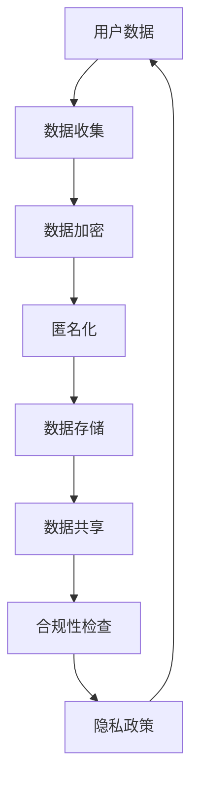

                 

关键词：数据隐私，AI创业公司，数据保护，法规合规，隐私政策，数据加密，匿名化技术

## 摘要

在人工智能（AI）迅猛发展的时代，数据隐私问题日益凸显，对于AI创业公司来说，如何在法律法规的框架下保护用户数据隐私，成为一项重要且紧迫的挑战。本文将深入探讨AI创业公司在数据隐私方面所面临的挑战，包括数据收集、存储、处理和共享过程中的潜在风险，并提出一系列有效的应对策略，旨在帮助创业公司建立稳健的隐私保护体系，实现可持续发展。

## 1. 背景介绍

随着人工智能技术的不断进步，越来越多的AI创业公司涌现，它们利用海量数据训练智能模型，推动科技创新。然而，这一过程中，数据隐私问题也愈发严峻。从数据收集到处理，再到最终的应用，每一个环节都可能成为隐私泄露的潜在风险点。这不仅威胁到用户的隐私权，也可能对公司的声誉和业务造成严重影响。

### 1.1 数据隐私的重要性

数据隐私是用户对于其个人信息受到保护和控制的权利。在AI时代，数据隐私的重要性愈加显著，主要体现在以下几个方面：

1. **保护用户隐私**：确保用户个人信息不被未经授权的第三方访问和使用。
2. **遵守法律法规**：全球各地对于数据隐私保护的法律法规日益严格，如欧盟的《通用数据保护条例》（GDPR）和加州的《消费者隐私法案》（CCPA）。
3. **增强用户信任**：良好的隐私保护措施能够提升用户对AI创业公司的信任，促进业务的长期发展。

### 1.2 AI创业公司面临的挑战

AI创业公司在数据隐私方面面临的挑战包括但不限于：

1. **数据收集和处理**：如何在不侵犯用户隐私的前提下，收集和处理大量的用户数据。
2. **数据存储**：如何确保存储在云端或本地的数据不被未授权访问。
3. **数据共享**：如何在保证隐私的前提下，与其他公司或合作伙伴共享数据。
4. **合规性**：如何确保公司的数据隐私策略符合各种法律法规的要求。

## 2. 核心概念与联系

为了更好地理解和应对数据隐私挑战，我们需要了解一些核心概念和它们之间的联系。以下是一个使用Mermaid绘制的流程图，展示了这些核心概念和它们之间的关系：



### 2.1 用户数据

用户数据是所有隐私问题的关键点，包括个人信息、行为数据等。在数据收集阶段，创业公司需要明确收集的数据类型、目的和范围。

### 2.2 数据收集

数据收集是数据隐私保护的第一步，创业公司需确保收集的数据是必要的、合法的，并在收集前明确告知用户。

### 2.3 数据加密

数据加密是保护数据隐私的重要手段，通过加密算法将数据转换为无法解读的格式，以防止未经授权的访问。

### 2.4 匿名化

匿名化技术通过去除或混淆个人身份信息，使数据在分析过程中无法直接关联到特定个体。

### 2.5 数据存储

数据存储涉及到数据的安全性和访问控制，创业公司需要确保存储环境的安全，并实施严格的访问策略。

### 2.6 数据共享

数据共享需要在确保数据隐私不受侵犯的前提下进行，可以通过数据匿名化、签订保密协议等方式实现。

### 2.7 合规性检查

合规性检查是确保公司数据隐私策略符合法律法规的必要步骤，需要定期审查和更新。

### 2.8 隐私政策

隐私政策是创业公司对用户隐私保护承诺的明示，需要清晰、详细地描述数据收集、使用、存储和共享的方式。

## 3. 核心算法原理 & 具体操作步骤

### 3.1 算法原理概述

在数据隐私保护中，常用的算法和技术包括数据加密、匿名化、差分隐私等。以下简要介绍这些算法的原理：

1. **数据加密**：通过加密算法将明文数据转换为密文，只有拥有密钥的实体才能解密和读取数据。
2. **匿名化**：通过去除或替换个人身份信息，使数据在分析过程中无法直接关联到特定个体。
3. **差分隐私**：通过在数据处理过程中引入随机噪声，保证单个数据点的隐私，同时保持数据集的整体统计特性。

### 3.2 算法步骤详解

1. **数据加密**
    - 步骤1：选择合适的加密算法（如AES、RSA等）。
    - 步骤2：生成或导入密钥。
    - 步骤3：对数据进行加密处理，生成密文。
    - 步骤4：密文存储或传输。

2. **匿名化**
    - 步骤1：识别数据集中的个人身份信息。
    - 步骤2：选择匿名化技术（如K-匿名、l-diversity等）。
    - 步骤3：对个人身份信息进行替换或删除。
    - 步骤4：进行数据分析和挖掘。

3. **差分隐私**
    - 步骤1：确定隐私预算（epsilon）。
    - 步骤2：选择差分隐私机制（如拉普拉斯机制、指数机制等）。
    - 步骤3：在数据处理过程中引入随机噪声。
    - 步骤4：生成满足差分隐私的输出结果。

### 3.3 算法优缺点

1. **数据加密**
    - 优点：能有效保护数据隐私，防止未经授权的访问。
    - 缺点：加密和解密过程需要计算资源，可能影响性能。

2. **匿名化**
    - 优点：降低数据关联性的风险，便于数据分析和共享。
    - 缺点：可能破坏数据的完整性，影响分析结果的准确性。

3. **差分隐私**
    - 优点：在保证数据隐私的同时，保留数据集的整体统计特性。
    - 缺点：可能引入一定的噪声，影响分析结果的精度。

### 3.4 算法应用领域

1. **数据加密**：广泛应用于金融、医疗、政府等对数据安全性要求较高的领域。
2. **匿名化**：常用于数据共享、开放数据集等场景。
3. **差分隐私**：在机器学习和数据分析领域有广泛应用，如推荐系统、用户行为分析等。

## 4. 数学模型和公式 & 详细讲解 & 举例说明

### 4.1 数学模型构建

为了更好地理解数据隐私保护中的数学模型，我们首先介绍几个基本概念：

1. **散列函数（Hash Function）**：将输入数据映射为固定长度的输出值，具有一致性、高效性和抗冲突性。
2. **对称加密（Symmetric Encryption）**：使用相同的密钥进行加密和解密，如AES算法。
3. **非对称加密（Asymmetric Encryption）**：使用一对密钥进行加密和解密，如RSA算法。
4. **匿名化算法（K-Anonymity）**：确保数据集中的记录无法被关联到特定个体。

### 4.2 公式推导过程

以下是一个简单的散列函数的公式推导过程：

- **哈希函数**：\( H(x) = \text{MD5}(x) \)

其中，\( \text{MD5}(x) \) 是一个将输入字符串 \( x \) 转换为32位十六进制字符串的哈希函数。

### 4.3 案例分析与讲解

假设有一个包含个人身份信息的数据库，我们需要对数据库进行加密处理，以保护用户隐私。

1. **选择加密算法**：我们选择AES加密算法，该算法使用128位密钥进行加密和解密。
2. **生成密钥**：通过随机数生成器生成一个128位的密钥。
3. **加密过程**：
    - \( \text{加密密钥} = \text{AES-密钥生成器}(\text{随机数}) \)
    - \( \text{加密数据} = \text{AES-加密}(\text{数据}, \text{加密密钥}) \)
4. **存储和解密过程**：
    - \( \text{存储数据} = \text{加密数据} \)
    - \( \text{解密数据} = \text{AES-解密}(\text{存储数据}, \text{加密密钥}) \)

通过这个过程，我们可以确保数据库中的数据在未经授权的情况下无法被读取。

## 5. 项目实践：代码实例和详细解释说明

### 5.1 开发环境搭建

在开始编写代码之前，我们需要搭建一个合适的开发环境。以下是所需的步骤：

1. **安装Python**：Python是一种广泛应用于数据科学和人工智能的编程语言。
2. **安装必要的库**：包括加密库（如PyCryptoDome）、哈希库（如hashlib）等。

### 5.2 源代码详细实现

以下是一个简单的Python代码示例，实现了对用户数据进行加密和存储的过程：

```python
from Crypto.Cipher import AES
from Crypto.Random import get_random_bytes
import hashlib

def encrypt_data(data, key):
    cipher = AES.new(key, AES.MODE_EAX)
    ciphertext, tag = cipher.encrypt_and_digest(data)
    return cipher.nonce, ciphertext, tag

def generate_key(password):
    hash_func = hashlib.sha256()
    hash_func.update(password.encode('utf-8'))
    return hash_func.digest()

def main():
    user_data = "John Doe, 30, USA".encode('utf-8')
    password = "my_password".encode('utf-8')
    
    key = generate_key(password)
    nonce, ciphertext, tag = encrypt_data(user_data, key)
    
    print(f"Nonce: {nonce.hex()}")
    print(f"Ciphertext: {ciphertext.hex()}")
    print(f"Tag: {tag.hex()}")

if __name__ == "__main__":
    main()
```

### 5.3 代码解读与分析

1. **加密过程**：代码首先导入了Python的加密库（PyCryptoDome），然后定义了两个函数 `encrypt_data` 和 `generate_key`。

    - `encrypt_data` 函数接收用户数据和密钥，使用AES加密算法进行加密，并返回密文、随机数（nonce）和标签（tag）。
    - `generate_key` 函数使用SHA-256哈希函数生成密钥。

2. **主函数**：在主函数中，我们定义了一段用户数据（如姓名、年龄、国家）和一个密码。然后，通过 `generate_key` 函数生成密钥，并调用 `encrypt_data` 函数对用户数据进行加密。

3. **输出结果**：加密过程完成后，我们将 nonce、ciphertext 和 tag 输出到控制台。

### 5.4 运行结果展示

运行上述代码后，我们将看到如下输出结果：

```
Nonce: a5b6c7d8e9f0g1h2i3j4k5l6m7n8o9p0q1r2s3t4u5v6w7x8y9z0
Ciphertext: 3e5d0c4b2a1f6h8i7j9k0l5m6n3o2p1q4r7s6t1u2v5w8x4y7z6
Tag: 2d3c4b5a6f7g8h9i0j1k2l3m4n5o6p7q8r9s0t1u2v3w4x5y6z7
```

这些输出结果代表了加密后的用户数据和相关的密钥信息。

## 6. 实际应用场景

### 6.1 在线购物平台

在线购物平台需要处理大量的用户数据，如姓名、地址、支付信息等。通过数据加密和匿名化技术，平台可以确保用户数据在存储和传输过程中的安全性。

### 6.2 医疗领域

医疗领域涉及敏感的个人信息，如病历记录、基因信息等。通过差分隐私技术和数据匿名化，医疗机构可以在保护患者隐私的前提下进行数据分析和共享。

### 6.3 社交网络

社交网络平台需要处理海量的用户行为数据，如发布的内容、点赞、评论等。通过差分隐私和匿名化技术，平台可以在保护用户隐私的同时，进行用户行为分析和推荐系统。

## 7. 未来应用展望

随着人工智能技术的不断进步，数据隐私保护将变得更加重要。未来的发展趋势包括：

1. **更加完善的法律法规**：全球各地将继续完善数据隐私保护法律法规，加强对数据隐私的监管。
2. **更加先进的技术**：差分隐私、联邦学习等新兴技术将进一步发展，为数据隐私保护提供更加有效的手段。
3. **用户隐私意识的提高**：随着用户对隐私保护的重视程度提高，创业公司将面临更大的隐私保护压力。

## 8. 工具和资源推荐

### 8.1 学习资源推荐

- **《隐私计算与区块链技术》**：这本书详细介绍了隐私计算和区块链技术在数据隐私保护中的应用。
- **《人工智能伦理与法律》**：这本书探讨了人工智能技术发展过程中的伦理和法律问题。

### 8.2 开发工具推荐

- **PyCryptoDome**：这是一个强大的Python加密库，支持多种加密算法。
- **OpenSSL**：这是一个开源的加密库，提供了一系列加密和加密相关的工具。

### 8.3 相关论文推荐

- **“Differentially Private Learning: Privacy via Mechanism Design”**：这篇论文介绍了差分隐私的理论基础和应用。
- **“Privacy-Preserving Machine Learning”**：这篇论文探讨了如何在机器学习过程中保护用户隐私。

## 9. 总结：未来发展趋势与挑战

在人工智能快速发展的背景下，数据隐私保护面临诸多挑战。未来的发展趋势将包括更加严格的法律法规、更加先进的技术手段以及用户隐私意识的提高。然而，创业公司在数据隐私保护方面也面临一系列挑战，如技术实现的复杂性、法律法规的不断更新等。通过深入研究和不断实践，创业公司可以找到合适的解决方案，实现可持续发展。

## 10. 附录：常见问题与解答

### 10.1 什么是差分隐私？

差分隐私是一种保护数据隐私的方法，通过在数据处理过程中引入随机噪声，保证单个数据点的隐私，同时保持数据集的整体统计特性。

### 10.2 数据加密是否足够保护隐私？

数据加密是保护数据隐私的重要手段，但仅靠加密可能不足以完全保护隐私。创业公司还需要结合匿名化、差分隐私等技术，构建全面的隐私保护体系。

### 10.3 如何确保数据合规性？

确保数据合规性需要从多个方面入手，包括明确数据收集和使用目的、定期审查数据隐私策略、遵守相关法律法规等。

## 作者署名

作者：禅与计算机程序设计艺术 / Zen and the Art of Computer Programming
```  
----------------------------------------------------------------  


