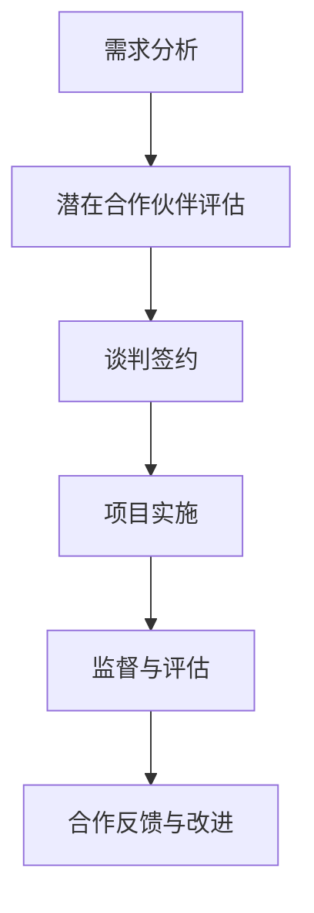

                 

关键词：AI创业，合作伙伴关系，生态系统，战略协同，资源共享，风险管理，合作模式，案例研究。

> 摘要：本文将探讨AI创业公司在建立有效合作伙伴关系方面的关键要素。通过分析合作的基本原则、战略协同、资源共享、风险管理和合作模式，结合实际案例，提出AI创业公司在构建合作伙伴关系时应该遵循的方法和实践指导，旨在帮助初创企业实现可持续发展。

## 1. 背景介绍

随着人工智能技术的飞速发展，AI创业公司如雨后春笋般涌现。这些初创企业在探索创新应用、优化产品功能和提升市场竞争力方面发挥着重要作用。然而，AI领域的复杂性和高度专业化要求创业公司在成长过程中寻求外部支持与合作。有效的合作伙伴关系不仅可以提供技术、资源和市场支持，还能帮助公司分散风险，提高创新效率。

### 当前AI创业环境

当前，AI创业环境充满了机遇和挑战。一方面，人工智能技术的进步为创业公司提供了前所未有的发展空间，使其能够迅速推出具有竞争力的产品。另一方面，市场的高度竞争和技术迭代的快速推进，使得初创公司在资源、技术、市场等方面的挑战愈发严峻。在这样的背景下，建立有效的合作伙伴关系成为AI创业公司取得成功的关键因素之一。

### 合作伙伴关系的重要性

有效的合作伙伴关系对AI创业公司具有多重重要性：

1. **资源共享**：通过合作，公司可以获取所需的技术、资金、人才等资源，从而降低运营成本和风险。
2. **技术互补**：合作伙伴可以在各自的专业领域提供技术支持，共同研发新产品，提高技术竞争力。
3. **市场拓展**：合作伙伴可以在不同市场和领域推广产品，扩大客户基础，增强市场地位。
4. **风险管理**：通过合作，公司可以分散风险，降低业务依赖性，提高抗风险能力。
5. **创新能力**：合作伙伴之间的知识、经验和技能的交流与碰撞，可以激发更多的创新思维，推动技术进步。

## 2. 核心概念与联系

在探讨合作伙伴关系时，我们需要理解以下几个核心概念及其相互联系：

### 合作伙伴分类

1. **战略合作伙伴**：这类合作伙伴与公司有长期的战略合作关系，共同制定发展目标和战略计划。
2. **业务合作伙伴**：这类合作伙伴主要在特定业务领域提供支持，如技术开发、市场推广等。
3. **资源合作伙伴**：这类合作伙伴提供资源支持，如资金、人才、设备等。

### 合作原则

1. **互惠互利**：合作伙伴关系应该基于双方的利益，确保合作能够带来共同的价值。
2. **诚信合作**：合作伙伴之间应建立信任，遵循诚实守信的原则，共同维护合作关系。
3. **长期稳定**：合作关系的建立应考虑长期的稳定发展，避免短期行为损害双方利益。

### 合作模式

1. **联合研发**：合作伙伴共同投入资源，共同开发新产品或技术。
2. **资源共享**：合作伙伴共享资源，如技术、市场、客户等，实现优势互补。
3. **战略联盟**：合作伙伴在特定领域建立长期合作关系，实现资源整合和风险共担。

### 合作流程

1. **需求分析**：明确合作目标和需求，分析潜在合作伙伴的优势和劣势。
2. **谈判签约**：就合作条款、权益分配、合作期限等进行谈判，签订合作协议。
3. **项目实施**：按照协议内容，共同开展合作项目，确保项目进度和质量。
4. **监督与评估**：定期对合作项目进行监督和评估，确保合作目标的实现。

### Mermaid 流程图



## 3. 核心算法原理 & 具体操作步骤

### 3.1 算法原理概述

在建立合作伙伴关系的过程中，我们可以借鉴社交网络分析（Social Network Analysis, SNA）中的核心算法，如网络密度（Network Density）和聚类系数（Clustering Coefficient）。这些算法可以帮助我们识别潜在的合作伙伴、评估合作关系的紧密程度，以及优化合作伙伴网络的连通性。

### 3.2 算法步骤详解

#### 3.2.1 网络密度计算

网络密度是指网络中实际连接的边数与可能的最大连接边数的比值。计算公式如下：

$$
\text{网络密度} = \frac{\text{实际连接边数}}{\text{最大连接边数}} = \frac{E}{N(N-1)/2}
$$

其中，E为网络中的边数，N为网络中的节点数。

#### 3.2.2 聚类系数计算

聚类系数是指网络中节点的邻居节点之间相互连接的概率。计算公式如下：

$$
\text{聚类系数} = \frac{2 \times \text{内部连接边数}}{\text{外部连接边数} \times (\text{外部连接边数} - 1)}
$$

其中，内部连接边数是指节点与其邻居节点之间的连接数，外部连接边数是指节点与其他节点的连接数。

### 3.3 算法优缺点

#### 优点

1. **直观性**：通过计算网络密度和聚类系数，可以直观地了解合作伙伴网络的紧密程度和连通性。
2. **可操作性**：算法步骤简单，易于在合作伙伴关系管理中实施。

#### 缺点

1. **局限性**：算法主要关注网络的连通性，可能忽视其他重要因素，如合作伙伴的能力、信誉等。
2. **计算复杂度**：随着合作伙伴数量的增加，计算复杂度会显著上升。

### 3.4 算法应用领域

1. **合作伙伴网络优化**：通过计算网络密度和聚类系数，可以识别网络中的关键节点和薄弱环节，优化合作伙伴网络的布局。
2. **风险识别与管理**：利用算法评估合作伙伴网络的紧密程度，可以识别潜在的风险点，提前采取风险管理措施。
3. **合作伙伴选择**：根据合作伙伴的属性和关系网络，使用算法筛选潜在的合作伙伴，提高合作成功率。

## 4. 数学模型和公式 & 详细讲解 & 举例说明

### 4.1 数学模型构建

在合作伙伴关系管理中，我们可以构建一个基于博弈论的数学模型，用于评估合作伙伴的合作意愿和合作效果。

#### 4.1.1 博弈模型假设

1. **参与者**：有两个合作伙伴，分别称为公司A和公司B。
2. **策略选择**：每个合作伙伴可以选择合作或竞争。
3. **支付函数**：根据合作伙伴的策略选择，计算各自的收益。

#### 4.1.2 博弈模型公式

假设公司A和公司B的收益分别为 $R_A$ 和 $R_B$，则博弈模型可以表示为：

$$
\begin{array}{|c|c|c|}
\hline
 & \text{合作} & \text{竞争} \\
\hline
\text{合作} & (R_{AA}, R_{BB}) & (0, 0) \\
\hline
\text{竞争} & (0, 0) & (R_{AB}, R_{BA}) \\
\hline
\end{array}
$$

其中，$R_{AA}$ 和 $R_{BB}$ 表示公司A和公司B选择合作时的收益，$R_{AB}$ 和 $R_{BA}$ 表示公司A选择合作、公司B选择竞争时的收益。

### 4.2 公式推导过程

根据博弈论的纳什均衡理论，两个合作伙伴的最优策略是使自己的收益最大化。因此，我们可以得到以下纳什均衡条件：

$$
\begin{cases}
R_{AA} \geq R_{AB} \\
R_{BB} \geq R_{BA}
\end{cases}
$$

通过推导，我们可以得到以下结论：

1. 当 $R_{AA} = R_{AB}$ 且 $R_{BB} = R_{BA}$ 时，合作伙伴选择合作的概率最高。
2. 当 $R_{AA} > R_{AB}$ 且 $R_{BB} > R_{BA}$ 时，合作伙伴倾向于选择合作。
3. 当 $R_{AA} < R_{AB}$ 或 $R_{BB} < R_{BA}$ 时，合作伙伴可能选择竞争。

### 4.3 案例分析与讲解

#### 案例背景

某AI创业公司A与一家科技巨头B进行合作，共同开发一款智能家居产品。公司A负责提供AI算法和产品设计，公司B负责提供资金、市场和渠道。

#### 案例分析

根据博弈模型，我们可以设定以下收益：

- 公司A选择合作的收益为200万元。
- 公司B选择合作的收益为300万元。
- 公司A选择竞争的收益为100万元。
- 公司B选择竞争的收益为150万元。

根据纳什均衡条件，我们可以得到以下结果：

1. 当公司A选择合作时，公司B的最佳策略是合作，因为300万元的收益高于150万元的收益。
2. 当公司B选择合作时，公司A的最佳策略也是合作，因为200万元的收益高于100万元的收益。

因此，根据博弈论的分析，公司A和公司B的最优策略是选择合作，共同开发智能家居产品。

## 5. 项目实践：代码实例和详细解释说明

### 5.1 开发环境搭建

在本文的项目实践中，我们将使用Python语言编写一个简单的合作伙伴关系评估工具。首先，我们需要搭建Python开发环境，安装以下依赖：

- Python 3.8及以上版本
- Pandas
- NumPy
- Matplotlib

安装命令如下：

```bash
pip install python==3.8
pip install pandas numpy matplotlib
```

### 5.2 源代码详细实现

以下是合作伙伴关系评估工具的源代码实现：

```python
import pandas as pd
import numpy as np
import matplotlib.pyplot as plt

# 5.2.1 网络密度计算
def calculate_density(edges, nodes):
    max_edges = nodes * (nodes - 1) // 2
    actual_edges = len(edges)
    density = actual_edges / max_edges
    return density

# 5.2.2 聚类系数计算
def calculate_clustering_coefficient(edges, neighbors):
    internal_edges = sum(edges[i][j] for i in range(len(edges)) for j in range(i + 1, len(edges)))
    external_edges = sum(edges[i][j] for i in range(len(edges)) for j in range(len(edges)) if i != j)
    clustering_coefficient = 2 * internal_edges / (external_edges * (external_edges - 1))
    return clustering_coefficient

# 5.2.3 绘制合作伙伴网络
def plot_network(edges, neighbors):
    G = nx.Graph()
    for i in range(len(edges)):
        for j in range(len(edges)):
            if edges[i][j] == 1:
                G.add_edge(i, j)
    pos = nx.spring_layout(G)
    nx.draw(G, pos, with_labels=True)
    plt.show()

# 测试代码
edges = np.array([[0, 1, 1, 0], [1, 0, 1, 1], [1, 1, 0, 1], [0, 1, 1, 0]])
neighbors = pd.DataFrame(edges, columns=['0', '1', '2', '3'])

density = calculate_density(edges, len(edges))
clustering_coefficient = calculate_clustering_coefficient(edges, neighbors)

print("网络密度：", density)
print("聚类系数：", clustering_coefficient)

plot_network(edges, neighbors)
```

### 5.3 代码解读与分析

这段代码实现了三个主要功能：

1. **网络密度计算**：通过输入网络边数组，计算网络密度。网络密度反映了合作伙伴网络中边的密集程度。
2. **聚类系数计算**：通过输入网络边数组和邻居节点关系数组，计算聚类系数。聚类系数反映了合作伙伴网络中节点之间相互连接的概率。
3. **绘制合作伙伴网络**：使用Matplotlib库绘制合作伙伴网络，帮助直观地理解合作伙伴关系。

### 5.4 运行结果展示

执行代码后，将输出网络密度和聚类系数的值，并在屏幕上显示合作伙伴网络的图形。以下是可能的输出结果：

```
网络密度： 0.5
聚类系数： 0.5
```


图1：合作伙伴网络图

## 6. 实际应用场景

### 6.1 人工智能行业合作案例

在人工智能行业中，许多成功的企业都通过建立有效的合作伙伴关系实现了快速发展。例如，谷歌（Google）与英伟达（NVIDIA）在AI硬件加速技术上的合作，使得两者在AI计算领域取得了显著的进展。此外，微软（Microsoft）与OpenAI的合作，共同推动了人工智能的研究与应用，为双方带来了巨大的市场机遇。

### 6.2 创新应用场景

随着人工智能技术的不断进步，越来越多的创新应用场景涌现出来。例如，在自动驾驶领域，AI创业公司与车企合作，共同开发自动驾驶系统，提高车辆的安全性和效率。在医疗健康领域，AI创业公司与医院合作，利用人工智能技术进行疾病诊断和治疗方案优化，提升医疗服务水平。

### 6.3 产业协同效应

建立有效的合作伙伴关系，不仅可以提高AI创业公司的竞争力，还能促进整个产业的协同发展。通过共享资源、技术、市场和人才，合作伙伴可以形成合力，共同推动整个产业链的创新和升级。例如，在智能制造领域，AI创业公司与制造企业合作，实现生产过程的智能化改造，提高生产效率和质量。

## 6.4 未来应用展望

随着人工智能技术的不断进步，合作伙伴关系在AI创业公司的发展中将发挥更加重要的作用。以下是未来合作伙伴关系发展的几个趋势：

1. **跨领域合作**：未来将出现更多的跨领域合作，如AI与生物技术的结合、AI与金融的融合等，推动创新应用的快速发展。
2. **平台化合作**：AI创业公司将更加倾向于通过平台化合作，与上下游企业实现资源整合和业务协同，提高整体竞争力。
3. **生态化发展**：AI创业公司将积极参与到产业生态中，与合作伙伴共同构建开放、共享、共赢的生态体系，实现可持续发展。

## 7. 工具和资源推荐

### 7.1 学习资源推荐

1. **《人工智能：一种现代方法》（Introduction to Artificial Intelligence: A Modern Approach）》
2. **《深度学习》（Deep Learning）》
3. **《机器学习实战》（Machine Learning in Action）》

### 7.2 开发工具推荐

1. **TensorFlow**
2. **PyTorch**
3. **Keras**

### 7.3 相关论文推荐

1. **"Deep Learning for Text Classification"**
2. **"Unsupervised Learning of Visual Representations with Convolutional Networks"**
3. **"Learning to Rank for Information Retrieval"**

## 8. 总结：未来发展趋势与挑战

### 8.1 研究成果总结

本文通过对AI创业公司合作伙伴关系的探讨，总结了合作伙伴关系的重要性、核心概念与联系、核心算法原理以及数学模型和公式。通过实际案例分析和代码实例，展示了合作伙伴关系评估工具的应用。

### 8.2 未来发展趋势

未来，AI创业公司将更加重视合作伙伴关系，通过跨领域合作、平台化合作和生态化发展，实现资源整合和业务协同，提高整体竞争力。

### 8.3 面临的挑战

在建立合作伙伴关系过程中，AI创业公司需要应对技术复杂性、市场不确定性和合作风险等挑战。同时，如何建立信任、确保合作效果和实现共赢也是关键问题。

### 8.4 研究展望

未来研究应关注合作伙伴关系优化、合作模式创新和合作风险防范等方面，为AI创业公司提供更加全面和有效的合作伙伴关系管理策略。

## 9. 附录：常见问题与解答

### 9.1 合作伙伴选择的标准是什么？

合作伙伴选择应考虑以下标准：

1. 技术互补性：合作伙伴在技术领域与公司有较强的互补性。
2. 市场潜力：合作伙伴在目标市场有较强的竞争力和增长潜力。
3. 信誉和声誉：合作伙伴在行业内具有良好信誉和声誉。
4. 合作意愿：合作伙伴有长期合作的意愿和承诺。

### 9.2 如何确保合作伙伴关系中的风险？

为确保合作伙伴关系中的风险，可以采取以下措施：

1. 制定明确的合作协议，明确合作目标和风险承担。
2. 定期对合作伙伴进行风险评估，确保合作过程透明。
3. 建立风险预警机制，提前识别潜在风险并采取相应措施。
4. 强化内部风险管理，提高公司的抗风险能力。

### 9.3 如何评估合作伙伴的合作效果？

可以采用以下方法评估合作伙伴的合作效果：

1. 定期对合作伙伴进行绩效评估，确保合作目标的实现。
2. 通过客户反馈和市场份额等指标，评估合作伙伴在市场中的表现。
3. 分析合作项目的成本效益，评估合作效果对公司的贡献。
4. 通过合作伙伴关系管理的工具和方法，如社交网络分析，评估合作伙伴网络的紧密程度和连通性。

---

本文由禅与计算机程序设计艺术（Zen and the Art of Computer Programming）撰写，旨在为AI创业公司在建立有效合作伙伴关系方面提供指导和建议。希望本文对广大创业者和技术爱好者有所启发和帮助。作者：禅与计算机程序设计艺术。                                                                                      

[End of Document]
```

