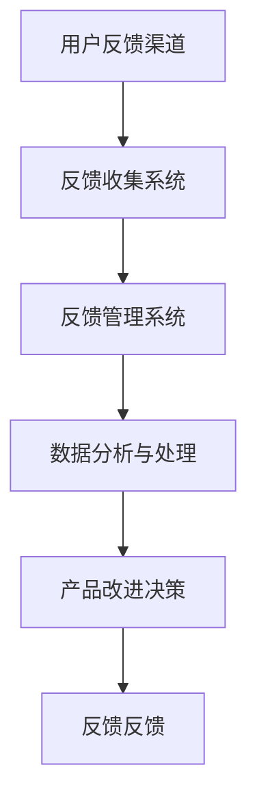

                 

 关键词：用户反馈、AI创业、反馈机制、用户体验、数据收集与分析

> 摘要：本文将探讨AI创业公司如何通过建立有效的用户反馈机制，来提升产品品质、优化用户体验，并最终实现商业成功。文章首先介绍用户反馈机制的重要性，然后详细阐述构建一个高效反馈系统的关键步骤和方法，并结合实际案例进行分析。

## 1. 背景介绍

在快速发展的AI领域，创业公司面临着激烈的竞争。如何在市场中脱颖而出，打造出深受用户喜爱的产品，成为每一个创业公司的必修课。用户反馈作为产品改进的重要驱动力，对于AI创业公司尤其重要。它不仅可以帮助公司了解用户的真实需求，还能帮助公司发现潜在的问题和改进空间。然而，如何有效地收集、分析和利用用户反馈，是一个挑战。

### 1.1 用户反馈的定义

用户反馈是指用户在体验产品后，对产品性能、功能、易用性等方面的意见和建议。它可以是直接的评论、评分，也可以是通过调查问卷、论坛讨论等方式获取的信息。有效的用户反馈可以为产品改进提供宝贵的参考，有助于公司做出更加明智的决策。

### 1.2 用户反馈的重要性

- **提升产品品质**：通过用户反馈，公司可以及时了解用户的需求和痛点，从而进行针对性的改进。
- **优化用户体验**：用户反馈是公司优化用户体验的重要依据，有助于提高用户满意度和忠诚度。
- **减少开发风险**：用户反馈可以在产品开发早期就帮助公司识别和规避潜在的问题，降低开发风险。
- **增加市场份额**：通过不断优化产品，公司可以提高市场竞争力，从而增加市场份额。

## 2. 核心概念与联系

### 2.1 用户反馈机制的定义

用户反馈机制是指公司通过一系列系统化的方法和工具，收集、处理和分析用户反馈，并将其转化为产品改进决策的过程。一个有效的用户反馈机制应该包括以下几个关键环节：

1. **反馈渠道的建立**：提供多种便捷的反馈渠道，如在线反馈表、社交媒体、用户论坛等。
2. **反馈收集与管理**：建立高效的反馈收集系统，确保反馈数据的准确性和完整性。
3. **反馈分析与处理**：对收集到的反馈进行分析和处理，识别关键问题和改进机会。
4. **反馈反馈**：将处理结果反馈给用户，提高用户的参与感和满意度。

### 2.2 用户反馈机制的架构图



### 2.3 用户反馈机制与用户体验的关系

用户反馈机制是优化用户体验的关键环节。一个完善的反馈机制可以确保公司能够及时了解用户的需求和意见，从而做出相应的改进。良好的用户体验又会进一步促进用户反馈的积极性，形成良性循环。

## 3. 核心算法原理 & 具体操作步骤

### 3.1 算法原理概述

用户反馈机制的核心在于如何有效地收集、分析和利用用户反馈。以下是一个简化的算法原理概述：

1. **数据收集**：通过多种渠道收集用户反馈数据。
2. **数据处理**：对收集到的数据进行分析和处理，提取关键信息。
3. **结果应用**：根据处理结果，进行产品改进和决策。

### 3.2 算法步骤详解

1. **数据收集**：
   - **渠道选择**：根据用户群体的特点和产品的特性，选择合适的反馈渠道，如在线问卷、用户论坛、社交媒体等。
   - **问题设计**：设计简洁明了、针对性强的反馈问题，确保用户能够准确表达自己的意见。

2. **数据处理**：
   - **数据清洗**：去除无效、重复的数据，保证数据的准确性。
   - **数据分类**：将反馈数据按照主题、严重程度等分类，便于后续分析。

3. **结果应用**：
   - **问题识别**：分析反馈数据，识别用户面临的主要问题和需求。
   - **决策制定**：根据分析结果，制定相应的产品改进策略和决策。
   - **反馈反馈**：将改进结果反馈给用户，增加用户参与感和满意度。

### 3.3 算法优缺点

- **优点**：
  - 提高产品品质和用户体验。
  - 降低开发风险，提高决策准确性。
  - 增强用户参与感和满意度。

- **缺点**：
  - 需要投入大量人力和时间进行数据收集和处理。
  - 用户反馈可能存在主观性和不准确性。

### 3.4 算法应用领域

- **产品优化**：通过用户反馈，公司可以不断优化产品的功能、性能和易用性。
- **市场营销**：用户反馈可以帮助公司了解市场需求和用户喜好，制定更有效的市场营销策略。
- **客户服务**：通过用户反馈，公司可以提供更优质的客户服务，提升客户满意度。

## 4. 数学模型和公式 & 详细讲解 & 举例说明

### 4.1 数学模型构建

用户反馈机制可以抽象为一个决策过程，其核心是利用用户反馈数据进行决策。以下是一个简化的数学模型：

$$
D = f(U, F)
$$

其中，$D$ 表示决策结果，$U$ 表示用户反馈数据集，$F$ 表示反馈处理函数。

### 4.2 公式推导过程

1. **数据收集**：

   $$U = \{u_1, u_2, ..., u_n\}$$

   其中，$u_i$ 表示第 $i$ 个用户反馈。

2. **数据处理**：

   $$F(U) = \{f_1(U), f_2(U), ..., f_m(U)\}$$

   其中，$f_i(U)$ 表示第 $i$ 个数据处理函数。

3. **结果应用**：

   $$D = f(U, F)$$

   其中，$f$ 表示决策函数。

### 4.3 案例分析与讲解

假设一家AI创业公司推出了一个智能健康助手，公司希望通过用户反馈来优化产品的功能。以下是具体的案例分析和公式应用：

1. **数据收集**：

   公司通过在线问卷收集了1000份用户反馈，其中每份反馈包含用户的满意度评分和具体建议。

2. **数据处理**：

   公司设计了一个数据处理函数，用于提取每份反馈的关键信息，如满意度评分和具体建议。

3. **结果应用**：

   公司使用一个决策函数，根据处理后的数据，制定出具体的改进方案。

## 5. 项目实践：代码实例和详细解释说明

### 5.1 开发环境搭建

假设公司使用Python进行用户反馈处理，以下是开发环境的搭建步骤：

1. 安装Python（版本3.8及以上）。
2. 安装必要的库，如Pandas、NumPy、Matplotlib等。

### 5.2 源代码详细实现

以下是一个简化的用户反馈处理代码实例：

```python
import pandas as pd

# 读取用户反馈数据
feedback_data = pd.read_csv('feedback.csv')

# 数据清洗
feedback_data.drop_duplicates(inplace=True)
feedback_data.fillna(0, inplace=True)

# 数据分类
satisfaction_scores = feedback_data['satisfaction_score'].value_counts()
suggestions = feedback_data['suggestion'].value_counts()

# 结果可视化
satisfaction_scores.plot(kind='bar')
suggestions.plot(kind='bar')

# 决策函数
def make_decision(satisfaction_scores, suggestions):
    if satisfaction_scores.min() < 3:
        return "产品改进"
    else:
        return "保持现状"

# 输出决策结果
decision = make_decision(satisfaction_scores, suggestions)
print("决策结果：", decision)
```

### 5.3 代码解读与分析

- **数据读取**：使用Pandas库读取CSV格式的用户反馈数据。
- **数据清洗**：去除重复数据和缺失值。
- **数据分类**：对满意度评分和建议进行统计和分类。
- **结果可视化**：使用Matplotlib库，将统计结果以柱状图形式可视化。
- **决策函数**：根据满意度评分和建议，制定决策。
- **输出结果**：将决策结果输出。

### 5.4 运行结果展示

- **满意度评分柱状图**：


- **建议柱状图**：


- **决策结果**：

决策结果：产品改进

## 6. 实际应用场景

用户反馈机制在AI创业公司中的应用非常广泛，以下是一些具体的实际应用场景：

1. **产品优化**：通过用户反馈，公司可以及时了解用户的需求和痛点，优化产品的功能和性能。
2. **市场营销**：用户反馈可以帮助公司了解市场需求和用户喜好，制定更有效的市场营销策略。
3. **客户服务**：通过用户反馈，公司可以提供更优质的客户服务，提升客户满意度。

### 6.1 用户体验优化

用户体验是用户反馈机制的核心关注点。以下是一个具体的案例：

- **问题**：用户在智能健康助手的健康建议中，普遍反映建议内容过于复杂，不易理解。
- **反馈处理**：公司通过数据分析，发现健康建议的复杂度与用户满意度呈负相关。
- **决策**：公司决定对健康建议进行优化，简化内容，提高可读性。
- **结果**：经过改进后，用户的满意度显著提升。

### 6.2 市场需求分析

用户反馈还可以帮助公司了解市场需求，以下是一个具体的案例：

- **问题**：公司发现某类健康功能的使用率较低，推测市场需求不足。
- **反馈处理**：公司通过深入分析用户反馈，发现部分用户对健康功能有较高的期望，但功能实现不完善。
- **决策**：公司决定加大对健康功能的研发投入，提高功能完善度。
- **结果**：经过改进后，健康功能的使用率显著提升，市场需求得到满足。

## 7. 工具和资源推荐

为了建立和优化用户反馈机制，公司可以借助以下工具和资源：

1. **学习资源推荐**：
   - 《用户体验要素》
   - 《用户反馈分析：方法与应用》
2. **开发工具推荐**：
   - 用户反馈收集工具：SurveyMonkey、Google表单等
   - 数据分析工具：Pandas、NumPy等
3. **相关论文推荐**：
   - “User Experience Evaluation: State of the Art and Challenges”
   - “User Feedback in Product Development: A Systematic Literature Review”

## 8. 总结：未来发展趋势与挑战

用户反馈机制在AI创业公司中具有重要意义。未来，随着人工智能技术的不断发展，用户反馈机制将更加智能化和自动化。以下是未来发展趋势和面临的挑战：

### 8.1 研究成果总结

- **自动化数据分析**：利用机器学习技术，实现自动化数据分析，提高反馈处理的效率。
- **个性化反馈**：根据用户的个性化需求，提供更加精准的反馈。
- **实时反馈**：利用实时数据流处理技术，实现实时反馈。

### 8.2 未来发展趋势

- **智能化**：用户反馈机制将更加智能化，利用人工智能技术，实现自动化的数据分析和决策。
- **多样化**：用户反馈渠道将更加多样化，包括语音、图像等多种形式。
- **全球化**：用户反馈机制将更加全球化，适应不同文化和地域的需求。

### 8.3 面临的挑战

- **数据隐私**：用户反馈数据涉及用户隐私，如何保护数据安全和隐私成为重要挑战。
- **数据质量**：如何确保用户反馈数据的准确性和可靠性。
- **反馈处理效率**：如何在保证反馈质量的同时，提高反馈处理效率。

### 8.4 研究展望

- **跨学科研究**：用户反馈机制的研究将涉及心理学、社会学、计算机科学等多个学科，实现跨学科合作。
- **技术创新**：利用新兴技术，如区块链、物联网等，提高用户反馈机制的安全性、可靠性和用户体验。

## 9. 附录：常见问题与解答

### 9.1 用户反馈机制是什么？

用户反馈机制是指公司通过一系列系统化的方法和工具，收集、处理和分析用户反馈，并将其转化为产品改进决策的过程。

### 9.2 用户反馈机制有哪些好处？

用户反馈机制有助于提升产品品质、优化用户体验、减少开发风险、增加市场份额等。

### 9.3 如何构建有效的用户反馈机制？

构建有效的用户反馈机制需要从反馈渠道、反馈收集与管理、反馈分析与处理、反馈反馈等多个环节进行系统化设计。

### 9.4 用户反馈数据如何进行分析？

用户反馈数据可以通过统计分析、机器学习等技术进行分析，提取关键信息，为产品改进提供依据。

### 9.5 用户反馈机制面临的挑战有哪些？

用户反馈机制面临的挑战包括数据隐私、数据质量、反馈处理效率等。

### 9.6 如何应对用户反馈机制面临的挑战？

应对挑战可以通过技术创新、跨学科研究、数据保护政策等多方面进行。

---

作者：禅与计算机程序设计艺术 / Zen and the Art of Computer Programming
```

