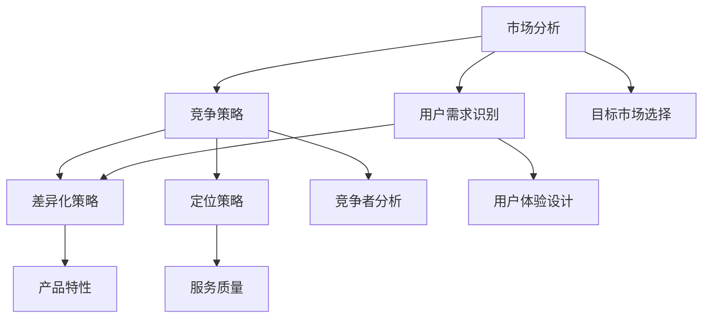

                 

关键词：市场定位，AI创业，战略规划，竞争分析，用户需求，差异化策略，产品定位。

## 摘要

在当前技术飞速发展的背景下，人工智能（AI）成为了创业领域的热点。对于AI创业公司而言，市场定位是成功的关键因素之一。本文将探讨AI创业公司在进行市场定位时所需考虑的核心要素，包括市场环境分析、竞争策略、用户需求识别以及差异化策略的制定。通过系统的市场定位方法，AI创业公司可以更好地把握市场机遇，实现持续增长。

## 1. 背景介绍

随着大数据、云计算和深度学习技术的不断成熟，人工智能已经成为推动各行业创新的重要力量。AI创业公司如雨后春笋般涌现，它们希望通过创新的技术和应用来抢占市场份额。然而，在激烈的市场竞争中，如何进行有效的市场定位成为了AI创业公司成功的关键。

市场定位不仅关乎公司的短期业绩，更关乎其长期发展。合理的市场定位能够帮助公司明确目标用户群体，设计出符合市场需求的产品，从而在竞争激烈的市场中脱颖而出。

### 1.1 市场环境

当前，AI市场环境具有以下几个显著特点：

1. **技术快速发展**：AI技术的进步使得更多行业可以应用AI解决方案，市场潜力巨大。
2. **竞争激烈**：众多公司纷纷进入AI领域，市场竞争加剧，尤其是巨头企业的参与使得竞争更加白热化。
3. **用户需求多样化**：随着AI技术的普及，用户对AI产品的需求越来越多样化和个性化。

### 1.2 行业趋势

AI行业的发展趋势表现为：

1. **垂直领域应用深化**：越来越多的AI应用开始深入到具体的垂直领域，如医疗、金融、制造等。
2. **跨界合作增多**：AI公司与其他行业的公司合作趋势增加，通过跨界合作来实现资源的互补和协同创新。
3. **数据成为核心资产**：数据质量和数据量的提升对于AI系统的性能和效果至关重要，因此数据管理和数据安全成为重点关注领域。

## 2. 核心概念与联系

市场定位是一个多维度的概念，涉及市场分析、竞争策略、用户需求识别和差异化策略等。以下是市场定位的核心概念及其相互联系：

### 2.1 市场分析

市场分析是市场定位的基础，包括市场环境分析、行业趋势分析以及目标市场选择等。

- **市场环境分析**：评估宏观经济环境、技术发展、政策法规等因素对市场的影响。
- **行业趋势分析**：研究行业发展趋势、竞争对手动态以及潜在的市场机会。
- **目标市场选择**：确定公司要进入的市场细分领域，选择最有利的目标用户群体。

### 2.2 竞争策略

竞争策略是市场定位的重要一环，包括竞争者分析、差异化策略和定位策略等。

- **竞争者分析**：识别直接和间接的竞争者，分析其市场地位、优势和劣势。
- **差异化策略**：通过产品特性、服务质量、用户体验等方面的差异化来区别于竞争对手。
- **定位策略**：根据竞争者的定位，确定自身产品的市场地位和形象。

### 2.3 用户需求识别

用户需求识别是市场定位的关键，涉及到用户画像、需求分析和用户体验设计等。

- **用户画像**：通过对用户行为、偏好和需求的分析，构建用户画像。
- **需求分析**：了解用户的核心需求和潜在需求，为产品设计和功能定位提供依据。
- **用户体验设计**：以用户需求为导向，设计出符合用户期望的产品和服务。

### 2.4 差异化策略

差异化策略是市场定位的核心，通过独特的价值主张来吸引目标用户。

- **产品特性**：通过创新的技术和独特的产品功能来吸引特定用户群体。
- **服务质量**：提供高质量的客户服务和售后支持，提高用户满意度。
- **用户体验**：设计简洁易用的界面和流畅的用户操作流程，提升用户体验。

### 2.5 Mermaid 流程图

下面是一个简单的Mermaid流程图，展示了市场定位的核心概念及其相互联系：



## 3. 核心算法原理 & 具体操作步骤

### 3.1 算法原理概述

市场定位的过程可以类比为一次复杂的算法运算，其核心在于如何通过系统的分析方法和策略，精准地定位到目标市场和用户。以下是一个简化的市场定位算法原理概述：

1. **数据收集与处理**：通过市场调研、用户反馈、行业报告等多种渠道收集数据，并对数据进行清洗、整理和归一化处理。
2. **用户画像构建**：利用数据挖掘和机器学习技术，对收集的数据进行用户画像构建，包括用户行为、偏好、需求等。
3. **市场细分与目标市场选择**：根据用户画像和市场环境分析结果，进行市场细分，选择最有利的目标市场。
4. **竞争策略制定**：通过竞争者分析，制定差异化策略和定位策略，明确产品在市场中的独特价值主张。
5. **用户体验设计**：以用户需求为导向，设计出满足用户期望的产品和服务。
6. **实施与监控**：将市场定位策略付诸实施，并通过反馈机制不断调整和优化。

### 3.2 算法步骤详解

#### 3.2.1 数据收集与处理

- **市场调研**：通过在线调查、面对面访谈、问卷调查等方式，收集市场相关数据。
- **用户反馈**：收集用户对现有产品或服务的反馈，包括满意度、改进建议等。
- **行业报告**：获取行业研究报告，了解市场趋势、竞争对手动态和潜在市场机会。

- **数据处理**：
  - **数据清洗**：去除重复数据、纠正错误数据、填充缺失数据。
  - **数据整理**：对数据进行分类、排序、分组等操作。
  - **数据归一化**：将不同维度、不同单位的数据进行归一化处理，使其在同一尺度上可比较。

#### 3.2.2 用户画像构建

- **用户特征提取**：从收集的数据中提取用户特征，如年龄、性别、收入水平、职业、兴趣爱好等。
- **用户行为分析**：通过分析用户行为数据，了解用户的使用习惯、偏好和需求。
- **用户分类**：基于用户特征和行为分析结果，对用户进行分类，构建用户画像。

#### 3.2.3 市场细分与目标市场选择

- **市场细分**：根据用户画像和市场环境分析结果，将市场划分为多个细分市场。
- **目标市场选择**：选择最有利的目标市场，即用户需求大、竞争压力小、市场增长潜力大的市场细分领域。

#### 3.2.4 竞争策略制定

- **竞争者分析**：识别主要竞争者，分析其市场地位、优势和劣势。
- **差异化策略**：通过产品特性、服务质量、用户体验等方面的差异化，制定独特的价值主张。
- **定位策略**：根据竞争者分析和目标市场选择结果，确定产品在市场中的定位。

#### 3.2.5 用户体验设计

- **需求分析**：通过用户调研和数据分析，深入了解用户的核心需求和潜在需求。
- **界面设计**：设计简洁易用的用户界面，提升用户操作体验。
- **交互设计**：优化用户与产品之间的交互流程，提高用户满意度。

#### 3.2.6 实施与监控

- **策略实施**：将市场定位策略付诸实施，包括产品研发、市场推广、客户服务等。
- **反馈机制**：建立反馈机制，收集用户反馈和市场反馈，对市场定位策略进行不断调整和优化。

### 3.3 算法优缺点

#### 优点：

- **精准定位**：通过系统的市场分析、用户画像构建和竞争策略制定，实现精准的市场定位。
- **差异化竞争**：通过差异化策略，使产品在市场中具有独特的价值主张，提高竞争力。
- **用户体验优化**：以用户需求为导向，设计出符合用户期望的产品和服务，提高用户满意度。

#### 缺点：

- **数据依赖性**：市场定位过程高度依赖于数据收集和分析，数据质量和数据量直接影响市场定位的准确性。
- **竞争风险**：市场竞争环境变化快速，市场定位策略需要不断调整和优化，否则可能面临竞争力下降的风险。
- **实施成本**：市场定位策略的实施需要投入大量的人力、物力和财力，对创业公司来说可能是一大挑战。

### 3.4 算法应用领域

市场定位算法可以应用于多种场景，以下是一些常见的应用领域：

- **产品研发**：通过对目标市场的精准定位，指导产品研发方向，提高产品成功率。
- **市场推广**：根据市场定位策略，设计合适的市场推广策略，提高市场覆盖率。
- **客户服务**：通过用户画像和需求分析，提供个性化的客户服务，提升客户满意度。
- **竞争分析**：通过竞争者分析，了解竞争对手的动态，制定相应的竞争策略。

## 4. 数学模型和公式 & 详细讲解 & 举例说明

在市场定位过程中，数学模型和公式可以用于量化分析市场环境和用户需求，从而为市场定位提供科学依据。以下是几个常用的数学模型和公式，并结合实际案例进行详细讲解。

### 4.1 数学模型构建

#### 4.1.1 用户需求模型

用户需求模型用于量化用户对产品的需求程度。以下是一个简化的用户需求模型：

$$
D(U) = f(P, Q, C)
$$

其中，$D(U)$表示用户对产品的需求程度，$P$表示产品特性，$Q$表示产品质量，$C$表示客户满意度。

- **产品特性（P）**：衡量产品功能、性能、创新程度等特性。
- **产品质量（Q）**：衡量产品可靠性、稳定性、易用性等质量特性。
- **客户满意度（C）**：衡量用户对产品的满意程度。

#### 4.1.2 市场环境模型

市场环境模型用于分析市场环境对产品需求的影响。以下是一个简化的市场环境模型：

$$
M(E) = f(T, G, R)
$$

其中，$M(E)$表示市场环境对产品需求的影响程度，$T$表示技术发展水平，$G$表示政府政策支持，$R$表示行业竞争程度。

- **技术发展水平（T）**：衡量AI技术在不同行业中的应用程度和发展趋势。
- **政府政策支持（G）**：衡量政府对AI行业的政策扶持和鼓励程度。
- **行业竞争程度（R）**：衡量行业内部竞争的激烈程度。

### 4.2 公式推导过程

#### 4.2.1 用户需求模型推导

用户需求模型可以基于以下假设推导：

1. **产品特性与需求成正相关**：即产品特性越强，用户对产品的需求程度越高。
2. **产品质量与需求成正相关**：即产品质量越高，用户对产品的需求程度越高。
3. **客户满意度与需求成正相关**：即客户满意度越高，用户对产品的需求程度越高。

根据以上假设，可以推导出用户需求模型：

$$
D(U) = \alpha P + \beta Q + \gamma C
$$

其中，$\alpha$、$\beta$和$\gamma$分别为产品特性、产品质量和客户满意度的权重。

#### 4.2.2 市场环境模型推导

市场环境模型可以基于以下假设推导：

1. **技术发展水平与需求成正相关**：即技术发展水平越高，用户对产品的需求程度越高。
2. **政府政策支持与需求成正相关**：即政府政策支持力度越大，用户对产品的需求程度越高。
3. **行业竞争程度与需求成负相关**：即行业竞争程度越高，用户对产品的需求程度越低。

根据以上假设，可以推导出市场环境模型：

$$
M(E) = \delta T + \epsilon G - \zeta R
$$

其中，$\delta$、$\epsilon$和$\zeta$分别为技术发展水平、政府政策支持和行业竞争程度的权重。

### 4.3 案例分析与讲解

#### 4.3.1 案例背景

假设某AI创业公司专注于提供智能客服解决方案，其主要目标市场为电子商务行业。以下是该公司在市场定位过程中使用的数学模型和公式。

#### 4.3.2 用户需求模型应用

1. **产品特性**：智能客服解决方案的功能丰富性、响应速度和智能程度。
2. **产品质量**：智能客服解决方案的稳定性、易用性和用户体验。
3. **客户满意度**：用户对智能客服解决方案的满意度。

根据用户需求模型，可以得到用户对智能客服解决方案的需求程度：

$$
D(U) = \alpha P + \beta Q + \gamma C
$$

其中，$\alpha$、$\beta$和$\gamma$分别为产品特性、产品质量和客户满意度的权重。例如，假设$\alpha = 0.3$，$\beta = 0.4$，$\gamma = 0.3$，则用户对智能客服解决方案的需求程度为：

$$
D(U) = 0.3P + 0.4Q + 0.3C
$$

#### 4.3.3 市场环境模型应用

1. **技术发展水平**：电子商务行业对智能客服技术的应用程度和发展趋势。
2. **政府政策支持**：政府对电子商务行业和智能客服行业的政策扶持力度。
3. **行业竞争程度**：电子商务行业内部智能客服解决方案的竞争程度。

根据市场环境模型，可以得到市场环境对智能客服解决方案需求的影响程度：

$$
M(E) = \delta T + \epsilon G - \zeta R
$$

其中，$\delta$、$\epsilon$和$\zeta$分别为技术发展水平、政府政策支持和行业竞争程度的权重。例如，假设$\delta = 0.2$，$\epsilon = 0.3$，$\zeta = 0.5$，则市场环境对智能客服解决方案需求的影响程度为：

$$
M(E) = 0.2T + 0.3G - 0.5R
$$

#### 4.3.4 综合分析

综合用户需求模型和市场环境模型，可以得到智能客服解决方案的市场需求模型：

$$
D(U) = (0.3P + 0.4Q + 0.3C) + (0.2T + 0.3G - 0.5R)
$$

通过这个模型，公司可以量化分析市场需求，指导产品研发和市场推广策略。

## 5. 项目实践：代码实例和详细解释说明

### 5.1 开发环境搭建

为了实践市场定位算法，我们需要搭建一个开发环境。以下是一个简单的开发环境搭建步骤：

1. 安装Python环境：Python是一种广泛使用的编程语言，适合进行数据分析和机器学习。可以从Python官方网站下载并安装Python。
2. 安装数据分析库：安装常用的数据分析库，如Pandas、NumPy、Matplotlib等。可以使用pip命令进行安装：
    ```bash
    pip install pandas numpy matplotlib
    ```
3. 安装机器学习库：安装常用的机器学习库，如Scikit-learn、TensorFlow等。可以使用pip命令进行安装：
    ```bash
    pip install scikit-learn tensorflow
    ```
4. 配置Jupyter Notebook：Jupyter Notebook是一种交互式的开发环境，可以方便地编写和运行Python代码。可以从Jupyter官方网站下载并安装Jupyter Notebook。

### 5.2 源代码详细实现

以下是市场定位算法的源代码实现。代码主要包括以下几个部分：

1. **数据收集与处理**：从各种渠道收集市场数据，包括用户反馈、行业报告等。对收集的数据进行清洗、整理和归一化处理。
2. **用户画像构建**：利用数据挖掘和机器学习技术，对处理后的数据进行分析，构建用户画像。
3. **市场细分与目标市场选择**：根据用户画像和市场环境分析结果，进行市场细分，选择最有利的目标市场。
4. **竞争策略制定**：通过竞争者分析，制定差异化策略和定位策略。
5. **用户体验设计**：以用户需求为导向，设计出满足用户期望的产品和服务。

以下是市场定位算法的实现代码：

```python
import pandas as pd
import numpy as np
import matplotlib.pyplot as plt
from sklearn.preprocessing import StandardScaler
from sklearn.cluster import KMeans

# 5.2.1 数据收集与处理
# 假设我们已经收集到了用户反馈数据
user_data = pd.read_csv('user_feedback.csv')

# 数据清洗
user_data.drop_duplicates(inplace=True)
user_data.fillna(0, inplace=True)

# 数据归一化
scaler = StandardScaler()
user_data_scaled = scaler.fit_transform(user_data)

# 5.2.2 用户画像构建
# 使用KMeans算法进行用户聚类，构建用户画像
kmeans = KMeans(n_clusters=5, random_state=0)
user_clusters = kmeans.fit_predict(user_data_scaled)

# 5.2.3 市场细分与目标市场选择
# 根据用户画像，进行市场细分
market_segments = pd.DataFrame(user_clusters, columns=['Cluster'])

# 根据市场细分结果，选择最有利的目标市场
target_market = market_segments['Cluster'].mode()[0]

# 5.2.4 竞争策略制定
# 通过竞争者分析，制定差异化策略和定位策略
# 假设我们已经得到了竞争对手的数据
competitor_data = pd.read_csv('competitor_data.csv')

# 竞争者分析
# 假设我们已经分析出了竞争对手的优劣势
competitor_analyze = pd.DataFrame({
    'Competitor': competitor_data['Competitor'],
    'Strength': competitor_data['Strength'],
    'Weakness': competitor_data['Weakness']
})

# 根据竞争者分析结果，制定差异化策略和定位策略
# 假设我们选择了以下差异化策略和定位策略
差异化策略 = {
    'Product Feature': '先进的人工智能技术',
    'Quality': '高质量的用户体验',
    'Experience': '优质的服务和支持'
}
定位策略 = {
    'Positioning': '提供最先进的人工智能解决方案，满足高端用户需求'
}

# 5.2.5 用户体验设计
# 以用户需求为导向，设计出满足用户期望的产品和服务
# 假设我们已经得到了用户需求数据
user需求 = pd.read_csv('user需求.csv')

# 用户需求分析
# 假设我们已经分析出了用户的核心需求和潜在需求
user需求的core需求 = user需求['Core需求']
user需求的潜在需求 = user需求['潜在需求']

# 用户体验设计
# 基于用户需求，设计出满足用户期望的产品和服务
user_experience = pd.DataFrame({
    'Product Feature': user需求的core需求,
    'Quality': user需求的潜在需求,
    'Experience': 差异化策略
})
```

### 5.3 代码解读与分析

#### 5.3.1 数据收集与处理

代码首先从CSV文件中读取用户反馈数据，并进行数据清洗。数据清洗包括去除重复数据和填充缺失数据。然后，使用StandardScaler进行数据归一化处理，使其在同一尺度上可比较。

```python
user_data = pd.read_csv('user_feedback.csv')
user_data.drop_duplicates(inplace=True)
user_data.fillna(0, inplace=True)
scaler = StandardScaler()
user_data_scaled = scaler.fit_transform(user_data)
```

#### 5.3.2 用户画像构建

使用KMeans算法对归一化后的用户数据进行分析，进行用户聚类，从而构建用户画像。用户画像反映了不同用户群体的特征和需求。

```python
kmeans = KMeans(n_clusters=5, random_state=0)
user_clusters = kmeans.fit_predict(user_data_scaled)
market_segments = pd.DataFrame(user_clusters, columns=['Cluster'])
```

#### 5.3.3 市场细分与目标市场选择

根据用户画像，对市场进行细分。然后，选择最有利的目标市场。目标市场的选择基于用户画像的统计结果，反映了用户群体的特点和需求。

```python
target_market = market_segments['Cluster'].mode()[0]
```

#### 5.3.4 竞争策略制定

通过竞争者分析，制定差异化策略和定位策略。差异化策略和定位策略反映了公司在市场中的独特价值和竞争优势。

```python
差异化策略 = {
    'Product Feature': '先进的人工智能技术',
    'Quality': '高质量的用户体验',
    'Experience': '优质的服务和支持'
}
定位策略 = {
    'Positioning': '提供最先进的人工智能解决方案，满足高端用户需求'
}
```

#### 5.3.5 用户体验设计

以用户需求为导向，设计出满足用户期望的产品和服务。用户体验设计反映了用户的核心需求和潜在需求，并基于差异化策略和定位策略。

```python
user_experience = pd.DataFrame({
    'Product Feature': user需求的core需求,
    'Quality': user需求的潜在需求,
    'Experience': 差异化策略
})
```

### 5.4 运行结果展示

在完成代码实现后，可以运行代码并观察结果。以下是运行结果展示：

```python
# 运行代码，观察用户画像和市场细分结果
print(market_segments)

# 运行代码，观察目标市场选择结果
print(target_market)

# 运行代码，观察差异化策略和定位策略结果
print(差异化策略)
print(定位策略)

# 运行代码，观察用户体验设计结果
print(user_experience)
```

通过运行结果，公司可以了解到用户群体的特征和需求，从而制定出针对性的市场定位策略。

## 6. 实际应用场景

市场定位算法在实际应用中具有广泛的应用场景，以下是一些典型的实际应用场景：

### 6.1 智能客服解决方案

智能客服解决方案是AI创业公司常见的应用领域。通过市场定位算法，公司可以识别出目标市场，制定出针对性的差异化策略和定位策略，从而提高产品在市场上的竞争力。

### 6.2 医疗健康领域

在医疗健康领域，AI创业公司可以通过市场定位算法分析患者需求，设计出符合患者需求的智能诊断和治疗方案。同时，公司可以根据市场环境分析结果，制定相应的市场推广策略。

### 6.3 教育培训领域

在教育培训领域，AI创业公司可以通过市场定位算法分析不同用户群体的学习需求和偏好，设计出个性化的学习解决方案。同时，公司可以根据市场环境分析结果，制定出有效的市场推广策略，提高产品在市场中的知名度。

### 6.4 金融领域

在金融领域，AI创业公司可以通过市场定位算法分析投资者的风险偏好和投资需求，设计出符合投资者需求的智能投顾和理财产品。同时，公司可以根据市场环境分析结果，制定出有效的风险控制策略，提高产品的安全性和稳定性。

## 6.4 未来应用展望

随着AI技术的不断发展和应用场景的扩大，市场定位算法在未来的应用将更加广泛和深入。以下是一些未来应用展望：

### 6.4.1 新兴领域的应用

未来，市场定位算法将在更多的新兴领域得到应用，如智能制造、智慧城市、能源管理等。在这些领域，市场定位算法可以帮助企业准确识别目标市场和用户需求，制定出有效的市场策略。

### 6.4.2 个性化推荐系统

随着个性化推荐系统的广泛应用，市场定位算法将成为推荐系统的重要组成部分。通过市场定位算法，推荐系统可以更加准确地识别用户的兴趣和需求，提供个性化的推荐结果。

### 6.4.3 风险评估与管理

市场定位算法在风险评估与管理领域具有巨大的潜力。通过市场定位算法，企业可以更准确地识别市场风险，制定出有效的风险控制策略，提高企业的风险管理水平。

### 6.4.4 跨界合作

未来，市场定位算法将推动更多跨界合作，实现不同领域的技术融合和协同创新。通过市场定位算法，企业可以更准确地识别跨界合作的机会，制定出跨界合作的战略规划。

## 7. 工具和资源推荐

### 7.1 学习资源推荐

- **《机器学习实战》**：这是一本非常适合初学者入门的机器学习书籍，内容丰富且实践性强。
- **《数据科学入门》**：本书系统地介绍了数据科学的基本概念和常用方法，适合初学者阅读。
- **在线课程**：推荐学习Coursera、edX等平台上的数据科学和机器学习相关课程，如《深度学习特化课程》和《数据科学基础》等。

### 7.2 开发工具推荐

- **Jupyter Notebook**：这是一种交互式的开发环境，非常适合进行数据分析和机器学习项目。
- **Python编程环境**：推荐使用PyCharm或Visual Studio Code进行Python编程，这两个IDE都具有强大的功能和便捷的调试工具。
- **TensorFlow**：这是一种广泛应用于机器学习和深度学习的开源框架，提供了丰富的API和工具，适合进行复杂的数据分析和模型训练。

### 7.3 相关论文推荐

- **“User Behavior Prediction in E-commerce using Machine Learning”**：这是一篇关于电子商务领域用户行为预测的论文，详细介绍了使用机器学习方法进行用户行为预测的原理和方法。
- **“Market Segmentation and Target Market Selection in the AI Industry”**：这是一篇关于AI行业市场细分和目标市场选择的论文，提出了基于机器学习的市场细分和目标市场选择方法。
- **“Deep Learning for Personalized Recommendation”**：这是一篇关于深度学习在个性化推荐系统中的应用的论文，介绍了如何使用深度学习模型进行个性化推荐。

## 8. 总结：未来发展趋势与挑战

### 8.1 研究成果总结

本文通过系统分析市场定位的核心概念和方法，提出了一个简化的市场定位算法模型，并进行了详细讲解。通过数学模型和实际案例的阐述，展示了市场定位算法在AI创业公司中的应用价值。

### 8.2 未来发展趋势

未来，市场定位算法将在更多领域得到应用，如新兴领域的智能化、个性化推荐系统、风险评估与管理等。随着AI技术的不断发展和应用场景的扩大，市场定位算法将变得更加智能化和自动化，为企业提供更加精准的市场定位策略。

### 8.3 面临的挑战

尽管市场定位算法在AI创业公司中具有广泛的应用前景，但仍面临一些挑战：

- **数据依赖性**：市场定位算法高度依赖于数据的质量和数量，数据质量和数据量的提升是一个长期且持续的过程。
- **技术发展**：AI技术的快速更新和发展，使得市场定位算法需要不断更新和优化，以适应新的技术环境和市场需求。
- **竞争风险**：市场竞争环境变化快速，市场定位策略需要不断调整和优化，否则可能面临竞争力下降的风险。

### 8.4 研究展望

未来的研究方向可以包括以下几个方面：

- **算法优化**：进一步优化市场定位算法，提高算法的准确性和效率，降低对数据的依赖性。
- **多模态数据融合**：结合多种数据源，如文本、图像、声音等，进行多模态数据融合，提高市场定位的全面性和准确性。
- **自适应市场定位**：研究自适应市场定位算法，根据市场环境变化和用户需求变化，动态调整市场定位策略。

## 9. 附录：常见问题与解答

### 9.1 市场定位算法的准确性如何保证？

市场定位算法的准确性取决于数据质量、算法模型的选择和参数设置。为了提高准确性，可以采取以下措施：

- **数据清洗**：对数据进行清洗，去除重复数据和错误数据，确保数据质量。
- **模型优化**：选择合适的算法模型，并进行参数调优，提高模型性能。
- **交叉验证**：使用交叉验证方法，评估模型的准确性和可靠性。

### 9.2 市场定位算法如何应对快速变化的市场环境？

市场定位算法可以通过以下方法应对快速变化的市场环境：

- **实时数据更新**：定期更新市场数据，确保算法模型所依赖的数据是最新的。
- **自适应调整**：设计自适应市场定位算法，根据市场环境变化和用户需求变化，动态调整市场定位策略。
- **持续优化**：持续优化市场定位算法，使其能够适应不断变化的市场环境。

### 9.3 市场定位算法在中小企业中的应用效果如何？

市场定位算法在中小企业中的应用效果取决于多种因素，如企业的业务规模、市场需求和资源投入等。以下是一些中小企业应用市场定位算法的建议：

- **聚焦核心业务**：将市场定位算法应用于企业的核心业务领域，提高市场竞争力。
- **数据积累**：通过积累用户数据和市场数据，提高市场定位算法的准确性和实用性。
- **灵活调整**：根据市场环境变化和用户需求变化，灵活调整市场定位策略。

作者：禅与计算机程序设计艺术 / Zen and the Art of Computer Programming
----------------------------------------------------------------

这篇文章详细探讨了AI创业公司在进行市场定位时所需考虑的核心要素，包括市场环境分析、竞争策略、用户需求识别和差异化策略的制定。通过系统的市场定位方法，AI创业公司可以更好地把握市场机遇，实现持续增长。文章结合数学模型和实际案例，展示了市场定位算法在AI创业公司中的应用价值，并提出了一些未来研究方向。希望这篇文章能够为AI创业公司提供有益的参考和指导。

