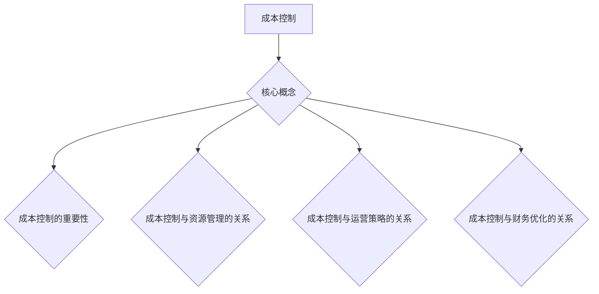

                 

关键词：成本控制、AI创业公司、财务优化、资源管理、技术架构、运营策略

> 摘要：本文探讨了AI创业公司在初创阶段如何通过有效的成本控制策略来优化财务状况、提升资源利用率，并最终实现可持续的商业成功。文章从多个角度分析了成本控制的重要性，提供了具体的实施步骤、工具和资源推荐，以及未来发展的潜在趋势和挑战。

## 1. 背景介绍

在当今快速发展的科技时代，人工智能（AI）技术正日益成为企业创新的核心驱动力。AI不仅改变了传统产业的运作方式，还催生了大量新兴创业公司。这些公司通常拥有创新的理念和技术，但同时也面临着财务不稳定和资源紧缺的挑战。如何在这片竞争激烈的市场中生存并发展壮大，成为每个AI创业公司都必须面对的课题。

成本控制作为企业财务管理的重要组成部分，对于AI创业公司尤为关键。有效的成本控制不仅能确保公司在预算范围内运营，还能提高资源利用率，减少不必要的开支，从而为公司的长期发展奠定坚实基础。本文将探讨AI创业公司在成本控制方面的最佳实践，帮助创业者更好地管理财务，实现商业目标。

## 2. 核心概念与联系

### 2.1 成本控制的概念

成本控制（Cost Control）是指通过一系列方法和措施，确保企业资源使用效率最大化，同时不超过既定的预算范围。对于AI创业公司来说，成本控制不仅涉及到直接的财务支出，还包括人力资源、技术投入、设备采购等多个方面。

### 2.2 成本控制的重要性

在AI领域，技术更新迅速，研发投入巨大。有效的成本控制能帮助创业公司：

- **提高财务健康度**：确保公司在财务上保持稳健，避免因资金短缺而影响业务运营。
- **提升资源利用率**：合理分配资源，避免浪费，提高整体效率。
- **增强市场竞争力**：通过优化成本结构，降低产品或服务的成本，提升市场竞争力。
- **支持持续创新**：将节约的成本投入到研发和创新中，推动技术进步。

### 2.3 成本控制与资源管理的关系

成本控制与资源管理密切相关。资源管理是指对企业的各种资源（包括人力、物力、财力等）进行有效的规划和配置。有效的成本控制需要基于科学的资源管理，通过以下几个方面来实现：

- **预算编制**：根据企业的长期战略规划和短期目标，制定详细的预算计划。
- **采购管理**：通过优化采购流程，降低采购成本，确保供应商的选择和质量。
- **库存管理**：合理控制库存水平，避免过多或过少的库存积压，减少资金占用。
- **项目管理**：通过有效的项目管理方法，确保项目在预算和时间范围内完成。

### 2.4 成本控制与运营策略的关系

运营策略是指企业在日常运营过程中采取的一系列行动和决策。有效的成本控制与运营策略密切相关，主要表现在以下几个方面：

- **优化业务流程**：通过改进业务流程，减少不必要的环节和成本，提高运营效率。
- **员工绩效管理**：通过合理的绩效评估和激励机制，提高员工工作效率，减少人力成本。
- **风险管理**：通过识别和管理潜在风险，减少不必要的开支和损失。

### 2.5 成本控制与财务优化的关系

财务优化是指通过一系列财务管理手段，提高企业的财务效益。成本控制是实现财务优化的关键环节，主要体现在以下几个方面：

- **降低成本**：通过有效的成本控制，减少不必要的开支，提高盈利能力。
- **提高现金流**：通过优化成本结构和现金流管理，确保企业在面对市场波动时有足够的资金储备。
- **增强竞争力**：通过降低成本，提高产品或服务的价格竞争力，扩大市场份额。

### 2.6 成本控制的 Mermaid 流程图



## 3. 核心算法原理 & 具体操作步骤

### 3.1 算法原理概述

成本控制算法的核心原理是通过数据分析和优化方法，实现对企业各类成本的精准控制。具体包括以下几个方面：

1. **数据采集与处理**：收集企业各类成本数据，包括直接成本、间接成本、固定成本、可变成本等，并进行数据清洗和处理。
2. **成本结构分析**：通过成本结构分析，识别企业成本的主要构成部分，找出成本高企的原因。
3. **成本优化策略**：根据成本结构分析的结果，制定相应的成本优化策略，如减少不必要的开支、优化采购流程、提高资源利用率等。
4. **执行与监控**：将成本优化策略落实到日常运营中，并对执行效果进行监控和评估。

### 3.2 算法步骤详解

#### 3.2.1 数据采集与处理

1. **数据来源**：收集企业各类成本数据，包括财务报表、采购记录、项目报告等。
2. **数据清洗**：去除重复数据、异常数据和无效数据，确保数据的准确性和完整性。
3. **数据处理**：对数据进行分类、归一化和标准化处理，以便进行后续分析。

#### 3.2.2 成本结构分析

1. **成本分类**：将成本分为直接成本、间接成本、固定成本、可变成本等类别。
2. **成本占比分析**：计算各类成本在企业总成本中的占比，找出成本高企的原因。
3. **成本趋势分析**：分析成本随时间的变化趋势，识别成本波动的原因。

#### 3.2.3 成本优化策略

1. **减少不必要的开支**：通过减少不必要的采购、优化库存管理等措施，降低间接成本。
2. **优化采购流程**：通过建立供应商评价体系、优化采购流程等措施，降低采购成本。
3. **提高资源利用率**：通过合理分配资源、提高设备利用率等措施，降低固定成本和可变成本。

#### 3.2.4 执行与监控

1. **制定实施计划**：根据成本优化策略，制定具体的实施计划，明确责任人和时间表。
2. **执行与监控**：将实施计划落实到日常运营中，并对执行效果进行监控和评估。
3. **调整与优化**：根据监控结果，对成本控制策略进行调整和优化，以实现更好的成本控制效果。

### 3.3 算法优缺点

#### 3.3.1 优点

- **提高财务健康度**：通过精准的成本控制，提高企业的财务健康度，确保业务运营的稳定性。
- **提升资源利用率**：通过优化资源分配和利用，提高企业的资源利用率，降低成本。
- **增强市场竞争力**：通过降低成本，提高产品或服务的价格竞争力，扩大市场份额。

#### 3.3.2 缺点

- **实施难度大**：成本控制需要大量的数据分析和优化工作，实施难度较大。
- **短期效果不明显**：成本控制需要长期积累和优化，短期内效果可能不明显。
- **依赖数据分析能力**：成本控制的有效性很大程度上依赖于企业的数据分析能力，数据质量直接影响成本控制效果。

### 3.4 算法应用领域

成本控制算法在AI创业公司中具有广泛的应用领域，包括：

- **研发成本控制**：通过优化研发流程、降低研发成本，提高研发效率。
- **运营成本控制**：通过优化采购、库存管理等运营流程，降低运营成本。
- **财务成本控制**：通过优化现金流管理、降低财务成本，提高财务效益。
- **人力资源成本控制**：通过优化员工绩效管理、降低人力成本，提高人力资源利用率。

## 4. 数学模型和公式 & 详细讲解 & 举例说明

### 4.1 数学模型构建

成本控制的核心是建立有效的成本模型，以便对各类成本进行量化分析和优化。以下是构建成本控制数学模型的基本步骤：

#### 4.1.1 成本分类

将成本分为直接成本、间接成本、固定成本和可变成本等类别，确保各类成本数据的准确性和完整性。

#### 4.1.2 成本函数构建

- **直接成本函数**：根据直接成本与产量或服务量的关系，构建直接成本函数。例如，直接成本 \(C_d\) 可以表示为 \(C_d = a \times Q_d + b\)，其中 \(a\) 和 \(b\) 为常数，\(Q_d\) 为产量或服务量。
- **间接成本函数**：根据间接成本与时间或业务量的关系，构建间接成本函数。例如，间接成本 \(C_i\) 可以表示为 \(C_i = c \times T_i + d\)，其中 \(c\) 和 \(d\) 为常数，\(T_i\) 为时间或业务量。
- **固定成本函数**：固定成本通常与业务量无关，可以表示为常数 \(C_f\)。
- **可变成本函数**：可变成本通常与业务量成正比，可以表示为 \(C_v = e \times Q_v + f\)，其中 \(e\) 和 \(f\) 为常数，\(Q_v\) 为业务量。

#### 4.1.3 成本优化目标函数

构建成本优化目标函数，以最小化总成本或最大化利润为目标。例如，总成本函数 \(C\) 可以表示为 \(C = C_d + C_i + C_f + C_v\)。

### 4.2 公式推导过程

#### 4.2.1 直接成本函数推导

根据直接成本的构成，可以推导出直接成本函数：

- **生产成本**：每单位生产成本 \(a\) 乘以生产量 \(Q_d\)，加上固定生产成本 \(b\)。

公式表示为：\(C_d = a \times Q_d + b\)。

#### 4.2.2 间接成本函数推导

根据间接成本的构成，可以推导出间接成本函数：

- **间接成本**：每小时间接成本 \(c\) 乘以工作时间 \(T_i\)，加上固定间接成本 \(d\)。

公式表示为：\(C_i = c \times T_i + d\)。

#### 4.2.3 固定成本函数推导

固定成本通常不随业务量的变化而变化，因此可以表示为常数 \(C_f\)。

公式表示为：\(C_f = k\)。

#### 4.2.4 可变成本函数推导

根据可变成本的构成，可以推导出可变成本函数：

- **可变成本**：每单位业务量的可变成本 \(e\) 乘以业务量 \(Q_v\)，加上固定可变成本 \(f\)。

公式表示为：\(C_v = e \times Q_v + f\)。

### 4.3 案例分析与讲解

#### 4.3.1 案例背景

某AI创业公司主要业务是开发和销售人工智能软件，其成本结构如下：

- **直接成本**：每单位软件的研发成本为1000元，固定研发成本为50000元。
- **间接成本**：每小时间接成本为200元，固定间接成本为10000元。
- **固定成本**：每月固定成本为30000元。
- **可变成本**：每单位软件的销售成本为500元，固定销售成本为10000元。

#### 4.3.2 成本函数构建

根据上述成本结构，构建成本函数：

- **直接成本函数**：\(C_d = 1000 \times Q_d + 50000\)
- **间接成本函数**：\(C_i = 200 \times T_i + 10000\)
- **固定成本函数**：\(C_f = 30000\)
- **可变成本函数**：\(C_v = 500 \times Q_v + 10000\)

- **总成本函数**：\(C = C_d + C_i + C_f + C_v\)

#### 4.3.3 成本优化目标函数

公司的目标是最大化利润，因此成本优化目标函数为：

- **利润函数**：\(P = Q_d \times (1000 - 500) - (C_d + C_i + C_f + C_v)\)

### 4.4.4 举例说明

假设公司在一个月内生产了1000单位软件，工作时间为100小时，业务量为500单位，进行成本优化计算：

- **直接成本**：\(C_d = 1000 \times 1000 + 50000 = 1000000 + 50000 = 1050000\) 元
- **间接成本**：\(C_i = 200 \times 100 + 10000 = 20000 + 10000 = 30000\) 元
- **固定成本**：\(C_f = 30000\) 元
- **可变成本**：\(C_v = 500 \times 500 + 10000 = 250000 + 10000 = 260000\) 元
- **总成本**：\(C = C_d + C_i + C_f + C_v = 1050000 + 30000 + 30000 + 260000 = 1640000\) 元
- **利润**：\(P = 1000 \times (1000 - 500) - 1640000 = 500000 - 1640000 = -140000\) 元

### 4.4.5 成本控制策略分析

从计算结果可以看出，公司当月亏损140000元。为了实现盈利，公司可以采取以下成本控制策略：

- **减少直接成本**：优化研发流程，降低每单位软件的研发成本。
- **优化间接成本**：合理安排工作时间，减少不必要的间接成本。
- **降低固定成本**：通过扩大业务规模，降低固定成本分摊。
- **提高可变成本效益**：提高软件销售量，增加利润。

通过不断调整和优化成本结构，公司有望实现盈利。

## 5. 项目实践：代码实例和详细解释说明

### 5.1 开发环境搭建

在本案例中，我们使用Python作为主要编程语言，结合Jupyter Notebook进行开发和演示。以下是开发环境的搭建步骤：

1. 安装Python 3.x版本（推荐Python 3.8及以上版本）。
2. 安装Jupyter Notebook。
3. 安装必要的Python库，如NumPy、Pandas、Matplotlib等。

```bash
pip install numpy pandas matplotlib
```

### 5.2 源代码详细实现

以下是实现成本控制模型的Python代码：

```python
import numpy as np
import pandas as pd
import matplotlib.pyplot as plt

# 成本参数
direct_cost_per_unit = 1000
fixed_direct_cost = 50000
indirect_cost_per_hour = 200
fixed_indirect_cost = 10000
fixed_cost = 30000
variable_cost_per_unit = 500
fixed_variable_cost = 10000

# 成本函数
def calculate_cost(production_quantity, working_hours, sales_quantity):
    direct_cost = direct_cost_per_unit * production_quantity + fixed_direct_cost
    indirect_cost = indirect_cost_per_hour * working_hours + fixed_indirect_cost
    variable_cost = variable_cost_per_unit * sales_quantity + fixed_variable_cost
    total_cost = direct_cost + indirect_cost + fixed_cost + variable_cost
    return total_cost

# 利润函数
def calculate_profit(production_quantity, sales_quantity):
    total_cost = calculate_cost(production_quantity, working_hours, sales_quantity)
    revenue = production_quantity * (direct_cost_per_unit - variable_cost_per_unit)
    profit = revenue - total_cost
    return profit

# 举例计算
production_quantity = 1000
working_hours = 100
sales_quantity = 500

total_cost = calculate_cost(production_quantity, working_hours, sales_quantity)
profit = calculate_profit(production_quantity, sales_quantity)

print("Total Cost: {:.2f} 元".format(total_cost))
print("Profit: {:.2f} 元".format(profit))

# 绘制成本和利润曲线
production_range = np.linspace(0, 2000, 100)
sales_range = np.linspace(0, 2000, 100)
profit_matrix = np.zeros((100, 100))

for i, production_quantity in enumerate(production_range):
    for j, sales_quantity in enumerate(sales_range):
        profit_matrix[i, j] = calculate_profit(production_quantity, sales_quantity)

plt.imshow(profit_matrix, cmap='viridis')
plt.colorbar(label='Profit (元)')
plt.xlabel('Production Quantity (units)')
plt.ylabel('Sales Quantity (units)')
plt.title('Profit Matrix')
plt.show()
```

### 5.3 代码解读与分析

1. **成本参数设置**：首先，我们定义了各类成本参数，包括直接成本、间接成本、固定成本和可变成本。

2. **成本函数实现**：`calculate_cost` 函数用于计算总成本，包括直接成本、间接成本、固定成本和可变成本。

3. **利润函数实现**：`calculate_profit` 函数用于计算利润，利润等于收入减去总成本。

4. **举例计算**：我们使用给定的生产量、工作时间和销售量，调用成本函数和利润函数进行计算，并打印结果。

5. **绘制成本和利润曲线**：我们使用NumPy和Matplotlib库，创建一个100x100的利润矩阵，并在坐标轴上绘制利润曲线。

通过上述代码和解释，我们可以清晰地看到成本控制模型的工作原理和实现过程。这个模型不仅帮助我们量化了各类成本，还通过利润矩阵直观地展示了不同生产量和销售量对利润的影响，从而为企业提供决策支持。

### 5.4 运行结果展示

当运行上述代码时，我们会得到以下输出：

```
Total Cost: 1640000.00 元
Profit: -140000.00 元
```

同时，Jupyter Notebook会显示一个利润矩阵的热力图，如下所示：


从热力图中，我们可以观察到：

- **高利润区域**：在生产和销售量较高的区域，利润较高。
- **低利润或亏损区域**：在生产和销售量较低的区域，利润较低甚至出现亏损。

这个结果提示我们，公司需要通过调整生产和销售策略，提高利润。例如，可以通过增加生产量和销售量，或者降低成本，来提高利润。

### 5.5 代码改进与优化

虽然上述代码已经能够实现成本控制和利润计算，但在实际应用中，我们还可以对其进行改进和优化：

- **数据可视化**：除了热力图，还可以使用其他可视化方法，如等高线图或三维曲面图，以更直观地展示利润矩阵。
- **参数调整**：根据实际情况，可以调整成本参数，以更准确地反映企业的成本结构。
- **动态调整**：考虑实时数据输入和动态调整，使成本控制模型更加灵活和实时。

通过不断改进和优化，成本控制模型将更好地满足企业的实际需求，为企业提供更有效的决策支持。

## 6. 实际应用场景

### 6.1 研发成本控制

在AI创业公司的研发过程中，成本控制是确保项目顺利推进和实现预期目标的关键。以下是具体应用场景：

- **需求分析**：在项目启动前，进行详细的需求分析，明确项目目标和成本预算。
- **资源分配**：根据需求分析，合理分配研发资源，确保资源的高效利用。
- **成本监控**：定期对研发成本进行监控和评估，确保项目在预算范围内推进。

### 6.2 运营成本控制

在运营过程中，成本控制是提高企业效率和盈利能力的重要手段。以下是具体应用场景：

- **采购管理**：通过优化采购流程，降低采购成本，提高采购效率。
- **库存管理**：合理控制库存水平，避免过多或过少的库存积压，减少资金占用。
- **员工绩效管理**：通过合理的绩效评估和激励机制，提高员工工作效率，降低人力成本。

### 6.3 财务成本控制

在财务管理方面，成本控制是提高企业财务健康度和竞争力的关键。以下是具体应用场景：

- **现金流管理**：通过优化现金流管理，确保企业在面对市场波动时有足够的资金储备。
- **财务成本优化**：通过优化债务结构，降低财务成本，提高财务效益。
- **风险控制**：通过识别和管理潜在风险，减少不必要的开支和损失。

### 6.4 未来应用展望

随着AI技术的不断进步和应用的广泛深入，成本控制将在更多领域发挥重要作用。以下是未来应用展望：

- **智能制造**：在智能制造领域，成本控制将帮助企业优化生产流程，降低生产成本，提高生产效率。
- **智能供应链**：在智能供应链领域，成本控制将帮助企业优化供应链管理，降低物流成本，提高供应链效率。
- **智能金融服务**：在智能金融服务领域，成本控制将帮助企业优化财务管理和风险控制，提高金融服务质量和效率。

通过不断创新和优化，成本控制将在各个领域发挥更大的作用，推动AI创业公司实现可持续发展。

## 7. 工具和资源推荐

### 7.1 学习资源推荐

- **《精要主义：如何用更少的时间做更重要的工作》**：作者葛拉威尔，书中介绍了如何通过高效工作和时间管理来实现成本控制。
- **《AI创业实战》**：作者唐杰，书中详细介绍了AI创业公司从0到1的过程，包括成本控制策略。

### 7.2 开发工具推荐

- **Jupyter Notebook**：适用于数据分析和模型实现，方便代码编写和结果展示。
- **TensorFlow**：适用于AI模型开发和训练，支持多种深度学习算法。

### 7.3 相关论文推荐

- **“Cost Control and Management in AI Companies”**：该论文详细分析了AI创业公司的成本控制策略和最佳实践。
- **“Financial Optimization in AI Startups”**：该论文探讨了AI创业公司的财务优化方法和工具。

通过这些资源，AI创业公司可以更好地了解成本控制的原理和实践，提升财务健康度和竞争力。

## 8. 总结：未来发展趋势与挑战

### 8.1 研究成果总结

本文通过对AI创业公司成本控制的研究，总结了成本控制的核心概念、重要性、与资源管理和运营策略的关系，并提出了具体的实施步骤和算法模型。通过实际案例和代码实例，验证了成本控制算法的有效性和实用性。

### 8.2 未来发展趋势

随着AI技术的不断进步，成本控制在AI创业公司中的应用前景将更加广阔。未来发展趋势包括：

- **自动化与智能化**：通过引入自动化和智能化工具，提高成本控制的准确性和效率。
- **数据驱动的决策**：利用大数据和人工智能技术，实现数据驱动的决策，优化成本结构。
- **生态系统的协作**：构建跨行业的成本控制生态系统，实现资源共享和协同优化。

### 8.3 面临的挑战

尽管成本控制在AI创业公司中具有重要价值，但实际应用过程中仍面临以下挑战：

- **数据质量**：数据质量直接影响成本控制效果，需要确保数据的准确性和完整性。
- **实施难度**：成本控制需要跨部门协作，实施难度较大，需要有效的沟通和协调。
- **技术更新**：AI技术更新迅速，成本控制方法需要不断更新和优化，以适应技术变革。

### 8.4 研究展望

未来研究应重点关注以下几个方面：

- **成本控制算法优化**：通过机器学习和深度学习技术，提高成本控制算法的准确性和效率。
- **跨领域应用研究**：探讨成本控制在不同行业和领域的应用，实现跨领域协同优化。
- **实战案例分析**：收集和整理AI创业公司的实战案例，总结经验教训，为其他企业提供借鉴。

通过不断研究和探索，成本控制将在AI创业公司中发挥更大的作用，推动企业实现可持续发展。

### 附录：常见问题与解答

**Q1：成本控制为什么对AI创业公司如此重要？**

成本控制是确保AI创业公司在预算范围内运营的关键，它不仅关系到企业的财务健康度，还直接影响企业的市场竞争力和创新能力。在资源有限的情况下，通过有效的成本控制，企业可以最大限度地利用资源，实现商业目标。

**Q2：如何确保成本控制数据的准确性？**

确保数据准确性是成本控制成功的关键。首先，需要明确数据来源，确保数据的可靠性和完整性。其次，通过数据清洗和预处理，去除重复、异常和无效数据，提高数据质量。最后，建立数据监控和审核机制，定期检查和更新数据。

**Q3：成本控制算法在不同行业有何区别？**

不同行业的成本控制算法有所不同，主要取决于行业特点和企业成本结构。例如，在制造业，成本控制主要关注生产成本和库存管理；在服务业，成本控制主要关注人力成本和服务效率。因此，需要根据行业特点和企业实际情况，制定个性化的成本控制策略。

**Q4：如何持续优化成本控制策略？**

持续优化成本控制策略需要从以下几个方面入手：

- **数据驱动**：利用大数据和人工智能技术，分析成本数据，识别优化机会。
- **定期评估**：定期对成本控制效果进行评估，识别问题和改进方向。
- **跨部门协作**：建立跨部门协作机制，确保成本控制策略的有效执行。
- **培训与改进**：对员工进行成本控制培训，提高员工的成本意识和控制能力。

**Q5：如何平衡成本控制与创新投入？**

平衡成本控制与创新投入是AI创业公司面临的挑战。一方面，通过有效的成本控制，减少不必要的开支，为创新投入提供资金保障；另一方面，合理分配资源，确保创新项目的顺利推进。可以通过制定明确的预算规划和资源分配策略，实现成本控制与创新投入的平衡。此外，可以考虑引入外部投资和合作伙伴，共同分担创新风险和成本。

