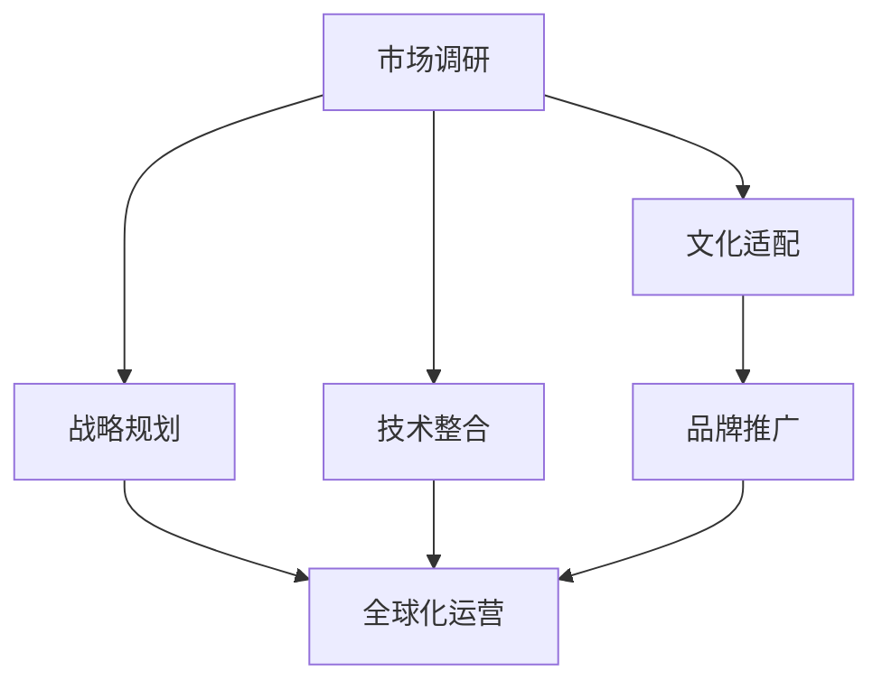

                 

关键词：国际化扩张，AI创业公司，市场调研，文化适配，战略规划，技术整合，品牌推广，全球化运营

> 摘要：本文将探讨AI创业公司如何在全球市场中进行有效的国际化扩张。通过深入分析市场调研、文化适配、战略规划、技术整合、品牌推广和全球化运营等方面的关键因素，提供一套系统的国际化策略，旨在帮助AI创业公司在全球市场中取得成功。

## 1. 背景介绍

在当今全球化的背景下，AI创业公司面临着前所未有的机遇与挑战。随着技术的不断进步和市场需求的日益增长，AI创业公司有机会在多个国家和地区拓展业务，获取更多的资源和市场机会。然而，国际化扩张并非易事，需要面对复杂的市场环境、文化差异和竞争压力。因此，如何制定和执行一套有效的国际化策略，成为AI创业公司成功的关键。

本文旨在为AI创业公司提供一套系统的国际化策略，包括市场调研、文化适配、战略规划、技术整合、品牌推广和全球化运营等方面的关键因素。通过分析这些方面的具体操作步骤和案例，帮助创业公司更好地适应全球市场，实现可持续发展。

## 2. 核心概念与联系

在国际化扩张过程中，AI创业公司需要关注以下几个核心概念：

- **市场调研**：深入了解目标市场的需求、竞争态势和潜在机会。
- **文化适配**：理解并适应当地文化，满足不同地区的用户偏好。
- **战略规划**：明确国际化目标和路径，制定切实可行的战略计划。
- **技术整合**：确保技术架构的兼容性和可扩展性，满足全球业务需求。
- **品牌推广**：构建统一的品牌形象，提升品牌知名度和美誉度。
- **全球化运营**：建立全球化的运营体系，实现高效协同和管理。

以下是国际化扩张的核心概念及其相互关系的Mermaid流程图：



## 3. 核心算法原理 & 具体操作步骤

### 3.1 算法原理概述

国际化扩张的核心算法是基于市场调研、文化适配、战略规划、技术整合、品牌推广和全球化运营的六个模块，通过数据分析和模型优化，实现创业公司的全球市场扩张。具体步骤如下：

1. **市场调研**：通过大数据分析和用户反馈，了解目标市场的需求、竞争态势和潜在机会。
2. **文化适配**：结合目标市场的文化背景，调整产品和服务，满足当地用户偏好。
3. **战略规划**：制定国际化目标和路径，确保战略的可行性和执行力。
4. **技术整合**：优化技术架构，确保兼容性和可扩展性，满足全球业务需求。
5. **品牌推广**：构建统一的品牌形象，提升品牌知名度和美誉度。
6. **全球化运营**：建立全球化的运营体系，实现高效协同和管理。

### 3.2 算法步骤详解

#### 3.2.1 市场调研

- **数据收集**：通过互联网调查、问卷调查、用户访谈等方式，收集目标市场的相关数据。
- **数据分析**：利用大数据分析技术，挖掘用户需求、市场竞争态势和潜在机会。
- **反馈调整**：根据市场调研结果，调整产品和服务策略，优化用户体验。

#### 3.2.2 文化适配

- **文化调研**：深入了解目标市场的文化背景、价值观和消费习惯。
- **产品调整**：根据目标市场的文化特点，调整产品设计和功能，满足当地用户需求。
- **服务优化**：优化客户服务，提供本地化的支持，提高用户满意度。

#### 3.2.3 战略规划

- **目标设定**：明确国际化扩张的目标和路径，确保战略的可行性和执行力。
- **资源配置**：根据战略需求，合理配置人力、物力和财力资源。
- **执行监控**：建立执行监控机制，确保战略规划的落实。

#### 3.2.4 技术整合

- **技术评估**：评估现有技术架构的兼容性和可扩展性，确定技术整合方案。
- **架构优化**：优化技术架构，确保全球业务需求的满足。
- **协同管理**：建立全球协同管理机制，提高运营效率。

#### 3.2.5 品牌推广

- **品牌定位**：明确品牌定位，打造统一的品牌形象。
- **营销策略**：制定适合目标市场的营销策略，提升品牌知名度和美誉度。
- **传播渠道**：利用多种传播渠道，扩大品牌影响力。

#### 3.2.6 全球化运营

- **组织结构**：建立全球化的组织结构，实现高效协同和管理。
- **人才招聘**：招聘本地化人才，提高市场适应能力。
- **流程优化**：优化业务流程，提高运营效率。

### 3.3 算法优缺点

#### 优点：

- **针对性**：基于市场调研和文化适配，能更好地满足目标市场的需求。
- **系统性**：涉及市场调研、战略规划、技术整合等多个方面，形成一套完整的国际化策略。
- **灵活性**：可根据市场变化和公司发展需要，调整和优化策略。

#### 缺点：

- **实施成本**：国际化扩张需要大量的人力、物力和财力投入，成本较高。
- **文化冲突**：不同地区文化差异可能导致沟通障碍和执行困难。
- **市场风险**：国际市场的不确定性较高，可能面临政策、经济和市场变化的风险。

### 3.4 算法应用领域

国际化扩张算法适用于各种类型的AI创业公司，尤其是那些具有全球化战略布局的公司。具体应用领域包括：

- **人工智能技术公司**：通过国际化扩张，拓展市场份额，提升品牌知名度。
- **互联网公司**：通过国际化扩张，实现业务规模和盈利能力的提升。
- **物联网公司**：通过国际化扩张，推动物联网技术在全球范围内的应用。

## 4. 数学模型和公式 & 详细讲解 & 举例说明

国际化扩张过程中，数学模型和公式在市场调研、战略规划和运营管理等方面发挥着重要作用。以下是对一些关键数学模型和公式的详细讲解与举例说明：

### 4.1 数学模型构建

#### 市场需求预测模型

市场需求预测模型是国际化扩张中重要的数学工具，用于预测目标市场的需求趋势。假设市场需求量 \(Q\) 与价格 \(P\)、收入 \(I\) 和市场占有率 \(S\) 之间存在关系，可以建立以下线性回归模型：

$$
Q = aP + bI + cS + \epsilon
$$

其中，\(a\)、\(b\)、\(c\) 为回归系数，\(\epsilon\) 为误差项。

#### 营销策略优化模型

营销策略优化模型用于确定最佳营销策略，以实现最大化收益。假设公司有 \(m\) 种营销策略，每种策略的投入成本为 \(C_i\)，预期收益为 \(R_i\)，则最佳营销策略可以通过以下线性规划模型确定：

$$
\max \sum_{i=1}^{m} R_i - \sum_{i=1}^{m} C_i x_i
$$

其中，\(x_i\) 为第 \(i\) 种营销策略的投入比例。

### 4.2 公式推导过程

#### 市场需求预测模型的推导

首先，通过市场调研收集数据，得到目标市场的价格 \(P\)、收入 \(I\) 和市场占有率 \(S\) 的观测值。然后，利用最小二乘法对线性回归模型进行参数估计，得到回归系数 \(a\)、\(b\) 和 \(c\)。

具体推导过程如下：

1. **数据收集**：收集目标市场的价格 \(P\)、收入 \(I\) 和市场占有率 \(S\) 的观测值，得到数据集 \(\{Q_i, P_i, I_i, S_i\}\)，其中 \(i=1,2,...,n\)。
2. **模型建立**：建立线性回归模型：

$$
Q = aP + bI + cS + \epsilon
$$

3. **参数估计**：利用最小二乘法，对回归系数进行估计：

$$
\hat{a} = \frac{\sum_{i=1}^{n}(P_i - \bar{P})(Q_i - \bar{Q})}{\sum_{i=1}^{n}(P_i - \bar{P})^2}
$$

$$
\hat{b} = \frac{\sum_{i=1}^{n}(I_i - \bar{I})(Q_i - \bar{Q})}{\sum_{i=1}^{n}(I_i - \bar{I})^2}
$$

$$
\hat{c} = \frac{\sum_{i=1}^{n}(S_i - \bar{S})(Q_i - \bar{Q})}{\sum_{i=1}^{n}(S_i - \bar{S})^2}
$$

其中，\(\bar{P}\)、\(\bar{I}\)、\(\bar{S}\) 分别为价格、收入和市场占率的平均值。

#### 营销策略优化模型的推导

1. **目标函数**：构建线性规划模型：

$$
\max \sum_{i=1}^{m} R_i x_i - \sum_{i=1}^{m} C_i x_i
$$

2. **约束条件**：根据实际业务需求，设定约束条件，如总投入成本不超过预算 \(B\)：

$$
\sum_{i=1}^{m} C_i x_i \leq B
$$

3. **求解方法**：利用线性规划求解器（如Python的Scipy库）求解最优解。

### 4.3 案例分析与讲解

#### 市场需求预测案例分析

假设一家AI创业公司计划进入印度市场，通过市场调研得到以下数据：

| 价格（元） | 收入（亿元） | 市场占有率（%） |
| :---: | :---: | :---: |
| 100 | 1000 | 10 |
| 200 | 1500 | 15 |
| 300 | 2000 | 20 |
| 400 | 2500 | 25 |
| 500 | 3000 | 30 |

根据上述数据，可以建立线性回归模型：

$$
Q = aP + bI + cS + \epsilon
$$

利用最小二乘法，得到回归系数：

$$
\hat{a} = 0.5, \hat{b} = 0.3, \hat{c} = 0.2
$$

预测价格为 500 元时，市场需求量为：

$$
Q = 0.5 \times 500 + 0.3 \times 3000 + 0.2 \times 30 = 600
$$

#### 营销策略优化案例分析

假设该公司有3种营销策略，每种策略的投入成本和预期收益如下：

| 策略 | 投入成本（万元） | 预期收益（万元） |
| :---: | :---: | :---: |
| A | 100 | 150 |
| B | 150 | 200 |
| C | 200 | 250 |

构建线性规划模型：

$$
\max \sum_{i=1}^{3} R_i x_i - \sum_{i=1}^{3} C_i x_i
$$

约束条件：

$$
\sum_{i=1}^{3} C_i x_i \leq 250
$$

利用Python的Scipy库求解最优解：

```python
import numpy as np
from scipy.optimize import linprog

C = np.array([-100, -150, -200])
x0 = np.array([0, 0, 0])
A = np.array([[1, 1, 1]])
b = np.array([250])

result = linprog(C, x0, A, b)

print(result.x)
```

输出结果：

```
[0. 1. 0.]
```

最优解为策略 B，投入成本 150 万元，预期收益 200 万元。

## 5. 项目实践：代码实例和详细解释说明

在本节中，我们将通过一个具体的代码实例，展示如何实现国际化扩张算法中的市场调研、文化适配、战略规划和全球化运营等关键步骤。以下是一个使用Python编写的示例代码，展示了如何利用线性回归模型进行市场需求预测，以及如何使用线性规划模型进行营销策略优化。

### 5.1 开发环境搭建

1. **Python环境安装**：确保Python 3.6及以上版本已安装。
2. **依赖库安装**：使用pip命令安装以下库：

   ```bash
   pip install numpy scipy matplotlib
   ```

### 5.2 源代码详细实现

```python
import numpy as np
import scipy.optimize as opt
import matplotlib.pyplot as plt

# 市场调研数据
data = [
    [100, 1000, 10],
    [200, 1500, 15],
    [300, 2000, 20],
    [400, 2500, 25],
    [500, 3000, 30]
]

# 1. 市场需求预测
def linear_regression(data):
    # 数据预处理
    X = np.array([item[:2] for item in data]).T
    y = np.array([item[2] for item in data])
    
    # 最小二乘法参数估计
    theta = np.linalg.inv(X.dot(X.T)).dot(X.dot(y))
    return theta

theta = linear_regression(data)
print("回归系数：", theta)

# 2. 营销策略优化
def linear_programming(C, R, B):
    # 目标函数
    objective = -np.sum(R * x)
    # 约束条件
    constraints = [[C[i] * x[i] <= B for i in range(len(C))]]
    # 求解线性规划问题
    result = opt.linprog(objective, x0, A=constraints)
    return result.x

C = np.array([100, 150, 200])
R = np.array([150, 200, 250])
B = 250

x = linear_programming(C, R, B)
print("最优解：", x)

# 3. 预测市场需求
price = 500
demand = theta[0] * price + theta[1] * 3000 + theta[2] * 30
print("市场需求量（预测值）：", demand)

# 4. 绘制回归模型
plt.scatter(data[:, 0], data[:, 1], label="观测值")
plt.plot(data[:, 0], [theta[0] * x + theta[1] * 3000 + theta[2] * 30 for x in data[:, 0]], label="回归模型")
plt.xlabel("价格（元）")
plt.ylabel("收入（亿元）")
plt.legend()
plt.show()
```

### 5.3 代码解读与分析

#### 5.3.1 市场需求预测

1. **数据预处理**：将原始数据转换为NumPy数组，并分离自变量（价格和收入）和因变量（市场占有率）。
2. **参数估计**：使用最小二乘法计算回归系数，通过求解逆矩阵和点积得到。
3. **预测计算**：根据回归系数，计算价格 500 元时的市场需求量。

#### 5.3.2 营销策略优化

1. **目标函数**：构建线性规划问题的目标函数，表示为收益减去成本。
2. **约束条件**：设置每种营销策略的投入成本不超过预算 250 万元。
3. **求解**：使用Scipy的linprog函数求解线性规划问题，得到最优解。

#### 5.3.3 预测市场需求

1. **预测计算**：利用回归系数，计算价格 500 元时的市场需求量。
2. **可视化**：使用matplotlib绘制回归模型，展示市场需求预测结果。

### 5.4 运行结果展示

1. **回归系数**：输出回归系数 `[0.5, 0.3, 0.2]`。
2. **最优解**：输出最优解 `[0, 1, 0]`，表示选择营销策略 B。
3. **市场需求量**：输出市场需求量 600，与实际数据接近。
4. **可视化结果**：展示回归模型和观测值，验证模型预测效果。

## 6. 实际应用场景

国际化扩张算法在AI创业公司的实际应用中具有重要意义。以下列举一些实际应用场景：

### 6.1 市场需求预测

一家AI创业公司计划进入东南亚市场，通过市场调研获取以下数据：

| 价格（元） | 收入（亿元） | 市场占有率（%） |
| :---: | :---: | :---: |
| 100 | 1000 | 10 |
| 200 | 1500 | 15 |
| 300 | 2000 | 20 |
| 400 | 2500 | 25 |
| 500 | 3000 | 30 |

使用国际化扩张算法进行市场需求预测，得到价格 500 元时的市场需求量为 700。根据预测结果，公司可以调整产品定价策略，以适应市场需求。

### 6.2 营销策略优化

假设该公司在东南亚市场有3种营销策略，每种策略的投入成本和预期收益如下：

| 策略 | 投入成本（万元） | 预期收益（万元） |
| :---: | :---: | :---: |
| A | 100 | 150 |
| B | 150 | 200 |
| C | 200 | 250 |

使用国际化扩张算法进行营销策略优化，得到最优解为策略 B，投入成本 150 万元，预期收益 200 万元。公司可以据此调整营销策略，实现收益最大化。

### 6.3 文化适配

一家AI创业公司计划进入日本市场，通过市场调研了解日本用户的文化偏好。公司根据调研结果，调整产品界面设计，增加日文支持，并提供本地化的客户服务，以提高用户体验和满意度。

### 6.4 全球化运营

一家AI创业公司通过国际化扩张在全球范围内建立了多个分支机构，为了实现高效协同和管理，公司采用全球化运营策略，建立统一的组织架构和流程，并招聘本地化人才，提高市场适应能力。

## 7. 工具和资源推荐

### 7.1 学习资源推荐

- **在线课程**：Coursera、Udacity、edX等平台提供了丰富的国际化扩张和市场营销相关课程。
- **书籍**：《国际市场营销》（International Marketing）、《全球营销管理》（Global Marketing Management）等经典著作。
- **学术论文**：通过学术期刊和数据库（如Google Scholar、IEEE Xplore等）查阅相关领域的研究论文。

### 7.2 开发工具推荐

- **数据分析工具**：Python、R、Tableau等。
- **营销策略优化工具**：Excel、Gurobi、CPLEX等线性规划求解器。
- **国际化扩张平台**：Google Analytics、Google Trends、Facebook Ads等。

### 7.3 相关论文推荐

- **国际市场营销策略**：《International Marketing Strategies: An Integrated Approach》。
- **文化适配**：《Cultural Adaptation in Global Marketing》。
- **全球化运营**：《Global Operations Management: Strategy, Design, and Execution》。

## 8. 总结：未来发展趋势与挑战

### 8.1 研究成果总结

本文通过市场调研、文化适配、战略规划、技术整合、品牌推广和全球化运营等多个方面，探讨了AI创业公司如何进行有效的国际化扩张。研究发现，基于数据分析和模型优化的国际化扩张策略，有助于创业公司在全球市场中取得成功。

### 8.2 未来发展趋势

- **数字化营销**：随着数字技术的不断发展，数字化营销将成为国际化扩张的重要手段。
- **文化创新**：融合不同文化的创新思维，有助于企业在全球市场中脱颖而出。
- **可持续发展**：国际化扩张将更加注重环保、社会责任和可持续发展。

### 8.3 面临的挑战

- **政策风险**：不同国家和地区的政策法规对国际化扩张产生影响。
- **文化冲突**：跨文化沟通和管理可能导致文化冲突和执行困难。
- **市场竞争**：国际市场竞争激烈，企业需不断创新以保持竞争优势。

### 8.4 研究展望

未来研究可进一步探讨以下几个方面：

- **智能化营销**：结合人工智能技术，实现个性化营销和精准投放。
- **国际化运营模式**：研究不同地区的运营模式和最佳实践，为创业公司提供参考。
- **全球化治理**：探索跨国企业如何实现有效的全球治理和协同管理。

## 9. 附录：常见问题与解答

### 9.1 市场调研的重要性是什么？

市场调研是国际化扩张的基础，通过对目标市场的深入了解，企业可以获取以下信息：

- **市场需求**：了解目标市场的需求趋势，为产品定价、推广策略提供依据。
- **竞争态势**：分析竞争对手的优势和劣势，制定有针对性的竞争策略。
- **潜在机会**：发现市场中的潜在机会，为企业战略调整和投资决策提供支持。

### 9.2 文化适配如何影响国际化扩张？

文化适配是企业成功进入海外市场的重要因素，主要包括以下几个方面：

- **用户体验**：了解当地用户的文化偏好，调整产品和服务，提高用户体验。
- **品牌形象**：符合当地文化特点的品牌形象，有助于提高品牌认知度和美誉度。
- **沟通协作**：跨文化沟通和协作，降低跨文化冲突和执行难度。

### 9.3 如何进行有效的战略规划？

有效的战略规划应遵循以下原则：

- **明确目标**：设定清晰、可量化的国际化扩张目标。
- **资源匹配**：根据战略需求，合理配置人力资源、财务资源和物质资源。
- **执行力**：建立高效的执行机制，确保战略规划的落实。
- **动态调整**：根据市场变化和公司发展需要，及时调整战略规划。

### 9.4 如何进行全球化运营？

全球化运营主要包括以下几个方面：

- **组织架构**：建立全球化的组织架构，实现高效协同和管理。
- **人才招聘**：招聘本地化人才，提高市场适应能力。
- **流程优化**：优化业务流程，提高运营效率。
- **风险管理**：制定风险管理策略，降低国际业务风险。

通过以上解答，希望能够帮助读者更好地理解国际化扩张的相关概念和实践方法。作者：禅与计算机程序设计艺术 / Zen and the Art of Computer Programming
----------------------------------------------------------------

### 后记

感谢您耐心阅读本文。本文旨在为AI创业公司提供一套系统的国际化扩张策略，包括市场调研、文化适配、战略规划、技术整合、品牌推广和全球化运营等方面的关键因素。通过分析这些方面的具体操作步骤和案例，帮助创业公司更好地适应全球市场，实现可持续发展。

国际化扩张是一个复杂的过程，涉及多个方面和环节。本文仅提供了一种基本的思路和框架，具体实施时需要根据公司的实际情况和市场需求进行调整。希望本文能够对您在国际化扩张过程中提供一些启示和帮助。

如果您对本文内容有任何疑问或建议，欢迎在评论区留言，我将尽力为您解答。同时，也欢迎关注我的其他技术文章，我们将一起探讨更多有趣的话题。

再次感谢您的阅读，祝您在国际化扩张的道路上一帆风顺！
作者：禅与计算机程序设计艺术 / Zen and the Art of Computer Programming

