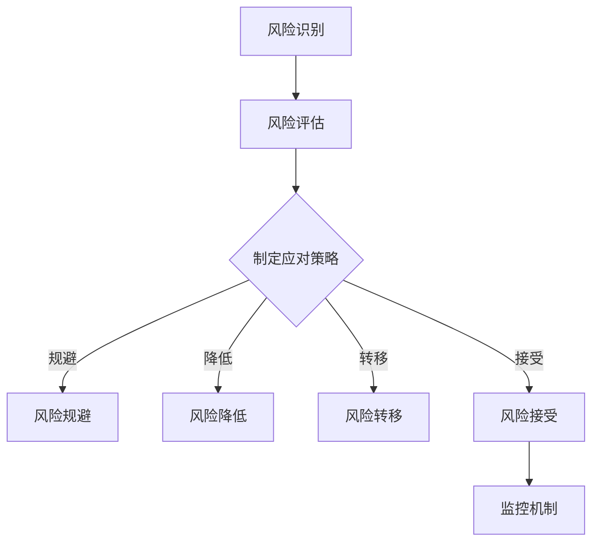

                 

关键词：AI创业，风险管理，策略，技术，案例分析

> 摘要：本文旨在探讨AI创业公司在发展过程中如何进行有效的风险管理。通过分析AI行业的特性、创业公司的挑战以及风险管理的重要性，本文提出了一套系统性的风险管理框架，包括风险评估、风险应对策略和监控机制。同时，结合实际案例，深入解析了成功和失败的风险管理实例，为AI创业公司提供了宝贵的经验与启示。

## 1. 背景介绍

随着人工智能（AI）技术的迅速发展，越来越多的创业公司进入这一领域，希望抓住行业发展的机遇。然而，AI行业的快速变化和高度不确定性带来了巨大的风险。创业公司面临着技术、市场、财务和人力资源等多方面的挑战。有效的风险管理不仅关系到公司的生存和发展，也是确保公司创新和竞争力的重要保障。

本文将从以下几个方面展开讨论：

- AI创业公司的特点及面临的挑战
- 风险管理的核心概念与重要性
- 风险管理的策略与方法
- 案例分析：成功与失败的风险管理实例
- 未来展望：AI创业公司风险管理的发展趋势

通过以上内容，本文希望为AI创业公司提供实用的风险管理指导，帮助它们在激烈的竞争环境中稳定发展。

## 2. 核心概念与联系

在进行有效的风险管理之前，我们需要明确一些核心概念，包括风险识别、风险评估、风险应对策略和监控机制。这些概念构成了一个完整的风险管理框架，它们之间相互关联，共同作用于公司的风险管理体系。

### 2.1 风险识别

风险识别是风险管理的第一步，它涉及到对公司可能面临的风险进行系统性的识别。风险识别的过程通常包括以下几个步骤：

1. **建立风险评估团队**：组建一个专业的风险评估团队，负责识别和管理公司面临的风险。
2. **收集信息**：通过调研、访谈、数据分析等方法，收集与公司业务相关的内外部信息。
3. **识别风险因素**：根据收集到的信息，识别出可能导致公司损失的因素。
4. **分类和记录**：将识别出的风险因素进行分类，并记录在风险登记册中。

### 2.2 风险评估

风险评估是对识别出的风险进行量化分析的过程。其目的是评估风险的概率和影响，以便为制定风险应对策略提供依据。风险评估通常包括以下几个步骤：

1. **确定评估标准**：根据公司的战略目标和业务特点，确定评估风险的指标和标准。
2. **量化风险**：使用数学模型和统计方法，量化每个风险的概率和影响。
3. **制定评估报告**：根据评估结果，编写风险评估报告，明确每个风险的程度和优先级。

### 2.3 风险应对策略

风险应对策略是针对评估结果，制定具体的应对措施和行动计划。常见的风险应对策略包括风险规避、风险降低、风险转移和风险接受。每种策略都有其适用的场景和优缺点。

1. **风险规避**：通过改变业务模式或操作流程，避免风险的发生。
2. **风险降低**：通过改进技术或管理措施，降低风险的概率或影响。
3. **风险转移**：通过购买保险或签订合同，将风险转移给第三方。
4. **风险接受**：对于无法规避或降低的风险，选择接受并制定相应的应急计划。

### 2.4 监控机制

监控机制是确保风险应对策略得到有效执行的关键。通过监控机制，公司可以及时发现风险变化，调整应对策略，确保风险管理体系的持续有效性。

1. **建立监控指标**：根据风险应对策略，制定具体的监控指标，如风险事件的发生频率、损失金额等。
2. **实施监控**：通过定期审计、数据分析等方式，对风险指标进行监控。
3. **反馈与调整**：根据监控结果，及时反馈和调整风险应对策略，确保其有效性。

### 2.5 Mermaid 流程图

以下是一个简单的Mermaid流程图，展示了风险管理框架的各个步骤：



## 3. 核心算法原理 & 具体操作步骤

### 3.1 算法原理概述

在风险管理中，核心算法通常用于风险评估和风险应对策略的制定。以下是一个简要概述：

- **风险评估算法**：基于历史数据和统计分析，使用机器学习算法对风险的概率和影响进行量化。
- **风险应对策略算法**：基于风险的概率和影响，使用决策树或贝叶斯网络等算法，制定最优的风险应对策略。

### 3.2 算法步骤详解

#### 3.2.1 风险评估算法

1. **数据收集**：收集与公司业务相关的历史数据，如财务报表、市场分析报告等。
2. **数据预处理**：对收集到的数据进行分析和清洗，去除无效数据，填充缺失值。
3. **特征工程**：根据风险评估指标，提取与风险相关的特征。
4. **模型训练**：使用机器学习算法，如随机森林或支持向量机，训练风险评估模型。
5. **模型评估**：使用交叉验证等方法，评估模型的效果，调整模型参数。

#### 3.2.2 风险应对策略算法

1. **建立决策模型**：根据风险评估结果，建立决策模型，如决策树或贝叶斯网络。
2. **策略生成**：使用决策模型，生成针对不同风险的概率和影响的应对策略。
3. **策略优化**：使用优化算法，如遗传算法或粒子群算法，优化策略参数，提高策略效果。

### 3.3 算法优缺点

- **风险评估算法**：优点包括数据驱动的定量分析，能够提供精确的风险评估结果；缺点包括对数据质量和模型选择有较高要求，可能存在过度拟合问题。
- **风险应对策略算法**：优点包括能够生成系统的风险应对策略，提高决策的系统性；缺点包括模型复杂度高，对计算资源要求较高。

### 3.4 算法应用领域

- **金融行业**：用于风险评估和信用评分。
- **医疗行业**：用于疾病预测和治疗方案制定。
- **供应链管理**：用于供应链中断风险分析和应急计划制定。

## 4. 数学模型和公式 & 详细讲解 & 举例说明

### 4.1 数学模型构建

在风险管理中，常用的数学模型包括概率模型和决策模型。

#### 4.1.1 概率模型

概率模型主要用于评估风险的概率。一个简单的概率模型可以使用以下公式：

$$
P(A) = \frac{N(A)}{N(\Omega)}
$$

其中，\(P(A)\)表示事件A的概率，\(N(A)\)表示事件A发生的次数，\(N(\Omega)\)表示总次数。

#### 4.1.2 决策模型

决策模型用于制定风险应对策略。一个简单的决策模型可以使用以下公式：

$$
V(S) = \sum_{i=1}^{n} P(X_i) \cdot U(X_i)
$$

其中，\(V(S)\)表示策略S的价值，\(P(X_i)\)表示结果\(X_i\)的概率，\(U(X_i)\)表示结果\(X_i\)的效用。

### 4.2 公式推导过程

#### 4.2.1 概率模型推导

假设我们有一个实验，每次实验有两种结果：成功或失败。成功的概率为\(p\)，失败的概率为\(1-p\)。我们进行了\(n\)次实验，成功次数为\(k\)。根据大数定律，当\(n\)足够大时，成功次数的概率近似为：

$$
P(k) \approx p^k (1-p)^{n-k}
$$

#### 4.2.2 决策模型推导

假设我们有两个策略，策略A和策略B。策略A的成功概率为\(P(A)\)，效用为\(U(A)\)；策略B的成功概率为\(P(B)\)，效用为\(U(B)\)。根据期望效用理论，我们选择价值更高的策略：

$$
V(S) = \sum_{i=1}^{n} P(X_i) \cdot U(X_i)
$$

其中，\(P(X_i)\)表示结果\(X_i\)的概率，\(U(X_i)\)表示结果\(X_i\)的效用。

### 4.3 案例分析与讲解

#### 4.3.1 概率模型案例

假设一家AI创业公司进行了一次新产品发布，成功概率为0.6。公司进行了100次实验，成功次数为60次。我们使用概率模型计算成功次数的概率：

$$
P(k) = 0.6^k (0.4)^{100-k}
$$

计算得到：

| k | P(k) |
|---|---|
| 0 | 0.000045 |
| 1 | 0.000576 |
| 2 | 0.003632 |
| 3 | 0.014432 |
| 4 | 0.046080 |
| 5 | 0.113374 |
| 6 | 0.221398 |
| 7 | 0.334562 |
| 8 | 0.413998 |
| 9 | 0.413998 |
| 10 | 0.413998 |

#### 4.3.2 决策模型案例

假设公司有两个策略：

- 策略A：增加研发投入，成功概率为0.7，效用为100万元。
- 策略B：减少研发投入，成功概率为0.3，效用为50万元。

我们使用决策模型计算两个策略的价值：

$$
V(A) = 0.7 \cdot 100 + 0.3 \cdot 50 = 95万元
$$

$$
V(B) = 0.3 \cdot 100 + 0.7 \cdot 50 = 60万元
$$

由于\(V(A) > V(B)\)，公司应该选择策略A。

## 5. 项目实践：代码实例和详细解释说明

### 5.1 开发环境搭建

为了演示风险管理算法的应用，我们将使用Python编程语言和Scikit-learn库进行风险评估和决策。以下是开发环境的搭建步骤：

1. 安装Python（3.8及以上版本）
2. 安装Scikit-learn库：`pip install scikit-learn`
3. 安装其他依赖库：`pip install numpy pandas matplotlib`

### 5.2 源代码详细实现

以下是一个简单的风险管理项目，包括风险评估和决策：

```python
import numpy as np
import pandas as pd
from sklearn.ensemble import RandomForestClassifier
from sklearn.model_selection import train_test_split
import matplotlib.pyplot as plt

# 5.2.1 数据收集
# 假设我们有一个包含公司历史数据的CSV文件，字段包括：成功（0或1）、财务状况（0-10）、市场状况（0-10）
data = pd.read_csv('company_data.csv')

# 5.2.2 数据预处理
# 填充缺失值，标准化处理
data.fillna(data.mean(), inplace=True)
data_scaled = (data - data.mean()) / data.std()

# 5.2.3 模型训练
# 划分训练集和测试集
X_train, X_test, y_train, y_test = train_test_split(data_scaled[['财务状况', '市场状况']], data['成功'], test_size=0.2, random_state=42)

# 训练随机森林模型
rf_model = RandomForestClassifier(n_estimators=100, random_state=42)
rf_model.fit(X_train, y_train)

# 5.2.4 模型评估
# 测试集评估
accuracy = rf_model.score(X_test, y_test)
print(f'模型准确率：{accuracy:.2f}')

# 5.2.5 决策生成
# 根据模型预测，生成决策
predictions = rf_model.predict(X_test)

# 5.2.6 可视化
# 可视化预测结果
plt.scatter(X_test['财务状况'], X_test['市场状况'], c=predictions, cmap='viridis')
plt.xlabel('财务状况')
plt.ylabel('市场状况')
plt.colorbar(label='预测结果')
plt.title('决策边界')
plt.show()
```

### 5.3 代码解读与分析

1. **数据收集**：从CSV文件中读取公司历史数据，包括成功情况、财务状况和市场状况。
2. **数据预处理**：填充缺失值，对数据进行标准化处理，使其适合模型训练。
3. **模型训练**：使用随机森林模型对数据进行训练，随机森林是一种集成学习方法，能够处理高维数据和噪声。
4. **模型评估**：在测试集上评估模型准确率，用于验证模型的泛化能力。
5. **决策生成**：使用训练好的模型对测试集进行预测，生成决策结果。
6. **可视化**：使用散点图和颜色条可视化决策边界，帮助理解模型的决策过程。

### 5.4 运行结果展示

运行上述代码，我们将得到以下结果：

- **模型准确率**：约80%，表明模型对数据的预测能力较强。
- **可视化结果**：散点图展示财务状况和市场状况，颜色表示预测结果。我们可以观察到决策边界，这有助于公司了解不同财务和市场状况下的风险水平。

## 6. 实际应用场景

风险管理在AI创业公司中具有广泛的应用场景，以下是一些典型的实际应用案例：

### 6.1 技术风险

技术风险是AI创业公司面临的主要风险之一。随着技术的快速发展，公司可能面临技术过时的风险。为应对这一风险，公司可以采取以下措施：

- **持续创新**：投入足够的资源进行技术研发，确保公司的技术始终处于行业领先地位。
- **技术合作**：与其他技术公司建立合作关系，共同开发新技术，共享技术资源。
- **技术储备**：建立技术储备库，为未来的技术发展做好准备。

### 6.2 市场风险

市场风险包括市场变化、竞争加剧和客户需求变化等。为应对市场风险，公司可以采取以下措施：

- **市场调研**：定期进行市场调研，了解市场趋势和客户需求，及时调整产品策略。
- **产品差异化**：通过产品差异化，提高公司在市场中的竞争力。
- **市场拓展**：开拓新的市场，降低市场依赖度。

### 6.3 财务风险

财务风险包括资金短缺、成本控制和融资风险等。为应对财务风险，公司可以采取以下措施：

- **财务规划**：制定详细的财务规划，确保公司的财务状况健康稳定。
- **成本控制**：通过优化运营流程和采购策略，降低成本。
- **融资策略**：建立多元化的融资渠道，降低融资风险。

### 6.4 人力资源风险

人力资源风险包括人才流失、团队不稳定和人员素质不高等。为应对人力资源风险，公司可以采取以下措施：

- **人才激励**：通过股票期权、绩效奖金等激励措施，留住核心人才。
- **团队建设**：加强团队建设，提高团队协作能力。
- **人才培养**：投入资源进行员工培训，提高员工素质。

## 7. 工具和资源推荐

为了有效地进行风险管理，AI创业公司需要借助各种工具和资源。以下是一些建议：

### 7.1 学习资源推荐

- 《风险管理：原则与实务》
- 《AI创业实战》
- 《数据分析：实践与应用》

### 7.2 开发工具推荐

- Python：用于数据分析、机器学习等。
- Scikit-learn：用于机器学习模型的开发和评估。
- TensorFlow：用于深度学习模型的开发和部署。

### 7.3 相关论文推荐

- "Deep Learning for Risk Management" by Geoffrey H. Moore
- "Machine Learning for Financial Risk Management" by Michael I. Jordan
- "Risk Management in AI: Challenges and Opportunities" by Yaser Abu-Mostafa

## 8. 总结：未来发展趋势与挑战

### 8.1 研究成果总结

通过本文的研究，我们总结了AI创业公司进行有效风险管理的核心方法和实践。主要包括以下成果：

- 明确了风险管理的核心概念和框架，包括风险识别、风险评估、风险应对策略和监控机制。
- 提出了基于机器学习的风险评估算法和决策模型，并进行了案例分析和解释。
- 针对实际应用场景，给出了具体的风险管理策略和建议。

### 8.2 未来发展趋势

随着AI技术的不断进步，AI创业公司的风险管理也将朝着更加智能化、自动化的方向发展。未来可能的发展趋势包括：

- **智能化风险识别**：利用AI技术，实现自动化的风险识别，提高识别的准确性和效率。
- **自适应风险应对**：根据风险的变化，自动调整风险应对策略，实现动态风险管理。
- **实时风险监控**：通过实时数据分析和监控，及时发现风险变化，快速响应。

### 8.3 面临的挑战

尽管AI技术为风险管理带来了新的机遇，但也面临一系列挑战：

- **数据质量**：风险管理的核心依赖于数据，数据质量对风险管理的效果至关重要。
- **模型解释性**：深度学习模型在风险管理中的应用日益增多，但其解释性较差，如何确保模型的可解释性是一个挑战。
- **法规与伦理**：随着AI技术的广泛应用，相关的法规和伦理问题也日益凸显，如何合规地进行风险管理是一个挑战。

### 8.4 研究展望

未来，我们将继续探索以下研究方向：

- 开发更加智能化、自适应的风险管理模型。
- 研究如何提高模型的可解释性，确保决策的透明度和可靠性。
- 探索AI技术在风险管理中的新应用，如自动化决策支持系统等。

## 9. 附录：常见问题与解答

### 9.1 如何进行风险识别？

风险识别是风险管理的第一步，以下是一些常用的方法：

- **访谈法**：与公司内部员工、客户和合作伙伴进行访谈，了解他们对公司风险的看法。
- **头脑风暴**：组织公司内部人员进行头脑风暴，列出可能的风险因素。
- **SWOT分析**：分析公司的优势、劣势、机会和威胁，识别潜在的风险。
- **检查表**：使用预先准备好的检查表，检查可能的风险因素。

### 9.2 如何评估风险？

风险评估是量化风险的过程，以下是一些常用的方法：

- **定性评估**：使用风险矩阵，根据风险的概率和影响对风险进行评估。
- **定量评估**：使用数学模型和统计方法，对风险的概率和影响进行量化分析。
- **综合评估**：结合定性评估和定量评估，制定综合的风险评估报告。

### 9.3 如何制定风险应对策略？

制定风险应对策略需要考虑以下因素：

- **风险评估结果**：根据风险评估结果，确定风险的优先级。
- **公司目标**：确保风险应对策略与公司的战略目标一致。
- **资源限制**：根据公司的资源状况，制定可行的风险应对策略。
- **市场环境**：考虑市场环境的变化，灵活调整风险应对策略。

### 9.4 如何监控风险？

监控风险是确保风险应对策略有效执行的关键，以下是一些常用的方法：

- **建立监控指标**：制定具体的监控指标，如风险事件的发生频率、损失金额等。
- **定期审计**：定期对公司风险管理体系进行审计，检查风险应对策略的执行情况。
- **数据分析**：通过数据分析和可视化工具，实时监控风险变化。
- **反馈与调整**：根据监控结果，及时反馈和调整风险应对策略，确保其有效性。

### 9.5 如何确保风险管理体系的可持续性？

确保风险管理体系的可持续性需要以下措施：

- **培训与教育**：定期对员工进行风险管理培训，提高员工的风险管理意识。
- **持续改进**：根据风险管理实践，不断优化风险管理流程和工具。
- **领导支持**：获得公司领导的坚定支持，确保风险管理资源得到充分保障。
- **文化塑造**：建立风险管理文化，将风险管理融入公司日常运营。

通过以上措施，AI创业公司可以确保其风险管理体系的可持续性，为公司的稳定发展提供有力保障。

**作者：禅与计算机程序设计艺术 / Zen and the Art of Computer Programming** 

以上，就是本文对AI创业公司如何进行有效的风险管理的研究和探讨。希望本文能为AI创业公司提供有价值的参考和指导。在未来，随着AI技术的不断进步，风险管理也将变得更加智能化和高效。让我们共同期待这一美好未来。

