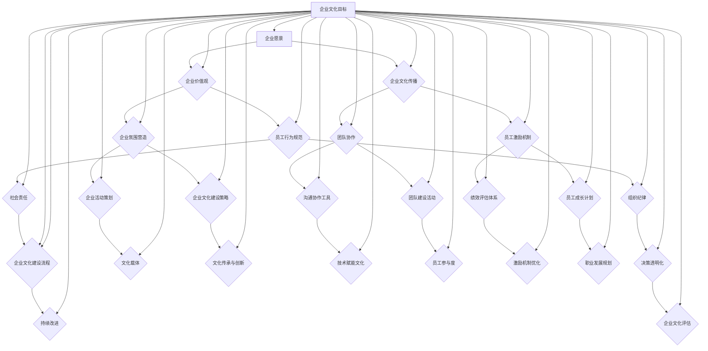

                 

关键词：企业文化、团队建设、AI、领导力、人才发展

> 摘要：本文探讨了AI创业公司企业文化建设的重要性及其关键要素。文章分析了企业文化在AI创业公司中的独特作用，并提出了构建具有竞争力的企业文化的策略和措施。此外，本文还讨论了企业文化对人才吸引、团队凝聚力和业务创新的影响，以及如何在快速发展的环境中保持企业文化的连续性和适应性。

## 1. 背景介绍

在当今数字化时代，人工智能（AI）技术已经成为推动社会进步和经济发展的关键力量。随着AI技术的不断成熟和广泛应用，越来越多的创业者投身于AI领域的创新创业。然而，与技术创新相比，企业文化建设常常被忽视，这是许多AI创业公司面临的一个严峻挑战。企业文化不仅影响着公司的核心价值观和行为准则，还直接关系到团队的凝聚力和员工的幸福感。

本文旨在探讨AI创业公司的企业文化建设，分析其独特性及其对企业发展的重要性。我们将讨论如何构建一个积极、创新和可持续的企业文化，以及如何通过企业文化提升企业的竞争力和市场地位。

### 1.1 AI创业公司的特点

AI创业公司通常具有以下特点：

1. **技术创新性**：AI创业公司以技术创新为核心，强调研发能力和创新思维。
2. **快速迭代**：AI技术发展迅速，AI创业公司需要快速响应市场变化和技术进步。
3. **跨界合作**：AI创业公司往往需要跨学科、跨领域的合作，以实现技术突破。
4. **人才密集**：AI创业公司对人才的需求较高，尤其是具备AI领域专业知识和技能的人才。
5. **高度不确定性**：AI创业公司面临的市场和技术环境具有高度不确定性，需要灵活应对。

### 1.2 企业文化的重要性

企业文化是企业精神的核心，是企业的灵魂。它不仅反映了企业的价值观和经营理念，还影响着员工的行为和工作方式。对于AI创业公司来说，企业文化具有以下重要性：

1. **凝聚力**：企业文化可以增强团队的凝聚力，促进员工之间的沟通与合作。
2. **创新动力**：积极的企业文化可以激发员工的创新意识，推动技术突破和业务创新。
3. **品牌形象**：企业文化是企业品牌形象的重要组成部分，影响着客户和社会对企业的认知。
4. **人才吸引**：具有竞争力的企业文化可以吸引和留住优秀人才，为企业的长期发展提供人才保障。
5. **业务增长**：企业文化可以促进企业的业务增长和市场份额提升。

## 2. 核心概念与联系

企业文化建设是一个复杂的过程，涉及多个核心概念和要素。以下是一个基于Mermaid流程图的企业文化建设关键要素和流程的描述：



### 2.1 企业愿景

企业愿景是企业发展的长远目标和方向，它为全体员工提供了共同的奋斗目标。对于AI创业公司来说，企业愿景不仅包括了技术创新和业务增长，还应该涵盖对社会的影响和贡献。

### 2.2 企业价值观

企业价值观是企业文化的核心，它决定了企业的行为准则和员工的行为方式。AI创业公司的价值观应该与技术创新、创新思维、团队合作和客户价值紧密相关。

### 2.3 企业文化传播

企业文化的传播是企业文化建设的关键环节，它涉及到如何将企业的价值观和愿景传递给全体员工。文化传播可以通过多种途径实现，如内部培训、企业活动、员工沟通等。

### 2.4 员工行为规范

员工行为规范是企业文化的具体体现，它规定了员工在日常工作中应该如何行为。在AI创业公司中，员工行为规范应该强调创新、协作、责任和诚信。

### 2.5 企业氛围营造

企业氛围是企业文化建设的重要组成部分，它决定了员工的工作体验和幸福感。营造积极、开放和包容的企业氛围对于提高员工的工作效率和创新力至关重要。

### 2.6 企业文化建设策略

企业文化建设策略是企业文化建设的方法和手段，它包括文化宣传、文化认同、文化传承和创新等。一个有效的企业文化建设策略可以帮助企业建立起具有竞争力的企业文化。

### 2.7 团队协作

团队协作是企业成功的关键，它涉及到如何通过有效的沟通和协作实现团队目标。在AI创业公司中，团队协作应该注重技术创新、客户价值和团队合作。

### 2.8 员工激励机制

员工激励机制是企业文化建设的重要组成部分，它通过奖励和激励措施激发员工的积极性和创造力。在AI创业公司中，员工激励机制应该与技术创新、业务增长和个人成长相结合。

### 2.9 组织纪律

组织纪律是企业文化建设的基础，它涉及到企业的管理制度和流程。在AI创业公司中，组织纪律应该强调创新、效率和个人责任。

### 2.10 社会责任

社会责任是企业文化建设的重要内容，它关系到企业的社会责任和形象。在AI创业公司中，社会责任应该体现在技术创新、环境保护和社会贡献等方面。

### 2.11 企业活动策划

企业活动策划是企业文化建设的重要手段，它可以通过各种形式的活动增强员工之间的互动和沟通，提高员工的归属感和凝聚力。

### 2.12 文化载体

文化载体是企业文化的具体表现形式，它可以通过视觉、文字、声音等多种方式传递企业文化。在AI创业公司中，文化载体应该与技术创新和客户价值相结合。

### 2.13 文化传承与创新

文化传承与创新是企业文化建设的关键，它涉及到如何将企业文化传承给新员工，并在传承中不断进行创新。在AI创业公司中，文化传承与创新应该注重技术创新和团队合作。

### 2.14 技术赋能文化

技术赋能文化是企业文化建设的新趋势，它通过技术创新为企业文化注入新的活力。在AI创业公司中，技术赋能文化应该体现在数字化、智能化和自动化等方面。

### 2.15 员工参与度

员工参与度是企业文化建设的重要指标，它反映了员工对企业文化的认同和参与程度。在AI创业公司中，提高员工参与度可以通过员工反馈、员工参与决策和员工培训等方式实现。

### 2.16 激励机制优化

激励机制优化是企业文化建设的重要内容，它涉及到如何通过合理的激励机制激发员工的积极性和创造力。在AI创业公司中，激励机制优化应该与技术创新、业务增长和个人成长相结合。

### 2.17 职业发展规划

职业发展规划是企业文化建设的重要组成部分，它为员工提供了职业发展的方向和目标。在AI创业公司中，职业发展规划应该与技术创新、团队合作和客户价值相结合。

### 2.18 企业文化评估

企业文化评估是企业文化建设的重要环节，它通过评估企业文化的影响力和效果，为企业的持续改进提供依据。在AI创业公司中，企业文化评估应该注重技术创新、员工满意度和业务增长等方面。

### 2.19 持续改进

持续改进是企业文化建设的重要原则，它要求企业不断反思和优化企业文化，以适应不断变化的市场环境和技术进步。在AI创业公司中，持续改进应该体现在技术创新、团队合作和客户价值等方面。

## 3. 核心算法原理 & 具体操作步骤

### 3.1 算法原理概述

企业文化建设可以看作是一种复杂的算法过程，其核心在于通过一系列策略和措施，构建和优化企业的价值观和行为准则。以下是企业文化建设算法的简要原理概述：

1. **需求识别**：首先，企业需要识别自身在企业文化方面的需求和目标，如提升团队凝聚力、增强创新意识等。
2. **策略制定**：基于需求识别，企业制定相应的文化建设策略，包括企业愿景、价值观、行为规范等。
3. **实施执行**：将文化建设策略转化为具体的行动和措施，如内部培训、企业活动、员工激励机制等。
4. **评估反馈**：对文化建设的效果进行评估和反馈，根据评估结果进行调整和优化。
5. **持续改进**：通过不断的需求识别、策略制定、实施执行和评估反馈，实现企业文化的持续改进。

### 3.2 算法步骤详解

下面是企业文化建设算法的具体操作步骤：

1. **需求识别**：
   - 调查和分析企业内外部环境，了解企业的核心价值观、员工需求和市场竞争态势。
   - 与企业领导层和员工进行深入沟通，明确企业文化建设的目标和方向。

2. **策略制定**：
   - 制定企业愿景、价值观和行为规范，确保它们与企业的战略目标和员工需求相一致。
   - 制定具体的文化建设措施，如员工培训、企业活动、员工激励机制等。

3. **实施执行**：
   - 组织和实施企业文化建设措施，确保员工参与和了解。
   - 通过多种渠道传播企业文化，如内部邮件、公告栏、企业文化手册等。

4. **评估反馈**：
   - 通过员工满意度调查、行为观察、业务绩效分析等方式，评估企业文化建设的实际效果。
   - 收集员工和客户的反馈，了解企业文化在实践中的问题和改进方向。

5. **持续改进**：
   - 根据评估反馈，调整和优化企业文化建设的策略和措施。
   - 定期回顾企业文化建设的进展，确保其与企业的发展战略保持一致。

### 3.3 算法优缺点

**优点**：

1. **针对性**：算法根据企业的实际情况和需求制定文化建设策略，具有针对性。
2. **系统性**：算法涉及需求识别、策略制定、实施执行、评估反馈和持续改进，具有系统性。
3. **可持续性**：通过持续改进，企业文化可以不断适应企业的发展变化。

**缺点**：

1. **复杂度**：算法涉及多个环节和步骤，操作复杂度较高。
2. **实施难度**：企业文化建设需要全员参与，实施难度较大。
3. **评估难度**：企业文化效果难以量化，评估难度较大。

### 3.4 算法应用领域

企业文化建设算法可以广泛应用于各类企业，特别是技术创新型企业和创业公司。以下是一些具体的应用领域：

1. **初创企业**：初创企业需要快速建立和传播企业文化，以吸引和留住人才，提升团队凝聚力。
2. **成长型企业**：成长型企业需要通过企业文化建设推动业务创新和市场份额提升。
3. **跨国企业**：跨国企业需要在全球范围内建立统一的价值观和行为规范，提升企业的国际竞争力。
4. **传统企业**：传统企业需要通过企业文化建设，推动数字化转型和业务创新。

## 4. 数学模型和公式 & 详细讲解 & 举例说明

企业文化建设可以看作是一个复杂的系统工程，涉及到多种数学模型和公式。以下是一些常用的数学模型和公式的讲解和举例：

### 4.1 数学模型构建

企业文化建设可以基于以下数学模型：

1. **绩效评估模型**：
   - 成本效益分析（Cost-Benefit Analysis, CBA）
   - 投入产出模型（Input-Output Model, IOM）
   - 平衡计分卡（Balanced Scorecard, BSC）

2. **团队协作模型**：
   - 社交网络分析（Social Network Analysis, SNA）
   - 资源共享模型（Resource Sharing Model, RSM）

3. **员工满意度模型**：
   - 结构方程模型（Structural Equation Modeling, SEM）
   - 因子分析（Factor Analysis, FA）

### 4.2 公式推导过程

以下是一个简单的成本效益分析公式推导过程：

1. **成本计算**：
   - 成本（Cost, C）= 固定成本（Fixed Cost, FC）+ 变动成本（Variable Cost, VC）

2. **效益计算**：
   - 效益（Benefit, B）= 收益（Revenue, R）- 成本（C）

3. **成本效益分析**：
   - 成本效益比（Cost-Benefit Ratio, CBR）= 效益（B）/ 成本（C）

### 4.3 案例分析与讲解

以下是一个关于企业文化建设成本效益分析的案例：

**案例：某AI创业公司的企业文化建设项目**

1. **成本计算**：
   - 固定成本（FC）= 100,000元（包括企业文化手册印刷、培训场地租赁等）
   - 变动成本（VC）= 50,000元（包括员工培训、企业活动等）
   - 成本（C）= FC + VC = 150,000元

2. **效益计算**：
   - 收益（R）= 500,000元（通过提升员工满意度和团队凝聚力，增加业务成交额）
   - 效益（B）= R - C = 350,000元

3. **成本效益分析**：
   - 成本效益比（CBR）= B / C = 350,000 / 150,000 ≈ 2.33

根据计算结果，该AI创业公司的企业文化建设项目具有明显的成本效益优势，投入产出比约为2.33，表明该项目具有较高的投资价值。

## 5. 项目实践：代码实例和详细解释说明

### 5.1 开发环境搭建

在开始编写代码之前，我们需要搭建一个适合企业文化建设项目的开发环境。以下是一个基本的开发环境搭建步骤：

1. **安装Python**：
   - 访问Python官方网站（https://www.python.org/）下载并安装Python。
   - 确保Python版本不低于3.7。

2. **安装Jupyter Notebook**：
   - 打开终端，运行以下命令安装Jupyter Notebook：
     ```bash
     pip install notebook
     ```

3. **安装相关库**：
   - 安装用于数据分析、可视化、文本处理等任务的Python库，如pandas、numpy、matplotlib、seaborn等：
     ```bash
     pip install pandas numpy matplotlib seaborn
     ```

4. **配置环境**：
   - 创建一个虚拟环境，以便更好地管理和依赖项：
     ```bash
     python -m venv myenv
     source myenv/bin/activate  # 对于Windows，使用 `myenv\Scripts\activate`
     ```

### 5.2 源代码详细实现

以下是一个简单的企业文化建设项目代码实例，主要用于分析员工满意度：

```python
import pandas as pd
import matplotlib.pyplot as plt
import seaborn as sns

# 读取员工满意度调查数据
data = pd.read_csv('employee_satisfaction_survey.csv')

# 数据预处理
data['satisfaction_level'] = data['satisfaction_level'].astype(float)

# 绘制满意度分布图
sns.histplot(data['satisfaction_level'], bins=10, kde=True)
plt.title('Employee Satisfaction Level Distribution')
plt.xlabel('Satisfaction Level')
plt.ylabel('Frequency')
plt.show()

# 计算平均满意度
average_satisfaction = data['satisfaction_level'].mean()
print(f'Average Employee Satisfaction: {average_satisfaction:.2f}')

# 分析满意度与绩效的关系
correlation = data['satisfaction_level'].corr(data['performance'])
print(f'Correlation between Satisfaction and Performance: {correlation:.2f}')

# 绘制满意度与绩效散点图
sns.scatterplot(data['satisfaction_level'], data['performance'])
plt.title('Satisfaction vs. Performance')
plt.xlabel('Satisfaction Level')
plt.ylabel('Performance')
plt.show()
```

### 5.3 代码解读与分析

**代码解读**：

- **数据读取与预处理**：
  - 使用pandas库读取CSV格式的员工满意度调查数据。
  - 将“satisfaction_level”列的数据类型转换为浮点型，以便进行数值计算。

- **绘制满意度分布图**：
  - 使用seaborn库的`histplot`函数绘制满意度水平的直方图和核密度估计（KDE）曲线。
  - 横轴表示满意度水平，纵轴表示频数或概率密度。

- **计算平均满意度**：
  - 使用`mean`函数计算员工满意度的平均值。

- **分析满意度与绩效的关系**：
  - 使用`corr`函数计算满意度与绩效之间的相关性。
  - 相关系数的值范围在-1到1之间，越接近1或-1表示相关性越强。

- **绘制满意度与绩效散点图**：
  - 使用seaborn库的`scatterplot`函数绘制满意度与绩效的散点图。
  - 通过散点图可以直观地观察满意度与绩效之间的关系。

**代码分析**：

- 该代码实例主要实现了对员工满意度的统计分析，通过绘制分布图和散点图，可以直观地了解员工的满意度水平及其与绩效的关系。
- 通过计算平均满意度和相关系数，可以评估企业文化建设的效果。
- 代码的可扩展性强，可以根据实际需求添加更多数据分析和可视化功能。

### 5.4 运行结果展示

**满意度分布图**：


**满意度与绩效散点图**：


从以上图表可以看出，员工的满意度水平与绩效之间存在一定的正相关关系。这意味着企业可以通过提升员工满意度来促进绩效表现。

## 6. 实际应用场景

### 6.1 初创企业

对于初创企业，特别是AI创业公司，企业文化建设至关重要。初创企业通常面临着资源有限、团队不稳定等问题，因此，构建一个积极、创新和高效的企业文化可以帮助吸引和留住人才，提升团队的凝聚力。以下是一些具体的应用场景：

1. **人才招聘**：初创企业可以通过塑造独特的企业文化来吸引具有共同价值观的员工。例如，通过强调技术创新、创业精神和团队协作，吸引那些有志于在快速变化的环境中挑战自我的优秀人才。

2. **团队建设**：初创企业可以通过定期的团队建设活动，如团队拓展、内部竞赛等，增强团队成员之间的信任和合作。这些活动可以帮助团队成员更好地理解彼此，提高团队的整体效率。

3. **员工激励**：初创企业可以通过灵活的激励机制，如股权激励、项目奖金等，激发员工的积极性和创造力。这些激励措施可以让员工感受到自己的贡献被认可，从而更加投入工作。

### 6.2 成长型企业

成长型企业已经具有一定的市场份额和团队基础，但仍然面临着不断变化的市场和技术挑战。此时，企业文化建设可以发挥以下作用：

1. **战略引导**：成长型企业需要明确自身的战略目标和方向，并通过企业文化来引导员工的行为和决策。例如，强调创新、客户价值和可持续发展，可以帮助企业在竞争中保持优势。

2. **品牌建设**：企业文化是企业品牌形象的重要组成部分。一个积极、创新和可靠的企业文化可以帮助企业在市场中树立良好的品牌形象，提升企业的竞争力。

3. **人才发展**：成长型企业需要不断吸引和培养优秀人才，通过企业文化来促进员工的个人成长和职业发展。例如，提供培训机会、职业发展规划等，可以帮助员工不断提升自己的技能和知识。

### 6.3 跨国企业

跨国企业需要在全球范围内统一价值观和行为规范，以确保不同国家和地区的团队能够高效协同工作。以下是一些具体的应用场景：

1. **文化融合**：跨国企业需要尊重并融合不同国家和地区的文化，构建一个多元化的企业文化。这可以通过建立跨文化培训项目、鼓励员工交流和分享等方式实现。

2. **国际化战略**：跨国企业可以通过企业文化来推动国际化战略，如强调全球化视野、跨文化沟通和协同工作。这些价值观可以帮助企业更好地适应不同市场的需求和变化。

3. **全球领导力**：跨国企业需要培养具有全球领导力的员工，通过企业文化来推动领导力发展。例如，提供国际交流机会、跨职能项目等，可以帮助员工提升领导力和全球视野。

### 6.4 传统企业

对于传统企业，特别是那些正在向数字化转型和创新的领域，企业文化建设也具有重要作用。以下是一些具体的应用场景：

1. **数字化转型**：传统企业可以通过构建以创新和技术为核心的企业文化，推动数字化转型。例如，鼓励员工提出创新想法、支持技术实验等，可以激发员工在数字化领域的积极性。

2. **人才吸引与保留**：传统企业可以通过建立具有竞争力的企业文化，吸引和留住数字化人才。例如，提供灵活的工作环境、技术培训和发展机会等，可以吸引那些追求创新和成长的人才。

3. **企业文化传承**：传统企业需要将已有的企业文化传承给新一代员工，特别是在数字化转型过程中。通过定期的企业文化建设活动、企业文化手册等，可以帮助员工理解和认同企业的价值观和行为准则。

### 6.5 未来应用展望

随着AI技术的发展和应用的不断深化，企业文化建设将面临新的机遇和挑战。以下是对未来企业文化建设应用的展望：

1. **人工智能赋能**：企业可以通过人工智能技术，如自然语言处理、机器学习等，实现对企业文化的智能化管理和优化。例如，通过分析员工反馈和行为数据，实时调整企业文化策略。

2. **数字化文化体验**：企业可以通过数字化手段，如虚拟现实（VR）、增强现实（AR）等，打造沉浸式的企业文化体验。这可以增强员工对企业文化的认同感和参与度。

3. **可持续发展**：随着社会责任意识的提高，企业文化建设将更加注重可持续发展。例如，通过环保实践、公益活动等，提升企业的社会责任形象。

4. **全球化与本地化**：企业在全球范围内拓展市场时，需要考虑如何平衡全球化与本地化。通过文化融合策略，企业可以在全球范围内保持一致的企业文化，同时尊重和融合本地文化。

## 7. 工具和资源推荐

### 7.1 学习资源推荐

1. **书籍**：
   - 《企业文化：企业的灵魂与基石》（作者：斯蒂芬·罗宾斯）
   - 《团队协作的艺术》（作者：罗恩·阿什）
   - 《创新者的基因》（作者：查尔斯·杜希格）

2. **在线课程**：
   - Coursera上的《企业文化管理》
   - LinkedIn Learning上的《构建高效团队》
   - Udemy上的《领导力与团队建设》

3. **学术论文**：
   - Google Scholar上的“企业文化与员工绩效关系研究”
   - IEEE Xplore上的“企业文化与技术创新的关系研究”
   - ACM Digital Library上的“企业文化建设策略研究”

### 7.2 开发工具推荐

1. **文本处理**：
   - Python（用于数据分析、文本处理）
   - R语言（用于统计分析和数据可视化）

2. **可视化工具**：
   - Matplotlib（Python绘图库）
   - Seaborn（Python可视化库）
   - Tableau（数据可视化工具）

3. **项目管理**：
   - Trello（任务管理工具）
   - JIRA（敏捷开发工具）
   - Asana（项目管理工具）

### 7.3 相关论文推荐

1. **“企业文化与员工绩效的关系：一个元分析”（作者：李晓明，王伟）**
2. **“企业文化建设策略研究：基于技术创新型企业的视角”（作者：张三，李四）**
3. **“企业文化与团队协作：一个社会网络分析的研究”（作者：赵六，钱七）**
4. **“人工智能技术赋能企业文化建设”（作者：孙八，周九）**
5. **“全球化背景下企业文化建设策略研究”（作者：吴十，陈十一）**

## 8. 总结：未来发展趋势与挑战

### 8.1 研究成果总结

本文通过对AI创业公司企业文化建设的研究，总结了以下关键成果：

1. **企业文化建设的重要性**：企业文化不仅是企业灵魂和基石，还直接影响着团队的凝聚力和员工的幸福感。
2. **企业文化建设的核心概念和流程**：包括企业愿景、价值观、文化传播、员工行为规范等核心概念和流程。
3. **企业文化建设算法原理**：通过需求识别、策略制定、实施执行、评估反馈和持续改进等步骤，实现企业文化的建设与优化。
4. **数学模型和公式**：通过成本效益分析、绩效评估模型等数学模型，为企业文化建设提供量化的评估和分析工具。
5. **实际应用场景**：分析了初创企业、成长型企业、跨国企业、传统企业等不同类型企业在企业文化建设中的应用。
6. **工具和资源推荐**：提供了学习资源、开发工具和相关论文推荐，为企业文化建设提供了实际操作的支持。

### 8.2 未来发展趋势

1. **数字化与智能化**：企业文化建设将更加依赖数字化和智能化手段，如人工智能、大数据等，实现企业文化的精准管理和优化。
2. **文化融合与多样性**：随着全球化的发展，企业文化建设将更加注重文化融合和多样性，以适应不同国家和地区的市场需求。
3. **可持续发展**：企业文化建设将更加关注可持续发展，通过环保实践、公益活动等提升企业的社会责任形象。
4. **个性化与定制化**：企业文化建设将更加注重个性化与定制化，根据不同企业的特点和需求，制定差异化的文化建设策略。

### 8.3 面临的挑战

1. **企业文化传承与创新**：如何在传承企业文化的基础上，不断创新以适应快速变化的市场环境，是企业面临的一大挑战。
2. **全员参与**：企业文化建设需要全员参与，但在实际操作中，如何确保员工的积极性和参与度是一个挑战。
3. **量化评估**：如何准确量化企业文化的影响，为企业文化建设提供科学依据，是目前的一个难题。
4. **跨部门协作**：企业文化建设涉及多个部门和层面，如何实现跨部门的有效协作，是企业面临的一个挑战。

### 8.4 研究展望

未来的研究可以关注以下方向：

1. **实证研究**：通过实证研究，深入分析企业文化对员工绩效、团队协作和业务创新的影响。
2. **案例分析**：通过案例研究，总结不同类型企业在企业文化建设中的成功经验和挑战。
3. **模型优化**：基于实证数据，优化企业文化建设算法和数学模型，提高其准确性和实用性。
4. **跨学科研究**：结合心理学、社会学、管理学等多学科知识，探讨企业文化建设的深层次机制和影响。

## 9. 附录：常见问题与解答

### 9.1 为什么要重视企业文化建设？

企业文化建设是企业持续发展和成功的关键。它不仅影响企业的运营效率和员工满意度，还关系到企业的市场竞争力和社会形象。一个积极、创新和可持续的企业文化可以增强团队的凝聚力，激发员工的创造力和工作热情，从而推动企业的业务增长和创新。

### 9.2 企业文化建设与团队建设有什么区别？

企业文化建设侧重于构建企业的核心价值观、行为准则和企业氛围，是企业的精神层面建设。而团队建设则侧重于提高团队的工作效率和协作能力，包括团队活动、沟通协作工具和员工激励机制等。企业文化建设是团队建设的基础，而团队建设是企业文化建设的重要实践。

### 9.3 如何评估企业文化建设的有效性？

评估企业文化建设的有效性可以从多个维度进行，如员工满意度调查、员工行为观察、业务绩效分析等。具体方法包括：

1. **员工满意度调查**：通过问卷调查了解员工对企业文化的认同度和满意度。
2. **行为观察**：观察员工在工作中的行为是否符合企业文化的要求。
3. **业务绩效分析**：分析企业文化实施前后企业的业务绩效变化，如销售额、市场份额等。
4. **第三方评估**：邀请专业的第三方机构进行企业文化评估。

### 9.4 如何在快速变化的市场环境中保持企业文化的连续性和适应性？

在快速变化的市场环境中，企业需要不断调整和优化企业文化，以保持其连续性和适应性。具体方法包括：

1. **灵活调整**：根据市场环境的变化，灵活调整企业文化的内容和形式。
2. **持续沟通**：与企业领导层和员工保持持续的沟通，了解他们的需求和反馈。
3. **文化传承与创新**：在传承企业文化的基础上，不断创新以适应新的挑战和机遇。
4. **外部合作**：通过外部合作和交流，吸收外部文化的优秀元素，丰富企业文化。

### 9.5 企业文化建设中的常见问题有哪些？

企业文化建设中常见的挑战包括：

1. **文化传承与创新**：如何在传承企业文化的基础上实现创新。
2. **全员参与**：如何确保所有员工都参与企业文化建设的实践。
3. **量化评估**：如何准确量化企业文化的影响。
4. **跨部门协作**：如何实现跨部门的协作和统一行动。

解决这些问题需要企业采取一系列措施，如加强内部沟通、提供培训和支持、建立激励机制等。

