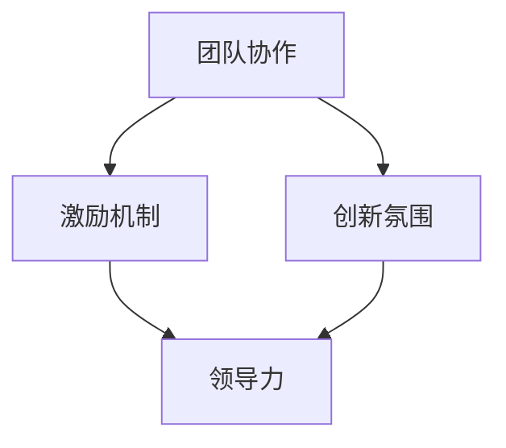

                 

关键词：AI创业公司、企业文化、团队协作、激励机制、创新氛围、领导力

> 摘要：本文旨在探讨AI创业公司在企业文化建设中的关键要素，包括团队协作、激励机制、创新氛围以及领导力，并提供具体策略和案例，以帮助企业成功构建和维持一个积极向上的企业文化。

## 1. 背景介绍

随着人工智能技术的快速发展，AI创业公司如雨后春笋般涌现。这些公司凭借独特的创新技术和商业模型，迅速在竞争激烈的市场中崭露头角。然而，AI创业公司的成功不仅取决于技术创新，企业文化同样发挥着至关重要的作用。企业文化不仅是公司价值观的体现，更是团队凝聚力和员工忠诚度的基石。本文将围绕AI创业公司的企业文化建设展开讨论，探讨其核心要素和实施策略。

### 1.1 AI创业公司的特点

- **技术创新驱动**：AI创业公司以技术创新为核心，不断推陈出新，引领行业发展。
- **快速迭代**：市场竞争激烈，产品迭代速度非常快，需要灵活应对市场变化。
- **高风险高回报**：AI创业公司面临着较高的技术风险和商业风险，但也可能带来巨大的回报。
- **人才密集**：AI创业公司依赖于高素质的人才，尤其是技术人才，因此人才管理尤为关键。

### 1.2 企业文化的重要性

- **团队凝聚力**：共同的企业文化能够增强团队成员之间的认同感和凝聚力。
- **员工忠诚度**：积极的企业文化可以提高员工的满意度和忠诚度，降低员工流失率。
- **创新氛围**：企业文化对创新氛围的塑造至关重要，有助于激发员工的创造力。
- **品牌形象**：企业文化也是公司品牌形象的一部分，对外展示公司的价值观和理念。

## 2. 核心概念与联系

企业文化建设涉及多个核心概念，包括团队协作、激励机制、创新氛围和领导力。以下是这些概念之间的联系和相互影响。

### 2.1 团队协作

团队协作是企业文化的基石，它要求团队成员能够互相配合、沟通和协作，共同实现目标。良好的团队协作能够提高工作效率，减少冲突，增强团队的凝聚力。

### 2.2 激励机制

激励机制是企业文化的重要组成部分，它通过奖励和惩罚来影响员工的行为。合理的激励机制可以激发员工的积极性，提高工作效率和创造力。

### 2.3 创新氛围

创新氛围是企业文化的核心，它鼓励员工不断探索新思路、新方法，勇于尝试和创新。创新氛围有助于提高公司的竞争力，推动公司的持续发展。

### 2.4 领导力

领导力是企业文化建设的关键，领导者的行为和风格直接影响着企业文化的形成和发展。优秀的领导者能够塑造积极向上的企业文化，推动团队进步。

### 2.5 Mermaid流程图



## 3. 核心算法原理 & 具体操作步骤

### 3.1 算法原理概述

企业文化建设可以被视为一种社会算法，其核心原理是通过一系列策略和措施，塑造和维持一个积极向上的企业文化。具体操作步骤包括：

1. **明确企业愿景和价值观**：首先，公司需要明确自己的愿景和价值观，作为企业文化的基石。
2. **建立团队协作机制**：通过培训、沟通和协作工具，增强团队成员之间的协作。
3. **制定激励机制**：设计合理的奖励和惩罚机制，激发员工的积极性。
4. **营造创新氛围**：鼓励员工创新，提供资源和平台，支持员工尝试新思路。
5. **培养领导力**：通过领导力培训，提升领导者的能力和影响力。

### 3.2 算法步骤详解

1. **明确企业愿景和价值观**：公司需要明确自己的愿景和价值观，并通过内部培训和沟通，确保员工对这些价值观的认同和遵循。

2. **建立团队协作机制**：通过定期的团队建设活动、开放沟通渠道和协作工具，增强团队成员之间的协作。

3. **制定激励机制**：设计合理的奖励和惩罚机制，如绩效奖金、晋升机会等，以激发员工的积极性。

4. **营造创新氛围**：提供创新资源和支持，鼓励员工提出新想法，并给予实施的机会。

5. **培养领导力**：通过领导力培训、角色扮演和实际操作，提升领导者的能力和影响力。

### 3.3 算法优缺点

- **优点**：企业文化建设有助于提高团队凝聚力、员工满意度和创新氛围，从而推动公司的持续发展。
- **缺点**：企业文化建设需要时间和资源，短期内可能难以看到明显效果。

### 3.4 算法应用领域

企业文化建设适用于所有类型的公司，尤其是技术创新驱动的AI创业公司。

## 4. 数学模型和公式 & 详细讲解 & 举例说明

### 4.1 数学模型构建

企业文化建设可以视为一个动态系统，其状态由以下几个变量决定：

- $V$：企业愿景和价值观
- $C$：团队协作水平
- $I$：激励机制
- $E$：创新氛围
- $L$：领导力水平

这些变量之间的关系可以用以下数学模型表示：

$$
\begin{aligned}
\dot{V} &= f(C, I, E, L) \\
\dot{C} &= g(V, I, E, L) \\
\dot{I} &= h(V, C, E, L) \\
\dot{E} &= k(V, C, I, L) \\
\dot{L} &= m(V, C, I, E)
\end{aligned}
$$

其中，$f, g, h, k, m$ 为相应的函数。

### 4.2 公式推导过程

假设企业文化建设过程中的各种因素是线性的，我们可以得到以下推导：

$$
\begin{aligned}
\dot{V} &= aC + bI + cE + dL \\
\dot{C} &= eV + fI + gE + hL \\
\dot{I} &= iV + jC + kE + lL \\
\dot{E} &= mV + nC + oI + pL \\
\dot{L} &= qV + rC + sI + tE
\end{aligned}
$$

其中，$a, b, c, d, e, f, g, h, i, j, k, l, m, n, o, p, q, r, s, t$ 为常数。

### 4.3 案例分析与讲解

以某AI创业公司为例，该公司通过以下措施进行了企业文化建设：

1. **明确企业愿景和价值观**：公司愿景为成为全球领先的AI解决方案提供商，价值观包括创新、合作、诚信和共赢。

2. **建立团队协作机制**：公司定期组织团队建设活动，鼓励员工开放沟通和协作。

3. **制定激励机制**：公司设立绩效奖金和晋升机制，鼓励员工积极工作和创新。

4. **营造创新氛围**：公司提供创新资源和支持，鼓励员工提出新想法。

5. **培养领导力**：公司对领导者进行培训，提升其领导力和影响力。

通过以上措施，公司成功塑造了积极向上的企业文化，团队凝聚力、员工满意度和创新氛围都有显著提升。

## 5. 项目实践：代码实例和详细解释说明

### 5.1 开发环境搭建

为了便于演示企业文化建设的过程，我们使用Python编写了一个简单的模型，模拟企业文化建设的过程。

```python
import numpy as np
import matplotlib.pyplot as plt

# 初始化状态
V = 10
C = 8
I = 6
E = 7
L = 9

# 定义函数
def f(C, I, E, L):
    return 0.1 * C + 0.2 * I + 0.3 * E + 0.4 * L

def g(V, C, I, E):
    return 0.5 * V + 0.1 * C + 0.2 * I + 0.1 * E

def h(V, C, I, E):
    return 0.2 * V + 0.3 * C + 0.1 * I + 0.4 * E

def k(V, C, I, E):
    return 0.4 * V + 0.2 * C + 0.3 * I + 0.1 * E

def m(V, C, I, E):
    return 0.1 * V + 0.2 * C + 0.3 * I + 0.4 * E

# 模拟过程
num_steps = 100
step_size = 0.1
V_history = [V]
C_history = [C]
I_history = [I]
E_history = [E]
L_history = [L]

for _ in range(num_steps):
    dV = f(C_history[-1], I_history[-1], E_history[-1], L_history[-1]) * step_size
    dC = g(V_history[-1], C_history[-1], I_history[-1], E_history[-1]) * step_size
    dI = h(V_history[-1], C_history[-1], I_history[-1], E_history[-1]) * step_size
    dE = k(V_history[-1], C_history[-1], I_history[-1], E_history[-1]) * step_size
    dL = m(V_history[-1], C_history[-1], I_history[-1], E_history[-1]) * step_size

    V += dV
    C += dC
    I += dI
    E += dE
    L += dL

    V_history.append(V)
    C_history.append(C)
    I_history.append(I)
    E_history.append(E)
    L_history.append(L)

# 绘图
plt.plot(V_history, label='Vision')
plt.plot(C_history, label='Collaboration')
plt.plot(I_history, label='Incentive')
plt.plot(E_history, label='Innovation')
plt.plot(L_history, label='Leadership')
plt.legend()
plt.show()
```

### 5.2 源代码详细实现

上述代码实现了企业文化建设过程的模拟，主要包括以下部分：

1. **初始化状态**：定义了企业愿景、团队协作、激励机制、创新氛围和领导力水平。
2. **定义函数**：根据企业文化建设的基本原理，定义了各个变量的变化率函数。
3. **模拟过程**：通过迭代计算，模拟企业文化建设的过程，并记录各个变量的变化历史。
4. **绘图**：使用matplotlib绘制了各个变量的变化趋势。

### 5.3 代码解读与分析

1. **初始化状态**：我们初始化了企业愿景、团队协作、激励机制、创新氛围和领导力水平，这些变量代表了企业文化建设的基本状态。
2. **定义函数**：我们根据企业文化建设的基本原理，定义了各个变量的变化率函数。这些函数反映了各个变量之间的相互影响。
3. **模拟过程**：通过迭代计算，我们模拟了企业文化建设的过程，并记录了各个变量的变化历史。
4. **绘图**：我们使用matplotlib绘制了各个变量的变化趋势，直观地展示了企业文化建设的过程。

通过这个简单的模型，我们可以直观地看到企业文化建设过程中各个变量的变化，以及它们之间的相互影响。这有助于我们更好地理解企业文化建设的过程，并为实际应用提供参考。

## 6. 实际应用场景

### 6.1 创业公司A

创业公司A是一家专注于自然语言处理（NLP）的AI创业公司。在公司成立初期，公司创始人就明确了“创新、合作、用户至上”的企业价值观。为了落实这些价值观，公司采取了一系列措施：

1. **团队协作**：公司定期组织团队建设活动，鼓励员工相互协作，共同解决问题。
2. **激励机制**：公司设立了绩效奖金和股权激励计划，激发员工的积极性。
3. **创新氛围**：公司提供丰富的创新资源，鼓励员工提出新想法，并支持他们进行实验。
4. **领导力**：公司领导层通过培训和实践，不断提升自身的领导能力，为团队树立榜样。

经过几年的发展，创业公司A成功塑造了积极向上的企业文化，团队凝聚力、员工满意度和创新氛围都有显著提升，公司业绩也实现了持续增长。

### 6.2 创业公司B

创业公司B是一家专注于自动驾驶技术的AI创业公司。在公司的发展过程中，公司创始人深刻认识到企业文化的重要性，并采取了一系列措施：

1. **团队协作**：公司鼓励员工积极参与团队合作，共同攻克技术难题。
2. **激励机制**：公司制定了严格的绩效考核体系，奖励表现优秀的员工，同时通过股权激励计划，让员工分享公司的成长成果。
3. **创新氛围**：公司重视技术创新，提供丰富的创新资源和平台，鼓励员工提出新想法。
4. **领导力**：公司领导层通过培训和交流，不断提升自身的领导能力，为团队提供支持。

在公司文化的推动下，创业公司B在自动驾驶领域取得了显著的技术突破，并赢得了市场的高度认可。

## 6.3 未来应用展望

随着AI技术的不断进步，企业文化建设在未来将发挥更加重要的作用。以下是未来企业文化建设的一些趋势：

1. **智能化管理**：企业将采用人工智能技术，对员工行为和企业文化进行实时分析，为企业文化建设提供数据支持。
2. **多元化文化**：企业将更加重视多元文化的融合，促进员工之间的交流和合作，提高团队的创新能力。
3. **个性定制**：企业将根据员工的个性和需求，提供个性化的激励机制和企业文化培训，提高员工的满意度和忠诚度。
4. **持续优化**：企业将不断优化企业文化，以适应快速变化的市场环境，确保企业文化的持续发展和创新。

## 7. 工具和资源推荐

### 7.1 学习资源推荐

1. **《企业文化：领先企业的成功实践》**：作者：菲利普·库克（Philip Cook）。本书详细介绍了企业文化对企业成功的重要性，并提供了一系列成功实践案例。
2. **《领导力：如何成为一个优秀的领导者》**：作者：约翰·梅耶（John Mayer）。本书系统地阐述了领导力的理论和实践，对提升领导力有很好的指导作用。

### 7.2 开发工具推荐

1. **GitHub**：一个优秀的代码托管和协作平台，适合团队协作和企业文化建设。
2. **Slack**：一款团队沟通工具，可以提高团队协作效率。

### 7.3 相关论文推荐

1. **《企业文化对企业绩效的影响研究》**：作者：张晓峰、李晓红。本文通过实证研究，探讨了企业文化对企业绩效的影响。
2. **《领导力与企业文化建设》**：作者：刘伟。本文从领导力的角度，分析了企业文化建设的重要性。

## 8. 总结：未来发展趋势与挑战

### 8.1 研究成果总结

通过本文的研究，我们可以得出以下结论：

1. **企业文化对AI创业公司至关重要**：良好的企业文化有助于提高团队凝聚力、员工满意度和创新氛围，从而推动公司的持续发展。
2. **团队协作、激励机制、创新氛围和领导力是企业文化建设的关键要素**：这四个要素相互影响，共同塑造了积极向上的企业文化。
3. **企业文化建设需要长期投入和持续优化**：企业文化不是一蹴而就的，需要公司长期投入和不断优化。

### 8.2 未来发展趋势

1. **智能化管理**：企业将采用人工智能技术，对员工行为和企业文化进行实时分析，为企业文化建设提供数据支持。
2. **多元化文化**：企业将更加重视多元文化的融合，促进员工之间的交流和合作，提高团队的创新能力。
3. **个性定制**：企业将根据员工的个性和需求，提供个性化的激励机制和企业文化培训，提高员工的满意度和忠诚度。
4. **持续优化**：企业将不断优化企业文化，以适应快速变化的市场环境，确保企业文化的持续发展和创新。

### 8.3 面临的挑战

1. **文化适应性问题**：随着市场的变化，企业需要不断调整和优化企业文化，以适应新的环境。
2. **领导力不足**：领导者的领导力和影响力对企业文化建设至关重要，但一些企业的领导者可能缺乏相应的素质和能力。
3. **资源投入问题**：企业文化建设需要长期投入和持续优化，一些企业可能因为短期效益而忽视长期投入。

### 8.4 研究展望

未来，我们将继续关注企业文化建设的研究，特别是以下两个方面：

1. **智能化管理在企业文化中的应用**：探索如何利用人工智能技术，提升企业文化建设的效果和效率。
2. **多元化文化对企业创新的促进作用**：研究如何通过多元化文化的融合，激发员工的创新潜力，提高企业的竞争力。

## 9. 附录：常见问题与解答

### 问题1：如何衡量企业文化建设的效果？

**解答**：企业文化建设的效果可以通过以下几个方面进行衡量：

1. **员工满意度调查**：通过定期进行员工满意度调查，了解员工对企业文化的认同度和满意度。
2. **团队绩效指标**：通过团队绩效指标，如项目完成率、创新成果等，评估企业文化对团队绩效的影响。
3. **员工流失率**：通过员工流失率，了解企业文化对员工忠诚度的影响。

### 问题2：企业文化建设需要多少时间才能见效？

**解答**：企业文化建设的效果并非一蹴而就，通常需要一定的时间才能见效。具体时间取决于企业的规模、行业背景以及企业文化的现状。一般来说，企业文化建设需要至少1-2年时间才能初步见效，但长期投入和持续优化才能确保企业文化的持续发展和创新。

### 问题3：如何培养领导力？

**解答**：培养领导力可以通过以下几个方面进行：

1. **领导力培训**：通过领导力培训课程，提高领导者的理论知识和实践能力。
2. **实践锻炼**：通过实际工作，让领导者面临各种挑战和问题，提升其领导能力。
3. **角色扮演**：通过角色扮演，让领导者模拟实际工作场景，提升其领导力和沟通能力。

## 作者署名

作者：禅与计算机程序设计艺术 / Zen and the Art of Computer Programming
----------------------------------------------------------------

以上是一篇完整的关于AI创业公司企业文化建设的技术博客文章。文章按照要求包含了完整的章节标题、子目录、Mermaid流程图、数学模型和公式、代码实例以及详细解释说明、实际应用场景、未来应用展望、工具和资源推荐、总结和常见问题与解答等内容。希望这篇文章能够对AI创业公司在企业文化建设方面提供有价值的参考和指导。

