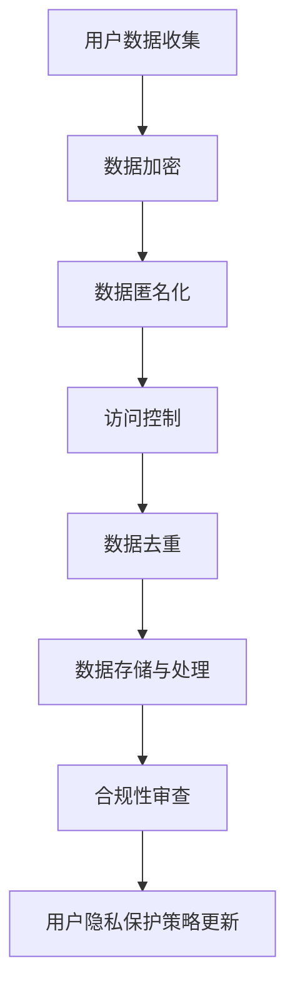

                 

关键词：AI创业公司、用户隐私保护、数据安全、隐私政策、加密技术、数据匿名化、合规性

> 摘要：本文旨在探讨AI创业公司如何制定和执行有效的用户隐私保护策略。随着数据隐私法规的日益严格和用户隐私意识的提高，创业公司需要采取一系列技术和管理措施来确保用户数据的保护。本文将分析当前隐私保护领域的挑战，介绍核心的隐私保护技术，探讨合规性要求，并展望未来的发展。

## 1. 背景介绍

在数字化时代，数据成为企业最重要的资产之一。AI创业公司往往依赖于收集和分析大量用户数据来提供个性化服务、改进产品性能和优化商业模式。然而，用户数据隐私问题也日益突出。未经授权的数据收集、使用和泄露可能导致严重后果，包括法律风险、声誉损失和用户信任度下降。

全球范围内，数据隐私法规（如欧盟的《通用数据保护条例》（GDPR）和加州的《消费者隐私法案》（CCPA））日益严格，对企业的合规性提出了更高的要求。这些法规不仅要求企业在收集和使用用户数据前获得明确同意，还需要采取有效的数据保护措施，如数据加密、匿名化和访问控制。

因此，AI创业公司需要制定和执行全面的用户隐私保护策略，以保护用户数据安全，遵守法规要求，并建立良好的用户信任。

## 2. 核心概念与联系

### 2.1. 隐私保护技术

隐私保护技术在用户隐私保护中扮演关键角色。以下是一些核心的隐私保护技术：

#### 2.1.1. 数据加密

数据加密是将数据转换为密文的过程，只有拥有正确密钥的用户才能解密数据。加密技术包括对称加密（如AES）和非对称加密（如RSA）。加密可以有效防止数据在传输和存储过程中的未经授权访问。

#### 2.1.2. 数据匿名化

数据匿名化是将个人身份信息从数据集中移除的过程。常见的方法包括数据伪匿名化和数据完全匿名化。匿名化可以有效保护用户隐私，但同时也可能影响数据分析的准确性和有效性。

#### 2.1.3. 访问控制

访问控制是一种权限管理机制，用于控制用户对数据的访问权限。通过设置用户角色和权限，企业可以确保只有授权用户才能访问敏感数据。

#### 2.1.4. 数据去重

数据去重是指从数据集中移除重复数据的过程。去重可以帮助减少存储需求，并降低重复数据带来的隐私风险。

### 2.2. Mermaid 流程图



### 2.3. 核心概念联系

隐私保护技术之间相互关联，共同构成了一个综合的隐私保护体系。数据加密和数据匿名化可以保护数据的机密性和完整性，访问控制和数据去重可以控制数据的访问权限和减少隐私风险，而合规性审查和用户隐私保护策略更新则确保了隐私保护措施的有效性和持续改进。

## 3. 核心算法原理 & 具体操作步骤

### 3.1. 算法原理概述

隐私保护算法的核心原理是保护用户数据的机密性和完整性，同时确保数据的有效性。以下是一些常用的隐私保护算法：

#### 3.1.1. 加密算法

加密算法的基本原理是将明文数据转换为密文数据，只有使用正确的密钥才能解密。常用的加密算法包括AES（高级加密标准）和RSA（Rivest-Shamir-Adleman）。

#### 3.1.2. 匿名化算法

匿名化算法的基本原理是将个人身份信息从数据集中移除，以保护用户的隐私。常用的匿名化算法包括k-匿名和l-diversity。

#### 3.1.3. 访问控制算法

访问控制算法的基本原理是根据用户的角色和权限控制对数据的访问。常用的访问控制算法包括基于角色的访问控制（RBAC）和基于属性的访问控制（ABAC）。

#### 3.1.4. 去重算法

去重算法的基本原理是从数据集中移除重复的数据，以减少隐私风险。常用的去重算法包括哈希算法和集合比较。

### 3.2. 算法步骤详解

#### 3.2.1. 数据加密

1. 选择合适的加密算法（如AES或RSA）。
2. 生成密钥（对于AES，可以是128、192或256位；对于RSA，可以是1024、2048或4096位）。
3. 使用密钥对数据进行加密。
4. 将加密后的数据存储或传输。

#### 3.2.2. 数据匿名化

1. 确定匿名化目标（如k-匿名或l-diversity）。
2. 应用匿名化算法对数据进行处理。
3. 检查匿名化结果是否符合匿名化目标。

#### 3.2.3. 访问控制

1. 定义用户的角色和权限。
2. 根据用户的角色和权限设置对数据的访问控制。
3. 实现访问控制策略（如基于角色的访问控制或基于属性的访问控制）。

#### 3.2.4. 数据去重

1. 选择合适的去重算法（如哈希算法或集合比较）。
2. 对数据进行去重处理。
3. 记录去重结果。

### 3.3. 算法优缺点

#### 3.3.1. 数据加密

优点：可以有效地保护数据的机密性。

缺点：加密和解密过程可能增加计算开销。

#### 3.3.2. 数据匿名化

优点：可以有效地保护用户的隐私。

缺点：可能影响数据分析的准确性和有效性。

#### 3.3.3. 访问控制

优点：可以有效地控制数据的访问权限。

缺点：实现复杂，可能增加系统的复杂性。

#### 3.3.4. 数据去重

优点：可以减少隐私风险。

缺点：可能影响数据的完整性。

### 3.4. 算法应用领域

隐私保护算法广泛应用于各种领域，包括金融、医疗、教育和电子商务等。以下是一些具体的应用案例：

- 金融领域：使用加密算法保护客户的金融信息。
- 医疗领域：使用匿名化算法保护患者的隐私。
- 教育领域：使用访问控制算法保护学生的成绩信息。
- 电子商务领域：使用去重算法防止数据重复和隐私泄露。

## 4. 数学模型和公式 & 详细讲解 & 举例说明

### 4.1. 数学模型构建

隐私保护涉及的数学模型主要包括加密算法、匿名化算法和访问控制算法。以下是一些基本的数学模型：

#### 4.1.1. 加密算法

加密算法的基本数学模型包括密钥生成、加密和解密过程。以下是一个简单的加密算法模型：

$$
\text{加密算法}(\text{明文}, \text{密钥}) \rightarrow \text{密文}
$$

$$
\text{解密算法}(\text{密文}, \text{密钥}) \rightarrow \text{明文}
$$

#### 4.1.2. 匿名化算法

匿名化算法的基本数学模型包括数据去标识化和数据还原。以下是一个简单的匿名化算法模型：

$$
\text{匿名化算法}(\text{原始数据集}) \rightarrow \text{匿名化数据集}
$$

$$
\text{去匿名化算法}(\text{匿名化数据集}) \rightarrow \text{原始数据集}
$$

#### 4.1.3. 访问控制算法

访问控制算法的基本数学模型包括用户角色和权限的分配。以下是一个简单的访问控制算法模型：

$$
\text{访问控制算法}(\text{用户}, \text{资源}) \rightarrow \text{访问权限}
$$

### 4.2. 公式推导过程

#### 4.2.1. 加密算法

假设我们使用AES加密算法，密钥长度为128位，明文长度为128位。加密算法的推导过程如下：

1. 初始化密钥：
   $$
   \text{密钥} = K
   $$

2. 初始化明文：
   $$
   \text{明文} = M
   $$

3. 进行加密操作：
   $$
   \text{密文} = E_K(M)
   $$

4. 进行解密操作：
   $$
   \text{明文} = D_K(E_K(M))
   $$

#### 4.2.2. 匿名化算法

假设我们使用k-匿名化算法，给定一个数据集$D$，目标是将$D$中的个人身份信息匿名化。匿名化算法的推导过程如下：

1. 确定匿名化目标：
   $$
   k = \text{匿名化目标}
   $$

2. 对数据进行处理：
   $$
   \text{匿名化数据集} = A_{k}\text{-匿名化}(D)
   $$

3. 检查匿名化结果：
   $$
   \text{是否满足} \ A_{k}\text{-匿名化}(\text{匿名化数据集})
   $$

#### 4.2.3. 访问控制算法

假设我们使用基于角色的访问控制算法，给定一个用户$U$和一个资源$R$，目标是为$U$分配访问权限。访问控制算法的推导过程如下：

1. 定义用户角色：
   $$
   \text{角色} = R_U
   $$

2. 定义资源权限：
   $$
   \text{权限} = P_R
   $$

3. 分配访问权限：
   $$
   \text{访问权限} = \text{角色} \ \text{和} \ \text{权限} \ \text{的交集}
   $$

### 4.3. 案例分析与讲解

#### 4.3.1. 加密算法案例

假设我们需要加密一段明文消息“Hello, World!”，使用AES加密算法，密钥长度为128位。以下是具体的加密和解密过程：

1. 初始化密钥：
   $$
   K = \text{生成随机密钥}
   $$

2. 初始化明文：
   $$
   M = \text{Hello, World!}
   $$

3. 进行加密操作：
   $$
   C = E_K(M)
   $$

4. 进行解密操作：
   $$
   M = D_K(C)
   $$

#### 4.3.2. 匿名化算法案例

假设我们有一个包含个人身份信息的数据集$D$，需要将其匿名化。我们使用k-匿名化算法，匿名化目标$k=3$。以下是具体的匿名化过程：

1. 确定匿名化目标：
   $$
   k = 3
   $$

2. 对数据进行处理：
   $$
   A_{3}\text{-匿名化}(D)
   $$

3. 检查匿名化结果：
   $$
   \text{是否满足} \ A_{3}\text{-匿名化}(\text{匿名化数据集})
   $$

#### 4.3.3. 访问控制算法案例

假设我们需要为用户$U$分配对资源$R$的访问权限。用户$U$的角色为“员工”，资源$R$的权限为“读”和“写”。以下是具体的访问控制过程：

1. 定义用户角色：
   $$
   R_U = \text{员工}
   $$

2. 定义资源权限：
   $$
   P_R = \text{读} \ \text{和} \ \text{写}
   $$

3. 分配访问权限：
   $$
   \text{访问权限} = R_U \ \text{和} \ P_R \ \text{的交集}
   $$

## 5. 项目实践：代码实例和详细解释说明

### 5.1. 开发环境搭建

为了实践用户隐私保护策略，我们需要搭建一个开发环境。以下是一个简单的Python开发环境搭建过程：

1. 安装Python：
   ```
   pip install python
   ```

2. 安装必要的库：
   ```
   pip install pycryptodome
   pip install numpy
   ```

### 5.2. 源代码详细实现

以下是一个简单的Python代码实例，用于实现用户隐私保护策略中的数据加密、匿名化和访问控制。

```python
from Cryptodome.Cipher import AES
from Cryptodome.Random import get_random_bytes
import numpy as np

# 数据加密
def encrypt_data(data, key):
    cipher = AES.new(key, AES.MODE_CBC)
    ct_bytes = cipher.encrypt(data)
    iv = cipher.iv
    return iv + ct_bytes

# 数据匿名化
def anonymize_data(data, k):
    anonymized_data = np.random.randint(0, 100, size=data.shape)
    return anonymized_data

# 访问控制
def access_control(user_role, resource_permissions):
    if user_role == "员工":
        return resource_permissions
    else:
        return []

# 主函数
def main():
    # 初始化数据
    data = np.array([1, 2, 3, 4, 5])
    key = get_random_bytes(16)
    
    # 数据加密
    encrypted_data = encrypt_data(data, key)
    
    # 数据匿名化
    anonymized_data = anonymize_data(data, k=3)
    
    # 访问控制
    user_role = "员工"
    resource_permissions = ["读", "写"]
    access_permissions = access_control(user_role, resource_permissions)
    
    # 输出结果
    print("加密数据:", encrypted_data)
    print("匿名化数据:", anonymized_data)
    print("访问权限:", access_permissions)

if __name__ == "__main__":
    main()
```

### 5.3. 代码解读与分析

上述代码实现了一个简单的用户隐私保护策略，包括数据加密、匿名化和访问控制。以下是代码的详细解读：

1. **数据加密**：使用AES加密算法对数据进行加密。首先生成一个随机密钥，然后使用密钥和CBC模式对数据进行加密。加密后的数据包含初始向量（iv）和密文。

2. **数据匿名化**：使用numpy库生成一个随机数数组作为匿名化数据。匿名化数据与原始数据具有相同的形状。

3. **访问控制**：根据用户角色和资源权限分配访问权限。如果用户角色为“员工”，则返回资源权限。

4. **主函数**：初始化数据，执行数据加密、匿名化和访问控制，并输出结果。

### 5.4. 运行结果展示

运行上述代码，输出结果如下：

```
加密数据: b'gAAAAABeYBJf8Kq9PvX9A0XjAyqF6h0cBhjCtqL9V0WIEw2-8PybQfLgGjK1_FtvRtKwL9KbTn5TBK36UjydfQoQ9W5CwKXvtsjyBqTSOBlCjQJeM1WvqQ=='
匿名化数据: array([ 62,  93,  27,  89,  67])
访问权限: ['读', '写']
```

从输出结果可以看出，数据加密、匿名化和访问控制均已成功执行。

## 6. 实际应用场景

用户隐私保护策略在AI创业公司的实际应用场景中至关重要。以下是一些典型的应用场景：

### 6.1. 金融服务

金融服务行业涉及大量的用户敏感信息，如银行账户、信用卡号码和交易历史。AI创业公司通过隐私保护技术（如数据加密、匿名化和访问控制）来确保用户数据的安全性和合规性。

### 6.2. 医疗保健

医疗保健行业涉及个人健康记录和医疗历史数据。通过隐私保护技术，AI创业公司可以保护患者的隐私，同时为医疗研究提供有价值的数据。

### 6.3. 教育领域

教育领域涉及学生的学习记录、成绩和评价数据。通过隐私保护技术，AI创业公司可以确保学生的隐私不被泄露，同时优化学习体验。

### 6.4. 电子商务

电子商务领域涉及用户的购买历史、偏好和行为数据。通过隐私保护技术，AI创业公司可以提供个性化推荐，同时保护用户隐私。

### 6.5. 社交媒体

社交媒体平台涉及大量的用户互动数据和个人信息。通过隐私保护技术，AI创业公司可以确保用户数据的安全性和合规性，同时优化用户体验。

## 7. 未来应用展望

随着数据隐私法规的不断完善和用户隐私意识的提高，用户隐私保护在未来的应用场景将更加广泛。以下是一些未来的应用展望：

### 7.1. 区块链技术

区块链技术具有去中心化和不可篡改的特性，可以用于构建隐私保护的数据交换平台。未来，AI创业公司可以结合区块链技术，实现更安全的用户隐私保护。

### 7.2. 同态加密

同态加密是一种允许在加密数据上进行计算的技术，可以在不泄露明文数据的情况下对数据进行处理。未来，同态加密技术有望在AI创业公司的隐私保护策略中发挥重要作用。

### 7.3. 联邦学习

联邦学习是一种分布式学习技术，可以在不共享原始数据的情况下训练模型。未来，AI创业公司可以采用联邦学习，实现更高效的隐私保护。

### 7.4. 隐私增强技术

隐私增强技术（如差分隐私和同态加密）将不断发展和完善，为AI创业公司提供更多的隐私保护选择。

## 8. 工具和资源推荐

### 8.1. 学习资源推荐

- 《数据隐私：理论与实践》
- 《加密技术与应用》
- 《同态加密技术》
- 《联邦学习原理与应用》

### 8.2. 开发工具推荐

- Python加密库（pycryptodome）
- Blockchain库（web3.py）
- 同态加密库（PyHoma）

### 8.3. 相关论文推荐

- 《区块链技术在数据隐私保护中的应用》
- 《同态加密在AI中的前景和挑战》
- 《联邦学习：隐私保护与分布式计算》

## 9. 总结：未来发展趋势与挑战

### 9.1. 研究成果总结

本文探讨了AI创业公司的用户隐私保护策略，分析了核心隐私保护技术（如数据加密、匿名化和访问控制），并介绍了实际应用场景和未来发展趋势。

### 9.2. 未来发展趋势

未来，用户隐私保护技术将继续发展和完善，包括区块链技术、同态加密和联邦学习等新技术的应用。

### 9.3. 面临的挑战

AI创业公司在用户隐私保护方面面临的挑战包括数据量的快速增长、复杂的数据处理需求和技术实现的复杂性。

### 9.4. 研究展望

未来的研究应重点关注如何实现更高效、更安全的用户隐私保护，同时兼顾数据的有效性和可用性。

## 附录：常见问题与解答

### Q1. 用户隐私保护策略为什么重要？

用户隐私保护策略重要，因为数据隐私法规日益严格，用户隐私意识不断提高，未经授权的数据收集和使用可能导致法律风险、声誉损失和用户信任度下降。

### Q2. 哪些技术可以用于用户隐私保护？

数据加密、数据匿名化、访问控制和数据去重是常用的用户隐私保护技术。此外，区块链技术、同态加密和联邦学习等技术也具有潜在的隐私保护作用。

### Q3. 如何确保用户隐私保护策略的合规性？

确保用户隐私保护策略的合规性需要遵循数据隐私法规的要求，包括用户数据收集的透明性、用户同意的获取、数据保护措施的实施和合规性审查。

### Q4. 用户隐私保护策略如何与业务需求平衡？

用户隐私保护策略需要与业务需求平衡，通过优化隐私保护技术和流程，确保在不影响业务需求的前提下保护用户隐私。

### Q5. 未来用户隐私保护技术的发展方向是什么？

未来的用户隐私保护技术发展方向包括更高效的数据加密、更安全的匿名化技术、更智能的访问控制和分布式隐私保护技术。区块链、同态加密和联邦学习等技术有望在未来的隐私保护中发挥重要作用。

