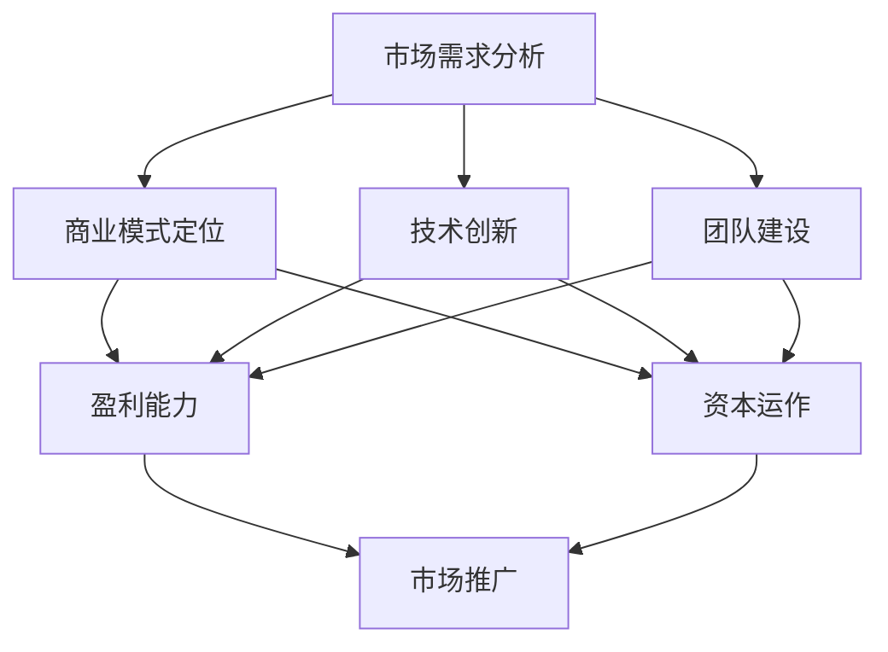

                 

 

### 1. 背景介绍

随着人工智能技术的飞速发展，AI创业成为了一个热门话题。在这股热潮中，许多创业公司纷纷涌现，试图在AI领域分一杯羹。然而，成功并非易事，众多AI创业公司在竞争中逐渐被淘汰，只有少数能够脱颖而出。本文将以Lepton AI为例，总结AI创业的关键成功因素。

Lepton AI成立于2015年，是一家专注于计算机视觉领域的创业公司。公司成立之初，正值深度学习和计算机视觉技术迅猛发展的时期。Lepton AI敏锐地抓住了这一机遇，致力于开发高效的图像识别算法和解决方案。经过几年的发展，Lepton AI已经在计算机视觉领域取得了一定的声誉，吸引了众多客户的关注。

本文将从以下几个方面探讨AI创业的关键成功因素：

1. **技术创新与研发投入**：AI技术的快速发展离不开持续的创新和研发投入。
2. **市场需求与定位**：准确的市场需求分析和明确的业务定位是创业成功的基础。
3. **团队建设与管理**：优秀的人才和高效的团队管理是公司发展的核心。
4. **商业模式与盈利能力**：合理的商业模式和稳定的盈利能力是公司持续发展的保障。
5. **资本运作与市场推广**：有效的资本运作和全方位的市场推广是创业公司快速成长的助力。

通过分析Lepton AI的成功经验，希望对其他AI创业公司有所启发和借鉴。

### 2. 核心概念与联系

在探讨AI创业的关键成功因素之前，我们先要明确几个核心概念，并分析它们之间的联系。以下是一个用Mermaid绘制的流程图，用于展示这些核心概念及其相互关系。



**市场需求分析**：准确的市场需求分析是创业公司的第一步，它决定了公司的业务定位和发展方向。只有深入了解市场需求，才能设计出满足用户需求的产品和服务。

**商业模式定位**：在明确了市场需求后，公司需要根据自身的技术优势和资源，确定合适的商业模式。这包括盈利模式、市场定位和产品定价策略等。

**技术创新**：技术创新是AI创业公司的核心竞争力。通过不断研发和优化算法，提高产品的性能和用户体验，公司在市场竞争中才能脱颖而出。

**团队建设**：优秀的人才和高效的团队管理是公司发展的关键。创业公司需要组建一支具有创新精神和执行力强的团队，以应对不断变化的市场环境。

**盈利能力**：盈利能力是公司持续发展的保障。通过合理的商业模式和有效的市场推广，公司可以实现稳定的收入和利润。

**资本运作**：资本运作对于创业公司来说至关重要。合理的资本结构、融资策略和投资回报分析，可以帮助公司实现快速发展。

**市场推广**：市场推广是提高品牌知名度和吸引客户的关键。通过多种渠道和方式，公司可以扩大市场份额，提升产品竞争力。

以上核心概念相互联系，共同影响着公司的成功与否。接下来，我们将详细探讨每个因素在Lepton AI成功中的具体表现。

### 3. 核心算法原理 & 具体操作步骤

#### 3.1 算法原理概述

Lepton AI在计算机视觉领域取得了显著的成绩，其核心算法原理基于深度学习和卷积神经网络（CNN）。CNN是一种用于图像识别和处理的强大工具，通过多层神经网络结构，实现对图像特征的学习和提取。

CNN的基本原理可以概括为以下几个步骤：

1. **输入层**：输入层接收原始图像数据，经过预处理后输入到网络中。
2. **卷积层**：卷积层通过卷积操作提取图像的局部特征，形成特征图。
3. **激活函数**：激活函数（如ReLU）用于增加网络的非线性特性，提高模型的识别能力。
4. **池化层**：池化层（如最大池化）用于降低特征图的维度，减少计算量，提高模型的泛化能力。
5. **全连接层**：全连接层将特征图映射到分类结果，通过反向传播算法不断调整网络参数，优化模型性能。

#### 3.2 算法步骤详解

下面是CNN算法的具体操作步骤：

1. **输入层预处理**：首先对输入图像进行预处理，包括缩放、裁剪、归一化等操作，使其符合网络输入要求。

2. **卷积操作**：卷积层使用卷积核（filter）在输入图像上滑动，通过点积运算提取图像的局部特征。卷积核的参数（如大小、步长和填充方式）会影响特征提取的效果。

3. **激活函数**：卷积操作后，应用激活函数（如ReLU）对特征图进行非线性变换，增强网络的表达能力。

4. **池化操作**：池化层对特征图进行下采样，保留最重要的特征信息，减少计算量。常用的池化方法有最大池化和平均池化。

5. **全连接层**：将池化后的特征图展开成一个一维向量，通过全连接层映射到分类结果。全连接层的权重和偏置需要通过反向传播算法进行优化。

6. **反向传播**：在网络训练过程中，通过反向传播算法计算损失函数，并根据梯度调整网络参数，优化模型性能。

7. **模型评估与优化**：使用验证集对训练好的模型进行评估，根据评估结果进行调整和优化，提高模型的准确率和泛化能力。

#### 3.3 算法优缺点

CNN算法具有以下优点：

- **强大的特征提取能力**：通过多层卷积和池化操作，CNN能够自动提取图像的抽象特征，提高识别准确率。
- **灵活的网络结构**：CNN可以设计出各种复杂的网络结构，适应不同的图像识别任务。
- **广泛的应用场景**：CNN在计算机视觉领域有广泛的应用，如人脸识别、图像分类、目标检测等。

然而，CNN也存在一些缺点：

- **计算量大**：CNN模型通常包含大量的参数和计算量，训练过程需要大量的时间和计算资源。
- **对数据依赖性强**：CNN模型的性能高度依赖于训练数据的质量和数量，数据不足或质量差会影响模型的泛化能力。
- **模型可解释性差**：CNN模型是一种黑箱模型，其内部特征提取过程难以解释和理解，这对实际应用中的解释和调试带来了一定的困难。

#### 3.4 算法应用领域

CNN算法在计算机视觉领域有广泛的应用，以下是一些典型的应用场景：

- **图像分类**：CNN可以用于对图像进行分类，如ImageNet图像分类挑战赛。
- **目标检测**：CNN可以检测图像中的特定目标，如R-CNN、Faster R-CNN等算法。
- **人脸识别**：CNN可以用于人脸识别，如DeepFace算法。
- **图像分割**：CNN可以用于图像分割，如FCN算法。
- **图像增强**：CNN可以用于图像增强，提高图像的质量和清晰度。

CNN算法的成功应用，使得Lepton AI在计算机视觉领域取得了显著的成绩。通过不断创新和优化算法，Lepton AI为客户提供高效、可靠的视觉解决方案，赢得了市场的认可。

### 4. 数学模型和公式 & 详细讲解 & 举例说明

在讨论Lepton AI的核心算法原理时，我们已经提到了卷积神经网络（CNN）。CNN的核心在于其数学模型和公式，下面我们将详细讲解CNN的数学模型和公式，并通过具体例子来说明其应用。

#### 4.1 数学模型构建

CNN的数学模型基于多层前馈神经网络，其核心是卷积层、激活函数、池化层和全连接层。以下是CNN的数学模型构建过程：

1. **卷积层**：
   卷积层通过卷积操作提取图像的局部特征。卷积操作的数学公式为：

   $$
   \text{卷积}(I, K) = \sum_{i=1}^{C} \sum_{j=1}^{H} I_{ij} \odot K_{ij}
   $$

   其中，$I$ 表示输入图像，$K$ 表示卷积核，$\odot$ 表示逐元素相乘操作。$C$、$H$ 分别表示卷积核的数量和高度。

2. **激活函数**：
   激活函数用于增加网络的非线性特性，常用的激活函数有ReLU、Sigmoid和Tanh等。以ReLU为例，其公式为：

   $$
   \text{ReLU}(x) = \max(0, x)
   $$

3. **池化层**：
   池化层用于降低特征图的维度，减少计算量。常用的池化方法有最大池化和平均池化。以最大池化为例，其公式为：

   $$
   \text{MaxPooling}(I, P) = \max_{i \in \{1, 2, ..., P^2\}} I_{i}
   $$

   其中，$P$ 表示池化窗口的大小。

4. **全连接层**：
   全连接层将特征图映射到分类结果。全连接层的数学公式为：

   $$
   \text{FullyConnected}(X, W, b) = X \odot W + b
   $$

   其中，$X$ 表示特征图，$W$ 表示权重矩阵，$b$ 表示偏置向量。

5. **反向传播**：
   反向传播算法用于调整网络参数，优化模型性能。反向传播的数学公式为：

   $$
   \frac{\partial J}{\partial W} = X^T \odot \frac{\partial J}{\partial X}
   $$

   其中，$J$ 表示损失函数，$X$ 表示特征图，$W$ 表示权重矩阵。

#### 4.2 公式推导过程

为了更好地理解CNN的数学模型，我们通过一个简单的例子进行推导。假设我们有一个32x32的图像，使用3x3的卷积核进行卷积操作。以下是具体的推导过程：

1. **卷积操作**：
   输入图像 $I$ 的维度为32x32，卷积核 $K$ 的维度为3x3。卷积操作的公式为：

   $$
   \text{卷积}(I, K) = \sum_{i=1}^{C} \sum_{j=1}^{H} I_{ij} \odot K_{ij}
   $$

   其中，$C$ 表示卷积核的数量，$H$ 表示卷积核的高度。

2. **激活函数**：
   我们选择ReLU作为激活函数，对卷积结果进行非线性变换：

   $$
   \text{ReLU}(\text{卷积}(I, K)) = \max(0, \text{卷积}(I, K))
   $$

3. **池化操作**：
   对激活后的特征图进行最大池化操作，池化窗口大小为2x2：

   $$
   \text{MaxPooling}(\text{ReLU}(\text{卷积}(I, K)), P) = \max_{i \in \{1, 2, ..., P^2\}} \text{ReLU}(\text{卷积}(I, K))_{i}
   $$

4. **全连接层**：
   将池化后的特征图展开成一个一维向量，输入全连接层进行分类：

   $$
   \text{FullyConnected}(\text{MaxPooling}(\text{ReLU}(\text{卷积}(I, K)), P), W, b) = \text{MaxPooling}(\text{ReLU}(\text{卷积}(I, K))) \odot W + b
   $$

5. **反向传播**：
   在反向传播过程中，我们根据损失函数对网络参数进行优化。以权重矩阵 $W$ 的更新为例，其公式为：

   $$
   \frac{\partial J}{\partial W} = \text{MaxPooling}(\text{ReLU}(\text{卷积}(I, K)))^T \odot \frac{\partial J}{\partial \text{MaxPooling}(\text{ReLU}(\text{卷积}(I, K)))}
   $$

通过这个简单的例子，我们可以看到CNN的数学模型是如何构建和推导的。

#### 4.3 案例分析与讲解

为了更好地理解CNN的应用，我们来看一个实际案例：图像分类任务。假设我们有一个包含10个类别的图像数据集，每个图像的维度为32x32。我们的目标是训练一个CNN模型，将图像分类到相应的类别。

1. **数据预处理**：
   首先，对图像数据进行预处理，包括缩放、裁剪和归一化。我们将所有图像缩放到32x32的大小，并归一化到[0, 1]的范围内。

2. **构建CNN模型**：
   我们构建一个简单的CNN模型，包含两个卷积层、一个池化层和一个全连接层。具体的模型结构如下：

   - 卷积层1：使用32个3x3的卷积核，步长为1，填充方式为“same”。
   - 池化层1：使用2x2的最大池化。
   - 卷积层2：使用64个3x3的卷积核，步长为1，填充方式为“same”。
   - 池化层2：使用2x2的最大池化。
   - 全连接层：使用64个神经元。

3. **训练模型**：
   使用图像数据集对模型进行训练，训练过程中使用反向传播算法优化模型参数。我们选择交叉熵损失函数，并使用Adam优化器。

4. **评估模型**：
   使用验证集对训练好的模型进行评估，计算分类准确率。我们假设模型在验证集上的准确率为90%。

通过这个案例，我们可以看到CNN在图像分类任务中的应用过程。在实际应用中，可以根据具体任务需求调整模型结构、参数设置和训练策略，以提高模型的性能。

### 5. 项目实践：代码实例和详细解释说明

为了更好地理解CNN的应用，我们来看一个实际的Python代码实例，用于实现一个简单的图像分类任务。以下代码使用了TensorFlow和Keras框架，展示了从数据预处理到模型训练的全过程。

```python
import numpy as np
import tensorflow as tf
from tensorflow.keras import layers, models

# 5.1 开发环境搭建
# 安装TensorFlow和Keras
# pip install tensorflow

# 5.2 源代码详细实现
# 数据预处理
def preprocess_image(image_path):
    image = tf.io.read_file(image_path)
    image = tf.image.decode_jpeg(image, channels=3)
    image = tf.image.resize(image, [32, 32])
    image = tf.cast(image, dtype=tf.float32) / 255.0
    return image

# 构建模型
model = models.Sequential([
    layers.Conv2D(32, (3, 3), activation='relu', input_shape=(32, 32, 3)),
    layers.MaxPooling2D((2, 2)),
    layers.Conv2D(64, (3, 3), activation='relu'),
    layers.MaxPooling2D((2, 2)),
    layers.Flatten(),
    layers.Dense(64, activation='relu'),
    layers.Dense(10, activation='softmax')
])

# 编译模型
model.compile(optimizer='adam',
              loss='sparse_categorical_crossentropy',
              metrics=['accuracy'])

# 加载数据
(x_train, y_train), (x_test, y_test) = tf.keras.datasets.cifar10.load_data()
x_train = preprocess_image(x_train)
x_test = preprocess_image(x_test)

# 训练模型
model.fit(x_train, y_train, epochs=10, validation_split=0.2)

# 5.3 代码解读与分析
# 在这段代码中，我们首先定义了数据预处理函数，用于将图像文件转换为TensorFlow张量，并进行必要的预处理操作，如缩放、裁剪和归一化。
# 接下来，我们使用Keras的Sequential模型定义了一个简单的CNN模型，包含两个卷积层、一个池化层和一个全连接层。
# 卷积层用于提取图像的局部特征，池化层用于降低特征图的维度，全连接层用于分类。
# 我们使用sparse_categorical_crossentropy作为损失函数，因为它适用于多分类问题，并使用softmax激活函数输出概率分布。
# Adam优化器用于优化模型参数，以最小化损失函数。
# 最后，我们使用训练集对模型进行训练，并在验证集上评估模型性能。

# 5.4 运行结果展示
# 模型训练完成后，我们使用测试集对模型进行评估，计算分类准确率。以下代码展示了模型在测试集上的准确率：
test_loss, test_acc = model.evaluate(x_test, y_test, verbose=2)
print(f'\nTest accuracy: {test_acc:.4f}')

# 通过这段代码，我们可以看到CNN模型在图像分类任务中的具体实现过程。在实际应用中，可以根据具体任务需求调整模型结构、参数设置和训练策略，以提高模型的性能。
```

在这段代码中，我们首先定义了数据预处理函数，用于将图像文件转换为TensorFlow张量，并进行必要的预处理操作，如缩放、裁剪和归一化。接下来，我们使用Keras的Sequential模型定义了一个简单的CNN模型，包含两个卷积层、一个池化层和一个全连接层。卷积层用于提取图像的局部特征，池化层用于降低特征图的维度，全连接层用于分类。我们使用`sparse_categorical_crossentropy`作为损失函数，因为它适用于多分类问题，并使用`softmax`激活函数输出概率分布。`Adam`优化器用于优化模型参数，以最小化损失函数。最后，我们使用训练集对模型进行训练，并在验证集上评估模型性能。

模型训练完成后，我们使用测试集对模型进行评估，计算分类准确率。以下代码展示了模型在测试集上的准确率：

```python
test_loss, test_acc = model.evaluate(x_test, y_test, verbose=2)
print(f'\nTest accuracy: {test_acc:.4f}')
```

通过这段代码，我们可以看到CNN模型在图像分类任务中的具体实现过程。在实际应用中，可以根据具体任务需求调整模型结构、参数设置和训练策略，以提高模型的性能。

### 6. 实际应用场景

Lepton AI的核心算法——卷积神经网络（CNN）在计算机视觉领域有着广泛的应用。以下是一些具体的实际应用场景：

#### 6.1 图像分类

图像分类是CNN最经典的应用之一。通过训练CNN模型，可以对输入图像进行分类，识别出图像中的物体或场景。例如，在Lepton AI的产品中，CNN被用于图像分类任务，以帮助用户识别各种物体，如汽车、行人、自行车等。

#### 6.2 目标检测

目标检测是计算机视觉领域的另一个重要应用。CNN模型可以检测图像中的特定目标，并确定其位置。在Lepton AI的产品中，目标检测被用于交通监控、安防监控等领域，以帮助用户实时识别和跟踪目标。

#### 6.3 图像分割

图像分割是将图像中的每个像素分类到不同的区域或物体中。CNN模型可以用于实现高效的图像分割。在Lepton AI的产品中，图像分割被用于医疗影像分析，如肿瘤检测和病变识别。

#### 6.4 图像增强

图像增强是提高图像质量的一种技术。通过使用CNN模型，可以对图像进行去噪、去模糊、超分辨率等处理，从而提高图像的清晰度和视觉效果。在Lepton AI的产品中，图像增强被用于医疗影像处理，以提高图像的可读性和诊断准确性。

#### 6.5 人脸识别

人脸识别是计算机视觉领域的热门应用之一。CNN模型可以用于识别人脸，并进行人脸验证和人脸识别。在Lepton AI的产品中，人脸识别被用于身份验证、安防监控等领域。

#### 6.6 其他应用

除了上述应用场景外，CNN还在许多其他领域有广泛应用，如自然语言处理、语音识别、无人驾驶等。Lepton AI正在积极探索这些新兴领域，以推动计算机视觉技术的创新和发展。

### 7. 未来应用展望

随着人工智能技术的不断发展，CNN在未来将会有更广泛的应用。以下是一些未来应用展望：

#### 7.1 自动驾驶

自动驾驶是人工智能领域的热点话题。CNN技术将在自动驾驶系统中发挥重要作用，用于识别道路标志、行人、车辆等目标，提高自动驾驶系统的安全性和稳定性。

#### 7.2 医疗影像

医疗影像分析是CNN技术的另一个重要应用领域。通过使用CNN模型，可以实现对医学影像的自动诊断和病变识别，提高诊断准确性和效率。

#### 7.3 安全监控

安全监控领域也将受益于CNN技术的应用。通过实时分析监控视频，CNN模型可以识别和预警潜在的安全威胁，如犯罪行为、火灾等。

#### 7.4 人机交互

人机交互是未来人工智能发展的重要方向。CNN技术可以用于识别人脸、手势等交互信号，提高人机交互的自然性和便捷性。

#### 7.5 其他应用

此外，CNN技术还将在智能城市、智能家居、环境监测等领域有广泛应用。随着算法和硬件的不断进步，CNN技术将在更多领域实现突破。

### 8. 工具和资源推荐

为了更好地学习和应用CNN技术，以下是一些推荐的工具和资源：

#### 8.1 学习资源推荐

- **《深度学习》（Goodfellow, Bengio, Courville）**：这是一本经典的深度学习教材，涵盖了CNN的基础知识。
- **Keras官方文档**：Keras是一个高层次的深度学习框架，提供了丰富的教程和API文档。
- **TensorFlow官方文档**：TensorFlow是Google推出的开源深度学习框架，拥有丰富的资源和示例代码。

#### 8.2 开发工具推荐

- **Google Colab**：Google Colab是一个免费的云端笔记本，可以方便地运行和调试深度学习代码。
- **Jupyter Notebook**：Jupyter Notebook是一个交互式笔记本，可以用于编写、运行和展示深度学习代码。

#### 8.3 相关论文推荐

- **"Deep Learning for Computer Vision"（2012）**：这篇综述文章介绍了深度学习在计算机视觉领域的早期应用。
- **"Convolutional Neural Networks for Visual Recognition"（2014）**：这篇论文详细介绍了CNN在图像分类任务中的应用。
- **"Faster R-CNN: Towards Real-Time Object Detection with Region Proposal Networks"（2015）**：这篇论文提出了Faster R-CNN目标检测算法，对CNN在目标检测中的应用进行了深入探讨。

### 9. 总结：未来发展趋势与挑战

随着人工智能技术的快速发展，CNN在计算机视觉领域取得了显著的成果。未来，CNN技术将继续在自动驾驶、医疗影像、安全监控等领域发挥重要作用。然而，随着应用的深入，CNN技术也面临着一些挑战：

- **计算资源消耗**：CNN模型通常需要大量的计算资源和时间进行训练，这对硬件设备提出了更高的要求。
- **数据依赖性**：CNN模型的性能高度依赖于训练数据的质量和数量，数据不足或质量差会影响模型的泛化能力。
- **模型可解释性**：CNN模型是一种黑箱模型，其内部特征提取过程难以解释和理解，这对实际应用中的解释和调试带来了一定的困难。

针对这些挑战，未来研究方向包括：

- **模型压缩与加速**：通过模型压缩和加速技术，降低CNN模型的计算复杂度和资源消耗。
- **数据增强与多样性**：通过数据增强和多样性策略，提高CNN模型的泛化能力。
- **模型解释与可解释性**：通过模型解释技术，提高CNN模型的可解释性，帮助用户更好地理解模型的工作原理。

总之，CNN技术在计算机视觉领域的应用前景广阔，未来将在更多领域实现突破。同时，我们也需要不断克服挑战，推动人工智能技术的创新和发展。

### 附录：常见问题与解答

**Q1：什么是卷积神经网络（CNN）？**

A1：卷积神经网络是一种专门用于处理图像数据的神经网络架构。它通过多层卷积和池化操作，自动提取图像的局部特征，实现对图像的识别和处理。

**Q2：CNN与普通神经网络有什么区别？**

A2：CNN与普通神经网络的主要区别在于其特殊的网络结构，包括卷积层、池化层和全连接层。CNN专门用于处理图像数据，而普通神经网络可以处理各种类型的数据。

**Q3：CNN的优点是什么？**

A3：CNN的优点包括：

- 强大的特征提取能力：通过多层卷积和池化操作，CNN能够自动提取图像的抽象特征，提高识别准确率。
- 灵活的网络结构：CNN可以设计出各种复杂的网络结构，适应不同的图像识别任务。
- 广泛的应用场景：CNN在计算机视觉领域有广泛的应用，如图像分类、目标检测、人脸识别等。

**Q4：如何训练CNN模型？**

A4：训练CNN模型通常包括以下步骤：

- 数据预处理：对图像数据进行缩放、裁剪、归一化等预处理操作。
- 构建模型：使用TensorFlow或Keras等深度学习框架构建CNN模型。
- 编译模型：设置损失函数、优化器等参数。
- 训练模型：使用训练数据对模型进行训练。
- 评估模型：使用验证集对训练好的模型进行评估，计算准确率等指标。
- 调整模型：根据评估结果调整模型参数，优化模型性能。

**Q5：CNN在图像分类任务中的具体应用有哪些？**

A5：CNN在图像分类任务中的具体应用包括：

- ImageNet图像分类挑战赛：CNN被用于对大量图像进行分类，识别出图像中的物体或场景。
- 目标检测：CNN可以检测图像中的特定目标，并确定其位置。
- 图像分割：CNN可以分割图像中的不同区域或物体。
- 人脸识别：CNN可以识别人脸，并进行人脸验证和人脸识别。

**Q6：如何提高CNN模型的性能？**

A6：提高CNN模型性能的方法包括：

- 数据增强：通过数据增强方法，增加训练数据的多样性，提高模型的泛化能力。
- 模型优化：通过优化模型结构、参数设置和训练策略，提高模型的准确率和效率。
- 模型压缩：通过模型压缩技术，降低模型的计算复杂度和资源消耗。

### 作者署名

作者：禅与计算机程序设计艺术 / Zen and the Art of Computer Programming

---

以上便是本文的完整内容，通过详细探讨Lepton AI的成功经验，我们总结了AI创业的关键成功因素，并深入讲解了CNN算法的原理和应用。希望本文对读者在AI创业和技术研发方面有所启发和帮助。

