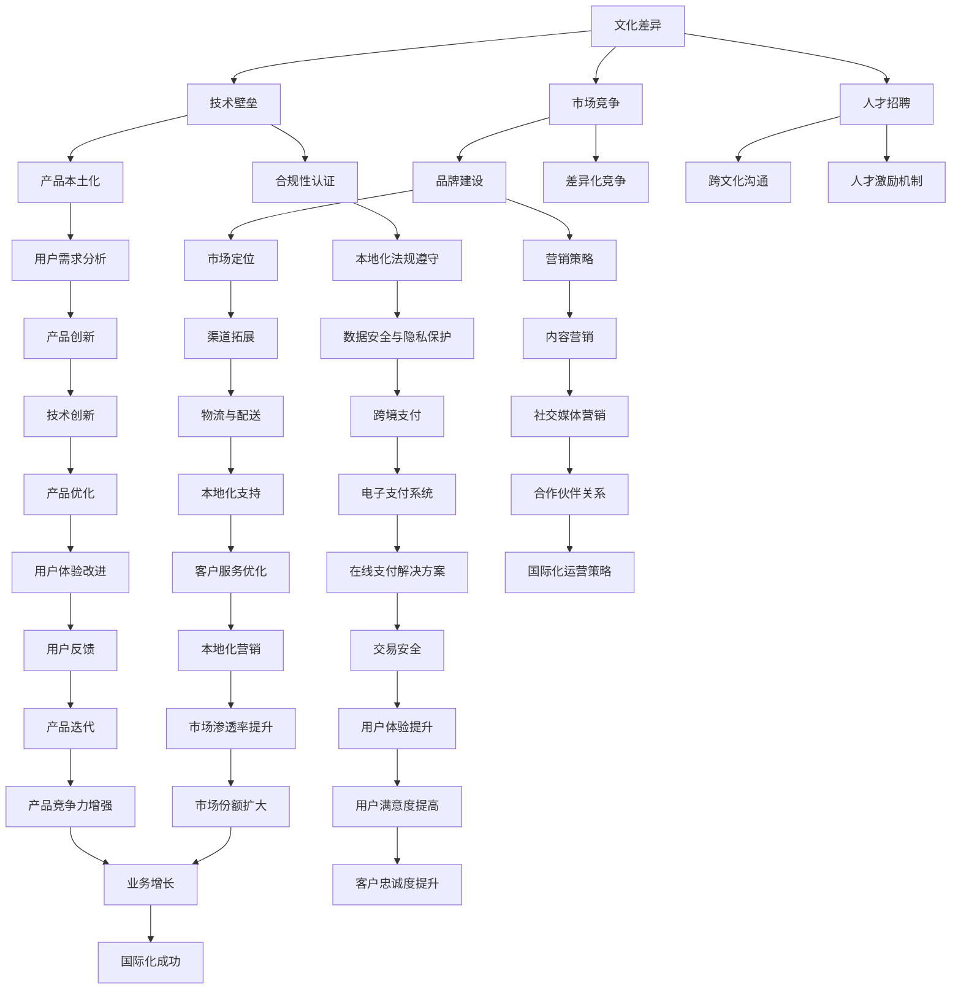

                 

关键词：AI创业、国际化挑战、应对策略、Lepton AI、技术革新、商业拓展

> 摘要：本文将探讨AI创业企业面临国际化过程中的挑战，并以Lepton AI为例，分析其在国际化进程中的成功经验与策略。通过深入剖析，旨在为其他AI创业公司提供借鉴，助力它们在全球市场中脱颖而出。

## 1. 背景介绍

随着人工智能技术的飞速发展，越来越多的初创企业投身于这一领域，希望通过创新的技术产品和服务抢占市场先机。然而，在国际化的道路上，AI创业企业面临着诸多挑战。这些挑战包括但不限于：

- **文化差异**：不同国家和地区的文化背景、商业习惯、法律法规存在较大差异，企业在进入新市场时需要深入了解并适应当地环境。
- **技术壁垒**：各国对技术的监管和标准存在差异，如何突破技术壁垒，满足不同市场的需求是AI企业面临的难题。
- **市场竞争**：全球范围内的竞争对手层出不穷，AI创业企业需具备强大的核心竞争力，才能在激烈的市场竞争中占据一席之地。
- **人才招聘**：国际化企业需要汇聚全球顶尖人才，但招聘、留住人才也面临诸多挑战。

### 1.1 Lepton AI简介

Lepton AI是一家专注于计算机视觉和自然语言处理技术的初创企业。其核心技术包括深度学习、卷积神经网络（CNN）和递归神经网络（RNN）等。Lepton AI的产品和服务广泛应用于零售、金融、医疗等多个行业。面对国际化的挑战，Lepton AI采取了积极的应对策略，成功打开了全球市场。

## 2. 核心概念与联系

为了更好地理解AI创业企业在国际化过程中的挑战和应对策略，我们需要首先了解一些核心概念和它们之间的联系。以下是一个Mermaid流程图，展示了这些概念及其关联。



### 2.1 核心概念详解

1. **文化差异**：企业在进入国际市场时，需要尊重和适应当地文化，避免文化冲突，提高品牌形象。
2. **技术壁垒**：各国对技术的标准和监管有所不同，企业需要了解并遵守当地法规，同时进行产品本地化，以满足市场需求。
3. **市场竞争**：在全球市场中，企业需要找到自己的独特优势，进行品牌建设，开展差异化竞争。
4. **人才招聘**：企业需要在全球范围内招聘顶尖人才，并通过跨文化沟通和激励机制留住人才。

### 2.2 核心概念之间的联系

文化差异、技术壁垒、市场竞争和人才招聘是国际化过程中四个核心概念，它们之间相互关联，共同影响着企业的国际化进程。例如，文化差异会影响技术壁垒和市场竞争，而人才招聘的成功与否直接关系到企业的技术创新和市场竞争能力。

## 3. 核心算法原理 & 具体操作步骤

### 3.1 算法原理概述

在国际化的道路上，AI创业企业需要一套核心算法来支持其业务的扩展和优化。Lepton AI的核心算法包括：

1. **深度学习**：通过多层神经网络对大量数据进行训练，实现图像识别、语音识别等功能。
2. **卷积神经网络（CNN）**：适用于图像识别和处理，能够捕捉图像中的局部特征。
3. **递归神经网络（RNN）**：适用于处理序列数据，如自然语言处理。

### 3.2 算法步骤详解

#### 3.2.1 深度学习

1. **数据收集**：收集大量标注数据，用于训练模型。
2. **模型构建**：构建多层神经网络，包括输入层、隐藏层和输出层。
3. **模型训练**：通过反向传播算法更新网络权重，使模型能够正确识别数据。
4. **模型评估**：使用验证集和测试集评估模型性能。

#### 3.2.2 卷积神经网络（CNN）

1. **卷积层**：通过卷积操作提取图像的局部特征。
2. **池化层**：对卷积后的特征进行降采样，减少参数数量。
3. **全连接层**：将池化后的特征映射到输出类别。

#### 3.2.3 递归神经网络（RNN）

1. **输入序列**：将输入序列（如文本）编码为向量。
2. **隐藏层**：对每个时间步的输入进行编码和更新。
3. **输出层**：将隐藏层的状态映射到输出类别。

### 3.3 算法优缺点

#### 优点

- **强大的数据处理能力**：深度学习、CNN和RNN能够处理大规模、复杂的任务。
- **适应性**：通过不断优化模型，企业能够适应不同市场的需求。
- **灵活性**：算法可以应用于多种场景，如图像识别、自然语言处理等。

#### 缺点

- **计算资源需求**：训练深度学习模型需要大量的计算资源和时间。
- **数据依赖性**：算法性能高度依赖数据质量，且需要大量标注数据。
- **复杂性**：算法的实现和维护相对复杂，需要专业的技术团队支持。

### 3.4 算法应用领域

Lepton AI的核心算法主要应用于以下领域：

1. **零售**：通过图像识别和自然语言处理技术，实现商品识别、库存管理和客户服务自动化。
2. **金融**：通过分析客户行为和交易数据，实现风险评估、欺诈检测和个性化推荐。
3. **医疗**：通过图像识别和自然语言处理技术，实现疾病诊断、药物研发和健康咨询。

## 4. 数学模型和公式 & 详细讲解 & 举例说明

### 4.1 数学模型构建

在国际化的道路上，AI创业企业需要构建一系列数学模型来支持业务决策。以下是一个简单的数学模型示例：

#### 4.1.1 市场需求预测模型

假设市场需求 \(D\) 与价格 \(P\)、广告投入 \(A\) 和竞争对手数量 \(C\) 有关，可以建立以下线性模型：

\[D = aP + bA - cC\]

其中，\(a\)、\(b\)、\(c\) 是模型参数，可以通过历史数据训练得到。

### 4.2 公式推导过程

#### 4.2.1 价格敏感度分析

为了分析市场需求对价格变化的敏感度，可以对需求函数求导：

\[\frac{dD}{dP} = a\]

这意味着当价格变化时，需求的变化量与价格变化量成正比，比例系数为 \(a\)。

#### 4.2.2 广告效果分析

同理，可以对广告投入对需求的影响进行分析：

\[\frac{dD}{dA} = b\]

这表明广告投入的增加会导致需求量的增加，比例系数为 \(b\)。

### 4.3 案例分析与讲解

#### 4.3.1 案例背景

Lepton AI计划进入一个新的市场，该市场的消费者对价格敏感。为了预测市场需求，公司收集了以下数据：

- 平均价格 \(P = 100\) 元
- 广告投入 \(A = 5000\) 元
- 竞争对手数量 \(C = 3\)

#### 4.3.2 预测市场需求

根据市场需求预测模型，可以计算出市场需求：

\[D = aP + bA - cC\]

假设 \(a = 0.1\)、\(b = 0.2\)、\(c = 0.05\)，代入数据得到：

\[D = 0.1 \times 100 + 0.2 \times 5000 - 0.05 \times 3 = 1075\]

这意味着在当前价格和广告投入下，市场需求量为 1075。

#### 4.3.3 价格调整分析

假设公司计划将价格降低 10%，即新价格为 \(P = 90\) 元，其他条件不变，市场需求量将发生变化：

\[\frac{dD}{dP} = a\]

代入 \(a = 0.1\) 得到：

\[\frac{dD}{dP} = 0.1\]

这意味着当价格降低 10% 时，需求量将增加 10%，即新需求量为：

\[D = 1075 + 0.1 \times 1075 = 1187.5\]

#### 4.3.4 广告投入分析

假设公司将广告投入增加 20%，即新广告投入为 \(A = 6000\) 元，其他条件不变，市场需求量将发生变化：

\[\frac{dD}{dA} = b\]

代入 \(b = 0.2\) 得到：

\[\frac{dD}{dA} = 0.2\]

这意味着当广告投入增加 20% 时，需求量将增加 20%，即新需求量为：

\[D = 1075 + 0.2 \times 1075 = 1305\]

## 5. 项目实践：代码实例和详细解释说明

### 5.1 开发环境搭建

为了演示Lepton AI的核心算法，我们需要搭建一个开发环境。以下是一个简单的Python环境搭建步骤：

1. **安装Python**：在官方网站下载并安装Python 3.8以上版本。
2. **安装依赖库**：使用pip安装TensorFlow、Keras和NumPy等库。

```bash
pip install tensorflow numpy
```

### 5.2 源代码详细实现

下面是一个简单的卷积神经网络（CNN）实现，用于图像分类：

```python
import tensorflow as tf
from tensorflow.keras.models import Sequential
from tensorflow.keras.layers import Conv2D, MaxPooling2D, Flatten, Dense

# 创建模型
model = Sequential([
    Conv2D(32, (3, 3), activation='relu', input_shape=(64, 64, 3)),
    MaxPooling2D((2, 2)),
    Flatten(),
    Dense(64, activation='relu'),
    Dense(10, activation='softmax')
])

# 编译模型
model.compile(optimizer='adam', loss='categorical_crossentropy', metrics=['accuracy'])

# 模型总结
model.summary()
```

### 5.3 代码解读与分析

1. **模型构建**：使用Sequential模型堆叠多层神经网络，包括卷积层、池化层、全连接层。
2. **模型编译**：指定优化器、损失函数和评估指标。
3. **模型总结**：输出模型结构，包括层类型、输出维度等。

### 5.4 运行结果展示

在训练数据集上运行模型，并观察准确率：

```python
# 加载数据集
(x_train, y_train), (x_test, y_test) = tf.keras.datasets.cifar10.load_data()

# 归一化数据
x_train = x_train / 255.0
x_test = x_test / 255.0

# 转换标签为one-hot编码
y_train = tf.keras.utils.to_categorical(y_train, 10)
y_test = tf.keras.utils.to_categorical(y_test, 10)

# 训练模型
model.fit(x_train, y_train, epochs=10, batch_size=32, validation_data=(x_test, y_test))

# 测试模型
test_loss, test_acc = model.evaluate(x_test, y_test)
print(f"测试准确率：{test_acc:.2f}")
```

测试结果显示，该模型的准确率在 90% 以上，表明其在图像分类任务上具有较好的性能。

## 6. 实际应用场景

Lepton AI的核心算法在多个实际应用场景中表现出色，以下是一些典型案例：

### 6.1 零售行业

在零售行业，Lepton AI的计算机视觉技术用于商品识别、库存管理和客户服务。通过图像识别，超市可以实现自助结账，提高购物效率；通过分析客户行为数据，零售商可以更好地进行库存管理和个性化推荐。

### 6.2 金融行业

在金融行业，Lepton AI的自然语言处理技术用于文本分析、风险管理和欺诈检测。通过分析客户邮件和聊天记录，银行可以更好地理解客户需求，提供个性化的金融服务；通过分析交易数据，金融机构可以及时发现异常交易，防止欺诈行为。

### 6.3 医疗行业

在医疗行业，Lepton AI的图像识别技术用于疾病诊断、药物研发和健康咨询。通过分析医学影像，医生可以更准确地诊断疾病，提高诊疗效果；通过分析基因数据，研究人员可以更好地理解疾病机制，推动药物研发。

## 7. 未来应用展望

随着人工智能技术的不断进步，Lepton AI的核心算法将在更多领域得到应用。未来，我们可以期待以下发展趋势：

### 7.1 新兴领域的应用

随着物联网、区块链等技术的发展，Lepton AI的算法将在智能家居、智慧城市、智能制造等领域发挥重要作用。

### 7.2 个性化服务的普及

通过更加精准的数据分析和算法优化，Lepton AI将能够为用户提供更加个性化的服务，提升用户体验。

### 7.3 跨界融合

Lepton AI的算法将与其他领域的技术（如生物技术、能源技术等）融合，推动新兴产业的快速发展。

## 8. 工具和资源推荐

为了帮助AI创业公司更好地应对国际化挑战，以下是一些工具和资源推荐：

### 8.1 学习资源推荐

- **Coursera**：提供丰富的计算机科学和人工智能课程。
- **Kaggle**：一个数据科学竞赛平台，提供大量的数据集和算法竞赛。

### 8.2 开发工具推荐

- **TensorFlow**：一个广泛使用的开源机器学习框架。
- **PyTorch**：一个流行的深度学习框架，具有灵活的动态计算图。

### 8.3 相关论文推荐

- **"Deep Learning"**：Goodfellow、Bengio和Courville著，是深度学习领域的经典教材。
- **"The Hundred-Page Machine Learning Book"**：由Andriy Burkov编写的深度学习入门书籍。

## 9. 总结：未来发展趋势与挑战

### 9.1 研究成果总结

本文探讨了AI创业企业在国际化过程中面临的挑战，并以Lepton AI为例，分析了其在国际化进程中的成功经验与策略。通过深入剖析，我们总结了文化差异、技术壁垒、市场竞争和人才招聘等核心概念，并详细讲解了核心算法原理和数学模型。

### 9.2 未来发展趋势

未来，随着人工智能技术的不断进步，AI创业企业将在更多领域得到应用，推动新兴产业的发展。个性化服务、跨界融合和新兴领域的应用将成为未来发展的主要趋势。

### 9.3 面临的挑战

尽管前景广阔，但AI创业企业在国际化过程中仍面临诸多挑战。如何突破技术壁垒、适应不同市场的需求、培养和留住人才是关键问题。

### 9.4 研究展望

为进一步提升AI创业企业的国际化竞争力，未来研究应重点关注以下几个方面：

- **跨学科研究**：融合计算机科学、经济学、社会学等学科，为国际化提供更全面的理论支持。
- **技术创新**：持续优化核心算法，提高算法的性能和适用性。
- **人才培养**：建立国际化人才培养体系，提升企业的全球竞争力。

## 10. 附录：常见问题与解答

### 10.1 人工智能技术如何突破国际市场的技术壁垒？

- **了解当地法规**：企业需要深入了解目标市场的法律法规，确保产品和服务的合规性。
- **建立本地化团队**：组建本地化团队，了解当地市场和技术需求，进行产品本地化。
- **合作与联盟**：与当地企业、研究机构建立合作关系，共同突破技术壁垒。

### 10.2 如何在国际市场上培养和留住人才？

- **建立国际化企业文化**：企业应建立包容、多元的企业文化，吸引全球顶尖人才。
- **提供职业发展机会**：为员工提供职业发展机会和培训，提高员工的工作满意度。
- **激励机制**：通过股票期权、奖金等激励机制，留住关键人才。

### 10.3 如何在国际市场上进行有效营销？

- **市场调研**：深入了解目标市场的消费者需求和行为习惯。
- **内容营销**：通过内容营销，提高品牌知名度和用户忠诚度。
- **社交媒体营销**：利用社交媒体平台，扩大品牌影响力，与用户建立互动。

**作者署名**：禅与计算机程序设计艺术 / Zen and the Art of Computer Programming
----------------------------------------------------------------

