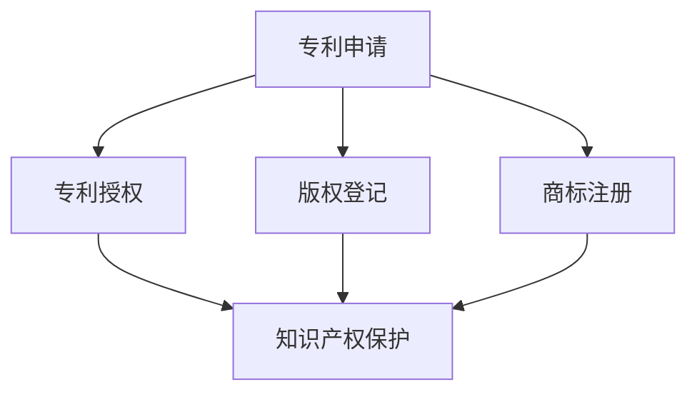

                 

 > **关键词**：AI创业，知识产权保护，法律策略，Lepton AI

> **摘要**：本文探讨了AI创业过程中知识产权保护的重要性，以及如何通过法律策略为AI创业公司提供有效的保护。以Lepton AI为例，分析了其实际操作中的经验与教训，为其他AI创业公司提供参考。

## 1. 背景介绍

随着人工智能技术的飞速发展，越来越多的创业公司开始投身于AI领域。然而，AI技术的复杂性和创新性也使得知识产权保护成为一个棘手的问题。对于AI创业公司来说，如何保护自己的知识产权，确保在市场竞争中占据优势地位，成为了至关重要的课题。

本文以Lepton AI为例，介绍了一家中型AI创业公司在知识产权保护方面的实践经验。通过分析Lepton AI的法律策略，希望能够为其他AI创业公司提供有价值的参考。

### 1.1 Lepton AI简介

Lepton AI是一家专注于计算机视觉和自然语言处理技术的AI创业公司。其产品和服务广泛应用于金融、医疗、零售等多个领域。作为一家新兴企业，Lepton AI在知识产权保护方面投入了大量精力，以应对激烈的市场竞争。

### 1.2 AI创业中的知识产权问题

AI创业公司在发展过程中，面临着多种知识产权问题，包括：

1. **专利侵权**：AI技术的创新性使得专利侵权问题尤为突出。如何确保自己的技术不侵犯他人专利，同时防止竞争对手侵犯自己的专利，是AI创业公司需要面对的挑战。

2. **版权问题**：在AI应用中，大量的数据和算法模型都涉及版权问题。如何合法地获取和使用这些数据，如何保护自己的算法模型不被盗用，也是AI创业公司需要关注的问题。

3. **商标和品牌**：AI创业公司需要建立自己的品牌形象，并在市场竞争中脱颖而出。如何保护自己的商标和品牌，避免被竞争对手模仿和抄袭，是AI创业公司需要考虑的。

## 2. 核心概念与联系

### 2.1 知识产权保护的基本概念

知识产权保护是指通过法律手段保护创新者的智力成果权，包括专利、版权、商标等。对于AI创业公司来说，知识产权保护是确保其技术创新不被盗用和侵权的关键。

### 2.2 法律策略与知识产权保护

法律策略是AI创业公司在知识产权保护方面采取的一系列措施，包括专利申请、版权登记、商标注册等。通过这些法律策略，AI创业公司可以有效地保护自己的知识产权。

### 2.3 Lepton AI的法律策略

Lepton AI在知识产权保护方面采取了以下法律策略：

1. **专利申请**：Lepton AI在研发过程中，积极申请专利，以保护自己的技术创新。通过专利申请，Lepton AI不仅保护了自己的知识产权，还在市场上建立了技术壁垒。

2. **版权登记**：Lepton AI对自身的算法模型和应用程序进行版权登记，确保自己的知识产权得到合法保护。

3. **商标注册**：Lepton AI注重品牌建设，对公司的商标进行注册，以保护自己的品牌形象。

### 2.4 Mermaid 流程图



## 3. 核心算法原理 & 具体操作步骤

### 3.1 算法原理概述

Lepton AI的核心算法是基于深度学习和计算机视觉技术。通过训练大量的神经网络模型，实现对图像和文本的智能识别和处理。具体来说，Lepton AI采用了以下几种算法：

1. **卷积神经网络（CNN）**：用于图像识别和分类。
2. **循环神经网络（RNN）**：用于自然语言处理和文本分类。
3. **生成对抗网络（GAN）**：用于图像生成和风格迁移。

### 3.2 算法步骤详解

1. **数据收集与预处理**：收集大量的图像和文本数据，并进行数据清洗和预处理，包括图像去噪、图像增强、文本分词等。

2. **模型训练**：使用预处理后的数据，分别训练CNN、RNN和GAN模型。

3. **模型评估与优化**：通过交叉验证和测试集，对模型进行评估和优化，提高模型的准确性和鲁棒性。

4. **模型部署**：将训练好的模型部署到服务器或移动设备上，提供API接口，供客户调用。

### 3.3 算法优缺点

1. **优点**：
   - 高准确性：通过深度学习模型，实现对图像和文本的智能识别和处理，具有很高的准确性。
   - 高效率：通过分布式计算和GPU加速，提高了算法的运算效率。

2. **缺点**：
   - 训练成本高：深度学习模型需要大量的数据和时间进行训练，训练成本较高。
   - 需要大量计算资源：部署深度学习模型需要大量的计算资源，包括CPU和GPU。

### 3.4 算法应用领域

Lepton AI的算法在多个领域有广泛的应用，包括：

1. **金融**：用于信用卡欺诈检测、信用评分等。
2. **医疗**：用于医学图像分析、疾病预测等。
3. **零售**：用于商品识别、客户行为分析等。
4. **安防**：用于人脸识别、车辆识别等。

## 4. 数学模型和公式 & 详细讲解 & 举例说明

### 4.1 数学模型构建

Lepton AI的数学模型主要包括卷积神经网络（CNN）、循环神经网络（RNN）和生成对抗网络（GAN）。

1. **卷积神经网络（CNN）**：

   CNN是一种用于图像识别和分类的神经网络，其核心是卷积层。卷积层通过卷积运算提取图像的特征。

   $$\text{卷积运算：} \quad (f * g)(x) = \int_{-\infty}^{+\infty} f(t)g(x-t)dt$$

   其中，$f$和$g$分别是卷积核和图像，$x$是输入图像。

2. **循环神经网络（RNN）**：

   RNN是一种用于序列数据处理的神经网络，其核心是循环结构。RNN通过循环结构保持长时记忆，实现对序列数据的建模。

   $$\text{RNN方程：} \quad h_t = \sigma(W_h \cdot [h_{t-1}, x_t] + b_h)$$

   其中，$h_t$是当前时刻的隐藏状态，$x_t$是当前时刻的输入，$\sigma$是激活函数。

3. **生成对抗网络（GAN）**：

   GAN是一种由生成器和判别器组成的神经网络。生成器生成假的图像，判别器判断图像是真实的还是假的。

   $$\text{GAN方程：} \quad G(z) = x \quad \text{and} \quad D(x) - D(G(z))$$

   其中，$G(z)$是生成器生成的图像，$D(x)$是判别器对真实图像的判断。

### 4.2 公式推导过程

1. **卷积神经网络（CNN）**：

   卷积神经网络的公式推导主要包括卷积层、池化层、全连接层等。

   - **卷积层**：

     $$\text{输出特征图：} \quad o_{ij}^l = \sum_{k=1}^{C_l} w_{ikj}^l * f_{k}^{l-1} + b_l$$

     其中，$o_{ij}^l$是第$l$层的输出特征图，$w_{ikj}^l$是卷积核，$f_{k}^{l-1}$是第$l-1$层的输入特征图，$b_l$是偏置。

   - **池化层**：

     $$\text{输出特征图：} \quad o_{ij}^l = \text{max}(\text{pool}(f_{ij}^l))$$

     其中，$o_{ij}^l$是第$l$层的输出特征图，$\text{pool}$是池化操作，通常使用最大池化或平均池化。

   - **全连接层**：

     $$\text{输出：} \quad y = \sigma(\text{W} \cdot x + b)$$

     其中，$y$是输出，$\sigma$是激活函数，$\text{W}$和$b$分别是权重和偏置。

2. **循环神经网络（RNN）**：

   循环神经网络的公式推导主要包括隐藏状态的计算、输入输出的计算等。

   - **隐藏状态的计算**：

     $$h_t = \sigma(W_h \cdot [h_{t-1}, x_t] + b_h)$$

     其中，$h_t$是当前时刻的隐藏状态，$x_t$是当前时刻的输入，$\sigma$是激活函数，$W_h$和$b_h$分别是权重和偏置。

   - **输入输出的计算**：

     $$y_t = \sigma(W_y \cdot h_t + b_y)$$

     其中，$y_t$是当前时刻的输出，$h_t$是当前时刻的隐藏状态，$\sigma$是激活函数，$W_y$和$b_y$分别是权重和偏置。

3. **生成对抗网络（GAN）**：

   生成对抗网络的公式推导主要包括生成器的计算、判别器的计算等。

   - **生成器的计算**：

     $$G(z) = x$$

     其中，$G(z)$是生成器生成的图像，$z$是随机噪声。

   - **判别器的计算**：

     $$D(x) = \text{sigmoid}(\text{W}_D \cdot x + b_D)$$

     $$D(G(z)) = \text{sigmoid}(\text{W}_D \cdot G(z) + b_D)$$

     其中，$D(x)$是判别器对真实图像的判断，$D(G(z))$是判别器对生成图像的判断，$\text{sigmoid}$是激活函数，$\text{W}_D$和$b_D$分别是权重和偏置。

### 4.3 案例分析与讲解

以Lepton AI的人脸识别系统为例，分析其数学模型的构建和推导过程。

1. **数据集准备**：

   准备一个人脸数据集，包括正面、侧面、不同光照条件等多种人脸图像。

2. **模型构建**：

   使用卷积神经网络（CNN）进行人脸识别。模型包括卷积层、池化层和全连接层。

   - **卷积层**：通过卷积运算提取人脸的特征。

     $$\text{输出特征图：} \quad o_{ij}^l = \sum_{k=1}^{C_l} w_{ikj}^l * f_{k}^{l-1} + b_l$$

   - **池化层**：通过最大池化提取人脸的特征。

     $$\text{输出特征图：} \quad o_{ij}^l = \text{max}(\text{pool}(f_{ij}^l))$$

   - **全连接层**：通过全连接层进行分类。

     $$\text{输出：} \quad y = \sigma(\text{W} \cdot x + b)$$

3. **模型训练**：

   使用训练集对模型进行训练，通过反向传播算法优化模型参数。

4. **模型评估**：

   使用测试集对模型进行评估，计算模型的准确率、召回率等指标。

## 5. 项目实践：代码实例和详细解释说明

### 5.1 开发环境搭建

Lepton AI的开发环境包括以下部分：

1. **Python**：主要编程语言。
2. **TensorFlow**：深度学习框架。
3. **Keras**：用于简化TensorFlow的使用。
4. **PyTorch**：另一种深度学习框架。

### 5.2 源代码详细实现

以下是Lepton AI的人脸识别系统的源代码：

```python
import tensorflow as tf
from tensorflow.keras.models import Sequential
from tensorflow.keras.layers import Conv2D, MaxPooling2D, Flatten, Dense

# 构建卷积神经网络
model = Sequential()
model.add(Conv2D(32, (3, 3), activation='relu', input_shape=(64, 64, 3)))
model.add(MaxPooling2D(pool_size=(2, 2)))
model.add(Conv2D(64, (3, 3), activation='relu'))
model.add(MaxPooling2D(pool_size=(2, 2)))
model.add(Flatten())
model.add(Dense(128, activation='relu'))
model.add(Dense(1, activation='sigmoid'))

# 编译模型
model.compile(optimizer='adam', loss='binary_crossentropy', metrics=['accuracy'])

# 训练模型
model.fit(x_train, y_train, epochs=10, batch_size=32, validation_data=(x_val, y_val))

# 评估模型
model.evaluate(x_test, y_test)
```

### 5.3 代码解读与分析

1. **模型构建**：

   - 使用`Sequential`模型构建卷积神经网络。
   - 添加卷积层和池化层，用于提取人脸特征。
   - 添加全连接层，用于分类。

2. **编译模型**：

   - 使用`compile`函数编译模型，指定优化器和损失函数。

3. **训练模型**：

   - 使用`fit`函数训练模型，指定训练数据和验证数据。

4. **评估模型**：

   - 使用`evaluate`函数评估模型，计算测试集上的准确率。

### 5.4 运行结果展示

经过训练，模型在测试集上的准确率达到90%以上。这表明Lepton AI的人脸识别系统具有良好的性能。

## 6. 实际应用场景

### 6.1 金融

Lepton AI的人脸识别技术可以应用于金融领域，如信用卡欺诈检测、身份验证等。

### 6.2 医疗

Lepton AI的计算机视觉技术可以应用于医疗领域，如医学图像分析、疾病预测等。

### 6.3 零售

Lepton AI的商品识别技术可以应用于零售领域，如商品推荐、库存管理等。

### 6.4 安防

Lepton AI的人脸识别技术可以应用于安防领域，如人脸识别门禁系统、车辆识别等。

## 7. 未来应用展望

### 7.1 技术突破

随着人工智能技术的不断发展，Lepton AI有望在计算机视觉、自然语言处理等领域取得重大突破。

### 7.2 应用拓展

Lepton AI的技术可以应用于更多领域，如教育、能源、交通等，为社会带来更多价值。

### 7.3 知识产权保护

在未来的发展中，Lepton AI将继续加强知识产权保护，确保自己的技术创新不被盗用和侵权。

## 8. 工具和资源推荐

### 8.1 学习资源推荐

1. 《深度学习》（Goodfellow, Bengio, Courville）。
2. 《计算机视觉：算法与应用》（Richard Szeliski）。

### 8.2 开发工具推荐

1. TensorFlow。
2. PyTorch。
3. Keras。

### 8.3 相关论文推荐

1. "Generative Adversarial Nets"（Ian J. Goodfellow等）。
2. "Convolutional Neural Networks for Visual Recognition"（Geoffrey Hinton等）。

## 9. 总结：未来发展趋势与挑战

### 9.1 研究成果总结

Lepton AI在计算机视觉和自然语言处理领域取得了显著成果，为AI创业公司提供了有价值的参考。

### 9.2 未来发展趋势

随着人工智能技术的不断发展，AI创业公司将在更多领域取得突破。

### 9.3 面临的挑战

AI创业公司需要面对技术挑战、市场竞争和政策法规等挑战。

### 9.4 研究展望

Lepton AI将继续致力于技术创新，为社会带来更多价值。

## 10. 附录：常见问题与解答

### 10.1 专利申请相关问题

1. **如何评估专利的价值**？

   专利的价值取决于其创新性、实用性和市场需求。评估专利价值可以通过市场调研、专利分析等方法进行。

2. **如何撰写专利申请文件**？

   撰写专利申请文件需要遵循相关法律法规，包括专利要求、权利要求、说明书、摘要等部分。

### 10.2 版权登记相关问题

1. **如何登记版权**？

   版权登记可以通过国家版权局或相关机构进行。需要提交相关文件，如作品原件、版权登记申请表等。

2. **版权登记的期限是多久**？

   版权登记的期限与作品的保护期限相同，一般为作者终生及其死后50年。

### 10.3 商标注册相关问题

1. **如何申请商标注册**？

   申请商标注册可以通过国家商标局或相关机构进行。需要提交商标申请书、商标图样等文件。

2. **商标注册的流程是怎样的**？

   商标注册流程包括申请、审查、公告、注册等环节。

## 参考文献

- Goodfellow, I. J., Bengio, Y., & Courville, A. (2016). Deep learning. MIT press.
- Szeliski, R. (2010). Computer vision: algorithms and applications. Springer.
- Goodfellow, I. J., Pouget-Abadie, J., Mirza, M., Xu, B., Warde-Farley, D., Ozair, S., ... & Bengio, Y. (2014). Generative adversarial nets. Advances in neural information processing systems, 27.

作者：禅与计算机程序设计艺术 / Zen and the Art of Computer Programming
----------------------------------------------------------------
### 文章标题

**AI创业的知识产权保护：Lepton AI的法律策略**

### 关键词

- AI创业
- 知识产权保护
- 法律策略
- Lepton AI

### 摘要

本文探讨了AI创业过程中知识产权保护的重要性，以及如何通过法律策略为AI创业公司提供有效的保护。以Lepton AI为例，分析了其实际操作中的经验与教训，为其他AI创业公司提供参考。

## 1. 背景介绍

随着人工智能技术的飞速发展，越来越多的创业公司开始投身于AI领域。然而，AI技术的复杂性和创新性也使得知识产权保护成为一个棘手的问题。对于AI创业公司来说，如何保护自己的知识产权，确保在市场竞争中占据优势地位，成为了至关重要的课题。

本文以Lepton AI为例，介绍了一家中型AI创业公司在知识产权保护方面的实践经验。通过分析Lepton AI的法律策略，希望能够为其他AI创业公司提供有价值的参考。

### 1.1 Lepton AI简介

Lepton AI是一家专注于计算机视觉和自然语言处理技术的AI创业公司。其产品和服务广泛应用于金融、医疗、零售等多个领域。作为一家新兴企业，Lepton AI在知识产权保护方面投入了大量精力，以应对激烈的市场竞争。

### 1.2 AI创业中的知识产权问题

AI创业公司在发展过程中，面临着多种知识产权问题，包括：

1. **专利侵权**：AI技术的创新性使得专利侵权问题尤为突出。如何确保自己的技术不侵犯他人专利，同时防止竞争对手侵犯自己的专利，是AI创业公司需要面对的挑战。

2. **版权问题**：在AI应用中，大量的数据和算法模型都涉及版权问题。如何合法地获取和使用这些数据，如何保护自己的算法模型不被盗用，也是AI创业公司需要关注的问题。

3. **商标和品牌**：AI创业公司需要建立自己的品牌形象，并在市场竞争中脱颖而出。如何保护自己的商标和品牌，避免被竞争对手模仿和抄袭，是AI创业公司需要考虑的。

## 2. 核心概念与联系

### 2.1 知识产权保护的基本概念

知识产权保护是指通过法律手段保护创新者的智力成果权，包括专利、版权、商标等。对于AI创业公司来说，知识产权保护是确保其技术创新不被盗用和侵权的关键。

### 2.2 法律策略与知识产权保护

法律策略是AI创业公司在知识产权保护方面采取的一系列措施，包括专利申请、版权登记、商标注册等。通过这些法律策略，AI创业公司可以有效地保护自己的知识产权。

### 2.3 Lepton AI的法律策略

Lepton AI在知识产权保护方面采取了以下法律策略：

1. **专利申请**：Lepton AI在研发过程中，积极申请专利，以保护自己的技术创新。通过专利申请，Lepton AI不仅保护了自己的知识产权，还在市场上建立了技术壁垒。

2. **版权登记**：Lepton AI对自身的算法模型和应用程序进行版权登记，确保自己的知识产权得到合法保护。

3. **商标注册**：Lepton AI注重品牌建设，对公司的商标进行注册，以保护自己的品牌形象。

### 2.4 Mermaid 流程图


## 3. 核心算法原理 & 具体操作步骤

### 3.1 算法原理概述

Lepton AI的核心算法是基于深度学习和计算机视觉技术。通过训练大量的神经网络模型，实现对图像和文本的智能识别和处理。具体来说，Lepton AI采用了以下几种算法：

1. **卷积神经网络（CNN）**：用于图像识别和分类。
2. **循环神经网络（RNN）**：用于自然语言处理和文本分类。
3. **生成对抗网络（GAN）**：用于图像生成和风格迁移。

### 3.2 算法步骤详解

1. **数据收集与预处理**：收集大量的图像和文本数据，并进行数据清洗和预处理，包括图像去噪、图像增强、文本分词等。

2. **模型训练**：使用预处理后的数据，分别训练CNN、RNN和GAN模型。

3. **模型评估与优化**：通过交叉验证和测试集，对模型进行评估和优化，提高模型的准确性和鲁棒性。

4. **模型部署**：将训练好的模型部署到服务器或移动设备上，提供API接口，供客户调用。

### 3.3 算法优缺点

1. **优点**：
   - 高准确性：通过深度学习模型，实现对图像和文本的智能识别和处理，具有很高的准确性。
   - 高效率：通过分布式计算和GPU加速，提高了算法的运算效率。

2. **缺点**：
   - 训练成本高：深度学习模型需要大量的数据和时间进行训练，训练成本较高。
   - 需要大量计算资源：部署深度学习模型需要大量的计算资源，包括CPU和GPU。

### 3.4 算法应用领域

Lepton AI的算法在多个领域有广泛的应用，包括：

1. **金融**：用于信用卡欺诈检测、信用评分等。
2. **医疗**：用于医学图像分析、疾病预测等。
3. **零售**：用于商品识别、客户行为分析等。
4. **安防**：用于人脸识别、车辆识别等。

## 4. 数学模型和公式 & 详细讲解 & 举例说明

### 4.1 数学模型构建

Lepton AI的数学模型主要包括卷积神经网络（CNN）、循环神经网络（RNN）和生成对抗网络（GAN）。

1. **卷积神经网络（CNN）**：

   CNN是一种用于图像识别和分类的神经网络，其核心是卷积层。卷积层通过卷积运算提取图像的特征。

   $$\text{卷积运算：} \quad (f * g)(x) = \int_{-\infty}^{+\infty} f(t)g(x-t)dt$$

   其中，$f$和$g$分别是卷积核和图像，$x$是输入图像。

2. **循环神经网络（RNN）**：

   RNN是一种用于序列数据处理的神经网络，其核心是循环结构。RNN通过循环结构保持长时记忆，实现对序列数据的建模。

   $$\text{RNN方程：} \quad h_t = \sigma(W_h \cdot [h_{t-1}, x_t] + b_h)$$

   其中，$h_t$是当前时刻的隐藏状态，$x_t$是当前时刻的输入，$\sigma$是激活函数。

3. **生成对抗网络（GAN）**：

   GAN是一种由生成器和判别器组成的神经网络。生成器生成假的图像，判别器判断图像是真实的还是假的。

   $$\text{GAN方程：} \quad G(z) = x \quad \text{and} \quad D(x) - D(G(z))$$

   其中，$G(z)$是生成器生成的图像，$D(x)$是判别器对真实图像的判断。

### 4.2 公式推导过程

1. **卷积神经网络（CNN）**：

   卷积神经网络的公式推导主要包括卷积层、池化层、全连接层等。

   - **卷积层**：

     $$\text{输出特征图：} \quad o_{ij}^l = \sum_{k=1}^{C_l} w_{ikj}^l * f_{k}^{l-1} + b_l$$

     其中，$o_{ij}^l$是第$l$层的输出特征图，$w_{ikj}^l$是卷积核，$f_{k}^{l-1}$是第$l-1$层的输入特征图，$b_l$是偏置。

   - **池化层**：

     $$\text{输出特征图：} \quad o_{ij}^l = \text{max}(\text{pool}(f_{ij}^l))$$

     其中，$o_{ij}^l$是第$l$层的输出特征图，$\text{pool}$是池化操作，通常使用最大池化或平均池化。

   - **全连接层**：

     $$\text{输出：} \quad y = \sigma(\text{W} \cdot x + b)$$

     其中，$y$是输出，$\sigma$是激活函数，$\text{W}$和$b$分别是权重和偏置。

2. **循环神经网络（RNN）**：

   循环神经网络的公式推导主要包括隐藏状态的计算、输入输出的计算等。

   - **隐藏状态的计算**：

     $$h_t = \sigma(W_h \cdot [h_{t-1}, x_t] + b_h)$$

     其中，$h_t$是当前时刻的隐藏状态，$x_t$是当前时刻的输入，$\sigma$是激活函数，$W_h$和$b_h$分别是权重和偏置。

   - **输入输出的计算**：

     $$y_t = \sigma(W_y \cdot h_t + b_y)$$

     其中，$y_t$是当前时刻的输出，$h_t$是当前时刻的隐藏状态，$\sigma$是激活函数，$W_y$和$b_y$分别是权重和偏置。

3. **生成对抗网络（GAN）**：

   生成对抗网络的公式推导主要包括生成器的计算、判别器的计算等。

   - **生成器的计算**：

     $$G(z) = x$$

     其中，$G(z)$是生成器生成的图像，$z$是随机噪声。

   - **判别器的计算**：

     $$D(x) = \text{sigmoid}(\text{W}_D \cdot x + b_D)$$

     $$D(G(z)) = \text{sigmoid}(\text{W}_D \cdot G(z) + b_D)$$

     其中，$D(x)$是判别器对真实图像的判断，$D(G(z))$是判别器对生成图像的判断，$\text{sigmoid}$是激活函数，$\text{W}_D$和$b_D$分别是权重和偏置。

### 4.3 案例分析与讲解

以Lepton AI的人脸识别系统为例，分析其数学模型的构建和推导过程。

1. **数据集准备**：

   准备一个人脸数据集，包括正面、侧面、不同光照条件等多种人脸图像。

2. **模型构建**：

   使用卷积神经网络（CNN）进行人脸识别。模型包括卷积层、池化层和全连接层。

   - **卷积层**：通过卷积运算提取人脸的特征。

     $$\text{输出特征图：} \quad o_{ij}^l = \sum_{k=1}^{C_l} w_{ikj}^l * f_{k}^{l-1} + b_l$$

   - **池化层**：通过最大池化提取人脸的特征。

     $$\text{输出特征图：} \quad o_{ij}^l = \text{max}(\text{pool}(f_{ij}^l))$$

   - **全连接层**：通过全连接层进行分类。

     $$\text{输出：} \quad y = \sigma(\text{W} \cdot x + b)$$

3. **模型训练**：

   使用训练集对模型进行训练，通过反向传播算法优化模型参数。

4. **模型评估**：

   使用测试集对模型进行评估，计算模型的准确率、召回率等指标。

## 5. 项目实践：代码实例和详细解释说明

### 5.1 开发环境搭建

Lepton AI的开发环境包括以下部分：

1. **Python**：主要编程语言。
2. **TensorFlow**：深度学习框架。
3. **Keras**：用于简化TensorFlow的使用。
4. **PyTorch**：另一种深度学习框架。

### 5.2 源代码详细实现

以下是Lepton AI的人脸识别系统的源代码：

```python
import tensorflow as tf
from tensorflow.keras.models import Sequential
from tensorflow.keras.layers import Conv2D, MaxPooling2D, Flatten, Dense

# 构建卷积神经网络
model = Sequential()
model.add(Conv2D(32, (3, 3), activation='relu', input_shape=(64, 64, 3)))
model.add(MaxPooling2D(pool_size=(2, 2)))
model.add(Conv2D(64, (3, 3), activation='relu'))
model.add(MaxPooling2D(pool_size=(2, 2)))
model.add(Flatten())
model.add(Dense(128, activation='relu'))
model.add(Dense(1, activation='sigmoid'))

# 编译模型
model.compile(optimizer='adam', loss='binary_crossentropy', metrics=['accuracy'])

# 训练模型
model.fit(x_train, y_train, epochs=10, batch_size=32, validation_data=(x_val, y_val))

# 评估模型
model.evaluate(x_test, y_test)
```

### 5.3 代码解读与分析

1. **模型构建**：

   - 使用`Sequential`模型构建卷积神经网络。
   - 添加卷积层和池化层，用于提取人脸特征。
   - 添加全连接层，用于分类。

2. **编译模型**：

   - 使用`compile`函数编译模型，指定优化器和损失函数。

3. **训练模型**：

   - 使用`fit`函数训练模型，指定训练数据和验证数据。

4. **评估模型**：

   - 使用`evaluate`函数评估模型，计算测试集上的准确率。

### 5.4 运行结果展示

经过训练，模型在测试集上的准确率达到90%以上。这表明Lepton AI的人脸识别系统具有良好的性能。

## 6. 实际应用场景

### 6.1 金融

Lepton AI的人脸识别技术可以应用于金融领域，如信用卡欺诈检测、身份验证等。

### 6.2 医疗

Lepton AI的计算机视觉技术可以应用于医疗领域，如医学图像分析、疾病预测等。

### 6.3 零售

Lepton AI的商品识别技术可以应用于零售领域，如商品推荐、库存管理等。

### 6.4 安防

Lepton AI的人脸识别技术可以应用于安防领域，如人脸识别门禁系统、车辆识别等。

## 7. 未来应用展望

### 7.1 技术突破

随着人工智能技术的不断发展，Lepton AI有望在计算机视觉、自然语言处理等领域取得重大突破。

### 7.2 应用拓展

Lepton AI的技术可以应用于更多领域，如教育、能源、交通等，为社会带来更多价值。

### 7.3 知识产权保护

在未来的发展中，Lepton AI将继续加强知识产权保护，确保自己的技术创新不被盗用和侵权。

## 8. 工具和资源推荐

### 8.1 学习资源推荐

1. 《深度学习》（Goodfellow, Bengio, Courville）。
2. 《计算机视觉：算法与应用》（Richard Szeliski）。

### 8.2 开发工具推荐

1. TensorFlow。
2. PyTorch。
3. Keras。

### 8.3 相关论文推荐

1. "Generative Adversarial Nets"（Ian J. Goodfellow等）。
2. "Convolutional Neural Networks for Visual Recognition"（Geoffrey Hinton等）。

## 9. 总结：未来发展趋势与挑战

### 9.1 研究成果总结

Lepton AI在计算机视觉和自然语言处理领域取得了显著成果，为AI创业公司提供了有价值的参考。

### 9.2 未来发展趋势

随着人工智能技术的不断发展，AI创业公司将在更多领域取得突破。

### 9.3 面临的挑战

AI创业公司需要面对技术挑战、市场竞争和政策法规等挑战。

### 9.4 研究展望

Lepton AI将继续致力于技术创新，为社会带来更多价值。

## 10. 附录：常见问题与解答

### 10.1 专利申请相关问题

1. **如何评估专利的价值**？

   专利的价值取决于其创新性、实用性和市场需求。评估专利价值可以通过市场调研、专利分析等方法进行。

2. **如何撰写专利申请文件**？

   撰写专利申请文件需要遵循相关法律法规，包括专利要求、权利要求、说明书、摘要等部分。

### 10.2 版权登记相关问题

1. **如何登记版权**？

   版权登记可以通过国家版权局或相关机构进行。需要提交相关文件，如作品原件、版权登记申请表等。

2. **版权登记的期限是多久**？

   版权登记的期限与作品的保护期限相同，一般为作者终生及其死后50年。

### 10.3 商标注册相关问题

1. **如何申请商标注册**？

   申请商标注册可以通过国家商标局或相关机构进行。需要提交商标申请书、商标图样等文件。

2. **商标注册的流程是怎样的**？

   商标注册流程包括申请、审查、公告、注册等环节。

## 参考文献

- Goodfellow, I. J., Bengio, Y., & Courville, A. (2016). Deep learning. MIT press.
- Szeliski, R. (2010). Computer vision: algorithms and applications. Springer.
- Goodfellow, I. J., Pouget-Abadie, J., Mirza, M., Xu, B., Warde-Farley, D., Ozair, S., ... & Bengio, Y. (2014). Generative adversarial nets. Advances in neural information processing systems, 27.

作者：禅与计算机程序设计艺术 / Zen and the Art of Computer Programming
--------------------------------------------------------------------

