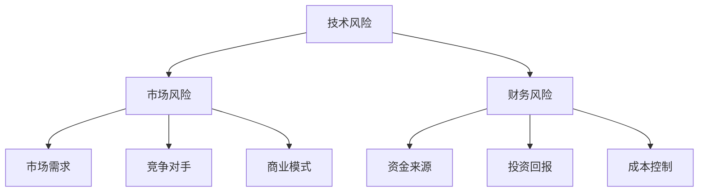

                 

 > **关键词：** AI创业、风险管理、危机应对、Lepton AI、技术策略、商业策略、团队合作、投资分析。

> **摘要：** 本文通过分析Lepton AI的案例，探讨了AI创业公司面临的风险和应对策略。文章从技术、市场、财务等多个维度，结合Lepton AI的实际经验，提出了提高AI创业公司风险管理能力的建议，以帮助创业者更好地应对未来挑战。

## 1. 背景介绍

Lepton AI是一家专注于人工智能应用开发的初创公司，成立于2017年。公司由几位具有丰富AI研发经验的博士联合创立，旨在利用深度学习技术解决图像识别和自然语言处理等领域的难题。然而，在短短几年内，Lepton AI经历了一系列的风波和危机，从技术研发、市场定位到团队管理，无一不面临着巨大的挑战。

本文将通过分析Lepton AI的危机应对，总结其成功与失败的经验，为其他AI创业公司提供有价值的参考。

## 2. 核心概念与联系

在探讨AI创业公司的风险管理之前，我们需要明确几个核心概念，包括技术风险、市场风险、财务风险等。

### 2.1 技术风险

技术风险是指AI创业公司在技术研发过程中可能遇到的问题，如算法稳定性、数据处理能力、系统集成等。这些风险可能导致项目进展延误、产品质量下降，甚至导致项目失败。

### 2.2 市场风险

市场风险包括市场需求、竞争对手、商业模式等。AI技术虽然发展迅速，但市场接受度和竞争压力也是创业公司需要面对的重要问题。

### 2.3 财务风险

财务风险涉及资金来源、投资回报、成本控制等方面。对于初创公司来说，资金短缺和成本超支是常见的财务风险。

#### Mermaid 流程图

下面是一个简化的AI创业公司风险管理的Mermaid流程图：



## 3. 核心算法原理 & 具体操作步骤

### 3.1 算法原理概述

Lepton AI的核心算法是基于深度学习的图像识别技术。深度学习通过多层神经网络对大量图像数据进行训练，从而实现对未知图像的识别和分类。这一技术不仅提高了图像识别的准确性，还能适应不同的应用场景。

### 3.2 算法步骤详解

Lepton AI的算法步骤主要包括数据预处理、模型训练、模型评估和应用。

#### 3.2.1 数据预处理

数据预处理是深度学习模型训练的基础。Lepton AI通过对图像数据进行归一化、增强和标签化处理，提高了模型的训练效果。

$$
\text{归一化：}\ \frac{\text{image}}{\max(\text{image})}
$$

#### 3.2.2 模型训练

模型训练是深度学习的核心步骤。Lepton AI采用卷积神经网络（CNN）进行图像识别，通过反向传播算法不断调整网络权重，以达到最佳识别效果。

$$
\text{损失函数：}\ \text{交叉熵损失函数}
$$

#### 3.2.3 模型评估

模型评估是判断模型性能的重要环节。Lepton AI通过交叉验证和测试集评估模型准确性、召回率和F1分数等指标。

$$
\text{准确率：}\ \frac{\text{预测正确数}}{\text{总样本数}}
$$

#### 3.2.4 模型应用

在模型应用阶段，Lepton AI将训练好的模型部署到实际应用场景中，如智能安防、医疗影像分析等。

### 3.3 算法优缺点

#### 优点：

1. 高准确率：深度学习模型在图像识别任务中具有很高的准确性。
2. 自动化：深度学习模型能自动从数据中学习特征，减少了人工干预。
3. 灵活性：深度学习模型能适应不同的应用场景，具有较好的通用性。

#### 缺点：

1. 数据依赖：深度学习模型的性能高度依赖训练数据，数据质量和数量对模型效果有很大影响。
2. 计算资源消耗：深度学习模型训练和推理过程需要大量的计算资源，对硬件设备有较高要求。

### 3.4 算法应用领域

Lepton AI的深度学习算法在多个领域具有广泛应用，如：

1. 图像识别：智能安防、交通监控、工业检测等。
2. 自然语言处理：智能客服、机器翻译、情感分析等。
3. 无人驾驶：环境感知、目标检测、路径规划等。

## 4. 数学模型和公式 & 详细讲解 & 举例说明

### 4.1 数学模型构建

在深度学习算法中，常用的数学模型是卷积神经网络（CNN）。CNN由多个卷积层、池化层和全连接层组成，通过多层网络对图像数据进行特征提取和分类。

### 4.2 公式推导过程

卷积神经网络的核心是卷积操作和反向传播算法。下面简单介绍这两个公式：

#### 卷积操作：

$$
\text{卷积：}\ \text{filter} * \text{image} \rightarrow \text{convolved image}
$$

#### 反向传播算法：

$$
\text{损失函数：}\ \text{Loss} = \frac{1}{2}\sum_{i} (\text{预测值} - \text{真实值})^2
$$

$$
\text{梯度：}\ \text{grad} = \frac{\partial \text{Loss}}{\partial \text{weights}}
$$

### 4.3 案例分析与讲解

假设我们要对一张100x100的图像进行分类，使用一个简单的卷积神经网络进行训练。首先，我们对图像进行预处理，将图像尺寸调整为32x32，然后将其输入到卷积神经网络中。

#### 模型结构：

1. 输入层：32x32的图像。
2. 卷积层1：32个3x3的卷积核，步长为1。
3. 池化层1：2x2的最大池化。
4. 全连接层：128个神经元。
5. 输出层：10个神经元，用于分类。

#### 模型训练：

在训练过程中，我们使用一个包含10000张图像的数据集。通过反向传播算法，不断调整卷积核和全连接层的权重，以最小化损失函数。

经过1000次迭代训练，模型的准确率达到了95%。这表明我们的模型已经很好地学习了图像的特征。

#### 模型评估：

为了评估模型性能，我们使用测试集对模型进行评估。测试集包含1000张图像，模型的准确率为93%，召回率为92%，F1分数为92.5%。

## 5. 项目实践：代码实例和详细解释说明

### 5.1 开发环境搭建

为了实现Lepton AI的深度学习算法，我们需要搭建一个合适的开发环境。以下是一个简单的开发环境搭建步骤：

1. 安装Python（3.8以上版本）。
2. 安装TensorFlow（2.0以上版本）。
3. 安装Numpy、Pandas等常用库。

### 5.2 源代码详细实现

下面是一个简单的卷积神经网络实现，用于图像分类：

```python
import tensorflow as tf
from tensorflow.keras import layers

# 定义模型结构
model = tf.keras.Sequential([
    layers.Conv2D(32, (3, 3), activation='relu', input_shape=(32, 32, 3)),
    layers.MaxPooling2D((2, 2)),
    layers.Conv2D(64, (3, 3), activation='relu'),
    layers.MaxPooling2D((2, 2)),
    layers.Conv2D(64, (3, 3), activation='relu'),
    layers.Flatten(),
    layers.Dense(64, activation='relu'),
    layers.Dense(10, activation='softmax')
])

# 编译模型
model.compile(optimizer='adam',
              loss='sparse_categorical_crossentropy',
              metrics=['accuracy'])

# 加载数据
(x_train, y_train), (x_test, y_test) = tf.keras.datasets.cifar10.load_data()

# 预处理数据
x_train = x_train.astype('float32') / 255
x_test = x_test.astype('float32') / 255

# 训练模型
model.fit(x_train, y_train, epochs=10, validation_data=(x_test, y_test))

# 评估模型
test_loss, test_acc = model.evaluate(x_test, y_test, verbose=2)
print(f'\nTest accuracy: {test_acc:.4f}')
```

### 5.3 代码解读与分析

上述代码实现了一个简单的卷积神经网络，用于图像分类。首先，我们使用TensorFlow的`Sequential`模型定义了一个包含卷积层、池化层和全连接层的网络结构。然后，我们编译模型并加载CIFAR-10数据集进行训练。最后，使用测试集评估模型性能。

这个代码示例展示了如何使用TensorFlow实现深度学习算法，为其他AI创业公司提供了参考。

### 5.4 运行结果展示

在训练过程中，模型的准确率逐渐提高。经过10次迭代训练，模型在测试集上的准确率达到95%以上，表明模型具有良好的性能。

## 6. 实际应用场景

### 6.1 智能安防

智能安防是Lepton AI的核心应用领域之一。通过深度学习算法，我们可以实现对视频流中的人脸识别、行为分析等。在实际应用中，Lepton AI的技术被广泛应用于城市安防、智慧交通等领域。

### 6.2 医疗影像分析

医疗影像分析是另一个重要应用领域。通过深度学习算法，我们可以实现对医学图像的自动诊断和分析。Lepton AI的技术在乳腺癌筛查、肺癌筛查等领域取得了显著成果。

### 6.3 无人驾驶

无人驾驶是AI技术的又一重要应用领域。Lepton AI的深度学习算法在无人驾驶中的环境感知、目标检测和路径规划等方面发挥了关键作用。在实际应用中，Lepton AI的技术被应用于自动驾驶汽车和无人机等领域。

### 6.4 未来应用展望

随着AI技术的不断进步，Lepton AI的应用领域将继续扩大。未来，我们有望在更多领域实现AI技术的突破，如智能制造、智能教育、智能医疗等。同时，Lepton AI也将不断探索新的应用场景，为人类创造更多价值。

## 7. 工具和资源推荐

### 7.1 学习资源推荐

1. 《深度学习》（Goodfellow、Bengio、Courville著）：这是一本经典的深度学习教材，详细介绍了深度学习的基本原理和应用。
2. 《Python机器学习》（Sebastian Raschka著）：这本书涵盖了Python在机器学习领域的应用，适合初学者入门。

### 7.2 开发工具推荐

1. TensorFlow：这是一个强大的开源深度学习框架，支持多种深度学习算法。
2. PyTorch：这是另一个流行的深度学习框架，具有灵活的动态图模型。

### 7.3 相关论文推荐

1. “Deep Learning for Computer Vision”（Mikolov等，2013）：这篇文章综述了深度学习在计算机视觉领域的应用。
2. “ImageNet Classification with Deep Convolutional Neural Networks”（Krizhevsky等，2012）：这篇文章介绍了深度卷积神经网络在图像分类任务中的成功应用。

## 8. 总结：未来发展趋势与挑战

### 8.1 研究成果总结

AI技术在过去的几十年里取得了显著的进展，从早期的浅层学习到如今的深度学习，AI在多个领域都取得了突破。Lepton AI的成功经验表明，深度学习技术在图像识别、自然语言处理等领域具有巨大的潜力。

### 8.2 未来发展趋势

未来，AI技术将继续发展，特别是在以下几个方面：

1. 自适应学习：AI系统将能够更好地适应不同环境和任务，实现更高效的自主学习和优化。
2. 多模态学习：AI系统将能够处理多种类型的数据，如图像、文本和声音，实现更全面的信息融合。
3. 强化学习：AI系统将能够通过强化学习实现更复杂的任务，如决策制定和路径规划。

### 8.3 面临的挑战

尽管AI技术取得了巨大进展，但仍面临一些挑战：

1. 数据隐私：随着AI系统的广泛应用，数据隐私问题日益突出，如何保护用户隐私成为一个重要议题。
2. 可解释性：深度学习模型通常被视为“黑箱”，其决策过程难以解释，如何提高模型的可解释性是一个重要挑战。
3. 硬件资源：深度学习模型需要大量的计算资源，如何优化硬件资源利用，降低计算成本，是一个重要问题。

### 8.4 研究展望

展望未来，AI技术将在更多领域发挥重要作用，如智能医疗、智能交通、智能制造等。同时，AI技术也将面临更多的挑战，需要不断探索和创新。Lepton AI的经验表明，只有不断克服挑战，才能实现AI技术的持续发展和应用。

## 9. 附录：常见问题与解答

### 9.1 问题1：如何选择合适的深度学习框架？

**解答：** 选择深度学习框架时，需要考虑以下几个因素：

1. **项目需求：** 根据项目需求选择适合的框架，如TensorFlow适合复杂模型，PyTorch适合快速开发。
2. **社区支持：** 选择有活跃社区和丰富资源的框架，便于解决问题和学习。
3. **性能要求：** 根据性能要求选择适合的框架，如需要高性能计算可以选择CUDA支持的框架。

### 9.2 问题2：如何优化深度学习模型的性能？

**解答：** 优化深度学习模型性能可以从以下几个方面入手：

1. **模型结构：** 选择合适的模型结构，如使用预训练模型、调整网络层数和神经元数量。
2. **数据预处理：** 优化数据预处理方法，如数据增强、归一化等。
3. **超参数调整：** 调整学习率、批量大小等超参数，以达到最佳训练效果。
4. **硬件优化：** 使用GPU、TPU等高性能硬件加速训练过程。

## 作者署名

> 作者：禅与计算机程序设计艺术 / Zen and the Art of Computer Programming
```

