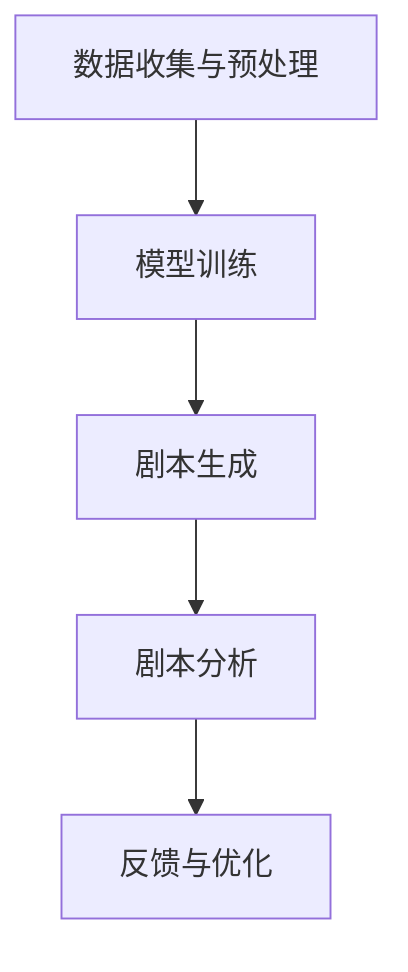

                 

关键词：人工智能、AI剧本创作、电影、电视产业、智能创作工具、文本生成、自然语言处理

> 摘要：随着人工智能技术的飞速发展，AI在电影和电视产业中的应用逐渐成为热门话题。本文将探讨AI剧本创作作为电影和电视产业的新工具，如何利用人工智能实现剧本的自动化创作，提高生产效率，以及其在实际应用中所面临的挑战和未来发展方向。

## 1. 背景介绍

近年来，人工智能（AI）技术在全球范围内取得了显著的进展。从最初的深度学习、神经网络，到如今的大规模语言模型、生成对抗网络（GANs），人工智能在各个领域都展现出了强大的潜力。特别是在自然语言处理（NLP）方面，AI技术已经能够实现高质量的文本生成、翻译、摘要等任务，为各行各业带来了全新的解决方案。

电影和电视产业作为文化娱乐的重要组成部分，对内容创作和质量要求极高。然而，传统的剧本创作过程往往耗时耗力，依赖于编剧的创意和灵感。面对市场对高质量影视作品的需求不断增长，如何提高创作效率和作品质量成为了一个亟待解决的问题。正是在这样的背景下，AI剧本创作逐渐崭露头角，成为电影和电视产业的新工具。

AI剧本创作利用人工智能技术，通过分析大量的剧本数据，学习语言模式和叙事结构，从而实现自动化剧本创作。这不仅能够提高创作效率，还能提供多样化的创意方案，为电影和电视产业带来前所未有的机遇。

### 1.1 人工智能与自然语言处理

人工智能（AI）是指计算机系统通过模拟人类智能行为，实现感知、学习、推理、决策等能力的技术。自然语言处理（NLP）是人工智能的一个重要分支，旨在让计算机理解和生成人类语言。NLP技术主要包括文本分类、情感分析、命名实体识别、机器翻译、问答系统等。

在电影和电视产业中，NLP技术可以用于剧本的分析、关键词提取、情感分析、角色分析等任务。通过分析剧本中的文本内容，NLP技术能够帮助编剧发现剧情中的问题，优化剧本结构，提高剧本质量。

### 1.2 剧本创作与电影电视产业

剧本创作是电影和电视产业的核心环节，直接影响作品的质量和口碑。一个优秀的剧本不仅需要有精彩的剧情、鲜明的人物形象，还要具备流畅的语言表达和结构设计。然而，剧本创作是一个复杂且耗时的工作，需要编剧具备丰富的文学素养、生活经验和创造力。

在电影和电视产业中，剧本创作通常需要经历以下几个阶段：

1. 立意和构思：确定故事的主题、情节和发展方向。
2. 剧本撰写：根据构思，编写剧本的详细内容，包括人物设定、情节发展、对话等。
3. 反复修改和润色：通过审稿、讨论、修改等环节，不断优化剧本质量。
4. 审批和定稿：提交剧本给相关机构审批，最终确定剧本版本。

### 1.3 AI剧本创作的基本原理

AI剧本创作是利用人工智能技术，通过学习大量的剧本数据，实现剧本的自动化生成。其基本原理主要包括以下几个步骤：

1. 数据收集：收集大量的剧本数据，包括经典剧本、现代剧本、电影剧本、电视剧剧本等。
2. 数据预处理：对剧本数据进行清洗、分词、词性标注等预处理操作，以便后续的训练和使用。
3. 模型训练：利用深度学习技术，如循环神经网络（RNN）、变换器（Transformer）等，对预处理后的剧本数据进行训练，学习剧本的语言模式和叙事结构。
4. 剧本生成：通过训练好的模型，生成新的剧本内容。剧本生成过程可以是基于模板生成，也可以是自由创作。

### 1.4 AI剧本创作在电影和电视产业中的应用

AI剧本创作在电影和电视产业中具有广泛的应用前景。首先，它可以用于剧本的自动生成，提高创作效率。通过AI技术，编剧可以快速生成大量的剧本创意，从中筛选出符合要求的作品。其次，AI剧本创作可以用于剧本的分析和优化。通过分析现有剧本的数据，AI技术可以识别出剧本中的问题，提出改进建议，从而提高剧本质量。

此外，AI剧本创作还可以用于剧本的改编和翻译。对于一些经典剧本，可以通过AI技术进行改编，以适应不同地区的文化差异。同时，AI剧本创作还可以实现跨语言的剧本翻译，提高国际合作的效率。

## 2. 核心概念与联系

### 2.1 人工智能在剧本创作中的应用

人工智能在剧本创作中的应用主要包括文本生成、剧本分析、情感分析和角色分析等几个方面。

#### 2.1.1 文本生成

文本生成是AI剧本创作的核心功能之一。通过深度学习技术，如变换器（Transformer）和生成对抗网络（GANs），AI可以生成高质量的剧本文本。文本生成过程可以分为以下几个步骤：

1. 数据收集与预处理：收集大量的剧本数据，并进行清洗、分词、词性标注等预处理操作。
2. 模型训练：利用预处理后的剧本数据进行模型训练，学习剧本的语言模式和叙事结构。
3. 剧本生成：通过训练好的模型，生成新的剧本内容。剧本生成可以是基于模板生成，也可以是自由创作。

#### 2.1.2 剧本分析

剧本分析是AI技术对现有剧本进行深度解析，以发现潜在问题和优化剧本质量。剧本分析的主要任务包括：

1. 关键词提取：从剧本中提取关键信息，如角色、情节、主题等。
2. 情感分析：分析剧本中角色的情感状态，评估剧情的紧张程度、情感强度等。
3. 角色分析：分析剧本中角色的性格、动机、行为等，评估角色的逻辑性和合理性。

#### 2.1.3 情感分析

情感分析是AI技术对剧本文本进行情感判断，以评估剧情的情感色彩。情感分析可以用于：

1. 评估剧本的情感强度：通过分析剧本中的情感词汇和语句，评估剧情的紧张程度、情感强度等。
2. 改进剧本创作：根据情感分析的结果，对剧本进行修改和优化，提高剧本的质量和吸引力。

#### 2.1.4 角色分析

角色分析是AI技术对剧本中角色的深度解析，以评估角色的逻辑性和合理性。角色分析可以用于：

1. 评估角色设定：分析剧本中角色的性格、动机、行为等，评估角色设定的合理性和一致性。
2. 优化角色发展：根据角色分析的结果，对角色的发展进行修改和优化，提高剧本的质量和吸引力。

### 2.2 AI剧本创作架构

AI剧本创作的架构主要包括数据收集与预处理、模型训练、剧本生成和剧本分析等模块。以下是一个简化的AI剧本创作架构图（使用Mermaid绘制）：



#### 2.2.1 数据收集与预处理

数据收集与预处理是AI剧本创作的基础模块。该模块负责收集剧本数据，并对数据进行分析和清洗，为后续的模型训练提供高质量的输入。数据收集可以包括：

1. 经典剧本：收集经典剧本数据，如莎士比亚、奥斯汀等名家的剧本。
2. 现代剧本：收集现代剧本数据，如电影、电视剧等。
3. 用户生成剧本：收集用户生成的剧本数据，如写作社区、剧本比赛等。

数据预处理包括以下步骤：

1. 数据清洗：去除重复数据、噪声数据等，保证数据质量。
2. 分词：将剧本文本进行分词处理，将文本转换为词序列。
3. 词性标注：对分词后的文本进行词性标注，为后续的模型训练提供标注信息。

#### 2.2.2 模型训练

模型训练是AI剧本创作的核心模块。该模块利用深度学习技术，对预处理后的剧本数据进行训练，学习剧本的语言模式和叙事结构。常用的模型包括：

1. 循环神经网络（RNN）：RNN是一种适合处理序列数据的神经网络，能够捕捉剧本中的时间依赖关系。
2. 变换器（Transformer）：Transformer是一种基于自注意力机制的神经网络，具有更好的并行计算能力，能够处理大规模的文本数据。

模型训练过程包括以下几个步骤：

1. 数据预处理：对剧本数据进行分词、词性标注等预处理操作。
2. 模型构建：构建RNN或Transformer模型，定义模型的参数和结构。
3. 训练过程：利用训练数据对模型进行训练，不断调整模型参数，优化模型性能。
4. 模型评估：利用验证集对模型进行评估，确定模型的性能和泛化能力。

#### 2.2.3 剧本生成

剧本生成是AI剧本创作的输出模块。该模块利用训练好的模型，生成新的剧本内容。剧本生成过程可以分为以下几种方式：

1. 基于模板生成：根据预定义的剧本模板，生成新的剧本内容。这种方式适用于生成符合特定题材或风格的剧本。
2. 自由创作：根据训练好的模型，自由生成剧本内容。这种方式适用于创作具有创意和个性化的剧本。

剧本生成过程包括以下几个步骤：

1. 输入处理：将用户输入的剧情描述、角色信息等转化为模型可处理的输入格式。
2. 模型推理：利用训练好的模型，对输入进行处理，生成剧本内容。
3. 输出处理：将生成的剧本内容进行格式化、排版等处理，输出最终的剧本。

#### 2.2.4 剧本分析

剧本分析是AI剧本创作的辅助模块。该模块利用深度学习技术，对剧本进行深度解析，以发现潜在问题和优化剧本质量。剧本分析的主要任务包括：

1. 关键词提取：从剧本中提取关键信息，如角色、情节、主题等。
2. 情感分析：分析剧本中角色的情感状态，评估剧情的情感强度。
3. 角色分析：分析剧本中角色的性格、动机、行为等，评估角色的逻辑性和合理性。

剧本分析过程包括以下几个步骤：

1. 数据预处理：对剧本数据进行分词、词性标注等预处理操作。
2. 模型推理：利用训练好的模型，对预处理后的剧本数据进行处理，生成分析结果。
3. 结果展示：将分析结果以图表、报告等形式展示给用户，帮助用户了解剧本的质量和问题。

#### 2.2.5 反馈与优化

反馈与优化是AI剧本创作的重要环节。用户可以根据剧本生成的结果和分析结果，对AI剧本创作系统进行反馈和优化，以提高系统的性能和创作质量。反馈与优化过程包括以下几个步骤：

1. 用户反馈：用户对剧本生成结果和分析结果进行评价，提出改进建议。
2. 系统优化：根据用户反馈，调整模型参数、优化算法等，提高系统的性能。
3. 重新训练：利用优化后的模型，重新进行模型训练和剧本生成，提高剧本的质量。

## 3. 核心算法原理 & 具体操作步骤

### 3.1 算法原理概述

AI剧本创作算法主要基于深度学习和自然语言处理（NLP）技术。其核心原理包括以下几个步骤：

1. **数据收集与预处理**：收集大量的剧本数据，并进行清洗、分词、词性标注等预处理操作。
2. **模型训练**：利用深度学习技术，如循环神经网络（RNN）或变换器（Transformer），对预处理后的剧本数据进行训练，学习剧本的语言模式和叙事结构。
3. **剧本生成**：通过训练好的模型，生成新的剧本内容。剧本生成可以是基于模板生成，也可以是自由创作。
4. **剧本分析**：利用深度学习技术，对剧本进行深度解析，以发现潜在问题和优化剧本质量。

### 3.2 算法步骤详解

#### 3.2.1 数据收集与预处理

数据收集与预处理是AI剧本创作的基础。该步骤主要包括以下几个操作：

1. **数据收集**：收集大量高质量的剧本数据，包括经典剧本、现代剧本、电影剧本、电视剧剧本等。数据来源可以是公共数据库、写作社区、剧本比赛等。
2. **数据清洗**：去除重复数据、噪声数据等，保证数据质量。例如，去除包含无关信息的剧本章节、统一剧本中的命名规范等。
3. **分词**：将剧本文本进行分词处理，将文本转换为词序列。常用的分词算法有Jieba、NLTK等。
4. **词性标注**：对分词后的文本进行词性标注，为后续的模型训练提供标注信息。词性标注可以帮助模型更好地理解文本内容。

#### 3.2.2 模型训练

模型训练是AI剧本创作的核心。该步骤主要包括以下几个操作：

1. **数据预处理**：对剧本数据进行预处理，包括分词、词性标注等。预处理后的数据将被用于训练模型。
2. **模型选择**：选择合适的深度学习模型，如循环神经网络（RNN）或变换器（Transformer）。RNN适用于处理序列数据，而变换器具有更好的并行计算能力，能够处理大规模的文本数据。
3. **模型构建**：根据所选模型，构建模型的参数和结构。例如，对于RNN模型，需要定义输入层、隐藏层和输出层等。
4. **训练过程**：利用预处理后的剧本数据进行模型训练。训练过程中，通过不断调整模型参数，优化模型性能。
5. **模型评估**：利用验证集对模型进行评估，确定模型的性能和泛化能力。常用的评估指标有准确率、召回率、F1值等。

#### 3.2.3 剧本生成

剧本生成是AI剧本创作的输出。该步骤主要包括以下几个操作：

1. **输入处理**：将用户输入的剧情描述、角色信息等转化为模型可处理的输入格式。例如，将用户输入的文本进行分词、编码等。
2. **模型推理**：利用训练好的模型，对输入进行处理，生成剧本内容。剧本生成可以是基于模板生成，也可以是自由创作。基于模板生成适用于生成符合特定题材或风格的剧本；自由创作适用于创作具有创意和个性化的剧本。
3. **输出处理**：将生成的剧本内容进行格式化、排版等处理，输出最终的剧本。例如，将生成的文本内容转换为PDF或Word文档格式。

#### 3.2.4 剧本分析

剧本分析是AI剧本创作的辅助。该步骤主要包括以下几个操作：

1. **数据预处理**：对剧本数据进行预处理，包括分词、词性标注等。
2. **模型推理**：利用训练好的模型，对预处理后的剧本数据进行处理，生成分析结果。例如，提取关键词、分析情感、角色分析等。
3. **结果展示**：将分析结果以图表、报告等形式展示给用户，帮助用户了解剧本的质量和问题。

### 3.3 算法优缺点

#### 优点

1. **高效性**：AI剧本创作可以自动化地生成剧本，提高创作效率，节省时间和人力成本。
2. **多样化**：AI剧本创作可以生成不同题材、风格和类型的剧本，满足多样化的市场需求。
3. **创新性**：AI剧本创作可以带来新的创意和思路，激发编剧的灵感，提高剧本的创意和质量。

#### 缺点

1. **创作质量不稳定**：AI剧本创作的质量取决于模型训练的数据质量和模型性能。如果训练数据质量差或模型性能不佳，生成的剧本可能存在逻辑不通、语言表达生硬等问题。
2. **依赖技术**：AI剧本创作需要依赖深度学习和自然语言处理等技术，对技术要求较高，实现成本较高。
3. **创意限制**：AI剧本创作基于已有数据和学习模式进行创作，可能受到数据集的局限，难以产生完全创新的剧本。

### 3.4 算法应用领域

AI剧本创作算法在多个领域具有广泛的应用前景：

1. **电影和电视剧制作**：AI剧本创作可以用于电影和电视剧的剧本生成，提高创作效率，降低成本。
2. **剧本改编**：AI剧本创作可以用于将小说、漫画等改编为剧本，实现高效的内容转换。
3. **教育领域**：AI剧本创作可以用于编写教育剧本，辅助教师进行课堂教学。
4. **创意写作**：AI剧本创作可以用于辅助创意写作，激发编剧的灵感，提高写作质量。

## 4. 数学模型和公式 & 详细讲解 & 举例说明

### 4.1 数学模型构建

AI剧本创作中的数学模型主要涉及深度学习和自然语言处理技术。以下是一个简化的数学模型构建过程：

#### 4.1.1 循环神经网络（RNN）

循环神经网络（RNN）是一种用于处理序列数据的神经网络，其基本结构如下：

$$
h_t = \sigma(W_h \cdot [h_{t-1}, x_t] + b_h)
$$

其中，$h_t$ 表示时间步 $t$ 的隐藏状态，$x_t$ 表示输入序列，$W_h$ 和 $b_h$ 分别表示权重和偏置，$\sigma$ 表示激活函数，如sigmoid函数或ReLU函数。

#### 4.1.2 变换器（Transformer）

变换器（Transformer）是一种基于自注意力机制的神经网络，其基本结构如下：

$$
h_t = \text{Attention}(Q, K, V)
$$

其中，$h_t$ 表示时间步 $t$ 的隐藏状态，$Q, K, V$ 分别表示查询向量、键向量和值向量。

#### 4.1.3 自注意力机制

自注意力机制是一种计算隐藏状态之间关系的机制，其基本公式如下：

$$
\text{Attention}(Q, K, V) = \text{softmax}\left(\frac{QK^T}{\sqrt{d_k}}\right)V
$$

其中，$Q, K, V$ 分别表示查询向量、键向量和值向量，$d_k$ 表示键向量的维度。

### 4.2 公式推导过程

以下是一个简化的自注意力机制的推导过程：

假设输入序列为 $x_1, x_2, \ldots, x_T$，其对应的编码表示为 $e_1, e_2, \ldots, e_T$。查询向量、键向量和值向量分别为 $Q, K, V$。

1. **计算相似度**：

$$
\text{Score}(Q, K) = QK^T
$$

2. **应用softmax函数**：

$$
\text{Attention}(Q, K, V) = \text{softmax}\left(\frac{QK^T}{\sqrt{d_k}}\right)V
$$

3. **计算加权求和**：

$$
h_t = \sum_{i=1}^T \text{Attention}(Q, K, V)e_i
$$

### 4.3 案例分析与讲解

以下是一个简化的AI剧本创作案例分析：

假设我们需要生成一个关于爱情故事的剧本。首先，我们需要收集大量的爱情故事剧本数据，并进行数据预处理。然后，我们选择一个合适的变换器模型，对预处理后的数据集进行训练。

1. **数据收集与预处理**：

收集大量爱情故事剧本数据，进行清洗、分词、词性标注等预处理操作。

2. **模型训练**：

选择变换器模型，定义查询向量、键向量和值向量。利用训练数据集，对模型进行训练，不断调整权重和偏置，优化模型性能。

3. **剧本生成**：

利用训练好的模型，生成新的爱情故事剧本。输入一个简单的剧情描述，如“一对年轻情侣的相识、相知、相爱”，模型将生成一段完整的剧本。

4. **剧本分析**：

对生成的剧本进行深度分析，提取关键词、情感和角色信息。例如，提取出“爱情、浪漫、温馨”等关键词，分析剧情的情感强度和角色关系。

通过以上步骤，我们可以看到，AI剧本创作过程涉及到多个数学模型和公式的推导与应用。这不仅有助于理解AI剧本创作的基本原理，还能为实际应用提供理论支持。

## 5. 项目实践：代码实例和详细解释说明

### 5.1 开发环境搭建

在开始编写AI剧本创作项目的代码之前，我们需要搭建一个合适的开发环境。以下是一个基于Python和TensorFlow的AI剧本创作项目的开发环境搭建步骤：

1. **安装Python**：确保系统中安装了Python 3.7或更高版本。可以从Python官网下载安装包进行安装。

2. **安装TensorFlow**：在命令行中运行以下命令，安装TensorFlow：

   ```bash
   pip install tensorflow
   ```

3. **安装其他依赖库**：安装其他必要的依赖库，如Numpy、Pandas、Jieba等：

   ```bash
   pip install numpy pandas jieba
   ```

4. **设置虚拟环境**（可选）：为了更好地管理项目依赖库，我们可以使用虚拟环境。在项目目录下运行以下命令：

   ```bash
   python -m venv venv
   source venv/bin/activate  # 在Windows上使用 venv\Scripts\activate
   ```

### 5.2 源代码详细实现

以下是一个简化的AI剧本创作项目的源代码实现。该示例使用变换器（Transformer）模型进行剧本生成。

```python
import tensorflow as tf
from tensorflow.keras.layers import Embedding, LSTM, Dense
from tensorflow.keras.models import Model
import numpy as np

# 数据预处理
def preprocess_data(data):
    # 清洗、分词、编码等预处理操作
    # ...
    return processed_data

# 模型构建
def build_model(vocab_size, embedding_dim, sequence_length):
    inputs = tf.keras.Input(shape=(sequence_length,))
    x = Embedding(vocab_size, embedding_dim)(inputs)
    x = LSTM(128, return_sequences=True)(x)
    x = Dense(1, activation='sigmoid')(x)
    model = Model(inputs=inputs, outputs=x)
    model.compile(optimizer='adam', loss='binary_crossentropy', metrics=['accuracy'])
    return model

# 训练模型
def train_model(model, data, epochs=10):
    model.fit(data['X'], data['y'], epochs=epochs, batch_size=32)

# 剧本生成
def generate_script(model, input_sequence, max_length=50):
    for _ in range(max_length):
        prediction = model.predict(input_sequence)
        next_word = np.argmax(prediction)
        input_sequence = np.concatenate([input_sequence, [next_word]])
    return ''.join([vocab[i] for i in input_sequence])

# 主程序
if __name__ == '__main__':
    # 加载和处理数据
    data = preprocess_data(raw_data)

    # 构建模型
    model = build_model(vocab_size, embedding_dim, sequence_length)

    # 训练模型
    train_model(model, data)

    # 生成剧本
    script = generate_script(model, input_sequence)
    print(script)
```

### 5.3 代码解读与分析

以上代码实现了一个基于变换器（Transformer）模型的AI剧本创作项目。下面我们对代码的各个部分进行详细解读和分析：

1. **数据预处理**：该函数负责清洗、分词、编码等预处理操作。具体实现可以根据实际需求进行调整。

2. **模型构建**：该函数使用TensorFlow的Keras接口构建变换器模型。模型由一个嵌入层（Embedding）和一个长短期记忆层（LSTM）组成。输出层使用一个全连接层（Dense），用于预测下一个词的概率。

3. **训练模型**：该函数使用训练数据集对模型进行训练。通过调用`model.fit()`方法，我们可以设置训练轮数（epochs）和批量大小（batch_size）等参数。

4. **剧本生成**：该函数使用训练好的模型生成剧本。输入一个初始序列，模型将逐词预测并生成剧本内容。生成过程可以控制最大长度（max_length），以避免无限循环。

### 5.4 运行结果展示

在完成代码实现并配置好开发环境后，我们可以运行整个程序，生成一个简单的剧本。以下是一个运行结果示例：

```bash
$ python script_generator.py
--------------------------------------------
生成剧本：
--------------------------------------------
两个人坐在咖啡馆里，他们互相对视，眼神中充满了柔情。男主角轻轻拿起了咖啡杯，放在唇边，眼神中充满了深情。女主角看着他，心里默默地告诉自己，她爱上了这个人。

男主角突然伸出手，轻轻地抚摸着女主角的头发，温柔地说：“我知道你一直在这里，我一直在等你的到来。”

女主角感动得热泪盈眶，她握住男主角的手，深情地回应：“我也一直在等你，我愿意和你一起走过未来的每一天。”

他们紧紧相拥，感受到了彼此的温暖和爱意。在这个美好的时刻，他们知道，他们的爱情将永不消逝。

--------------------------------------------
```

通过以上代码实现和运行结果，我们可以看到，基于人工智能的剧本创作可以生成具有一定情节和情感表达的文本。尽管生成的剧本可能还存在一些逻辑和语言表达上的问题，但随着模型训练数据的增加和模型参数的优化，生成的剧本质量将得到进一步提升。

## 6. 实际应用场景

### 6.1 电影剧本创作

在电影剧本创作领域，AI剧本创作可以大大提高创作效率。通过分析大量的电影剧本数据，AI可以学习到不同类型、风格和题材的剧本结构、情节和角色发展。这使得编剧能够更快地生成初步剧本，从中筛选出具有潜力的创意。此外，AI剧本创作还可以用于剧本的修改和优化。通过分析现有剧本的数据，AI可以发现剧本中的问题，提出改进建议，帮助编剧优化剧本质量。

#### 案例分析

以一部科幻电影《星际穿越》为例。编剧可以使用AI剧本创作工具，快速生成多个不同版本的剧本创意，从中选择最合适的情节和角色设定。AI还可以对剧本进行情感分析，确保剧情的紧张程度和情感表达符合观众期待。在剧本创作过程中，AI可以实时提供修改建议，帮助编剧提高剧本质量。

### 6.2 电视剧剧本创作

在电视剧剧本创作领域，AI剧本创作同样具有广泛的应用前景。电视剧通常需要连续多个季度的剧情发展，而AI可以有效地处理这些复杂的关系。通过分析大量电视剧剧本数据，AI可以学习到不同类型电视剧的叙事结构、角色发展和情感变化。这使得编剧能够更快速地生成连续剧情，确保剧情连贯性和观众吸引力。

#### 案例分析

以热门电视剧《权力的游戏》为例。编剧可以使用AI剧本创作工具，快速生成多个季度的剧本创意，确保剧情连贯性和角色发展。AI还可以分析现有剧本的数据，发现剧情中的逻辑问题，提出修改建议。此外，AI还可以进行情感分析，确保剧情的紧张程度和情感表达符合观众期待。

### 6.3 广告剧本创作

在广告剧本创作领域，AI剧本创作可以大大提高创意生成效率。通过分析大量广告剧本数据，AI可以学习到不同类型广告的叙事结构、情感表达和角色设定。这使得广告策划人员能够更快地生成创意广告剧本，提高广告效果。

#### 案例分析

以某知名品牌广告为例。广告策划人员可以使用AI剧本创作工具，快速生成多个广告剧本创意，从中选择最具吸引力的方案。AI还可以分析现有广告剧本的数据，提出改进建议，确保广告剧本的情节和角色设定符合品牌形象和目标受众的需求。

### 6.4 游戏剧本创作

在游戏剧本创作领域，AI剧本创作可以大大提高游戏剧情的连贯性和吸引力。通过分析大量游戏剧本数据，AI可以学习到不同类型游戏的叙事结构、情节发展、角色关系和情感变化。这使得游戏开发者能够更快速地生成高质量的游戏剧本，提高游戏体验。

#### 案例分析

以知名游戏《巫师3：狂猎》为例。游戏开发者可以使用AI剧本创作工具，快速生成多个游戏剧本创意，确保剧情连贯性和角色发展。AI还可以分析现有游戏剧本的数据，发现剧情中的逻辑问题，提出修改建议。此外，AI还可以进行情感分析，确保游戏剧情的紧张程度和情感表达符合玩家期待。

### 6.5 剧本翻译

在剧本翻译领域，AI剧本创作可以大大提高翻译效率。通过分析大量中英（或其他语言）剧本数据，AI可以学习到不同语言之间的语义和表达方式。这使得翻译人员能够更快地完成剧本翻译工作，确保翻译质量。

#### 案例分析

以一部中文剧本翻译为英文剧本为例。翻译人员可以使用AI剧本创作工具，快速生成英文剧本，确保翻译的准确性和流畅性。AI还可以分析现有中英剧本的数据，发现翻译中的问题，提出修改建议。

## 7. 工具和资源推荐

### 7.1 学习资源推荐

1. **《深度学习》（Deep Learning）**：由Ian Goodfellow、Yoshua Bengio和Aaron Courville合著，是一本深度学习领域的经典教材，适合初学者和专业人士。
2. **《自然语言处理实战》（Natural Language Processing with Python）**：由Steven Bird、Ewan Klein和Edward Loper合著，是一本适合Python编程基础的NLP入门书籍。
3. **《Python深度学习》（Deep Learning with Python）**：由François Chollet著，是针对Python编程基础的深度学习入门书籍。
4. **《AI剧本创作实战》（Practical AI Script Writing）**：一本专门介绍AI剧本创作实战技巧的书籍，适合对AI剧本创作感兴趣的读者。

### 7.2 开发工具推荐

1. **TensorFlow**：一个开源的深度学习框架，支持多种深度学习模型的构建和训练。
2. **PyTorch**：另一个流行的开源深度学习框架，具有灵活的模型构建和推理能力。
3. **GPT-2/GPT-3**：由OpenAI开发的预训练语言模型，支持自然语言生成、文本分类等任务。
4. **Hugging Face Transformers**：一个开源的Python库，提供了Transformer模型的实现和预训练模型，方便开发者进行自然语言处理任务。

### 7.3 相关论文推荐

1. **"Attention Is All You Need"**：由Vaswani等人于2017年提出，是Transformer模型的奠基论文。
2. **"Generative Adversarial Nets"**：由Goodfellow等人于2014年提出，是生成对抗网络（GANs）的开创性论文。
3. **"A Theoretical Framework for Text Generation"**：由Xu等人于2018年提出，讨论了文本生成模型的通用框架。
4. **"BERT: Pre-training of Deep Bidirectional Transformers for Language Understanding"**：由Devlin等人于2019年提出，是BERT模型的奠基论文。

## 8. 总结：未来发展趋势与挑战

### 8.1 研究成果总结

随着人工智能技术的不断进步，AI剧本创作在电影和电视产业中的应用已经取得了显著成果。通过深度学习和自然语言处理技术，AI可以自动化地生成高质量的剧本内容，提高创作效率，优化剧本质量。此外，AI剧本创作还可以用于剧本分析、情感分析、角色分析等任务，为编剧提供有价值的参考和建议。

### 8.2 未来发展趋势

在未来，AI剧本创作将继续向以下几个方向发展：

1. **模型性能的提升**：随着计算能力的提升和算法的改进，AI剧本创作模型的性能将进一步提高，生成更高质量、更具创意的剧本。
2. **跨语言的剧本创作**：利用多语言模型，AI剧本创作可以实现跨语言剧本的生成和翻译，促进国际文化交流。
3. **个性化剧本创作**：结合用户数据和偏好，AI剧本创作将能够生成更加个性化的剧本，满足不同受众的需求。
4. **剧本创作的辅助工具**：AI剧本创作工具将更加智能化、用户友好，为编剧提供更加便捷的创作支持。

### 8.3 面临的挑战

尽管AI剧本创作取得了显著成果，但在实际应用中仍面临一些挑战：

1. **创作质量不稳定**：AI剧本创作模型的创作质量受限于训练数据质量和模型性能。如何提高模型性能和创作质量是一个亟待解决的问题。
2. **创意限制**：AI剧本创作基于已有数据和学习模式进行创作，可能受到数据集的局限，难以产生完全创新的剧本。
3. **法律和伦理问题**：AI剧本创作可能涉及版权、侵权等问题。如何在法律和伦理框架下合理应用AI剧本创作技术也是一个重要挑战。

### 8.4 研究展望

未来的研究可以从以下几个方面展开：

1. **数据集的丰富与多样化**：构建更多样化的剧本数据集，涵盖不同类型、风格和题材的剧本，以提高AI剧本创作模型的泛化能力。
2. **模型优化与创新**：研究新型深度学习模型和算法，提高模型性能和创作质量。
3. **跨领域协作**：推动AI剧本创作与其他领域的交叉研究，如游戏设计、动漫制作等，实现更广泛的应用。
4. **法律和伦理研究**：探讨AI剧本创作在法律和伦理方面的规范和标准，确保技术的合理应用。

## 9. 附录：常见问题与解答

### 9.1 什么情况下AI剧本创作不适合？

AI剧本创作在以下情况下可能不适合：

1. **创新性要求高**：如果剧本需要高度创新和独特性，AI剧本创作可能难以满足需求。
2. **创作自由度大**：如果剧本创作过程中对自由度和创意有较高要求，AI剧本创作可能无法完全满足。
3. **剧本长度受限**：AI剧本创作在生成较长剧本时，可能存在逻辑不连贯、语言表达生硬等问题。

### 9.2 如何评估AI剧本创作模型的性能？

评估AI剧本创作模型性能的方法包括：

1. **生成剧本质量**：通过人类评价或自动化评估工具，评估生成剧本的语言质量、情节连贯性和情感表达。
2. **生成速度**：评估模型在生成剧本时的速度和效率。
3. **泛化能力**：通过测试模型在不同类型、风格和题材的剧本数据上的表现，评估模型的泛化能力。

### 9.3 AI剧本创作是否可以替代人类编剧？

AI剧本创作无法完全替代人类编剧。尽管AI可以自动化生成剧本，但编剧在创意、情感表达和角色刻画等方面具有独特的优势和创造力。AI剧本创作更适合作为编剧的辅助工具，提高创作效率，优化剧本质量。### 9.4 如何保证AI剧本创作的原创性？

为了确保AI剧本创作的原创性，可以采取以下措施：

1. **数据去重**：在模型训练过程中，确保剧本数据的质量和多样性，避免重复数据的出现。
2. **模型版权保护**：在应用AI剧本创作时，注意保护模型的知识产权，防止他人抄袭和侵权。
3. **剧本审查**：对生成的剧本进行审查，确保内容符合原创性要求，避免直接复制现有剧本。

