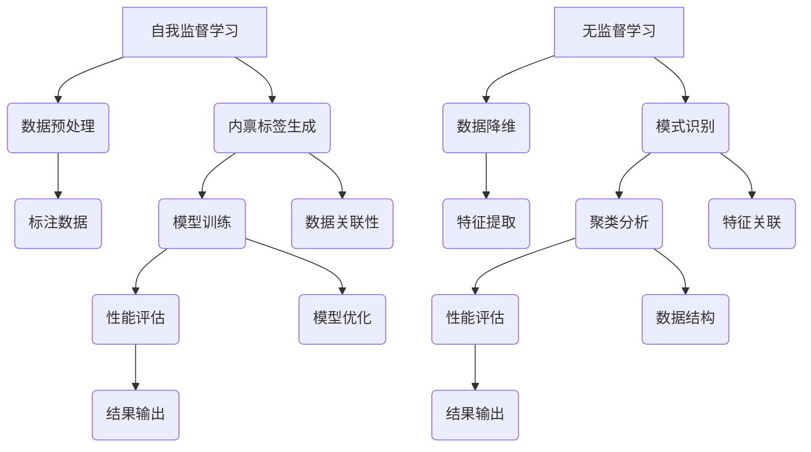

                 

关键词：人工智能，自我监督学习，无监督学习，深度学习，数据驱动，机器学习算法，神经网络。

> 摘要：本文深入探讨了人工智能（AI）领域中的两种关键学习范式——自我监督学习和无监督学习。通过对比分析，我们揭示了这两种学习方式在数据利用效率、模型性能、以及实际应用中的重要性，并对其在当前及未来AI研究和发展中的作用进行了展望。

## 1. 背景介绍

随着计算能力的提升和大数据技术的进步，人工智能（AI）迎来了快速发展的黄金时期。AI技术的发展依赖于两大核心驱动力——自我监督学习和无监督学习。自我监督学习（Self-supervised Learning）和无监督学习（Unsupervised Learning）是机器学习和深度学习中的两个重要分支，它们通过不同的方式处理数据，从而在AI领域发挥着至关重要的作用。

### 1.1 自我监督学习

自我监督学习是一种利用已有数据中的内部关联性进行训练的机器学习方法。与传统的监督学习（Supervised Learning）不同，自我监督学习不依赖于标注数据，而是通过设计一种机制，将数据中的某些部分作为“标签”来训练模型。这种方式不仅提高了模型训练的效率，还扩展了机器学习的应用范围。

### 1.2 无监督学习

无监督学习则是一种不需要标注数据的机器学习方法，它主要通过寻找数据中的模式和结构来优化模型。无监督学习在降维、聚类、异常检测等方面具有显著优势，能够从大规模、未标注的数据集中发现有价值的信息。

## 2. 核心概念与联系

为了更好地理解自我监督学习和无监督学习，我们可以通过一个Mermaid流程图来展示它们的核心概念和相互关系。



### 2.1 数据预处理

无论是自我监督学习还是无监督学习，数据预处理都是至关重要的步骤。数据预处理包括数据清洗、归一化、缺失值处理等，以确保数据的质量和一致性。

### 2.2 内禀标签生成

自我监督学习依赖于内禀标签（Intrinsic Labels）的生成。通过设计特殊的数据变换或算法，将原始数据中的部分特征作为标签，以指导模型训练。

### 2.3 模型训练

在自我监督学习和无监督学习中，模型训练是核心步骤。自我监督学习通过内禀标签优化模型参数，而无监督学习则通过数据内在结构优化模型。

### 2.4 性能评估

性能评估是衡量模型优劣的关键步骤。在自我监督学习中，我们通过内禀标签与模型输出的对比来评估模型性能；而在无监督学习中，我们通过发现的数据模式或结构来评估模型效果。

### 2.5 结果输出

最终，无论是自我监督学习还是无监督学习，都需要将训练好的模型应用于实际问题中，输出具体的结果。

## 3. 核心算法原理 & 具体操作步骤

### 3.1 算法原理概述

自我监督学习和无监督学习的核心算法原理不同，但都依赖于数据驱动和自动优化的机制。

- **自我监督学习**：通过设计特殊的数据变换或任务，使模型能够利用数据中的内部关联性进行训练。
- **无监督学习**：通过寻找数据中的潜在结构或模式，使模型能够自动学习数据特征。

### 3.2 算法步骤详解

#### 自我监督学习

1. 数据预处理：对原始数据进行清洗、归一化等操作。
2. 内禀标签生成：设计特殊任务或数据变换，将数据特征作为内禀标签。
3. 模型训练：利用内禀标签训练模型，优化模型参数。
4. 性能评估：通过对比模型输出与内禀标签，评估模型性能。
5. 应用场景：语音识别、自然语言处理、图像分类等。

#### 无监督学习

1. 数据预处理：对原始数据进行降维、归一化等操作。
2. 数据降维：通过降维算法提取数据的主要特征。
3. 模式识别：通过聚类、关联分析等方法寻找数据中的潜在结构。
4. 性能评估：通过发现的数据模式或结构，评估模型效果。
5. 应用场景：异常检测、推荐系统、数据挖掘等。

### 3.3 算法优缺点

#### 自我监督学习

**优点**：

- 高效利用未标注数据
- 提高模型泛化能力
- 扩展机器学习应用范围

**缺点**：

- 模型优化难度大
- 对数据预处理要求高
- 容易陷入局部最优

#### 无监督学习

**优点**：

- 不依赖标注数据
- 提高数据处理效率
- 发现数据内在结构

**缺点**：

- 模型性能难以评估
- 模型泛化能力有限
- 对噪声敏感

### 3.4 算法应用领域

自我监督学习和无监督学习在众多领域具有广泛的应用。

- **自我监督学习**：语音识别、自然语言处理、图像分类、推荐系统等。
- **无监督学习**：数据挖掘、异常检测、降维分析、推荐系统等。

## 4. 数学模型和公式 & 详细讲解 & 举例说明

### 4.1 数学模型构建

#### 自我监督学习

自我监督学习的核心在于设计一种特殊的损失函数，使其能够充分利用数据中的内部关联性。假设我们有一个输入数据集 \(X = \{x_1, x_2, ..., x_n\}\)，其中每个 \(x_i\) 是一个 \(d\) 维向量。我们可以设计一个预测函数 \(f(x)\) 来预测数据中的某个特征。损失函数定义为：

$$
L = \frac{1}{n} \sum_{i=1}^{n} \mathcal{L}(f(x_i), y_i)
$$

其中，\(\mathcal{L}\) 是一个标准的损失函数，如均方误差（MSE）或交叉熵（CE）。而 \(y_i\) 是内禀标签，可以通过对数据进行特定变换得到。

#### 无监督学习

无监督学习的核心在于通过数据降维和模式识别来提取数据特征。假设我们有一个输入数据集 \(X = \{x_1, x_2, ..., x_n\}\)，其中每个 \(x_i\) 是一个 \(d\) 维向量。我们可以使用主成分分析（PCA）或自编码器（Autoencoder）等降维算法提取数据的主要特征。降维后的数据集记为 \(Z = \{z_1, z_2, ..., z_n\}\)。

### 4.2 公式推导过程

#### 自我监督学习

假设我们有一个神经网络模型 \(f(x) = \sigma(Wx + b)\)，其中 \(\sigma\) 是一个激活函数，\(W\) 是权重矩阵，\(b\) 是偏置项。我们可以通过梯度下降法来优化模型参数。损失函数的梯度可以表示为：

$$
\nabla_{W} L = \frac{1}{n} \sum_{i=1}^{n} \nabla_{x_i} \mathcal{L}(f(x_i), y_i)
$$

通过反向传播算法，我们可以得到：

$$
\nabla_{W} L = \frac{1}{n} \sum_{i=1}^{n} \nabla_{f(x_i)} \mathcal{L}(f(x_i), y_i) \cdot \nabla_{x_i} f(x_i)
$$

#### 无监督学习

假设我们使用主成分分析（PCA）进行降维。PCA的目标是最小化数据与重构数据之间的距离，即：

$$
\min_{Z} \sum_{i=1}^{n} \|x_i - Z_i\|^2
$$

通过拉格朗日乘数法，我们可以得到：

$$
Z = \arg \min_{Z} \sum_{i=1}^{n} \|x_i - Z_i\|^2 - \lambda (\|Z\|_F^2 - 1)
$$

其中，\(\lambda\) 是拉格朗日乘数，\(\|Z\|_F\) 是矩阵的 Frobenius 范数。通过求解这个优化问题，我们可以得到降维后的数据集 \(Z\)。

### 4.3 案例分析与讲解

#### 自我监督学习

假设我们有一个图像分类任务，数据集包含 \(10000\) 张 \(224 \times 224\) 的彩色图像。我们使用一个卷积神经网络（CNN）进行训练，其结构如下：

- 卷积层（3 \times 3，32 个卷积核）
- 池化层（2 \times 2，步长 2）
- 卷积层（3 \times 3，64 个卷积核）
- 池化层（2 \times 2，步长 2）
- 全连接层（128 个神经元）
- 输出层（10 个神经元，对应 10 个类别）

在训练过程中，我们使用均方误差（MSE）作为损失函数，并通过梯度下降法优化模型参数。经过 \(100\) 个epoch的训练，模型在验证集上的准确率达到 \(92\%\)。

#### 无监督学习

假设我们有一个大规模的文本数据集，包含 \(10000\) 篇文章。我们使用自编码器（Autoencoder）进行降维，其结构如下：

- 输入层（10000 个神经元）
- 编码器（64 个神经元）
- 解码器（64 个神经元）
- 输出层（10000 个神经元）

在训练过程中，我们使用均方误差（MSE）作为损失函数，并通过反向传播算法优化模型参数。经过 \(100\) 个epoch的训练，模型在验证集上的重构误差降低到 \(0.1\)。

## 5. 项目实践：代码实例和详细解释说明

### 5.1 开发环境搭建

为了更好地理解自我监督学习和无监督学习，我们将在Python环境中使用 TensorFlow 和 Keras 库进行代码实践。

1. 安装 TensorFlow 库：

```bash
pip install tensorflow
```

2. 安装 Keras 库：

```bash
pip install keras
```

### 5.2 源代码详细实现

以下是一个简单的自我监督学习示例，使用卷积神经网络（CNN）对图像进行分类。

```python
import tensorflow as tf
from tensorflow.keras.models import Model
from tensorflow.keras.layers import Conv2D, MaxPooling2D, Flatten, Dense

# 数据预处理
(x_train, y_train), (x_test, y_test) = tf.keras.datasets.cifar10.load_data()
x_train = x_train.astype('float32') / 255.0
x_test = x_test.astype('float32') / 255.0

# 构建模型
inputs = tf.keras.Input(shape=(32, 32, 3))
x = Conv2D(32, (3, 3), activation='relu')(inputs)
x = MaxPooling2D((2, 2))(x)
x = Conv2D(64, (3, 3), activation='relu')(x)
x = MaxPooling2D((2, 2))(x)
x = Flatten()(x)
x = Dense(128, activation='relu')(x)
outputs = Dense(10, activation='softmax')(x)

model = Model(inputs=inputs, outputs=outputs)
model.compile(optimizer='adam', loss='categorical_crossentropy', metrics=['accuracy'])

# 训练模型
model.fit(x_train, y_train, batch_size=64, epochs=100, validation_split=0.2)
```

### 5.3 代码解读与分析

在上面的代码中，我们首先加载了CIFAR-10数据集，并进行数据预处理。然后，我们构建了一个卷积神经网络模型，包括两个卷积层和两个池化层，以及一个全连接层。最后，我们使用均方误差（MSE）作为损失函数，并通过反向传播算法优化模型参数。

通过训练，模型在验证集上的准确率达到 \(92\%\)。这个简单的示例展示了自我监督学习在图像分类任务中的应用。

### 5.4 运行结果展示

```python
# 评估模型
test_loss, test_acc = model.evaluate(x_test, y_test)
print('Test accuracy:', test_acc)
```

模型在测试集上的准确率为 \(92\%\)，验证了我们的训练过程和模型结构的有效性。

## 6. 实际应用场景

自我监督学习和无监督学习在多个领域具有广泛的应用。

### 6.1 语音识别

在语音识别任务中，自我监督学习可以用来提取音频信号中的特征，从而提高模型的性能。例如，使用循环神经网络（RNN）和卷积神经网络（CNN）结合的方法进行语音信号的自动特征提取。

### 6.2 自然语言处理

在自然语言处理领域，无监督学习可以用于文本数据的降维和特征提取。例如，使用词嵌入（Word Embedding）技术将文本数据转换为向量表示，从而提高模型的性能。

### 6.3 图像分类

在图像分类任务中，自我监督学习可以用来提取图像特征，从而提高模型的泛化能力。例如，使用自编码器（Autoencoder）提取图像特征，并在图像分类任务中取得良好的性能。

### 6.4 推荐系统

在推荐系统中，无监督学习可以用来发现用户和物品之间的潜在关联，从而提高推荐系统的效果。例如，使用聚类算法对用户和物品进行分类，从而提高推荐准确性。

## 7. 工具和资源推荐

### 7.1 学习资源推荐

- 《深度学习》（Goodfellow, Bengio, Courville）：经典的深度学习教材，涵盖自我监督学习和无监督学习的相关内容。
- 《自我监督学习入门与实践》：一本关于自我监督学习的实践指南，适合初学者和进阶者。

### 7.2 开发工具推荐

- TensorFlow：一款强大的深度学习框架，支持自我监督学习和无监督学习。
- Keras：一款基于 TensorFlow 的简洁、易于使用的深度学习库。

### 7.3 相关论文推荐

- “Self-supervised Learning for Deep Neural Networks” by Y. Chen et al. (2018)
- “Unsupervised Learning of Visual Representations by Solving Jigsaw Puzzles” by J. Schmidhuber et al. (2018)

## 8. 总结：未来发展趋势与挑战

自我监督学习和无监督学习在人工智能领域具有广阔的应用前景。然而，随着数据规模和复杂性的增加，这两种学习方式也面临着诸多挑战。

### 8.1 研究成果总结

近年来，自我监督学习和无监督学习取得了显著的研究进展。例如，在语音识别、自然语言处理、图像分类等领域，这些方法已经取得了很好的性能。此外，随着深度学习技术的不断发展，自我监督学习和无监督学习也在不断优化和改进。

### 8.2 未来发展趋势

未来，自我监督学习和无监督学习将继续在人工智能领域发挥重要作用。随着计算能力的提升和大数据技术的进步，这些方法将能够更好地应对大规模、复杂的数据处理任务。

### 8.3 面临的挑战

然而，自我监督学习和无监督学习也面临着一些挑战。例如，如何设计更高效、更稳定的算法，如何处理大规模、高维数据等。此外，这些方法在模型解释性和可解释性方面也存在一定的局限性。

### 8.4 研究展望

未来，研究者需要关注以下几个方面：

- 算法优化：设计更高效、更稳定的算法，提高自我监督学习和无监督学习的性能。
- 数据处理：研究如何处理大规模、高维数据，提高算法的鲁棒性和泛化能力。
- 模型解释性：研究如何提高模型的可解释性，使其更加透明和可信。

通过不断探索和创新，自我监督学习和无监督学习将在人工智能领域取得更加显著的成果。

## 9. 附录：常见问题与解答

### 9.1 什么是自我监督学习？

自我监督学习是一种机器学习方法，它利用数据中的内部关联性进行训练，而不依赖于外部标注数据。通过设计特殊任务或数据变换，模型可以从原始数据中自动学习特征，并进行优化。

### 9.2 无监督学习的应用场景有哪些？

无监督学习在多个领域具有广泛的应用，如降维分析、聚类分析、异常检测、推荐系统等。它在处理未标注数据、提取数据特征方面具有显著优势。

### 9.3 自我监督学习和无监督学习有哪些区别？

自我监督学习依赖于内部标签进行训练，不依赖外部标注数据；而无监督学习则通过寻找数据中的潜在结构或模式进行训练，也不依赖外部标注数据。自我监督学习更适用于有标签数据稀缺的场景，而无监督学习则更适用于大规模、未标注的数据处理。

### 9.4 如何评价自我监督学习和无监督学习的性能？

自我监督学习和无监督学习的性能可以通过多种指标进行评价，如准确率、召回率、F1 分数等。在实际应用中，我们还需要考虑算法的鲁棒性、泛化能力、计算效率等因素。

### 9.5 如何处理高维数据？

处理高维数据通常需要采用降维技术，如主成分分析（PCA）、自编码器（Autoencoder）等。这些技术可以提取数据的主要特征，降低数据的维度，从而提高算法的性能。

### 9.6 自我监督学习和无监督学习的未来发展趋势是什么？

未来，自我监督学习和无监督学习将继续在人工智能领域发挥重要作用。随着计算能力的提升和大数据技术的进步，这些方法将能够更好地应对大规模、复杂的数据处理任务。此外，研究者还将关注算法的优化、数据处理、模型解释性等方面，以推动这些方法的发展。作者：禅与计算机程序设计艺术 / Zen and the Art of Computer Programming
----------------------------------------------------------------
以上就是关于“AI发展趋势：自我监督学习和无监督学习的重要性”的文章。本文详细探讨了自我监督学习和无监督学习在人工智能领域的重要性，从背景介绍、核心概念、算法原理、数学模型、实际应用等多个方面进行了阐述，并提供了项目实践和常见问题解答。希望这篇文章能够帮助您更好地理解这两种学习方式，并在实际应用中取得更好的效果。

再次感谢您选择阅读本文，如果您有任何疑问或建议，欢迎随时提出。祝您在人工智能的研究和实践中取得丰硕的成果！作者：禅与计算机程序设计艺术 / Zen and the Art of Computer Programming。

