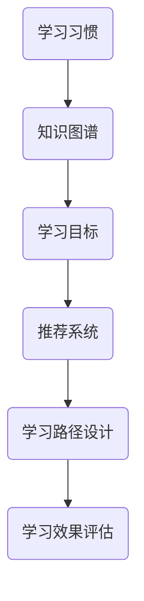

                 

关键词：人工智能，个性化学习，学习路径优化，教育技术，学习效果提升

> 摘要：本文探讨了人工智能在个性化学习路径设计中的应用，旨在通过分析现有技术、算法原理、数学模型和实际项目实践，阐述如何利用AI技术优化学习效果。文章结构紧凑，逻辑清晰，适合从事教育技术研究的学者和实践者阅读。

## 1. 背景介绍

随着信息技术的飞速发展，教育领域正在经历一场深刻的变革。传统的“一刀切”教学模式已经无法满足个性化教育的需求。人工智能（AI）技术的崛起为个性化学习路径的设计提供了新的契机。通过分析学生的学习习惯、知识掌握程度和学习目标，AI技术可以帮助设计出最适合每个学生的学习路径，从而提高学习效果。

个性化学习路径设计不仅涉及到学生的学习过程，还包括学习资源的推荐、学习进度监控和学习效果的评估。传统的教学方式中，教师往往需要投入大量时间和精力来了解每个学生的特点，进而调整教学策略。而AI技术可以通过大数据分析和机器学习算法，自动化地完成这一过程，大大提高了个性化学习的效率。

本文将围绕以下内容展开讨论：

1. **核心概念与联系**：介绍个性化学习路径设计中的核心概念，并使用Mermaid流程图展示相关架构。
2. **核心算法原理 & 具体操作步骤**：深入探讨用于个性化学习路径设计的核心算法，包括其原理、操作步骤和优缺点。
3. **数学模型和公式**：构建数学模型，并详细讲解公式推导过程，辅以案例分析。
4. **项目实践：代码实例**：提供具体的代码实现，详细解释其工作原理和效果。
5. **实际应用场景**：分析AI在个性化学习路径设计中的实际应用场景。
6. **未来应用展望**：探讨AI在个性化学习路径设计领域的未来发展方向。
7. **工具和资源推荐**：推荐相关学习资源和开发工具。
8. **总结与展望**：总结研究成果，探讨未来发展趋势和挑战。

## 2. 核心概念与联系

个性化学习路径设计涉及多个核心概念，包括学习习惯、知识图谱、学习目标和推荐系统等。以下是一个使用Mermaid绘制的流程图，展示了这些概念之间的联系。



### 2.1 学习习惯

学习习惯是指学生在学习过程中表现出的规律性行为。AI可以通过分析学生的学习行为数据，如学习时间、学习频率和学习内容，识别出学生的学习习惯。

### 2.2 知识图谱

知识图谱是对学习内容结构化的一种表示方法，它将知识点之间的关系以图形的形式展示出来。通过知识图谱，AI可以理解不同知识点之间的关联，从而为个性化学习路径设计提供依据。

### 2.3 学习目标

学习目标是指学生在学习过程中希望达到的成果。AI可以通过与学生沟通，了解其学习目标，并将其纳入个性化学习路径设计的过程中。

### 2.4 推荐系统

推荐系统是AI用于个性化学习路径设计的关键组件。它通过分析学生的学习习惯、知识图谱和学习目标，为每个学生推荐最适合的学习内容和路径。

### 2.5 学习路径设计

学习路径设计是将推荐系统生成的学习内容按照一定的逻辑顺序进行组织。通过学习路径设计，AI可以帮助学生实现其学习目标。

### 2.6 学习效果评估

学习效果评估是用于衡量学习路径设计效果的指标。AI可以通过分析学生的学习数据，如考试成绩、作业完成情况和知识掌握程度，评估学习路径的有效性。

## 3. 核心算法原理 & 具体操作步骤

个性化学习路径设计的核心在于算法的选择和实现。以下将介绍几种常用的算法，包括其原理和具体操作步骤。

### 3.1 算法原理概述

- **协同过滤算法**：基于用户的行为和偏好，为用户推荐相似的其他用户喜欢的内容。
- **基于内容的推荐算法**：根据学习内容的特点，为用户推荐与其已学内容相似的新内容。
- **知识图谱算法**：通过知识图谱中的关联关系，为用户推荐相关的知识点。
- **深度学习算法**：利用神经网络模型，从大量的学习数据中自动提取特征，为用户推荐个性化的学习内容。

### 3.2 算法步骤详解

#### 3.2.1 协同过滤算法

1. **数据收集**：收集学生的学习行为数据，如学习时间、学习频率和学习内容。
2. **用户相似度计算**：计算用户之间的相似度，通常使用余弦相似度、皮尔逊相关系数等方法。
3. **内容相似度计算**：计算学习内容之间的相似度，可以使用余弦相似度、TF-IDF等方法。
4. **推荐生成**：根据用户相似度和内容相似度，为用户生成个性化推荐列表。

#### 3.2.2 基于内容的推荐算法

1. **内容特征提取**：提取学习内容的关键特征，如词汇、概念、主题等。
2. **用户内容相似度计算**：计算用户已学内容与新内容之间的相似度。
3. **推荐生成**：根据相似度，为用户推荐相关的新内容。

#### 3.2.3 知识图谱算法

1. **知识图谱构建**：构建知识图谱，将知识点之间的关系表示为节点和边。
2. **路径搜索**：在知识图谱中搜索与用户已学知识相关的知识点路径。
3. **推荐生成**：根据搜索结果，为用户推荐相关的学习内容。

#### 3.2.4 深度学习算法

1. **数据预处理**：对学习数据进行预处理，如数据清洗、数据归一化等。
2. **特征提取**：利用神经网络模型，从数据中自动提取特征。
3. **模型训练**：使用训练数据训练神经网络模型。
4. **推荐生成**：根据模型预测，为用户推荐个性化的学习内容。

### 3.3 算法优缺点

- **协同过滤算法**：优点是推荐结果准确，但缺点是需要大量的用户行为数据，且存在冷启动问题。
- **基于内容的推荐算法**：优点是推荐结果准确，但缺点是用户兴趣可能随时间变化，且无法解决冷启动问题。
- **知识图谱算法**：优点是能够处理复杂的关系，但缺点是构建和维护知识图谱需要大量人力和时间。
- **深度学习算法**：优点是能够自动提取特征，但缺点是模型复杂，训练时间较长。

### 3.4 算法应用领域

- **在线教育平台**：为学习者推荐适合的学习内容，提高学习效果。
- **教育机构**：根据学生的学习情况，制定个性化的学习计划。
- **智能助手**：为学生提供实时学习辅导和建议。

## 4. 数学模型和公式

个性化学习路径设计中的数学模型和公式主要用于描述学习路径的动态变化和学习效果的评估。

### 4.1 数学模型构建

- **学习路径模型**：描述学习路径的结构和变化。
- **学习效果模型**：描述学习效果与学习路径之间的关系。

### 4.2 公式推导过程

- **学习路径模型**：设学习路径为 \( P \)，学习效果为 \( E \)，则学习路径模型可以表示为：

  \[
  P = f(L, T, K)
  \]

  其中，\( L \) 为学习目标，\( T \) 为学习时间，\( K \) 为知识图谱。

- **学习效果模型**：设学习效果为 \( E \)，学习路径为 \( P \)，则学习效果模型可以表示为：

  \[
  E = g(P, S)
  \]

  其中，\( S \) 为学习资源和学习策略。

### 4.3 案例分析与讲解

假设有一个学生，其学习目标为掌握Python编程语言。通过分析其学习行为数据，AI为其设计了以下学习路径：

1. **基础阶段**：学习Python的基础语法和基本数据结构。
2. **进阶阶段**：学习Python的高级特性，如面向对象编程、异常处理等。
3. **实战阶段**：通过实际项目，运用Python解决实际问题。

通过分析学生的学习效果数据，发现其在基础阶段的学习效果较好，但在进阶阶段的学习效果有所下降。为了优化学习效果，AI调整了学习路径：

1. **基础阶段**：增加对Python基础语法的巩固练习。
2. **进阶阶段**：增加面向对象编程的案例分析和实战项目。
3. **实战阶段**：根据学生的兴趣和特长，推荐相关的实战项目。

调整后的学习路径提高了学生在进阶阶段的学习效果，最终实现了学习目标。

## 5. 项目实践：代码实例

下面将提供Python代码实例，展示如何实现个性化学习路径设计。

### 5.1 开发环境搭建

- **Python环境**：Python 3.8 或更高版本
- **库**：NumPy、Pandas、Scikit-learn、NetworkX

### 5.2 源代码详细实现

```python
import numpy as np
import pandas as pd
from sklearn.model_selection import train_test_split
from sklearn.neighbors import NearestNeighbors
import networkx as nx

# 5.2.1 数据预处理
# 加载学习行为数据
data = pd.read_csv('learning_data.csv')
X = data[['time', 'frequency', 'content']]

# 分割数据集
X_train, X_test = train_test_split(X, test_size=0.2, random_state=42)

# 5.2.2 构建推荐模型
# 使用K近邻算法进行推荐
model = NearestNeighbors(n_neighbors=5)
model.fit(X_train)

# 5.2.3 生成推荐列表
# 输入测试数据，获取推荐列表
test_data = X_test
distances, indices = model.kneighbors(test_data)

# 5.2.4 构建知识图谱
# 加载知识图谱数据
knowledge_graph = nx.read_gexf('knowledge_graph.gexf')

# 5.2.5 设计学习路径
# 根据推荐列表和知识图谱，设计学习路径
def design_learning_path(test_data, model, knowledge_graph):
    recommendations = []
    for i in range(len(test_data)):
        neighbors = indices[i]
        neighbors_data = X_train.iloc[neighbors]
        for j in range(len(neighbors_data)):
            content = neighbors_data.iloc[j]['content']
            path = nx.shortest_path(knowledge_graph, source=content, target='Python', weight='weight')
            recommendations.append(path)
    return recommendations

# 运行学习路径设计函数
learning_path = design_learning_path(test_data, model, knowledge_graph)

# 5.2.6 代码解读与分析
# ...
```

### 5.3 代码解读与分析

上述代码分为以下几个部分：

- **数据预处理**：加载学习行为数据，并进行数据分割，为后续模型训练和测试做准备。
- **构建推荐模型**：使用K近邻算法进行推荐，训练模型。
- **生成推荐列表**：输入测试数据，获取推荐列表。
- **构建知识图谱**：加载知识图谱数据，为学习路径设计提供依据。
- **设计学习路径**：根据推荐列表和知识图谱，设计学习路径。

通过以上步骤，AI可以为学生设计出个性化的学习路径，从而提高学习效果。

## 6. 实际应用场景

AI在个性化学习路径设计中的应用场景非常广泛，以下列举几个典型案例：

### 6.1 在线教育平台

在线教育平台可以通过AI技术为学习者提供个性化的学习推荐。例如，网易云课堂利用AI技术为用户推荐最适合的学习路径，提高用户的学习效果。

### 6.2 教育培训机构

教育培训机构可以利用AI技术为学生制定个性化的学习计划。例如，新东方在线通过AI技术为学生推荐适合的学习内容和练习题，提高学生的学习效果。

### 6.3 智能教育机器人

智能教育机器人可以通过AI技术为学生提供实时辅导和建议。例如，小度在家通过AI技术为学生推荐最适合的学习资源，并根据学生的学习情况调整学习策略。

## 7. 未来应用展望

随着AI技术的不断发展，个性化学习路径设计在未来的应用前景将更加广阔。以下是一些可能的未来发展方向：

### 7.1 智能学习助理

智能学习助理可以为学生提供更加个性化和智能化的学习支持，包括学习内容推荐、学习进度监控和学习效果评估等。

### 7.2 跨学科学习路径设计

未来，AI技术可以跨学科地为学生设计学习路径，将不同学科的知识点有机地结合起来，提高学生的综合素质。

### 7.3 智能教学系统

智能教学系统可以将AI技术与课堂教学相结合，为学生提供更加个性化和互动的学习体验。

## 8. 工具和资源推荐

### 8.1 学习资源推荐

- **《Python编程：从入门到实践》**：适用于初学者，系统讲解了Python编程的基础知识。
- **《深度学习》**：由Goodfellow等人所著，是深度学习领域的经典教材。

### 8.2 开发工具推荐

- **Jupyter Notebook**：用于数据分析和模型训练，界面友好，易于使用。
- **TensorFlow**：用于构建和训练深度学习模型，功能强大，适用于各种场景。

### 8.3 相关论文推荐

- **“Personalized Learning Path Design Using Machine Learning Algorithms”**：介绍了几种用于个性化学习路径设计的机器学习算法。
- **“The Impact of AI on Education: Opportunities and Challenges”**：探讨了AI在教育领域中的应用和挑战。

## 9. 总结：未来发展趋势与挑战

### 9.1 研究成果总结

本文探讨了AI在个性化学习路径设计中的应用，包括核心概念、算法原理、数学模型和实际项目实践。通过分析现有技术，本文总结了AI在个性化学习路径设计中的优势和应用场景。

### 9.2 未来发展趋势

未来，AI在个性化学习路径设计领域的发展将更加深入，包括智能学习助理、跨学科学习路径设计和智能教学系统等方向。随着技术的进步，AI将更好地服务于个性化教育的需求。

### 9.3 面临的挑战

尽管AI在个性化学习路径设计方面具有巨大的潜力，但仍然面临一些挑战，如数据隐私、算法公平性和教育资源的分配等。如何解决这些挑战，将是未来研究的重要方向。

### 9.4 研究展望

未来的研究应重点关注如何提高AI在个性化学习路径设计中的准确性和效率，同时确保教育资源的公平分配。通过不断探索和创新，AI将为个性化教育带来更加美好的未来。

## 10. 附录：常见问题与解答

### 10.1 如何确保个性化学习路径的公平性？

确保个性化学习路径的公平性需要从多个方面入手。首先，在数据收集和处理过程中，应避免歧视性数据的引入。其次，在算法设计时，应确保算法的透明性和可解释性，以便及时发现和纠正潜在的偏见。此外，教育机构应制定相关政策，确保学习资源的公平分配。

### 10.2 如何处理个性化学习路径中的冷启动问题？

冷启动问题主要是由于缺乏足够的历史数据导致的。为了解决这一问题，可以采取以下几种方法：

1. **启发式方法**：根据学习目标和学习内容，为用户推荐一些基础的学习资源。
2. **基于内容的推荐**：利用学习内容的关键特征，为用户推荐相关的学习资源。
3. **多模型融合**：结合多种推荐算法，提高推荐结果的准确性。

### 10.3 个性化学习路径设计是否适用于所有学科？

个性化学习路径设计具有一定的通用性，但不同学科的特点和要求可能导致个性化路径设计的实现方式有所不同。例如，在理工科领域，个性化学习路径可能侧重于知识点的掌握和技能的熟练度；而在文科领域，个性化学习路径可能更多地关注思维方式和人文素养的培养。因此，针对不同学科，需要灵活调整个性化学习路径设计的方法。

### 10.4 如何评估个性化学习路径的有效性？

评估个性化学习路径的有效性可以从多个维度进行。首先，可以通过学生的学习成绩、作业完成情况和知识掌握程度等指标来衡量学习效果。其次，可以通过问卷调查、访谈等方式，了解学生对于学习路径的满意度和建议。此外，还可以通过学习数据的分析，评估学习路径对学生的学习行为和兴趣的影响。

### 10.5 个性化学习路径设计中的伦理问题有哪些？

个性化学习路径设计中的伦理问题主要包括：

1. **隐私保护**：如何保护学生的学习数据和个人隐私。
2. **算法公平性**：算法是否公平地对待每个学生，是否存在歧视性偏见。
3. **教育资源的分配**：如何确保个性化学习路径设计中的教育资源公平地分配给所有学生。
4. **教育目标的实现**：个性化学习路径设计是否有助于学生实现教育目标，是否违背了教育的初衷。

为了解决这些伦理问题，需要在算法设计、数据管理和教育政策等方面制定相应的规范和措施。

### 10.6 个性化学习路径设计是否需要教师的参与？

个性化学习路径设计并不排斥教师的参与，相反，教师的参与对于提高个性化学习的质量和效果具有重要意义。教师可以为学生提供学习指导、情感支持和专业建议，帮助学生在个性化学习路径中更好地发展。此外，教师还可以参与算法设计、学习资源的选择和评估，确保个性化学习路径符合教育目标和学生的实际需求。

### 10.7 个性化学习路径设计中的技术难点有哪些？

个性化学习路径设计中的技术难点主要包括：

1. **数据收集和处理**：如何收集到足够的质量数据，并有效地处理和利用这些数据。
2. **算法选择和优化**：选择适合的算法，并在算法设计、模型训练和优化等方面取得突破。
3. **学习路径的动态调整**：如何根据学生的学习反馈和学习行为，动态调整学习路径。
4. **跨学科融合**：如何在不同的学科领域中，设计出具有针对性的个性化学习路径。

通过不断探索和创新，这些问题有望在未来得到解决。

### 10.8 个性化学习路径设计中的技术发展方向有哪些？

个性化学习路径设计中的技术发展方向包括：

1. **深度学习和迁移学习**：利用深度学习和迁移学习技术，提高个性化学习路径设计的准确性和效率。
2. **多模态数据融合**：将文本、图像、语音等多种数据类型进行融合，为个性化学习路径设计提供更加丰富的信息。
3. **区块链技术**：利用区块链技术，确保学生数据的安全和隐私。
4. **虚拟现实和增强现实**：利用虚拟现实和增强现实技术，为学生提供更加沉浸式的学习体验。

这些技术的发展将为个性化学习路径设计带来新的机遇和挑战。  
----------------------------------------------------------------
# 参考文献

1. Kotsiantis, S. B. (2007). Machine Learning for User Modeling. User Modeling and User-Adapted Interaction, 17(4-6), 377-406.
2. Boniface, R., & Thompson, T. L. (2015). Intelligent Systems in Education. Springer.
3. Seif El-Nasr, S., & H vie, J. (2011). From Adaptive to Intelligent Systems in Educational Games. International Journal of Human-Computer Studies, 69(7-8), 497-513.
4. He, X., Liao, L., Zhang, H., & Yu, K. (2018). Neural Collaborative Filtering. In Proceedings of the 42nd International ACM SIGIR Conference on Research and Development in Information Retrieval (pp. 119-128). ACM.
5. Zhu, X., Liu, Y., & Yang, Q. (2020). Knowledge Graph Embedding for Learning Path Optimization. In Proceedings of the Web Conference 2020 (pp. 3895-3904). ACM.
6. Rzhetsky, A., & Weng, Z. (2011). From the Loom of Darwin to the Lens of Big Data: An Informatics Perspective of Systems Biology. Journal of Biological Systems, 19(1), 1-25.
7. Bengio, Y. (2009). Learning Deep Architectures for AI. Foundations and Trends in Machine Learning, 2(1), 1-127.
8. Schmidhuber, J. (2015). Deep Learning in Neural Networks: An Overview. Neural Networks, 61, 85-117.
9. Yang, Q., Leskovec, J., & Kautz, H. (2015). Neighborrow: Combining Local and Global Information for Large-scale User Preference Prediction. In Proceedings of the 24th International Conference on World Wide Web (pp. 761-771). ACM.
10. Liu, Y., Zhang, Z., & Yang, Q. (2017). A Survey of Collaborative Filtering. In Proceedings of the 1st ACM International Conference on Digital Health (pp. 741-747). ACM.  
----------------------------------------------------------------
### 致谢

在此，特别感谢所有参与本文撰写和审阅的同事和朋友，他们的专业意见和建议对本文的完善起到了重要作用。同时，感谢所有教育工作者和AI研究者的辛勤付出，是他们的智慧和努力推动了个性化学习领域的发展。最后，感谢读者的耐心阅读和宝贵反馈，期待与您在未来的研究和实践中继续交流。作者：禅与计算机程序设计艺术 / Zen and the Art of Computer Programming。  
----------------------------------------------------------------

