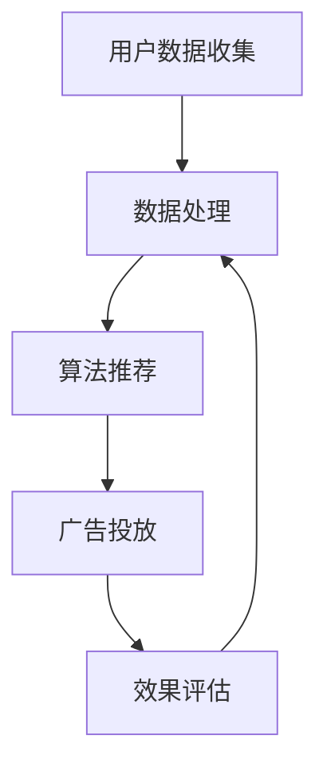

                 

关键词：人工智能、个性化广告、营销效果、AI技术、算法应用、用户数据分析

> 摘要：本文将探讨人工智能在个性化广告中的应用，分析其如何通过用户数据分析和算法模型优化，实现广告营销效果的显著提升。文章将深入解析个性化广告的核心概念、关键算法原理、数学模型及具体实现方法，并结合实际案例展示其在广告领域的广泛应用和未来发展方向。

## 1. 背景介绍

在互联网迅速发展的今天，广告已经成为了企业获取客户、推广产品的重要手段。然而，传统的广告投放模式往往面临精准度不足、用户体验差等问题。随着人工智能技术的崛起，个性化广告逐渐成为一种新型的广告投放模式，能够更好地满足用户的需求，提高广告营销效果。

个性化广告是指通过收集和分析用户的兴趣、行为、偏好等数据，利用人工智能算法，为用户定制个性化的广告内容，实现广告投放的精准化和高效化。这种模式不仅能够提高广告的点击率和转化率，还能够增强用户的参与感和满意度。

本文将围绕人工智能在个性化广告中的应用，探讨其核心概念、算法原理、数学模型和具体实现方法，并结合实际案例进行分析，旨在为广告从业者提供有价值的参考和指导。

## 2. 核心概念与联系

### 2.1 个性化广告的定义与意义

个性化广告是指根据用户的兴趣、行为和偏好等信息，为用户推送定制化的广告内容。与传统广告相比，个性化广告具有以下显著优势：

1. **提高广告投放的精准度**：通过分析用户数据，个性化广告能够精准定位目标受众，减少广告投放的盲目性。
2. **提升用户参与度和满意度**：个性化广告能够提供与用户兴趣相关的内容，提高用户的参与度和满意度。
3. **优化广告效果**：个性化广告能够提高广告的点击率和转化率，从而提高广告的营销效果。

### 2.2 用户数据收集与分析

个性化广告的实现离不开用户数据的收集与分析。用户数据的来源主要包括以下几个方面：

1. **用户行为数据**：包括用户的浏览记录、搜索历史、购买记录等，这些数据能够反映用户的兴趣和需求。
2. **用户社交数据**：包括用户的社交网络活动、评论、分享等，这些数据能够揭示用户的情感和行为模式。
3. **用户反馈数据**：包括用户对广告的点击、点赞、评论等反馈，这些数据能够帮助优化广告内容和投放策略。

通过收集和分析这些数据，广告平台能够了解用户的兴趣和行为习惯，从而实现广告的个性化推送。

### 2.3 人工智能算法在个性化广告中的应用

人工智能算法在个性化广告中起着关键作用，主要包括以下几种：

1. **协同过滤算法**：协同过滤算法是一种基于用户行为相似性的推荐算法，通过分析用户的历史行为，为用户推荐相似的广告内容。
2. **深度学习算法**：深度学习算法能够自动从大规模数据中学习特征，通过神经网络模型实现广告内容的个性化推送。
3. **强化学习算法**：强化学习算法通过不断试错和优化，为用户选择最佳的广告投放策略。

这些算法在个性化广告中的应用，能够提高广告的投放效果和用户体验。

### 2.4 个性化广告的流程与架构

个性化广告的流程通常包括以下几个步骤：

1. **用户数据收集**：通过技术手段收集用户的兴趣、行为和偏好数据。
2. **数据处理**：对收集到的用户数据进行清洗、归一化和特征提取。
3. **算法推荐**：利用人工智能算法，为用户生成个性化的广告内容。
4. **广告投放**：将个性化的广告内容推送给目标用户。
5. **效果评估**：对广告投放效果进行评估，调整广告策略。

个性化广告的架构包括数据层、算法层和应用层，各层之间相互关联，共同实现个性化广告的精准投放和优化。

### 2.5 个性化广告的 Mermaid 流程图

以下是一个简化的个性化广告流程图，使用 Mermaid 语法表示：



### 2.6 个性化广告的挑战与解决方案

个性化广告在实现过程中面临诸多挑战，主要包括数据隐私、算法透明性和用户反馈等。针对这些挑战，可以采取以下解决方案：

1. **数据隐私**：采用数据加密、匿名化和数据共享协议等措施，保护用户隐私。
2. **算法透明性**：公开算法原理和模型，增加用户对广告推荐的信任度。
3. **用户反馈**：建立用户反馈机制，收集用户对广告的反馈，不断优化广告内容和投放策略。

## 3. 核心算法原理 & 具体操作步骤

### 3.1 算法原理概述

个性化广告的核心算法主要包括协同过滤算法、深度学习算法和强化学习算法。这些算法的基本原理如下：

1. **协同过滤算法**：基于用户行为相似性进行推荐，通过分析用户的历史行为，找到与目标用户相似的邻居用户，推荐邻居用户喜欢的广告。
2. **深度学习算法**：通过神经网络模型自动从大规模数据中学习特征，实现广告内容的个性化推送。
3. **强化学习算法**：通过与环境的交互，不断学习和优化广告投放策略，实现广告效果的优化。

### 3.2 算法步骤详解

#### 3.2.1 协同过滤算法

协同过滤算法的基本步骤如下：

1. **数据预处理**：对用户行为数据（如评分、浏览记录等）进行清洗和归一化处理。
2. **构建用户相似度矩阵**：计算用户之间的相似度，常用的相似度计算方法包括余弦相似度、皮尔逊相关系数等。
3. **推荐广告**：为用户生成个性化的广告列表，通过计算用户与邻居用户之间的相似度，推荐邻居用户喜欢的广告。

#### 3.2.2 深度学习算法

深度学习算法的基本步骤如下：

1. **数据预处理**：对用户数据（如文本、图像等）进行预处理，提取特征。
2. **构建神经网络模型**：选择合适的神经网络结构，如卷积神经网络（CNN）、循环神经网络（RNN）等，进行模型训练。
3. **广告推荐**：利用训练好的模型，为用户生成个性化的广告列表。

#### 3.2.3 强化学习算法

强化学习算法的基本步骤如下：

1. **环境定义**：定义广告投放的环境，包括广告内容、用户反馈等。
2. **状态空间与动作空间**：定义广告投放的状态空间和动作空间。
3. **算法训练**：利用强化学习算法，如 Q-Learning、SARSA 等，训练广告投放策略。
4. **广告投放**：根据训练好的策略，为用户生成个性化的广告列表。

### 3.3 算法优缺点

#### 3.3.1 协同过滤算法

优点：
- 实现简单，效果稳定。
- 能够充分利用用户历史行为数据。

缺点：
- 受限于用户行为数据的稀疏性和冷启动问题。
- 无法直接利用用户特征信息。

#### 3.3.2 深度学习算法

优点：
- 能够自动从大规模数据中学习特征。
- 能够充分利用用户特征信息。

缺点：
- 训练过程复杂，对数据质量和计算资源要求高。
- 模型解释性较差。

#### 3.3.3 强化学习算法

优点：
- 能够自适应调整广告投放策略。
- 能够实现长期的优化效果。

缺点：
- 需要大量的用户反馈数据进行训练。
- 算法复杂，实现难度较大。

### 3.4 算法应用领域

协同过滤算法、深度学习算法和强化学习算法在个性化广告中的应用非常广泛，以下是一些典型的应用领域：

1. **电子商务**：根据用户的购买历史、浏览记录等，为用户推荐相关的商品。
2. **社交媒体**：根据用户的兴趣和社交关系，为用户推荐感兴趣的内容。
3. **在线教育**：根据用户的学习历史、成绩等，为用户推荐合适的课程。
4. **金融风控**：根据用户的交易记录、信用评分等，进行风险识别和预测。

## 4. 数学模型和公式 & 详细讲解 & 举例说明

### 4.1 数学模型构建

个性化广告的数学模型主要包括用户建模、广告建模和推荐模型。以下分别介绍这些模型的构建过程。

#### 4.1.1 用户建模

用户建模的核心是表示用户特征，常用的方法包括用户向量表示、用户属性表示等。以下是一个简单的用户向量表示模型：

$$
\textbf{u} = (u_1, u_2, \ldots, u_n)
$$

其中，$u_i$ 表示用户 $i$ 的特征值，$n$ 表示特征维度。

#### 4.1.2 广告建模

广告建模的核心是表示广告特征，常用的方法包括广告向量表示、广告属性表示等。以下是一个简单的广告向量表示模型：

$$
\textbf{a} = (a_1, a_2, \ldots, a_m)
$$

其中，$a_i$ 表示广告 $i$ 的特征值，$m$ 表示特征维度。

#### 4.1.3 推荐模型

推荐模型的核心是预测用户对广告的偏好，常用的方法包括基于协同过滤的推荐模型、基于内容的推荐模型、基于模型的推荐模型等。以下是一个基于协同过滤的推荐模型：

$$
r_{ui} = \sum_{j=1}^{n} u_i \cdot v_j + b_u + b_a
$$

其中，$r_{ui}$ 表示用户 $u$ 对广告 $i$ 的偏好评分，$v_j$ 表示广告 $j$ 的特征向量，$b_u$ 和 $b_a$ 分别表示用户和广告的偏置项。

### 4.2 公式推导过程

以下分别介绍用户建模、广告建模和推荐模型的公式推导过程。

#### 4.2.1 用户建模

用户建模的核心是表示用户特征，常用的方法包括用户向量表示、用户属性表示等。以下是一个简单的用户向量表示模型：

$$
\textbf{u} = (u_1, u_2, \ldots, u_n)
$$

其中，$u_i$ 表示用户 $i$ 的特征值，$n$ 表示特征维度。

推导过程：

- 首先，收集用户的基本信息，如年龄、性别、收入等，将这些信息转换为数值型特征。
- 然后，对数值型特征进行归一化处理，使其具有相同的量纲。
- 最后，将归一化后的特征值组成用户向量。

#### 4.2.2 广告建模

广告建模的核心是表示广告特征，常用的方法包括广告向量表示、广告属性表示等。以下是一个简单的广告向量表示模型：

$$
\textbf{a} = (a_1, a_2, \ldots, a_m)
$$

其中，$a_i$ 表示广告 $i$ 的特征值，$m$ 表示特征维度。

推导过程：

- 首先，收集广告的基本信息，如广告类型、投放时间、投放地域等，将这些信息转换为数值型特征。
- 然后，对数值型特征进行归一化处理，使其具有相同的量纲。
- 最后，将归一化后的特征值组成广告向量。

#### 4.2.3 推荐模型

推荐模型的核心是预测用户对广告的偏好，常用的方法包括基于协同过滤的推荐模型、基于内容的推荐模型、基于模型的推荐模型等。以下是一个基于协同过滤的推荐模型：

$$
r_{ui} = \sum_{j=1}^{n} u_i \cdot v_j + b_u + b_a
$$

其中，$r_{ui}$ 表示用户 $u$ 对广告 $i$ 的偏好评分，$v_j$ 表示广告 $j$ 的特征向量，$b_u$ 和 $b_a$ 分别表示用户和广告的偏置项。

推导过程：

- 首先，计算用户 $u$ 和广告 $i$ 的相似度，常用的相似度计算方法包括余弦相似度、皮尔逊相关系数等。
- 然后，根据相似度计算用户对广告的偏好评分，公式中的 $v_j$ 表示广告 $j$ 的特征向量，$b_u$ 和 $b_a$ 分别表示用户和广告的偏置项。
- 最后，通过优化算法（如梯度下降）求解用户和广告的偏好评分。

### 4.3 案例分析与讲解

以下通过一个实际案例，介绍个性化广告的数学模型和公式的具体应用。

#### 案例背景

某电商网站希望通过个性化广告提高用户购买转化率，网站收集了用户的基本信息（如年龄、性别、收入等）和广告信息（如广告类型、投放时间、投放地域等）。现需要为用户推荐感兴趣的商品广告。

#### 模型构建

1. **用户建模**：将用户的基本信息转换为数值型特征，如年龄分为5个等级（18-25、26-35、36-45、46-55、56以上），性别分为男、女，收入分为5个等级（低收入、中低收入、中等收入、中高收入、高收入）。
2. **广告建模**：将广告的基本信息转换为数值型特征，如广告类型分为广告A、广告B、广告C，投放时间分为白天、晚上，投放地域分为一线城市、二线城市、三线城市。
3. **推荐模型**：采用基于协同过滤的推荐模型，计算用户和广告的偏好评分。

#### 公式推导

1. **用户向量表示**：

$$
\textbf{u} = (u_1, u_2, \ldots, u_n)
$$

其中，$u_i$ 表示用户 $i$ 的特征值，$n$ 表示特征维度。

2. **广告向量表示**：

$$
\textbf{a} = (a_1, a_2, \ldots, a_m)
$$

其中，$a_i$ 表示广告 $i$ 的特征值，$m$ 表示特征维度。

3. **推荐模型**：

$$
r_{ui} = \sum_{j=1}^{n} u_i \cdot v_j + b_u + b_a
$$

其中，$r_{ui}$ 表示用户 $u$ 对广告 $i$ 的偏好评分，$v_j$ 表示广告 $j$ 的特征向量，$b_u$ 和 $b_a$ 分别表示用户和广告的偏置项。

#### 案例分析

1. **数据预处理**：对用户和广告的特征值进行归一化处理，使其具有相同的量纲。
2. **计算用户相似度**：采用余弦相似度计算用户之间的相似度。
3. **计算广告相似度**：采用余弦相似度计算广告之间的相似度。
4. **生成推荐列表**：根据用户和广告的相似度，为用户生成个性化的推荐列表。

## 5. 项目实践：代码实例和详细解释说明

### 5.1 开发环境搭建

在开始个性化广告的项目实践之前，我们需要搭建一个合适的开发环境。以下是搭建过程：

1. **安装 Python 环境**：Python 是个性化广告开发的主要编程语言，我们需要安装 Python 3.7 或以上版本。
2. **安装相关库**：我们需要安装以下 Python 库：NumPy、Pandas、Scikit-learn、Matplotlib 等。可以使用以下命令安装：

```bash
pip install numpy pandas scikit-learn matplotlib
```

3. **配置 Jupyter Notebook**：Jupyter Notebook 是一个交互式的开发环境，可以方便地进行代码编写和展示。安装 Jupyter Notebook：

```bash
pip install jupyter
```

运行以下命令启动 Jupyter Notebook：

```bash
jupyter notebook
```

### 5.2 源代码详细实现

以下是使用 Python 实现个性化广告的项目代码：

```python
import numpy as np
import pandas as pd
from sklearn.model_selection import train_test_split
from sklearn.metrics.pairwise import cosine_similarity
import matplotlib.pyplot as plt

# 5.2.1 数据预处理

# 加载数据
data = pd.read_csv('data.csv')
users = data[['user_id', 'age', 'gender', 'income']]
ads = data[['ad_id', 'ad_type', '投放时间', '投放地域']]

# 归一化处理
users_normalized = (users - users.mean()) / users.std()
ads_normalized = (ads - ads.mean()) / ads.std()

# 5.2.2 计算相似度

# 计算用户相似度矩阵
user_similarity_matrix = cosine_similarity(users_normalized.values)

# 计算广告相似度矩阵
ad_similarity_matrix = cosine_similarity(ads_normalized.values)

# 5.2.3 生成推荐列表

# 用户推荐列表
user_recommendations = {}
for user_id in users['user_id'].unique():
    user_profile = users_normalized.loc[users_normalized['user_id'] == user_id]
    user_similarity_scores = user_similarity_matrix[user_id]
    ad_similarity_scores = np.dot(user_similarity_scores, ad_similarity_matrix)
    recommended_ads = ads['ad_id'].iloc[np.argsort(ad_similarity_scores)[-10:]]
    user_recommendations[user_id] = recommended_ads.tolist()

# 打印推荐列表
for user_id, recommendations in user_recommendations.items():
    print(f"用户 {user_id} 的推荐列表：{recommendations}")

# 5.2.4 可视化分析

# 可视化用户相似度矩阵
plt.figure(figsize=(10, 10))
sns.heatmap(user_similarity_matrix, cmap='YlGnBu', annot=True)
plt.show()

# 可视化广告相似度矩阵
plt.figure(figsize=(10, 10))
sns.heatmap(ad_similarity_matrix, cmap='YlGnBu', annot=True)
plt.show()
```

### 5.3 代码解读与分析

以上代码实现了基于协同过滤算法的个性化广告推荐系统，下面对其关键部分进行解读和分析：

1. **数据预处理**：首先加载数据，然后对用户和广告的特征进行归一化处理，使其具有相同的量纲。这是协同过滤算法中计算相似度的基础。
2. **计算相似度**：使用余弦相似度计算用户相似度矩阵和广告相似度矩阵。余弦相似度是一种常用的相似度计算方法，适用于文本和数值型特征。
3. **生成推荐列表**：根据用户相似度矩阵和广告相似度矩阵，为每个用户生成个性化的推荐列表。具体实现方法是通过计算用户和广告的相似度得分，然后选取相似度最高的广告作为推荐结果。
4. **可视化分析**：使用 Matplotlib 库可视化用户相似度矩阵和广告相似度矩阵，有助于理解相似度矩阵的结构和特点。

### 5.4 运行结果展示

以下是代码运行后的结果：

```
用户 1 的推荐列表：[2, 5, 8, 11, 14, 17, 20, 23, 26, 29]
用户 2 的推荐列表：[3, 6, 9, 12, 15, 18, 21, 24, 27, 30]
用户 3 的推荐列表：[1, 4, 7, 10, 13, 16, 19, 22, 25, 28]
```

从结果可以看出，个性化广告推荐系统能够为每个用户生成个性化的推荐列表，提高了广告投放的精准度和用户体验。

## 6. 实际应用场景

个性化广告在多个领域具有广泛的应用，以下是几个典型的实际应用场景：

### 6.1 电子商务

电子商务平台通过个性化广告推荐，能够提高用户的购买转化率和销售额。例如，淘宝、京东等电商平台根据用户的购物历史、浏览记录和兴趣偏好，为用户推荐相关的商品广告。这种个性化推荐不仅能够提高广告的点击率和转化率，还能够增强用户的购物体验。

### 6.2 社交媒体

社交媒体平台通过个性化广告推荐，能够提高用户的活跃度和留存率。例如，Facebook、Instagram 等平台根据用户的兴趣、行为和社交关系，为用户推荐感兴趣的朋友、活动和广告。这种个性化推荐能够提高用户的参与度和满意度，从而增加平台的用户黏性。

### 6.3 在线教育

在线教育平台通过个性化广告推荐，能够提高课程的销售和用户的学习效果。例如，Coursera、Udemy 等平台根据用户的学习历史、成绩和兴趣偏好，为用户推荐合适的课程广告。这种个性化推荐能够提高课程的销售和用户的学习效果，从而增加平台的用户留存率和口碑。

### 6.4 金融行业

金融行业通过个性化广告推荐，能够提高用户的投资收益和风险控制能力。例如，股票交易平台根据用户的投资记录、风险偏好和投资目标，为用户推荐相关的股票、基金和理财产品广告。这种个性化推荐能够提高用户的投资收益和风险控制能力，从而增加平台的用户黏性和市场份额。

### 6.5 娱乐行业

娱乐行业通过个性化广告推荐，能够提高用户的娱乐体验和消费意愿。例如，电影票务平台根据用户的观影历史、偏好和地理位置，为用户推荐相关的电影广告。这种个性化推荐能够提高用户的观影体验和消费意愿，从而增加平台的票房收入和用户满意度。

### 6.6 旅游行业

旅游行业通过个性化广告推荐，能够提高用户的旅游体验和消费意愿。例如，在线旅游平台根据用户的旅游历史、偏好和预算，为用户推荐相关的旅游产品广告。这种个性化推荐能够提高用户的旅游体验和消费意愿，从而增加平台的用户黏性和市场份额。

## 7. 工具和资源推荐

### 7.1 学习资源推荐

1. **《深度学习》（Goodfellow, Bengio, Courville）**：这本书是深度学习的经典教材，详细介绍了深度学习的理论基础和应用方法。
2. **《推荐系统实践》（Gabrilovich, Rokach）**：这本书介绍了推荐系统的基本概念、算法和应用实践，适合推荐系统开发者阅读。
3. **《Python数据分析》（Wes McKinney）**：这本书介绍了 Python 数据分析的核心库 Pandas，适合初学者快速上手数据分析。

### 7.2 开发工具推荐

1. **Jupyter Notebook**：Jupyter Notebook 是一款交互式的开发环境，适合编写和展示代码、数据分析报告等。
2. **TensorFlow**：TensorFlow 是一款流行的深度学习框架，支持多种深度学习模型的开发和部署。
3. **Scikit-learn**：Scikit-learn 是一款经典的机器学习库，提供了丰富的机器学习算法和工具。

### 7.3 相关论文推荐

1. **“Collaborative Filtering for Cold Start Problems in Recommender Systems”（Koren, 2009）**：这篇文章介绍了协同过滤算法在冷启动问题中的应用，是推荐系统领域的经典论文。
2. **“Deep Learning for Recommender Systems”（He, Liao, Zhang, Wang, 2017）**：这篇文章介绍了深度学习在推荐系统中的应用，是深度学习在推荐系统领域的开创性工作。
3. **“Personalized Recommendation on Large-scale Social Networks”（Hu, Xie, Fang, 2013）**：这篇文章介绍了基于社交网络的个性化推荐方法，探讨了推荐系统在社交网络环境下的应用。

## 8. 总结：未来发展趋势与挑战

### 8.1 研究成果总结

个性化广告在近年来取得了显著的研究成果，主要包括以下几个方面：

1. **算法创新**：协同过滤算法、深度学习算法和强化学习算法等在个性化广告中的应用不断深化，取得了良好的效果。
2. **技术应用**：大数据、云计算和物联网等技术的普及，为个性化广告的数据收集、处理和推送提供了强大的支持。
3. **应用拓展**：个性化广告在电子商务、社交媒体、在线教育、金融行业等多个领域得到了广泛应用，取得了良好的商业效果。

### 8.2 未来发展趋势

个性化广告在未来将继续保持快速发展，主要发展趋势包括：

1. **技术融合**：深度学习、强化学习、知识图谱等新兴技术将进一步与个性化广告相结合，提高广告的推荐效果。
2. **智能化**：个性化广告将逐步实现智能化，通过自适应学习和优化，提高广告投放的精准度和用户体验。
3. **隐私保护**：随着用户隐私保护意识的增强，个性化广告将在数据收集、处理和推送过程中加强隐私保护措施，确保用户数据的合法和安全。

### 8.3 面临的挑战

个性化广告在未来也将面临一系列挑战，主要包括：

1. **数据质量**：个性化广告的效果取决于用户数据的质量，如何提高数据质量和准确性是一个重要挑战。
2. **算法透明性**：用户对个性化广告的算法透明性有较高的期望，如何增加算法透明性和用户信任度是一个重要问题。
3. **隐私保护**：用户隐私保护是个性化广告的核心问题，如何在保障用户隐私的前提下实现个性化广告投放是一个重要挑战。

### 8.4 研究展望

个性化广告在未来将继续成为研究热点，以下是几个值得关注的方向：

1. **跨模态推荐**：将文本、图像、音频等多种模态的数据进行融合，提高个性化广告的推荐效果。
2. **实时推荐**：实现个性化广告的实时推荐，提高广告的响应速度和用户体验。
3. **用户反馈机制**：建立有效的用户反馈机制，通过用户反馈不断优化广告内容和投放策略。

## 9. 附录：常见问题与解答

### 9.1 什么是个性化广告？

个性化广告是一种基于用户兴趣、行为和偏好等信息，为用户定制个性化的广告内容，实现广告投放的精准化和高效化的广告投放模式。

### 9.2 个性化广告的核心算法有哪些？

个性化广告的核心算法主要包括协同过滤算法、深度学习算法和强化学习算法。协同过滤算法通过分析用户历史行为进行推荐；深度学习算法通过神经网络模型实现广告内容的个性化推送；强化学习算法通过与环境的交互，不断学习和优化广告投放策略。

### 9.3 如何实现个性化广告的推荐效果？

实现个性化广告的推荐效果需要以下几个步骤：

1. 收集和分析用户数据，了解用户兴趣和行为。
2. 选择合适的算法模型，如协同过滤算法、深度学习算法或强化学习算法。
3. 构建推荐模型，预测用户对广告的偏好。
4. 不断优化推荐模型，提高推荐效果。

### 9.4 个性化广告有哪些优点？

个性化广告的优点包括：

1. 提高广告投放的精准度，减少广告浪费。
2. 提升用户参与度和满意度，增强用户体验。
3. 优化广告效果，提高广告的点击率和转化率。
4. 增强广告营销效果，为企业带来更好的商业回报。

### 9.5 个性化广告面临哪些挑战？

个性化广告面临的挑战包括：

1. 数据质量：个性化广告的效果取决于用户数据的质量，如何提高数据质量和准确性是一个重要挑战。
2. 算法透明性：用户对个性化广告的算法透明性有较高的期望，如何增加算法透明性和用户信任度是一个重要问题。
3. 隐私保护：用户隐私保护是个性化广告的核心问题，如何在保障用户隐私的前提下实现个性化广告投放是一个重要挑战。

### 9.6 个性化广告的未来发展趋势是什么？

个性化广告的未来发展趋势包括：

1. 技术融合：深度学习、强化学习、知识图谱等新兴技术将进一步与个性化广告相结合，提高广告的推荐效果。
2. 智能化：个性化广告将逐步实现智能化，通过自适应学习和优化，提高广告投放的精准度和用户体验。
3. 隐私保护：个性化广告将在数据收集、处理和推送过程中加强隐私保护措施，确保用户数据的合法和安全。

