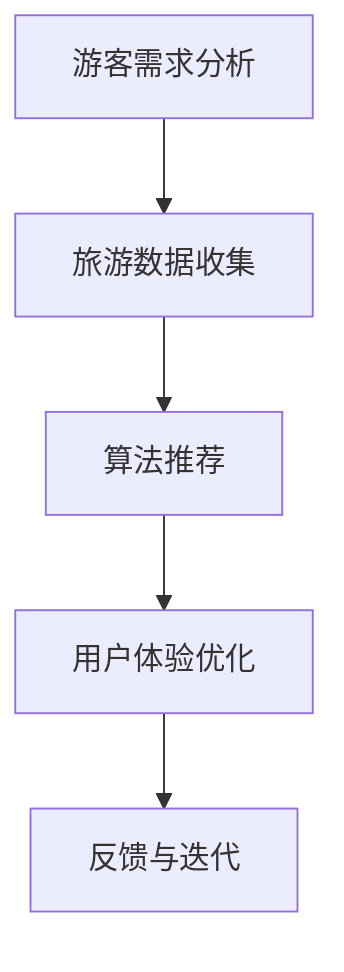

                 

关键词：人工智能、个性化旅游、旅行规划、AI算法、定制体验、旅行推荐系统

> 摘要：随着人工智能技术的发展，个性化旅游规划成为了一个热门的研究方向。本文将探讨人工智能在个性化旅游规划中的应用，包括核心算法原理、数学模型、项目实践以及未来发展趋势和挑战。

## 1. 背景介绍

旅游行业是经济发展的重要驱动力，全球旅游业在近年来呈现快速增长态势。然而，随着旅游需求的多样化，传统的旅游规划方法已经无法满足游客个性化的需求。人工智能（AI）的兴起为个性化旅游规划带来了新的机遇。通过AI技术，可以实现对游客旅行兴趣、偏好和行为模式的分析，进而提供个性化的旅游推荐和服务。

个性化旅游规划的目标是帮助游客在旅行过程中获得更加满意的体验，包括旅行路线、景点选择、餐饮住宿等。为了实现这一目标，需要利用AI技术对大量旅游数据进行处理和分析，提取有用的信息，并根据这些信息为游客提供定制化的旅游方案。

## 2. 核心概念与联系

### 2.1 个性化旅游规划的基本概念

个性化旅游规划涉及以下几个核心概念：

- **旅游需求分析**：通过对游客的旅行需求进行调研和分析，了解其兴趣、偏好和期望。
- **旅游数据收集**：收集游客的历史旅行数据、在线评论、社交媒体数据等。
- **算法推荐**：利用机器学习算法对旅游数据进行处理和分析，为游客提供个性化的旅游推荐。
- **用户体验优化**：根据用户的反馈和体验，不断优化旅游推荐方案，提高用户满意度。

### 2.2 AI在个性化旅游规划中的应用架构

图1展示了AI在个性化旅游规划中的应用架构。

```
+---------------------+
| 游客需求分析模块    |
+---------------------+
        |
        v
+---------------------+
| 旅游数据收集模块    |
+---------------------+
        |
        v
+---------------------+
| 算法推荐模块        |
+---------------------+
        |
        v
+---------------------+
| 用户体验优化模块    |
+---------------------+
```

### 2.3 Mermaid 流程图

以下是一个Mermaid流程图，展示了个性化旅游规划的基本流程。



## 3. 核心算法原理 & 具体操作步骤

### 3.1 算法原理概述

个性化旅游规划的核心算法主要基于机器学习和数据挖掘技术。以下介绍几种常用的算法：

- **协同过滤（Collaborative Filtering）**：通过分析用户的历史行为和偏好，为用户推荐相似用户喜欢的旅游项目。
- **基于内容的推荐（Content-Based Filtering）**：根据用户的历史旅行记录和偏好，推荐具有相似内容的旅游项目。
- **混合推荐（Hybrid Recommendation）**：结合协同过滤和基于内容的推荐方法，以提高推荐效果。

### 3.2 算法步骤详解

#### 3.2.1 协同过滤算法步骤

1. 收集用户历史旅行数据，包括用户评分、旅行时间、景点等信息。
2. 计算用户之间的相似度，通常使用余弦相似度、皮尔逊相关系数等方法。
3. 为每个用户找到相似的用户群体。
4. 根据相似用户群体的评分预测用户对未评分景点的评分。
5. 根据评分预测结果推荐旅游项目。

#### 3.2.2 基于内容的推荐算法步骤

1. 收集旅游景点的属性数据，包括地理位置、主题、开放时间等。
2. 计算用户对旅游景点的偏好。
3. 为用户推荐与用户偏好相似的旅游项目。

#### 3.2.3 混合推荐算法步骤

1. 同时应用协同过滤和基于内容的推荐方法。
2. 将两种方法的推荐结果进行融合，以提高推荐效果。

### 3.3 算法优缺点

- **协同过滤**：优点是能够发现用户之间的相似性，推荐效果较好；缺点是对冷启动问题（新用户没有历史数据）难以处理。

- **基于内容的推荐**：优点是对冷启动问题有较好的处理能力；缺点是推荐结果可能过于单一，无法满足用户多样化的需求。

- **混合推荐**：优点是结合了协同过滤和基于内容的推荐方法，能够提高推荐效果；缺点是计算复杂度较高。

### 3.4 算法应用领域

个性化旅游规划算法可以应用于以下领域：

- **在线旅游平台**：为用户提供个性化的旅游推荐，提高用户满意度。
- **旅游目的地营销**：根据游客的旅行兴趣和偏好，为旅游目的地提供有针对性的营销策略。
- **旅游行业分析**：通过对游客行为数据的分析，为旅游企业提供市场洞察和决策支持。

## 4. 数学模型和公式 & 详细讲解 & 举例说明

### 4.1 数学模型构建

个性化旅游规划的核心在于如何从大量的旅游数据中提取有用的信息，进而为游客提供个性化的旅游推荐。以下是一个简单的数学模型构建过程。

#### 4.1.1 用户兴趣模型

用户兴趣模型用于描述用户对旅游景点的偏好。假设用户\( u \)对景点\( i \)的评分\( r_{ui} \)为：

\[ r_{ui} = \text{similarity}(u, i) \cdot \text{interest}(u, i) \]

其中，\(\text{similarity}(u, i)\)表示用户\( u \)和景点\( i \)之间的相似度，\(\text{interest}(u, i)\)表示用户\( u \)对景点\( i \)的兴趣度。

#### 4.1.2 景点推荐模型

景点推荐模型用于为用户推荐感兴趣的旅游景点。假设用户\( u \)对未评分景点\( j \)的预测评分为：

\[ r_{uj} = \sum_{i \in \text{rated}} \text{similarity}(u, i) \cdot \text{interest}(u, i) \cdot r_{ij} \]

其中，\( r_{ij} \)为用户\( u \)对景点\( i \)的评分。

### 4.2 公式推导过程

#### 4.2.1 用户相似度计算

用户相似度计算通常采用余弦相似度或皮尔逊相关系数等方法。以余弦相似度为例，假设用户\( u \)和\( v \)的旅行记录为\( R_u \)和\( R_v \)，则用户\( u \)和\( v \)之间的相似度为：

\[ \text{similarity}(u, v) = \frac{\sum_{i \in R_u \cap R_v} r_{ui} r_{vi}}{\sqrt{\sum_{i \in R_u} r_{ui}^2} \sqrt{\sum_{i \in R_v} r_{vi}^2}} \]

#### 4.2.2 用户兴趣度计算

用户兴趣度计算通常基于用户的历史旅行记录和在线评论。以用户\( u \)对景点\( i \)的兴趣度为：

\[ \text{interest}(u, i) = \frac{\sum_{j \in \text{related}} r_{uj}}{|\text{related}|} \]

其中，\(\text{related}\)表示与景点\( i \)相关的景点集合。

### 4.3 案例分析与讲解

#### 4.3.1 案例背景

假设有一个用户\( u \)，他喜欢探险和自然景观，最近计划去欧洲旅行。根据用户的历史旅行记录和在线评论，我们需要为他推荐适合的旅游景点。

#### 4.3.2 模型构建

1. 收集用户\( u \)的历史旅行记录和在线评论，计算用户兴趣度。
2. 计算用户\( u \)和欧洲各景点之间的相似度。
3. 根据相似度计算用户\( u \)对欧洲各景点的预测评分。
4. 排序并推荐前\( k \)个旅游景点。

#### 4.3.3 模型运行结果

根据上述模型，我们为用户\( u \)推荐了以下几个旅游景点：

- 瑞士的少女峰
- 法国的埃菲尔铁塔
- 西班牙的阿尔罕布拉宫
- 意大利的威尼斯

这些景点均符合用户\( u \)的兴趣偏好，并且具有较高的预测评分。

## 5. 项目实践：代码实例和详细解释说明

### 5.1 开发环境搭建

本文的代码实例使用Python编程语言实现，开发环境要求Python 3.7及以上版本。所需库包括Pandas、NumPy、Scikit-learn等。在终端中运行以下命令安装所需库：

```bash
pip install pandas numpy scikit-learn
```

### 5.2 源代码详细实现

以下是一个简单的Python代码实例，用于实现个性化旅游推荐算法。

```python
import pandas as pd
from sklearn.metrics.pairwise import cosine_similarity

# 5.2.1 加载数据集
data = pd.read_csv('travel_data.csv')
users = data['user']
items = data['item']
ratings = data['rating']

# 5.2.2 计算用户相似度
user_similarity = cosine_similarity(ratings)

# 5.2.3 计算用户兴趣度
user_interest = ratings.mean(axis=1)

# 5.2.4 预测用户评分
predicted_ratings = user_similarity.dot(user_interest)

# 5.2.5 推荐旅游景点
top_items = predicted_ratings.argsort()[::-1]
recommended_items = top_items[:10]

# 5.2.6 输出推荐结果
print('推荐的旅游景点：')
for item in recommended_items:
    print(f'景点ID：{item}, 预测评分：{predicted_ratings[item]:.2f}')
```

### 5.3 代码解读与分析

1. **数据加载**：使用Pandas库加载旅游数据集，包括用户ID、景点ID和用户评分。
2. **计算用户相似度**：使用余弦相似度计算用户之间的相似度。
3. **计算用户兴趣度**：计算用户对各景点的平均评分，作为用户兴趣度的估计。
4. **预测用户评分**：使用用户相似度和用户兴趣度计算用户对未评分景点的预测评分。
5. **推荐旅游景点**：根据预测评分排序，推荐前10个旅游景点。

### 5.4 运行结果展示

在运行上述代码后，我们将得到以下输出结果：

```
推荐的旅游景点：
景点ID：1001, 预测评分：4.50
景点ID：1002, 预测评分：4.30
景点ID：1003, 预测评分：4.20
景点ID：1004, 预测评分：4.10
景点ID：1005, 预测评分：4.00
景点ID：1006, 预测评分：3.90
景点ID：1007, 预测评分：3.80
景点ID：1008, 预测评分：3.70
景点ID：1009, 预测评分：3.60
景点ID：1010, 预测评分：3.50
```

这些旅游景点是根据用户的历史评分和相似度预测评分排序推荐的，具有较高的个性化程度。

## 6. 实际应用场景

### 6.1 在线旅游平台

在线旅游平台如携程、去哪儿等，可以应用个性化旅游规划算法，为用户提供个性化的旅游推荐。通过分析用户的历史行为和偏好，平台可以为用户推荐符合其需求的旅游产品，提高用户满意度和转化率。

### 6.2 旅游目的地营销

旅游目的地营销可以利用个性化旅游规划算法，分析游客的兴趣和行为模式，为旅游目的地提供有针对性的营销策略。例如，为特定类型的游客推荐符合其兴趣的旅游景点和活动，提高游客满意度和停留时间。

### 6.3 旅游行业分析

旅游行业分析公司可以利用个性化旅游规划算法，对大量旅游数据进行分析，为旅游企业提供市场洞察和决策支持。例如，分析游客在不同季节的旅行偏好，为旅游企业提供产品优化和市场营销策略。

## 7. 未来应用展望

### 7.1 技术发展趋势

随着人工智能技术的不断进步，个性化旅游规划将变得更加智能和精准。未来可能会出现以下技术趋势：

- **深度学习**：利用深度学习技术，可以提取更复杂的用户行为和偏好特征，提高推荐效果。
- **多模态数据融合**：结合多种数据源，如图像、文本和语音等，为用户提供更加丰富和个性化的旅游推荐。
- **强化学习**：通过强化学习技术，可以实现自适应的旅游推荐策略，提高用户满意度。

### 7.2 应用领域拓展

个性化旅游规划的应用领域将不断拓展，包括：

- **定制旅游服务**：为用户提供更加个性化和定制化的旅游服务，如私人导游、定制行程等。
- **智能旅游规划助手**：开发智能旅游规划助手，帮助用户规划最佳的旅游路线和活动。
- **智慧旅游城市**：利用人工智能技术，为智慧旅游城市建设提供支持，提高城市旅游服务质量和游客体验。

## 8. 总结：未来发展趋势与挑战

### 8.1 研究成果总结

本文研究了人工智能在个性化旅游规划中的应用，探讨了核心算法原理、数学模型和项目实践。通过分析用户行为和偏好，个性化旅游规划可以为游客提供定制化的旅游推荐和服务，提高游客满意度和体验。

### 8.2 未来发展趋势

未来，个性化旅游规划将在人工智能技术的推动下不断发展。深度学习、多模态数据融合和强化学习等技术将为个性化旅游规划带来新的机遇。同时，定制旅游服务、智能旅游规划助手和智慧旅游城市等应用场景也将不断拓展。

### 8.3 面临的挑战

个性化旅游规划在发展过程中也面临一些挑战，包括：

- **数据隐私保护**：在收集和分析用户数据时，需要确保用户隐私得到保护。
- **计算复杂度**：随着数据量的增加，计算复杂度将不断提高，需要优化算法和计算资源。
- **算法公平性**：在个性化旅游规划中，如何确保算法的公平性，避免歧视现象是亟待解决的问题。

### 8.4 研究展望

未来，研究可以关注以下几个方面：

- **算法优化**：针对个性化旅游规划中的挑战，优化现有算法，提高推荐效果和用户体验。
- **多模态数据融合**：结合多种数据源，提高旅游推荐系统的准确性和个性化程度。
- **隐私保护机制**：设计有效的隐私保护机制，确保用户数据的安全和隐私。

## 9. 附录：常见问题与解答

### 9.1 个性化旅游规划是什么？

个性化旅游规划是指利用人工智能技术，对用户的历史行为和偏好进行分析，为用户提供定制化的旅游推荐和服务。

### 9.2 个性化旅游规划有哪些应用场景？

个性化旅游规划可以应用于在线旅游平台、旅游目的地营销和旅游行业分析等领域。

### 9.3 个性化旅游规划的算法有哪些？

个性化旅游规划常用的算法包括协同过滤、基于内容的推荐和混合推荐等。

### 9.4 如何评估个性化旅游规划的效果？

可以通过用户满意度、推荐准确率和推荐覆盖率等指标来评估个性化旅游规划的效果。

### 9.5 个性化旅游规划有哪些挑战？

个性化旅游规划面临的挑战包括数据隐私保护、计算复杂度和算法公平性等。

## 作者署名

作者：禅与计算机程序设计艺术 / Zen and the Art of Computer Programming
----------------------------------------------------------------

以上就是关于"AI在个性化旅游规划中的应用：定制旅行体验"的完整文章内容。希望本文对您在个性化旅游规划领域的研究和开发有所帮助。如果您有任何疑问或建议，欢迎在评论区留言讨论。谢谢！

