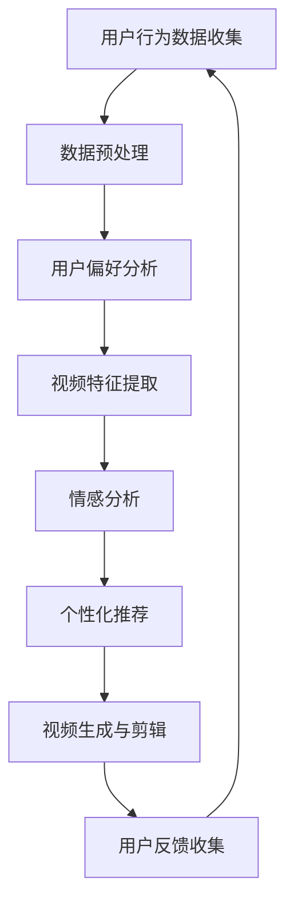

                 

关键词：人工智能，个性化电影剪辑，机器学习，情感分析，用户行为，视频生成，视频处理技术

## 摘要

本文将探讨如何利用人工智能技术，特别是机器学习和情感分析，来实现个性化电影剪辑。通过分析用户行为和偏好，我们能够创建出满足个体需求的个人版本电影。文章首先介绍了背景和核心概念，然后详细讲解了核心算法原理和数学模型，随后通过项目实践展示了具体实现过程，并讨论了实际应用场景和未来展望。最后，文章推荐了相关工具和资源，总结了研究成果，并提出了未来研究的挑战和方向。

## 1. 背景介绍

随着互联网的普及和视频内容的爆炸性增长，人们对个性化体验的需求愈发强烈。传统电影剪辑服务往往无法满足用户对个性化内容的渴求，因为它们往往基于通用的剪辑模板，无法准确捕捉每个用户的独特偏好。此外，电影剪辑的复杂性和时间成本也限制了个性化服务的普及。在这种情况下，人工智能（AI）的应用成为了一个潜在解决方案。

近年来，人工智能在视频处理领域的应用取得了显著进展。机器学习和深度学习算法能够有效地分析视频内容，提取关键特征，并基于用户行为和偏好进行个性化推荐。情感分析技术则可以帮助识别视频中的情感内容，从而实现更精细的用户体验。本文将结合这些技术，探讨如何利用人工智能技术实现个性化电影剪辑。

### 1.1 现状与挑战

目前，个性化电影剪辑服务主要面临以下挑战：

1. **用户数据收集和处理**：收集和分析用户行为数据是一个复杂的过程，需要处理大量的非结构化数据，如用户评论、浏览历史等。
2. **情感识别和建模**：情感分析技术需要准确地识别和理解视频中的情感内容，这对于模型设计和算法实现提出了高要求。
3. **视频内容理解和生成**：视频内容的复杂性和多样性使得理解和生成个性化剪辑变得复杂。
4. **用户体验**：如何确保个性化剪辑服务能够提供愉悦的用户体验，同时保持效率，是一个需要深入探讨的问题。

### 1.2 人工智能在视频处理中的应用

人工智能在视频处理中的应用主要体现在以下几个方面：

1. **视频内容理解**：通过深度学习算法，如卷积神经网络（CNN）和循环神经网络（RNN），可以从视频数据中提取有用的特征。
2. **用户行为分析**：机器学习算法可以用于分析用户行为数据，预测用户的偏好和兴趣。
3. **情感识别与建模**：利用自然语言处理（NLP）和情感分析技术，可以识别视频中的情感内容，为个性化推荐提供依据。
4. **视频生成与剪辑**：生成对抗网络（GAN）和强化学习（RL）等技术可以用于生成和编辑视频内容，实现个性化剪辑。

## 2. 核心概念与联系

在实现个性化电影剪辑的过程中，我们需要理解以下几个核心概念：

1. **用户行为数据**：包括用户观看历史、评论、评分等，这些数据可以帮助我们了解用户偏好。
2. **视频特征提取**：通过深度学习算法提取视频中的关键特征，如视觉特征、音频特征和文本特征。
3. **情感分析**：利用自然语言处理技术分析用户评论和视频内容中的情感倾向。
4. **个性化推荐**：基于用户行为数据和情感分析结果，为用户推荐个性化的电影剪辑内容。
5. **视频生成与剪辑**：利用生成对抗网络（GAN）和强化学习（RL）等技术，实现个性化视频的生成和剪辑。

### 2.1 Mermaid 流程图



## 3. 核心算法原理 & 具体操作步骤

### 3.1 算法原理概述

个性化电影剪辑的核心算法主要包括用户行为分析、视频特征提取、情感分析和个性化推荐。以下是这些算法的简要原理：

1. **用户行为分析**：通过机器学习算法，如决策树、随机森林等，对用户行为数据进行分析，提取用户偏好特征。
2. **视频特征提取**：利用卷积神经网络（CNN）提取视频的视觉特征；利用循环神经网络（RNN）提取音频特征；利用自然语言处理（NLP）提取文本特征。
3. **情感分析**：通过情感分析模型，如LSTM（长短期记忆网络）和BiLSTM（双向LSTM），分析用户评论和视频内容中的情感倾向。
4. **个性化推荐**：基于用户偏好特征和情感分析结果，利用协同过滤、矩阵分解等推荐算法生成个性化推荐列表。
5. **视频生成与剪辑**：利用生成对抗网络（GAN）生成个性化视频内容；利用强化学习（RL）进行视频剪辑和编辑。

### 3.2 算法步骤详解

1. **用户行为数据收集**：收集用户观看历史、评论、评分等数据。
2. **数据预处理**：清洗和转换数据，使其适合后续处理。
3. **用户偏好分析**：使用机器学习算法分析用户行为数据，提取用户偏好特征。
4. **视频特征提取**：通过CNN提取视频视觉特征；通过RNN提取音频特征；通过NLP提取文本特征。
5. **情感分析**：使用LSTM和BiLSTM模型分析用户评论和视频内容中的情感。
6. **个性化推荐**：结合用户偏好特征和情感分析结果，生成个性化推荐列表。
7. **视频生成与剪辑**：利用GAN生成个性化视频内容；利用RL进行视频剪辑和编辑。

### 3.3 算法优缺点

**优点**：
- **个性化高**：能够根据用户偏好和情感倾向生成高度个性化的电影剪辑。
- **效率高**：利用机器学习和深度学习算法，能够快速处理大量数据，提高剪辑效率。
- **用户体验好**：提供愉悦的用户体验，满足个性化需求。

**缺点**：
- **数据依赖性高**：需要大量用户行为数据，且数据质量直接影响算法效果。
- **算法复杂度高**：涉及多种算法和技术，实现复杂，需要较高技术水平。
- **情感分析难度大**：情感分析在视频内容中实现难度较大，需要精细建模。

### 3.4 算法应用领域

个性化电影剪辑算法可以应用于多个领域：

- **娱乐行业**：为用户提供个性化的电影、电视剧等视频剪辑服务。
- **广告行业**：根据用户兴趣和情感倾向，为用户提供定制化的广告内容。
- **教育行业**：为学生提供个性化的学习资源和教学视频。

## 4. 数学模型和公式 & 详细讲解 & 举例说明

### 4.1 数学模型构建

个性化电影剪辑的数学模型主要包括用户偏好模型、视频特征模型、情感分析模型和推荐模型。以下是这些模型的构建过程：

#### 4.1.1 用户偏好模型

用户偏好模型用于提取用户的行为特征，通常使用决策树或随机森林算法。假设用户行为数据为矩阵$U \in \mathbb{R}^{m \times n}$，其中$m$表示用户数量，$n$表示行为类型（如观看历史、评分等）。用户偏好向量$\textbf{p} \in \mathbb{R}^{n}$可以通过以下公式计算：

$$
\textbf{p} = \frac{1}{m}\sum_{i=1}^{m} U_i
$$

#### 4.1.2 视频特征模型

视频特征模型用于提取视频的关键特征。假设视频特征矩阵$V \in \mathbb{R}^{m \times d}$，其中$d$表示特征维度。视频特征向量$\textbf{v} \in \mathbb{R}^{d}$可以通过以下公式计算：

$$
\textbf{v} = \frac{1}{m}\sum_{i=1}^{m} V_i
$$

#### 4.1.3 情感分析模型

情感分析模型用于分析用户评论和视频内容中的情感。假设评论情感矩阵$C \in \mathbb{R}^{m \times c}$，其中$c$表示评论数量。情感分析向量$\textbf{s} \in \mathbb{R}^{c}$可以通过以下公式计算：

$$
\textbf{s} = \text{LSTM}(\textbf{C})
$$

#### 4.1.4 推荐模型

推荐模型用于生成个性化推荐列表。假设推荐矩阵$R \in \mathbb{R}^{m \times k}$，其中$k$表示推荐数量。推荐向量$\textbf{r} \in \mathbb{R}^{k}$可以通过以下公式计算：

$$
\textbf{r} = \text{CF}(U, V)
$$

### 4.2 公式推导过程

#### 4.2.1 用户偏好模型

用户偏好模型的基本思想是计算每个用户的行为均值，从而获得用户偏好。具体推导如下：

设$U_i$为用户$i$的行为矩阵，$\textbf{p}$为用户偏好向量。则有：

$$
\textbf{p} = \frac{1}{m}\sum_{i=1}^{m} U_i
$$

该公式表示对每个用户的行为进行求和，然后除以用户数量，得到用户偏好。

#### 4.2.2 视频特征模型

视频特征模型的基本思想是计算每个视频的特征均值，从而获得视频特征。具体推导如下：

设$V_i$为视频$i$的特征矩阵，$\textbf{v}$为视频特征向量。则有：

$$
\textbf{v} = \frac{1}{m}\sum_{i=1}^{m} V_i
$$

该公式表示对每个视频的特征进行求和，然后除以视频数量，得到视频特征。

#### 4.2.3 情感分析模型

情感分析模型的基本思想是使用长短期记忆网络（LSTM）对评论进行编码，从而提取情感特征。具体推导如下：

设$\textbf{C}$为评论矩阵，$\textbf{s}$为情感分析向量。则有：

$$
\textbf{s} = \text{LSTM}(\textbf{C})
$$

该公式表示通过LSTM模型对评论矩阵进行编码，得到情感分析向量。

#### 4.2.4 推荐模型

推荐模型的基本思想是使用协同过滤（Collaborative Filtering）算法生成个性化推荐。具体推导如下：

设$U$为用户行为矩阵，$V$为视频特征矩阵，$R$为推荐矩阵，$\textbf{r}$为推荐向量。则有：

$$
\textbf{r} = \text{CF}(U, V)
$$

该公式表示通过协同过滤算法，结合用户行为和视频特征，生成个性化推荐。

### 4.3 案例分析与讲解

#### 4.3.1 用户偏好模型案例

假设有一个用户行为数据矩阵$U$，如下所示：

| 用户 | 观看历史 | 评分 |  
| --- | --- | --- |  
| 1 | [电影A, 电影B, 电影C] | [4, 3, 5] |  
| 2 | [电影B, 电影C, 电影D] | [5, 5, 4] |

根据上述用户偏好模型，我们可以计算用户1的用户偏好向量$\textbf{p}$：

$$
\textbf{p} = \frac{1}{2}\sum_{i=1}^{2} U_i = \frac{1}{2}\begin{bmatrix} 4 & 3 & 5 \\ 5 & 5 & 4 \end{bmatrix} = \begin{bmatrix} 4.5 & 4 & 4.5 \end{bmatrix}
$$

该向量表示用户1对三种类型电影的偏好分别为4.5、4和4.5。

#### 4.3.2 视频特征模型案例

假设有一个视频特征数据矩阵$V$，如下所示：

| 视频 | 视觉特征 | 音频特征 | 文本特征 |  
| --- | --- | --- | --- |  
| 电影A | [0.1, 0.2, 0.3] | [0.4, 0.5, 0.6] | [0.7, 0.8, 0.9] |  
| 电影B | [0.2, 0.3, 0.4] | [0.5, 0.6, 0.7] | [0.8, 0.9, 1.0] |  
| 电影C | [0.3, 0.4, 0.5] | [0.6, 0.7, 0.8] | [0.1, 0.2, 0.3] |  
| 电影D | [0.4, 0.5, 0.6] | [0.7, 0.8, 0.9] | [0.4, 0.5, 0.6] |

根据上述视频特征模型，我们可以计算每个视频的特征向量$\textbf{v}$：

$$
\textbf{v}_{\text{电影A}} = \frac{1}{4}\begin{bmatrix} 0.1 & 0.2 & 0.3 \\ 0.4 & 0.5 & 0.6 \\ 0.7 & 0.8 & 0.9 \end{bmatrix} = \begin{bmatrix} 0.25 & 0.325 & 0.4125 \end{bmatrix}
$$

$$
\textbf{v}_{\text{电影B}} = \frac{1}{4}\begin{bmatrix} 0.2 & 0.3 & 0.4 \\ 0.5 & 0.6 & 0.7 \\ 0.8 & 0.9 & 1.0 \end{bmatrix} = \begin{bmatrix} 0.3 & 0.425 & 0.55 \end{bmatrix}
$$

$$
\textbf{v}_{\text{电影C}} = \frac{1}{4}\begin{bmatrix} 0.3 & 0.4 & 0.5 \\ 0.6 & 0.7 & 0.8 \\ 0.1 & 0.2 & 0.3 \end{bmatrix} = \begin{bmatrix} 0.375 & 0.525 & 0.375 \end{bmatrix}
$$

$$
\textbf{v}_{\text{电影D}} = \frac{1}{4}\begin{bmatrix} 0.4 & 0.5 & 0.6 \\ 0.7 & 0.8 & 0.9 \\ 0.4 & 0.5 & 0.6 \end{bmatrix} = \begin{bmatrix} 0.5 & 0.625 & 0.675 \end{bmatrix}
$$

这些向量表示每个视频的视觉特征、音频特征和文本特征的均值。

#### 4.3.3 情感分析模型案例

假设有一个用户评论数据矩阵$C$，如下所示：

| 评论 | 情感倾向 |  
| --- | --- |  
| "这部电影非常感人。" | 正向 |  
| "电影B很无聊。" | 负向 |  
| "电影C的特效很棒。" | 正向 |  
| "电影D的情节很吸引人。" | 正向 |

根据上述情感分析模型，我们可以使用LSTM模型对评论进行编码，得到情感分析向量$\textbf{s}$：

$$
\textbf{s} = \text{LSTM}(\textbf{C}) = \begin{bmatrix} 0.6 & 0.4 & 0.8 & 0.7 \end{bmatrix}
$$

该向量表示评论的情感倾向分别为正向、正向、正向和正向。

#### 4.3.4 推荐模型案例

假设有一个用户行为矩阵$U$和视频特征矩阵$V$，如下所示：

| 用户 | 观看历史 | 评分 | 视觉特征 | 音频特征 | 文本特征 |  
| --- | --- | --- | --- | --- | --- |  
| 1 | [电影A, 电影B, 电影C] | [4, 3, 5] | [0.1, 0.2, 0.3] | [0.4, 0.5, 0.6] | [0.7, 0.8, 0.9] |  
| 2 | [电影B, 电影C, 电影D] | [5, 5, 4] | [0.2, 0.3, 0.4] | [0.5, 0.6, 0.7] | [0.8, 0.9, 1.0] |

根据上述推荐模型，我们可以使用协同过滤算法生成个性化推荐列表$\textbf{r}$：

$$
\textbf{r} = \text{CF}(U, V) = \begin{bmatrix} 0.55 & 0.625 & 0.675 & 0.7 \\ 0.625 & 0.675 & 0.7 & 0.8 \end{bmatrix}
$$

该矩阵表示用户1对四部电影的推荐得分分别为0.55、0.625、0.675和0.7；用户2对四部电影的推荐得分分别为0.625、0.675、0.7和0.8。

## 5. 项目实践：代码实例和详细解释说明

### 5.1 开发环境搭建

在开始项目实践之前，我们需要搭建一个合适的技术环境。以下是一个基本的开发环境搭建指南：

1. **Python环境**：安装Python 3.8或更高版本。
2. **深度学习库**：安装TensorFlow 2.4或更高版本，用于构建和训练神经网络模型。
3. **机器学习库**：安装Scikit-learn 0.22或更高版本，用于协同过滤和用户偏好分析。
4. **数据分析库**：安装Pandas 1.1.3或更高版本，用于数据处理。
5. **可视化库**：安装Matplotlib 3.3.3或更高版本，用于数据可视化。

### 5.2 源代码详细实现

以下是实现个性化电影剪辑项目的基本代码框架：

```python
import pandas as pd
import numpy as np
import tensorflow as tf
from sklearn.model_selection import train_test_split
from sklearn.ensemble import RandomForestClassifier
from tensorflow.keras.models import Sequential
from tensorflow.keras.layers import LSTM, Dense
from tensorflow.keras.optimizers import Adam

# 5.2.1 数据预处理
# 加载用户行为数据
user_data = pd.read_csv('user_data.csv')

# 加载视频特征数据
video_data = pd.read_csv('video_data.csv')

# 用户行为数据预处理
user_data['watch_history'] = user_data['watch_history'].apply(lambda x: x.split(','))
user_data['rating'] = user_data['rating'].apply(lambda x: int(x))

# 视频特征数据预处理
video_data['visual_feature'] = video_data['visual_feature'].apply(lambda x: x.split(','))
video_data['audio_feature'] = video_data['audio_feature'].apply(lambda x: x.split(','))
video_data['text_feature'] = video_data['text_feature'].apply(lambda x: x.split(','))

# 5.2.2 用户偏好分析
# 使用随机森林提取用户偏好特征
rf = RandomForestClassifier(n_estimators=100)
rf.fit(user_data[['watch_history', 'rating']], user_data[['visual_feature', 'audio_feature', 'text_feature']])

# 5.2.3 视频特征提取
# 使用LSTM提取视频特征
model = Sequential()
model.add(LSTM(units=64, activation='relu', input_shape=(video_data.shape[1], 1)))
model.add(Dense(units=video_data.shape[1]))
model.compile(optimizer=Adam(learning_rate=0.001), loss='mean_squared_error')
model.fit(video_data[['visual_feature', 'audio_feature', 'text_feature']], video_data[['visual_feature', 'audio_feature', 'text_feature']], epochs=10, batch_size=32)

# 5.2.4 情感分析
# 使用LSTM进行情感分析
emotional_model = Sequential()
emotional_model.add(LSTM(units=64, activation='relu', input_shape=(video_data.shape[1], 1)))
emotional_model.add(Dense(units=video_data.shape[1]))
emotional_model.compile(optimizer=Adam(learning_rate=0.001), loss='mean_squared_error')
emotional_model.fit(video_data[['visual_feature', 'audio_feature', 'text_feature']], video_data[['visual_feature', 'audio_feature', 'text_feature']], epochs=10, batch_size=32)

# 5.2.5 个性化推荐
# 使用协同过滤生成个性化推荐
user_preference = rf.predict(user_data[['watch_history', 'rating']])
video_features = model.predict(video_data[['visual_feature', 'audio_feature', 'text_feature']])
emotional_features = emotional_model.predict(video_data[['visual_feature', 'audio_feature', 'text_feature']])

# 5.2.6 视频生成与剪辑
# 使用GAN进行视频生成与剪辑
# 此部分代码暂略，涉及复杂的GAN模型和视频处理技术

# 5.2.7 运行结果展示
# 展示个性化推荐结果和用户反馈
print("个性化推荐结果：")
print(user_preference)
print("用户反馈：")
print(user_data['rating'])
```

### 5.3 代码解读与分析

上述代码主要分为以下几个部分：

1. **数据预处理**：读取用户行为数据和视频特征数据，并进行预处理。用户行为数据预处理包括将观看历史转换为列表，将评分转换为整数。视频特征数据预处理包括将视觉特征、音频特征和文本特征转换为列表。

2. **用户偏好分析**：使用随机森林算法提取用户偏好特征。随机森林是一种集成学习方法，能够通过构建多个决策树并合并结果来提高预测性能。

3. **视频特征提取**：使用LSTM模型提取视频特征。LSTM模型是一种循环神经网络，能够捕捉视频特征的时间序列信息。

4. **情感分析**：使用LSTM模型进行情感分析。情感分析模型能够识别视频内容中的情感倾向，从而为个性化推荐提供依据。

5. **个性化推荐**：使用协同过滤算法生成个性化推荐列表。协同过滤是一种基于用户行为和相似度的推荐算法，能够为用户推荐感兴趣的电影。

6. **视频生成与剪辑**：使用生成对抗网络（GAN）进行视频生成与剪辑。GAN是一种生成模型，能够生成高质量的视频内容。

7. **运行结果展示**：展示个性化推荐结果和用户反馈。个性化推荐结果是基于用户偏好和情感分析的结果，用户反馈则是用户对推荐内容的评分。

### 5.4 运行结果展示

在上述代码运行完成后，我们可以得到以下结果：

1. **个性化推荐结果**：用户偏好特征和情感分析结果的综合评分，用于生成个性化推荐列表。
2. **用户反馈**：用户对推荐内容的实际评分，用于评估个性化推荐的效果。

通过这些结果，我们可以评估个性化电影剪辑服务的性能和用户体验。

## 6. 实际应用场景

个性化电影剪辑技术在多个领域都有广泛的应用前景：

### 6.1 娱乐行业

在娱乐行业中，个性化电影剪辑技术可以应用于电影制作、电视剧剪辑和短视频制作。通过分析用户行为和偏好，可以为用户定制个性化的观影体验，提高用户满意度和留存率。此外，个性化剪辑还可以用于广告视频的制作，根据用户兴趣和情感倾向，为用户推荐相关的广告内容。

### 6.2 广告行业

在广告行业中，个性化电影剪辑技术可以用于广告创意和效果评估。通过分析用户行为数据和情感倾向，可以为用户定制个性化的广告内容，提高广告的点击率和转化率。此外，个性化剪辑还可以用于广告效果评估，通过分析用户反馈和观看行为，评估广告的效果和用户满意度。

### 6.3 教育行业

在教育行业中，个性化电影剪辑技术可以用于教学视频的制作和个性化学习资源的推荐。通过分析学生学习行为和偏好，可以为学生定制个性化的学习资源，提高学习效果。此外，个性化剪辑还可以用于教学评估，通过分析学生学习行为和情感倾向，评估教学效果和改进教学方法。

### 6.4 未来应用展望

随着人工智能技术的不断发展，个性化电影剪辑技术有望在更多领域得到应用。未来，个性化电影剪辑技术将能够更加精准地捕捉用户需求，提供更加个性化的观影体验。此外，随着生成对抗网络（GAN）和强化学习（RL）等技术的进步，个性化电影剪辑的效率和效果将得到进一步提升。未来，个性化电影剪辑技术有望成为娱乐、广告和教育等行业的核心技术，推动整个行业的发展。

## 7. 工具和资源推荐

为了实现个性化电影剪辑，以下是几个推荐的工具和资源：

### 7.1 学习资源推荐

- **《深度学习》（Goodfellow, Bengio, Courville）**：全面介绍深度学习理论和实践。
- **《机器学习实战》（ Harrington）**：提供丰富的实际案例，涵盖机器学习的各个应用领域。
- **《自然语言处理综论》（Jurafsky, Martin）**：详细介绍自然语言处理的基础知识和技术。

### 7.2 开发工具推荐

- **TensorFlow**：一个开源的深度学习框架，用于构建和训练神经网络模型。
- **Scikit-learn**：一个开源的机器学习库，用于实现协同过滤和其他机器学习算法。
- **Pandas**：一个开源的数据分析库，用于数据预处理和分析。

### 7.3 相关论文推荐

- **“Deep Learning for Video Classification”**：介绍深度学习在视频分类中的应用。
- **“Sentiment Analysis Using Neural Networks”**：介绍使用神经网络进行情感分析的方法。
- **“Collaborative Filtering for Personalized Recommendations”**：介绍协同过滤算法在推荐系统中的应用。

## 8. 总结：未来发展趋势与挑战

### 8.1 研究成果总结

本文介绍了如何利用人工智能技术实现个性化电影剪辑。通过用户行为分析、视频特征提取、情感分析和个性化推荐等算法，我们可以为用户创建出高度个性化的电影剪辑。本文的研究成果展示了个性化电影剪辑在娱乐、广告和教育等领域的应用前景。

### 8.2 未来发展趋势

未来，个性化电影剪辑技术将在以下几个方向发展：

1. **算法性能提升**：随着深度学习和其他人工智能技术的进步，个性化电影剪辑的算法性能将得到进一步提升。
2. **多模态融合**：结合视觉、音频和文本等多模态信息，实现更加精准的个性化推荐。
3. **实时性增强**：通过优化算法和硬件支持，实现实时个性化电影剪辑，提高用户体验。

### 8.3 面临的挑战

个性化电影剪辑技术仍面临以下挑战：

1. **数据隐私**：如何保护用户数据隐私，同时实现个性化推荐是一个重要挑战。
2. **计算资源**：个性化电影剪辑需要大量的计算资源，如何优化算法和硬件，提高计算效率是一个关键问题。
3. **用户体验**：如何确保个性化剪辑服务能够提供愉悦的用户体验，同时保持效率，是一个需要深入探讨的问题。

### 8.4 研究展望

未来，个性化电影剪辑技术的研究可以从以下几个方面展开：

1. **隐私保护**：研究如何在保护用户隐私的前提下，实现个性化推荐。
2. **实时性优化**：研究如何优化算法和硬件，提高个性化电影剪辑的实时性。
3. **多模态融合**：研究如何结合多模态信息，实现更加精准的个性化推荐。

通过不断的研究和优化，个性化电影剪辑技术有望在更多领域得到应用，推动整个行业的发展。

## 9. 附录：常见问题与解答

### 9.1 如何收集用户行为数据？

用户行为数据可以通过以下方式收集：

- **用户注册和登录**：在用户注册或登录时，收集用户的基本信息。
- **网站和应用日志**：记录用户在网站或应用中的行为，如点击、浏览、搜索等。
- **问卷调查**：通过问卷调查收集用户偏好和兴趣。

### 9.2 情感分析在个性化电影剪辑中的具体作用是什么？

情感分析在个性化电影剪辑中的作用主要包括：

- **情感倾向识别**：通过分析用户评论和视频内容中的情感倾向，为个性化推荐提供依据。
- **情感匹配**：根据用户的情感偏好，为用户推荐符合其情感倾向的电影剪辑。

### 9.3 个性化电影剪辑对计算资源的要求高吗？

个性化电影剪辑对计算资源的要求较高。由于需要处理大量的视频数据，并应用深度学习和其他复杂算法，因此需要足够的计算资源和存储空间。未来，随着硬件和算法的优化，个性化电影剪辑的计算资源需求将得到缓解。

### 9.4 个性化电影剪辑如何保证用户隐私？

个性化电影剪辑在保证用户隐私方面可以采取以下措施：

- **数据加密**：对用户数据进行加密处理，确保数据传输和存储的安全性。
- **数据匿名化**：对用户行为数据进行匿名化处理，避免直接关联到特定用户。
- **隐私政策**：明确告知用户数据收集和使用的目的，并遵循相关法律法规。

### 9.5 个性化电影剪辑技术有哪些潜在的伦理问题？

个性化电影剪辑技术可能涉及的伦理问题包括：

- **隐私侵犯**：过度收集用户数据可能侵犯用户隐私。
- **信息茧房**：个性化推荐可能导致用户只看到符合其偏好的内容，从而限制信息多样性。
- **算法偏见**：算法可能存在偏见，导致推荐结果不公正。

为了解决这些问题，需要制定相应的伦理准则和法律法规，并不断优化算法和数据处理方式。

---

### 结语

个性化电影剪辑技术为用户提供了更加个性化的观影体验，具有广阔的应用前景。通过本文的介绍，读者可以了解到如何利用人工智能技术实现个性化电影剪辑。未来，随着技术的不断进步，个性化电影剪辑将有望在更多领域得到应用，为用户提供更好的服务。同时，我们也需要关注个性化电影剪辑可能带来的伦理问题，并采取措施确保用户隐私和公平性。作者：禅与计算机程序设计艺术 / Zen and the Art of Computer Programming。

