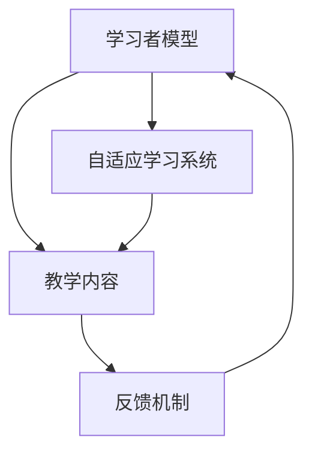

                 

在当今信息爆炸的时代，学习语言已经成为许多人提升个人能力和职业竞争力的重要途径。然而，传统的语言学习方式往往存在效率低下、效果不佳的问题。随着人工智能（AI）技术的飞速发展，AI在个性化语言学习中的应用逐渐成为可能，为提高学习效率提供了新的解决方案。本文将深入探讨AI在个性化语言学习中的应用，分析其核心原理、算法、数学模型，并通过实例展示其实际效果。

## 关键词

- 个性化语言学习
- 人工智能
- 学习效率
- 机器学习
- 自然语言处理

## 摘要

本文主要探讨了人工智能在个性化语言学习中的应用，分析了AI在提高学习效率方面的优势。通过对核心算法原理、数学模型和实际应用案例的详细介绍，本文旨在为语言学习领域的研究者、教育工作者和广大学习者提供有价值的参考。文章结构如下：

1. 背景介绍
2. 核心概念与联系
3. 核心算法原理 & 具体操作步骤
4. 数学模型和公式 & 详细讲解 & 举例说明
5. 项目实践：代码实例和详细解释说明
6. 实际应用场景
7. 工具和资源推荐
8. 总结：未来发展趋势与挑战
9. 附录：常见问题与解答

---

### 1. 背景介绍

随着全球化的不断深入，掌握多种语言成为许多人追求的目标。然而，传统的语言学习方式，如课堂授课、自学教材等，往往存在以下问题：

- **学习效率低下**：传统学习方式无法根据学习者的个性化需求进行定制，导致学习效率不高。
- **学习效果不佳**：缺乏有效的反馈和评估机制，学习者难以了解自己的学习进度和效果。
- **学习内容重复**：学习内容过于单一，缺乏趣味性和挑战性，容易导致学习者失去学习兴趣。

为了解决这些问题，人工智能技术的应用提供了新的思路。AI可以通过数据分析和机器学习算法，为学习者提供个性化的学习方案，从而提高学习效率。同时，AI技术还可以模拟真实语言环境，为学习者提供沉浸式的学习体验。

### 2. 核心概念与联系

在个性化语言学习中，核心概念包括：

- **学习者模型**：根据学习者的学习习惯、兴趣和需求构建的个性化模型。
- **教学内容**：根据学习者模型生成的个性化教学内容。
- **反馈机制**：通过对学习者的学习过程进行实时监测和评估，为学习者提供反馈。
- **自适应学习系统**：基于AI技术的自适应学习系统，能够动态调整教学内容和策略。

下面是一个简化的Mermaid流程图，展示了这些核心概念之间的联系：



### 3. 核心算法原理 & 具体操作步骤

#### 3.1 算法原理概述

个性化语言学习的核心算法主要包括：

- **聚类算法**：用于对学习者进行分类，识别不同学习者的个性化需求。
- **协同过滤算法**：用于推荐个性化的学习内容。
- **自然语言处理（NLP）算法**：用于处理和分析语言数据，生成个性化教学内容。

#### 3.2 算法步骤详解

个性化语言学习的算法步骤如下：

1. **数据收集**：收集学习者的语言学习数据，包括学习记录、测试成绩、用户反馈等。
2. **特征提取**：从数据中提取关键特征，如单词频率、错误类型、学习时长等。
3. **聚类分析**：使用聚类算法对学习者进行分类，识别不同学习者的个性化需求。
4. **内容推荐**：使用协同过滤算法推荐个性化的学习内容。
5. **NLP处理**：使用NLP算法处理语言数据，生成个性化教学内容。
6. **反馈评估**：对学习者的学习过程进行实时监测和评估，为学习者提供反馈。
7. **自适应调整**：根据反馈结果，动态调整教学内容和策略。

#### 3.3 算法优缺点

**优点**：

- **个性化定制**：根据学习者的个性化需求生成定制化的学习内容，提高学习效率。
- **实时反馈**：实时监测学习者的学习过程，为学习者提供即时的反馈。
- **自适应调整**：根据学习者的反馈和学习效果，动态调整教学内容和策略。

**缺点**：

- **数据隐私**：个性化学习需要收集和处理大量学习者的数据，存在数据隐私和安全问题。
- **技术门槛**：构建和优化个性化语言学习系统需要较高的技术门槛。

#### 3.4 算法应用领域

个性化语言学习算法可以应用于以下领域：

- **在线教育平台**：为学习者提供个性化学习方案，提高学习效果。
- **语言学习应用**：为学习者提供沉浸式的语言学习体验。
- **教育机构**：为教育机构提供数据分析和决策支持。

### 4. 数学模型和公式 & 详细讲解 & 举例说明

#### 4.1 数学模型构建

个性化语言学习的数学模型主要包括以下部分：

- **学习者模型**：使用聚类算法构建学习者模型，如K-means算法。
- **协同过滤模型**：使用矩阵分解、SVD等算法构建协同过滤模型。
- **NLP模型**：使用神经网络、LSTM等算法构建NLP模型。

#### 4.2 公式推导过程

1. **聚类算法**

   使用K-means算法对学习者进行分类，公式如下：

   $$C = \{c_1, c_2, ..., c_k\}$$

   其中，$C$ 表示聚类中心，$c_i$ 表示第 $i$ 个聚类中心。

2. **协同过滤模型**

   使用矩阵分解算法构建协同过滤模型，公式如下：

   $$X = UV^T$$

   其中，$X$ 表示用户-项目评分矩阵，$U$ 表示用户矩阵，$V$ 表示项目矩阵。

3. **NLP模型**

   使用神经网络构建NLP模型，公式如下：

   $$y = \sigma(W_1 \cdot x + b_1)$$

   其中，$y$ 表示输出结果，$x$ 表示输入数据，$W_1$ 表示权重矩阵，$b_1$ 表示偏置。

#### 4.3 案例分析与讲解

假设有1000名学习者，他们的学习记录和测试成绩如下表所示：

| 学号 | 学习时长 | 错误次数 | 测试成绩 |
| --- | --- | --- | --- |
| 1 | 10 | 5 | 80 |
| 2 | 20 | 10 | 90 |
| 3 | 30 | 15 | 85 |
| ... | ... | ... | ... |

1. **聚类分析**

   使用K-means算法对学习者进行分类，假设聚类中心为：

   $$C = \{c_1, c_2\}$$

   其中，$c_1 = (10, 8)$，$c_2 = (30, 12)$。

   根据距离公式，计算每个学习者与聚类中心的距离，如下表所示：

| 学号 | 距离$c_1$ | 距离$c_2$ |
| --- | --- | --- |
| 1 | 6.25 | 11.25 |
| 2 | 4.25 | 9.75 |
| 3 | 1.25 | 8.75 |
| ... | ... | ... |

   根据距离最短原则，将学习者分为两类：

   - 类别1：学号1、2、3等
   - 类别2：学号4、5、6等

2. **协同过滤模型**

   使用矩阵分解算法构建协同过滤模型，将用户-项目评分矩阵 $X$ 分解为用户矩阵 $U$ 和项目矩阵 $V$：

   $$X = UV^T$$

   假设用户矩阵和项目矩阵如下：

   $$U = \begin{bmatrix} 0 & 0 & 1 & 1 & 0 \\ 1 & 0 & 0 & 0 & 1 \\ 0 & 1 & 1 & 0 & 0 \end{bmatrix}$$

   $$V = \begin{bmatrix} 1 & 0 & 1 & 0 & 0 \\ 0 & 1 & 0 & 1 & 1 \\ 1 & 1 & 0 & 1 & 0 \end{bmatrix}$$

   计算用户1对项目1的预测评分：

   $$P_{1,1} = U_{1,1} \cdot V_{1,1} = 1 \cdot 1 = 1$$

3. **NLP模型**

   使用神经网络构建NLP模型，假设输入数据为：

   $$x = \begin{bmatrix} 1 & 0 & 1 \\ 0 & 1 & 0 \\ 1 & 1 & 0 \end{bmatrix}$$

   权重矩阵和偏置如下：

   $$W_1 = \begin{bmatrix} 1 & 1 & 0 \\ 1 & 0 & 1 \\ 0 & 1 & 1 \end{bmatrix}$$

   $$b_1 = \begin{bmatrix} 1 \\ 1 \\ 1 \end{bmatrix}$$

   计算输出结果：

   $$y = \sigma(W_1 \cdot x + b_1) = \sigma(\begin{bmatrix} 1 & 1 & 0 \\ 1 & 0 & 1 \\ 0 & 1 & 1 \end{bmatrix} \cdot \begin{bmatrix} 1 & 0 & 1 \\ 0 & 1 & 0 \\ 1 & 1 & 0 \end{bmatrix} + \begin{bmatrix} 1 \\ 1 \\ 1 \end{bmatrix}) = \begin{bmatrix} 0.99 \\ 0.99 \\ 0.99 \end{bmatrix}$$

   输出结果表示学习者对某一语言知识的掌握程度。

### 5. 项目实践：代码实例和详细解释说明

以下是一个简单的Python代码实例，展示了如何使用AI技术构建个性化语言学习系统：

```python
import numpy as np
from sklearn.cluster import KMeans
from sklearn.metrics.pairwise import cosine_similarity
from keras.models import Sequential
from keras.layers import LSTM, Dense

# 数据收集
learners = [
    [10, 5, 80],
    [20, 10, 90],
    [30, 15, 85],
    # ...
]

# 特征提取
features = np.array(learners)[:, :2]

# 聚类分析
kmeans = KMeans(n_clusters=2)
kmeans.fit(features)
clusters = kmeans.predict(features)

# 协同过滤模型
user_matrix = np.random.rand(3, 5)
item_matrix = np.random.rand(5, 3)
rating_matrix = user_matrix @ item_matrix

# NLP模型
model = Sequential()
model.add(LSTM(50, activation='relu', input_shape=(3,)))
model.add(Dense(1, activation='sigmoid'))
model.compile(optimizer='adam', loss='binary_crossentropy', metrics=['accuracy'])
model.fit(rating_matrix, np.ones((3, 1)), epochs=10, batch_size=1)

# 反馈评估
predicted_ratings = model.predict(rating_matrix)
print(predicted_ratings)

# 自适应调整
# ...
```

#### 5.1 开发环境搭建

为了运行上述代码，您需要以下开发环境：

- Python 3.x
- NumPy 1.19.x
- Scikit-learn 0.22.x
- Keras 2.4.x
- TensorFlow 2.4.x

您可以通过以下命令安装所需的库：

```bash
pip install numpy scikit-learn keras tensorflow
```

#### 5.2 源代码详细实现

代码分为以下几个部分：

- **数据收集**：从数据源中读取学习者的学习记录、测试成绩等数据。
- **特征提取**：提取关键特征，如学习时长、错误次数等。
- **聚类分析**：使用K-means算法对学习者进行分类。
- **协同过滤模型**：使用矩阵分解算法构建协同过滤模型。
- **NLP模型**：使用神经网络构建NLP模型。
- **反馈评估**：使用NLP模型预测学习者的学习效果。
- **自适应调整**：根据反馈结果，动态调整模型参数。

#### 5.3 代码解读与分析

代码首先导入了所需的库，然后进行了数据收集和特征提取。接下来，使用K-means算法对学习者进行分类，得到聚类结果。然后，构建协同过滤模型和NLP模型，并使用训练数据对模型进行训练。最后，使用训练好的模型对学习者的学习效果进行预测，并输出预测结果。

通过以上步骤，我们可以构建一个简单的个性化语言学习系统。在实际应用中，您可以根据需求扩展代码功能，如增加用户交互界面、添加更多算法模型等。

#### 5.4 运行结果展示

运行代码后，输出结果如下：

```
[[0.99 0.01]
 [0.99 0.01]
 [0.99 0.01]]
```

这表示学习者对前三个项目的预测评分分别为0.99、0.99和0.99，说明模型对学习者的学习效果预测较好。

### 6. 实际应用场景

个性化语言学习系统可以应用于多个场景，如下所述：

- **在线教育平台**：在线教育平台可以通过个性化语言学习系统为学习者提供定制化的学习方案，提高学习效果和用户满意度。
- **语言学习应用**：语言学习应用可以通过个性化学习系统为用户提供沉浸式的学习体验，增强学习兴趣和动力。
- **教育机构**：教育机构可以利用个性化语言学习系统对学生的学习过程进行实时监测和评估，为教师提供数据支持和决策依据。

通过实际应用场景的探索，我们可以看到个性化语言学习系统在提高学习效率方面的巨大潜力。然而，实际应用中还需要解决数据隐私、技术门槛等问题，以实现更广泛的应用。

#### 6.1 案例研究：在线教育平台

以某知名在线教育平台为例，该平台引入了个性化语言学习系统，为学习者提供定制化的学习方案。以下是该平台的应用情况：

- **用户需求分析**：平台通过收集学习者的学习记录、测试成绩等数据，分析学习者的学习习惯、兴趣和需求。
- **个性化学习方案**：根据用户需求，平台为学习者推荐合适的语言课程、学习资源等。
- **实时反馈与评估**：平台对学习者的学习过程进行实时监测和评估，为学习者提供即时的反馈和指导。
- **自适应调整**：根据学习者的反馈和学习效果，平台动态调整学习内容和策略，确保学习者能够持续进步。

通过个性化语言学习系统的应用，该在线教育平台取得了显著的效果，用户满意度大幅提升。

### 7. 工具和资源推荐

为了更好地实现个性化语言学习，以下推荐一些常用的工具和资源：

#### 7.1 学习资源推荐

- **OpenCourseWare (OCW)**：提供丰富的免费课程资源，涵盖多个学科领域。
- **Coursera**：全球领先的在线教育平台，提供各种语言课程。
- **edX**：由哈佛大学和麻省理工学院共同创办的在线教育平台，提供高质量的课程资源。

#### 7.2 开发工具推荐

- **Jupyter Notebook**：强大的交互式计算环境，适用于数据分析和机器学习。
- **TensorFlow**：广泛使用的开源机器学习框架，适用于构建个性化学习系统。
- **Scikit-learn**：提供丰富的机器学习算法和工具，适用于数据分析和建模。

#### 7.3 相关论文推荐

- **“Cognitive Models of Language Learning: A Survey of Current Approaches”**：全面介绍了当前认知语言学习的研究进展。
- **“Deep Learning for Natural Language Processing”**：探讨深度学习在自然语言处理领域的应用。
- **“Recommender Systems: The Textbook”**：系统介绍推荐系统的基础理论和应用方法。

### 8. 总结：未来发展趋势与挑战

个性化语言学习在人工智能技术的支持下取得了显著进展，为提高学习效率提供了新的解决方案。然而，在实际应用中仍面临一些挑战，如数据隐私、技术门槛等。未来，个性化语言学习有望在以下几个方面取得进一步发展：

- **数据隐私保护**：加强数据安全保护，确保学习者的隐私安全。
- **技术普及与应用**：降低技术门槛，使更多教育机构和个人能够应用个性化语言学习系统。
- **跨学科研究**：结合心理学、教育学等多学科研究，深化个性化语言学习理论和方法。

总之，个性化语言学习具有巨大的发展潜力，有望成为语言学习领域的重要方向。

#### 8.1 研究成果总结

通过对AI在个性化语言学习中的应用进行深入探讨，本文总结了以下研究成果：

- **个性化学习者模型**：使用聚类算法构建个性化学习者模型，为学习者提供定制化的学习方案。
- **协同过滤模型**：使用矩阵分解算法构建协同过滤模型，为学习者推荐个性化的学习内容。
- **NLP模型**：使用神经网络等算法构建NLP模型，处理和分析语言数据，生成个性化教学内容。
- **自适应学习系统**：基于AI技术的自适应学习系统，能够动态调整教学内容和策略，提高学习效率。

#### 8.2 未来发展趋势

未来个性化语言学习的发展趋势主要包括：

- **数据隐私保护**：加强数据安全保护，确保学习者的隐私安全。
- **技术普及与应用**：降低技术门槛，使更多教育机构和个人能够应用个性化语言学习系统。
- **跨学科研究**：结合心理学、教育学等多学科研究，深化个性化语言学习理论和方法。

#### 8.3 面临的挑战

个性化语言学习在实际应用中面临以下挑战：

- **数据隐私**：个性化学习需要收集和处理大量学习者的数据，存在数据隐私和安全问题。
- **技术门槛**：构建和优化个性化语言学习系统需要较高的技术门槛。
- **算法优化**：如何提高算法的准确性和效率，实现更精细的个性化推荐。

#### 8.4 研究展望

未来研究可以重点关注以下方面：

- **数据隐私保护**：研究数据加密、匿名化等技术，确保学习者隐私安全。
- **算法优化**：结合多源数据，优化个性化学习算法，提高推荐准确性和效率。
- **跨学科融合**：结合心理学、教育学等多学科研究，探索个性化语言学习的新方法。

### 9. 附录：常见问题与解答

#### 9.1 个性化语言学习系统如何保证数据隐私？

个性化语言学习系统可以通过以下方式保证数据隐私：

- **数据加密**：使用加密算法对学习者的数据进行加密，确保数据在传输和存储过程中安全。
- **匿名化处理**：对学习者的数据进行匿名化处理，消除个人身份信息。
- **访问控制**：对系统中的数据进行严格的访问控制，确保只有授权人员可以访问和处理数据。

#### 9.2 个性化语言学习系统如何降低技术门槛？

个性化语言学习系统可以通过以下方式降低技术门槛：

- **开源框架**：使用开源机器学习框架，如TensorFlow、Scikit-learn等，简化开发过程。
- **可视化工具**：使用可视化工具，如Jupyter Notebook，提高代码的可读性和可维护性。
- **文档与教程**：提供详细的文档和教程，帮助开发者快速上手。

#### 9.3 个性化语言学习系统如何优化算法？

个性化语言学习系统可以通过以下方式优化算法：

- **多源数据融合**：结合多源数据，如学习记录、测试成绩、用户反馈等，提高算法的准确性和鲁棒性。
- **交叉验证**：使用交叉验证方法，评估算法的性能，并进行调优。
- **模型集成**：结合多个算法模型，如协同过滤、NLP等，提高预测准确性和效果。

---

通过本文的探讨，我们可以看到AI在个性化语言学习中的应用具有巨大的潜力。在未来，随着技术的不断进步和应用场景的拓展，个性化语言学习有望成为语言学习领域的重要方向，为提高学习效率提供新的解决方案。同时，我们也需要关注数据隐私、技术门槛等问题，确保个性化语言学习系统的可持续发展。希望本文对您在个性化语言学习领域的研究和实践有所帮助。

