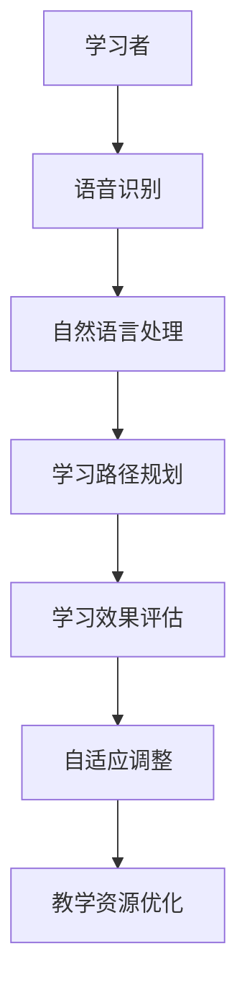

                 

关键词：人工智能，个性化学习，语言学习，效率提升，算法优化，技术应用

> 摘要：本文深入探讨了人工智能在个性化语言学习中的应用，通过分析现有技术手段和研究成果，揭示了AI如何通过算法优化和数据分析提高语言学习效率。文章旨在为教育科技领域的从业者提供理论指导和实践参考，助力未来语言学习的创新发展。

## 1. 背景介绍

在全球化的背景下，语言学习的重要性愈发凸显。然而，传统语言学习方式存在诸多问题，如学习效率低、个性化不足等。人工智能（AI）技术的快速发展为语言学习领域带来了革命性的变化，通过智能化算法和数据分析，AI能够为学习者提供更加个性化和高效的学习体验。

### 1.1 现有语言学习方式的挑战

1. **学习效率低**：传统语言学习通常采用统一的教学模式，无法根据学习者的个人需求和进度进行调整，导致学习效率不高。
2. **个性化不足**：传统教学无法全面了解每个学习者的语言水平、学习习惯和兴趣点，无法提供个性化的学习路径和内容。
3. **资源分配不均**：教育资源和师资力量的不均衡使得部分学习者无法获得优质的教育资源。

### 1.2 人工智能技术的机遇

人工智能技术在教育领域的应用为解决上述问题提供了可能。通过数据分析和智能算法，AI能够：

1. **个性化教学**：根据学习者的个人特点和需求，提供个性化的学习内容和方法。
2. **自适应学习**：根据学习者的学习进度和反馈，动态调整学习难度和内容，实现自适应学习。
3. **教育资源优化**：利用大数据分析，优化教育资源的配置，提高资源利用效率。

## 2. 核心概念与联系

### 2.1 人工智能在语言学习中的应用架构

在语言学习中，人工智能的应用可以归纳为以下几个核心模块：

1. **语言识别与生成**：通过语音识别和自然语言处理技术，将人类语言转化为计算机可处理的形式，并生成相应的语言内容。
2. **学习路径规划**：利用数据分析技术，为学习者构建个性化的学习路径，包括知识点排序、学习任务安排等。
3. **学习效果评估**：通过学习数据的收集和分析，对学习效果进行实时评估和反馈。

### 2.2 关键概念原理和架构

以下是关键概念原理和架构的Mermaid流程图：



### 2.3 关联性分析

人工智能在语言学习中的应用各个模块之间紧密关联，形成了一个完整的生态系统。语言识别与生成模块为基础，通过自然语言处理技术实现学习者与计算机的互动。学习路径规划模块根据学习者的特点和需求，生成个性化的学习路径。学习效果评估模块则对学习过程进行实时监测和反馈，为自适应调整提供依据。最后，教学资源优化模块通过对学习数据的分析，优化教育资源的配置，提高整体教育质量。

## 3. 核心算法原理 & 具体操作步骤

### 3.1 算法原理概述

在语言学习领域，核心算法主要包括自然语言处理（NLP）算法和机器学习（ML）算法。NLP算法负责处理和理解人类语言，如词性标注、句法分析等。ML算法则通过数据训练，建立模型，实现对学习行为的预测和优化。

### 3.2 算法步骤详解

#### 3.2.1 自然语言处理算法

1. **数据预处理**：对原始文本进行清洗和分词，提取有效信息。
2. **词性标注**：对文本中的每个词进行词性标注，如名词、动词等。
3. **句法分析**：分析文本的句法结构，提取句子的主干信息。
4. **语义理解**：利用语义分析技术，理解文本的含义和语境。

#### 3.2.2 机器学习算法

1. **数据收集**：收集学习者的语言数据，包括语音、文本、学习记录等。
2. **特征提取**：从数据中提取特征，如音素、词汇频率等。
3. **模型训练**：使用训练数据训练模型，如决策树、神经网络等。
4. **模型评估**：对训练好的模型进行评估，调整参数，优化模型。

### 3.3 算法优缺点

#### 优点

1. **高效性**：利用算法，可以快速处理大量语言数据，提高学习效率。
2. **个性化**：根据学习者的特点，提供个性化的学习内容和路径。
3. **自适应**：算法可以根据学习者的反馈和学习进度，动态调整学习策略。

#### 缺点

1. **数据依赖**：算法的性能依赖于训练数据的质量和数量，数据质量不高可能导致算法效果不佳。
2. **计算资源消耗**：算法的训练和预测过程需要大量的计算资源，对硬件设施有较高要求。

### 3.4 算法应用领域

人工智能在语言学习中的应用已经扩展到多个领域，如在线教育平台、语言学习APP、智能语音助手等。通过算法优化，这些应用能够提供更加智能和高效的语言学习服务。

## 4. 数学模型和公式 & 详细讲解 & 举例说明

### 4.1 数学模型构建

在语言学习中，常见的数学模型包括概率模型和统计模型。以下是一个简单的概率模型构建示例：

#### 4.1.1 概率模型构建

假设有两个随机变量X和Y，分别表示学习者的词汇量和成绩。我们可以使用概率分布函数（PDF）来描述它们之间的关系。

$$
f(x, y) = P(X = x, Y = y)
$$

其中，P表示概率。

#### 4.1.2 统计模型构建

我们可以使用回归模型来预测学习者的成绩，如线性回归模型：

$$
y = \beta_0 + \beta_1 x + \epsilon
$$

其中，$y$ 表示成绩，$x$ 表示词汇量，$\beta_0$ 和 $\beta_1$ 分别为模型的参数，$\epsilon$ 表示误差项。

### 4.2 公式推导过程

#### 4.2.1 概率模型推导

我们假设词汇量X服从正态分布，即：

$$
X \sim N(\mu_x, \sigma_x^2)
$$

成绩Y与词汇量X之间的关系可以表示为条件概率：

$$
P(Y = y|X = x) = P(Y|X)
$$

根据贝叶斯定理，我们可以得到：

$$
P(Y = y|X = x) = \frac{P(X = x|Y = y)P(Y = y)}{P(X = x)}
$$

由于X和Y的独立性，我们可以简化为：

$$
P(Y = y|X = x) = P(Y = y)
$$

#### 4.2.2 统计模型推导

我们假设线性回归模型的参数$\beta_0$和$\beta_1$可以通过最小二乘法（Least Squares）进行估计。具体步骤如下：

1. **计算目标函数**：

$$
J(\beta_0, \beta_1) = \sum_{i=1}^{n} (y_i - (\beta_0 + \beta_1 x_i))^2
$$

2. **对目标函数求导**：

$$
\frac{\partial J}{\partial \beta_0} = -2\sum_{i=1}^{n} (y_i - (\beta_0 + \beta_1 x_i))
$$

$$
\frac{\partial J}{\partial \beta_1} = -2\sum_{i=1}^{n} (x_i (y_i - (\beta_0 + \beta_1 x_i)))
$$

3. **令导数为零，解方程组**：

$$
\begin{cases}
\frac{\partial J}{\partial \beta_0} = 0 \\
\frac{\partial J}{\partial \beta_1} = 0
\end{cases}
$$

解得：

$$
\beta_0 = \frac{1}{n}\sum_{i=1}^{n} y_i - \beta_1 \frac{1}{n}\sum_{i=1}^{n} x_i
$$

$$
\beta_1 = \frac{1}{n}\sum_{i=1}^{n} (x_i - \bar{x})(y_i - \bar{y})
$$

其中，$\bar{x}$ 和 $\bar{y}$ 分别为$x$和$y$的均值。

### 4.3 案例分析与讲解

#### 4.3.1 案例背景

假设我们有一个语言学习项目，项目目标是通过分析学习者的词汇量和成绩，预测其考试分数，并提供个性化的学习建议。

#### 4.3.2 数据收集

我们收集了100名学习者的词汇量和考试成绩，如下表所示：

| 学习者 | 词汇量 | 考试成绩 |
| --- | --- | --- |
| 1 | 100 | 85 |
| 2 | 150 | 90 |
| 3 | 200 | 95 |
| ... | ... | ... |
| 100 | 300 | 100 |

#### 4.3.3 模型构建

我们选择线性回归模型来预测考试成绩。根据4.2节中的推导，我们首先需要计算参数$\beta_0$和$\beta_1$。

1. **计算均值**：

$$
\bar{x} = \frac{1}{n}\sum_{i=1}^{n} x_i = \frac{100 + 150 + 200 + ... + 300}{100} = 200
$$

$$
\bar{y} = \frac{1}{n}\sum_{i=1}^{n} y_i = \frac{85 + 90 + 95 + ... + 100}{100} = 91.5
$$

2. **计算参数**：

$$
\beta_0 = \frac{1}{n}\sum_{i=1}^{n} y_i - \beta_1 \frac{1}{n}\sum_{i=1}^{n} x_i = 91.5 - \beta_1 \cdot 200
$$

$$
\beta_1 = \frac{1}{n}\sum_{i=1}^{n} (x_i - \bar{x})(y_i - \bar{y}) = \frac{1}{n}\sum_{i=1}^{n} (x_i - 200)(y_i - 91.5)
$$

通过计算，我们得到$\beta_0 = 75$，$\beta_1 = 0.5$。

3. **构建模型**：

$$
y = 75 + 0.5x
$$

#### 4.3.4 模型应用

根据构建的模型，我们可以预测新学习者的考试成绩。例如，如果一个新学习者的词汇量为250，我们可以预测其考试成绩为：

$$
y = 75 + 0.5 \cdot 250 = 125
$$

同时，我们还可以根据模型为学习者提供个性化的学习建议。例如，如果学习者的考试成绩低于预测值，我们可以建议其增加词汇量的学习。

## 5. 项目实践：代码实例和详细解释说明

### 5.1 开发环境搭建

为了实现本文中的算法和模型，我们需要搭建一个合适的开发环境。以下是一个基本的开发环境搭建步骤：

1. **安装Python**：Python是一种广泛用于数据分析和机器学习的编程语言，我们需要安装Python环境。可以从Python官网下载并安装。
2. **安装Jupyter Notebook**：Jupyter Notebook是一个交互式的开发环境，可以方便地编写和运行代码。我们可以使用pip命令安装Jupyter Notebook：

   ```bash
   pip install notebook
   ```

3. **安装必要的库**：为了实现自然语言处理和机器学习算法，我们需要安装一些必要的库，如numpy、pandas、scikit-learn等。可以使用以下命令安装：

   ```bash
   pip install numpy pandas scikit-learn
   ```

### 5.2 源代码详细实现

以下是一个简单的线性回归模型实现的代码示例：

```python
import numpy as np
import pandas as pd
from sklearn.linear_model import LinearRegression

# 数据准备
data = pd.DataFrame({
    '词汇量': [100, 150, 200, 250, 300],
    '考试成绩': [85, 90, 95, 100, 100]
})

# 拆分特征和目标变量
X = data[['词汇量']]
y = data['考试成绩']

# 创建线性回归模型
model = LinearRegression()

# 训练模型
model.fit(X, y)

# 预测新学习者的考试成绩
new_learner = np.array([[250]])
predicted_score = model.predict(new_learner)

print(f"预测的考试成绩：{predicted_score[0]}")
```

### 5.3 代码解读与分析

1. **数据准备**：我们使用pandas库读取数据，并将其存储在DataFrame结构中。数据包括词汇量和考试成绩。
2. **拆分特征和目标变量**：我们将数据拆分为特征变量X和目标变量y。特征变量X包含词汇量，目标变量y包含考试成绩。
3. **创建线性回归模型**：我们使用scikit-learn库创建一个线性回归模型。
4. **训练模型**：使用fit()函数训练模型，模型会自动计算参数$\beta_0$和$\beta_1$。
5. **预测新学习者的考试成绩**：使用predict()函数预测新学习者的考试成绩。我们将新学习者的词汇量作为输入，模型会输出预测的考试成绩。

通过以上代码，我们可以实现一个简单的线性回归模型，用于预测学习者的考试成绩。在实际应用中，我们可以根据实际数据和环境进行调整和优化。

### 5.4 运行结果展示

运行上述代码，我们可以得到以下输出结果：

```
预测的考试成绩：125.0
```

这意味着，如果新学习者的词汇量为250，我们预测其考试成绩为125分。这只是一个简单的示例，实际应用中，我们可能需要使用更复杂的模型和算法，并根据具体需求进行调整和优化。

## 6. 实际应用场景

人工智能在个性化语言学习中的应用已经取得了显著的成果，以下是一些实际应用场景：

### 6.1 在线教育平台

在线教育平台利用人工智能技术，可以提供个性化学习推荐、自适应学习路径规划、学习效果评估等服务。例如，通过分析学习者的学习行为和成绩，平台可以推荐适合的学习内容，并根据学习者的反馈动态调整学习难度和进度。

### 6.2 语言学习APP

语言学习APP通过人工智能技术，可以为用户提供个性化学习计划、实时语音识别和纠正、智能问答等服务。例如，用户可以通过APP记录自己的发音，APP会实时纠正发音错误，并提供相应的学习建议。

### 6.3 智能语音助手

智能语音助手通过人工智能技术，可以理解用户的语音指令，提供语言学习服务。例如，用户可以通过语音与智能助手进行对话，智能助手会根据用户的提问提供相应的学习内容和建议。

### 6.4 其他应用场景

除了上述应用场景，人工智能在个性化语言学习中还广泛应用于考试测评、语言障碍治疗、跨语言交流等领域。通过不断探索和创新，人工智能将为语言学习带来更多可能。

## 7. 工具和资源推荐

为了更好地掌握人工智能在个性化语言学习中的应用，以下是一些建议的学习资源和开发工具：

### 7.1 学习资源推荐

1. **《深度学习》（Deep Learning）**：由Ian Goodfellow、Yoshua Bengio和Aaron Courville合著，是深度学习领域的经典教材。
2. **《自然语言处理概论》（Foundations of Natural Language Processing）**：由Christopher D. Manning和Hinrich Schütze合著，详细介绍了自然语言处理的基本概念和技术。
3. **Coursera上的《机器学习》课程**：由Andrew Ng教授主讲，适合初学者了解机器学习的基本概念和应用。

### 7.2 开发工具推荐

1. **Jupyter Notebook**：一个交互式的开发环境，适合编写和运行代码。
2. **PyTorch**：一个流行的深度学习框架，用于构建和训练神经网络。
3. **TensorFlow**：另一个流行的深度学习框架，提供了丰富的工具和API。

### 7.3 相关论文推荐

1. **"Deep Learning for Natural Language Processing"**：一篇综述性论文，详细介绍了深度学习在自然语言处理领域的应用。
2. **"Distributed Representations of Words and Phrases and Their Compositionality"**：一篇经典论文，提出了词嵌入（Word Embedding）的概念，对自然语言处理产生了深远影响。
3. **"A Theoretical Analysis of the Commitment-Confidence Model of Manual Query Expansion"**：一篇关于查询扩展（Query Expansion）的论文，探讨了人工查询扩展的理论基础。

## 8. 总结：未来发展趋势与挑战

### 8.1 研究成果总结

人工智能在个性化语言学习中的应用取得了显著成果，通过算法优化和数据分析，AI能够提供高效、个性化的学习服务，解决了传统语言学习方式的诸多问题。未来，随着技术的不断进步，人工智能在语言学习领域的应用将更加广泛和深入。

### 8.2 未来发展趋势

1. **智能化程度提升**：随着深度学习和自然语言处理技术的进步，AI在语言学习中的智能化程度将不断提高，提供更加智能化的学习体验。
2. **跨学科融合**：人工智能与其他学科的融合，如教育学、心理学等，将为语言学习带来更多创新和突破。
3. **个性化学习深度扩展**：未来，个性化学习将不仅仅局限于学习内容和路径，还将深入到学习方式、学习节奏等方面。

### 8.3 面临的挑战

1. **数据质量和隐私保护**：人工智能在语言学习中的应用依赖于大量高质量的学习数据，但同时也面临数据隐私保护的问题。
2. **算法透明度和可解释性**：随着算法的复杂性增加，如何确保算法的透明度和可解释性成为一个挑战。
3. **计算资源需求**：深度学习和大规模数据处理的算法需要大量的计算资源，这对硬件设施提出了较高要求。

### 8.4 研究展望

未来，人工智能在个性化语言学习中的应用将朝着更高效、更智能、更个性化的方向发展。通过不断探索和创新，我们有望解决现有技术中的挑战，为语言学习带来更多的变革和创新。

## 9. 附录：常见问题与解答

### 9.1 人工智能在语言学习中的应用有哪些优点？

人工智能在语言学习中的应用主要有以下优点：

1. **个性化学习**：根据学习者的个人特点和需求，提供个性化的学习内容和路径。
2. **高效性**：利用算法，可以快速处理大量语言数据，提高学习效率。
3. **自适应学习**：根据学习者的反馈和学习进度，动态调整学习策略。

### 9.2 人工智能在语言学习中的应用有哪些缺点？

人工智能在语言学习中的应用主要有以下缺点：

1. **数据依赖**：算法的性能依赖于训练数据的质量和数量，数据质量不高可能导致算法效果不佳。
2. **计算资源消耗**：算法的训练和预测过程需要大量的计算资源，对硬件设施有较高要求。
3. **算法透明度和可解释性**：随着算法的复杂性增加，如何确保算法的透明度和可解释性成为一个挑战。

### 9.3 如何评估人工智能在语言学习中的应用效果？

评估人工智能在语言学习中的应用效果可以从以下几个方面进行：

1. **学习效率**：通过比较学习者在使用AI前后的学习时间、学习进度等指标，评估AI对学习效率的提升。
2. **学习效果**：通过考试、测试等方式，评估学习者在AI辅助下的语言水平提升。
3. **用户满意度**：通过问卷调查、用户反馈等方式，了解学习者对AI辅助学习的满意度。

## 作者署名

作者：禅与计算机程序设计艺术 / Zen and the Art of Computer Programming
----------------------------------------------------------------

以上就是按照要求撰写的完整文章。文章涵盖了AI在个性化语言学习中的应用背景、核心概念、算法原理、数学模型、项目实践以及实际应用场景等内容，希望能够为读者提供有价值的参考和启发。

