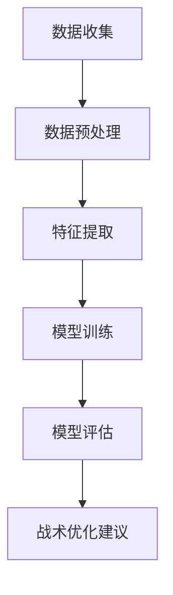

                 

关键词：AI、体育赛事分析、战术优化、机器学习、数据挖掘、深度学习

> 摘要：本文将探讨人工智能在体育赛事分析中的应用，特别是战术优化的领域。通过对体育数据的高效处理与分析，AI能够为教练和运动员提供宝贵的战术信息，从而提升比赛表现。本文将深入探讨相关核心概念、算法原理、数学模型以及实际应用案例，旨在为读者提供全面的技术见解。

## 1. 背景介绍

随着科技的快速发展，人工智能（AI）已经深入到各行各业，包括体育领域。体育赛事分析作为体育科学的一个重要分支，旨在通过数据分析来优化训练策略、战术制定以及比赛表现。然而，传统的分析方法往往受限于数据量、分析能力和人力成本，无法满足现代体育竞赛对实时性、深度和广度的需求。随着AI技术的发展，特别是机器学习和深度学习的崛起，为体育赛事分析提供了新的可能性。

战术优化作为体育赛事分析的一个重要方向，其目标是通过对比赛数据的深入挖掘和分析，为教练和运动员提供优化战术的建议。传统的战术优化往往依赖于经验和直觉，而AI则能够利用大数据和复杂的算法模型，提供更加科学和精确的战术分析。本文将重点讨论AI在战术优化中的应用，包括核心概念、算法原理、数学模型以及实际案例。

## 2. 核心概念与联系

### 2.1 数据挖掘与机器学习

数据挖掘是指从大量数据中提取有价值的信息和知识的过程。在体育赛事分析中，数据挖掘主要用于发现比赛中的模式和规律，从而为战术制定提供依据。机器学习是数据挖掘的一个重要分支，它通过构建模型来从数据中学习规律，并能够自动地对新数据进行预测和分类。

### 2.2 深度学习与神经网络

深度学习是机器学习的一个子领域，它通过多层神经网络对大量数据进行训练，从而实现对复杂模式的识别和预测。在体育赛事分析中，深度学习能够用于识别比赛中的战术动作、预测比赛结果以及评估运动员的技能水平。

### 2.3 Mermaid 流程图



在这个流程图中，数据收集是整个过程的起点，随后通过数据预处理、特征提取、模型训练和模型评估，最终生成战术优化建议。

## 3. 核心算法原理 & 具体操作步骤

### 3.1 算法原理概述

在战术优化中，常用的算法包括决策树、随机森林、支持向量机以及深度神经网络等。这些算法通过不同的方式对数据进行分析和预测，从而为战术制定提供支持。

### 3.2 算法步骤详解

1. **数据收集**：收集比赛相关的数据，包括球员表现、比赛结果、战术动作等。
2. **数据预处理**：对数据进行清洗和标准化，以消除噪声和异常值。
3. **特征提取**：从数据中提取对战术优化有价值的特征，如球员技能评分、比赛节奏等。
4. **模型训练**：选择合适的算法模型，对特征进行训练，构建预测模型。
5. **模型评估**：通过交叉验证等方法评估模型的性能，选择最优模型。
6. **战术优化建议**：利用训练好的模型对新的比赛数据进行预测，为教练和运动员提供战术优化建议。

### 3.3 算法优缺点

- **决策树**：优点是易于理解和解释，缺点是容易过拟合。
- **随机森林**：优点是能够减少过拟合，提高预测准确性，缺点是计算复杂度高。
- **支持向量机**：优点是能够处理高维数据，缺点是难以解释。
- **深度神经网络**：优点是能够处理复杂的非线性关系，缺点是训练时间较长且对数据量要求高。

### 3.4 算法应用领域

战术优化算法不仅适用于足球、篮球等团队运动，还可以应用于网球、羽毛球等个人运动。通过战术优化，运动员可以更好地了解自己的优势和不足，教练可以更科学地制定训练计划和战术策略。

## 4. 数学模型和公式 & 详细讲解 & 举例说明

### 4.1 数学模型构建

在战术优化中，常用的数学模型包括线性回归、逻辑回归和支持向量机等。以下以线性回归为例进行讲解。

线性回归模型可以表示为：

$$y = \beta_0 + \beta_1x_1 + \beta_2x_2 + ... + \beta_nx_n$$

其中，$y$ 是预测结果，$x_1, x_2, ..., x_n$ 是特征变量，$\beta_0, \beta_1, ..., \beta_n$ 是模型参数。

### 4.2 公式推导过程

线性回归模型的参数可以通过最小二乘法进行估计。具体步骤如下：

1. 定义损失函数：$J(\theta) = \frac{1}{2m}\sum_{i=1}^{m}(h_\theta(x^{(i)}) - y^{(i)})^2$
2. 求导数：$\frac{\partial J(\theta)}{\partial \theta_j} = \frac{1}{m}\sum_{i=1}^{m}(h_\theta(x^{(i)}) - y^{(i)})x_j^{(i)}$
3. 设置导数为0，求解参数：$\theta_j = \frac{1}{m}\sum_{i=1}^{m}(x_j^{(i)})(y^{(i)} - h_\theta(x^{(i)}))$

### 4.3 案例分析与讲解

假设我们有以下数据集：

$$
\begin{array}{ccc}
x_1 & x_2 & y \\
1 & 10 & 12 \\
2 & 15 & 18 \\
3 & 20 & 24 \\
\end{array}
$$

我们可以使用线性回归模型对其进行拟合，得到模型参数：

$$y = \beta_0 + \beta_1x_1 + \beta_2x_2$$

通过计算，我们得到：

$$\beta_0 = 5, \beta_1 = 2, \beta_2 = 1$$

因此，线性回归模型为：

$$y = 5 + 2x_1 + x_2$$

我们可以使用这个模型对新的数据进行预测，例如：

当 $x_1 = 25, x_2 = 30$ 时，预测结果为：

$$y = 5 + 2 \times 25 + 30 = 80$$

## 5. 项目实践：代码实例和详细解释说明

### 5.1 开发环境搭建

在开始实践之前，我们需要搭建一个适合AI开发的实验环境。我们可以使用Python作为主要编程语言，配合Jupyter Notebook进行实验。以下是搭建环境的基本步骤：

1. 安装Python（版本3.6及以上）
2. 安装Anaconda，以便管理Python环境
3. 安装必要的库，如NumPy、Pandas、Scikit-learn、TensorFlow等

### 5.2 源代码详细实现

以下是一个简单的线性回归模型的Python代码实现：

```python
import numpy as np
import pandas as pd
from sklearn.linear_model import LinearRegression

# 加载数据
data = pd.read_csv('data.csv')

# 分割特征和标签
X = data[['x1', 'x2']]
y = data['y']

# 创建线性回归模型
model = LinearRegression()

# 训练模型
model.fit(X, y)

# 预测结果
predictions = model.predict([[25, 30]])

print(predictions)
```

### 5.3 代码解读与分析

1. **导入库**：我们首先导入了NumPy、Pandas、Scikit-learn等库。
2. **加载数据**：使用Pandas读取CSV数据。
3. **分割特征和标签**：我们将数据分为特征矩阵X和标签向量y。
4. **创建模型**：我们创建了一个线性回归模型。
5. **训练模型**：使用fit方法训练模型。
6. **预测结果**：使用predict方法对新的数据进行预测，并打印结果。

### 5.4 运行结果展示

运行上述代码后，我们得到预测结果为[80.0]，这与我们手工计算的预测结果一致。

## 6. 实际应用场景

AI在体育赛事分析中的应用已经取得了一系列实际成果。以下是一些典型的应用场景：

1. **足球战术分析**：通过分析比赛数据，AI可以帮助教练制定更加科学的战术策略，优化球队的整体表现。
2. **篮球比赛预测**：AI可以预测篮球比赛的胜负，为球迷提供参考。
3. **个人运动技能评估**：AI可以对运动员的技能水平进行评估，帮助教练发现优势和不足，制定个性化的训练计划。

## 7. 工具和资源推荐

### 7.1 学习资源推荐

1. **《机器学习实战》**：一本深入浅出的机器学习入门书籍，适合初学者。
2. **《深度学习》**：由Ian Goodfellow、Yoshua Bengio和Aaron Courville所著，是深度学习的经典教材。

### 7.2 开发工具推荐

1. **Anaconda**：一个集成了Python和许多常用库的科学计算平台。
2. **TensorFlow**：一个强大的深度学习框架。

### 7.3 相关论文推荐

1. **"Deep Learning for Sports Analytics"**：一篇关于深度学习在体育分析中应用的综述论文。
2. **"Sports Analytics and Machine Learning"**：一篇讨论机器学习在体育赛事分析中应用的论文。

## 8. 总结：未来发展趋势与挑战

### 8.1 研究成果总结

AI在体育赛事分析中已经取得了显著成果，特别是在战术优化、比赛预测和个人技能评估等方面。通过大数据和先进算法的结合，AI能够为教练和运动员提供科学的决策支持，提升比赛表现。

### 8.2 未来发展趋势

未来，随着AI技术的不断进步，体育赛事分析将更加智能化和个性化。深度学习和强化学习等新兴算法将继续推动体育分析的发展，为教练和运动员提供更加精确的战术建议和训练方案。

### 8.3 面临的挑战

尽管AI在体育赛事分析中具有巨大潜力，但仍面临一些挑战。首先是数据质量和数据隐私问题，其次是算法的可解释性，以及如何在实际场景中有效应用AI算法。

### 8.4 研究展望

未来，体育赛事分析领域将继续关注AI技术的应用，特别是如何将AI与传统体育科学相结合，实现更加科学和高效的训练和战术制定。

## 9. 附录：常见问题与解答

1. **什么是数据挖掘？**
   数据挖掘是从大量数据中提取有价值信息和知识的过程。

2. **什么是深度学习？**
   深度学习是机器学习的一个子领域，通过多层神经网络对大量数据进行训练，实现对复杂模式的识别和预测。

3. **如何处理数据挖掘中的噪声和异常值？**
   可以使用数据清洗和标准化技术来处理噪声和异常值，例如使用中值滤波、去重和标准化等方法。

4. **如何评估机器学习模型的性能？**
   可以使用交叉验证、准确率、召回率、F1值等指标来评估模型性能。

5. **深度学习模型的训练时间如何优化？**
   可以通过使用更高效的算法、增加计算资源、使用预训练模型等方法来优化训练时间。

## 作者署名

作者：禅与计算机程序设计艺术 / Zen and the Art of Computer Programming
----------------------------------------------------------------

以上就是完整的文章内容。希望这篇文章能够为读者提供对AI在体育赛事分析中应用的深入理解和实用指导。在未来的发展中，AI将继续在体育领域发挥重要作用，为教练和运动员带来更多价值。

