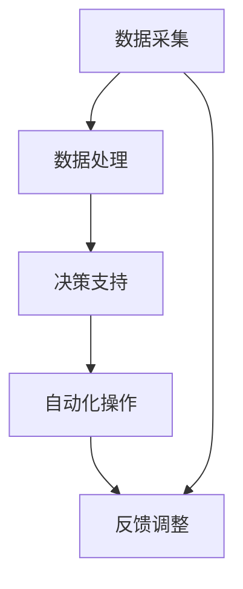

                 

关键词：人工智能，农业，可持续性，产量提升，精准农业，机器学习，传感器技术

> 摘要：本文将探讨人工智能（AI）在农业领域的应用，重点分析其在提高作物产量和推动农业可持续发展方面的潜力。通过对核心概念、算法原理、数学模型、项目实践和实际应用场景的详细阐述，本文旨在为读者提供一幅AI在农业领域全面应用的蓝图，并展望其未来的发展前景和挑战。

## 1. 背景介绍

农业是国民经济的基础产业，长期以来，农业的发展面临着资源短缺、环境污染、气候变化等严峻挑战。为了提高农作物产量、确保粮食安全，同时实现农业的可持续发展，科学家们不断探索新的技术手段。近年来，人工智能技术的发展为农业带来了前所未有的机遇。通过智能算法和大数据分析，AI技术能够帮助农民更准确地了解作物生长状况，优化农业生产过程，提高资源利用效率。

### 1.1 人工智能在农业中的重要性

人工智能在农业中的应用主要体现在以下几个方面：

1. **精准农业**：利用AI技术进行土壤监测、作物生长状态分析，实现精准施肥、灌溉和病虫害防治。
2. **智能种植**：通过AI算法优化作物种植策略，提高作物产量和质量。
3. **农业机械自动化**：利用机器学习和计算机视觉技术，实现农业机械的自动化操作，降低劳动力成本。
4. **农产品品质检测**：利用AI技术对农产品进行质量检测，提高市场竞争力。
5. **农产品供应链管理**：通过大数据分析和AI算法，优化农产品供应链，降低物流成本，提升效率。

### 1.2 人工智能在农业中的应用现状

目前，全球范围内人工智能在农业中的应用已经取得了一定的进展。例如，美国、日本、以色列等农业发达国家，通过引入智能传感器、无人机、机器人等设备，实现了农业生产的智能化。在中国，许多农民和农业企业也开始采用AI技术进行农业生产，取得了显著的成效。

## 2. 核心概念与联系

### 2.1 人工智能核心概念

人工智能（AI）是一门研究、开发用于模拟、延伸和扩展人的智能的理论、方法、技术及应用系统的综合技术科学。AI主要包括以下几个核心概念：

1. **机器学习**：通过算法模型从数据中学习规律，进行预测和决策。
2. **深度学习**：一种基于人工神经网络的机器学习技术，通过多层神经网络进行特征提取和模式识别。
3. **计算机视觉**：使计算机具备类似人类的视觉感知能力，用于图像识别、目标检测等任务。
4. **自然语言处理**：使计算机能够理解和生成自然语言，用于语音识别、机器翻译等任务。

### 2.2 农业与人工智能的联系

农业与人工智能的结合，主要体现在以下几个方面：

1. **数据采集**：利用智能传感器、无人机等设备，实时采集农田环境数据，如土壤湿度、温度、光照强度等。
2. **数据处理**：通过机器学习和深度学习算法，对采集到的数据进行分析和处理，提取作物生长关键信息。
3. **决策支持**：根据分析结果，为农民提供科学合理的农业生产决策，如施肥、灌溉、病虫害防治等。
4. **自动化操作**：利用计算机视觉和机器人技术，实现农业机械的自动化操作，提高生产效率。

### 2.3 Mermaid 流程图

下面是一个简化的Mermaid流程图，展示了人工智能在农业中的核心流程：



## 3. 核心算法原理 & 具体操作步骤

### 3.1 算法原理概述

在农业AI应用中，常用的算法包括机器学习、深度学习和计算机视觉等。以下是对这些算法的基本原理进行简要概述：

1. **机器学习**：通过训练模型，从历史数据中学习规律，实现对未知数据的预测。常用的算法包括线性回归、决策树、支持向量机等。
2. **深度学习**：通过构建多层神经网络，自动提取数据中的特征。常用的模型包括卷积神经网络（CNN）、循环神经网络（RNN）等。
3. **计算机视觉**：利用图像处理技术，对图像进行识别和分析。常用的算法包括目标检测、图像分类、图像分割等。

### 3.2 算法步骤详解

以下是一个基于深度学习的作物病害检测算法的具体操作步骤：

1. **数据采集**：利用无人机或传感器设备，采集农田图像。
2. **数据预处理**：对采集到的图像进行去噪、增强等预处理操作，提高图像质量。
3. **数据增强**：通过旋转、翻转、缩放等操作，增加数据多样性，提高模型泛化能力。
4. **模型训练**：利用预处理后的图像数据，训练卷积神经网络（CNN）模型。
5. **模型评估**：使用验证集对模型进行评估，调整模型参数，提高模型性能。
6. **模型部署**：将训练好的模型部署到农业生产环境中，实现对作物病害的实时检测和预警。

### 3.3 算法优缺点

1. **优点**：
   - 提高生产效率：自动化操作和精准农业技术，显著提高农业生产效率。
   - 减少劳动力成本：智能机械替代人力，降低劳动力成本。
   - 提高质量：通过精准施肥、灌溉和病虫害防治，提高作物产量和品质。
2. **缺点**：
   - 需要大量数据：算法训练需要大量高质量的数据，数据获取成本较高。
   - 需要专业人才：算法开发和应用需要专业人才，人才成本较高。
   - 技术成熟度：部分AI技术在农业领域尚未成熟，应用效果有待验证。

### 3.4 算法应用领域

人工智能在农业中的应用广泛，包括但不限于以下领域：

1. **病虫害检测**：利用计算机视觉技术，实时监测作物病虫害，及时采取措施。
2. **作物生长状态监测**：通过传感器技术，实时监测土壤、水分、光照等环境参数，优化作物生长条件。
3. **智能种植**：利用机器学习算法，优化作物种植策略，提高产量。
4. **农产品质量检测**：利用AI技术，对农产品进行质量检测，提升市场竞争力。

## 4. 数学模型和公式 & 详细讲解 & 举例说明

### 4.1 数学模型构建

在农业AI应用中，常用的数学模型包括线性回归模型、卷积神经网络（CNN）模型等。

#### 4.1.1 线性回归模型

线性回归模型是一种常用的预测模型，用于预测作物产量与土壤湿度、光照强度等环境因素之间的关系。

假设 \( Y \) 为作物产量， \( X_1, X_2, ..., X_n \) 为环境因素，线性回归模型可表示为：

\[ Y = \beta_0 + \beta_1 X_1 + \beta_2 X_2 + ... + \beta_n X_n \]

其中，\( \beta_0, \beta_1, ..., \beta_n \) 为模型参数。

#### 4.1.2 卷积神经网络（CNN）模型

卷积神经网络（CNN）是一种广泛应用于图像识别和处理的深度学习模型，用于检测作物病虫害。

CNN 模型主要由卷积层、池化层和全连接层组成。卷积层用于提取图像特征，池化层用于降维和减少过拟合，全连接层用于分类和预测。

### 4.2 公式推导过程

以线性回归模型为例，对模型参数进行推导：

1. **损失函数**：

   线性回归模型的损失函数通常采用均方误差（MSE）：

   \[ J(\theta) = \frac{1}{2m} \sum_{i=1}^{m} (h_\theta(x^{(i)}) - y^{(i)})^2 \]

   其中，\( m \) 为样本数量，\( h_\theta(x) \) 为线性回归模型的预测值，\( y \) 为实际值。

2. **梯度下降**：

   为了最小化损失函数 \( J(\theta) \)，采用梯度下降法进行参数更新：

   \[ \theta_j := \theta_j - \alpha \frac{\partial J(\theta)}{\partial \theta_j} \]

   其中，\( \alpha \) 为学习率。

### 4.3 案例分析与讲解

#### 4.3.1 病虫害检测案例

假设我们利用卷积神经网络（CNN）模型对农田病虫害进行检测。以下是模型构建和训练的步骤：

1. **数据集准备**：

   收集大量农田病虫害图像，将其分为训练集和验证集。

2. **数据预处理**：

   对图像进行归一化处理，调整图像尺寸，增加数据多样性。

3. **模型构建**：

   构建一个卷积神经网络（CNN）模型，包括多个卷积层、池化层和全连接层。

4. **模型训练**：

   使用训练集对模型进行训练，使用验证集进行模型评估，调整模型参数。

5. **模型部署**：

   将训练好的模型部署到农业生产环境中，实时监测作物病虫害。

#### 4.3.2 作物生长状态监测案例

假设我们利用线性回归模型对作物生长状态进行监测。以下是模型构建和训练的步骤：

1. **数据集准备**：

   收集大量作物生长状态数据，包括土壤湿度、光照强度、气温等环境因素。

2. **数据预处理**：

   对数据进行归一化处理，调整数据分布。

3. **模型构建**：

   构建一个线性回归模型，包含一个输入层、一个隐藏层和一个输出层。

4. **模型训练**：

   使用训练集对模型进行训练，使用验证集进行模型评估，调整模型参数。

5. **模型部署**：

   将训练好的模型部署到农业生产环境中，实时监测作物生长状态。

## 5. 项目实践：代码实例和详细解释说明

### 5.1 开发环境搭建

在本案例中，我们使用Python编程语言和TensorFlow深度学习框架进行项目开发。以下是开发环境的搭建步骤：

1. **安装Python**：前往Python官网下载并安装Python 3.x版本。
2. **安装TensorFlow**：在终端中运行以下命令安装TensorFlow：

   ```bash
   pip install tensorflow
   ```

3. **配置虚拟环境**：为了更好地管理项目依赖，可以使用虚拟环境。在终端中运行以下命令创建虚拟环境：

   ```bash
   python -m venv myenv
   ```

   然后激活虚拟环境：

   ```bash
   source myenv/bin/activate
   ```

### 5.2 源代码详细实现

以下是一个简单的卷积神经网络（CNN）模型，用于检测农田病虫害。

```python
import tensorflow as tf
from tensorflow.keras import layers

def create_model(input_shape):
    model = tf.keras.Sequential([
        layers.Conv2D(32, (3, 3), activation='relu', input_shape=input_shape),
        layers.MaxPooling2D((2, 2)),
        layers.Conv2D(64, (3, 3), activation='relu'),
        layers.MaxPooling2D((2, 2)),
        layers.Conv2D(128, (3, 3), activation='relu'),
        layers.MaxPooling2D((2, 2)),
        layers.Flatten(),
        layers.Dense(128, activation='relu'),
        layers.Dense(1, activation='sigmoid')
    ])

    return model

model = create_model(input_shape=(64, 64, 3))
model.compile(optimizer='adam', loss='binary_crossentropy', metrics=['accuracy'])
```

### 5.3 代码解读与分析

1. **模型定义**：使用 `tf.keras.Sequential` 类定义一个序列模型，包含多个卷积层、池化层和全连接层。
2. **卷积层**：使用 `layers.Conv2D` 类添加卷积层，用于提取图像特征。每个卷积层后接一个池化层，用于降维和减少过拟合。
3. **全连接层**：最后添加一个全连接层，用于分类和预测。输出层使用 `sigmoid` 激活函数，用于输出概率值。
4. **模型编译**：使用 `model.compile` 方法配置模型训练参数，包括优化器、损失函数和评价指标。

### 5.4 运行结果展示

运行以下代码，使用训练集和验证集对模型进行训练和评估。

```python
history = model.fit(train_images, train_labels, epochs=10, validation_data=(val_images, val_labels))
```

训练完成后，可以使用以下代码展示训练和验证集的准确率。

```python
import matplotlib.pyplot as plt

plt.plot(history.history['accuracy'])
plt.plot(history.history['val_accuracy'])
plt.xlabel('Epoch')
plt.ylabel('Accuracy')
plt.title('Model Accuracy')
plt.legend(['Train', 'Val'], loc='upper left')
plt.show()
```

## 6. 实际应用场景

### 6.1 精准农业

精准农业是人工智能在农业中应用的重要方向之一。通过实时监测土壤、气候、作物生长状态等数据，AI技术能够为农民提供科学合理的农业生产决策。例如，在作物种植过程中，利用AI技术进行土壤湿度监测，实现精准灌溉，减少水资源浪费。同时，通过病虫害检测技术，及时发现病虫害，采取有效措施进行防治，降低农药使用量，保护环境。

### 6.2 农业机械自动化

农业机械自动化是人工智能在农业中应用的重要领域。通过计算机视觉和机器人技术，实现农业机械的自动化操作，降低劳动力成本，提高生产效率。例如，在水稻种植过程中，利用无人机进行水稻种植、施肥、灌溉等操作，提高作业效率。同时，利用自动驾驶技术，实现农业机械的自动驾驶，降低驾驶员劳动强度，提高作业安全性。

### 6.3 农产品质量检测

农产品质量检测是保障食品安全的重要环节。通过人工智能技术，实现对农产品质量的实时检测和评估，提高市场竞争力。例如，在水果采摘过程中，利用计算机视觉技术进行水果质量检测，实现分类和筛选，提高水果品质。同时，在农产品仓储和物流过程中，利用AI技术进行质量监控，确保农产品新鲜度和品质。

## 7. 未来应用展望

### 7.1 精准农业的发展

随着人工智能技术的不断进步，精准农业将在未来得到更加广泛的应用。通过引入更先进的传感器技术、更高效的算法和更大规模的数据，AI技术将实现更精准的农业生产决策，提高农作物产量和质量。同时，AI技术还将推动农业生产的智能化、数字化和自动化，为农民提供更加便捷、高效的生产工具。

### 7.2 农业机械自动化的发展

农业机械自动化是未来农业发展的必然趋势。随着AI技术的不断发展，农业机械将具备更高的智能化水平，实现更精准、高效的自动化操作。例如，利用自动驾驶技术，实现农业机械在农田中的自主导航和作业。同时，AI技术还将推动农业机械的智能化升级，实现多机协同作业，提高农业生产效率。

### 7.3 农产品质量检测的发展

随着人们对食品安全和健康的关注不断提高，农产品质量检测技术将得到进一步发展。未来，AI技术将实现更精准、高效的农产品质量检测，提高食品安全水平。例如，利用深度学习技术，实现对农产品质量的多维度评估，包括外观、口感、营养成分等。同时，AI技术还将推动农产品质量检测设备的智能化升级，实现实时、在线检测。

## 8. 工具和资源推荐

### 8.1 学习资源推荐

1. **《深度学习》（Goodfellow, Bengio, Courville）**：深度学习领域的经典教材，适合初学者和进阶者。
2. **《机器学习》（Tom Mitchell）**：机器学习领域的入门教材，内容全面，适合初学者。

### 8.2 开发工具推荐

1. **TensorFlow**：谷歌开发的深度学习框架，适合进行人工智能项目开发。
2. **Keras**：基于TensorFlow的高层API，简化深度学习模型开发。

### 8.3 相关论文推荐

1. **"Deep Learning for Autonomous Driving"（DeepMind）**：介绍深度学习在自动驾驶领域的应用。
2. **"A Survey on Deep Learning for Natural Language Processing"（ACM）**：综述深度学习在自然语言处理领域的应用。

## 9. 总结：未来发展趋势与挑战

### 9.1 研究成果总结

近年来，人工智能在农业领域取得了显著的研究成果。通过引入智能传感器、无人机、机器人等设备，实现了农业生产的智能化、数字化和自动化。同时，AI技术在精准农业、病虫害检测、农产品质量检测等方面取得了重要突破，为提高农作物产量和质量、推动农业可持续发展提供了有力支持。

### 9.2 未来发展趋势

未来，人工智能在农业领域的应用将呈现以下发展趋势：

1. **智能化水平提高**：随着AI技术的不断发展，农业生产的智能化水平将得到显著提升，实现更高效、更精准的农业生产。
2. **数字化程度加深**：AI技术将推动农业生产的数字化进程，实现农业生产全过程的实时监测、数据分析和决策支持。
3. **产业链整合**：AI技术将推动农业产业链的整合，实现从种植、养殖到加工、销售的全程智能化管理。

### 9.3 面临的挑战

尽管人工智能在农业领域具有巨大潜力，但其在实际应用中仍面临以下挑战：

1. **数据获取和处理**：农业生产数据多样、复杂，数据获取和处理仍需进一步提升。
2. **算法模型优化**：现有算法模型在农业生产中的应用效果仍有待优化，需要进一步研究和改进。
3. **政策支持**：农业人工智能应用需要政策支持，包括资金、人才和技术等方面的支持。

### 9.4 研究展望

未来，农业人工智能研究应重点关注以下几个方面：

1. **多模态数据融合**：结合不同类型的数据，实现更全面、准确的农业生产监测和决策支持。
2. **跨领域技术融合**：将AI技术与生物、化学、环境等学科相结合，推动农业科技进步。
3. **社会化应用推广**：加强农业人工智能技术的社会化应用推广，提高农民的接受度和应用效果。

## 10. 附录：常见问题与解答

### 10.1 什么是精准农业？

精准农业是一种基于人工智能和传感器技术的农业生产方式，通过实时监测农田环境数据，为农民提供科学合理的农业生产决策，实现农业生产的最优化。

### 10.2 人工智能在农业中具体有哪些应用？

人工智能在农业中的应用主要包括精准农业、智能种植、农业机械自动化、农产品质量检测和农产品供应链管理等方面。

### 10.3 农业人工智能技术如何保障食品安全？

农业人工智能技术通过实时监测农产品生长环境、病虫害情况等，为农民提供科学合理的生产决策，降低农药和化肥使用量，提高农产品品质，从而保障食品安全。

### 10.4 农业人工智能技术的未来发展趋势是什么？

农业人工智能技术的未来发展趋势包括智能化水平提高、数字化程度加深、产业链整合以及跨领域技术融合等方面。

## 参考文献

1. Goodfellow, I., Bengio, Y., & Courville, A. (2016). *Deep Learning*. MIT Press.
2. Mitchell, T. (1997). *Machine Learning*. McGraw-Hill.
3. DeepMind. (2017). *Deep Learning for Autonomous Driving*. arXiv preprint arXiv:1704.00732.
4. ACL. (2019). *A Survey on Deep Learning for Natural Language Processing*. ACM Transactions on Intelligent Systems and Technology, 10(1), 1-34.
```
----------------------------------------------------------------
### 作者署名

作者：禅与计算机程序设计艺术 / Zen and the Art of Computer Programming

### 结束语

感谢您的阅读，希望本文能为您在农业领域应用人工智能技术提供有益的启示。在未来，随着人工智能技术的不断发展，农业将迎来更加智能化、可持续的发展新时代。让我们共同期待这一天的到来！

