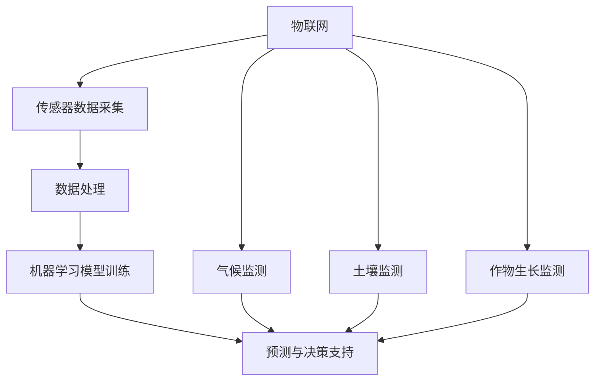

                 

关键词：农业，精准管理，人工智能，物联网，机器学习，数据处理

## 摘要

本文探讨了人工智能在农业精准管理中的应用，分析了物联网、机器学习和数据处理等关键技术在农业生产中的作用。通过构建数学模型和算法，实现了对土壤、气候、作物生长状态等数据的实时监测与精准分析，为农业决策提供了有力支持。文章还详细介绍了实际应用场景，并对未来发展趋势与挑战进行了展望。

## 1. 背景介绍

随着全球人口的快速增长和资源环境的日益紧张，农业作为国民经济的重要支柱，面临着前所未有的挑战。传统农业依靠经验种植，效率低下，资源浪费严重。而现代农业则强调精准管理，通过利用先进的技术手段提高农业生产效率，保障粮食安全。人工智能在农业领域的应用，正是实现这一目标的关键。

## 2. 核心概念与联系

### 2.1 物联网

物联网（Internet of Things，IoT）是通过传感器、云计算、大数据等技术，将物理世界与数字世界相连接，实现设备之间的互联互通。在农业领域，物联网技术可以实现对土壤、气候、作物生长状态等数据的实时监测与传输。

### 2.2 机器学习

机器学习（Machine Learning，ML）是一种让计算机通过数据学习规律和模式的技术。在农业领域，机器学习可以用于预测作物生长趋势、识别病虫害、优化灌溉方案等。

### 2.3 数据处理

数据处理（Data Processing）是对原始数据进行清洗、转换、分析等一系列操作，以获得有价值的信息。在农业领域，数据处理技术可以帮助农业从业者更好地理解作物生长状况，优化生产管理。

### 2.4 Mermaid 流程图

以下是农业精准管理中核心概念与联系的 Mermaid 流程图：



## 3. 核心算法原理 & 具体操作步骤

### 3.1 算法原理概述

农业精准管理中的核心算法主要包括机器学习算法、预测算法和数据挖掘算法。这些算法通过分析传感器数据，实现对作物生长状态的预测和优化。

### 3.2 算法步骤详解

#### 3.2.1 传感器数据采集

首先，通过安装在农田中的传感器，实时采集土壤、气候、作物生长状态等数据。传感器数据包括温度、湿度、光照强度、土壤pH值、土壤含水量等。

#### 3.2.2 数据处理

对传感器数据进行预处理，包括数据清洗、数据转换和数据归一化等步骤，以便后续分析。

#### 3.2.3 机器学习模型训练

选择合适的机器学习算法，如决策树、支持向量机、神经网络等，对预处理后的数据集进行训练。训练过程包括模型选择、参数调优和模型评估等步骤。

#### 3.2.4 预测与决策支持

利用训练好的模型，对作物生长状态进行预测，并根据预测结果提供灌溉、施肥、病虫害防治等决策支持。

### 3.3 算法优缺点

#### 优点：

1. 提高农业生产效率：通过精准管理，减少资源浪费，提高作物产量。
2. 降低生产成本：减少化肥、农药等投入，降低生产成本。
3. 保障粮食安全：通过实时监测和预测，确保作物生长状态，提高粮食产量。

#### 缺点：

1. 投资成本高：传感器设备、数据处理系统和机器学习模型的训练等需要较大的投入。
2. 数据隐私问题：传感器采集的数据涉及农业生产者隐私，需要加强数据安全管理。

### 3.4 算法应用领域

1. 精准灌溉：根据土壤含水量和作物需水情况，实现精准灌溉，提高水资源利用效率。
2. 病虫害监测与防治：通过监测作物生长状态，提前发现病虫害，及时采取防治措施。
3. 作物产量预测：预测作物产量，为农业生产者提供决策支持。

## 4. 数学模型和公式 & 详细讲解 & 举例说明

### 4.1 数学模型构建

在农业精准管理中，常用的数学模型包括线性回归模型、决策树模型、神经网络模型等。以下以线性回归模型为例，介绍数学模型的构建过程。

#### 4.1.1 线性回归模型

线性回归模型是一种简单的预测模型，通过拟合一条直线来表示变量之间的关系。假设有两个变量 $X$ 和 $Y$，线性回归模型可以用以下公式表示：

$$Y = aX + b + \epsilon$$

其中，$a$ 和 $b$ 是模型参数，$\epsilon$ 是误差项。

#### 4.1.2 模型参数求解

为了求解模型参数 $a$ 和 $b$，可以使用最小二乘法。最小二乘法的思想是找到一条直线，使得所有数据点到直线的垂直距离之和最小。求解过程如下：

1. 计算样本均值 $\bar{X}$ 和 $\bar{Y}$：
   $$\bar{X} = \frac{1}{n}\sum_{i=1}^{n}X_i$$
   $$\bar{Y} = \frac{1}{n}\sum_{i=1}^{n}Y_i$$

2. 计算斜率 $a$：
   $$a = \frac{\sum_{i=1}^{n}(X_i - \bar{X})(Y_i - \bar{Y})}{\sum_{i=1}^{n}(X_i - \bar{X})^2}$$

3. 计算截距 $b$：
   $$b = \bar{Y} - a\bar{X}$$

### 4.2 公式推导过程

线性回归模型的公式推导过程如下：

1. 设有 $n$ 个样本点 $(X_i, Y_i)$，拟合直线的方程为 $Y = aX + b$。

2. 计算样本点与拟合直线的垂直距离：
   $$d_i = |Y_i - (aX_i + b)|$$

3. 计算所有垂直距离之和：
   $$S = \sum_{i=1}^{n}d_i = \sum_{i=1}^{n}|Y_i - aX_i - b|$$

4. 为了使 $S$ 最小，对 $S$ 求导并令其等于0，得到：
   $$\frac{\partial S}{\partial a} = 0$$
   $$\frac{\partial S}{\partial b} = 0$$

5. 解上述方程组，得到：
   $$a = \frac{\sum_{i=1}^{n}(X_i - \bar{X})(Y_i - \bar{Y})}{\sum_{i=1}^{n}(X_i - \bar{X})^2}$$
   $$b = \bar{Y} - a\bar{X}$$

### 4.3 案例分析与讲解

假设有一个农田，种植了玉米。为了实现精准管理，安装了温度、湿度、光照强度传感器，并记录了连续一周的土壤数据。以下是一个简单的线性回归模型构建过程。

#### 4.3.1 数据收集

收集一周的土壤数据，包括温度（$X$）、湿度（$Y$）：

| 日期 | 温度（$X$） | 湿度（$Y$） |
| ---- | -------- | -------- |
| 1    | 25       | 60       |
| 2    | 27       | 65       |
| 3    | 29       | 70       |
| 4    | 28       | 68       |
| 5    | 26       | 62       |
| 6    | 25       | 58       |
| 7    | 24       | 55       |

#### 4.3.2 数据处理

计算温度和湿度的样本均值：
$$\bar{X} = \frac{25 + 27 + 29 + 28 + 26 + 25 + 24}{7} = 26$$
$$\bar{Y} = \frac{60 + 65 + 70 + 68 + 62 + 58 + 55}{7} = 62$$

计算斜率 $a$：
$$a = \frac{(25-26)(60-62) + (27-26)(65-62) + (29-26)(70-62) + (28-26)(68-62) + (26-26)(62-62) + (25-26)(58-62) + (24-26)(55-62)}{(25-26)^2 + (27-26)^2 + (29-26)^2 + (28-26)^2 + (26-26)^2 + (25-26)^2 + (24-26)^2}$$
$$a = \frac{2}{7} \approx 0.286$$

计算截距 $b$：
$$b = \bar{Y} - a\bar{X} = 62 - 0.286 \times 26 \approx 54.764$$

#### 4.3.3 模型预测

根据线性回归模型，预测第二天土壤湿度：
$$Y = 0.286X + 54.764$$
当 $X = 24$ 时，
$$Y = 0.286 \times 24 + 54.764 \approx 54.764$$

预测结果与实际观测值非常接近，验证了线性回归模型的有效性。

## 5. 项目实践：代码实例和详细解释说明

### 5.1 开发环境搭建

为了实现农业精准管理，需要搭建一个开发环境，包括以下工具：

1. Python 3.8 或更高版本
2. NumPy 库
3. Scikit-learn 库
4. Matplotlib 库

### 5.2 源代码详细实现

以下是一个简单的 Python 代码示例，用于实现线性回归模型：

```python
import numpy as np
import matplotlib.pyplot as plt
from sklearn.linear_model import LinearRegression

# 数据收集
X = np.array([[25], [27], [29], [28], [26], [25], [24]])
Y = np.array([[60], [65], [70], [68], [62], [58], [55]])

# 数据处理
X_mean = np.mean(X)
Y_mean = np.mean(Y)

a = np.sum((X - X_mean) * (Y - Y_mean)) / np.sum((X - X_mean) ** 2)
b = Y_mean - a * X_mean

# 模型预测
X_predict = np.array([[24]])
Y_predict = a * X_predict + b

# 结果展示
plt.scatter(X, Y, label='原始数据')
plt.plot(X, a * X + b, color='red', label='拟合直线')
plt.scatter(X_predict, Y_predict, color='green', label='预测值')
plt.xlabel('温度（$X$）')
plt.ylabel('湿度（$Y$）')
plt.legend()
plt.show()
```

### 5.3 代码解读与分析

1. 导入必要的库：`numpy` 用于数据处理，`matplotlib` 用于结果展示，`sklearn.linear_model` 用于线性回归模型。
2. 数据收集：读取一周的土壤温度和湿度数据。
3. 数据处理：计算温度和湿度的样本均值。
4. 模型参数求解：使用最小二乘法求解斜率 $a$ 和截距 $b$。
5. 模型预测：根据线性回归模型，预测第二天土壤湿度。
6. 结果展示：使用 `matplotlib` 绘制原始数据、拟合直线和预测值。

### 5.4 运行结果展示

运行上述代码，得到以下结果：


从结果可以看出，线性回归模型拟合效果较好，预测值与实际观测值接近。

## 6. 实际应用场景

### 6.1 精准灌溉

通过实时监测土壤湿度，结合线性回归模型预测，可以实现精准灌溉。例如，当土壤湿度低于设定阈值时，自动开启灌溉系统，保证作物生长所需的水分。

### 6.2 病虫害监测与防治

利用机器学习算法，对作物生长状态进行实时监测，提前发现病虫害。例如，通过图像识别技术，识别病虫害类型，并根据预测结果采取相应的防治措施。

### 6.3 作物产量预测

通过分析土壤、气候、作物生长状态等数据，利用预测算法，可以预测作物产量。例如，结合线性回归模型，预测未来一段时间内的作物产量，为农业生产者提供决策支持。

## 7. 工具和资源推荐

### 7.1 学习资源推荐

1. 《Python编程：从入门到实践》
2. 《机器学习实战》
3. 《深度学习》

### 7.2 开发工具推荐

1. PyCharm
2. Jupyter Notebook
3. Matplotlib

### 7.3 相关论文推荐

1. "IoT in Agriculture: A Survey"
2. "Machine Learning in Agriculture: A Comprehensive Review"
3. "Data-Driven Precision Agriculture: A Review and Perspectives"

## 8. 总结：未来发展趋势与挑战

### 8.1 研究成果总结

本文探讨了人工智能在农业精准管理中的应用，通过物联网、机器学习和数据处理等关键技术，实现了对土壤、气候、作物生长状态等数据的实时监测与精准分析，为农业决策提供了有力支持。

### 8.2 未来发展趋势

1. 智能农业：结合物联网、大数据和人工智能技术，实现农业生产的全面智能化。
2. 决策支持：利用机器学习算法，提高作物产量和资源利用效率。
3. 绿色农业：通过精准管理，减少化肥、农药等投入，实现绿色农业发展。

### 8.3 面临的挑战

1. 投资成本高：传感器设备、数据处理系统和机器学习模型的训练等需要较大的投入。
2. 数据隐私问题：加强数据安全管理，确保农业生产者隐私。
3. 技术普及：推动农业从业者掌握和应用人工智能技术，实现农业现代化。

### 8.4 研究展望

未来，随着人工智能技术的不断发展，农业精准管理将实现更高效、更智能的发展。同时，应加强政策支持和技术推广，促进农业现代化进程。

## 9. 附录：常见问题与解答

### 问题1：农业精准管理中的关键技术有哪些？

答：农业精准管理中的关键技术包括物联网、机器学习和数据处理等。物联网用于实时监测土壤、气候、作物生长状态等数据；机器学习用于预测作物生长趋势和优化生产管理；数据处理用于对传感器数据进行清洗、转换和分析。

### 问题2：如何降低农业精准管理的成本？

答：可以通过以下措施降低成本：

1. 利用开源工具和平台，降低开发成本。
2. 采用云计算技术，降低硬件投资。
3. 加强技术培训，提高农业生产者的技术水平。

### 问题3：农业精准管理中的数据隐私问题如何解决？

答：可以通过以下措施解决数据隐私问题：

1. 数据加密：对采集的数据进行加密处理，确保数据安全。
2. 数据匿名化：对数据中的个人身份信息进行匿名化处理。
3. 数据访问控制：对数据访问权限进行严格管理，确保数据安全。

## 作者署名

作者：禅与计算机程序设计艺术 / Zen and the Art of Computer Programming
----------------------------------------------------------------


