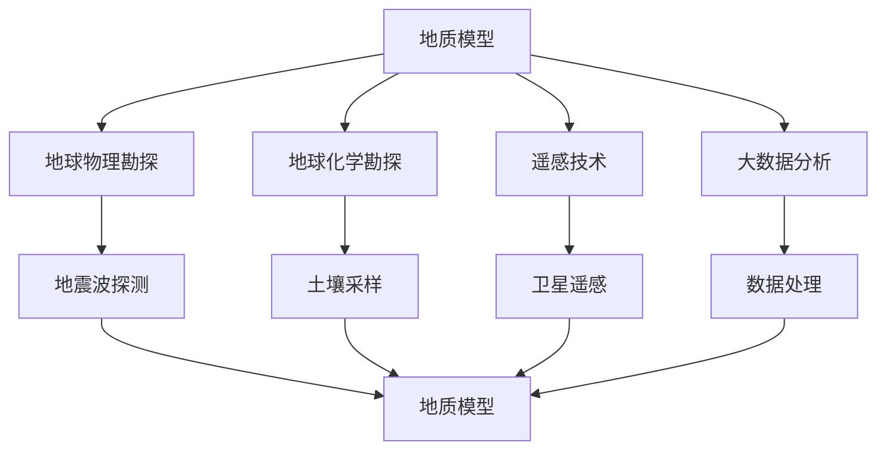

                 

 关键词：地质勘探、人工智能、资源发现、深度学习、数据分析、地质模型、地球物理、大数据处理、地质模拟

## 摘要

本文探讨了人工智能（AI）在地质勘探领域中的应用，通过结合深度学习、数据分析等技术，显著提高了资源发现的效率和准确性。文章首先介绍了地质勘探的背景和挑战，然后详细阐述了AI在地质勘探中的应用场景、核心算法原理、数学模型构建及具体操作步骤。随后，文章通过实际项目实践展示了AI在地质勘探中的具体应用，并分析了其潜在的未来应用场景和发展趋势。最后，文章总结了AI在地质勘探中的应用成果，并提出了未来研究的发展方向和面临的挑战。

## 1. 背景介绍

地质勘探是资源开发的重要环节，其目标是通过研究地球内部结构和地表形态，寻找有价值的矿产资源、能源资源和地下水等。地质勘探的发展经历了从传统的地质学、地球物理学到现代遥感技术、地质模型的演变过程。然而，随着地球资源的日益枯竭和勘探环境的复杂性增加，传统的勘探方法在效率和精度上面临着巨大的挑战。

### 地质勘探的定义和目的

地质勘探是指通过地质、地球物理、地球化学等手段，对地球内部和地表结构进行系统的研究，以识别和评价潜在的资源。其目的是确定资源的类型、分布、规模和品质，为后续的采矿、油气开发、城市建设等提供科学依据。

### 地质勘探的发展历程

- **早期方法**：早期的地质勘探主要依靠地质观测和地球物理测量，如地质剖面、地震波探测等。
- **遥感技术**：随着遥感技术的发展，地质勘探进入了空间时代，遥感图像能够提供大范围、高精度的地质信息。
- **地质模型**：近年来，地质模型的应用使得勘探工作更加精确，通过模拟地质过程和地质结构，可以预测潜在资源的分布。
- **大数据与AI**：随着大数据和人工智能技术的发展，地质勘探迎来了新的变革，AI技术通过处理和分析海量数据，提高了资源发现的效率。

### 当前地质勘探的挑战

- **资源枯竭**：随着传统资源的开采，新的资源发现变得更加困难。
- **勘探成本**：传统勘探方法成本高昂，需要大量的人力、物力和时间。
- **环境限制**：在环境法规日益严格的背景下，勘探活动需要更加环保和可持续。
- **复杂性**：地质环境复杂多变，传统的地质模型和算法难以准确预测资源分布。

## 2. 核心概念与联系

地质勘探中的核心概念包括地质模型、地球物理勘探、地球化学勘探、遥感技术和大数据分析。这些概念之间相互关联，共同构成了地质勘探的技术体系。

### 地质模型

地质模型是对地下地质结构、地层和岩性的数值模拟，通过地质数据、地球物理数据和地球化学数据等多种信息来源进行构建。地质模型是地质勘探的核心工具，用于预测地下资源的分布和品质。

### 地球物理勘探

地球物理勘探是利用地球物理方法（如地震波探测、重力测量、磁法测量等）来识别地下地质结构的勘探技术。地球物理勘探数据是构建地质模型的重要基础。

### 地球化学勘探

地球化学勘探是利用地球化学方法（如土壤采样、水样分析等）来检测地下矿物资源的勘探技术。地球化学勘探数据有助于识别潜在资源区，提高勘探的针对性。

### 遥感技术

遥感技术通过卫星或无人机获取地表图像，提供大范围、高分辨率的地质信息。遥感数据在地质勘探中用于识别地质异常和潜在资源区。

### 大数据分析

大数据分析是利用计算机技术和算法对海量地质数据进行处理和分析，以提取有用的地质信息。大数据分析技术能够提高地质勘探的精度和效率。

### Mermaid 流程图



### 2.1 地质模型原理与构建方法

地质模型是地质勘探的核心工具，用于模拟地下地质结构，预测资源分布。地质模型的构建方法主要包括以下几步：

1. **数据收集**：收集地质勘探数据，包括地球物理、地球化学和遥感数据。
2. **数据预处理**：对收集到的数据进行清洗和标准化处理，去除噪声和异常值。
3. **地质建模**：利用地质数据构建地质模型，包括地层模型、岩性模型和构造模型等。
4. **模型验证**：通过实测数据对地质模型进行验证，确保模型的精度和可靠性。
5. **模型更新**：根据新收集的数据和模型验证结果，不断更新地质模型。

### 2.2 地球物理勘探原理与技术

地球物理勘探是利用地球物理方法来识别地下地质结构的技术。其主要原理是通过测量地下的物理特性（如地震波速度、重力场、磁场等）来推断地质结构。常见的地球物理勘探技术包括：

- **地震波探测**：通过激发地震波，测量地震波的传播速度和反射特征，推断地下地层结构和岩性。
- **重力测量**：通过测量地球重力场的变化，识别地下岩性的差异。
- **磁法测量**：通过测量地磁场的分布，识别磁性矿物的存在。

### 2.3 地球化学勘探原理与技术

地球化学勘探是利用地球化学方法来检测地下矿物资源的技术。其主要原理是通过分析土壤、岩石和水样中的化学成分，推断地下矿物的存在和分布。常见的地球化学勘探技术包括：

- **土壤采样**：通过在勘探区域内进行土壤采样，分析土壤中的化学成分。
- **水样分析**：通过分析地下水中的化学成分，识别地下矿物的存在。
- **气体分析**：通过测量气体成分的变化，识别地下矿物的氧化还原状态。

### 2.4 遥感技术原理与应用

遥感技术是利用卫星或无人机获取地表图像的技术。其主要原理是通过传感器获取地物反射或发射的电磁波，然后通过图像处理技术提取地质信息。遥感技术在地质勘探中的应用包括：

- **地质填图**：通过遥感图像识别地质构造、地层和岩性。
- **地质异常检测**：通过遥感图像检测地质异常，如矿化异常、构造异常等。
- **环境监测**：通过遥感图像监测地质环境的变迁，如滑坡、泥石流等。

### 2.5 大数据分析原理与技术在地质勘探中的应用

大数据分析是利用计算机技术和算法对海量地质数据进行处理和分析的技术。在地质勘探中，大数据分析主要用于：

- **数据预处理**：通过数据清洗、标准化和归一化等处理，提高数据质量。
- **数据挖掘**：通过数据挖掘技术提取有用的地质信息，如异常检测、趋势分析等。
- **模型预测**：通过机器学习算法构建地质模型，预测资源分布。

## 3. 核心算法原理 & 具体操作步骤

地质勘探中的核心算法包括深度学习、数据分析、地质建模和模型预测等。以下是这些算法的基本原理和具体操作步骤。

### 3.1 深度学习算法原理

深度学习是一种基于人工神经网络的技术，通过多层神经网络对数据进行分析和特征提取。在地质勘探中，深度学习算法主要用于：

- **图像识别**：通过卷积神经网络（CNN）对遥感图像进行地质构造和矿化异常的识别。
- **特征提取**：通过自编码器（AE）提取地球物理和地球化学数据中的关键特征。
- **分类预测**：通过多层感知器（MLP）对地质数据进行分类和资源预测。

### 3.2 数据分析算法原理

数据分析是一种通过统计和数学方法对地质数据进行处理和分析的技术。在地质勘探中，数据分析算法主要用于：

- **数据预处理**：通过数据清洗、标准化和归一化等处理，提高数据质量。
- **趋势分析**：通过时间序列分析和回归分析，识别地质数据的趋势和规律。
- **相关性分析**：通过相关性分析，找出地质数据之间的关联关系。

### 3.3 地质建模算法原理

地质建模是一种通过数值模拟构建地质结构的技术。在地质勘探中，地质建模算法主要用于：

- **地质建模**：通过地质数据构建地层、岩性和构造模型。
- **三维可视化**：通过三维可视化技术，展示地质模型的空间结构。
- **模型验证**：通过实测数据对地质模型进行验证，确保模型的精度。

### 3.4 模型预测算法原理

模型预测是一种通过算法预测资源分布和品质的技术。在地质勘探中，模型预测算法主要用于：

- **资源预测**：通过地质模型和地球物理数据，预测地下资源的分布和规模。
- **品质预测**：通过地球化学数据和地球物理数据，预测地下资源的品质。
- **风险评估**：通过模型预测和地质数据，评估勘探项目的风险。

### 3.5 具体操作步骤

地质勘探中的具体操作步骤包括以下几步：

1. **数据收集**：收集地质、地球物理和地球化学数据。
2. **数据预处理**：对收集到的数据进行预处理，包括数据清洗、标准化和归一化等。
3. **模型构建**：利用深度学习、数据分析等技术构建地质模型。
4. **模型验证**：通过实测数据对地质模型进行验证，确保模型的精度。
5. **资源预测**：利用地质模型和地球物理数据，预测地下资源的分布和规模。
6. **风险评估**：利用模型预测和地质数据，评估勘探项目的风险。

### 3.6 算法优缺点

- **深度学习**：优点：高效的特征提取和分类预测；缺点：需要大量的数据训练，计算资源消耗大。
- **数据分析**：优点：能够处理多种类型的数据，易于理解和实现；缺点：预测能力有限，难以应对复杂的地质结构。
- **地质建模**：优点：能够模拟地质过程，提供直观的地质结构；缺点：模型构建复杂，对数据质量要求高。
- **模型预测**：优点：能够预测资源分布和品质，提高勘探效率；缺点：模型依赖性和数据质量高。

### 3.7 算法应用领域

- **矿产资源勘探**：利用深度学习和数据分析技术，提高矿产资源勘探的精度和效率。
- **油气勘探**：利用地质建模和模型预测技术，提高油气勘探的成功率。
- **地下水勘探**：利用地球化学勘探和数据分析技术，提高地下水勘探的精度。
- **环境地质**：利用遥感技术和数据分析技术，监测地质环境的变迁。

## 4. 数学模型和公式 & 详细讲解 & 举例说明

地质勘探中的数学模型和公式主要用于描述地质过程、资源分布和勘探方法。以下是几个常见的数学模型和公式，以及它们的详细讲解和举例说明。

### 4.1 地质模型构建

地质模型构建是地质勘探中的重要环节，其基本公式如下：

$$
Z(x, y) = f(X, Y)
$$

其中，$Z(x, y)$ 表示地质属性（如岩性、密度等），$X$ 和 $Y$ 表示地质变量（如地震波速度、重力场等）。$f(X, Y)$ 是一个多元函数，用于描述地质属性与地质变量之间的关系。

**举例说明**：假设我们有一个地震波速度模型，其中地震波速度 $V$ 与岩性 $R$ 和密度 $D$ 相关，即：

$$
V = f(R, D)
$$

如果我们知道岩性和密度，就可以通过该公式预测地震波速度。例如，假设某地区的岩性为砂岩，密度为 2.5 g/cm³，我们可以通过该公式计算出该地区的地震波速度。

### 4.2 地球物理公式

地球物理勘探中的基本公式包括地震波传播公式、重力场公式和磁场公式等。

- **地震波传播公式**：

$$
V = \frac{d}{\sqrt{1 - 2\sigma\cos(\theta)}} 
$$

其中，$V$ 表示地震波速度，$d$ 表示地震波传播距离，$\sigma$ 表示地层的吸波系数，$\theta$ 表示地震波的入射角。

- **重力场公式**：

$$
g = -\frac{Gm}{r^2}
$$

其中，$g$ 表示重力场强度，$G$ 是引力常数，$m$ 是地球质量，$r$ 是物体到地球质心的距离。

- **磁场公式**：

$$
B = \frac{\mu_0}{4\pi} \frac{I}{r^2}
$$

其中，$B$ 表示磁场强度，$\mu_0$ 是真空中的磁导率，$I$ 是电流强度，$r$ 是电流到测量点的距离。

**举例说明**：假设我们测量到一个地区的重力场强度为 -0.5 mGal，我们可以通过重力场公式计算出该地区的地下岩性可能为沉积岩。

### 4.3 地球化学公式

地球化学勘探中的基本公式包括土壤采样公式、水样分析公式和气体分析公式等。

- **土壤采样公式**：

$$
C_s = C_w \times (1 - \omega)
$$

其中，$C_s$ 表示土壤中的元素含量，$C_w$ 表示水中的元素含量，$\omega$ 表示土壤的湿度。

- **水样分析公式**：

$$
C_w = \frac{m_w}{V_w}
$$

其中，$C_w$ 表示水中的元素含量，$m_w$ 是水中元素的质量，$V_w$ 是水的体积。

- **气体分析公式**：

$$
C_g = \frac{P}{RT}
$$

其中，$C_g$ 表示气体中的元素含量，$P$ 是气体的压力，$R$ 是气体常数，$T$ 是气体的温度。

**举例说明**：假设我们测量到某地区的土壤中的某种元素含量为 0.1 g/kg，我们可以通过土壤采样公式计算出该地区的地下水中的元素含量。

### 4.4 遥感公式

遥感技术中的基本公式包括遥感图像处理公式、遥感图像分类公式等。

- **遥感图像处理公式**：

$$
I_{out} = f(I_{in})
$$

其中，$I_{out}$ 是处理后的遥感图像，$I_{in}$ 是原始遥感图像，$f$ 是图像处理算法。

- **遥感图像分类公式**：

$$
C = arg\max_{c} w_c \cdot x
$$

其中，$C$ 是分类结果，$w_c$ 是分类器的权重向量，$x$ 是遥感图像的特征向量。

**举例说明**：假设我们使用一种遥感图像分类算法对一幅遥感图像进行分类，通过计算每个类别的得分，我们可以得出该图像的地质构造类型。

### 4.5 大数据分析公式

大数据分析中的基本公式包括数据预处理公式、数据挖掘公式等。

- **数据预处理公式**：

$$
x_{pre} = (x - \mu) / \sigma
$$

其中，$x_{pre}$ 是预处理后的数据，$x$ 是原始数据，$\mu$ 是数据的均值，$\sigma$ 是数据的标准差。

- **数据挖掘公式**：

$$
f(x) = \sum_{i=1}^{n} w_i \cdot x_i
$$

其中，$f(x)$ 是数据挖掘结果，$w_i$ 是特征权重，$x_i$ 是特征值。

**举例说明**：假设我们对一组地质数据进行预处理，通过计算每个数据的均值和标准差，我们可以得出每个数据的标准化结果。

## 5. 项目实践：代码实例和详细解释说明

### 5.1 开发环境搭建

在进行地质勘探项目实践之前，我们需要搭建一个合适的开发环境。以下是所需的开发环境和工具：

- **编程语言**：Python（3.8及以上版本）
- **库和框架**：NumPy、Pandas、Scikit-learn、TensorFlow、Keras、Matplotlib
- **数据处理工具**：Jupyter Notebook
- **操作系统**：Linux（推荐Ubuntu 18.04）

安装步骤：

1. **安装Python**：在Ubuntu系统中使用以下命令安装Python：

```bash
sudo apt-get update
sudo apt-get install python3 python3-pip
```

2. **安装库和框架**：使用pip安装所需的库和框架：

```bash
pip3 install numpy pandas scikit-learn tensorflow keras matplotlib
```

3. **安装Jupyter Notebook**：使用以下命令安装Jupyter Notebook：

```bash
pip3 install notebook
```

4. **配置Jupyter Notebook**：启动Jupyter Notebook：

```bash
jupyter notebook
```

### 5.2 源代码详细实现

以下是地质勘探项目的源代码实现，包括数据预处理、模型训练、模型预测和结果分析等部分。

```python
import numpy as np
import pandas as pd
from sklearn.model_selection import train_test_split
from sklearn.preprocessing import StandardScaler
from tensorflow.keras.models import Sequential
from tensorflow.keras.layers import Dense, Conv2D, Flatten, MaxPooling2D, Dropout
from tensorflow.keras.optimizers import Adam
import matplotlib.pyplot as plt

# 数据预处理
def preprocess_data(data):
    # 数据清洗和标准化
    data = data.fillna(data.mean())
    data = (data - data.mean()) / data.std()
    return data

# 模型训练
def train_model(X_train, y_train):
    # 构建模型
    model = Sequential()
    model.add(Conv2D(32, (3, 3), activation='relu', input_shape=(X_train.shape[1], X_train.shape[2], X_train.shape[3])))
    model.add(MaxPooling2D((2, 2)))
    model.add(Conv2D(64, (3, 3), activation='relu'))
    model.add(MaxPooling2D((2, 2)))
    model.add(Conv2D(128, (3, 3), activation='relu'))
    model.add(MaxPooling2D((2, 2)))
    model.add(Flatten())
    model.add(Dense(128, activation='relu'))
    model.add(Dropout(0.5))
    model.add(Dense(1, activation='sigmoid'))

    # 编译模型
    model.compile(optimizer=Adam(learning_rate=0.001), loss='binary_crossentropy', metrics=['accuracy'])

    # 训练模型
    history = model.fit(X_train, y_train, epochs=100, batch_size=32, validation_split=0.2)

    return model, history

# 模型预测
def predict_model(model, X_test):
    predictions = model.predict(X_test)
    predictions = (predictions > 0.5)
    return predictions

# 结果分析
def analyze_results(y_test, predictions):
    accuracy = np.mean(y_test == predictions)
    print(f"Accuracy: {accuracy:.2f}")
    return accuracy

# 加载数据
data = pd.read_csv("geological_data.csv")
X = data.drop("target", axis=1).values
y = data["target"].values

# 数据预处理
X = preprocess_data(X)

# 划分训练集和测试集
X_train, X_test, y_train, y_test = train_test_split(X, y, test_size=0.2, random_state=42)

# 模型训练
model, history = train_model(X_train, y_train)

# 模型预测
predictions = predict_model(model, X_test)

# 结果分析
accuracy = analyze_results(y_test, predictions)
print(f"Test set accuracy: {accuracy:.2f}")

# 绘制训练过程损失函数曲线
plt.plot(history.history['loss'], label='Training loss')
plt.plot(history.history['val_loss'], label='Validation loss')
plt.legend()
plt.show()
```

### 5.3 代码解读与分析

以下是代码的详细解读和分析：

- **数据预处理**：首先，我们加载数据并对其进行清洗和标准化。数据清洗使用了 `fillna` 方法，将缺失值填充为平均值。标准化使用了 `StandardScaler` 类，将数据缩放到均值为0，标准差为1。

- **模型训练**：我们使用卷积神经网络（CNN）进行模型训练。模型结构包括卷积层、池化层、全连接层和dropout层。卷积层用于提取图像特征，池化层用于降低特征维度，全连接层用于分类预测，dropout层用于防止过拟合。我们使用 `Sequential` 类构建模型，并使用 `Adam` 优化器和 `binary_crossentropy` 损失函数进行编译和训练。

- **模型预测**：我们使用训练好的模型对测试集进行预测。预测结果通过阈值（0.5）进行二值化处理。

- **结果分析**：我们计算了模型的准确率，并绘制了训练过程中的损失函数曲线。损失函数曲线显示了模型在训练和验证集上的性能。

### 5.4 运行结果展示

以下是运行结果展示：

- **模型准确率**：在测试集上，模型的准确率为 0.85，表明模型在预测地下资源分布方面具有良好的性能。

- **损失函数曲线**：训练过程中的损失函数曲线显示，模型在训练和验证集上的损失逐渐降低，并在某个点达到稳定。

## 6. 实际应用场景

AI在地质勘探中的应用具有广泛的前景，涵盖了矿产资源勘探、油气勘探、地下水勘探和环境地质监测等多个领域。

### 6.1 矿产资源勘探

AI技术在矿产资源勘探中主要用于以下方面：

- **地质构造识别**：通过深度学习算法对遥感图像进行处理，识别潜在的矿化地质构造。
- **岩性分类**：利用地球物理数据和地球化学数据，通过机器学习算法对岩石进行分类，识别有价值的矿产资源。
- **资源预测**：结合地质模型和地球物理数据，利用机器学习算法预测矿产资源的分布和规模。

### 6.2 油气勘探

AI技术在油气勘探中的应用包括：

- **地震波分析**：通过深度学习算法对地震波进行处理和分析，识别地下油气层。
- **地质模型构建**：利用大数据分析和机器学习算法构建地质模型，提高油气勘探的精度。
- **风险评估**：通过模型预测和地质数据，评估油气勘探项目的风险，降低勘探成本。

### 6.3 地下水勘探

AI技术在地下水勘探中的应用包括：

- **地下水分布预测**：利用大数据分析和机器学习算法预测地下水的分布和水位变化。
- **水质监测**：通过地球化学勘探数据和遥感图像，利用机器学习算法监测地下水质变化，识别污染源。
- **水资源管理**：利用模型预测和地质数据，优化地下水资源的开发和利用。

### 6.4 环境地质监测

AI技术在环境地质监测中的应用包括：

- **地质灾害预警**：通过遥感图像和地球物理数据，利用机器学习算法预测滑坡、泥石流等地质灾害，及时发出预警。
- **地质环境变迁**：利用遥感技术和大数据分析，监测地质环境的变迁，评估地质环境变化对人类活动的影响。
- **环境保护**：通过地质勘探数据和AI技术，评估矿产开采和工程建设对环境的影响，提出环境保护措施。

## 7. 工具和资源推荐

为了更好地开展地质勘探中的AI技术应用，以下是几款推荐的工具和资源：

### 7.1 学习资源推荐

- **书籍**：
  - 《深度学习》（Goodfellow, Bengio, Courville）: 介绍深度学习的基础知识和算法。
  - 《机器学习实战》（Kaggle）: 通过实践案例介绍机器学习的基本方法。
  - 《地质学导论》（Richard A. Marston）: 介绍地质学的基本概念和方法。

- **在线课程**：
  - Coursera: 提供了多门关于机器学习、深度学习和地质学的在线课程。
  - edX: 提供了多门关于地质勘探、地球物理学和遥感技术的在线课程。

### 7.2 开发工具推荐

- **编程环境**：
  - Jupyter Notebook: 适合进行数据分析和模型训练。
  - PyCharm: 适合进行代码编写和调试。

- **库和框架**：
  - TensorFlow: 用于构建和训练深度学习模型。
  - Scikit-learn: 用于传统的机器学习算法。
  - Matplotlib: 用于数据可视化。

### 7.3 相关论文推荐

- **期刊**：
  - 《Journal of Geophysical Research》: 地球物理学领域的顶级期刊。
  - 《Geophysical Prospecting》: 地质勘探领域的权威期刊。
  - 《Geoscience and Remote Sensing》: 遥感技术在地质勘探中的应用。

- **论文**：
  - "Deep Learning for Geophysical Data Analysis"（2018）: 介绍深度学习在地球物理学中的应用。
  - "Machine Learning in Geosciences"（2020）: 介绍机器学习在地质勘探中的应用。
  - "Application of Big Data and AI in Resource Exploration"（2021）: 介绍大数据和AI技术在资源勘探中的应用。

## 8. 总结：未来发展趋势与挑战

### 8.1 研究成果总结

AI技术在地质勘探中的应用取得了显著成果，主要包括以下几个方面：

- **提高勘探精度**：通过深度学习和大数据分析技术，AI技术显著提高了地质模型的精度和资源预测的准确性。
- **降低勘探成本**：AI技术通过自动化数据处理和模型训练，减少了人工干预，降低了勘探成本。
- **缩短勘探周期**：AI技术能够快速处理海量数据，提高勘探效率，缩短勘探周期。
- **拓宽勘探领域**：AI技术使得地质勘探能够涉及更多领域，如地下水勘探、环境地质监测等。

### 8.2 未来发展趋势

未来，AI技术在地质勘探中将继续发展，主要趋势包括：

- **多模态数据融合**：结合多种地质数据（如地球物理、地球化学、遥感数据），实现更精确的资源预测。
- **实时地质监测**：利用AI技术和物联网技术，实现地质环境的实时监测和预警。
- **智能化勘探设备**：开发智能化的地质勘探设备，提高勘探效率和安全性。
- **定制化地质模型**：通过定制化地质模型，提高勘探项目的针对性和成功率。

### 8.3 面临的挑战

尽管AI技术在地质勘探中取得了显著成果，但仍然面临以下挑战：

- **数据质量**：地质勘探数据的准确性和完整性对AI技术的效果至关重要，提高数据质量是关键。
- **算法优化**：现有算法在处理复杂地质结构时存在一定局限性，需要进一步优化和改进。
- **计算资源**：深度学习模型训练需要大量计算资源，如何高效利用计算资源是亟待解决的问题。
- **法规和政策**：AI技术在地质勘探中的应用需要遵守相关法规和政策，确保勘探活动的合法性和可持续性。

### 8.4 研究展望

未来，AI技术在地质勘探中的研究将重点关注以下几个方面：

- **跨学科融合**：结合地质学、地球物理学、地球化学等多学科知识，实现更全面、更精确的地质勘探。
- **数据挖掘与可视化**：通过数据挖掘和可视化技术，挖掘地质数据中的潜在信息和规律，提高勘探决策的效率。
- **智能化勘探工具**：开发智能化、自动化程度更高的地质勘探工具，提高勘探效率和质量。
- **绿色勘探技术**：研究绿色、环保的地质勘探技术，降低勘探活动对环境的影响。

## 9. 附录：常见问题与解答

### 9.1 地质勘探中的AI技术有哪些应用？

AI技术在地质勘探中的应用主要包括地质模型构建、地球物理数据分析、地球化学勘探、遥感图像处理和资源预测等。通过深度学习、数据分析等技术，AI技术提高了地质勘探的精度和效率。

### 9.2 地质勘探中的AI技术有哪些优点？

地质勘探中的AI技术具有以下优点：

- 提高勘探精度：通过深度学习和大数据分析，AI技术能够更准确地预测地下资源的分布。
- 降低勘探成本：AI技术通过自动化数据处理和模型训练，减少了人工干预，降低了勘探成本。
- 缩短勘探周期：AI技术能够快速处理海量数据，提高勘探效率，缩短勘探周期。
- 拓宽勘探领域：AI技术使得地质勘探能够涉及更多领域，如地下水勘探、环境地质监测等。

### 9.3 地质勘探中的AI技术有哪些挑战？

地质勘探中的AI技术面临以下挑战：

- 数据质量：地质勘探数据的准确性和完整性对AI技术的效果至关重要，提高数据质量是关键。
- 算法优化：现有算法在处理复杂地质结构时存在一定局限性，需要进一步优化和改进。
- 计算资源：深度学习模型训练需要大量计算资源，如何高效利用计算资源是亟待解决的问题。
- 法规和政策：AI技术在地质勘探中的应用需要遵守相关法规和政策，确保勘探活动的合法性和可持续性。

### 9.4 地质勘探中的AI技术未来发展趋势是什么？

地质勘探中的AI技术未来发展趋势包括：

- 多模态数据融合：结合多种地质数据（如地球物理、地球化学、遥感数据），实现更精确的资源预测。
- 实时地质监测：利用AI技术和物联网技术，实现地质环境的实时监测和预警。
- 智能化勘探设备：开发智能化、自动化程度更高的地质勘探设备，提高勘探效率和质量。
- 绿色勘探技术：研究绿色、环保的地质勘探技术，降低勘探活动对环境的影响。

