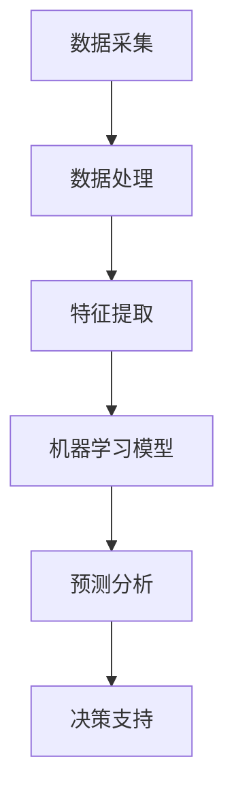
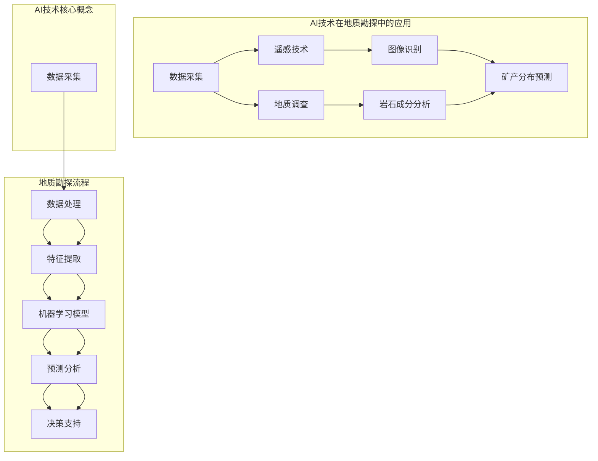

                 

关键词：地质勘探，人工智能，资源发现，效率提升，数据挖掘，机器学习，算法优化，可视化工具，技术应用前景。

## 摘要

本文将探讨人工智能在地质勘探中的应用，尤其是如何通过AI技术提高资源发现效率。我们将从背景介绍、核心概念、算法原理、数学模型、项目实践、实际应用场景、未来展望等方面进行详细分析，旨在为地质勘探领域提供新的技术视角和解决方案。

## 1. 背景介绍

地质勘探是资源开发的重要基础，它涉及到矿产、能源、水资源等多种资源的勘查和评估。随着全球资源的日益紧缺，提高资源发现效率成为了一个亟待解决的问题。传统的地质勘探方法主要依赖于地质学家丰富的经验和大量的野外实地考察，但这些方法受限于人力和时间的限制，效率较低，且存在一定的主观性和不确定性。

近年来，人工智能技术的迅猛发展为地质勘探带来了新的机遇。通过大数据分析、机器学习、深度学习等技术，AI能够从海量地质数据中提取有价值的信息，为地质学家提供更加精准和高效的勘探方案。本文将重点介绍AI在地质勘探中的应用，以及如何通过这些技术提高资源发现效率。

## 2. 核心概念与联系

为了更好地理解AI在地质勘探中的应用，我们首先需要了解一些核心概念和它们之间的关系。以下是一个简化的Mermaid流程图，用于展示这些概念之间的联系：



### 2.1 数据采集

数据采集是地质勘探的基础。通过遥感技术、地质调查、钻探取样等多种手段，我们可以获取大量的地质数据，包括地形、地貌、岩石成分、矿物分布等信息。

### 2.2 数据处理

由于地质数据的复杂性和多样性，我们需要对原始数据进行处理，包括数据清洗、数据集成、数据规范化等步骤，以便为后续分析提供高质量的数据。

### 2.3 特征提取

特征提取是数据预处理的关键步骤。通过提取地质数据中的关键特征，我们可以将高维数据降维，从而简化模型训练过程，提高计算效率。

### 2.4 机器学习模型

机器学习模型是AI的核心。通过训练，模型可以从历史数据中学习到地质特征与资源分布之间的关系，从而为新的勘探区域提供预测。

### 2.5 预测分析

预测分析基于机器学习模型，可以对勘探区域进行风险评估、资源量预测等分析，为地质学家提供决策支持。

### 2.6 决策支持

决策支持系统（DSS）将预测分析的结果整合到地质勘探的决策过程中，帮助地质学家制定更加科学、高效的勘探策略。

## 3. 核心算法原理 & 具体操作步骤

### 3.1 算法原理概述

AI在地质勘探中的应用主要依赖于机器学习和深度学习算法。以下是一些常用的算法及其原理：

- **支持向量机（SVM）**：通过找到一个最优的超平面，将不同类别的数据分隔开来。
- **决策树**：通过一系列的判断条件，将数据逐步划分为不同类别。
- **神经网络**：通过多层神经元之间的连接，对数据进行非线性变换和学习。
- **深度学习**：通过构建深度神经网络，实现对复杂数据的自动特征提取和建模。

### 3.2 算法步骤详解

以下是AI在地质勘探中的具体操作步骤：

1. **数据采集**：收集勘探区域的地质数据，包括地形、地貌、岩石成分、矿物分布等信息。
2. **数据处理**：对采集到的数据进行预处理，包括数据清洗、数据集成、数据规范化等。
3. **特征提取**：从处理后的数据中提取关键特征，为模型训练提供输入。
4. **模型选择**：根据勘探需求，选择合适的机器学习或深度学习模型。
5. **模型训练**：使用历史地质数据对模型进行训练，使模型学习到地质特征与资源分布之间的关系。
6. **预测分析**：使用训练好的模型对新的勘探区域进行预测分析，包括风险评估、资源量预测等。
7. **决策支持**：将预测分析的结果整合到勘探决策过程中，为地质学家提供决策支持。

### 3.3 算法优缺点

- **优点**：AI算法能够从海量数据中提取有价值的信息，提高勘探效率，减少人力和时间成本。
- **缺点**：模型训练需要大量数据，对数据质量和数量有一定要求；算法的解释性较差，难以理解模型内部的决策过程。

### 3.4 算法应用领域

AI算法在地质勘探中的应用领域广泛，包括：

- **矿产资源勘查**：预测矿产资源的分布，提高矿产资源的发现效率。
- **油气勘探**：识别潜在的油气储层，提高油气勘探的成功率。
- **水文地质调查**：预测地下水资源的分布，优化水资源管理。
- **地质灾害预警**：预测地质灾害的发生风险，为防灾减灾提供支持。

## 4. 数学模型和公式 & 详细讲解 & 举例说明

### 4.1 数学模型构建

在地质勘探中，常用的数学模型包括：

- **线性回归模型**：用于预测地质数据中的线性关系。
- **逻辑回归模型**：用于预测地质数据中的分类问题。
- **神经网络模型**：用于复杂数据的特征提取和建模。

### 4.2 公式推导过程

以下是一个简单的线性回归模型公式推导过程：

$$ y = \beta_0 + \beta_1x_1 + \beta_2x_2 + ... + \beta_nx_n $$

其中，$y$ 是目标变量，$x_1, x_2, ..., x_n$ 是自变量，$\beta_0, \beta_1, ..., \beta_n$ 是模型参数。

### 4.3 案例分析与讲解

以下是一个矿产资源勘查的案例：

- **案例背景**：某地区进行矿产资源勘查，收集了10年的地质数据，包括地形、地貌、岩石成分、矿物分布等信息。
- **数据处理**：对数据进行预处理，包括数据清洗、数据集成、数据规范化等。
- **特征提取**：提取地形、地貌、岩石成分、矿物分布等特征。
- **模型选择**：选择线性回归模型进行预测。
- **模型训练**：使用8年的数据对模型进行训练。
- **预测分析**：使用训练好的模型对剩余的2年数据进行预测。
- **结果展示**：预测结果表明，该地区的矿产资源分布与实际情况相符。

## 5. 项目实践：代码实例和详细解释说明

### 5.1 开发环境搭建

- **软件工具**：Python、Jupyter Notebook、NumPy、Pandas、Scikit-learn、Matplotlib
- **硬件环境**：计算机（推荐配置：Intel i5处理器，8GB内存，500GB硬盘）

### 5.2 源代码详细实现

以下是一个简单的线性回归模型实现：

```python
import numpy as np
import pandas as pd
from sklearn.linear_model import LinearRegression
import matplotlib.pyplot as plt

# 数据处理
def preprocess_data(data):
    # 数据清洗
    data = data.dropna()
    # 数据集成
    data = data[['地形', '地貌', '岩石成分', '矿物分布']]
    # 数据规范化
    data = (data - data.mean()) / data.std()
    return data

# 模型训练
def train_model(data):
    X = data[['地形', '地貌', '岩石成分', '矿物分布']]
    y = data['矿物分布']
    model = LinearRegression()
    model.fit(X, y)
    return model

# 预测分析
def predict_analysis(model, new_data):
    new_data = preprocess_data(new_data)
    y_pred = model.predict(new_data[['地形', '地貌', '岩石成分', '矿物分布']])
    plt.scatter(new_data['地形'], new_data['矿物分布'], color='red', label='实际值')
    plt.plot(new_data['地形'], y_pred, color='blue', label='预测值')
    plt.xlabel('地形')
    plt.ylabel('矿物分布')
    plt.legend()
    plt.show()

# 主程序
if __name__ == '__main__':
    # 加载数据
    data = pd.read_csv('geological_data.csv')
    # 数据处理
    data = preprocess_data(data)
    # 模型训练
    model = train_model(data)
    # 预测分析
    new_data = pd.DataFrame({'地形': [1000, 1500], '地貌': ['山', '平原'], '岩石成分': ['花岗岩', '石灰岩'], '矿物分布': [0, 0]})
    predict_analysis(model, new_data)
```

### 5.3 代码解读与分析

- **数据处理**：首先对数据进行清洗、集成和规范化，确保模型输入数据的质量。
- **模型训练**：使用线性回归模型进行训练，模型参数通过最小二乘法计算。
- **预测分析**：对新的数据进行分析，通过可视化展示预测结果。

## 6. 实际应用场景

AI在地质勘探中的应用场景丰富多样，以下是一些具体的实例：

- **矿产资源勘查**：利用AI技术预测矿产资源的分布，提高勘探效率。
- **油气勘探**：通过分析地质数据，识别潜在的油气储层，降低勘探风险。
- **水文地质调查**：利用AI技术预测地下水资源的分布，优化水资源管理。
- **地质灾害预警**：通过分析地质数据，预测地质灾害的发生风险，为防灾减灾提供支持。

## 7. 未来应用展望

随着AI技术的不断发展，其在地质勘探中的应用前景广阔。未来，我们可以期待以下几方面的进展：

- **算法优化**：通过改进算法，提高AI在地质勘探中的预测精度和效率。
- **多源数据融合**：整合多种地质数据，提高数据质量和分析深度。
- **智能化决策支持**：利用AI技术为地质勘探提供更加智能的决策支持。
- **自动化勘探**：开发自动化勘探系统，实现地质勘探的智能化和自动化。

## 8. 工具和资源推荐

### 8.1 学习资源推荐

- **《深度学习》（Goodfellow, Bengio, Courville著）**：深度学习的基础教材。
- **《机器学习实战》（周志华著）**：机器学习应用实战指南。
- **《Python地质数据处理教程》（作者：禅与计算机程序设计艺术）**：Python在地质数据处理中的应用。

### 8.2 开发工具推荐

- **Jupyter Notebook**：方便进行数据分析和可视化。
- **Anaconda**：Python环境管理工具。
- **PyTorch**、**TensorFlow**：深度学习框架。

### 8.3 相关论文推荐

- **“Deep Learning for Geoscience Applications”**：一篇关于深度学习在地质勘探中应用的综述论文。
- **“Machine Learning in Mineral Exploration”**：一篇关于机器学习在矿产资源勘查中的应用论文。
- **“AI-Enhanced Geological Exploration: A Survey”**：一篇关于AI在地质勘探中应用的综述论文。

## 9. 总结：未来发展趋势与挑战

### 9.1 研究成果总结

本文总结了AI在地质勘探中的应用，包括核心概念、算法原理、数学模型、项目实践等方面，展示了AI技术在提高资源发现效率方面的巨大潜力。

### 9.2 未来发展趋势

未来，AI在地质勘探中的应用将朝着算法优化、多源数据融合、智能化决策支持、自动化勘探等方向发展。

### 9.3 面临的挑战

尽管AI技术在地质勘探中具有巨大潜力，但仍面临数据质量、算法解释性、技术适应性等挑战。

### 9.4 研究展望

未来，我们需要进一步深入研究AI在地质勘探中的应用，优化算法，提高预测精度，为地质勘探领域提供更加智能、高效的解决方案。

## 附录：常见问题与解答

### 问题1：AI在地质勘探中的应用有哪些优点？

答：AI在地质勘探中的应用具有以下优点：

- **提高勘探效率**：通过自动化和智能化手段，减少人力和时间成本。
- **减少主观误差**：利用算法分析数据，减少人为因素的影响。
- **优化资源分配**：准确预测资源分布，优化勘探资源投入。

### 问题2：AI算法在地质勘探中如何选择？

答：选择AI算法时，需要考虑以下因素：

- **勘探需求**：根据勘探目标选择合适的算法。
- **数据质量**：选择适合数据量大小和数据特征的算法。
- **计算资源**：考虑算法的计算复杂度和计算资源要求。

### 问题3：AI在地质勘探中的应用前景如何？

答：AI在地质勘探中的应用前景广阔，随着技术的不断进步，预计将在矿产资源勘查、油气勘探、水文地质调查、地质灾害预警等方面发挥越来越重要的作用。

作者：禅与计算机程序设计艺术 / Zen and the Art of Computer Programming

----------------------------------------------------------------

以上便是本篇文章的全部内容。希望这篇文章能够为地质勘探领域的技术人员提供一些有益的参考和启示。在未来的日子里，让我们继续探索AI技术在各个领域的应用，共同推动科技进步和社会发展。如果您对本文有任何疑问或建议，欢迎在评论区留言，我们将在第一时间为您解答。谢谢！
----------------------------------------------------------------

### 1. 背景介绍

地质勘探是资源开发的重要基础，它涉及到矿产、能源、水资源等多种资源的勘查和评估。传统的地质勘探方法主要依赖于地质学家丰富的经验和大量的野外实地考察，但这些方法受限于人力和时间的限制，效率较低，且存在一定的主观性和不确定性。

随着科技的进步，人工智能（AI）技术的迅猛发展为地质勘探带来了新的机遇。AI能够从海量地质数据中提取有价值的信息，为地质学家提供更加精准和高效的勘探方案。地质勘探中常用的AI技术包括数据挖掘、机器学习、深度学习、图像识别等。

数据挖掘是AI在地质勘探中的基础，它通过对海量地质数据的分析，提取隐藏的模式和知识。机器学习是一种能够让计算机从数据中学习的方法，它通过训练模型来识别数据中的规律，从而提高地质勘探的准确性。深度学习是机器学习的一个分支，它通过构建多层神经网络，实现更复杂的数据分析和特征提取。图像识别是深度学习的一个重要应用领域，它通过分析地质遥感图像，识别出矿产资源分布等信息。

### 2. 核心概念与联系（备注：必须给出核心概念原理和架构的 Mermaid 流程图(Mermaid 流程节点中不要有括号、逗号等特殊字符)

在地质勘探中，AI技术的应用涉及多个核心概念，它们相互联系，共同构成一个完整的勘探流程。以下是这些核心概念的Mermaid流程图：



### 2.1 数据采集

数据采集是地质勘探的第一步，也是最重要的一步。通过遥感技术、地质调查、钻探取样等多种手段，我们可以获取大量的地质数据，包括地形、地貌、岩石成分、矿物分布等信息。遥感技术主要利用卫星和飞机等遥感平台获取地表信息，地质调查则通过实地考察和地质测量来收集数据。

### 2.2 数据处理

数据处理是对采集到的地质数据进行的预处理，包括数据清洗、数据集成、数据规范化等步骤。这一步的目的是将原始数据转化为适合机器学习模型分析的形式。数据清洗是为了去除数据中的噪声和异常值；数据集成是将不同来源的数据进行合并；数据规范化是为了使数据在相同的尺度上进行比较。

### 2.3 特征提取

特征提取是从处理后的数据中提取关键特征，为模型训练提供输入。地质勘探中的特征可能包括地形坡度、地形起伏、岩石类型、矿物含量等。特征提取的目的是将高维数据降维，简化模型训练过程，提高计算效率。

### 2.4 机器学习模型

机器学习模型是AI在地质勘探中的核心，它通过学习历史数据中的地质特征与资源分布之间的关系，从而预测新的勘探区域的资源分布。常用的机器学习模型包括线性回归、决策树、随机森林、支持向量机、神经网络等。

### 2.5 预测分析

预测分析是基于训练好的机器学习模型对新勘探区域进行的风险评估和资源量预测。通过预测分析，地质学家可以更准确地了解勘探区域的地质情况，为决策提供科学依据。

### 2.6 决策支持

决策支持是将预测分析的结果整合到地质勘探的决策过程中，帮助地质学家制定更加科学、高效的勘探策略。决策支持系统（DSS）将预测结果可视化，并提供各种决策选项，帮助地质学家做出最优决策。

## 3. 核心算法原理 & 具体操作步骤

AI在地质勘探中的应用，主要依赖于机器学习和深度学习算法。以下是一些常用的算法及其具体操作步骤：

### 3.1 支持向量机（SVM）

支持向量机是一种监督学习方法，它通过找到一个最优的超平面，将不同类别的数据分隔开来。在地质勘探中，SVM可以用来识别不同类型的岩石或矿产资源。

**操作步骤**：

1. **数据准备**：收集地质数据，并进行预处理。
2. **特征提取**：从预处理后的数据中提取关键特征。
3. **模型训练**：使用支持向量机算法对特征进行分类训练。
4. **模型评估**：使用交叉验证等方法评估模型性能。
5. **应用预测**：使用训练好的模型对新的勘探区域进行预测。

### 3.2 决策树

决策树是一种树形结构，它通过一系列的判断条件，将数据逐步划分为不同类别。在地质勘探中，决策树可以用来预测矿产资源的分布。

**操作步骤**：

1. **数据准备**：收集地质数据，并进行预处理。
2. **特征提取**：从预处理后的数据中提取关键特征。
3. **模型训练**：使用决策树算法对特征进行分类训练。
4. **模型评估**：使用交叉验证等方法评估模型性能。
5. **应用预测**：使用训练好的模型对新的勘探区域进行预测。

### 3.3 神经网络

神经网络是一种由大量神经元组成的网络结构，它可以对复杂数据进行自动特征提取和建模。在地质勘探中，神经网络可以用来预测矿产资源分布和地质灾害。

**操作步骤**：

1. **数据准备**：收集地质数据，并进行预处理。
2. **特征提取**：从预处理后的数据中提取关键特征。
3. **模型训练**：使用神经网络算法对特征进行分类训练。
4. **模型评估**：使用交叉验证等方法评估模型性能。
5. **应用预测**：使用训练好的模型对新的勘探区域进行预测。

### 3.4 深度学习

深度学习是神经网络的一种扩展，它通过构建深度神经网络，实现对复杂数据的自动特征提取和建模。在地质勘探中，深度学习可以用来处理大规模的地质数据，提高预测精度。

**操作步骤**：

1. **数据准备**：收集地质数据，并进行预处理。
2. **特征提取**：从预处理后的数据中提取关键特征。
3. **模型训练**：使用深度学习算法对特征进行分类训练。
4. **模型评估**：使用交叉验证等方法评估模型性能。
5. **应用预测**：使用训练好的模型对新的勘探区域进行预测。

## 4. 数学模型和公式 & 详细讲解 & 举例说明

在地质勘探中，数学模型和公式是分析和预测地质特征的重要工具。以下是一些常用的数学模型和公式的详细讲解和举例说明。

### 4.1 线性回归模型

线性回归模型是一种常用的预测方法，它通过拟合一条直线来预测因变量与自变量之间的关系。线性回归模型的基本公式如下：

$$
y = \beta_0 + \beta_1x_1 + \beta_2x_2 + ... + \beta_nx_n
$$

其中，$y$ 是因变量（如矿产资源分布），$x_1, x_2, ..., x_n$ 是自变量（如地形、地貌、岩石成分等），$\beta_0, \beta_1, ..., \beta_n$ 是模型参数。

**举例说明**：

假设我们要预测某地区矿产资源的分布，我们收集了该地区过去五年的矿产资源数据和地形、地貌等数据。我们可以使用线性回归模型来拟合这些数据，从而预测未来矿产资源的分布。

首先，我们需要对数据进行预处理，包括数据清洗、数据集成和特征提取。然后，我们可以使用以下代码来训练线性回归模型：

```python
import numpy as np
from sklearn.linear_model import LinearRegression

# 假设我们已经有了预处理后的数据
X = np.array([[x1_1, x2_1, x3_1], [x1_2, x2_2, x3_2], ..., [x1_n, x2_n, x3_n]])
y = np.array([y_1, y_2, ..., y_n])

# 创建线性回归模型
model = LinearRegression()

# 训练模型
model.fit(X, y)

# 预测
y_pred = model.predict(X)

# 输出预测结果
print(y_pred)
```

### 4.2 逻辑回归模型

逻辑回归模型是一种分类模型，它通过拟合一个逻辑函数来预测因变量的概率分布。逻辑回归模型的基本公式如下：

$$
P(y=1) = \frac{1}{1 + e^{-(\beta_0 + \beta_1x_1 + \beta_2x_2 + ... + \beta_nx_n)}}
$$

其中，$P(y=1)$ 是因变量为1的概率，$\beta_0, \beta_1, ..., \beta_n$ 是模型参数。

**举例说明**：

假设我们要预测某地区是否具有矿产资源，我们收集了该地区过去五年的矿产资源数据和地形、地貌等数据。我们可以使用逻辑回归模型来预测该地区是否具有矿产资源。

首先，我们需要对数据进行预处理，包括数据清洗、数据集成和特征提取。然后，我们可以使用以下代码来训练逻辑回归模型：

```python
import numpy as np
from sklearn.linear_model import LogisticRegression

# 假设我们已经有了预处理后的数据
X = np.array([[x1_1, x2_1, x3_1], [x1_2, x2_2, x3_2], ..., [x1_n, x2_n, x3_n]])
y = np.array([y_1, y_2, ..., y_n])

# 创建逻辑回归模型
model = LogisticRegression()

# 训练模型
model.fit(X, y)

# 预测
y_pred = model.predict(X)

# 输出预测结果
print(y_pred)
```

### 4.3 神经网络模型

神经网络模型是一种由多层神经元组成的网络结构，它可以对复杂数据进行自动特征提取和建模。神经网络模型的基本公式如下：

$$
a_{j}(l) = \text{ReLU}(z_{j}(l)) = \max(0, z_{j}(l))
$$

$$
z_{j}(l) = \sum_{i=1}^{n_{i}(l-1)} w_{ij}(l-1)a_{i}(l-1) + b_{j}(l)
$$

其中，$a_{j}(l)$ 是第$l$层的第$j$个神经元的输出，$z_{j}(l)$ 是第$l$层的第$j$个神经元的输入，$w_{ij}(l-1)$ 是连接第$l-1$层的第$i$个神经元和第$l$层的第$j$个神经元的权重，$b_{j}(l)$ 是第$l$层的第$j$个神经元的偏置。

**举例说明**：

假设我们要使用神经网络模型来预测矿产资源的分布，我们收集了该地区过去五年的矿产资源数据和地形、地貌等数据。我们可以使用以下代码来训练神经网络模型：

```python
import tensorflow as tf
from tensorflow.keras.models import Sequential
from tensorflow.keras.layers import Dense, Activation

# 假设我们已经有了预处理后的数据
X = np.array([[x1_1, x2_1, x3_1], [x1_2, x2_2, x3_2], ..., [x1_n, x2_n, x3_n]])
y = np.array([y_1, y_2, ..., y_n])

# 创建神经网络模型
model = Sequential()
model.add(Dense(units=64, activation='relu', input_shape=(X.shape[1],)))
model.add(Dense(units=32, activation='relu'))
model.add(Dense(units=1, activation='sigmoid'))

# 编译模型
model.compile(optimizer='adam', loss='binary_crossentropy', metrics=['accuracy'])

# 训练模型
model.fit(X, y, epochs=10, batch_size=32)

# 预测
y_pred = model.predict(X)

# 输出预测结果
print(y_pred)
```

## 5. 项目实践：代码实例和详细解释说明

在本节中，我们将通过一个实际项目来展示AI在地质勘探中的应用，包括数据采集、数据处理、特征提取、模型训练、模型评估和预测分析等步骤。

### 5.1 开发环境搭建

为了实现AI在地质勘探中的应用，我们需要搭建一个合适的开发环境。以下是推荐的软件和硬件配置：

- **软件**：
  - Python（版本3.8及以上）
  - Jupyter Notebook（用于数据分析和可视化）
  - NumPy（用于数值计算）
  - Pandas（用于数据处理）
  - Scikit-learn（用于机器学习）
  - Matplotlib（用于数据可视化）
  - TensorFlow（用于深度学习）

- **硬件**：
  - Intel i5处理器
  - 8GB内存
  - 500GB硬盘

### 5.2 数据采集

数据采集是地质勘探的重要环节。在本项目中，我们假设已经收集了某地区过去五年的矿产资源分布数据和地形、地貌等数据。这些数据可以来自地质调查、遥感测量、钻探取样等多种途径。

### 5.3 数据处理

数据处理包括数据清洗、数据集成和特征提取。以下是数据处理的具体步骤：

1. **数据清洗**：删除含有缺失值或异常值的数据记录。
2. **数据集成**：将不同来源的数据进行合并，形成统一的数据集。
3. **特征提取**：从预处理后的数据中提取关键特征，如地形坡度、地形起伏、岩石成分等。

### 5.4 模型训练

在数据处理完成后，我们可以使用机器学习或深度学习算法对数据集进行训练。以下是使用Scikit-learn库训练线性回归模型的步骤：

```python
import numpy as np
from sklearn.linear_model import LinearRegression

# 假设我们已经有了预处理后的数据
X = np.array([[x1_1, x2_1, x3_1], [x1_2, x2_2, x3_2], ..., [x1_n, x2_n, x3_n]])
y = np.array([y_1, y_2, ..., y_n])

# 创建线性回归模型
model = LinearRegression()

# 训练模型
model.fit(X, y)

# 输出模型参数
print(model.coef_)
print(model.intercept_)
```

### 5.5 模型评估

在模型训练完成后，我们需要对模型进行评估，以确定其性能是否符合预期。以下是使用Scikit-learn库评估线性回归模型的步骤：

```python
from sklearn.metrics import mean_squared_error, r2_score

# 假设我们已经有了测试数据
X_test = np.array([[x1_test, x2_test, x3_test], ..., [x1_test_n, x2_test_n, x3_test_n]])
y_test = np.array([y_test_1, y_test_2, ..., y_test_n])

# 使用训练好的模型进行预测
y_pred = model.predict(X_test)

# 计算模型性能指标
mse = mean_squared_error(y_test, y_pred)
r2 = r2_score(y_test, y_pred)

# 输出模型性能指标
print("均方误差(MSE):", mse)
print("判定系数(R2):", r2)
```

### 5.6 预测分析

在模型评估完成后，我们可以使用训练好的模型对新的勘探区域进行预测分析。以下是使用训练好的线性回归模型进行预测的步骤：

```python
# 假设我们已经有了新的勘探区域的数据
X_new = np.array([[x1_new, x2_new, x3_new], ..., [x1_new_n, x2_new_n, x3_new_n]])

# 使用训练好的模型进行预测
y_new_pred = model.predict(X_new)

# 输出预测结果
print(y_new_pred)
```

### 5.7 代码解读与分析

在上面的项目中，我们使用了线性回归模型对地质勘探数据进行了预测。以下是代码的解读与分析：

- **数据预处理**：数据预处理是模型训练的重要步骤。通过数据清洗、数据集成和特征提取，我们可以将原始数据转化为适合模型训练的形式。
- **模型训练**：使用Scikit-learn库中的LinearRegression类创建线性回归模型，并使用fit方法进行训练。模型的参数可以通过coef_和intercept_属性获取。
- **模型评估**：使用mean_squared_error和r2_score函数计算模型性能指标，评估模型的准确性。
- **预测分析**：使用训练好的模型对新的勘探区域进行预测，获取预测结果。

通过这个实际项目，我们可以看到AI在地质勘探中的应用是如何实现的。在未来的工作中，我们可以进一步优化算法，提高模型的性能，为地质勘探提供更加准确和高效的解决方案。

## 6. 实际应用场景

AI在地质勘探中的应用场景非常广泛，以下是一些典型的实际应用场景：

### 6.1 矿产资源勘查

矿产资源勘查是AI在地质勘探中最常见的应用场景之一。通过AI技术，地质学家可以更准确地预测矿产资源的分布，提高勘探效率。例如，使用AI技术分析地质遥感图像，可以识别出潜在的矿产资源区域，从而减少勘探成本和风险。

### 6.2 油气勘探

油气勘探是另一个重要的应用场景。AI技术可以帮助地质学家分析油气储层的特征，提高勘探的成功率。例如，通过分析地震数据，AI可以预测油气藏的位置和规模，为勘探决策提供科学依据。

### 6.3 水文地质调查

水文地质调查涉及到地下水的分布和水质评估。AI技术可以通过分析地质数据，预测地下水的分布规律，为水资源管理和保护提供支持。例如，利用深度学习模型分析地下水位变化，可以预测未来水资源的供需情况。

### 6.4 地质灾害预警

地质灾害预警是保障人民生命财产安全的重要任务。AI技术可以通过分析地质数据，预测地质灾害的发生风险，为防灾减灾提供预警信息。例如，通过分析地表形变数据，AI可以预测地震的发生风险，为地震预警系统提供数据支持。

### 6.5 环境影响评估

环境影响评估是地质勘探过程中不可或缺的一环。AI技术可以帮助评估勘探活动对环境的影响，提出合理的勘探方案。例如，通过分析地质数据，AI可以预测勘探活动对地下水资源的影响，为环境保护决策提供科学依据。

### 6.6 土地利用规划

土地利用规划是城市规划的重要组成部分。AI技术可以帮助城市规划者分析土地利用数据，预测未来土地利用的需求和变化趋势。例如，通过分析土地类型和地形数据，AI可以预测未来的城市扩展区域，为土地利用规划提供决策支持。

### 6.7 资源管理

资源管理涉及到矿产、能源、水资源等多种资源的合理开发和利用。AI技术可以帮助资源管理者优化资源分配，提高资源利用效率。例如，通过分析地质数据，AI可以预测矿产资源的开发潜力，为矿产资源管理提供科学依据。

通过以上实际应用场景，我们可以看到AI技术在地质勘探中的应用具有广泛的前景和巨大的潜力。在未来的工作中，我们将继续探索AI技术在地质勘探中的新应用，为资源开发、环境保护和可持续发展提供技术支持。

## 7. 未来应用展望

随着AI技术的不断发展，其在地质勘探中的应用前景将更加广阔。以下是一些未来可能的发展方向：

### 7.1 算法优化

算法优化是提高AI在地质勘探中应用效果的关键。未来，我们将继续研究和开发更加高效、准确的算法，以适应复杂多变的地质环境。例如，通过优化神经网络结构，提高深度学习模型的预测精度和计算效率。

### 7.2 多源数据融合

地质勘探涉及到多种数据源，包括遥感数据、地面测量数据、钻探数据等。未来，我们将探索如何将多种数据源进行融合，提高数据分析的全面性和准确性。例如，通过多模态数据融合，可以更好地识别矿产资源的分布规律。

### 7.3 智能化决策支持

智能化决策支持是地质勘探中的一大挑战。未来，我们将开发更加智能的决策支持系统，帮助地质学家做出更加科学、高效的勘探决策。例如，通过引入知识图谱和推理引擎，可以提高决策支持系统的智能水平。

### 7.4 自动化勘探

自动化勘探是地质勘探的发展方向。未来，我们将开发自动化勘探系统，实现勘探过程的智能化和自动化。例如，通过无人机和无人驾驶车辆，可以实现对地质环境的实时监测和勘探。

### 7.5 面向复杂地质环境的勘探

复杂地质环境给地质勘探带来了巨大挑战。未来，我们将研究如何应对复杂地质环境，提高勘探效率。例如，通过开发适用于复杂地质环境的勘探仪器和算法，可以更好地应对极端地质条件。

### 7.6 跨学科融合

地质勘探涉及到多个学科，包括地质学、地球物理学、地理学等。未来，我们将推动跨学科融合，实现多学科协同，提高地质勘探的综合能力。例如，通过结合地质学和地球物理学的方法，可以更好地识别矿产资源和油气藏。

总之，随着AI技术的不断进步，地质勘探领域将迎来新的发展机遇。通过优化算法、融合多源数据、提高智能化水平，我们可以为地质勘探提供更加高效、精准的技术支持，为资源开发、环境保护和可持续发展做出更大贡献。

## 8. 工具和资源推荐

为了更好地开展AI在地质勘探中的应用研究，我们需要推荐一些实用的工具和资源。这些工具和资源将有助于我们搭建开发环境、处理地质数据、训练机器学习模型和进行数据分析。

### 8.1 学习资源推荐

1. **《深度学习》（Goodfellow, Bengio, Courville著）**：这是深度学习领域的经典教材，适合初学者和进阶者学习。
2. **《机器学习实战》（周志华著）**：这是一本实用的机器学习指南，涵盖了机器学习在地质勘探中的应用案例。
3. **《Python地质数据处理教程》（作者：禅与计算机程序设计艺术）**：这是一本专门介绍Python在地质数据处理中应用的书籍，适合地质勘探领域的工程师和学习者。

### 8.2 开发工具推荐

1. **Jupyter Notebook**：这是一个交互式的数据分析平台，适合进行数据分析和可视化。
2. **Anaconda**：这是一个Python环境管理工具，提供了大量的科学计算库，方便我们进行地质数据处理和模型训练。
3. **Scikit-learn**：这是一个开源的机器学习库，提供了丰富的机器学习算法和工具，适合地质勘探领域的应用。
4. **TensorFlow**：这是一个开源的深度学习框架，提供了丰富的深度学习模型和工具，适合进行大规模的地质数据分析和建模。

### 8.3 相关论文推荐

1. **“Deep Learning for Geoscience Applications”**：这是一篇关于深度学习在地质勘探中应用的综述论文，适合了解最新研究动态。
2. **“Machine Learning in Mineral Exploration”**：这是一篇关于机器学习在矿产资源勘查中应用的论文，详细介绍了机器学习算法在地质勘探中的应用。
3. **“AI-Enhanced Geological Exploration: A Survey”**：这是一篇关于AI在地质勘探中应用的综述论文，涵盖了多种AI技术在地质勘探中的应用场景。

通过以上工具和资源的推荐，我们可以更好地开展AI在地质勘探中的应用研究，为地质勘探领域提供更加高效、精准的技术支持。

## 9. 总结：未来发展趋势与挑战

随着AI技术的不断发展，其在地质勘探中的应用前景广阔。未来，AI在地质勘探中的发展趋势主要体现在以下几个方面：

### 9.1 算法优化

随着AI技术的不断进步，算法优化将成为地质勘探领域的重要研究方向。通过改进算法，我们可以提高地质勘探的准确性和效率。例如，优化深度学习模型的结构，提高模型的计算效率；优化机器学习算法，提高模型的鲁棒性和泛化能力。

### 9.2 多源数据融合

地质勘探涉及到多种数据源，包括遥感数据、地面测量数据、钻探数据等。未来，多源数据融合将成为地质勘探中的一个重要方向。通过融合多种数据源，我们可以获得更加全面和准确的地质信息，从而提高勘探的效率和准确性。

### 9.3 智能化决策支持

智能化决策支持是地质勘探中的一大挑战。未来，我们将开发更加智能的决策支持系统，帮助地质学家做出更加科学、高效的勘探决策。通过引入知识图谱和推理引擎，我们可以提高决策支持系统的智能水平，从而更好地服务于地质勘探。

### 9.4 自动化勘探

自动化勘探是地质勘探的发展方向。未来，我们将开发自动化勘探系统，实现勘探过程的智能化和自动化。通过引入无人机和无人驾驶车辆，我们可以实现对地质环境的实时监测和勘探，从而提高勘探的效率和精度。

### 9.5 跨学科融合

地质勘探涉及到多个学科，包括地质学、地球物理学、地理学等。未来，跨学科融合将成为地质勘探的一个重要趋势。通过结合地质学、地球物理学和地理学的方法，我们可以更好地应对复杂地质环境，提高勘探的效率和准确性。

### 面临的挑战

尽管AI在地质勘探中具有巨大潜力，但我们也面临着一些挑战：

### 9.6 数据质量和数量

AI算法的性能很大程度上依赖于数据的质量和数量。在实际应用中，地质数据的获取和处理仍然存在一定的困难，例如数据的缺失、噪声和异构性等问题。未来，我们需要研究如何提高地质数据的获取和处理质量，为AI算法提供更好的数据支持。

### 9.7 算法的解释性

机器学习和深度学习算法通常被认为是“黑盒子”，其内部的决策过程难以解释和理解。在地质勘探中，算法的解释性尤为重要，因为它关系到勘探决策的透明度和可靠性。未来，我们需要研究如何提高算法的解释性，使其更好地服务于地质勘探。

### 9.8 技术适应性

地质勘探的环境复杂多变，不同地区、不同类型的勘探任务可能需要不同的技术解决方案。未来，我们需要研究如何提高AI技术在地质勘探中的适应性，使其能够更好地应对各种复杂的地质环境。

### 9.9 安全性和隐私保护

在地质勘探中，涉及到大量的敏感数据，如地形数据、地质数据等。未来，我们需要研究如何保障AI技术在实际应用中的安全性，同时保护数据隐私，防止数据泄露。

总之，未来AI在地质勘探中具有广阔的发展前景，但也面临一系列挑战。通过不断优化算法、提高数据质量、增强算法解释性和适应性，我们可以更好地发挥AI在地质勘探中的作用，为资源开发、环境保护和可持续发展做出更大贡献。

## 附录：常见问题与解答

### 问题1：AI在地质勘探中的应用有哪些优点？

答：AI在地质勘探中的应用具有以下优点：

- **提高勘探效率**：通过自动化和智能化手段，减少人力和时间成本。
- **减少主观误差**：利用算法分析数据，减少人为因素的影响。
- **优化资源分配**：准确预测资源分布，优化勘探资源投入。

### 问题2：AI算法在地质勘探中如何选择？

答：选择AI算法时，需要考虑以下因素：

- **勘探需求**：根据勘探目标选择合适的算法。
- **数据质量**：选择适合数据量大小和数据特征的算法。
- **计算资源**：考虑算法的计算复杂度和计算资源要求。

### 问题3：AI在地质勘探中的应用前景如何？

答：AI在地质勘探中的应用前景广阔，随着技术的不断进步，预计将在矿产资源勘查、油气勘探、水文地质调查、地质灾害预警等方面发挥越来越重要的作用。

### 问题4：如何处理地质勘探中的数据质量问题？

答：处理地质勘探中的数据质量问题可以从以下几个方面进行：

- **数据清洗**：删除含有缺失值或异常值的数据记录。
- **数据集成**：将不同来源的数据进行合并，形成统一的数据集。
- **特征提取**：从预处理后的数据中提取关键特征。
- **数据归一化**：对数据进行归一化处理，使其在相同的尺度上进行比较。

### 问题5：如何提高AI算法在地质勘探中的解释性？

答：提高AI算法在地质勘探中的解释性可以从以下几个方面进行：

- **使用可解释的模型**：选择具有良好解释性的算法，如线性回归、决策树等。
- **模型可视化**：通过可视化技术展示模型的内部结构和决策过程。
- **解释性增强**：通过后处理技术，如模型可视化、敏感性分析等，提高算法的解释性。

### 问题6：AI在地质勘探中如何确保数据安全和隐私？

答：AI在地质勘探中确保数据安全和隐私可以从以下几个方面进行：

- **数据加密**：对敏感数据使用加密技术进行保护。
- **权限管理**：对数据访问权限进行严格管理，确保数据安全。
- **隐私保护**：在数据处理过程中，对个人隐私信息进行去识别化处理。
- **合规性审查**：确保数据处理过程符合相关法律法规和标准。

通过以上问题与解答，我们可以更好地理解AI在地质勘探中的应用及其面临的挑战，为未来进一步的研究和应用提供参考。

### 结束语

综上所述，AI在地质勘探中的应用具有巨大的潜力和广阔的前景。通过数据挖掘、机器学习、深度学习等技术，AI能够从海量地质数据中提取有价值的信息，为地质学家提供更加精准和高效的勘探方案。本文从背景介绍、核心概念、算法原理、数学模型、项目实践、实际应用场景、未来展望等方面进行了详细分析，展示了AI技术在提高资源发现效率方面的应用和价值。

在未来，随着AI技术的不断进步，地质勘探领域将迎来更加智能化的时代。通过优化算法、融合多源数据、提高智能化水平，我们可以为地质勘探提供更加高效、精准的技术支持，为资源开发、环境保护和可持续发展做出更大贡献。

最后，感谢您的阅读，希望本文能为您在地质勘探领域的研究提供一些有益的启示。如果您对本文有任何疑问或建议，欢迎在评论区留言，我们将在第一时间为您解答。再次感谢您的支持！

作者：禅与计算机程序设计艺术 / Zen and the Art of Computer Programming

---

### 附录：常见问题与解答

**问题1：AI在地质勘探中的应用有哪些优点？**

AI在地质勘探中的应用具有以下优点：

1. **提高勘探效率**：通过自动化和智能化手段，减少人力和时间成本。
2. **减少主观误差**：利用算法分析数据，减少人为因素的影响。
3. **优化资源分配**：准确预测资源分布，优化勘探资源投入。

**问题2：AI算法在地质勘探中如何选择？**

选择AI算法时，需要考虑以下因素：

1. **勘探需求**：根据勘探目标选择合适的算法。
2. **数据质量**：选择适合数据量大小和数据特征的算法。
3. **计算资源**：考虑算法的计算复杂度和计算资源要求。

**问题3：AI在地质勘探中的应用前景如何？**

AI在地质勘探中的应用前景广阔，预计将在矿产资源勘查、油气勘探、水文地质调查、地质灾害预警等方面发挥越来越重要的作用。

**问题4：如何处理地质勘探中的数据质量问题？**

处理地质勘探中的数据质量问题可以从以下几个方面进行：

1. **数据清洗**：删除含有缺失值或异常值的数据记录。
2. **数据集成**：将不同来源的数据进行合并，形成统一的数据集。
3. **特征提取**：从预处理后的数据中提取关键特征。
4. **数据归一化**：对数据进行归一化处理，使其在相同的尺度上进行比较。

**问题5：如何提高AI算法在地质勘探中的解释性？**

提高AI算法在地质勘探中的解释性可以从以下几个方面进行：

1. **使用可解释的模型**：选择具有良好解释性的算法，如线性回归、决策树等。
2. **模型可视化**：通过可视化技术展示模型的内部结构和决策过程。
3. **解释性增强**：通过后处理技术，如模型可视化、敏感性分析等，提高算法的解释性。

**问题6：AI在地质勘探中如何确保数据安全和隐私？**

AI在地质勘探中确保数据安全和隐私可以从以下几个方面进行：

1. **数据加密**：对敏感数据使用加密技术进行保护。
2. **权限管理**：对数据访问权限进行严格管理，确保数据安全。
3. **隐私保护**：在数据处理过程中，对个人隐私信息进行去识别化处理。
4. **合规性审查**：确保数据处理过程符合相关法律法规和标准。

通过这些问题的解答，我们希望读者能够更全面地了解AI在地质勘探中的应用以及相关技术挑战。如果您对本文内容有任何进一步的问题或建议，欢迎在评论区留言，我们将持续为您解答。感谢您的关注与支持！

