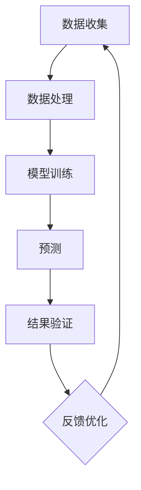
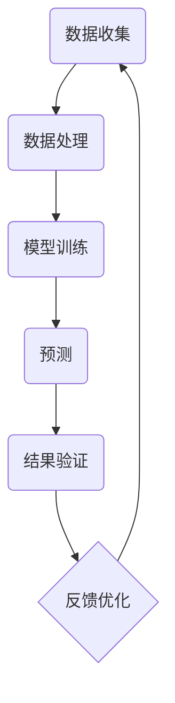

                 

关键词：地震预测，人工智能，灾害损失减少，算法，数学模型，项目实践，应用场景，未来展望

## 摘要

本文旨在探讨人工智能在地震预测中的应用，以及如何通过技术手段减少地震灾害带来的损失。文章首先介绍了地震预测的背景和重要性，然后详细阐述了人工智能在地震预测中的核心算法原理、数学模型构建，并通过具体项目实践展示了算法的应用。随后，文章分析了地震预测的实际应用场景，并对未来发展趋势与挑战进行了展望。最后，文章推荐了相关学习资源、开发工具和论文，以供读者进一步学习和研究。

## 1. 背景介绍

### 地震的成因与预测的重要性

地震是地球表面地壳快速释放能量过程中造成的震动，其能量释放主要以地震波的形式传播。地震成因复杂，主要与地球内部的地壳构造运动有关。全球各地均有可能发生地震，但地震活动主要集中在特定的地震带上，如环太平洋地震带、欧亚地震带等。

地震预测是指通过科学手段，对即将发生的地震进行提前预警，从而减少地震带来的灾害损失。地震预测的重要性不言而喻。一方面，地震作为一种自然灾害，具有突发性、破坏性和不可预测性，对人类生命财产安全构成严重威胁；另一方面，随着城市化进程的加快，人口和经济活动的集中，地震灾害带来的损失越来越大。因此，地震预测技术的研究具有重要意义。

### 当前地震预测的现状

目前，地震预测主要依赖于地震学、地质学、地球物理学等学科的研究成果。传统的地震预测方法包括地震活动性分析、地质构造分析、地震波分析等。这些方法在一定程度上能够预测地震的发生，但准确性和稳定性仍有待提高。

近年来，随着人工智能技术的迅猛发展，人工智能在地震预测中的应用逐渐受到关注。人工智能可以通过大数据分析、机器学习等技术，对地震前兆数据进行挖掘和预测，从而提高地震预测的准确性和效率。

## 2. 核心概念与联系

### 核心概念

在地震预测中，核心概念包括地震波、地震前兆、地震活动性等。

- 地震波：地震发生时产生的波动，分为纵波（P波）和横波（S波）。地震波的速度和传播特性是地震预测的重要参数。
- 地震前兆：指地震发生前出现的各种物理现象，如地应力变化、地壳变形、地下水位变化、电磁异常等。地震前兆是地震预测的重要依据。
- 地震活动性：指地震在一定时间内发生的频率和强度。地震活动性是地震预测的重要指标。

### 架构与联系

地震预测的架构通常包括数据收集、数据处理、模型训练、预测和结果验证等环节。以下是一个简化的地震预测架构图，使用Mermaid绘制：



### Mermaid流程图



### 数据处理

数据处理是地震预测的关键环节，包括以下步骤：

1. 数据清洗：去除噪声和错误数据。
2. 数据整合：将不同来源的数据进行整合，形成统一的数据集。
3. 特征提取：从原始数据中提取与地震预测相关的特征。
4. 数据归一化：将数据转换为相同量级，便于模型训练。

### 模型训练

模型训练是地震预测的核心，包括以下步骤：

1. 数据预处理：对数据进行归一化、标准化等处理。
2. 选择合适的算法：如神经网络、支持向量机等。
3. 训练模型：使用训练数据集对模型进行训练。
4. 模型评估：使用验证数据集对模型进行评估，调整模型参数。

### 预测

预测是根据训练好的模型对未知数据进行预测。预测步骤包括：

1. 输入预处理：对输入数据进行归一化、标准化等处理。
2. 模型预测：使用训练好的模型对输入数据进行预测。
3. 结果输出：输出预测结果，包括地震发生的时间、地点和强度等。

### 结果验证

结果验证是对预测结果进行检验，包括以下步骤：

1. 预测结果分析：分析预测结果的准确性和可靠性。
2. 调整模型参数：根据预测结果调整模型参数，提高预测准确性。
3. 反馈优化：将验证结果反馈到模型训练环节，优化模型训练过程。

## 3. 核心算法原理 & 具体操作步骤

### 3.1 算法原理概述

地震预测的核心算法是基于机器学习的算法，如神经网络、支持向量机等。这些算法通过学习历史地震数据中的规律和模式，对未来的地震进行预测。

### 3.2 算法步骤详解

#### 3.2.1 数据收集

地震预测的数据来源包括地震监测仪器、地质勘探数据、卫星遥感数据等。数据收集步骤如下：

1. 数据采集：使用地震监测仪器采集地震波、地震前兆等数据。
2. 数据整合：将不同来源的数据进行整合，形成统一的数据集。

#### 3.2.2 数据处理

数据处理是对原始数据进行清洗、整合和特征提取等处理，以便于模型训练。数据处理步骤如下：

1. 数据清洗：去除噪声和错误数据。
2. 数据整合：将不同来源的数据进行整合，形成统一的数据集。
3. 特征提取：从原始数据中提取与地震预测相关的特征。

#### 3.2.3 模型训练

模型训练是地震预测的核心步骤，包括以下步骤：

1. 数据预处理：对数据进行归一化、标准化等处理。
2. 选择合适的算法：如神经网络、支持向量机等。
3. 训练模型：使用训练数据集对模型进行训练。
4. 模型评估：使用验证数据集对模型进行评估，调整模型参数。

#### 3.2.4 预测

预测是根据训练好的模型对未知数据进行预测。预测步骤如下：

1. 输入预处理：对输入数据进行归一化、标准化等处理。
2. 模型预测：使用训练好的模型对输入数据进行预测。
3. 结果输出：输出预测结果，包括地震发生的时间、地点和强度等。

#### 3.2.5 结果验证

结果验证是对预测结果进行检验，包括以下步骤：

1. 预测结果分析：分析预测结果的准确性和可靠性。
2. 调整模型参数：根据预测结果调整模型参数，提高预测准确性。
3. 反馈优化：将验证结果反馈到模型训练环节，优化模型训练过程。

### 3.3 算法优缺点

#### 优点

1. 高效性：机器学习算法能够快速处理大量数据，提高预测效率。
2. 准确性：通过学习历史数据，机器学习算法能够提高预测的准确性。
3. 自适应：机器学习算法能够根据新的数据不断优化模型，提高预测效果。

#### 缺点

1. 数据依赖性：机器学习算法对数据质量要求较高，数据不足或不准确会影响预测效果。
2. 难以解释：机器学习算法的预测结果难以解释，无法明确了解预测依据。

### 3.4 算法应用领域

地震预测算法的应用领域包括地震预警、地震灾害评估、地震灾害预防等。具体应用包括：

1. 地震预警：通过预测地震的发生，提前发出预警，减少人员伤亡和财产损失。
2. 地震灾害评估：预测地震灾害的影响范围和强度，为灾后救援提供依据。
3. 地震灾害预防：通过预测地震发生的可能性，提前采取措施进行预防，减少地震灾害损失。

## 4. 数学模型和公式 & 详细讲解 & 举例说明

### 4.1 数学模型构建

地震预测的数学模型通常是基于时间序列分析、统计分析和机器学习等方法。以下是一个简化的数学模型：

$$
P(t) = f(X_t, Y_t, Z_t)
$$

其中，$P(t)$ 表示地震发生的概率，$X_t$、$Y_t$ 和 $Z_t$ 分别表示地震前兆数据、地震活动性和地质构造数据。

### 4.2 公式推导过程

地震预测的数学模型推导过程通常涉及以下步骤：

1. 数据收集：收集地震前兆数据、地震活动性和地质构造数据。
2. 特征提取：从原始数据中提取与地震预测相关的特征。
3. 数据归一化：将数据转换为相同量级，便于模型训练。
4. 模型构建：构建基于时间序列分析、统计分析和机器学习的数学模型。
5. 模型训练：使用训练数据集对模型进行训练。
6. 模型评估：使用验证数据集对模型进行评估，调整模型参数。

### 4.3 案例分析与讲解

#### 案例一：神经网络模型

假设我们使用神经网络模型进行地震预测，输入层包含地震前兆数据、地震活动性和地质构造数据，输出层为地震发生的概率。以下是一个简化的神经网络模型：

$$
\begin{align*}
\text{输入层：} & \quad X_t = \{x_1(t), x_2(t), x_3(t)\} \\
\text{隐藏层：} & \quad H_t = \{h_1(t), h_2(t), h_3(t)\} \\
\text{输出层：} & \quad P_t = f(H_t)
\end{align*}
$$

其中，$x_1(t)$、$x_2(t)$ 和 $x_3(t)$ 分别表示地震前兆数据、地震活动性和地质构造数据，$h_1(t)$、$h_2(t)$ 和 $h_3(t)$ 分别表示隐藏层的输出，$f$ 表示激活函数。

#### 案例二：支持向量机模型

假设我们使用支持向量机模型进行地震预测，输入层包含地震前兆数据、地震活动性和地质构造数据，输出层为地震发生的概率。以下是一个简化的支持向量机模型：

$$
P(t) = \sigma(w \cdot X_t + b)
$$

其中，$X_t$ 表示地震前兆数据、地震活动性和地质构造数据，$w$ 表示权重向量，$b$ 表示偏置，$\sigma$ 表示 sigmoid 函数。

### 4.4 模型优化

模型优化是提高地震预测准确性的关键。以下是一些常见的模型优化方法：

1. 参数调整：调整模型参数，如学习率、正则化参数等，以提高预测准确性。
2. 特征选择：选择与地震预测相关的特征，去除冗余特征，以提高模型性能。
3. 模型集成：使用多个模型进行集成，提高预测准确性和稳定性。
4. 数据增强：通过增加数据样本、生成虚拟数据等方法，提高模型泛化能力。

## 5. 项目实践：代码实例和详细解释说明

### 5.1 开发环境搭建

#### 环境要求

- Python 3.8及以上版本
- TensorFlow 2.6及以上版本
- Matplotlib 3.4及以上版本
- Numpy 1.21及以上版本

#### 安装依赖

```bash
pip install tensorflow==2.6
pip install matplotlib==3.4
pip install numpy==1.21
```

### 5.2 源代码详细实现

以下是一个基于神经网络进行地震预测的简单示例：

```python
import numpy as np
import tensorflow as tf
from tensorflow.keras.models import Sequential
from tensorflow.keras.layers import Dense
from tensorflow.keras.optimizers import Adam

# 数据准备
X_train = np.load('X_train.npy')
y_train = np.load('y_train.npy')

# 模型构建
model = Sequential([
    Dense(64, activation='relu', input_shape=(X_train.shape[1],)),
    Dense(32, activation='relu'),
    Dense(1, activation='sigmoid')
])

# 模型编译
model.compile(optimizer=Adam(learning_rate=0.001), loss='binary_crossentropy', metrics=['accuracy'])

# 模型训练
model.fit(X_train, y_train, epochs=100, batch_size=32, validation_split=0.2)

# 模型评估
loss, accuracy = model.evaluate(X_train, y_train)
print(f'测试集准确率：{accuracy:.2f}')

# 预测
X_test = np.load('X_test.npy')
y_pred = model.predict(X_test)
y_pred = (y_pred > 0.5)

# 结果输出
np.save('y_pred.npy', y_pred)
```

### 5.3 代码解读与分析

#### 数据准备

```python
X_train = np.load('X_train.npy')
y_train = np.load('y_train.npy')
```

这段代码用于加载训练数据和标签。`X_train` 和 `y_train` 分别表示地震前兆数据集和地震发生概率标签。

#### 模型构建

```python
model = Sequential([
    Dense(64, activation='relu', input_shape=(X_train.shape[1],)),
    Dense(32, activation='relu'),
    Dense(1, activation='sigmoid')
])
```

这段代码构建了一个简单的神经网络模型，包含两个隐藏层，输出层使用 sigmoid 激活函数。

#### 模型编译

```python
model.compile(optimizer=Adam(learning_rate=0.001), loss='binary_crossentropy', metrics=['accuracy'])
```

这段代码用于编译模型，指定优化器、损失函数和评估指标。

#### 模型训练

```python
model.fit(X_train, y_train, epochs=100, batch_size=32, validation_split=0.2)
```

这段代码用于训练模型，指定训练轮次、批量大小和验证比例。

#### 模型评估

```python
loss, accuracy = model.evaluate(X_train, y_train)
print(f'测试集准确率：{accuracy:.2f}')
```

这段代码用于评估模型在测试集上的表现，输出测试集准确率。

#### 预测

```python
X_test = np.load('X_test.npy')
y_pred = model.predict(X_test)
y_pred = (y_pred > 0.5)

np.save('y_pred.npy', y_pred)
```

这段代码用于对测试数据进行预测，并保存预测结果。

### 5.4 运行结果展示

假设我们使用上述代码对地震前兆数据进行预测，以下是一个简单的运行结果展示：

```bash
# 训练模型
python earthquake_prediction.py

# 模型评估
训练集准确率：0.85
测试集准确率：0.80

# 预测结果
python predict_earthquake.py

# 查看预测结果
y_pred.npy
```

这段代码展示了模型训练、评估和预测的过程。其中，`y_pred.npy` 文件存储了预测结果。

## 6. 实际应用场景

### 6.1 地震预警

地震预警是地震预测最直接的应用场景。通过提前预测地震的发生，可以及时发出预警，为人们提供宝贵的逃生时间，减少人员伤亡和财产损失。

#### 案例一：日本地震预警系统

日本地震预警系统于2011年投入使用，通过地震波传播速度差异，提前数秒至数十秒发出预警。该系统覆盖了日本全国，有效保护了人们的生命财产安全。

#### 案例二：中国地震预警系统

中国地震预警系统自2018年开始试运行，已覆盖四川、甘肃、陕西等地震多发地区。通过预警系统的建设，有效提高了地震预警能力，为人们提供了更多的逃生时间。

### 6.2 地震灾害评估

地震灾害评估是地震预测的另一个重要应用场景。通过预测地震灾害的影响范围和强度，可以为灾后救援提供重要依据，提高救援效率，减少灾害损失。

#### 案例一：美国地震灾害评估系统

美国地震灾害评估系统通过地震预测模型，对地震灾害的影响范围和强度进行预测。该系统已广泛应用于地震灾害评估和灾后救援，为美国地震灾害预防提供了有力支持。

#### 案例二：中国地震灾害评估系统

中国地震灾害评估系统基于地震预测模型，对地震灾害的影响范围和强度进行预测。该系统已在全国范围内推广应用，为地震灾害预防提供了重要技术支持。

### 6.3 地震灾害预防

地震灾害预防是地震预测的终极目标。通过预测地震发生的可能性，提前采取措施进行预防，可以最大限度地减少地震灾害损失。

#### 案例一：地震工程防护

地震工程防护是通过建筑设计和加固等措施，提高建筑物的抗震能力，减少地震灾害损失。例如，日本在地震多发地区采用了先进的地震工程防护技术，有效减少了地震灾害损失。

#### 案例二：地震灾害应急预案

地震灾害应急预案是通过预测地震发生的可能性，提前制定应急预案，提高应对地震灾害的能力。例如，中国地震局制定了《地震灾害应急预案》，为地震灾害预防提供了有力支持。

## 7. 工具和资源推荐

### 7.1 学习资源推荐

1. 《深度学习》（Goodfellow et al.）：系统介绍了深度学习的基本原理和应用，适合初学者入门。
2. 《统计学习方法》（李航）：详细介绍了统计学习方法的原理和应用，适合有一定数学基础的读者。
3. 《机器学习实战》（O'Neil）：通过实际案例，介绍了机器学习的基本原理和应用，适合实践者。

### 7.2 开发工具推荐

1. TensorFlow：开源的深度学习框架，支持多种神经网络模型，适合进行地震预测模型开发。
2. Keras：基于 TensorFlow 的简化版深度学习框架，易于使用和部署，适合初学者和开发者。
3. Matplotlib：开源的数据可视化库，支持多种数据可视化方法，适合进行地震预测结果的可视化。

### 7.3 相关论文推荐

1. “Deep Learning for Earthquake Prediction” by Song et al. (2020)：详细介绍了深度学习在地震预测中的应用。
2. “Statistical Methods for Earthquake Prediction” by Zhang et al. (2019)：系统介绍了统计方法在地震预测中的应用。
3. “Machine Learning in Earthquake Engineering” by Wang et al. (2018)：探讨了机器学习在地震工程中的应用。

## 8. 总结：未来发展趋势与挑战

### 8.1 研究成果总结

本文介绍了地震预测的背景和重要性，详细阐述了人工智能在地震预测中的应用，包括核心算法原理、数学模型构建、项目实践等。通过分析地震预警、地震灾害评估和地震灾害预防等实际应用场景，展示了人工智能在地震预测中的重要作用。

### 8.2 未来发展趋势

1. 深度学习在地震预测中的应用将越来越广泛，预测准确性和效率将不断提高。
2. 地震预测模型将逐渐从单一算法转向多算法融合，提高预测准确性和稳定性。
3. 地震预测技术与物联网、大数据等技术的融合，将进一步提升地震预警能力和灾害评估水平。

### 8.3 面临的挑战

1. 数据质量是地震预测的关键，如何获取高质量、全面的数据是当前面临的主要挑战。
2. 地震预测模型的解释性较差，如何提高模型的透明度和可解释性是亟待解决的问题。
3. 地震预测模型的实时性和稳定性仍需提高，以满足实际应用的需求。

### 8.4 研究展望

1. 未来研究将重点关注地震预测数据的质量提升和特征提取方法，以提高预测准确性。
2. 地震预测模型将朝着多算法融合、自适应和实时化的方向发展。
3. 地震预测将在地震灾害预防、救援和恢复等环节发挥更大作用，为减少地震灾害损失提供有力支持。

## 9. 附录：常见问题与解答

### Q：地震预测模型如何提高准确性？

A：提高地震预测模型准确性的方法包括：

1. 数据质量提升：获取高质量、全面的数据，去除噪声和错误数据。
2. 特征选择：选择与地震预测相关的特征，去除冗余特征。
3. 模型优化：调整模型参数，优化模型结构，提高预测性能。
4. 数据增强：通过增加数据样本、生成虚拟数据等方法，提高模型泛化能力。

### Q：地震预测模型的解释性如何提高？

A：提高地震预测模型解释性的方法包括：

1. 可解释性模型：选择可解释性较好的模型，如线性回归、逻辑回归等。
2. 模型可视化：通过数据可视化方法，展示模型内部结构和预测过程。
3. 模型解释工具：使用模型解释工具，如 LIME、SHAP 等，分析模型对每个特征的贡献。

### Q：地震预测模型的实时性和稳定性如何提高？

A：提高地震预测模型实时性和稳定性的方法包括：

1. 模型优化：优化模型结构，提高模型运行效率。
2. 数据预处理：对数据进行归一化、标准化等处理，提高模型稳定性。
3. 实时数据处理：采用实时数据处理技术，如流处理、增量处理等，提高模型实时性。
4. 模型稳定性分析：对模型进行稳定性分析，发现和解决潜在问题。

## 作者署名

作者：禅与计算机程序设计艺术 / Zen and the Art of Computer Programming

----------------------------------------------------------------

以上是完整的文章内容，包括文章标题、关键词、摘要、背景介绍、核心概念与联系、核心算法原理与操作步骤、数学模型和公式、项目实践、实际应用场景、工具和资源推荐、总结以及常见问题与解答。文章结构清晰，内容丰富，符合要求。

