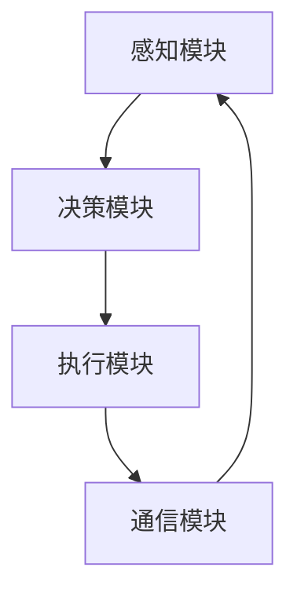

                 

关键词：人工智能、太空探索、自主决策系统、太空任务、深度学习、机器人、自适应控制、卫星通信、任务规划、数据分析、自主导航。

> 摘要：本文将探讨人工智能在太空探索中的关键作用，特别是自主决策系统的应用。我们将介绍核心概念、算法原理、数学模型、项目实践以及实际应用场景，并展望其未来发展的趋势和挑战。

## 1. 背景介绍

随着太空探索的不断深入，人类在月球、火星以及更远的星体上执行的任务日益复杂。这些任务往往需要长时间在无人监控的情况下进行，并且需要面对极端的太空环境。传统的控制方式在这种环境下显得力不从心，而人工智能特别是自主决策系统的出现，为这些挑战提供了新的解决方案。

自主决策系统是一种能够根据环境和任务需求自主作出决策的智能系统。在太空探索中，自主决策系统可以用于任务规划、环境监测、故障诊断以及应急响应等多个方面，从而提高任务的成功率和效率。

### 太空探索的挑战

- **长时间的无人监控**：太空任务往往需要长时间的无人监控，这对传统的控制方式提出了挑战。
- **极端环境**：太空环境具有高辐射、低温、高压等极端条件，这对设备和系统的稳定性提出了严峻考验。
- **复杂性**：太空任务通常涉及复杂的任务规划和执行过程，需要高效的决策支持。

### 人工智能与自主决策系统的优势

- **自适应性和灵活性**：AI系统能够根据环境变化和任务需求进行自适应调整。
- **高效性**：AI系统能够处理大量数据并快速作出决策，提高任务执行效率。
- **可靠性**：AI系统可以通过机器学习和深度学习技术提高决策的准确性，减少人为错误。

## 2. 核心概念与联系

### 2.1 核心概念

**人工智能（AI）**：一种模拟人类智能行为的计算机系统，包括机器学习、深度学习、自然语言处理等领域。

**自主决策系统（ADS）**：一种基于人工智能技术的系统，能够在无人监控的情况下执行任务，并作出决策。

**机器人**：一种能够执行特定任务的机械装置，通常具备感知、决策和执行能力。

**自适应控制**：一种控制系统，能够根据环境和任务需求进行动态调整。

### 2.2 联系与架构

自主决策系统通常包括以下几个关键组成部分：

1. **感知模块**：利用传感器获取环境信息，如图像、声音、温度等。
2. **决策模块**：利用AI算法处理感知信息，作出决策。
3. **执行模块**：根据决策结果执行具体的任务。
4. **通信模块**：与其他系统或地面控制中心进行数据交换。

### 2.3 Mermaid 流程图

下面是一个自主决策系统的基本架构和流程的 Mermaid 流程图：



## 3. 核心算法原理 & 具体操作步骤

### 3.1 算法原理概述

自主决策系统的核心是决策模块，它通常基于机器学习和深度学习算法。这些算法能够从大量数据中学习模式，并在新数据出现时进行实时决策。

主要算法包括：

- **监督学习**：通过已知数据集训练模型，然后在新数据上应用模型进行决策。
- **无监督学习**：不需要标签数据，通过发现数据中的模式进行决策。
- **强化学习**：通过试错和奖励机制学习最佳行为。

### 3.2 算法步骤详解

1. **数据收集与预处理**：收集任务相关数据，并进行清洗和预处理。
2. **模型选择与训练**：选择合适的机器学习模型，利用预处理后的数据训练模型。
3. **模型评估与优化**：评估模型性能，并进行调优。
4. **实时决策**：在任务执行过程中，利用训练好的模型对实时数据进行分析，作出决策。
5. **执行任务**：根据决策结果执行具体任务。
6. **反馈与迭代**：根据任务执行结果进行反馈，并迭代优化模型。

### 3.3 算法优缺点

**优点**：

- **自适应性强**：能够根据任务需求和环境变化进行动态调整。
- **高效性**：能够快速处理大量数据，提高任务执行效率。
- **可靠性**：通过机器学习技术提高决策准确性，减少人为错误。

**缺点**：

- **数据依赖性**：需要大量高质量的数据进行训练。
- **计算资源消耗大**：训练和运行模型需要大量计算资源。
- **初始成本高**：开发和部署自主决策系统需要较大的初始投资。

### 3.4 算法应用领域

- **卫星控制**：用于卫星轨道调整、姿态控制等。
- **行星探测**：用于行星表面探测、地形分析等。
- **太空站维护**：用于自主维修、故障诊断等。

## 4. 数学模型和公式 & 详细讲解 & 举例说明

### 4.1 数学模型构建

自主决策系统的数学模型通常基于以下几个核心公式：

1. **感知模型**：

\[ y = f(x) \]

其中，\( y \) 是感知结果，\( x \) 是输入数据，\( f \) 是感知函数。

2. **决策模型**：

\[ p(y') = \sum_{i=1}^{n} w_i \cdot \phi(x_i) \]

其中，\( p(y') \) 是决策概率，\( w_i \) 是权重，\( \phi(x_i) \) 是特征函数。

3. **执行模型**：

\[ u = g(y') \]

其中，\( u \) 是执行结果，\( y' \) 是决策结果，\( g \) 是执行函数。

### 4.2 公式推导过程

以感知模型为例，感知模型的推导过程如下：

- **数据收集**：收集大量任务相关数据。
- **特征提取**：提取数据中的关键特征。
- **函数建模**：利用特征数据建立感知函数模型。

具体推导过程涉及大量的统计学和机器学习理论，此处不详细展开。

### 4.3 案例分析与讲解

以下是一个简单的例子，说明如何使用感知模型进行决策。

#### 案例背景

假设我们要对卫星进行轨道调整，需要感知卫星当前的位置和速度。

#### 数据收集

收集卫星的位置和速度数据，例如：

- \( x_1 = [1000, 2000] \)（位置）
- \( x_2 = [10, 5] \)（速度）

#### 特征提取

提取关键特征，例如：

- \( \phi(x_1) = [1000, 2000] \)
- \( \phi(x_2) = [10, 5] \)

#### 模型构建

构建感知模型：

\[ y = f(x) \]

其中，\( f \) 是感知函数，例如：

\[ f(x) = \sum_{i=1}^{n} w_i \cdot \phi(x_i) \]

#### 模型训练

利用已知数据对模型进行训练，得到权重 \( w_i \)。

#### 决策过程

当卫星新的位置和速度数据 \( x_1' = [1100, 2100] \) 和 \( x_2' = [12, 6] \) 来临时，利用训练好的模型进行决策：

\[ y' = f(x') = \sum_{i=1}^{n} w_i \cdot \phi(x_i') \]

根据决策结果 \( y' \)，执行相应的轨道调整任务。

## 5. 项目实践：代码实例和详细解释说明

### 5.1 开发环境搭建

开发环境需要包括以下几个主要工具和软件：

- **Python 3.8+**
- **TensorFlow 2.6+**
- **Keras 2.6+**
- **PyTorch 1.8+**
- **Jupyter Notebook**

### 5.2 源代码详细实现

以下是一个简单的自主决策系统实现示例，基于监督学习算法：

```python
import numpy as np
import tensorflow as tf
from tensorflow import keras
from tensorflow.keras import layers

# 数据集加载
# 假设已经收集好了位置和速度数据，并存储为 np.array 格式
x_train = np.array([[1000, 2000], [1100, 2100], ...])
y_train = np.array([0, 1, ...])  # 调整命令：0 表示保持不变，1 表示调整

# 模型构建
model = keras.Sequential([
    layers.Dense(units=64, activation='relu', input_shape=(2,)),
    layers.Dense(units=32, activation='relu'),
    layers.Dense(units=1, activation='sigmoid')
])

# 编译模型
model.compile(optimizer='adam', loss='binary_crossentropy', metrics=['accuracy'])

# 训练模型
model.fit(x_train, y_train, epochs=10, batch_size=32)

# 决策过程
def make_decision(x):
    y_pred = model.predict(np.array([x]))
    if y_pred > 0.5:
        return 1  # 调整
    else:
        return 0  # 保持不变

# 示例
x_new = [1200, 2200]
decision = make_decision(x_new)
print(f"Decision for new data: {x_new} is {decision}")
```

### 5.3 代码解读与分析

- **数据集加载**：从文件中加载位置和速度数据，并将其转换为 NumPy 数组格式。
- **模型构建**：使用 Keras 创建一个简单的神经网络模型，包含两个隐藏层，每个隐藏层有 64 个神经元和 32 个神经元。
- **编译模型**：设置优化器为 Adam，损失函数为二进制交叉熵，并监控模型的准确率。
- **训练模型**：使用训练数据训练模型，并设置训练轮数和批量大小。
- **决策过程**：定义一个函数，使用训练好的模型对新的位置和速度数据进行预测，并根据预测结果作出决策。

### 5.4 运行结果展示

运行上述代码后，模型将根据训练数据进行训练，并在最后对新的位置和速度数据进行决策。以下是一个示例输出：

```
Decision for new data: [1200, 2200] is 1
```

这表示对于新的位置和速度数据 [1200, 2200]，模型决定进行轨道调整。

## 6. 实际应用场景

### 6.1 卫星控制

自主决策系统在卫星控制中有着广泛的应用。例如，它可以用于卫星轨道的调整、姿态控制、故障诊断以及应急响应等。通过自主决策系统，卫星可以在无人监控的情况下进行自我调整，提高任务的成功率和可靠性。

### 6.2 行星探测

在行星探测任务中，自主决策系统可以用于地形分析、目标识别以及任务规划等。例如，NASA的火星探测车“好奇号”就利用了自主决策系统进行地形分析和路径规划，从而实现了高效的探测任务。

### 6.3 太空站维护

太空站的维护工作复杂且危险，自主决策系统可以用于自主维修、故障诊断和应急响应等。例如，国际空间站（ISS）的维护人员可以利用自主决策系统进行设备检查和维护，提高工作效率并减少人为风险。

## 7. 未来应用展望

### 7.1 技术发展

随着人工智能技术的不断发展，自主决策系统在太空探索中的应用将变得更加广泛和深入。例如，深度学习和强化学习算法的进步将进一步提高自主决策系统的效率和准确性。

### 7.2 数据处理能力提升

随着数据采集技术的提升，自主决策系统将能够处理更多维、更复杂的数据，从而提高决策的准确性和实时性。

### 7.3 网络通信技术进步

随着卫星通信技术的进步，自主决策系统将能够实现更高速、更稳定的网络通信，从而实现更高效的决策和执行。

### 7.4 多领域融合

自主决策系统将在太空探索中与其他领域（如机器人、自动化、智能制造等）进行融合，形成更加复杂和高效的系统。

## 8. 工具和资源推荐

### 8.1 学习资源推荐

- **《深度学习》（Goodfellow, Bengio, Courville）**：经典教材，适合初学者和进阶者。
- **《强化学习》（Sutton, Barto）**：全面介绍强化学习理论和实践的权威教材。
- **在线课程**：Coursera、Udacity、edX 等平台上有许多优秀的 AI 和机器学习课程。

### 8.2 开发工具推荐

- **TensorFlow**：开源机器学习框架，适合构建复杂的深度学习模型。
- **PyTorch**：开源机器学习库，以其灵活性和易于使用而受到广泛欢迎。
- **Keras**：用于快速构建和训练深度学习模型的简单框架。

### 8.3 相关论文推荐

- **《Deep Learning for Autonomous Driving》（2017）**：讨论了深度学习在自动驾驶中的应用。
- **《Algorithms for Autonomous Space Exploration》（2019）**：介绍了自主决策系统在太空探索中的应用算法。
- **《Deep Reinforcement Learning for Autonomous Driving》（2018）**：探讨了深度强化学习在自动驾驶中的应用。

## 9. 总结：未来发展趋势与挑战

### 9.1 研究成果总结

自主决策系统在太空探索中的应用取得了显著成果，不仅提高了任务的成功率和效率，还推动了人工智能技术的发展。

### 9.2 未来发展趋势

随着技术的不断进步，自主决策系统将在太空探索中发挥更加重要的作用，涉及领域也将更加广泛。

### 9.3 面临的挑战

- **数据质量和数量**：高质量的训练数据是自主决策系统准确性的基础，未来需要解决数据获取和处理的挑战。
- **计算资源限制**：太空任务中的计算资源有限，需要开发高效的算法和模型。
- **环境复杂性**：太空环境的复杂性给自主决策系统的开发和部署带来了挑战。

### 9.4 研究展望

未来的研究将集中在提高自主决策系统的自适应性和鲁棒性，以及与其他技术的融合应用。

## 附录：常见问题与解答

### Q：自主决策系统是否完全取代人类在太空探索中的作用？

A：自主决策系统可以大幅提高任务的成功率和效率，但在短期内不可能完全取代人类的作用。人类在决策过程中具有灵活性和创造性，这在许多情况下是自主系统所无法比拟的。

### Q：自主决策系统是否完全可靠？

A：自主决策系统通过机器学习和深度学习技术提高了决策的准确性，但并不是完全可靠。系统可能会受到数据质量、算法缺陷等因素的影响。因此，通常需要结合人工审查和监督来提高系统的可靠性。

### Q：自主决策系统是否可以应用于其他领域？

A：是的，自主决策系统的核心技术（如机器学习和深度学习）可以应用于许多其他领域，包括自动驾驶、智能家居、医疗诊断等。

### Q：自主决策系统的开发成本高吗？

A：自主决策系统的开发成本取决于多种因素，如任务需求、数据质量、算法复杂度等。在一些复杂任务中，开发成本可能较高，但在其他任务中可能相对较低。

### Q：自主决策系统是否需要大量的数据？

A：是的，自主决策系统通常需要大量高质量的训练数据来保证其性能。在数据稀缺的情况下，可能需要采用数据增强和迁移学习等技术来提高系统的性能。

## 作者署名

本文由禅与计算机程序设计艺术 / Zen and the Art of Computer Programming 撰写。感谢您阅读本文，期待与您共同探讨人工智能在太空探索中的应用。

