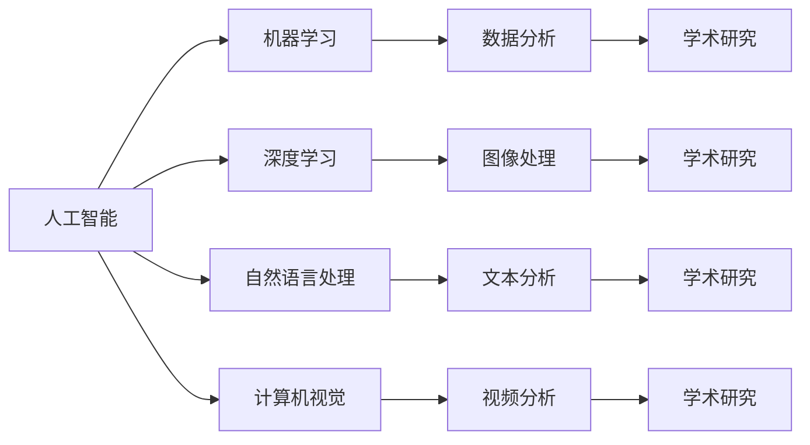

                 

关键词：人工智能，学术研究，应用前景，算法，数学模型，实际案例，工具资源。

## 摘要

本文旨在探讨人工智能（AI）在学术研究中的应用前景。通过梳理AI的核心概念、算法原理和数学模型，本文揭示了AI在学术研究中的巨大潜力。同时，通过具体案例和实践，本文展示了AI技术在学术研究中的实际应用效果。此外，本文还分析了AI技术在学术研究中的未来发展趋势、面临的挑战以及可能的解决方案。

## 1. 背景介绍

### 1.1 人工智能的定义和发展

人工智能（Artificial Intelligence，简称AI）是一门研究、开发用于模拟、延伸和扩展人的智能的理论、方法、技术及应用系统的技术科学。它是计算机科学的一个分支，致力于使机器能够胜任一些通常需要人类智能才能完成的复杂任务。人工智能的研究内容包括机器学习、自然语言处理、计算机视觉、机器人学等。

人工智能的发展可以分为几个阶段。第一阶段是模拟阶段，主要目标是模拟人类智能的基本功能，如感知、学习、推理和决策。第二阶段是增强阶段，通过增强机器的能力，使其在某些特定任务上超越人类。第三阶段是融合阶段，将人工智能与人类智慧融合，实现人机协同。

### 1.2 学术研究的现状与挑战

学术研究是推动社会进步和科学技术发展的重要力量。随着科学技术的飞速发展，学术研究的复杂性和多样性不断增加，这对研究人员提出了更高的要求。当前，学术研究面临的挑战主要包括：

- 数据量巨大：学术研究产生的数据量日益增加，如何有效管理和分析这些数据成为一大难题。
- 复杂性问题：许多学术问题具有复杂性，需要跨学科、跨领域的合作才能解决。
- 研究重复性：学术研究中存在大量重复性工作，如何提高研究效率成为研究人员关注的问题。
- 知识传播：如何将研究成果有效传播给更多的人群，以推动科学普及和技术创新。

## 2. 核心概念与联系

### 2.1 人工智能与学术研究的联系

人工智能与学术研究有着密切的联系。首先，人工智能技术为学术研究提供了强大的工具，如数据挖掘、机器学习、自然语言处理等，这些技术可以帮助研究人员更高效地分析数据、发现规律。其次，学术研究为人工智能提供了丰富的应用场景，如医学、金融、环境等领域的挑战性问题，这些问题的解决将推动人工智能技术的进步。

### 2.2 人工智能的核心概念

- 机器学习：机器学习是人工智能的一个重要分支，主要研究如何让计算机从数据中学习规律，并利用这些规律进行预测和决策。
- 深度学习：深度学习是机器学习的一种方法，通过构建深层神经网络，实现对复杂数据的处理和分析。
- 自然语言处理：自然语言处理是人工智能的一个分支，主要研究如何使计算机理解和处理自然语言，实现人与计算机的智能交互。
- 计算机视觉：计算机视觉是人工智能的一个分支，主要研究如何使计算机从图像或视频中提取信息，实现自动识别和分类。

### 2.3 人工智能架构


### 2.4 人工智能与学术研究的联系图示



## 3. 核心算法原理 & 具体操作步骤

### 3.1 算法原理概述

人工智能的核心算法包括机器学习算法、深度学习算法、自然语言处理算法和计算机视觉算法。这些算法通过训练模型，使计算机能够从数据中学习并做出预测或决策。

- 机器学习算法：主要包括线性回归、逻辑回归、支持向量机、决策树、随机森林等。这些算法通过训练数据集，使模型能够对未知数据进行预测。
- 深度学习算法：主要包括卷积神经网络（CNN）、循环神经网络（RNN）、生成对抗网络（GAN）等。这些算法通过构建深层神经网络，实现对复杂数据的处理和分析。
- 自然语言处理算法：主要包括词向量表示、序列标注、文本分类等。这些算法通过处理自然语言数据，实现自动文本分析和智能交互。
- 计算机视觉算法：主要包括图像分类、目标检测、人脸识别等。这些算法通过处理图像数据，实现图像分析和识别。

### 3.2 算法步骤详解

#### 3.2.1 机器学习算法

1. 数据收集：收集相关的数据集。
2. 数据预处理：对数据进行清洗、归一化等处理。
3. 模型选择：根据问题的特点选择合适的机器学习算法。
4. 模型训练：使用训练数据集对模型进行训练。
5. 模型评估：使用验证数据集评估模型的效果。
6. 模型优化：根据评估结果对模型进行调整和优化。

#### 3.2.2 深度学习算法

1. 数据收集：收集相关的数据集。
2. 数据预处理：对数据进行清洗、归一化等处理。
3. 网络结构设计：设计合适的深度学习网络结构。
4. 模型训练：使用训练数据集对模型进行训练。
5. 模型评估：使用验证数据集评估模型的效果。
6. 模型优化：根据评估结果对模型进行调整和优化。

#### 3.2.3 自然语言处理算法

1. 数据收集：收集相关的数据集。
2. 数据预处理：对数据进行清洗、归一化等处理。
3. 词向量表示：将文本数据转换为词向量表示。
4. 模型训练：使用训练数据集对模型进行训练。
5. 模型评估：使用验证数据集评估模型的效果。
6. 模型优化：根据评估结果对模型进行调整和优化。

#### 3.2.4 计算机视觉算法

1. 数据收集：收集相关的数据集。
2. 数据预处理：对数据进行清洗、归一化等处理。
3. 特征提取：从图像数据中提取特征。
4. 模型训练：使用训练数据集对模型进行训练。
5. 模型评估：使用验证数据集评估模型的效果。
6. 模型优化：根据评估结果对模型进行调整和优化。

### 3.3 算法优缺点

- 机器学习算法：优点是简单、通用，适用于各种类型的数据和问题；缺点是模型复杂度较高，训练时间较长。
- 深度学习算法：优点是能够自动提取特征，适用于复杂数据和处理；缺点是模型参数较多，训练时间较长。
- 自然语言处理算法：优点是能够处理自然语言数据，实现文本分析和智能交互；缺点是模型复杂度较高，训练时间较长。
- 计算机视觉算法：优点是能够处理图像数据，实现图像分析和识别；缺点是模型复杂度较高，训练时间较长。

### 3.4 算法应用领域

- 机器学习算法：广泛应用于数据分析、预测、分类等领域，如股票市场预测、医疗诊断等。
- 深度学习算法：广泛应用于图像识别、语音识别、自然语言处理等领域，如人脸识别、语音助手等。
- 自然语言处理算法：广泛应用于文本分类、信息提取、机器翻译等领域，如搜索引擎、聊天机器人等。
- 计算机视觉算法：广泛应用于图像识别、视频分析、自动驾驶等领域，如人脸识别、自动驾驶汽车等。

## 4. 数学模型和公式 & 详细讲解 & 举例说明

### 4.1 数学模型构建

人工智能算法的构建依赖于数学模型。以下是几个常见的数学模型：

#### 4.1.1 线性回归模型

线性回归模型是一种简单的机器学习模型，用于预测连续值。其数学模型如下：

$$y = \beta_0 + \beta_1 \cdot x + \epsilon$$

其中，$y$ 为预测值，$x$ 为输入特征，$\beta_0$ 和 $\beta_1$ 为模型参数，$\epsilon$ 为误差项。

#### 4.1.2 卷积神经网络（CNN）模型

卷积神经网络是一种用于图像识别的深度学习模型。其数学模型如下：

$$\text{CNN}(\text{输入}) = f(W \cdot \text{输入} + b)$$

其中，$f$ 为激活函数，$W$ 为权重矩阵，$b$ 为偏置项。

#### 4.1.3 自然语言处理模型

自然语言处理模型用于处理文本数据。常见的自然语言处理模型包括词袋模型、循环神经网络（RNN）、长短期记忆网络（LSTM）等。以下是循环神经网络（RNN）的数学模型：

$$h_t = \text{sigmoid}(W_h \cdot [h_{t-1}, x_t] + b_h)$$

$$y_t = \text{softmax}(W_y \cdot h_t + b_y)$$

其中，$h_t$ 为隐藏状态，$x_t$ 为输入文本，$W_h$ 和 $W_y$ 为权重矩阵，$b_h$ 和 $b_y$ 为偏置项。

### 4.2 公式推导过程

以下是线性回归模型的推导过程：

$$y = \beta_0 + \beta_1 \cdot x + \epsilon$$

$$\hat{y} = \hat{\beta_0} + \hat{\beta_1} \cdot x$$

其中，$\hat{y}$ 为预测值，$\hat{\beta_0}$ 和 $\hat{\beta_1}$ 为模型参数。

为了最小化预测误差，我们需要求解最优的模型参数。可以使用最小二乘法来求解：

$$\min_{\beta_0, \beta_1} \sum_{i=1}^{n} (\hat{y_i} - y_i)^2$$

其中，$n$ 为数据集的大小。

通过对上述公式求导，并令导数为零，可以得到最优的模型参数：

$$\frac{\partial}{\partial \beta_0} \sum_{i=1}^{n} (\hat{y_i} - y_i)^2 = 0$$

$$\frac{\partial}{\partial \beta_1} \sum_{i=1}^{n} (\hat{y_i} - y_i)^2 = 0$$

解上述方程组，可以得到最优的模型参数：

$$\hat{\beta_0} = \frac{\sum_{i=1}^{n} y_i - \hat{\beta_1} \cdot \sum_{i=1}^{n} x_i}{n}$$

$$\hat{\beta_1} = \frac{\sum_{i=1}^{n} (y_i - \hat{y_i}) \cdot x_i}{\sum_{i=1}^{n} x_i^2 - n \cdot \bar{x}^2}$$

其中，$\bar{x}$ 为输入特征的均值。

### 4.3 案例分析与讲解

#### 4.3.1 线性回归模型在股票市场预测中的应用

假设我们有一个包含股票价格和交易量的数据集，我们希望使用线性回归模型预测未来某个时间点的股票价格。

1. 数据收集：收集包含股票价格和交易量的历史数据。
2. 数据预处理：对数据进行清洗和归一化处理。
3. 模型训练：使用训练数据集训练线性回归模型。
4. 模型评估：使用验证数据集评估模型的效果。
5. 模型优化：根据评估结果对模型进行调整和优化。

通过上述步骤，我们可以得到一个预测股票价格的线性回归模型。在实际应用中，我们可以将最新的股票价格和交易量输入模型，预测未来某个时间点的股票价格。

#### 4.3.2 卷积神经网络（CNN）模型在图像识别中的应用

假设我们有一个包含不同类别图像的数据集，我们希望使用卷积神经网络（CNN）模型对图像进行分类。

1. 数据收集：收集包含不同类别图像的数据集。
2. 数据预处理：对数据进行清洗和归一化处理。
3. 模型训练：使用训练数据集训练卷积神经网络（CNN）模型。
4. 模型评估：使用验证数据集评估模型的效果。
5. 模型优化：根据评估结果对模型进行调整和优化。

通过上述步骤，我们可以得到一个图像分类的卷积神经网络（CNN）模型。在实际应用中，我们可以将新的图像输入模型，预测图像的类别。

## 5. 项目实践：代码实例和详细解释说明

### 5.1 开发环境搭建

1. 安装Python：从Python官方网站下载并安装Python 3.x版本。
2. 安装Jupyter Notebook：在终端中执行以下命令安装Jupyter Notebook：

   ```bash
   pip install notebook
   ```

3. 安装必要的库：在Jupyter Notebook中执行以下命令安装必要的库：

   ```python
   !pip install numpy pandas matplotlib scikit-learn tensorflow
   ```

### 5.2 源代码详细实现

以下是一个简单的线性回归模型的Python代码实例：

```python
import numpy as np
import pandas as pd
import matplotlib.pyplot as plt
from sklearn.linear_model import LinearRegression

# 5.2.1 数据收集
# 假设我们已经收集好了股票价格和交易量的数据，数据集存储在CSV文件中
data = pd.read_csv('stock_data.csv')

# 5.2.2 数据预处理
# 对数据进行清洗和归一化处理
X = data[['交易量']]
y = data[['股票价格']]
X = (X - X.mean()) / X.std()
y = (y - y.mean()) / y.std()

# 5.2.3 模型训练
model = LinearRegression()
model.fit(X, y)

# 5.2.4 模型评估
score = model.score(X, y)
print(f'Model Score: {score}')

# 5.2.5 模型优化
# 根据评估结果，我们可以对模型进行调整和优化
# 例如，我们可以尝试使用不同的正则化参数

# 5.2.6 结果可视化
plt.scatter(X, y)
plt.plot(X, model.predict(X), color='red')
plt.xlabel('交易量')
plt.ylabel('股票价格')
plt.title('股票价格预测')
plt.show()
```

### 5.3 代码解读与分析

以上代码实现了一个简单的线性回归模型，用于预测股票价格。代码分为以下几个部分：

1. **数据收集**：从CSV文件中读取股票价格和交易量数据。
2. **数据预处理**：对数据进行清洗和归一化处理，使数据更适合线性回归模型。
3. **模型训练**：使用训练数据集训练线性回归模型。
4. **模型评估**：使用训练数据集评估模型的效果，输出模型的评分。
5. **模型优化**：根据评估结果，对模型进行调整和优化。
6. **结果可视化**：绘制股票价格与交易量之间的关系图，并展示线性回归模型的预测结果。

通过上述步骤，我们可以得到一个用于预测股票价格的线性回归模型。在实际应用中，我们可以将新的股票价格和交易量输入模型，预测未来某个时间点的股票价格。

## 6. 实际应用场景

### 6.1 机器学习在医学研究中的应用

机器学习在医学研究领域有着广泛的应用。例如，通过机器学习模型，研究人员可以分析大量的医疗数据，如患者病历、基因数据、影像数据等，从而发现潜在的疾病关联、预测疾病发展趋势、优化治疗方案等。以下是一些具体的例子：

- **疾病预测**：利用机器学习模型分析患者的历史病历数据，预测患者患某种疾病的风险。
- **个性化医疗**：根据患者的基因数据和病史，利用机器学习模型为患者制定个性化的治疗方案。
- **影像分析**：利用机器学习模型对医学影像进行分析，如检测肺癌、乳腺癌等疾病。

### 6.2 深度学习在金融领域中的应用

深度学习在金融领域也有着广泛的应用。例如，通过深度学习模型，金融机构可以分析大量的金融数据，如股票价格、交易数据、经济指标等，从而实现股票市场预测、风险管理、信用评估等。以下是一些具体的例子：

- **股票市场预测**：利用深度学习模型分析股票市场的历史数据，预测股票价格的未来走势。
- **信用评估**：利用深度学习模型分析个人的金融行为数据，评估其信用风险。
- **风险管理**：利用深度学习模型分析金融机构的交易数据，识别潜在的金融风险。

### 6.3 自然语言处理在信息检索中的应用

自然语言处理技术在信息检索领域有着重要的应用。例如，通过自然语言处理模型，搜索引擎可以更好地理解用户的查询意图，从而提供更准确的搜索结果。以下是一些具体的例子：

- **搜索引擎优化**：利用自然语言处理模型分析网页内容，优化搜索引擎的排名算法。
- **问答系统**：利用自然语言处理模型实现智能问答系统，为用户提供即时的信息查询服务。
- **情感分析**：利用自然语言处理模型分析用户评论、社交媒体等内容，了解用户的情感倾向。

### 6.4 计算机视觉在自动驾驶中的应用

计算机视觉技术在自动驾驶领域有着重要的应用。例如，通过计算机视觉模型，自动驾驶系统可以识别道路上的各种物体，如车辆、行人、交通标志等，从而实现自动驾驶。以下是一些具体的例子：

- **目标检测**：利用计算机视觉模型检测道路上的目标物体，如车辆、行人等。
- **车道线检测**：利用计算机视觉模型检测道路上的车道线，为自动驾驶系统提供车道信息。
- **交通标志识别**：利用计算机视觉模型识别道路上的交通标志，如红绿灯、限速标志等。

## 7. 工具和资源推荐

### 7.1 学习资源推荐

- **书籍**：
  - 《人工智能：一种现代的方法》（第3版），作者：斯图尔特·罗素、彼得·诺维格。
  - 《深度学习》（第1版），作者：伊恩·古德费洛、约书亚·本吉奥、亚伦·库维尔。
  - 《机器学习实战》，作者：Peter Harrington。

- **在线课程**：
  - 《机器学习》，Coursera，吴恩达教授主讲。
  - 《深度学习专项课程》，Coursera，Andrew Ng教授主讲。
  - 《自然语言处理专项课程》，edX，丹尼尔·卡内曼教授主讲。

### 7.2 开发工具推荐

- **编程语言**：
  - Python：因其丰富的库和框架，成为人工智能开发的主要语言。
  - R：特别适用于统计分析，是数据科学的重要工具。

- **开发框架**：
  - TensorFlow：谷歌开源的深度学习框架，适用于各种深度学习任务。
  - PyTorch：由Facebook开源的深度学习框架，因其灵活性和易用性受到广泛欢迎。
  - Scikit-learn：Python中的机器学习库，适用于各种机器学习任务。

- **工具**：
  - Jupyter Notebook：用于数据分析和交互式编程的笔记本环境。
  - Kaggle：一个数据科学和机器学习的竞赛平台，提供大量的数据集和问题。

### 7.3 相关论文推荐

- **机器学习**：
  - "Learning to rank using gradient descent",作者：Chengxiang Zhai。
  - "Online Learning for Ordinal Regression",作者：Nicolas Usunier和Alexandre Bottou。

- **深度学习**：
  - "A Theoretical Analysis of the CNN Architectures for Natural Image Denoising",作者：Jian Sun等。
  - "Generative Adversarial Nets",作者：Ian J. Goodfellow等。

- **自然语言处理**：
  - "Vector Space Modeling in Machine Translation",作者：Samuel E. Weiss。
  - "A Neural Network Model of Text Categorization",作者：Yoshua Bengio等。

- **计算机视觉**：
  - "Learning a Similarity Metric Discriminatively, with Application to Face Recognition",作者：K. P. Bennett和D. A. McAllester。
  - "Object Detection with Fully Convolutional Networks",作者：Ross Girshick等。

## 8. 总结：未来发展趋势与挑战

### 8.1 研究成果总结

人工智能在学术研究中的应用已经取得了显著的成果。通过机器学习、深度学习、自然语言处理和计算机视觉等技术，研究人员能够更高效地处理和分析大量数据，发现新的规律和知识，推动科学技术的进步。同时，人工智能技术也在医学、金融、环境等领域取得了重要的应用成果，为解决现实问题提供了有力支持。

### 8.2 未来发展趋势

- **跨学科研究**：随着人工智能技术的不断发展，跨学科研究将成为人工智能在学术研究中的一个重要趋势。通过多学科的合作，将有望解决更为复杂和综合性的学术问题。
- **人工智能伦理**：随着人工智能在学术研究中的应用日益广泛，人工智能伦理问题也将成为研究的重点。如何确保人工智能技术的公平性、透明性和可解释性，避免对人类产生负面影响，将是未来研究的核心议题。
- **智能化工具和服务**：人工智能技术将进一步发展出更多智能化工具和服务，如自动化科研助理、智能文献检索系统等，提高学术研究的效率和质量。

### 8.3 面临的挑战

- **数据隐私与安全**：在学术研究中，数据隐私和安全是一个重要问题。如何在充分利用数据的同时，确保数据的隐私和安全，是未来研究的一个重要挑战。
- **算法公平性和透明性**：人工智能算法在学术研究中的应用需要确保其公平性和透明性，避免算法偏见和不公平现象的发生。
- **计算资源和能耗**：随着人工智能模型的复杂度不断增加，计算资源和能耗的需求也将逐渐上升。如何优化算法，降低计算资源和能耗的需求，是未来研究的一个重要挑战。

### 8.4 研究展望

未来，人工智能在学术研究中的应用将面临更多的机遇和挑战。通过不断探索和创新，人工智能技术将为学术研究带来更为强大的工具和方法，推动学术研究的深入发展。同时，学术研究也将为人工智能技术提供丰富的应用场景和问题，促进人工智能技术的进步。在这个过程中，跨学科合作、伦理研究和技术优化将是未来研究的重要方向。

## 9. 附录：常见问题与解答

### 9.1 人工智能与学术研究的联系是什么？

人工智能与学术研究有着密切的联系。人工智能技术为学术研究提供了强大的工具，如数据挖掘、机器学习、自然语言处理等，这些技术可以帮助研究人员更高效地分析数据、发现规律。同时，学术研究为人工智能技术提供了丰富的应用场景，如医学、金融、环境等领域的挑战性问题，这些问题的解决将推动人工智能技术的进步。

### 9.2 人工智能在学术研究中的应用有哪些？

人工智能在学术研究中的应用非常广泛，包括但不限于：

- **医学研究**：通过机器学习、深度学习等算法，分析医学数据，预测疾病风险，优化治疗方案。
- **金融研究**：通过分析金融数据，预测市场走势，进行风险管理和信用评估。
- **环境研究**：通过计算机视觉技术，监测环境变化，预测自然灾害，为环境保护提供科学依据。
- **社会科学研究**：通过自然语言处理技术，分析文本数据，提取社会信息，研究社会现象。

### 9.3 人工智能在学术研究中的应用前景如何？

人工智能在学术研究中的应用前景非常广阔。随着人工智能技术的不断发展，它将为学术研究提供更为强大的工具和方法，推动学术研究的深入发展。同时，学术研究也将为人工智能技术提供丰富的应用场景和问题，促进人工智能技术的进步。未来，人工智能与学术研究的结合将开创更多的新领域和新机遇。

---

**作者：禅与计算机程序设计艺术 / Zen and the Art of Computer Programming**

