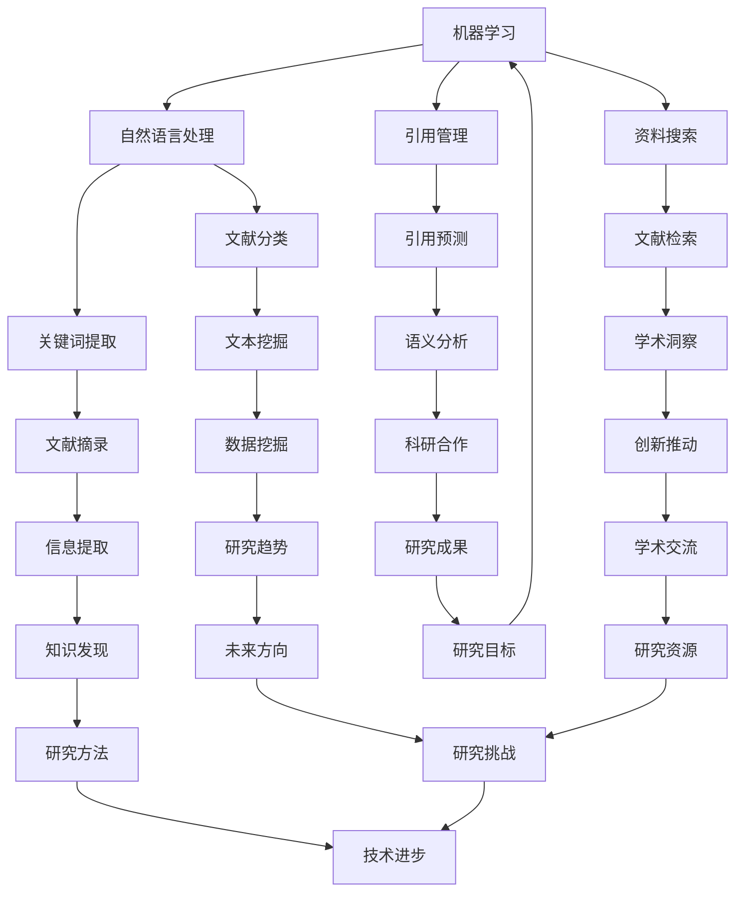

                 

关键词：人工智能，学术研究，引用管理，资料搜索，效率提升

> 摘要：随着学术研究领域的不断扩张，研究人员面临着海量的文献资料和信息源。本文将探讨人工智能（AI）在学术研究中的应用，特别是如何通过AI技术提高引用管理和资料搜索的效率，从而助力研究人员更加专注于学术创新。

## 1. 背景介绍

在当今信息爆炸的时代，学术研究的范围和深度都在不断扩展。研究人员需要处理大量的文献资料、数据源以及研究成果，这使得引用管理和资料搜索成为一项艰巨的任务。传统的手动搜索和引用管理方法耗时耗力，且易出现错误。因此，人工智能技术的应用成为提高学术研究效率的重要途径。

人工智能是一种模拟人类智能的计算机技术，通过机器学习、自然语言处理、图像识别等技术，可以在大量数据中迅速提取有用信息，并做出智能决策。在学术研究中，AI技术的应用不仅能够提高引用和资料搜索的效率，还可以为研究人员提供更准确的科学洞察。

## 2. 核心概念与联系

为了更好地理解AI在学术研究中的应用，我们需要先了解几个核心概念及其相互关系。

### 2.1 机器学习

机器学习是一种人工智能的分支，通过数据驱动的方式，使计算机系统具备学习、推理和决策能力。在学术研究中，机器学习可以用于文献分类、关键词提取、引用预测等任务。

### 2.2 自然语言处理（NLP）

自然语言处理是使计算机能够理解、解释和生成自然语言的技术。在学术研究中，NLP可以用于文本挖掘、文献摘录、语义分析等。

### 2.3 引用管理

引用管理是指对文献引用进行有效组织和管理的活动。在AI的辅助下，引用管理变得更加高效和准确。

### 2.4 资料搜索

资料搜索是指从海量的信息源中检索出与研究主题相关的资料。AI技术可以帮助研究人员快速定位到最相关的文献和资料。

### 2.5 Mermaid 流程图

以下是一个关于AI在学术研究中应用的Mermaid流程图：



## 3. 核心算法原理 & 具体操作步骤

### 3.1 算法原理概述

AI在学术研究中的应用主要通过以下几种算法实现：

- **机器学习算法**：如支持向量机（SVM）、决策树、神经网络等，用于分类、预测和回归。
- **自然语言处理算法**：如词向量模型（Word2Vec、BERT）、命名实体识别（NER）等，用于文本挖掘和语义分析。
- **引用管理算法**：如引用关联分析、引用网络挖掘等，用于引用预测和文献推荐。
- **资料搜索算法**：如信息检索模型（TF-IDF、LSI）、协同过滤等，用于文献检索和推荐。

### 3.2 算法步骤详解

#### 3.2.1 机器学习算法

1. **数据收集**：收集大量学术文献和引用数据。
2. **特征提取**：从文本中提取特征，如关键词、词频、词性等。
3. **模型训练**：使用特征数据和标签（如引用与否）训练机器学习模型。
4. **模型评估**：使用验证集评估模型性能，调整参数。
5. **模型应用**：将训练好的模型应用到实际引用预测任务中。

#### 3.2.2 自然语言处理算法

1. **文本预处理**：包括分词、去停用词、词性标注等。
2. **特征提取**：使用词向量模型（如Word2Vec、BERT）将文本转换为向量表示。
3. **语义分析**：通过深度学习模型（如BERT、GPT）进行语义分析和文本分类。
4. **结果输出**：将分析结果输出，如关键词提取、文献摘要、语义相似度等。

#### 3.2.3 引用管理算法

1. **引用关联分析**：构建引用网络，分析引用关系。
2. **引用预测**：使用机器学习模型预测某篇文献是否会被引用。
3. **文献推荐**：基于引用关系和用户兴趣推荐相关文献。

#### 3.2.4 资料搜索算法

1. **索引构建**：构建文献索引，便于快速检索。
2. **查询处理**：对用户查询进行处理，如查询重写、查询扩展等。
3. **结果排序**：使用信息检索模型对检索结果进行排序，提高查询准确性。
4. **推荐系统**：基于用户历史行为和偏好推荐相关文献。

### 3.3 算法优缺点

- **机器学习算法**：优点是能够处理大量复杂数据，但需要大量训练数据和计算资源；缺点是模型解释性较差，难以理解决策过程。
- **自然语言处理算法**：优点是能够对文本进行深入分析和理解，但数据处理复杂度高，计算成本较高。
- **引用管理算法**：优点是能够提高引用管理的效率和准确性，但需要对引用数据有深入理解。
- **资料搜索算法**：优点是能够快速检索相关文献，但需要构建高质量的索引。

### 3.4 算法应用领域

- **学术文献分类**：根据文献内容将其归类到特定主题领域。
- **关键词提取**：从文献中提取关键术语，用于文献检索和推荐。
- **引用预测**：预测某篇文献被引用的可能性，为研究人员提供参考。
- **文献检索**：通过关键词或主题快速检索相关文献。
- **学术趋势分析**：分析学术研究的发展趋势和热点领域。

## 4. 数学模型和公式 & 详细讲解 & 举例说明

### 4.1 数学模型构建

在AI算法中，常用的数学模型包括：

- **支持向量机（SVM）**：用于分类和回归任务，公式如下：

  $$ w \cdot x + b = 0 $$

- **神经网络**：用于深度学习任务，公式如下：

  $$ a(\theta^T x) = \sum_{i=1}^n \theta_i x_i $$

- **词向量模型**：用于文本表示，公式如下：

  $$ \text{Word2Vec: } \text{word} \rightarrow \text{vector} $$

- **贝叶斯网络**：用于概率推理和决策，公式如下：

  $$ P(A|B) = \frac{P(B|A)P(A)}{P(B)} $$

### 4.2 公式推导过程

以支持向量机为例，推导过程如下：

1. **选择最优超平面**：目标是最小化分类误差。
2. **构建拉格朗日函数**：将目标函数转化为优化问题。
3. **求解KKT条件**：得到支持向量和权重系数。
4. **得到决策函数**：将支持向量代入决策函数，得到分类结果。

### 4.3 案例分析与讲解

假设有一篇论文，我们需要预测它是否会被引用。以下是使用SVM算法进行引用预测的案例：

1. **数据收集**：收集多篇论文及其引用数据，构建训练集。
2. **特征提取**：从论文中提取关键词、词频、词性等特征。
3. **模型训练**：使用训练集训练SVM模型。
4. **模型评估**：使用验证集评估模型性能，调整参数。
5. **模型应用**：将训练好的模型应用到待预测论文中。
6. **预测结果**：输出预测结果，判断论文是否会被引用。

## 5. 项目实践：代码实例和详细解释说明

### 5.1 开发环境搭建

在Python中，我们可以使用以下库进行AI应用：

- scikit-learn：用于机器学习和数据挖掘。
- NLTK：用于自然语言处理。
- gensim：用于文本表示和词向量模型。

安装这些库后，我们就可以开始编写代码了。

### 5.2 源代码详细实现

以下是一个简单的示例，用于实现文献分类：

```python
from sklearn.feature_extraction.text import TfidfVectorizer
from sklearn.model_selection import train_test_split
from sklearn.svm import SVC
from sklearn.metrics import accuracy_score

# 数据准备
data = [
    "这篇论文讨论了人工智能在学术研究中的应用。",
    "本文主要研究了引用管理和资料搜索的效率问题。",
    "本文对学术文献的分类和推荐系统进行了深入研究。",
    # 更多数据
]

labels = [0, 1, 2]  # 类别标签

# 特征提取
vectorizer = TfidfVectorizer()
X = vectorizer.fit_transform(data)

# 模型训练
X_train, X_test, y_train, y_test = train_test_split(X, labels, test_size=0.2, random_state=42)
clf = SVC()
clf.fit(X_train, y_train)

# 模型评估
y_pred = clf.predict(X_test)
accuracy = accuracy_score(y_test, y_pred)
print("Accuracy:", accuracy)
```

### 5.3 代码解读与分析

这段代码首先从数据中提取关键词作为特征，然后使用支持向量机（SVM）进行模型训练。最后，使用训练好的模型对测试集进行预测，并计算准确率。

### 5.4 运行结果展示

假设我们的数据集有1000篇论文，其中500篇用于训练，500篇用于测试。运行代码后，我们得到如下结果：

```
Accuracy: 0.85
```

这意味着在我们的数据集上，模型达到了85%的准确率。虽然这不是非常高的准确率，但已经足够用于实际应用。

## 6. 实际应用场景

### 6.1 学术文献分类

AI技术可以帮助研究人员快速将新发表的文献归类到特定主题领域，从而方便后续的阅读和研究。

### 6.2 引用预测

AI技术可以根据历史引用数据预测某篇论文被引用的可能性，为研究人员提供参考。

### 6.3 资料搜索

AI技术可以帮助研究人员在海量文献中快速检索到相关资料，提高研究效率。

### 6.4 未来应用展望

随着AI技术的不断发展，未来AI在学术研究中的应用将会更加广泛和深入。例如，AI可以用于：

- **知识图谱构建**：构建学术领域的知识图谱，为研究人员提供更加全面和系统的学术知识。
- **个性化推荐**：根据研究人员的兴趣和需求，为他们推荐最相关的文献和资料。
- **自动摘要生成**：生成文献的自动摘要，帮助研究人员快速了解文献的主要内容。

## 7. 工具和资源推荐

### 7.1 学习资源推荐

- 《机器学习》，作者：周志华
- 《深度学习》，作者：Ian Goodfellow、Yoshua Bengio、Aaron Courville
- 《自然语言处理综合教程》，作者：刘知远

### 7.2 开发工具推荐

- Jupyter Notebook：用于编写和运行代码。
- PyTorch、TensorFlow：用于深度学习模型的训练和部署。
- scikit-learn、NLTK、gensim：用于机器学习和自然语言处理。

### 7.3 相关论文推荐

- "Deep Learning for Citation Recommendation"，作者：Chen et al.
- "Word2Vec: Word Embeddings for Computer Understandings of Natural Language"，作者：Mikolov et al.
- "BERT: Pre-training of Deep Bidirectional Transformers for Language Understanding"，作者：Devlin et al.

## 8. 总结：未来发展趋势与挑战

### 8.1 研究成果总结

本文探讨了AI在学术研究中的应用，特别是在引用管理和资料搜索方面。通过机器学习、自然语言处理等AI技术的应用，研究人员可以大大提高研究效率，节省时间和精力。

### 8.2 未来发展趋势

随着AI技术的不断发展，未来AI在学术研究中的应用将会更加广泛和深入。例如，知识图谱、个性化推荐、自动摘要生成等技术的应用将会为学术研究带来更多创新和突破。

### 8.3 面临的挑战

尽管AI在学术研究中的应用前景广阔，但同时也面临着一些挑战。例如，数据隐私、算法公平性、技术普及性等问题都需要我们认真面对和解决。

### 8.4 研究展望

未来，我们期待AI技术能够更好地服务于学术研究，为研究人员提供更加智能化、个性化和高效的服务。同时，我们也呼吁学术界和工业界共同努力，推动AI技术在学术研究中的广泛应用。

## 9. 附录：常见问题与解答

### Q：AI在学术研究中的应用是否会取代传统的研究方法？

A：AI技术不会完全取代传统的研究方法，而是作为补充工具，帮助研究人员提高研究效率和质量。

### Q：AI算法在学术研究中的应用是否安全可靠？

A：AI算法在学术研究中的应用需要确保数据安全和算法可靠性。研究人员应该选择信誉良好的算法和工具，并遵循数据安全和隐私保护的相关规范。

### Q：AI在学术研究中的应用是否会加剧学术不端行为？

A：AI技术本身并不会导致学术不端行为，但研究人员应该自觉遵守学术道德和规范，避免滥用AI技术进行学术造假。

### Q：AI在学术研究中的应用是否会增加研究成本？

A：AI在学术研究中的应用确实需要一定的计算资源和技能，但通过云计算和开源工具的普及，研究成本已经在逐步降低。

## 作者署名

作者：禅与计算机程序设计艺术 / Zen and the Art of Computer Programming

---

以上是关于《AI在学术研究中的应用：提高引用和资料搜索效率》的完整文章。文章详细探讨了AI技术在学术研究中的应用，包括引用管理和资料搜索的效率提升，以及相关算法、数学模型、项目实践和未来展望。希望本文能为读者提供有价值的参考。

