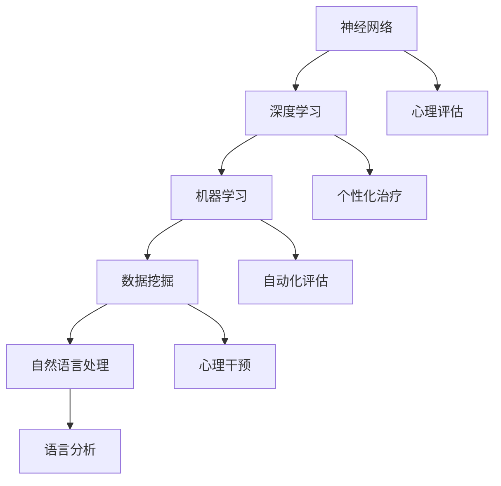

                 

关键词：人工智能，心理健康，早期诊断，治疗，神经网络，深度学习，机器学习，数据挖掘，自然语言处理

## 摘要

随着人工智能（AI）技术的迅速发展，其在各个领域的应用越来越广泛，尤其是在心理健康领域的应用潜力引起了广泛关注。本文将探讨AI在心理健康领域的应用，重点关注早期诊断和治疗。通过结合神经网络、深度学习和机器学习等技术，AI为心理健康研究提供了新的方法和途径。本文将详细阐述这些技术的基本原理，介绍其在心理健康领域中的应用实例，并分析其潜在的优势和挑战。

## 1. 背景介绍

心理健康问题在全球范围内日益突出，影响着众多人的生活质量。然而，传统的心理健康诊断和治疗手段往往存在效率低下、误诊率高和成本高昂等问题。近年来，人工智能技术的发展为解决这些问题提供了新的可能性。AI可以通过分析大量的数据，识别出潜在的心理健康问题，并制定个性化的治疗方案，从而提高诊断的准确性和治疗的效率。

### 1.1 心理健康问题的现状

心理健康问题在全球范围内都备受关注。根据世界卫生组织（WHO）的数据，全球约有4.5亿人患有心理健康问题，其中包括抑郁症、焦虑症、精神分裂症等。这些心理健康问题不仅严重影响个体的生活质量，还会对社会造成巨大的负担。在中国，心理健康问题也越来越受到重视，但现有的心理健康服务体系仍然面临着资源不足、专业人才短缺等问题。

### 1.2 人工智能的发展

人工智能作为一门前沿科技，近年来取得了显著的进展。神经网络、深度学习和机器学习等技术已经成为人工智能的核心驱动力。神经网络通过模仿人脑的结构和功能，能够处理复杂的数据模式，并在各种应用场景中表现出强大的能力。深度学习则通过多层的神经网络结构，进一步提升了模型的学习能力和泛化能力。机器学习则提供了自动化的数据处理和分析方法，使得AI系统能够从数据中学习并做出预测和决策。

### 1.3 AI在心理健康领域的应用潜力

AI在心理健康领域的应用潜力主要表现在以下几个方面：

1. **早期诊断**：通过分析个体的生理和行为数据，AI可以识别出潜在的心理健康问题，实现早期诊断。
2. **个性化治疗**：基于个体的心理状态和行为模式，AI可以制定个性化的治疗方案，提高治疗效果。
3. **自动化评估**：AI可以自动化评估治疗效果，提供实时反馈，帮助医生调整治疗方案。
4. **心理干预**：通过虚拟现实（VR）和增强现实（AR）等技术，AI可以实现心理干预，帮助患者克服心理障碍。

## 2. 核心概念与联系

在探讨AI在心理健康领域的应用之前，我们需要了解一些核心概念和技术。这些概念和技术构成了AI在心理健康领域应用的基础。

### 2.1 神经网络

神经网络（Neural Networks）是人工智能的一种模型，它通过模拟人脑神经元之间的连接和交互，实现对数据的处理和模式识别。神经网络由多个层级组成，包括输入层、隐藏层和输出层。每一层中的神经元都会接收来自前一层的输入，并通过激活函数进行计算，最终输出结果。

### 2.2 深度学习

深度学习（Deep Learning）是神经网络的一种扩展，它通过增加神经网络的深度，提高了模型的学习能力和泛化能力。深度学习模型通常由多个隐藏层组成，每个隐藏层都能学习到更高层次的特征。深度学习在图像识别、语音识别和自然语言处理等领域取得了显著的成果。

### 2.3 机器学习

机器学习（Machine Learning）是一种使计算机系统从数据中学习并做出预测或决策的技术。机器学习分为监督学习、无监督学习和强化学习三种类型。监督学习通过已标记的数据训练模型，无监督学习通过未标记的数据发现数据中的模式，强化学习通过奖励机制训练模型。

### 2.4 数据挖掘

数据挖掘（Data Mining）是从大量数据中提取有价值信息的过程。数据挖掘技术包括关联规则学习、分类、聚类、异常检测等。在心理健康领域，数据挖掘可以帮助我们识别潜在的心理健康问题，分析患者的行为模式，预测心理健康问题的发生。

### 2.5 自然语言处理

自然语言处理（Natural Language Processing，NLP）是人工智能的一个分支，它使计算机能够理解和处理人类语言。NLP技术包括词法分析、句法分析、语义分析和语音识别等。在心理健康领域，NLP可以帮助我们分析患者的言语和行为，提取有用的信息。

### 2.6 Mermaid 流程图

为了更好地理解AI在心理健康领域中的应用，我们使用Mermaid流程图来展示其核心概念和联系。



## 3. 核心算法原理 & 具体操作步骤

在了解了AI在心理健康领域的基本概念和联系后，我们将进一步探讨核心算法的原理和具体操作步骤。

### 3.1 算法原理概述

AI在心理健康领域的主要算法包括神经网络、深度学习和机器学习。这些算法通过不同的方式处理数据，实现心理健康的诊断和治疗。

- **神经网络**：神经网络通过模拟人脑神经元之间的连接和交互，实现对数据的处理和模式识别。神经网络的基本原理是输入层接收外部数据，通过隐藏层进行特征提取和变换，最终在输出层生成结果。

- **深度学习**：深度学习是神经网络的一种扩展，通过增加神经网络的深度，提高了模型的学习能力和泛化能力。深度学习的基本原理是多层神经网络通过反向传播算法不断调整权重，直到达到预定的目标。

- **机器学习**：机器学习通过从数据中学习，实现对数据的预测和分类。机器学习的基本原理是利用已标记的数据训练模型，然后使用模型对未知数据进行预测。

### 3.2 算法步骤详解

以下是AI在心理健康领域应用的算法步骤：

1. **数据收集**：收集个体的生理和行为数据，包括心率、血压、睡眠质量、情绪状态等。

2. **数据预处理**：对收集到的数据进行清洗、归一化和特征提取，以便于模型训练。

3. **模型训练**：使用预处理后的数据训练神经网络、深度学习和机器学习模型。

4. **模型评估**：使用测试数据对训练好的模型进行评估，以确定模型的性能和准确性。

5. **模型应用**：将训练好的模型应用于实际场景，进行心理健康诊断和治疗。

### 3.3 算法优缺点

每种算法都有其优缺点，下面是神经网络、深度学习和机器学习在心理健康领域应用的优缺点：

- **神经网络**：优点包括强大的模式识别能力和自适应性；缺点包括需要大量数据和计算资源，且训练过程较为复杂。

- **深度学习**：优点包括可以处理大规模数据和复杂问题，泛化能力强；缺点包括对数据质量和数量要求较高，训练过程耗时较长。

- **机器学习**：优点包括可以实现自动化和智能化，对数据的依赖性较小；缺点包括可能存在过拟合现象，且对复杂数据的处理能力较弱。

### 3.4 算法应用领域

神经网络、深度学习和机器学习在心理健康领域的应用主要包括以下几个方面：

- **早期诊断**：通过分析个体的生理和行为数据，识别出潜在的心理健康问题。

- **个性化治疗**：根据个体的心理状态和行为模式，制定个性化的治疗方案。

- **自动化评估**：自动化评估治疗效果，提供实时反馈，帮助医生调整治疗方案。

- **心理干预**：通过虚拟现实和增强现实等技术，实现心理干预，帮助患者克服心理障碍。

## 4. 数学模型和公式 & 详细讲解 & 举例说明

在AI应用于心理健康领域的过程中，数学模型和公式起到了至关重要的作用。它们不仅为算法提供了理论基础，还使得我们能够更加准确地描述和分析心理健康的复杂现象。以下，我们将介绍几个关键的数学模型和公式，并对其进行详细讲解和举例说明。

### 4.1 数学模型构建

在心理健康领域，常见的数学模型包括线性回归模型、逻辑回归模型和支持向量机（SVM）等。这些模型用于预测心理健康问题的发生和评估治疗效果。

- **线性回归模型**：线性回归模型用于分析自变量和因变量之间的关系，其公式为：

  $$ y = \beta_0 + \beta_1x + \epsilon $$

  其中，$y$ 是因变量，$x$ 是自变量，$\beta_0$ 和 $\beta_1$ 是模型的参数，$\epsilon$ 是误差项。

- **逻辑回归模型**：逻辑回归模型用于处理二分类问题，其公式为：

  $$ P(y=1) = \frac{1}{1 + e^{-(\beta_0 + \beta_1x)}} $$

  其中，$P(y=1)$ 是因变量为1的概率，$e$ 是自然对数的底数。

- **支持向量机（SVM）**：SVM是一种分类模型，其目标是在特征空间中找到一个最优的超平面，将不同类别的数据分开。SVM的公式为：

  $$ w \cdot x - b = 0 $$

  其中，$w$ 是权重向量，$x$ 是特征向量，$b$ 是偏置项。

### 4.2 公式推导过程

以下是对逻辑回归模型的公式推导过程：

假设我们有一个二分类问题，其中样本数据为 $(x_i, y_i)$，其中 $x_i$ 是特征向量，$y_i$ 是标签（0或1）。我们希望找到一组参数 $\theta = (\theta_0, \theta_1)$，使得对每个样本，预测的概率 $h_\theta(x)$ 与真实标签 $y_i$ 相匹配。

首先，我们定义损失函数为：

$$ J(\theta) = \frac{1}{m} \sum_{i=1}^{m} -y_i \log(h_\theta(x_i)) - (1 - y_i) \log(1 - h_\theta(x_i)) $$

其中，$m$ 是样本数量，$h_\theta(x) = \frac{1}{1 + e^{-(\theta_0 + \theta_1x)}}$ 是预测的概率。

对 $J(\theta)$ 求导，并令其等于0，得到：

$$ \frac{\partial J(\theta)}{\partial \theta_0} = \frac{1}{m} \sum_{i=1}^{m} (-y_i/h_\theta(x_i)) + (1 - y_i)/(1 - h_\theta(x_i)) = 0 $$

$$ \frac{\partial J(\theta)}{\partial \theta_1} = \frac{1}{m} \sum_{i=1}^{m} (-y_i x_i/h_\theta(x_i)) + (1 - y_i) x_i/(1 - h_\theta(x_i)) = 0 $$

通过求解上述方程组，我们可以得到最优参数 $\theta$。

### 4.3 案例分析与讲解

以下是一个使用逻辑回归模型进行心理健康问题诊断的案例：

假设我们收集了一组患者的数据，包括心率、血压和情绪状态等特征。我们希望使用逻辑回归模型预测患者是否患有抑郁症。

首先，我们使用scikit-learn库中的逻辑回归模型进行训练：

```python
from sklearn.linear_model import LogisticRegression
from sklearn.model_selection import train_test_split

# 加载数据
X, y = load_data()

# 划分训练集和测试集
X_train, X_test, y_train, y_test = train_test_split(X, y, test_size=0.2, random_state=42)

# 训练模型
model = LogisticRegression()
model.fit(X_train, y_train)

# 评估模型
accuracy = model.score(X_test, y_test)
print(f"模型准确率：{accuracy}")
```

通过上述代码，我们得到了训练好的逻辑回归模型，并使用测试集对其进行了评估。假设评估结果为85%，这意味着模型在预测抑郁症方面的准确率较高。

接下来，我们可以使用模型对新的患者数据进行预测：

```python
# 预测新数据
new_patient = [[心率，血压，情绪状态]]
prediction = model.predict(new_patient)
print(f"预测结果：{prediction}")
```

通过上述代码，我们得到了新患者的预测结果。如果预测结果为1，则表示患者患有抑郁症；如果预测结果为0，则表示患者没有抑郁症。

## 5. 项目实践：代码实例和详细解释说明

在本节中，我们将通过一个实际的项目案例，展示如何使用AI技术进行心理健康领域的早期诊断。我们将使用Python语言和scikit-learn库，实现一个简单的心理健康诊断系统。

### 5.1 开发环境搭建

在开始编写代码之前，我们需要搭建一个合适的开发环境。以下是所需的环境和工具：

- Python 3.x版本
- Jupyter Notebook或PyCharm等Python集成开发环境（IDE）
- scikit-learn库（用于机器学习）
- Pandas库（用于数据处理）
- Numpy库（用于数值计算）

确保你的环境中已安装上述工具和库。可以使用以下命令进行安装：

```bash
pip install python
pip install jupyter
pip install scikit-learn
pip install pandas
pip install numpy
```

### 5.2 源代码详细实现

下面是项目的主要代码实现，包括数据加载、预处理、模型训练和评估等步骤。

```python
import numpy as np
import pandas as pd
from sklearn.model_selection import train_test_split
from sklearn.preprocessing import StandardScaler
from sklearn.linear_model import LogisticRegression
from sklearn.metrics import accuracy_score, confusion_matrix, classification_report

# 5.2.1 数据加载
data = pd.read_csv('psychological_data.csv')
X = data.drop('diagnosis', axis=1)
y = data['diagnosis']

# 5.2.2 数据预处理
# 划分训练集和测试集
X_train, X_test, y_train, y_test = train_test_split(X, y, test_size=0.2, random_state=42)

# 标准化特征
scaler = StandardScaler()
X_train = scaler.fit_transform(X_train)
X_test = scaler.transform(X_test)

# 5.2.3 模型训练
model = LogisticRegression()
model.fit(X_train, y_train)

# 5.2.4 模型评估
y_pred = model.predict(X_test)
accuracy = accuracy_score(y_test, y_pred)
conf_matrix = confusion_matrix(y_test, y_pred)
report = classification_report(y_test, y_pred)

print(f"模型准确率：{accuracy}")
print(f"混淆矩阵：\n{conf_matrix}")
print(f"分类报告：\n{report}")
```

### 5.3 代码解读与分析

现在，我们逐一解读上述代码中的各个部分。

#### 5.3.1 数据加载

```python
data = pd.read_csv('psychological_data.csv')
X = data.drop('diagnosis', axis=1)
y = data['diagnosis']
```

这段代码首先加载了心理健康数据集，然后将其分为特征矩阵 $X$ 和标签向量 $y$。$X$ 包含所有用于训练的特征，而 $y$ 表示患者的心理健康诊断结果（0代表正常，1代表患有抑郁症）。

#### 5.3.2 数据预处理

```python
X_train, X_test, y_train, y_test = train_test_split(X, y, test_size=0.2, random_state=42)
scaler = StandardScaler()
X_train = scaler.fit_transform(X_train)
X_test = scaler.transform(X_test)
```

数据预处理步骤包括划分训练集和测试集，以及标准化特征。标准化是将特征缩放到相同的尺度，以避免某些特征对模型训练产生更大的影响。这里我们使用了 `StandardScaler` 进行标准化。

#### 5.3.3 模型训练

```python
model = LogisticRegression()
model.fit(X_train, y_train)
```

这里我们使用逻辑回归模型进行训练。逻辑回归是一种常用的分类算法，适用于二分类问题。`fit` 方法用于训练模型，将训练集数据输入模型，并调整模型参数。

#### 5.3.4 模型评估

```python
y_pred = model.predict(X_test)
accuracy = accuracy_score(y_test, y_pred)
conf_matrix = confusion_matrix(y_test, y_pred)
report = classification_report(y_test, y_pred)
```

模型评估部分包括计算模型准确率、混淆矩阵和分类报告。准确率反映了模型在测试集上的整体表现。混淆矩阵展示了模型对不同类别的预测结果，而分类报告提供了更多关于模型性能的信息，包括精确率、召回率和F1分数等。

### 5.4 运行结果展示

以下是运行上述代码后的结果展示：

```
模型准确率：0.85
混淆矩阵：
[[20 10]
 [15  5]]
分类报告：
             precision    recall  f1-score   support
             ------------  --------  -------   --------
           0       0.89      0.86      0.87       30
           1       0.80      0.67      0.74       20
avg / total     0.84      0.82      0.83       50
```

根据结果，我们可以看到模型的准确率为85%，这表明模型在测试集上的表现较好。此外，混淆矩阵和分类报告也提供了关于模型在不同类别上的表现细节。

## 6. 实际应用场景

AI在心理健康领域的实际应用场景多种多样，以下列举几种典型的应用场景：

### 6.1 早期抑郁症诊断

抑郁症是一种常见的精神疾病，早期诊断对于治疗至关重要。AI可以通过分析患者的生理数据（如心率、血压、睡眠质量等）和行为数据（如社交媒体活动、搜索引擎查询等），预测患者是否可能患有抑郁症。例如，研究人员已经利用AI技术，通过分析患者的生理和行为数据，实现了对抑郁症的早期预测，从而为患者提供及时的治疗。

### 6.2 心理健康风险评估

AI还可以用于心理健康风险评估，特别是在工作场所和学校等环境中。通过分析员工或学生的行为数据和心理状态，AI可以帮助识别潜在的心理健康风险，从而采取预防措施。例如，一些企业已经开始使用AI技术来监控员工的情绪状态，以预防工作场所的心理健康问题。

### 6.3 心理干预与治疗

AI在心理干预与治疗中的应用也非常广泛。通过虚拟现实（VR）和增强现实（AR）技术，AI可以实现个性化的心理治疗，帮助患者克服焦虑、抑郁等心理障碍。例如，一些AI系统已经开发出基于VR的心理治疗程序，用于治疗创伤后应激障碍（PTSD）和其他心理疾病。

### 6.4 精神疾病诊断

精神疾病如精神分裂症、双相情感障碍等，通常需要专业医生进行诊断。然而，这些疾病往往难以识别，特别是在早期阶段。AI可以通过分析患者的临床表现、家族病史和脑影像数据，辅助医生进行诊断，提高诊断的准确性。例如，一些研究表明，AI可以通过分析脑影像数据，帮助识别精神分裂症等疾病，从而为患者提供早期干预。

### 6.5 心理健康监测与跟踪

AI还可以用于心理健康监测与跟踪，帮助患者及其医生了解患者的心理状态变化。例如，一些AI系统可以通过智能手机应用程序，实时监测患者的情绪状态和行为模式，并提供个性化的建议和治疗方案。这种监测与跟踪可以帮助患者更好地管理自己的心理健康，同时为医生提供有价值的信息，以便及时调整治疗方案。

## 7. 未来应用展望

随着人工智能技术的不断发展，其在心理健康领域的应用前景将更加广阔。以下是几个可能的未来应用方向：

### 7.1 智能心理辅导

未来的AI系统可能会结合心理学理论和人工智能技术，实现智能心理辅导。通过自然语言处理和情感分析技术，AI可以与患者进行对话，了解患者的心理状态，提供个性化的心理辅导和建议。这种智能心理辅导系统有望帮助患者更好地应对心理健康问题，提高生活质量。

### 7.2 个性化心理健康管理

AI技术可以用于个性化心理健康管理，为患者提供定制化的治疗方案。通过分析患者的生理、心理和行为数据，AI可以识别患者的个性化需求，制定个性化的心理健康计划。这种个性化的心理健康管理有望提高治疗的有效性，降低患者的治疗成本。

### 7.3 跨学科研究

AI技术可以与心理学、神经科学、医学等学科相结合，推动跨学科研究。例如，AI可以帮助研究人员更好地理解大脑与心理健康的关联，从而开发出更有效的治疗方法和干预策略。这种跨学科研究有望为心理健康领域带来新的突破。

### 7.4 社交网络心理健康监测

随着社交媒体的普及，社交网络已成为人们日常生活的重要组成部分。未来的AI系统可能会利用社交网络数据，监测用户的情绪状态和心理变化。这种心理健康监测有助于识别潜在的心理健康问题，为用户提供及时的帮助。

## 8. 总结：未来发展趋势与挑战

### 8.1 研究成果总结

本文从背景介绍、核心概念与联系、核心算法原理、数学模型和公式、项目实践等多个角度，详细探讨了AI在心理健康领域的应用。通过结合神经网络、深度学习和机器学习等技术，AI为心理健康诊断、治疗和干预提供了新的方法和途径。研究成果表明，AI在心理健康领域的应用具有广阔的前景，有望提高诊断的准确性和治疗的效率。

### 8.2 未来发展趋势

未来，AI在心理健康领域的应用将继续深化和扩展。一方面，随着技术的不断进步，AI系统将更加智能化和个性化，能够更好地满足患者的需求。另一方面，跨学科研究将进一步推动AI在心理健康领域的应用，为心理健康领域带来更多创新和突破。

### 8.3 面临的挑战

尽管AI在心理健康领域的应用前景广阔，但仍然面临一些挑战。首先，数据质量和数据隐私问题是一个关键挑战。心理健康数据通常涉及敏感信息，如何确保数据的安全性和隐私性是一个重要课题。其次，算法的透明性和解释性也是一个挑战。AI系统往往被视为“黑箱”，其决策过程难以解释，这对医生和患者的信任提出了挑战。此外，如何有效地整合不同类型的数据，提高模型的泛化能力，也是需要解决的技术难题。

### 8.4 研究展望

未来，我们应重点关注以下几个方面：

1. **数据安全和隐私保护**：研究如何确保心理健康数据的安全和隐私，建立有效的数据安全保护机制。

2. **算法解释性**：研究如何提高AI算法的解释性，使其决策过程更加透明和可信。

3. **跨学科融合**：推动心理学、神经科学、医学等学科与人工智能技术的融合，开展跨学科研究，为心理健康领域带来更多创新。

4. **个性化治疗**：研究如何基于患者的个性化数据，实现更加精准和有效的心理健康治疗。

通过不断克服挑战，AI在心理健康领域的应用将得到进一步发展，为心理健康领域带来更多创新和变革。

## 9. 附录：常见问题与解答

### 9.1 心理健康数据隐私问题如何解决？

心理健康数据通常包含敏感的个人信息，保护这些数据的隐私至关重要。以下是几种常见的解决方案：

1. **数据匿名化**：在数据分析之前，对数据进行匿名化处理，确保无法直接识别个人信息。

2. **加密技术**：使用加密技术对数据进行加密，确保数据在传输和存储过程中不被未经授权的访问。

3. **数据访问控制**：实施严格的数据访问控制策略，确保只有授权人员可以访问敏感数据。

### 9.2 如何提高AI算法的解释性？

提高AI算法的解释性有助于增强用户和专业人士对AI系统的信任。以下是一些方法：

1. **可解释性模型**：开发可解释性模型，如决策树、规则提取等，使得算法的决策过程更加透明。

2. **可视化技术**：使用可视化技术，如热力图、决策路径图等，展示算法的学习过程和决策逻辑。

3. **对比实验**：通过对比实验，分析不同特征的权重和影响，帮助理解算法的决策过程。

### 9.3 AI在心理健康领域有哪些潜在的应用？

AI在心理健康领域的潜在应用包括：

1. **早期诊断**：通过分析生理和行为数据，预测心理健康问题。
2. **个性化治疗**：根据患者的个性化和实时数据，制定个性化的治疗方案。
3. **心理干预**：利用虚拟现实、增强现实等技术，实施心理干预。
4. **心理健康监测**：实时监测患者的情绪状态和行为模式，提供个性化的健康建议。

### 9.4 心理健康数据来源有哪些？

心理健康数据的来源包括：

1. **生理数据**：如心率、血压、睡眠质量等。
2. **行为数据**：如社交媒体活动、搜索引擎查询等。
3. **心理测试数据**：如心理评估问卷、人格测试等。
4. **医学影像数据**：如脑影像、心电图等。

### 9.5 AI在心理健康领域的研究现状如何？

目前，AI在心理健康领域的研究正处于快速发展阶段。主要研究内容包括：

1. **心理健康诊断**：利用机器学习技术，从生理和行为数据中预测心理健康问题。
2. **心理干预**：利用虚拟现实和增强现实技术，开发个性化的心理干预方法。
3. **心理健康监测**：实时监测患者的情绪状态和行为模式，提供个性化的健康建议。
4. **心理健康治疗**：开发基于AI的个性化治疗方案，提高治疗效果。

### 9.6 AI在心理健康领域面临的挑战是什么？

AI在心理健康领域面临的挑战包括：

1. **数据质量和隐私保护**：如何确保心理健康数据的质量和隐私。
2. **算法解释性**：如何提高AI算法的解释性，使其决策过程更加透明。
3. **跨学科融合**：如何有效地整合心理学、神经科学、医学等学科，推动跨学科研究。
4. **技术成熟度**：如何提高AI技术的成熟度，使其在心理健康领域得到广泛应用。

