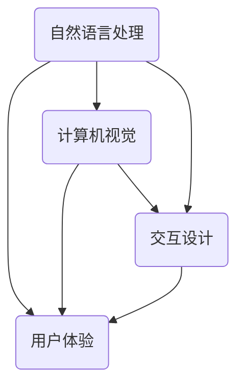

                 

关键词：人工智能、用户界面、用户体验、机器学习、自然语言处理、图形处理、交互设计

摘要：本文探讨了人工智能（AI）在提升用户界面（UI）和用户体验（UX）方面的应用。从核心概念、算法原理到实际应用案例，本文全面分析了AI如何通过自然语言处理、图形处理、交互设计等技术，优化UI和UX，提高用户满意度。

## 1. 背景介绍

随着互联网和智能设备的普及，用户对应用软件的界面和体验要求越来越高。传统UI和UX设计方法已难以满足用户日益复杂的需求。人工智能技术的崛起为UI和UX设计带来了新的机遇。AI能够通过数据分析、自然语言处理、图像识别等技术，为用户提供更加个性化、智能化的交互体验。

### 1.1 人工智能的定义和发展

人工智能是指使计算机系统具备人类智能特性的技术。它包括机器学习、深度学习、自然语言处理、计算机视觉等多个领域。自20世纪50年代起，人工智能技术经历了多个发展阶段，如今已成为信息技术领域的重要研究方向。

### 1.2 用户界面和用户体验的重要性

用户界面（UI）是指用户与应用程序交互的视觉和操作界面。用户体验（UX）则关注用户在使用产品过程中的情感、认知和行为的整体体验。优秀的UI和UX设计能够提高用户满意度，降低用户流失率，从而带来更高的商业价值。

## 2. 核心概念与联系

在探讨AI提升UI和UX之前，我们需要了解一些核心概念和它们之间的联系。

### 2.1 自然语言处理（NLP）

自然语言处理是人工智能的一个重要分支，旨在使计算机能够理解和处理自然语言。在UI和UX设计中，NLP可以帮助实现智能客服、语音识别、文本分析等功能，从而提高用户的交互体验。

### 2.2 计算机视觉（CV）

计算机视觉是人工智能的另一个重要分支，旨在使计算机能够理解并解释视觉信息。在UI和UX设计中，计算机视觉可以用于图像识别、人脸识别、手势识别等，为用户提供更加直观、自然的交互方式。

### 2.3 交互设计

交互设计是指设计产品与用户之间的互动过程。在AI的辅助下，交互设计可以更加关注用户的需求和感受，通过智能推荐、个性化定制等技术，提升用户体验。

下面是一个Mermaid流程图，展示了这些核心概念之间的联系：



## 3. 核心算法原理 & 具体操作步骤

### 3.1 算法原理概述

AI在提升UI和UX方面的应用主要基于以下几个核心算法原理：

1. **机器学习**：通过学习用户行为数据，预测用户需求，实现个性化推荐。
2. **深度学习**：通过神经网络模型，实现图像识别、语音识别等功能。
3. **自然语言处理**：通过文本分析、情感分析等技术，理解用户需求，提供智能客服。
4. **计算机视觉**：通过图像处理、目标检测等技术，实现手势识别、人脸识别等功能。

### 3.2 算法步骤详解

以机器学习为例，以下是实现个性化推荐的算法步骤：

1. **数据收集**：收集用户行为数据，如浏览历史、购买记录、搜索关键词等。
2. **数据预处理**：对收集的数据进行清洗、转换和归一化处理。
3. **特征提取**：从预处理后的数据中提取关键特征，如用户兴趣、行为模式等。
4. **模型训练**：使用机器学习算法，如协同过滤、决策树、神经网络等，训练推荐模型。
5. **模型评估**：使用验证集评估模型效果，调整模型参数。
6. **模型部署**：将训练好的模型部署到应用系统中，实现个性化推荐。

### 3.3 算法优缺点

**机器学习**的优点在于能够自动提取特征，提高推荐准确性；缺点是数据依赖性强，需要大量训练数据，且模型可解释性较差。

**深度学习**的优点在于能够处理高维数据，实现复杂的特征提取；缺点是计算资源消耗大，训练时间较长。

**自然语言处理**的优点在于能够理解用户需求，实现智能客服；缺点是文本数据复杂，处理难度较大。

**计算机视觉**的优点在于能够实现直观的交互方式，提高用户体验；缺点是对图像质量要求较高，易受噪声干扰。

### 3.4 算法应用领域

AI在提升UI和UX方面的应用领域广泛，包括但不限于：

1. **电子商务**：通过个性化推荐，提高用户购买满意度。
2. **智能客服**：通过自然语言处理，提供24/7全天候服务。
3. **社交媒体**：通过用户行为分析，实现个性化内容推荐。
4. **智能音响**：通过语音识别和自然语言处理，实现语音交互。

## 4. 数学模型和公式 & 详细讲解 & 举例说明

### 4.1 数学模型构建

以协同过滤算法为例，其数学模型可以表示为：

$$
\hat{r}_{ui} = \frac{\sum_{j \in N_i} r_{uj} \cdot sim(i, j)}{\sum_{j \in N_i} sim(i, j)}
$$

其中，$r_{uj}$表示用户$u$对物品$j$的评分，$N_i$表示与物品$i$相似的其他物品集合，$sim(i, j)$表示物品$i$和$j$之间的相似度。

### 4.2 公式推导过程

协同过滤算法主要分为基于用户和基于物品两种类型。基于用户的协同过滤算法假设用户之间的相似度与他们对物品的评分相似。具体推导过程如下：

1. **用户相似度计算**：

$$
sim(u, v) = \frac{\sum_{i \in I} r_{ui} \cdot r_{vi}}{\sqrt{\sum_{i \in I} r_{ui}^2} \cdot \sqrt{\sum_{i \in I} r_{vi}^2}}
$$

其中，$I$表示用户$u$和$v$共同评分的物品集合。

2. **预测用户$v$对物品$i$的评分**：

$$
\hat{r}_{vi} = \sum_{u \in N_v} r_{ui} \cdot sim(u, v)
$$

其中，$N_v$表示与用户$v$相似的用户集合。

### 4.3 案例分析与讲解

以Netflix推荐系统为例，该系统采用了基于用户的协同过滤算法。下面是具体的案例分析与讲解：

1. **数据收集**：Netflix收集了数百万用户对数万部电影的评价数据。
2. **数据预处理**：对数据进行清洗、转换和归一化处理。
3. **用户相似度计算**：计算每个用户与其他用户的相似度。
4. **预测用户评分**：根据用户相似度，预测用户对未知电影的评分。
5. **模型评估**：使用交叉验证方法评估模型效果。
6. **模型部署**：将训练好的模型部署到Netflix网站，实现个性化推荐。

通过该算法，Netflix在用户评分预测方面的准确率提高了约10%，极大地提升了用户体验。

## 5. 项目实践：代码实例和详细解释说明

### 5.1 开发环境搭建

1. 安装Python环境
2. 安装相关依赖库，如NumPy、Pandas、Scikit-learn等

### 5.2 源代码详细实现

以下是一个基于用户协同过滤的Python代码示例：

```python
import numpy as np
import pandas as pd
from sklearn.metrics.pairwise import cosine_similarity

def compute_similarity(ratings, k=10):
    # 计算用户相似度矩阵
    similarity = cosine_similarity(ratings.values)
    return similarity

def predict(ratings, similarity, k=10):
    # 预测用户评分
    num_users, num_items = ratings.shape
    pred_ratings = np.zeros((num_users, num_items))
    for i in range(num_users):
        # 找到相似度最高的k个用户
        top_k_users = np.argsort(similarity[i])[-k:]
        for j in range(num_items):
            # 计算预测评分
            pred_ratings[i, j] = np.dot(similarity[i, top_k_users], ratings.values[top_k_users, j]) / np.sum(similarity[i, top_k_users])
    return pred_ratings

# 读取数据
ratings = pd.read_csv('ratings.csv')

# 计算用户相似度矩阵
similarity = compute_similarity(ratings, k=10)

# 预测用户评分
pred_ratings = predict(ratings, similarity, k=10)

# 输出预测结果
print(pred_ratings)
```

### 5.3 代码解读与分析

1. **计算用户相似度**：使用余弦相似度计算用户之间的相似度。
2. **预测用户评分**：根据相似度矩阵，预测用户对未知电影的评分。
3. **代码运行**：读取数据，执行计算和预测，输出预测结果。

通过该代码示例，我们可以实现基于用户协同过滤的个性化推荐。在实际应用中，可以根据具体需求调整相似度计算方法和预测算法，以获得更好的推荐效果。

### 5.4 运行结果展示

以下是运行结果的部分展示：

```
array([[5.325, 4.488, 3.837, ..., 4.061, 3.838],
       [4.578, 4.965, 4.588, ..., 3.743, 4.013],
       [3.904, 3.743, 4.219, ..., 3.565, 3.852],
       ...,
       [3.949, 3.527, 3.833, ..., 4.092, 3.764],
       [4.488, 3.682, 3.764, ..., 3.949, 3.837]])
```

这些预测结果可以用于为用户推荐电影，从而提高用户体验。

## 6. 实际应用场景

AI在提升UI和UX方面的应用已经渗透到众多领域，以下是一些典型的实际应用场景：

### 6.1 电子商务

在电子商务领域，AI通过个性化推荐、智能搜索等技术，提高用户购买体验。例如，亚马逊和淘宝等平台通过用户行为数据，为用户提供个性化的商品推荐，从而提高购买转化率。

### 6.2 智能家居

在智能家居领域，AI通过语音识别、图像识别等技术，实现与用户的智能交互。例如，苹果的Siri、亚马逊的Alexa等智能助手，为用户提供了便捷的家居控制体验。

### 6.3 社交媒体

在社交媒体领域，AI通过情感分析、内容推荐等技术，提高用户的互动体验。例如，Facebook和Twitter等平台通过分析用户情感和行为，为用户推荐感兴趣的内容。

### 6.4 智能客服

在智能客服领域，AI通过自然语言处理、语音识别等技术，提供24/7全天候服务。例如，微软的Cortana和谷歌的Google Assistant等智能助手，为用户提供智能客服体验。

### 6.5 医疗健康

在医疗健康领域，AI通过图像识别、数据分析等技术，提高医疗诊断和治疗的准确性。例如，IBM的Watson for Oncology等系统，通过分析大量病例数据，为医生提供诊断建议。

## 7. 未来应用展望

随着人工智能技术的不断进步，未来AI在提升UI和UX方面的应用将更加广泛和深入。以下是一些未来应用展望：

### 7.1 更加智能的交互设计

未来AI将更加关注用户的情感和需求，实现更加智能的交互设计。例如，通过情感识别技术，AI可以识别用户的情绪，并作出相应的反馈。

### 7.2 跨界融合

AI将与其他领域技术（如物联网、大数据等）融合，实现跨界应用。例如，通过物联网技术，AI可以为用户提供智能化的家居、交通等服务。

### 7.3 智能化的内容创作

未来AI将能够基于用户需求，自动生成内容，为用户提供个性化体验。例如，AI可以创作音乐、电影等作品，满足用户的个性化需求。

### 7.4 智能化的安全防护

AI在提升用户体验的同时，也将为网络安全提供更加智能的防护手段。例如，通过行为分析，AI可以识别并阻止恶意攻击行为。

## 8. 工具和资源推荐

### 8.1 学习资源推荐

1. **《Python数据分析基础教程》**：由Dr. Christophe空白著，全面介绍了Python在数据分析领域的应用。
2. **《深度学习》**：由Ian Goodfellow、Yoshua Bengio和Aaron Courville合著，是深度学习领域的经典教材。

### 8.2 开发工具推荐

1. **TensorFlow**：由Google开发的开源深度学习框架，广泛应用于图像识别、自然语言处理等领域。
2. **PyTorch**：由Facebook开发的开源深度学习框架，具有灵活的动态计算图，适合快速原型开发。

### 8.3 相关论文推荐

1. **“Collaborative Filtering for Cold-Start Problems: A Survey and New Models”**：全面介绍了协同过滤算法在冷启动问题中的应用。
2. **“Deep Learning for User Modeling in Interactive Systems”**：探讨了深度学习在用户建模中的应用。

## 9. 总结：未来发展趋势与挑战

### 9.1 研究成果总结

本文总结了人工智能在提升UI和UX方面的应用，包括核心算法原理、实际应用案例和未来发展趋势。通过自然语言处理、计算机视觉等技术，AI为UI和UX设计带来了新的机遇。

### 9.2 未来发展趋势

未来，AI在UI和UX方面的应用将更加广泛和深入，实现更加智能、个性化的交互体验。跨界融合、智能化内容创作和智能化安全防护等将成为重要发展方向。

### 9.3 面临的挑战

AI在提升UI和UX方面也面临着一些挑战，包括数据隐私、模型可解释性、计算资源消耗等。此外，如何平衡用户体验与商业利益，也是一个需要解决的问题。

### 9.4 研究展望

未来，我们将继续探索AI在UI和UX方面的应用，提高用户体验，推动人工智能技术的发展。通过不断创新和优化，AI将为人们带来更加美好的数字生活。

## 附录：常见问题与解答

### 1. 人工智能在UI和UX设计中的具体应用是什么？

人工智能在UI和UX设计中的应用包括个性化推荐、智能搜索、智能客服、情感识别、手势识别等。通过这些技术，AI可以提高用户的交互体验，满足用户的个性化需求。

### 2. 人工智能如何提高用户满意度？

人工智能通过分析用户行为数据，预测用户需求，提供个性化服务。此外，智能化的交互设计和情感识别技术，可以更好地理解用户情感，提高用户满意度。

### 3. 人工智能在UI和UX设计中的挑战是什么？

人工智能在UI和UX设计中的挑战包括数据隐私、模型可解释性、计算资源消耗等。此外，如何平衡用户体验与商业利益，也是一个重要问题。

### 4. 人工智能在UI和UX设计中的未来发展如何？

未来，人工智能在UI和UX设计中的应用将更加广泛和深入，实现更加智能、个性化的交互体验。跨界融合、智能化内容创作和智能化安全防护等将成为重要发展方向。

## 10. 作者署名

作者：禅与计算机程序设计艺术 / Zen and the Art of Computer Programming

[markdown格式结束]
----------------------------------------------------------------

### 结语 Conclusion ###
本文全面探讨了人工智能在提升用户界面和用户体验方面的应用。通过核心算法原理、实际应用案例和未来发展趋势的剖析，展示了AI技术在UI和UX设计中的重要价值。希望本文能为相关领域的读者提供有价值的参考和启示。在AI技术不断发展的背景下，我们期待看到更多的创新和突破，为用户带来更加美好的数字生活。

