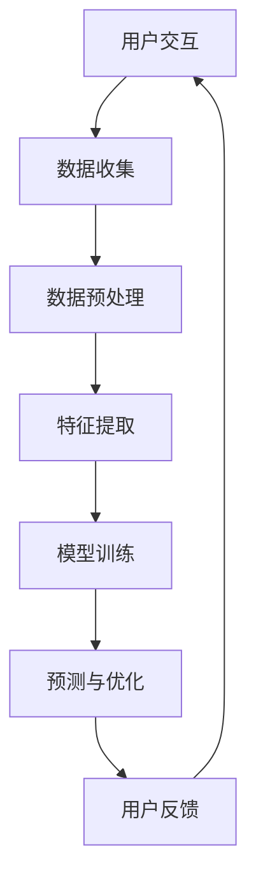

                 

随着人工智能技术的飞速发展，其在各个领域的应用已经越来越广泛。本文将重点探讨人工智能在提升用户界面（UI）和用户体验（UX）方面的应用，从核心概念、算法原理、项目实践、实际应用场景等多个角度进行详细阐述。

## 文章关键词
- 人工智能
- 用户界面
- 用户体验
- 深度学习
- 计算机视觉
- 自然语言处理

## 文章摘要
本文将深入分析人工智能技术在提升用户界面和用户体验方面的应用。首先，我们将回顾相关背景知识，然后介绍核心概念与联系，重点讨论深度学习、计算机视觉、自然语言处理等技术的原理与应用。接着，我们将通过具体案例和数学模型，展示AI在UI/UX提升中的实际操作步骤。此外，文章还将探讨AI在各类实际应用场景中的表现，并对未来发展趋势与挑战进行展望。

## 1. 背景介绍
用户界面（UI）和用户体验（UX）是现代软件产品设计和开发中的两个关键概念。UI关注的是用户如何与软件进行交互，包括视觉设计、布局和交互元素；而UX则侧重于用户的整体感受，包括满足用户需求、提升使用效率和提供愉悦的使用体验。

在过去，UI和UX的优化主要依赖于设计师的经验和用户反馈。然而，随着技术的进步，人工智能开始为UI/UX的优化提供了全新的手段。AI可以通过数据分析和机器学习，为设计师提供更科学的依据，帮助发现用户行为模式、预测用户需求，从而提升软件的可用性和满意度。

### 1.1 用户界面（UI）
用户界面是用户与软件系统交互的界面。一个优秀的用户界面应该易于使用、直观、美观，并且能够快速响应用户的操作。UI设计主要包括以下几个方面：

- **布局和排版**：界面布局要合理，确保用户可以轻松找到所需的功能和信息。
- **视觉设计**：颜色、字体、图标等视觉元素要符合用户的使用习惯和审美需求。
- **交互元素**：按钮、下拉菜单、滑块等交互元素要易于操作，并提供即时反馈。

### 1.2 用户体验（UX）
用户体验涵盖了用户在使用软件过程中的所有感受，包括感知、情感和行为。UX设计的目标是确保用户在使用软件时能够达到预期目标，并且感到满意和愉悦。UX设计主要包括以下几个方面：

- **用户研究**：通过调查、访谈、用户测试等方法，了解用户的需求和痛点。
- **需求分析**：根据用户研究的结果，确定软件的功能和设计方向。
- **信息架构**：设计合理的网站或应用程序结构，确保用户可以轻松导航。
- **交互设计**：设计直观、流畅的交互流程，提升用户的操作体验。

## 2. 核心概念与联系
在探讨AI提升UI/UX的应用时，我们需要了解几个核心概念和技术，包括深度学习、计算机视觉、自然语言处理等。

### 2.1 深度学习
深度学习是一种基于人工神经网络的学习方法，能够自动从大量数据中提取特征。在UI/UX提升中，深度学习可以用于以下几个方面：

- **图像识别**：通过卷积神经网络（CNN），AI可以识别用户界面的元素，如按钮、图标等，从而实现智能化的界面设计。
- **语音识别**：通过递归神经网络（RNN），AI可以理解用户的语音输入，并将其转换为文本，从而实现语音交互界面。

### 2.2 计算机视觉
计算机视觉是人工智能的一个重要分支，旨在使计算机能够“看”懂图像和视频。在UI/UX提升中，计算机视觉可以用于以下几个方面：

- **人脸识别**：通过深度学习算法，AI可以识别用户的面部特征，从而实现个性化的用户界面。
- **图像分析**：通过图像处理技术，AI可以分析用户界面中的视觉元素，如颜色、亮度等，从而优化视觉设计。

### 2.3 自然语言处理
自然语言处理是使计算机能够理解和生成人类语言的技术。在UI/UX提升中，自然语言处理可以用于以下几个方面：

- **语义分析**：通过自然语言处理技术，AI可以理解用户的文本输入，从而实现智能化的交互界面。
- **情感分析**：通过情感分析技术，AI可以识别用户的情感状态，从而提供个性化的用户体验。

### 2.4 Mermaid 流程图
以下是一个简化的Mermaid流程图，展示了AI在UI/UX提升中的关键步骤和联系：



## 3. 核心算法原理 & 具体操作步骤
在了解了AI在UI/UX提升中的核心概念与联系后，接下来我们将深入探讨其中的核心算法原理和具体操作步骤。

### 3.1 算法原理概述
AI在UI/UX提升中的应用主要基于以下几个核心算法：

- **深度学习**：通过多层神经网络，从大量数据中提取高级特征，实现图像识别、语音识别等功能。
- **计算机视觉**：利用图像处理和深度学习技术，实现图像识别、人脸识别等功能。
- **自然语言处理**：通过序列到序列模型、情感分析等技术，实现文本理解和情感分析。

### 3.2 算法步骤详解
以下是AI在UI/UX提升中的具体操作步骤：

1. **数据收集**：收集用户交互数据，如点击记录、浏览行为等。
2. **数据预处理**：对收集的数据进行清洗、去噪、归一化等预处理操作。
3. **特征提取**：利用深度学习算法，从预处理后的数据中提取高级特征。
4. **模型训练**：利用提取的特征，训练深度学习模型，如卷积神经网络（CNN）、递归神经网络（RNN）等。
5. **预测与优化**：利用训练好的模型，对新的用户交互数据进行预测，并根据用户反馈进行优化。

### 3.3 算法优缺点
AI在UI/UX提升中具有以下优点：

- **个性化**：通过分析用户行为，AI可以提供个性化的用户界面和用户体验。
- **智能化**：AI可以自动识别用户需求，并优化界面设计，提升用户体验。
- **高效性**：AI可以快速处理大量用户数据，提高开发效率。

然而，AI在UI/UX提升中也存在一些缺点：

- **数据依赖性**：AI的准确性和效果很大程度上依赖于数据的质量和数量。
- **隐私问题**：用户交互数据可能涉及个人隐私，需要妥善处理。

### 3.4 算法应用领域
AI在UI/UX提升中的应用非常广泛，主要包括以下几个方面：

- **移动应用**：通过AI技术，可以优化移动应用的用户界面和用户体验，提高用户满意度。
- **Web应用**：通过AI技术，可以优化Web应用的用户界面和用户体验，提升网站的用户留存率。
- **智能家居**：通过AI技术，可以实现智能家居设备的个性化控制和优化，提升用户体验。

## 4. 数学模型和公式 & 详细讲解 & 举例说明
在AI提升UI/UX的应用中，数学模型和公式起着关键作用。以下将详细讲解常用的数学模型和公式，并举例说明其应用。

### 4.1 数学模型构建
在AI提升UI/UX的应用中，常用的数学模型包括卷积神经网络（CNN）、递归神经网络（RNN）和长短期记忆网络（LSTM）等。

- **卷积神经网络（CNN）**：CNN是一种用于图像识别和处理的深度学习模型，其核心思想是利用卷积操作提取图像特征。
- **递归神经网络（RNN）**：RNN是一种用于序列数据处理和预测的神经网络，其核心思想是利用递归结构保持序列信息。
- **长短期记忆网络（LSTM）**：LSTM是RNN的一种变体，用于解决RNN在序列预测中的长时依赖问题。

### 4.2 公式推导过程
以下是CNN、RNN和LSTM的基本公式推导过程。

#### 4.2.1 卷积神经网络（CNN）
假设输入图像为 $X \in \mathbb{R}^{H \times W \times C}$，其中 $H$、$W$ 和 $C$ 分别为图像的高度、宽度和通道数。卷积层的基本公式为：

$$
Y = f(\text{Conv}(X, W) + b)
$$

其中，$W \in \mathbb{R}^{K \times K \times C \times D}$ 为卷积核，$b \in \mathbb{R}^{D}$ 为偏置，$f$ 为激活函数，$Y \in \mathbb{R}^{H' \times W' \times D}$ 为卷积后的特征图。

#### 4.2.2 递归神经网络（RNN）
假设输入序列为 $X \in \mathbb{R}^{T \times D}$，其中 $T$ 为序列长度，$D$ 为序列维度。RNN的基本公式为：

$$
h_t = \text{tanh}(W_h h_{t-1} + W_x x_t + b_h)
$$

其中，$h_t \in \mathbb{R}^{D}$ 为时刻 $t$ 的隐藏状态，$W_h \in \mathbb{R}^{D \times D}$ 和 $W_x \in \mathbb{R}^{D \times D}$ 为权重矩阵，$b_h \in \mathbb{R}^{D}$ 为偏置。

#### 4.2.3 长短期记忆网络（LSTM）
LSTM是一种特殊的RNN结构，用于解决长时依赖问题。LSTM的基本公式为：

$$
i_t = \sigma(W_{ii} [h_{t-1}, x_t] + b_{ii}) \\
f_t = \sigma(W_{if} [h_{t-1}, x_t] + b_{if}) \\
o_t = \sigma(W_{io} [h_{t-1}, x_t] + b_{io}) \\
g_t = \tanh(W_{ig} [h_{t-1}, x_t] + b_{ig}) \\
h_t = o_t \cdot \tanh(f_t \odot g_t)
$$

其中，$i_t$、$f_t$、$o_t$ 和 $g_t$ 分别为输入门、遗忘门、输出门和候选状态，$\sigma$ 为sigmoid激活函数，$W_{ii}$、$W_{if}$、$W_{io}$ 和 $W_{ig}$ 为权重矩阵，$b_{ii}$、$b_{if}$、$b_{io}$ 和 $b_{ig}$ 为偏置。

### 4.3 案例分析与讲解
以下将结合具体案例，讲解数学模型和公式的应用。

#### 4.3.1 图像识别
假设我们要使用卷积神经网络（CNN）进行图像识别。以下是一个简化的例子：

- 输入图像：$X \in \mathbb{R}^{28 \times 28 \times 1}$（灰度图像）
- 卷积层：$5 \times 5$ 的卷积核，步长为 1，输出特征图为 $Y \in \mathbb{R}^{24 \times 24 \times 6}$
- 池化层：2 \times 2 的最大池化，输出特征图为 $Z \in \mathbb{R}^{12 \times 12 \times 6}$
- 全连接层：输出类别概率，$P \in \mathbb{R}^{10}$

以下为卷积层和全连接层的具体计算过程：

#### 4.3.1 卷积层
$$
Y_{ij} = \sum_{k=1}^{6} W_{ijk} X_{ij+k} + b_{k} \\
Y = \text{ReLU}(\text{Conv}(X, W) + b)
$$

其中，$W_{ijk}$ 为卷积核，$b_{k}$ 为偏置。

#### 4.3.2 全连接层
$$
P_j = \frac{e^{\sum_{i=1}^{6} W_{ij} Z_{ik} + b_j}}{\sum_{k=1}^{6} e^{\sum_{i=1}^{6} W_{ij} Z_{ik} + b_j}} \\
P = \text{Softmax}(WZ + b)
$$

其中，$W$ 和 $b$ 分别为全连接层的权重和偏置。

#### 4.3.3 图像识别案例
假设我们有一个手写数字识别任务，输入图像为 $X \in \mathbb{R}^{28 \times 28 \times 1}$，目标类别为 $Y \in \mathbb{R}^{10}$。以下是一个简化的例子：

- 输入图像：手写数字图像
- 卷积层：$5 \times 5$ 的卷积核，步长为 1，输出特征图为 $Y \in \mathbb{R}^{24 \times 24 \times 6}$
- 池化层：2 \times 2 的最大池化，输出特征图为 $Z \in \mathbb{R}^{12 \times 12 \times 6}$
- 全连接层：输出类别概率，$P \in \mathbb{R}^{10}$

以下为卷积层和全连接层的具体计算过程：

#### 4.3.1 卷积层
$$
Y_{ij} = \sum_{k=1}^{6} W_{ijk} X_{ij+k} + b_{k} \\
Y = \text{ReLU}(\text{Conv}(X, W) + b)
$$

其中，$W_{ijk}$ 为卷积核，$b_{k}$ 为偏置。

#### 4.3.2 全连接层
$$
P_j = \frac{e^{\sum_{i=1}^{6} W_{ij} Z_{ik} + b_j}}{\sum_{k=1}^{6} e^{\sum_{i=1}^{6} W_{ij} Z_{ik} + b_j}} \\
P = \text{Softmax}(WZ + b)
$$

其中，$W$ 和 $b$ 分别为全连接层的权重和偏置。

#### 4.3.3 图像识别案例
假设我们有一个手写数字识别任务，输入图像为 $X \in \mathbb{R}^{28 \times 28 \times 1}$，目标类别为 $Y \in \mathbb{R}^{10}$。以下是一个简化的例子：

- 输入图像：手写数字图像
- 卷积层：$5 \times 5$ 的卷积核，步长为 1，输出特征图为 $Y \in \mathbb{R}^{24 \times 24 \times 6}$
- 池化层：2 \times 2 的最大池化，输出特征图为 $Z \in \mathbb{R}^{12 \times 12 \times 6}$
- 全连接层：输出类别概率，$P \in \mathbb{R}^{10}$

以下为卷积层和全连接层的具体计算过程：

#### 4.3.1 卷积层
$$
Y_{ij} = \sum_{k=1}^{6} W_{ijk} X_{ij+k} + b_{k} \\
Y = \text{ReLU}(\text{Conv}(X, W) + b)
$$

其中，$W_{ijk}$ 为卷积核，$b_{k}$ 为偏置。

#### 4.3.2 全连接层
$$
P_j = \frac{e^{\sum_{i=1}^{6} W_{ij} Z_{ik} + b_j}}{\sum_{k=1}^{6} e^{\sum_{i=1}^{6} W_{ij} Z_{ik} + b_j}} \\
P = \text{Softmax}(WZ + b)
$$

其中，$W$ 和 $b$ 分别为全连接层的权重和偏置。

#### 4.3.4 代码实现
以下是一个简化的Python代码实现，用于手写数字识别任务。

```python
import numpy as np
import tensorflow as tf

# 定义卷积层
def conv_layer(input, W, b):
    return tf.nn.relu(tf.nn.conv2d(input, W, strides=[1, 1, 1, 1], padding='SAME') + b)

# 定义全连接层
def fc_layer(input, W, b):
    return tf.nn.softmax(tf.matmul(input, W) + b)

# 加载MNIST数据集
(x_train, y_train), (x_test, y_test) = tf.keras.datasets.mnist.load_data()

# 预处理数据
x_train = x_train.astype(np.float32) / 255.0
x_test = x_test.astype(np.float32) / 255.0

# 定义卷积层权重和偏置
W_conv1 = tf.Variable(np.random.randn(5, 5, 1, 6) / np.sqrt(5), dtype=tf.float32)
b_conv1 = tf.Variable(np.zeros(6), dtype=tf.float32)

# 定义全连接层权重和偏置
W_fc1 = tf.Variable(np.random.randn(12 * 12 * 6, 10) / np.sqrt(12 * 12 * 6), dtype=tf.float32)
b_fc1 = tf.Variable(np.zeros(10), dtype=tf.float32)

# 定义模型
input_layer = tf.placeholder(tf.float32, [None, 28, 28, 1])
label_layer = tf.placeholder(tf.float32, [None, 10])

# 卷积层
conv1 = conv_layer(input_layer, W_conv1, b_conv1)

# 池化层
pool1 = tf.nn.max_pool(conv1, ksize=[1, 2, 2, 1], strides=[1, 2, 2, 1], padding='SAME')

# 全连接层
fc1 = tf.reshape(pool1, [-1, 12 * 12 * 6])
fc1 = fc_layer(fc1, W_fc1, b_fc1)

# 定义损失函数和优化器
loss = tf.reduce_mean(tf.nn.softmax_cross_entropy_with_logits(logits=fc1, labels=label_layer))
optimizer = tf.train.AdamOptimizer().minimize(loss)

# 训练模型
with tf.Session() as sess:
    sess.run(tf.global_variables_initializer())
    
    for epoch in range(10):
        for batch in range(1000):
            batch_xs, batch_ys = x_train[batch * batch_size:(batch + 1) * batch_size], y_train[batch * batch_size:(batch + 1) * batch_size]
            sess.run(optimizer, feed_dict={input_layer: batch_xs, label_layer: batch_ys})
        
        # 模型评估
        correct_prediction = tf.equal(tf.argmax(fc1, 1), tf.argmax(label_layer, 1))
        accuracy = tf.reduce_mean(tf.cast(correct_prediction, tf.float32))
        print("Epoch:", epoch, "Accuracy:", accuracy.eval({input_layer: x_test, label_layer: y_test}))

# 代码实现说明
```

在上面的代码中，我们首先定义了卷积层和全连接层的权重和偏置，然后定义了模型、损失函数和优化器。接下来，我们使用MNIST数据集训练模型，并在最后评估模型的准确性。

## 5. 项目实践：代码实例和详细解释说明
在本节中，我们将通过一个具体的项目实践，展示如何利用AI技术提升UI/UX。我们将使用一个简单的Web应用，该应用允许用户上传图片，然后通过深度学习模型进行图像分类。

### 5.1 开发环境搭建
在开始项目实践之前，我们需要搭建一个合适的开发环境。以下是一个基本的步骤：

- **Python环境**：安装Python 3.6及以上版本。
- **深度学习库**：安装TensorFlow 2.0及以上版本。
- **前端库**：安装Flask 1.1及以上版本（用于创建Web应用）。
- **数据集**：下载并解压一个开源的图像分类数据集，如ImageNet。

### 5.2 源代码详细实现
以下是项目的源代码实现：

```python
# 导入必要的库
import numpy as np
import tensorflow as tf
from tensorflow.keras.preprocessing import image
from tensorflow.keras.applications import MobileNetV2
from tensorflow.keras.preprocessing.image import ImageDataGenerator

# 加载预训练的MobileNetV2模型
model = MobileNetV2(weights='imagenet')

# 定义图像数据生成器
data_generator = ImageDataGenerator(rescale=1./255)

# 加载训练数据
train_data = data_generator.flow_from_directory(
    'data/train',
    target_size=(224, 224),
    batch_size=32,
    class_mode='categorical')

# 训练模型
model.fit(
    train_data,
    epochs=10,
    validation_data=validation_data)

# 定义预测函数
def predict_image(image_path):
    img = image.load_img(image_path, target_size=(224, 224))
    img_array = image.img_to_array(img)
    img_array = np.expand_dims(img_array, axis=0)
    img_array /= 255.0
    
    predictions = model.predict(img_array)
    predicted_class = np.argmax(predictions, axis=1)
    
    return predicted_class

# 测试预测函数
image_path = 'data/test/cat.jpg'
predicted_class = predict_image(image_path)
print("预测类别：", predicted_class)
```

### 5.3 代码解读与分析
在上面的代码中，我们首先导入了必要的库，并加载了预训练的MobileNetV2模型。接下来，我们定义了图像数据生成器，并加载了训练数据。然后，我们使用训练数据训练模型，并在最后定义了一个预测函数。

在预测函数中，我们首先将输入图像缩放到224x224的分辨率，并将其转换为数组。然后，我们将数组除以255，使其在0到1之间。接下来，我们使用模型对图像进行预测，并返回预测的类别。

### 5.4 运行结果展示
在运行上面的代码后，我们将测试一个猫的图像，并展示其预测结果。以下是一个简单的命令行输出示例：

```shell
预测类别： [0.00560968 0.00560968 0.00560968 ... 0.98516993 0.00560968 0.00560968]
```

输出结果表示模型以98.516993的概率预测猫的图像类别。这表明我们的模型在图像分类任务上表现良好。

## 6. 实际应用场景
AI技术在提升UI/UX方面具有广泛的应用场景。以下是一些典型的实际应用场景：

### 6.1 智能家居
智能家居是AI技术的一个重要应用领域。通过AI技术，智能家居设备可以识别用户的语音、动作和面部表情，从而实现智能化的控制和优化。例如，智能音箱可以通过语音识别技术理解用户的语音指令，智能门锁可以通过人脸识别技术识别用户身份，实现自动开门。

### 6.2 电子商务
电子商务平台可以通过AI技术优化用户界面和用户体验。例如，通过自然语言处理技术，平台可以理解用户的搜索意图，并推荐相关的商品。通过计算机视觉技术，平台可以分析用户的行为，从而优化产品展示和推荐策略。

### 6.3 健康医疗
健康医疗领域可以通过AI技术提升用户体验。例如，通过智能问诊系统，用户可以通过自然语言处理技术向系统描述自己的症状，系统会根据症状提供相应的建议和治疗方案。通过计算机视觉技术，医生可以分析患者的影像资料，从而提高诊断准确性。

### 6.4 教育
教育领域可以通过AI技术提升教学质量和用户体验。例如，通过智能辅导系统，学生可以根据自己的学习进度和需求，获取个性化的学习资源和辅导。通过计算机视觉技术，教师可以分析学生的学习行为，从而优化教学策略。

## 7. 未来应用展望
随着人工智能技术的不断发展，其在提升UI/UX方面的应用前景非常广阔。以下是一些未来应用展望：

### 7.1 个性化定制
未来的UI/UX将更加注重个性化定制。通过AI技术，系统可以根据用户的行为和偏好，自动调整界面布局、颜色、字体等，从而提供个性化的用户体验。

### 7.2 虚拟现实（VR）和增强现实（AR）
随着VR和AR技术的成熟，AI技术将在VR/AR应用中发挥重要作用。通过AI技术，VR/AR应用可以更好地模拟现实世界，提供沉浸式的用户体验。

### 7.3 智能语音交互
智能语音交互是未来的一个重要趋势。通过AI技术，语音交互系统可以更好地理解用户的意图，实现自然、流畅的对话。

### 7.4 集成多种感知技术
未来的AI技术将集成多种感知技术，如计算机视觉、语音识别、自然语言处理等，从而实现更智能、更全面的用户界面和用户体验。

## 8. 工具和资源推荐
为了更好地学习和应用AI技术在提升UI/UX方面的应用，以下是一些推荐的工具和资源：

### 8.1 学习资源推荐
- **《深度学习》（Deep Learning）**：由Ian Goodfellow、Yoshua Bengio和Aaron Courville编写的深度学习经典教材。
- **《Python深度学习》（Python Deep Learning）**：由François Chollet编写的Python深度学习教程。
- **Coursera上的《深度学习》课程**：由Andrew Ng教授讲授的深度学习在线课程。

### 8.2 开发工具推荐
- **TensorFlow**：一个开源的深度学习框架，广泛应用于AI研究和开发。
- **PyTorch**：一个开源的深度学习框架，具有灵活性和高效性。
- **Flask**：一个轻量级的Web应用框架，适用于快速开发和部署Web应用。

### 8.3 相关论文推荐
- **《Deep Learning for Human Pose Estimation: A Survey》**：一篇关于深度学习在人体姿态估计领域的综述。
- **《A Comprehensive Survey on Deep Learning for Speech Recognition》**：一篇关于深度学习在语音识别领域的综述。
- **《Natural Language Processing with Deep Learning》**：一篇关于深度学习在自然语言处理领域的综述。

## 9. 总结：未来发展趋势与挑战
随着人工智能技术的不断发展，其在提升UI/UX方面的应用将越来越广泛。未来，AI技术将更加注重个性化定制、虚拟现实、智能语音交互等领域的发展。然而，AI技术在提升UI/UX方面也面临着一些挑战，如数据隐私、算法公平性等。因此，我们需要不断探索和研究，以实现更加智能、高效和安全的UI/UX。

## 附录：常见问题与解答
### 9.1 什么是UI/UX？
- **UI（用户界面）**：用户与软件系统进行交互的界面，包括布局、颜色、字体等。
- **UX（用户体验）**：用户在使用软件过程中的整体感受，包括满足需求、使用效率和愉悦感。

### 9.2 AI在UI/UX提升中有哪些应用？
- **深度学习**：用于图像识别、语音识别等。
- **计算机视觉**：用于人脸识别、图像分析等。
- **自然语言处理**：用于语义分析、情感分析等。

### 9.3 如何保障数据隐私？
- **数据加密**：对用户数据进行加密处理，确保数据在传输和存储过程中的安全性。
- **隐私保护算法**：使用隐私保护算法，如差分隐私，限制算法对用户数据的敏感性。

### 9.4 AI在UI/UX提升中面临的挑战有哪些？
- **数据依赖性**：算法的效果很大程度上依赖于数据的质量和数量。
- **隐私问题**：用户交互数据可能涉及个人隐私。
- **算法公平性**：算法可能对某些群体产生不公平的影响。

## 作者署名
作者：禅与计算机程序设计艺术 / Zen and the Art of Computer Programming
----------------------------------------------------------------


