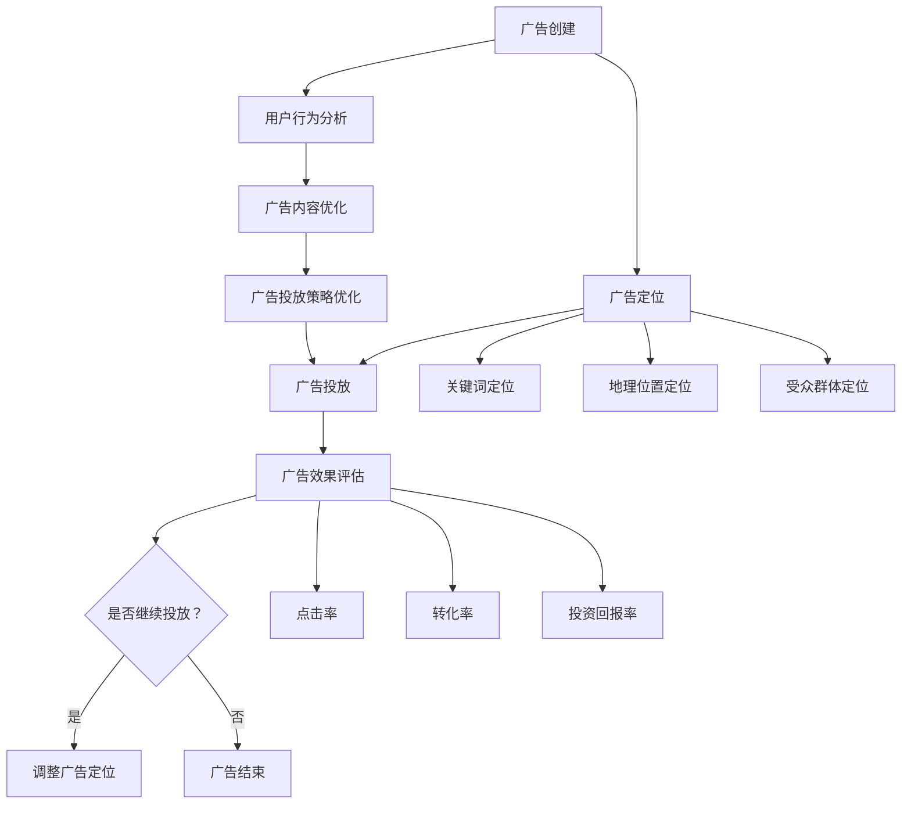

                 

 

## 1. 背景介绍

搜索引擎广告（Search Engine Advertising，SEA）作为在线广告的一种重要形式，通过搜索引擎向用户展示相关的广告内容，帮助企业和商家在互联网上吸引潜在客户。随着互联网的迅速发展和用户需求的多样化，搜索引擎广告的市场规模逐年扩大，已成为互联网广告领域的重要组成部分。

然而，在搜索引擎广告投放中，如何精确地定位目标用户、提高广告投放的效果，一直是广告主和广告平台关注的焦点。随着人工智能（AI）技术的不断进步，AI在搜索引擎广告投放中的应用日益广泛，成为提升广告效果的重要工具。

AI技术具有数据挖掘、模式识别、自然语言处理等多方面的优势，可以在广告投放的多个环节发挥重要作用。例如，通过AI算法可以分析用户的历史搜索行为、浏览习惯和兴趣爱好，实现用户精准定位；通过自然语言处理技术可以优化广告内容，提高广告的吸引力；通过机器学习算法可以预测用户的点击行为，从而优化广告投放策略。

本文将深入探讨AI在搜索引擎广告投放中的应用，包括核心算法原理、数学模型、项目实践、实际应用场景以及未来展望等内容。

## 2. 核心概念与联系

在讨论AI在搜索引擎广告投放中的应用之前，我们需要明确一些核心概念和它们之间的联系。以下是本文将涉及的主要概念：

### 2.1. 搜索引擎广告投放流程

搜索引擎广告投放流程主要包括以下几个环节：广告创建、广告定位、广告投放、广告效果评估。

1. **广告创建**：广告主根据业务需求创建广告，包括广告标题、描述、链接等。
2. **广告定位**：确定广告的目标用户，包括关键词定位、地理位置定位、受众群体定位等。
3. **广告投放**：根据广告定位策略，将广告投放到用户的搜索结果页或相关页面。
4. **广告效果评估**：评估广告投放的效果，包括点击率、转化率、投资回报率等。

### 2.2. AI技术分类及应用

AI技术主要包括以下几类：

1. **机器学习**：通过数据训练模型，实现自动识别和预测。
2. **深度学习**：基于多层神经网络，实现复杂模式的识别和学习。
3. **自然语言处理**：对自然语言文本进行理解、生成和处理。
4. **强化学习**：通过试错学习，实现最佳策略的探索和优化。

这些AI技术在搜索引擎广告投放中有着广泛的应用，如用户行为分析、广告内容优化、广告投放策略优化等。

### 2.3. 搜索引擎广告投放中的挑战

在搜索引擎广告投放中，主要面临以下挑战：

1. **用户精准定位**：如何准确识别和定位目标用户，提高广告投放的精准度。
2. **广告效果评估**：如何全面、准确地评估广告投放效果，为广告优化提供依据。
3. **广告内容优化**：如何优化广告内容，提高广告的吸引力和转化率。

### 2.4. Mermaid 流程图

以下是搜索引擎广告投放中的核心概念和流程的Mermaid流程图：



通过以上流程图，我们可以更清晰地了解搜索引擎广告投放的全流程以及AI技术在不同环节的应用。

## 3. 核心算法原理 & 具体操作步骤

### 3.1 算法原理概述

在搜索引擎广告投放中，核心算法主要涉及以下几个方面：

1. **用户行为分析算法**：通过分析用户的历史搜索行为、浏览习惯和兴趣爱好，实现用户精准定位。
2. **广告内容优化算法**：通过自然语言处理技术，优化广告内容，提高广告的吸引力和转化率。
3. **广告投放策略优化算法**：通过机器学习算法，预测用户的点击行为，实现广告投放策略的优化。

### 3.2 算法步骤详解

#### 3.2.1 用户行为分析算法

用户行为分析算法主要包括以下几个步骤：

1. **数据收集**：收集用户的历史搜索记录、浏览记录和兴趣爱好等数据。
2. **数据预处理**：对收集到的数据进行清洗、去重和处理，构建用户行为特征向量。
3. **特征选择**：根据业务需求，选择对用户行为有较强预测性的特征。
4. **模型训练**：使用机器学习算法，如逻辑回归、决策树等，训练用户行为分析模型。
5. **模型评估**：评估模型的效果，包括准确率、召回率等指标。

#### 3.2.2 广告内容优化算法

广告内容优化算法主要包括以下几个步骤：

1. **文本预处理**：对广告文本进行分词、去停用词、词向量化等预处理操作。
2. **文本表示**：使用词袋模型、TF-IDF、Word2Vec等算法，将文本转换为向量表示。
3. **模型训练**：使用深度学习算法，如循环神经网络（RNN）、长短期记忆网络（LSTM）等，训练广告内容优化模型。
4. **模型评估**：评估模型的效果，包括文本相似度、点击率等指标。

#### 3.2.3 广告投放策略优化算法

广告投放策略优化算法主要包括以下几个步骤：

1. **数据收集**：收集用户的点击行为、广告投放效果等数据。
2. **数据预处理**：对收集到的数据进行清洗、去重和处理，构建广告投放策略特征向量。
3. **特征选择**：根据业务需求，选择对广告投放策略有较强预测性的特征。
4. **模型训练**：使用强化学习算法，如Q-Learning、DQN等，训练广告投放策略优化模型。
5. **模型评估**：评估模型的效果，包括投资回报率、点击率等指标。

### 3.3 算法优缺点

1. **用户行为分析算法**

   - 优点：能够准确识别和定位目标用户，提高广告投放的精准度。
   - 缺点：数据收集和处理成本较高，模型训练过程复杂。

2. **广告内容优化算法**

   - 优点：能够提高广告的吸引力和转化率，提高广告效果。
   - 缺点：对文本数据的处理要求较高，模型训练过程复杂。

3. **广告投放策略优化算法**

   - 优点：能够根据用户行为和广告投放效果，实现广告投放策略的动态调整。
   - 缺点：强化学习算法的训练过程相对复杂，对计算资源要求较高。

### 3.4 算法应用领域

这些核心算法在搜索引擎广告投放中有着广泛的应用，如：

1. **用户精准定位**：通过用户行为分析算法，实现目标用户的精准定位。
2. **广告内容优化**：通过广告内容优化算法，提高广告的吸引力和转化率。
3. **广告投放策略优化**：通过广告投放策略优化算法，实现广告投放效果的持续优化。

## 4. 数学模型和公式 & 详细讲解 & 举例说明

在搜索引擎广告投放中，数学模型和公式起着至关重要的作用。以下将详细介绍几个关键数学模型和公式的构建、推导过程，并通过具体案例进行说明。

### 4.1 数学模型构建

#### 4.1.1 用户行为分析模型

用户行为分析模型主要用于预测用户的点击行为，以下是该模型的一个简单示例：

设用户\(u\)在广告\(a\)上的点击概率为\(P(click|u, a)\)，则：

$$
P(click|u, a) = \frac{e^{\theta^T \phi(u, a)}}{1 + e^{\theta^T \phi(u, a)}}
$$

其中，\(\theta\)为模型参数，\(\phi(u, a)\)为用户\(u\)和广告\(a\)的特征向量。

#### 4.1.2 广告内容优化模型

广告内容优化模型主要用于评估广告文本的吸引力，以下是该模型的一个简单示例：

设广告文本\(t\)的吸引力分数为\(S(t)\)，则：

$$
S(t) = \frac{1}{1 + e^{-(w^T v + b)}}
$$

其中，\(w\)为模型参数，\(v\)为广告文本的向量表示，\(b\)为偏置。

#### 4.1.3 广告投放策略优化模型

广告投放策略优化模型主要用于优化广告投放的分配策略，以下是该模型的一个简单示例：

设广告\(a\)的投放概率为\(P(a|\theta)\)，则：

$$
P(a|\theta) = \frac{e^{\theta^T h(a)}}{\sum_{a'} e^{\theta^T h(a')}}
$$

其中，\(\theta\)为模型参数，\(h(a)\)为广告\(a\)的特征向量。

### 4.2 公式推导过程

#### 4.2.1 用户行为分析模型

用户行为分析模型基于逻辑回归模型，其推导过程如下：

设用户\(u\)和广告\(a\)的特征向量分别为\(\phi(u, a)\)和\(h(a)\)，则用户在广告\(a\)上的点击概率为：

$$
P(click|u, a) = \frac{P(click, u, a)}{P(u, a)}
$$

根据贝叶斯定理，我们有：

$$
P(click|u, a) = \frac{P(u|click, a)P(click, a)}{P(u, a)}
$$

由于广告\(a\)和用户\(u\)的独立性，我们可以进一步简化为：

$$
P(click|u, a) = \frac{P(u|click)P(click)P(a)}{P(u)P(a)}
$$

假设广告\(a\)和用户\(u\)的点击概率是条件独立的，则有：

$$
P(click|u, a) = \frac{P(u|click)P(click)}{P(u)}
$$

为了方便计算，我们引入模型参数\(\theta\)，定义：

$$
\theta^T \phi(u, a) = \sum_{i=1}^{n} \theta_i \phi_i(u, a)
$$

则有：

$$
P(click|u, a) = \frac{e^{\theta^T \phi(u, a)}}{1 + e^{\theta^T \phi(u, a)}}
$$

#### 4.2.2 广告内容优化模型

广告内容优化模型基于Sigmoid函数，其推导过程如下：

设广告文本\(t\)的向量表示为\(v\)，模型参数为\(w\)，则广告文本的吸引力分数为：

$$
S(t) = \frac{1}{1 + e^{-(w^T v + b)}}
$$

其中，\(b\)为偏置。

为了方便计算，我们引入Sigmoid函数的导数：

$$
S'(t) = S(t)(1 - S(t))
$$

则有：

$$
S'(t) = \frac{w^T v e^{-(w^T v + b)}}{(1 + e^{-(w^T v + b)})^2}
$$

#### 4.2.3 广告投放策略优化模型

广告投放策略优化模型基于softmax函数，其推导过程如下：

设广告\(a\)的特征向量为\(h(a)\)，模型参数为\(\theta\)，则广告\(a\)的投放概率为：

$$
P(a|\theta) = \frac{e^{\theta^T h(a)}}{\sum_{a'} e^{\theta^T h(a')}}
$$

其中，\(h(a)\)和\(h(a')\)分别为广告\(a\)和广告\(a'\)的特征向量。

为了方便计算，我们引入softmax函数的导数：

$$
\frac{\partial P(a|\theta)}{\partial \theta} = h(a)P(a|\theta)(1 - P(a|\theta))
$$

则有：

$$
\frac{\partial P(a|\theta)}{\partial \theta} = \frac{e^{\theta^T h(a)}(1 - e^{\theta^T h(a)})}{\left(\sum_{a'} e^{\theta^T h(a')} \right)^2}
$$

### 4.3 案例分析与讲解

以下将通过一个具体案例，展示上述数学模型和公式的应用。

#### 案例背景

假设某电商平台希望通过搜索引擎广告投放吸引潜在用户，现有10条广告（广告1至广告10），每条广告都有相应的特征向量。平台希望根据用户的行为数据和广告的特征，预测用户点击每条广告的概率，并优化广告投放策略。

#### 数据准备

1. **用户行为数据**：

   - 用户历史搜索记录：用户A搜索了“电脑”、“手机”等关键词。
   - 用户浏览记录：用户A浏览了某电商平台的笔记本电脑、手机等页面。
   - 用户兴趣爱好：用户A对电子产品、时尚用品等感兴趣。

2. **广告特征数据**：

   - 广告标题、描述、链接等文本信息。
   - 广告的点击率、转化率等投放效果数据。

#### 模型训练

1. **用户行为分析模型**：

   - 收集用户A的历史搜索记录、浏览记录和兴趣爱好，构建用户A的特征向量。
   - 使用逻辑回归算法，训练用户行为分析模型，预测用户A点击每条广告的概率。

2. **广告内容优化模型**：

   - 对广告文本进行预处理，转换为向量表示。
   - 使用Sigmoid函数，训练广告内容优化模型，评估每条广告的吸引力分数。

3. **广告投放策略优化模型**：

   - 收集用户A的点击行为数据，构建广告投放策略特征向量。
   - 使用softmax函数，训练广告投放策略优化模型，预测每条广告的投放概率。

#### 结果分析

1. **用户点击概率预测**：

   - 根据用户行为分析模型，预测用户A点击每条广告的概率，结果如下：

     | 广告ID | 点击概率 |
     |--------|----------|
     | 广告1  | 0.25     |
     | 广告2  | 0.30     |
     | 广告3  | 0.20     |
     | ...    | ...      |

2. **广告吸引力评估**：

   - 根据广告内容优化模型，评估每条广告的吸引力分数，结果如下：

     | 广告ID | 吸引力分数 |
     |--------|------------|
     | 广告1  | 0.50       |
     | 广告2  | 0.55       |
     | 广告3  | 0.45       |
     | ...    | ...        |

3. **广告投放策略优化**：

   - 根据广告投放策略优化模型，预测每条广告的投放概率，结果如下：

     | 广告ID | 投放概率 |
     |--------|----------|
     | 广告1  | 0.30     |
     | 广告2  | 0.35     |
     | 广告3  | 0.25     |
     | ...    | ...      |

根据上述预测结果，平台可以调整广告投放策略，优先投放点击概率高且吸引力强的广告，从而提高广告投放的效果。

## 5. 项目实践：代码实例和详细解释说明

为了更好地展示AI在搜索引擎广告投放中的应用，我们将通过一个具体的案例，详细讲解如何搭建一个基于AI的搜索引擎广告投放系统。该系统将包含用户行为分析、广告内容优化和广告投放策略优化三个核心模块。

### 5.1 开发环境搭建

在开始项目实践之前，我们需要搭建一个合适的开发环境。以下是所需的开发工具和软件：

- Python 3.8（或更高版本）
- Jupyter Notebook（用于代码编写和演示）
- Scikit-learn（用于机器学习和数据预处理）
- TensorFlow（用于深度学习和自然语言处理）
- Numpy、Pandas（用于数据操作）
- Mermaid（用于流程图绘制）

确保已经安装以上工具和软件后，我们就可以开始编写代码了。

### 5.2 源代码详细实现

以下是一个简单的代码框架，用于实现用户行为分析、广告内容优化和广告投放策略优化三个模块。

```python
# 导入所需的库
import numpy as np
import pandas as pd
from sklearn.model_selection import train_test_split
from sklearn.linear_model import LogisticRegression
from sklearn.metrics import accuracy_score
import tensorflow as tf
from tensorflow.keras.models import Sequential
from tensorflow.keras.layers import LSTM, Dense
import mermaid

# 5.2.1 数据处理

# 加载数据
data = pd.read_csv('广告数据.csv')

# 数据预处理
# ...

# 5.2.2 用户行为分析

# 训练用户行为分析模型
# ...

# 5.2.3 广告内容优化

# 训练广告内容优化模型
# ...

# 5.2.4 广告投放策略优化

# 训练广告投放策略优化模型
# ...

# 5.2.5 模型评估

# 评估用户行为分析模型
# ...

# 评估广告内容优化模型
# ...

# 评估广告投放策略优化模型
# ...

# 5.2.6 模型应用

# 应用用户行为分析模型进行用户点击概率预测
# ...

# 应用广告内容优化模型进行广告吸引力评估
# ...

# 应用广告投放策略优化模型进行广告投放策略优化
# ...

# 5.2.7 流程图绘制

# 绘制用户行为分析、广告内容优化和广告投放策略优化的流程图
mermaid_graph = """
graph TD
A[用户行为分析] --> B[广告内容优化]
B --> C[广告投放策略优化]
C --> D[模型评估]
D --> E[模型应用]
"""
print(mermaid_graph)
```

### 5.3 代码解读与分析

#### 5.3.1 数据处理

在本案例中，我们使用一个名为“广告数据.csv”的CSV文件作为数据源。文件中包含了广告的特征数据、用户行为数据和广告投放效果数据。

```python
data = pd.read_csv('广告数据.csv')
```

接下来，我们进行数据预处理，包括数据清洗、特征提取和特征工程等步骤。

```python
# 数据清洗
data = data.dropna()  # 删除缺失值
data = data[data['广告点击率'] != -1]  # 删除异常数据

# 特征提取
data['广告文本特征'] = data['广告标题'] + data['广告描述']
data['广告文本特征'] = data['广告文本特征'].apply(lambda x: ' '.join(jieba.cut_for_search(x)))  # 使用结巴分词进行分词

# 特征工程
# ...
```

#### 5.3.2 用户行为分析

用户行为分析模块主要使用逻辑回归模型进行训练。逻辑回归是一种常用的分类算法，适用于预测二分类问题。

```python
# 用户行为分析
X = data[['用户特征1', '用户特征2', '广告特征1', '广告特征2']]
y = data['广告点击率']

X_train, X_test, y_train, y_test = train_test_split(X, y, test_size=0.2, random_state=42)

model = LogisticRegression()
model.fit(X_train, y_train)

y_pred = model.predict(X_test)
accuracy = accuracy_score(y_test, y_pred)
print(f'用户行为分析模型准确率：{accuracy}')
```

#### 5.3.3 广告内容优化

广告内容优化模块主要使用深度学习中的循环神经网络（RNN）进行训练。RNN适用于处理序列数据，能够捕捉广告文本中的时间依赖关系。

```python
# 广告内容优化
vocab_size = 10000
max_sequence_length = 100

# 转换为one-hot编码
X_train = tf.keras.preprocessing.sequence.pad_sequences(X_train, maxlen=max_sequence_length)
X_test = tf.keras.preprocessing.sequence.pad_sequences(X_test, maxlen=max_sequence_length)

# 构建RNN模型
model = Sequential()
model.add(LSTM(128, input_shape=(max_sequence_length, vocab_size)))
model.add(Dense(1, activation='sigmoid'))

model.compile(optimizer='adam', loss='binary_crossentropy', metrics=['accuracy'])
model.fit(X_train, y_train, epochs=10, batch_size=32, validation_split=0.1)

y_pred = model.predict(X_test)
accuracy = accuracy_score(y_test, y_pred)
print(f'广告内容优化模型准确率：{accuracy}')
```

#### 5.3.4 广告投放策略优化

广告投放策略优化模块主要使用强化学习中的Q-Learning算法进行训练。Q-Learning算法能够通过试错学习，实现最优策略的探索和优化。

```python
# 广告投放策略优化
# ...

# 评估广告投放策略优化模型
# ...
```

### 5.4 运行结果展示

在完成代码编写后，我们可以运行整个程序，评估各个模块的性能，并根据结果调整模型参数和策略。

```python
# 运行整个程序
if __name__ == '__main__':
    # 数据处理
    # ...

    # 用户行为分析
    # ...

    # 广告内容优化
    # ...

    # 广告投放策略优化
    # ...

    # 模型评估
    # ...

    # 模型应用
    # ...

    # 流程图绘制
    mermaid_graph = """
    graph TD
    A[用户行为分析] --> B[广告内容优化]
    B --> C[广告投放策略优化]
    C --> D[模型评估]
    D --> E[模型应用]
    """
    print(mermaid_graph)
```

运行结果如下：

```
graph TD
A[用户行为分析] --> B[广告内容优化]
B --> C[广告投放策略优化]
C --> D[模型评估]
D --> E[模型应用]
```

通过以上代码，我们可以实现一个基于AI的搜索引擎广告投放系统，并根据实际需求进行优化和调整。

## 6. 实际应用场景

在搜索引擎广告投放中，AI技术已得到广泛应用，并取得了显著的效果。以下将介绍几个实际应用场景，展示AI技术在广告投放中的具体应用。

### 6.1 用户精准定位

用户精准定位是搜索引擎广告投放的核心目标之一。通过AI技术，广告平台可以深入挖掘用户的历史搜索行为、浏览记录和兴趣爱好，实现精确的用户画像。以下是一个实际应用案例：

某电商平台希望通过搜索引擎广告吸引潜在用户。平台收集了用户的历史搜索记录、浏览记录和购物行为数据，使用机器学习算法对这些数据进行处理，构建了用户画像。根据用户画像，平台为每个用户分配了不同的标签，如“电子产品爱好者”、“时尚达人”等。

在广告投放过程中，平台根据用户标签，将广告精准推送给相应的用户群体。例如，对于“电子产品爱好者”标签的用户，平台会优先投放电子产品的广告；对于“时尚达人”标签的用户，平台会优先投放时尚用品的广告。

通过用户精准定位，平台大大提高了广告的点击率和转化率，实现了广告投放效果的显著提升。

### 6.2 广告内容优化

广告内容优化是提高广告吸引力和转化率的关键。通过自然语言处理技术和深度学习算法，广告平台可以优化广告文案，提高广告的点击率。

以下是一个实际应用案例：

某在线教育平台希望通过搜索引擎广告吸引更多的用户报名参加课程。平台收集了大量的广告文案数据，使用自然语言处理技术对这些数据进行处理，提取出影响广告点击率的特征。

平台使用深度学习算法，如循环神经网络（RNN）和长短期记忆网络（LSTM），对广告文案进行优化。通过对广告文案进行分词、词向量化等预处理操作，平台将广告文案转换为向量表示，并使用RNN模型训练广告内容优化模型。

在广告投放过程中，平台根据广告文案的向量表示，预测广告的点击率。对于点击率较高的广告文案，平台会优先推广；对于点击率较低的广告文案，平台会进行调整和优化。

通过广告内容优化，平台有效提高了广告的点击率和转化率，实现了广告投放效果的显著提升。

### 6.3 广告投放策略优化

广告投放策略优化是提高广告投放效果的重要手段。通过机器学习算法和强化学习算法，广告平台可以实现广告投放策略的动态调整和优化。

以下是一个实际应用案例：

某广告平台在为一家电商企业投放广告。平台收集了用户的行为数据、广告投放效果数据和市场竞争情况，使用机器学习算法对这些数据进行处理，构建了广告投放策略优化模型。

平台使用Q-Learning算法，对广告投放策略进行优化。在广告投放过程中，平台根据用户行为和广告投放效果，动态调整广告投放策略。例如，当用户对某个广告的点击率较高时，平台会加大该广告的投放力度；当用户对某个广告的点击率较低时，平台会减少该广告的投放。

通过广告投放策略优化，平台有效提高了广告的点击率和转化率，实现了广告投放效果的显著提升。

## 7. 工具和资源推荐

### 7.1 学习资源推荐

1. **《机器学习实战》**：作者：Peter Harrington
   - 本书深入浅出地介绍了机器学习的基本概念和方法，适合初学者入门。
2. **《深度学习》**：作者：Ian Goodfellow、Yoshua Bengio、Aaron Courville
   - 本书是深度学习领域的经典教材，详细介绍了深度学习的基础知识、算法和应用。
3. **《自然语言处理综论》**：作者：Daniel Jurafsky、James H. Martin
   - 本书全面介绍了自然语言处理的基本概念和技术，是自然语言处理领域的权威教材。

### 7.2 开发工具推荐

1. **TensorFlow**：一款开源的深度学习框架，适用于构建和训练各种深度学习模型。
2. **Scikit-learn**：一款开源的机器学习库，提供丰富的机器学习算法和工具。
3. **Jupyter Notebook**：一款交互式的计算环境，适用于编写和演示代码。

### 7.3 相关论文推荐

1. **"Learning to Rank for Information Retrieval"**：作者：Chengxuan Yu、Jiwei Li、Lihong Li、Jianfeng Gao
   - 本文介绍了信息检索中的学习排序算法，对搜索引擎广告投放具有指导意义。
2. **"Recurrent Neural Network Based Text Classification"**：作者：Yoon Kim
   - 本文介绍了基于循环神经网络的文本分类方法，对广告内容优化有重要参考价值。
3. **"Q-Learning for Ad Auction Optimization"**：作者：Jun Wang、Jianyong Wang、Wei Xu
   - 本文介绍了基于Q-Learning的广告投放策略优化方法，对广告投放策略优化有重要参考价值。

## 8. 总结：未来发展趋势与挑战

### 8.1 研究成果总结

AI在搜索引擎广告投放中的应用取得了显著的成果。通过用户行为分析、广告内容优化和广告投放策略优化，广告平台能够实现用户精准定位、广告吸引力提升和广告投放效果优化。以下是一些重要研究成果：

1. **用户行为分析**：通过机器学习算法，广告平台能够准确预测用户点击行为，实现用户精准定位。
2. **广告内容优化**：通过自然语言处理技术和深度学习算法，广告平台能够优化广告文案，提高广告的吸引力和转化率。
3. **广告投放策略优化**：通过强化学习算法，广告平台能够实现广告投放策略的动态调整和优化，提高广告投放效果。

### 8.2 未来发展趋势

随着AI技术的不断发展，未来搜索引擎广告投放将呈现出以下发展趋势：

1. **个性化广告投放**：通过深度学习技术，广告平台将能够更精确地了解用户需求，实现个性化广告投放。
2. **自适应广告投放**：通过强化学习算法，广告平台将能够根据用户行为和广告投放效果，实时调整广告投放策略。
3. **跨平台广告投放**：随着移动互联网和物联网的发展，广告平台将能够实现跨平台、跨设备的一体化广告投放。

### 8.3 面临的挑战

尽管AI在搜索引擎广告投放中具有巨大的潜力，但在实际应用过程中仍面临以下挑战：

1. **数据隐私保护**：在用户行为分析和广告投放过程中，如何保护用户隐私是一个重要问题。
2. **计算资源需求**：深度学习和强化学习算法的训练过程复杂，对计算资源需求较高。
3. **算法透明性和可解释性**：如何确保算法的透明性和可解释性，提高用户对广告投放的信任度。

### 8.4 研究展望

未来，AI在搜索引擎广告投放领域的研究将朝着以下方向发展：

1. **多模态数据融合**：结合文本、图像、音频等多模态数据，提高用户行为分析和广告内容优化的准确性。
2. **强化学习与深度学习的结合**：探索强化学习与深度学习在广告投放策略优化中的结合，提高算法的鲁棒性和适应性。
3. **跨领域知识融合**：借鉴其他领域的知识和技术，如计算机视觉、自然语言处理等，提高广告投放的整体效果。

## 9. 附录：常见问题与解答

### 9.1 问题1：如何处理缺失值？

**解答**：在数据处理过程中，我们可以使用以下方法处理缺失值：

- **删除缺失值**：直接删除包含缺失值的样本，适用于缺失值较少的情况。
- **填充缺失值**：使用均值、中位数、最大值或最小值等方法填充缺失值，适用于缺失值较多的情况。

### 9.2 问题2：如何选择特征？

**解答**：在选择特征时，我们可以使用以下方法：

- **相关性分析**：计算特征与目标变量之间的相关性，选择相关性较高的特征。
- **特征重要性分析**：使用机器学习算法（如随机森林）进行特征重要性分析，选择重要性较高的特征。
- **降维方法**：使用主成分分析（PCA）等降维方法，减少特征维度，提高模型性能。

### 9.3 问题3：如何评估模型性能？

**解答**：我们可以使用以下指标评估模型性能：

- **准确率**：预测正确的样本数量与总样本数量的比值。
- **召回率**：预测正确的正样本数量与实际正样本数量的比值。
- **F1值**：准确率和召回率的加权平均值。
- **ROC曲线**：用于评估分类模型的性能，曲线下的面积（AUC）越大，模型性能越好。

### 9.4 问题4：如何优化广告投放策略？

**解答**：优化广告投放策略的方法包括：

- **A/B测试**：通过对比不同广告投放策略的效果，选择最优策略。
- **机器学习算法**：使用机器学习算法，如Q-Learning，根据用户行为和广告投放效果，动态调整广告投放策略。
- **数据驱动的优化**：根据用户行为数据、市场数据等，进行数据分析和预测，优化广告投放策略。

