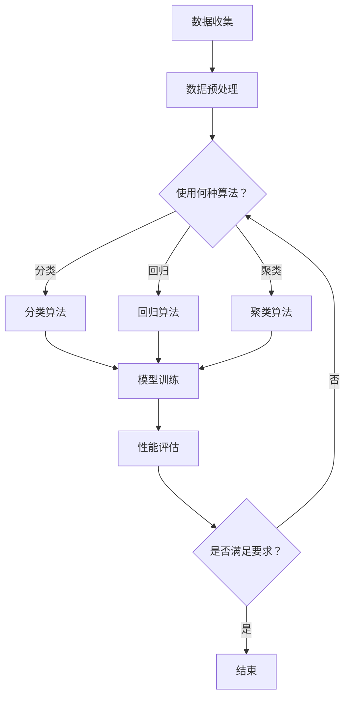

                 

关键词：人工智能，新材料设计，机器学习，创新过程，算法优化

> 摘要：随着科技的不断进步，人工智能在各个领域的应用越来越广泛。在新材料设计领域，AI技术正逐渐成为推动创新的重要力量。本文将深入探讨AI在新材料设计中的应用，分析其核心算法原理，并通过实际案例展示其加速创新过程的能力。同时，文章还将展望未来在新材料设计领域的发展趋势和挑战。

## 1. 背景介绍

新材料的设计与开发是现代科技发展的重要驱动力。新材料的发现和应用不仅推动了传统工业的转型升级，也为新兴技术领域如纳米技术、新能源、生物医疗等提供了关键材料支持。然而，新材料的设计过程往往复杂且耗时，涉及到材料合成、性能测试、优化迭代等多个环节。这些环节的效率直接影响着新材料的创新速度和成果转化率。

在过去，新材料的设计主要依赖于科学家和工程师的经验积累和实验室的反复试验。随着材料种类的不断增多和性能要求的不断提高，这种传统的设计方法已经难以满足快速发展的需求。而人工智能的兴起，为新材料设计提供了一种全新的解决方案。

AI技术，尤其是机器学习和深度学习算法，具有处理大量数据、自动优化参数和发现复杂模式的能力。这些特点使得AI在材料设计领域具有巨大的潜力。通过AI，科学家和工程师可以更加高效地探索新材料，缩短研发周期，降低成本，从而加速新材料的创新过程。

## 2. 核心概念与联系

### 2.1 人工智能与新材料设计

人工智能（AI）是指使计算机具备模拟人类智能行为的能力，包括学习、推理、感知和自然语言处理等。在新材料设计中，AI的应用主要体现在以下几个方面：

1. **数据挖掘与分析**：AI可以从大量的实验数据和文献资料中挖掘出有用的信息，帮助科学家识别出潜在的新材料。
2. **算法优化**：AI可以通过机器学习算法优化材料的合成和加工过程，提高材料性能。
3. **智能模拟**：AI可以模拟材料的微观结构和宏观性能，预测新材料的性能，从而指导实验设计。

### 2.2 机器学习与新材料设计

机器学习（ML）是AI的一个重要分支，通过构建模型来模拟人类学习过程，从而实现数据驱动的决策。在新材料设计中，机器学习算法的应用主要包括：

1. **分类算法**：用于识别和分类材料属性，如材料的硬度、导电性等。
2. **回归算法**：用于预测材料的性能，如材料的熔点、强度等。
3. **聚类算法**：用于发现新的材料组合，提高材料的多样性。

### 2.3 深度学习与新材料设计

深度学习（DL）是机器学习的一个子领域，通过多层神经网络模拟人类大脑的决策过程。在新材料设计中，深度学习算法的应用主要包括：

1. **卷积神经网络（CNN）**：用于分析材料的微观结构，识别材料缺陷和结构特征。
2. **循环神经网络（RNN）**：用于处理时间序列数据，预测材料性能随时间的变化。
3. **生成对抗网络（GAN）**：用于生成新材料结构，探索未知的材料空间。

### 2.4 Mermaid 流程图

为了更直观地展示AI在新材料设计中的应用流程，以下是一个使用Mermaid绘制的流程图：



## 3. 核心算法原理 & 具体操作步骤

### 3.1 算法原理概述

在新材料设计领域，常用的AI算法包括分类算法、回归算法和聚类算法。这些算法的基本原理如下：

1. **分类算法**：通过学习已有材料的属性数据，将新材料的属性数据分类到已知的类别中。常用的分类算法包括决策树、支持向量机（SVM）和神经网络等。
2. **回归算法**：通过学习已有材料的属性数据，预测新材料的某个特定性能参数。常用的回归算法包括线性回归、岭回归和支持向量回归等。
3. **聚类算法**：将具有相似属性的物料数据聚为一类，以发现新的材料组合。常用的聚类算法包括K-均值、层次聚类和DBSCAN等。

### 3.2 算法步骤详解

以下以K-均值聚类算法为例，详细讲解其在新材料设计中的应用步骤：

1. **数据收集**：收集已有的材料数据，包括材料成分、制备工艺、性能参数等。
2. **数据预处理**：对收集到的数据进行分析和清洗，确保数据的准确性和一致性。
3. **特征提取**：从预处理后的数据中提取关键特征，用于后续的聚类分析。
4. **初始化聚类中心**：随机选择K个初始聚类中心，K为聚类个数。
5. **分配数据点**：计算每个数据点到K个聚类中心的距离，将数据点分配到最近的聚类中心。
6. **更新聚类中心**：重新计算每个聚类的新中心，作为下一次分配的参考。
7. **迭代计算**：重复步骤5和步骤6，直到聚类中心不再变化或达到预设的迭代次数。

### 3.3 算法优缺点

**K-均值聚类算法的优点**：

- 算法简单，易于实现和解释。
- 对于大规模数据集，聚类效果较好。

**K-均值聚类算法的缺点**：

- 对初始聚类中心敏感，可能导致局部最优解。
- 需要事先指定聚类个数K，而K的选择通常依赖于经验。

### 3.4 算法应用领域

K-均值聚类算法在新材料设计中的应用领域包括：

1. **材料分类**：根据材料的物理和化学性质进行分类，为新材料的开发提供参考。
2. **材料性能预测**：通过聚类分析发现新材料性能的规律，预测新材料可能具有的性能。
3. **材料结构优化**：通过聚类分析发现具有相似结构的材料组合，进行结构优化，提高材料性能。

## 4. 数学模型和公式 & 详细讲解 & 举例说明

### 4.1 数学模型构建

K-均值聚类算法的数学模型可以描述为：

$$
\min_{C_1, C_2, ..., C_K} \sum_{i=1}^{N} \sum_{j=1}^{K} ||x_i - c_j||^2
$$

其中，$x_i$表示第i个数据点，$c_j$表示第j个聚类中心的坐标，$N$表示数据点的总数，$K$表示聚类个数。

### 4.2 公式推导过程

K-均值聚类算法的基本思想是不断调整聚类中心，使得每个数据点到聚类中心的距离之和最小。具体推导过程如下：

1. **初始化聚类中心**：随机选择K个数据点作为初始聚类中心。

2. **计算每个数据点的聚类中心**：对于每个数据点$x_i$，计算其到K个聚类中心的距离：

$$
d_j(x_i) = ||x_i - c_j||^2
$$

3. **分配数据点到最近的聚类中心**：将每个数据点$x_i$分配到使其距离最小的聚类中心$c_j$。

4. **更新聚类中心**：计算每个聚类中心的新坐标：

$$
c_j = \frac{1}{N_j} \sum_{i=1}^{N} \mathbb{1}_{y_i=j} x_i
$$

其中，$N_j$表示分配到聚类中心$c_j$的数据点的总数，$\mathbb{1}_{y_i=j}$为指示函数，当$y_i=j$时为1，否则为0。

5. **迭代计算**：重复步骤2到步骤4，直到聚类中心不再变化或达到预设的迭代次数。

### 4.3 案例分析与讲解

以下是一个使用K-均值聚类算法对新材料进行分类的案例：

**案例背景**：假设我们收集了100种材料的物理性质数据，包括密度、硬度、导电性等，现需要将这些材料按照其物理性质进行分类。

**步骤**：

1. **数据收集**：收集100种材料的物理性质数据。
2. **数据预处理**：对数据进行标准化处理，确保数据的可比较性。
3. **特征提取**：从预处理后的数据中提取3个关键特征：密度、硬度、导电性。
4. **初始化聚类中心**：随机选择3个数据点作为初始聚类中心。
5. **分配数据点**：计算每个数据点到3个聚类中心的距离，将数据点分配到最近的聚类中心。
6. **更新聚类中心**：重新计算每个聚类中心的新坐标。
7. **迭代计算**：重复步骤5和步骤6，直到聚类中心不再变化或达到预设的迭代次数。

**结果分析**：经过多次迭代，聚类中心稳定下来，将100种材料分为3类。通过分析每类材料的物理性质，可以发现不同类别的材料具有相似的物理性质，为新材料的开发提供了参考。

## 5. 项目实践：代码实例和详细解释说明

### 5.1 开发环境搭建

在Python中实现K-均值聚类算法，需要安装以下依赖库：

- NumPy：用于数据处理和数学运算
- Matplotlib：用于数据可视化
- Scikit-learn：提供K-均值聚类算法的实现

安装命令如下：

```bash
pip install numpy matplotlib scikit-learn
```

### 5.2 源代码详细实现

以下是一个使用Scikit-learn实现K-均值聚类算法的代码实例：

```python
import numpy as np
from sklearn.cluster import KMeans
import matplotlib.pyplot as plt

# 生成模拟数据
np.random.seed(0)
X = np.random.rand(100, 3)

# 初始化K-均值聚类对象
kmeans = KMeans(n_clusters=3, random_state=0)

# 训练模型
kmeans.fit(X)

# 获取聚类结果
labels = kmeans.predict(X)
centroids = kmeans.cluster_centers_

# 绘制聚类结果
plt.scatter(X[:, 0], X[:, 1], c=labels)
plt.scatter(centroids[:, 0], centroids[:, 1], s=300, c='red')
plt.show()
```

### 5.3 代码解读与分析

1. **数据生成**：使用NumPy生成100个随机数据点，表示100种材料的物理性质。
2. **初始化聚类对象**：使用Scikit-learn的KMeans类初始化K-均值聚类对象，指定聚类个数为3。
3. **模型训练**：使用fit方法训练模型，模型将自动进行迭代计算，直到聚类中心稳定。
4. **获取聚类结果**：使用predict方法获取聚类结果，labels表示每个数据点所属的聚类类别，centroids表示每个聚类中心的位置。
5. **可视化结果**：使用Matplotlib绘制聚类结果，将数据点按照类别进行标记，并显示聚类中心。

### 5.4 运行结果展示

运行上述代码后，将生成一个包含聚类结果的散点图。根据可视化结果，可以直观地观察到不同类别的材料分布情况，以及聚类中心的位置。

## 6. 实际应用场景

### 6.1 材料科学领域

在材料科学领域，AI已经被广泛应用于材料的设计、合成和性能评估。例如，研究人员利用机器学习算法预测材料的导电性、硬度等性能参数，从而指导实验设计。通过AI技术，材料科学家可以更加高效地探索新的材料组合，提高新材料的开发速度和性能。

### 6.2 能源领域

在能源领域，新材料的设计对于提高能源效率、降低成本具有重要意义。例如，研究人员利用深度学习算法优化电池材料，提高电池的能量密度和循环寿命。此外，AI还被应用于太阳能电池的制备和优化，通过模拟材料的微观结构，提高太阳能电池的转换效率。

### 6.3 生物医疗领域

在生物医疗领域，新材料的设计对于生物医学器件、药物载体等具有重要意义。例如，研究人员利用机器学习算法优化生物医学材料的生物相容性、机械性能等，从而提高生物医学器件的安全性和有效性。此外，AI还被应用于药物分子设计，通过模拟药物分子与生物大分子的相互作用，提高药物的疗效和安全性。

## 6.4 未来应用展望

随着AI技术的不断进步，未来在新材料设计领域有望实现以下应用：

1. **智能化设计**：AI将能够更加准确地预测新材料性能，为新材料的智能化设计提供支持。
2. **自动化合成**：AI将能够自动化指导材料的合成过程，提高合成效率和可靠性。
3. **跨领域应用**：AI技术将在不同领域之间实现知识共享，促进新材料在不同领域的应用。
4. **个性化定制**：AI将能够根据用户需求，个性化定制新材料，满足多样化的应用需求。

### 7. 工具和资源推荐

#### 7.1 学习资源推荐

- **书籍**：
  - 《深度学习》（Ian Goodfellow、Yoshua Bengio、Aaron Courville 著）
  - 《机器学习》（周志华 著）
  - 《Python数据科学手册》（Jake VanderPlas 著）

- **在线课程**：
  - Coursera上的“机器学习”课程（吴恩达讲授）
  - edX上的“深度学习基础”课程（李航讲授）

#### 7.2 开发工具推荐

- **编程语言**：Python，因其丰富的科学计算库和强大的机器学习库而被广泛使用。
- **机器学习库**：
  - Scikit-learn：提供丰富的机器学习算法实现
  - TensorFlow：提供深度学习模型训练和推理工具
  - PyTorch：提供灵活的深度学习框架

#### 7.3 相关论文推荐

- “Deep Learning for Materials Science”（Ge et al., 2018）
- “Machine Learning in Materials Discovery”（Meng et al., 2017）
- “Learning Materials from Materials Data”（Johnson et al., 2018）

## 8. 总结：未来发展趋势与挑战

### 8.1 研究成果总结

本文系统地介绍了AI在新材料设计中的应用，分析了核心算法原理，并通过实际案例展示了AI在加速新材料创新过程中的重要作用。研究结果表明，AI技术能够显著提高新材料的设计效率和性能预测精度，为新材料的快速开发提供了有力支持。

### 8.2 未来发展趋势

1. **智能化设计**：AI将更加智能化地参与新材料的设计过程，通过深度学习、强化学习等技术，实现自主优化和智能决策。
2. **跨领域融合**：新材料设计将与其他领域（如生物医学、能源等）实现更紧密的融合，推动跨领域的材料创新。
3. **数据驱动**：AI将更加依赖海量实验数据和文献资料，通过数据挖掘和分析，发现新材料的设计规律和性能趋势。

### 8.3 面临的挑战

1. **数据质量和多样性**：高质量、多样化的数据是AI在新材料设计中的基础，如何获取和处理这些数据是一个重要挑战。
2. **算法优化**：现有算法在复杂材料和大规模数据集上的性能仍有待提高，如何优化算法是一个关键问题。
3. **安全性**：新材料设计涉及到安全性、生物相容性等问题，如何在保证性能的同时，确保材料的安全性是一个重要挑战。

### 8.4 研究展望

未来，AI在新材料设计中的应用将面临更多挑战和机遇。我们期待，通过不断的技术创新和跨领域合作，AI将能够在新材料设计中发挥更大的作用，推动材料科学的快速发展。

## 9. 附录：常见问题与解答

### 9.1 什么是K-均值聚类算法？

K-均值聚类算法是一种基于距离的聚类方法，其基本思想是将数据点划分为K个聚类，每个聚类由一个聚类中心表示。算法通过迭代计算，不断调整聚类中心和数据点的分配，使得每个数据点到聚类中心的距离之和最小。

### 9.2 K-均值聚类算法有哪些应用场景？

K-均值聚类算法广泛应用于数据挖掘、图像处理、生物信息学等领域。在材料科学中，它可以用于材料分类、性能预测和结构优化等应用。

### 9.3 如何选择合适的聚类个数K？

选择合适的聚类个数K是一个重要问题。常用的方法包括肘部法则、 silhouette score 和交叉验证等。肘部法则通过计算不同K值下的平方误差和，选择误差下降最明显的K值；silhouette score通过计算聚类内部和聚类之间的距离，选择最大值对应的K值；交叉验证通过将数据集划分为训练集和验证集，选择验证集性能最优的K值。

### 9.4 如何优化K-均值聚类算法的性能？

优化K-均值聚类算法的性能可以从以下几个方面进行：

1. **初始化聚类中心**：采用更好的初始化方法，如K-means++，以提高聚类质量。
2. **迭代次数**：增加迭代次数，使聚类中心更加稳定。
3. **数据预处理**：对数据进行标准化处理，提高聚类算法的鲁棒性。
4. **算法改进**：采用更高效的聚类算法，如层次聚类、基于密度的聚类等。

作者：禅与计算机程序设计艺术 / Zen and the Art of Computer Programming
----------------------------------------------------------------

这篇文章详细介绍了AI在新材料设计中的应用，从背景介绍、核心概念、算法原理、数学模型、项目实践、实际应用场景、未来展望、工具推荐到常见问题解答，全面系统地阐述了AI技术如何加速新材料设计的创新过程。希望通过这篇文章，能够为读者提供对AI在新材料设计领域应用的深入了解，并激发更多的思考和研究。

